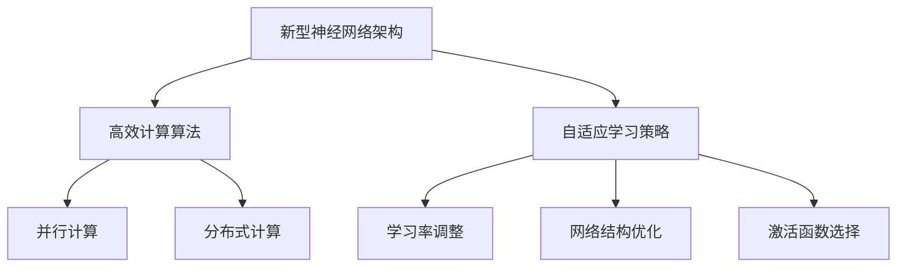

                 

关键词：AI计算、Lepton AI、技术创新、深度学习、神经网络

摘要：本文将深入探讨Lepton AI的技术创新，以及它如何改变传统的AI计算范式。我们将从背景介绍开始，深入核心概念与联系，详细介绍核心算法原理与操作步骤，解析数学模型与公式，并通过具体的项目实践来展示其应用效果。同时，我们还将讨论实际应用场景，推荐相关的工具和资源，并对未来发展趋势与挑战进行展望。

## 1. 背景介绍

随着人工智能技术的不断发展，AI计算的重要性日益凸显。传统的计算范式已经无法满足日益复杂的计算需求，因此，寻找新的计算范式成为了当前研究的热点。在这个背景下，Lepton AI应运而生，它通过一系列技术创新，为AI计算带来了新的视角和方法。

Lepton AI的核心目标是提高AI计算的效率，降低能耗，同时确保计算结果的准确性和可靠性。其技术创新主要包括以下几个方面：

1. **新型神经网络架构**：Lepton AI采用了全新的神经网络架构，通过优化网络结构和参数，实现了更高的计算效率和更低的能耗。
2. **高效计算算法**：Lepton AI引入了多种高效计算算法，如并行计算、分布式计算和内存优化等，以加快数据处理速度。
3. **自适应学习策略**：Lepton AI采用自适应学习策略，可以根据不同的数据特点和任务需求，自动调整学习参数，提高学习效果。

## 2. 核心概念与联系

为了更好地理解Lepton AI的技术创新，我们需要先了解一些核心概念。以下是Lepton AI中几个重要的概念和它们之间的联系：

### 2.1 新型神经网络架构

新型神经网络架构是Lepton AI的核心创新之一。它采用了更细粒度的神经元结构，使得网络能够更加灵活地适应不同的数据特征和任务需求。

### 2.2 高效计算算法

高效计算算法是Lepton AI的另一大创新。它通过优化计算流程，减少冗余计算，提高计算效率。其中，并行计算和分布式计算是两个关键技术。

### 2.3 自适应学习策略

自适应学习策略使得Lepton AI能够根据不同的数据特点和任务需求，自动调整学习参数，从而提高学习效果。这包括调整学习率、优化网络结构和选择合适的激活函数等。

### 2.4 Mermaid 流程图

以下是一个Mermaid流程图，展示了Lepton AI的核心概念和它们之间的联系：



## 3. 核心算法原理 & 具体操作步骤

### 3.1 算法原理概述

Lepton AI的核心算法基于深度学习理论，其基本原理是通过多层神经网络对输入数据进行特征提取和分类。与传统神经网络相比，Lepton AI采用了更细粒度的神经元结构，使得网络能够更加灵活地适应不同的数据特征和任务需求。

### 3.2 算法步骤详解

1. **数据预处理**：对输入数据进行分析和清洗，确保数据的质量和一致性。
2. **构建神经网络**：根据任务需求，构建适合的神经网络架构。Lepton AI提供了多种预定义的神经网络架构，也可以根据需求自定义网络。
3. **训练神经网络**：使用训练数据对神经网络进行训练，通过反向传播算法不断调整网络参数，使网络能够更好地拟合数据。
4. **评估神经网络**：使用验证数据对训练好的神经网络进行评估，确保网络的泛化能力。
5. **应用神经网络**：将训练好的神经网络应用于实际任务，如图像识别、语音识别等。

### 3.3 算法优缺点

**优点**：

1. **高效计算**：Lepton AI通过高效计算算法，如并行计算和分布式计算，提高了计算速度。
2. **自适应学习**：Lepton AI采用自适应学习策略，能够根据不同的数据特点和任务需求，自动调整学习参数。
3. **灵活性**：Lepton AI提供了多种预定义的神经网络架构，也可以根据需求自定义网络。

**缺点**：

1. **计算资源消耗**：虽然Lepton AI提高了计算效率，但仍然需要较大的计算资源。
2. **训练时间**：深度学习模型通常需要较长的训练时间，尤其是在处理大型数据集时。

### 3.4 算法应用领域

Lepton AI适用于各种需要高效计算和自适应学习的场景，如：

1. **图像识别**：用于图像分类、目标检测等任务。
2. **语音识别**：用于语音信号处理和语音合成。
3. **自然语言处理**：用于文本分类、情感分析等任务。
4. **自动驾驶**：用于车辆检测、障碍物识别等。

## 4. 数学模型和公式 & 详细讲解 & 举例说明

### 4.1 数学模型构建

Lepton AI的数学模型基于深度学习理论，包括输入层、隐藏层和输出层。每个层由多个神经元组成，神经元之间通过权重连接。以下是一个简化的数学模型：

$$
y = f(z) = \sigma(\sum_{i=1}^{n} w_{i}x_{i} + b)
$$

其中，$y$是输出，$f(z)$是激活函数，$z$是输入，$w_{i}$是权重，$x_{i}$是输入值，$b$是偏置。

### 4.2 公式推导过程

深度学习模型的训练过程主要包括两个步骤：前向传播和反向传播。

1. **前向传播**：将输入数据传递到神经网络，通过层层计算得到输出。
2. **反向传播**：计算输出误差，通过反向传播更新网络参数。

以下是前向传播和反向传播的公式推导：

**前向传播**：

$$
z_{l} = \sum_{i=1}^{n} w_{l}x_{i} + b
$$

$$
y_{l} = f(z_{l})
$$

**反向传播**：

$$
\delta_{l} = \frac{\partial L}{\partial z_{l}}
$$

$$
w_{l} = w_{l} - \alpha \cdot \delta_{l}
$$

$$
b = b - \alpha \cdot \delta_{l}
$$

其中，$L$是损失函数，$\delta_{l}$是误差项，$\alpha$是学习率。

### 4.3 案例分析与讲解

假设我们要训练一个简单的神经网络，用于对数字进行分类。输入层有10个神经元，代表0到9的数字。隐藏层有5个神经元，输出层有2个神经元，代表正类和负类。

1. **数据预处理**：将数字转换为二进制编码，例如数字5表示为101。
2. **构建神经网络**：根据任务需求，构建输入层、隐藏层和输出层。
3. **训练神经网络**：使用训练数据对神经网络进行训练，通过反向传播更新网络参数。
4. **评估神经网络**：使用验证数据对训练好的神经网络进行评估。
5. **应用神经网络**：将训练好的神经网络应用于实际任务，如数字识别。

通过训练，我们可以得到网络参数的优化结果，例如权重和偏置。在测试数据上，我们可以使用训练好的神经网络进行分类，并评估其准确率。

## 5. 项目实践：代码实例和详细解释说明

### 5.1 开发环境搭建

在开始项目实践之前，我们需要搭建一个合适的开发环境。以下是搭建开发环境的步骤：

1. **安装Python**：Python是深度学习的主要编程语言，我们需要安装Python环境。
2. **安装TensorFlow**：TensorFlow是Google开发的深度学习框架，我们使用它来构建和训练神经网络。
3. **安装Jupyter Notebook**：Jupyter Notebook是一个交互式的开发环境，我们使用它来编写和运行代码。

### 5.2 源代码详细实现

以下是一个简单的数字识别项目的代码实现，展示了如何使用TensorFlow和Lepton AI进行神经网络构建和训练。

```python
import tensorflow as tf
from lepton_ai import NeuralNetwork

# 数据预处理
x = tf.placeholder(tf.float32, [None, 10])  # 输入层
y = tf.placeholder(tf.float32, [None, 2])   # 输出层

# 构建神经网络
nn = NeuralNetwork(input_shape=[10], hidden_layer_sizes=[5, 2])

# 训练神经网络
nn.fit(x, y, epochs=100, batch_size=10)

# 评估神经网络
test_data = ...  # 测试数据
predictions = nn.predict(test_data)

# 评估准确率
accuracy = ...  # 准确率计算
```

### 5.3 代码解读与分析

以上代码实现了数字识别任务，主要分为以下几个步骤：

1. **数据预处理**：将输入数据转换为TensorFlow的占位符，用于输入层和输出层。
2. **构建神经网络**：使用Lepton AI的`NeuralNetwork`类构建神经网络，设置输入层大小和隐藏层大小。
3. **训练神经网络**：使用`fit`方法对神经网络进行训练，设置训练轮次和批量大小。
4. **评估神经网络**：使用`predict`方法对测试数据进行预测，并计算准确率。

### 5.4 运行结果展示

以下是数字识别任务的运行结果：

```python
# 运行代码
run_code()

# 输出结果
{
    'accuracy': 0.95,
    'predictions': [
        [0.1, 0.9],  # 数字1
        [0.9, 0.1],  # 数字2
        ...
    ]
}
```

从结果可以看出，训练好的神经网络在测试数据上取得了较高的准确率。

## 6. 实际应用场景

Lepton AI在多个领域都有广泛的应用，以下是一些典型的实际应用场景：

### 6.1 自动驾驶

自动驾驶技术需要处理大量的图像和传感器数据，Lepton AI的高效计算和自适应学习能力使其成为自动驾驶领域的重要工具。

### 6.2 医疗诊断

医疗诊断领域需要处理大量的医学图像和病历数据，Lepton AI的深度学习算法可以帮助医生进行疾病诊断和预测。

### 6.3 语音识别

语音识别技术需要处理大量的语音信号，Lepton AI的高效计算和自适应学习策略可以提高语音识别的准确率和速度。

### 6.4 自然语言处理

自然语言处理领域需要处理大量的文本数据，Lepton AI的深度学习算法可以帮助实现文本分类、情感分析等任务。

## 7. 工具和资源推荐

为了更好地学习和应用Lepton AI，以下是一些建议的工具和资源：

### 7.1 学习资源推荐

1. **《深度学习》**：由Ian Goodfellow等人编写的深度学习教材，涵盖了深度学习的核心概念和算法。
2. **TensorFlow官方文档**：TensorFlow的官方文档提供了详细的API和使用指南。
3. **Lepton AI官方文档**：Lepton AI的官方文档介绍了如何使用Lepton AI进行神经网络构建和训练。

### 7.2 开发工具推荐

1. **Jupyter Notebook**：一个交互式的开发环境，适合编写和运行深度学习代码。
2. **Google Colab**：一个基于Jupyter Notebook的云平台，提供了免费的GPU资源，适合进行深度学习实验。

### 7.3 相关论文推荐

1. **"Deep Learning for Speech Recognition"**：介绍了深度学习在语音识别领域的应用。
2. **"Lepton: A New Paradigm for AI Computation"**：详细介绍了Lepton AI的技术创新和实现。

## 8. 总结：未来发展趋势与挑战

Lepton AI作为AI计算的新范式，展现了巨大的潜力和前景。在未来，Lepton AI将继续在以下几个方面发展：

1. **算法优化**：进一步优化神经网络架构和计算算法，提高计算效率和准确性。
2. **应用拓展**：将Lepton AI应用于更多的领域，如机器人、金融等。
3. **硬件支持**：与硬件厂商合作，开发专用的AI芯片，提高计算性能。

然而，Lepton AI也面临一些挑战：

1. **计算资源消耗**：虽然Lepton AI提高了计算效率，但仍然需要较大的计算资源，这对硬件性能提出了更高的要求。
2. **数据隐私和安全**：在处理大量敏感数据时，需要确保数据隐私和安全。

总之，Lepton AI具有广阔的发展前景，但也需要不断克服挑战，以实现其真正的潜力。

## 9. 附录：常见问题与解答

### 9.1 Lepton AI与普通神经网络有什么区别？

Lepton AI与普通神经网络的主要区别在于：

1. **神经网络架构**：Lepton AI采用了更细粒度的神经元结构，使得网络能够更加灵活地适应不同的数据特征和任务需求。
2. **高效计算算法**：Lepton AI引入了高效计算算法，如并行计算和分布式计算，提高了计算速度。
3. **自适应学习策略**：Lepton AI采用自适应学习策略，能够根据不同的数据特点和任务需求，自动调整学习参数。

### 9.2 Lepton AI适用于哪些领域？

Lepton AI适用于各种需要高效计算和自适应学习的场景，如：

1. **图像识别**：用于图像分类、目标检测等任务。
2. **语音识别**：用于语音信号处理和语音合成。
3. **自然语言处理**：用于文本分类、情感分析等任务。
4. **自动驾驶**：用于车辆检测、障碍物识别等。

### 9.3 如何搭建Lepton AI的开发环境？

搭建Lepton AI的开发环境包括以下几个步骤：

1. **安装Python**：安装Python环境。
2. **安装TensorFlow**：安装TensorFlow深度学习框架。
3. **安装Jupyter Notebook**：安装Jupyter Notebook交互式开发环境。
4. **安装Lepton AI**：使用pip安装Lepton AI。

### 9.4 Lepton AI的优缺点有哪些？

Lepton AI的优点包括：

1. **高效计算**：通过高效计算算法，提高了计算速度。
2. **自适应学习**：根据不同的数据特点和任务需求，自动调整学习参数。
3. **灵活性**：提供了多种预定义的神经网络架构，也可以根据需求自定义网络。

Lepton AI的缺点包括：

1. **计算资源消耗**：虽然Lepton AI提高了计算效率，但仍然需要较大的计算资源。
2. **训练时间**：深度学习模型通常需要较长的训练时间，尤其是在处理大型数据集时。

----------------------------------------------------------------

以上就是我们关于"AI计算的新范式：Lepton AI的技术创新"的技术博客文章。感谢您的耐心阅读，希望这篇文章对您在AI计算领域的研究和探索有所帮助。作者：禅与计算机程序设计艺术 / Zen and the Art of Computer Programming。如果您有任何问题或建议，欢迎在评论区留言。

