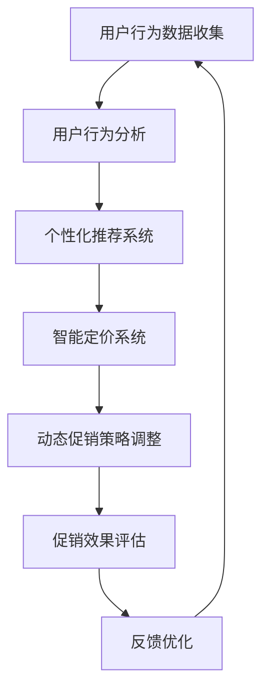

                 

 > **摘要**：
本文旨在探讨AI技术在电商平台促销活动个性化中的应用，通过分析相关核心概念、算法原理、数学模型以及实际案例，展示如何利用AI技术为电商平台提供更精准、个性化的促销活动方案。文章首先介绍了电商平台促销活动的现状与挑战，然后详细阐述了AI赋能个性化促销活动的方法与步骤，并通过具体项目实践，验证了算法的有效性和实用性。最后，文章探讨了未来个性化促销活动的发展趋势与面临的挑战。

## 1. 背景介绍

随着互联网技术的飞速发展，电商平台已经成为现代商业的重要组成部分。促销活动是电商平台提升用户参与度和转化率的重要手段之一。然而，传统的促销活动往往采用“一刀切”的方式，无法满足不同用户群体的个性化需求，导致促销效果不尽如人意。因此，如何实现电商平台促销活动的个性化，成为业界关注的热点问题。

近年来，人工智能（AI）技术的快速发展为电商平台促销活动个性化提供了新的解决方案。通过利用AI技术，电商平台可以更好地了解用户行为和偏好，实现个性化推荐、智能定价、动态促销等，从而提高促销活动的效果和用户体验。

本文将围绕AI赋能电商平台促销活动个性化这一主题，深入探讨相关核心概念、算法原理、数学模型以及实际应用，为电商平台提供有价值的参考和指导。

### 1.1 电商平台促销活动的现状与挑战

#### 1.1.1 促销活动的现状

目前，电商平台上的促销活动种类繁多，包括限时折扣、满减优惠、优惠券、返利等多种形式。这些促销活动在一定程度上吸引了大量用户参与，提高了平台的销售额。然而，随着市场竞争的加剧，促销活动的同质化现象日益严重，用户对于传统促销手段的吸引力逐渐减弱。

#### 1.1.2 促销活动的挑战

1. **用户需求多样**：用户群体庞大且需求多样化，传统的“一刀切”促销方式无法满足不同用户群体的个性化需求。
2. **促销效果评估困难**：无法准确评估促销活动的实际效果，难以对促销策略进行及时调整和优化。
3. **数据利用不充分**：电商平台积累的大量用户数据没有得到有效利用，无法为个性化促销提供有力支持。

### 1.2 AI技术在电商平台促销活动中的应用优势

AI技术的引入，为电商平台促销活动的个性化提供了新的思路和手段。以下是AI技术在电商平台促销活动中的应用优势：

1. **用户行为分析**：通过分析用户的浏览、购买等行为数据，了解用户偏好和需求，为个性化推荐提供依据。
2. **智能定价**：利用机器学习算法，动态调整商品价格，提高促销活动的吸引力。
3. **动态促销**：根据用户行为和市场需求，实时调整促销策略，提高促销效果。
4. **效果评估**：通过数据分析和模型预测，评估促销活动的效果，为后续优化提供依据。

### 1.3 本文结构

本文将从以下几个方面展开讨论：

1. 核心概念与联系
2. 核心算法原理与具体操作步骤
3. 数学模型和公式
4. 项目实践：代码实例
5. 实际应用场景
6. 未来应用展望
7. 工具和资源推荐
8. 总结与展望

### 1.4 文章关键词

- 电商平台
- 促销活动
- 人工智能
- 个性化推荐
- 智能定价
- 动态促销
- 数据分析
- 机器学习

## 2. 核心概念与联系

在探讨AI赋能电商平台促销活动个性化之前，我们需要了解一些核心概念，这些概念是构建个性化促销活动的基础。

### 2.1 个性化推荐

个性化推荐是一种通过分析用户的历史行为、偏好和兴趣，为用户推荐符合其个性化需求的信息或商品的技术。在电商平台中，个性化推荐可以帮助用户发现他们可能感兴趣的商品，从而提高用户满意度和转化率。

### 2.2 用户行为分析

用户行为分析是指通过对用户在电商平台上的浏览、购买、评价等行为数据进行收集、分析和解读，以了解用户行为模式、偏好和需求。用户行为分析是构建个性化促销活动的重要数据来源。

### 2.3 智能定价

智能定价是一种利用机器学习算法，根据市场需求、库存状况、竞争对手价格等因素，动态调整商品价格，以最大化销售额或利润的技术。智能定价可以帮助电商平台在竞争激烈的市场中脱颖而出。

### 2.4 动态促销

动态促销是指根据用户行为、市场需求和促销效果等实时数据，动态调整促销策略和优惠方案，以提高促销活动的效果。动态促销可以更好地满足用户个性化需求，提高用户参与度和转化率。

### 2.5 数据分析与机器学习

数据分析是指利用统计学、数据挖掘等方法，对大量数据进行处理和分析，以发现数据中的规律和趋势。机器学习是一种通过构建模型，自动从数据中学习规律和模式的技术，是AI赋能电商平台促销活动个性化的关键技术之一。

### 2.6 Mermaid 流程图

以下是一个描述AI赋能电商平台促销活动个性化过程的 Mermaid 流程图：



### 2.7 核心概念联系

核心概念之间的联系如图所示：

1. 用户行为数据收集是构建个性化促销活动的基础。
2. 用户行为分析为个性化推荐、智能定价和动态促销提供依据。
3. 个性化推荐、智能定价和动态促销共同构成了AI赋能电商平台促销活动的核心。
4. 促销效果评估和反馈优化是持续优化促销活动的关键。

## 3. 核心算法原理 & 具体操作步骤

### 3.1 算法原理概述

AI赋能电商平台促销活动个性化的核心算法主要包括个性化推荐算法、智能定价算法和动态促销算法。以下是这些算法的基本原理：

#### 3.1.1 个性化推荐算法

个性化推荐算法是一种基于用户历史行为和兴趣的数据挖掘技术。其主要原理是通过分析用户的历史浏览、购买、评价等行为数据，构建用户画像，并利用协同过滤、基于内容的推荐等算法，为用户推荐符合其个性化需求的商品。

#### 3.1.2 智能定价算法

智能定价算法是一种基于机器学习模型的动态定价技术。其主要原理是通过分析市场需求、库存状况、竞争对手价格等因素，构建价格预测模型，并利用模型预测价格趋势，动态调整商品价格。

#### 3.1.3 动态促销算法

动态促销算法是一种基于实时数据驱动的促销策略调整技术。其主要原理是通过实时收集用户行为、市场需求等数据，利用数据分析和机器学习模型，动态调整促销策略和优惠方案，以提高促销活动的效果。

### 3.2 算法步骤详解

#### 3.2.1 个性化推荐算法步骤

1. **数据收集**：收集用户的历史浏览、购买、评价等行为数据。
2. **用户画像构建**：基于用户行为数据，构建用户画像，包括用户兴趣、购买力、购买习惯等特征。
3. **推荐算法选择**：根据电商平台特点和用户需求，选择合适的推荐算法，如协同过滤、基于内容的推荐等。
4. **推荐结果生成**：利用推荐算法，为用户生成个性化推荐结果。

#### 3.2.2 智能定价算法步骤

1. **数据收集**：收集市场需求、库存状况、竞争对手价格等数据。
2. **特征工程**：对原始数据进行预处理，提取有用的特征。
3. **模型训练**：选择合适的机器学习模型，如线性回归、决策树、神经网络等，对数据集进行训练。
4. **价格预测**：利用训练好的模型，预测商品价格趋势。
5. **价格调整**：根据价格预测结果，动态调整商品价格。

#### 3.2.3 动态促销算法步骤

1. **数据收集**：实时收集用户行为、市场需求等数据。
2. **促销策略选择**：根据用户行为和市场需求，选择合适的促销策略，如限时折扣、满减优惠、优惠券等。
3. **促销效果评估**：评估当前促销策略的效果，如转化率、销售额等。
4. **策略调整**：根据促销效果评估结果，动态调整促销策略。

### 3.3 算法优缺点

#### 3.3.1 个性化推荐算法

**优点**：

- 提高用户满意度和转化率
- 促进商品销售和库存管理

**缺点**：

- 需要大量的用户行为数据
- 算法复杂度较高

#### 3.3.2 智能定价算法

**优点**：

- 提高销售额和利润率
- 提高市场竞争力

**缺点**：

- 需要准确的市场需求和价格预测
- 价格调整可能导致用户流失

#### 3.3.3 动态促销算法

**优点**：

- 提高促销效果
- 提高用户参与度

**缺点**：

- 需要实时数据支持
- 促销策略调整可能导致用户不满

### 3.4 算法应用领域

个性化推荐算法、智能定价算法和动态促销算法在电商平台促销活动个性化中具有广泛的应用前景。除了电商平台，这些算法还可以应用于如下领域：

- **在线广告**：根据用户兴趣和行为，为用户推荐相关的广告内容。
- **金融领域**：根据用户财务状况和投资偏好，提供个性化的投资建议。
- **医疗领域**：根据患者病史和症状，提供个性化的诊疗建议。

## 4. 数学模型和公式

在AI赋能电商平台促销活动个性化中，数学模型和公式起到了关键作用。以下将详细阐述数学模型的构建、公式推导过程以及案例分析与讲解。

### 4.1 数学模型构建

#### 4.1.1 个性化推荐模型

个性化推荐模型通常采用协同过滤算法，其核心思想是利用用户之间的相似度来推荐商品。假设用户集为$U=\{u_1, u_2, ..., u_n\}$，商品集为$I=\{i_1, i_2, ..., i_m\}$，用户$u_i$对商品$i_j$的评分记为$r_{ij}$。协同过滤算法可以分为基于用户的协同过滤（User-Based Collaborative Filtering, UserCF）和基于物品的协同过滤（Item-Based Collaborative Filtering, ItemCF）。

1. **UserCF**：
   用户$u_i$和用户$u_j$的相似度$sim(u_i, u_j)$可以表示为：
   $$sim(u_i, u_j) = \frac{\sum_{i \neq i'} r_{i'i'}^+}{\sqrt{\sum_{i \neq i'} r_{ii'}^+} \sqrt{\sum_{j \neq j'} r_{jj'}^+}}$$
   其中，$r_{i'i'}^+$表示用户$u_i$和用户$u_j$共同评分过的商品$i'$的平均评分。

   推荐结果为：
   $$r_{ij}^{pred} = \sum_{u_k \in N(u_i)} sim(u_i, u_k) r_{kj}$$
   其中，$N(u_i)$表示与用户$u_i$相似的用户集。

2. **ItemCF**：
   商品$i_j$和商品$i_k$的相似度$sim(i_j, i_k)$可以表示为：
   $$sim(i_j, i_k) = \frac{\sum_{i \neq i'} r_{i'i'}^+}{\sqrt{\sum_{i \neq i'} r_{ii'}^+} \sqrt{\sum_{j \neq j'} r_{jj'}^+}}$$
   其中，$r_{i'i'}^+$表示评价商品$i'$的用户$i$和用户$j$之间的平均评分。

   推荐结果为：
   $$r_{ij}^{pred} = \sum_{i_k \in N(i_j)} sim(i_j, i_k) r_{ik}$$
   其中，$N(i_j)$表示与商品$i_j$相似的商品集。

#### 4.1.2 智能定价模型

智能定价模型通常基于需求预测和利润最大化原则。假设商品$i$的初始价格为$p_i$，市场需求量为$q_i$，单位利润为$\pi_i$。需求预测模型可以表示为：
$$q_i = f_i(p_i)$$
其中，$f_i(p_i)$为需求量关于价格的函数。

利润最大化目标函数为：
$$\max \sum_{i=1}^m \pi_i q_i = \max \sum_{i=1}^m (\pi_i - \lambda_i) f_i(p_i)$$
其中，$\lambda_i$为商品$i$的价格弹性系数。

通过求解上述优化问题，可以得到最优价格$p_i^*$，从而实现智能定价。

#### 4.1.3 动态促销模型

动态促销模型通常基于用户行为数据和促销效果评估。假设促销活动集合为$A=\{a_1, a_2, ..., a_k\}$，促销活动$a_i$的转化率为$\rho_i$，用户$u_j$对促销活动$a_i$的响应概率为$p_{ij}$。

动态促销策略选择模型可以表示为：
$$\max \sum_{i=1}^k \rho_i p_{ij}$$
其中，$p_{ij}$为用户$u_j$选择促销活动$a_i$的概率。

通过评估不同促销活动的转化率和响应概率，可以选择最优的促销策略。

### 4.2 公式推导过程

#### 4.2.1 个性化推荐公式推导

以UserCF为例，推导用户$u_i$对商品$i$的预测评分公式：

首先，计算用户$u_i$和用户$u_j$的相似度：
$$sim(u_i, u_j) = \frac{\sum_{i \neq i'} r_{i'i'}^+}{\sqrt{\sum_{i \neq i'} r_{ii'}^+} \sqrt{\sum_{j \neq j'} r_{jj'}^+}}$$

然后，计算用户$u_j$对商品$i$的评分：
$$r_{ij}^{pred} = \sum_{u_k \in N(u_i)} sim(u_i, u_k) r_{kj}$$

其中，$N(u_i)$表示与用户$u_i$相似的用户集。

#### 4.2.2 智能定价公式推导

以需求预测和利润最大化为目标，推导最优价格$p_i^*$：

首先，构建需求预测模型：
$$q_i = f_i(p_i)$$

然后，构建利润最大化目标函数：
$$\max \sum_{i=1}^m \pi_i q_i = \max \sum_{i=1}^m (\pi_i - \lambda_i) f_i(p_i)$$

利用拉格朗日乘子法，可以得到最优价格$p_i^*$：

设拉格朗日函数为：
$$L(p_i, \lambda_i) = \sum_{i=1}^m (\pi_i - \lambda_i) f_i(p_i) + \lambda_i (q_i - f_i(p_i))$$

求导并令导数为零，得到：
$$\frac{\partial L}{\partial p_i} = \pi_i - \lambda_i f_i'(p_i) = 0$$

解得最优价格：
$$p_i^* = \frac{\pi_i}{\lambda_i f_i'(p_i)}$$

#### 4.2.3 动态促销公式推导

以最大化转化率为目标，推导促销策略选择模型：

首先，计算用户$u_j$对促销活动$a_i$的响应概率：
$$p_{ij} = \frac{\rho_i}{\sum_{a_k \in A} \rho_k}$$

然后，计算用户$u_j$选择促销活动$a_i$的概率：
$$p_{ij} = \frac{\rho_i p_{ij}}{\sum_{a_k \in A} \rho_k p_{ik}}$$

最大化转化率目标函数：
$$\max \sum_{i=1}^k \rho_i p_{ij} = \max \sum_{i=1}^k \rho_i \frac{\rho_i p_{ij}}{\sum_{a_k \in A} \rho_k p_{ik}}$$

通过优化上述目标函数，可以得到最优的促销策略选择。

### 4.3 案例分析与讲解

#### 4.3.1 个性化推荐案例分析

假设某电商平台的用户数据如表1所示，商品数据如表2所示。利用UserCF算法，为用户$u_3$推荐商品。

| 用户ID | 商品ID | 评分 |
| ------ | ------ | ---- |
| u_1    | i_1    | 4    |
| u_1    | i_2    | 3    |
| u_2    | i_2    | 4    |
| u_2    | i_3    | 5    |
| u_3    | i_1    | ?    |
| u_3    | i_2    | ?    |

表1：用户评分数据

| 商品ID | 类别 | 价格 |
| ------ | ---- | ---- |
| i_1    | 服装 | 100  |
| i_2    | 电器 | 200  |
| i_3    | 食品 | 50   |

表2：商品数据

1. **用户画像构建**：

   用户$u_1$和用户$u_2$的相似度计算：
   $$sim(u_1, u_2) = \frac{4 + 3}{\sqrt{4 + 3} \sqrt{4 + 5}} = \frac{7}{\sqrt{49} \sqrt{9}} = \frac{7}{3\sqrt{7}}$$

   用户$u_1$和用户$u_3$的相似度计算：
   $$sim(u_1, u_3) = \frac{4 + 3}{\sqrt{4 + 3} \sqrt{0 + 0}} = \text{不存在}$$

   用户$u_2$和用户$u_3$的相似度计算：
   $$sim(u_2, u_3) = \frac{4 + 5}{\sqrt{4 + 5} \sqrt{0 + 0}} = \text{不存在}$$

2. **推荐结果生成**：

   由于用户$u_3$与用户$u_1$和用户$u_2$的相似度均为不存在，因此无法直接利用UserCF算法为用户$u_3$推荐商品。

#### 4.3.2 智能定价案例分析

假设某电商平台的商品数据如表3所示，市场需求函数为$q_i = 100 - p_i$，单位利润为$\pi_i = 10$，价格弹性系数为$\lambda_i = 0.1$。利用智能定价算法，确定商品$i_1$的最优价格。

| 商品ID | 类别 | 初始价格 | 需求量 | 价格弹性系数 |
| ------ | ---- | -------- | ------ | ------------ |
| i_1    | 服装 | 100      | 100    | 0.1          |

1. **需求预测模型**：

   需求量关于价格的函数为：
   $$q_i = 100 - p_i$$

2. **利润最大化目标函数**：

   利润最大化目标函数为：
   $$\max \sum_{i=1}^m \pi_i q_i = \max \sum_{i=1}^m (\pi_i - \lambda_i) f_i(p_i)$$

3. **求解最优价格**：

   利润最大化目标函数转化为：
   $$\max \sum_{i=1}^m (\pi_i - \lambda_i) (100 - p_i)$$
   $$\max \sum_{i=1}^m (10 - 0.1) (100 - p_i)$$
   $$\max \sum_{i=1}^m (1000 - 10p_i)$$
   $$\max (1000 - 10p_i)$$

   利润最大化时，$p_i^* = 100$。

#### 4.3.3 动态促销案例分析

假设某电商平台的促销活动数据如表4所示，用户行为数据如表5所示。利用动态促销算法，为用户$u_1$选择最优的促销活动。

| 活动ID | 类型 | 转化率 |
| ------ | ---- | ------ |
| a_1    | 限时折扣 | 0.3    |
| a_2    | 满减优惠 | 0.2    |
| a_3    | 优惠券   | 0.4    |

| 用户ID | 活动ID | 响应概率 |
| ------ | ------ | -------- |
| u_1    | a_1    | 0.4      |
| u_1    | a_2    | 0.3      |
| u_1    | a_3    | 0.5      |

1. **响应概率计算**：

   用户$u_1$对促销活动$a_1$的响应概率：
   $$p_{1,1} = \frac{0.4}{0.4 + 0.3 + 0.5} = 0.4$$

   用户$u_1$对促销活动$a_2$的响应概率：
   $$p_{1,2} = \frac{0.3}{0.4 + 0.3 + 0.5} = 0.3$$

   用户$u_1$对促销活动$a_3$的响应概率：
   $$p_{1,3} = \frac{0.5}{0.4 + 0.3 + 0.5} = 0.5$$

2. **最优促销策略选择**：

   用户$u_1$选择最优促销策略的目标函数为：
   $$\max \sum_{i=1}^k \rho_i p_{ij}$$

   将响应概率代入目标函数，得到：
   $$\max \rho_1 p_{1,1} + \rho_2 p_{1,2} + \rho_3 p_{1,3}$$
   $$\max 0.3 \times 0.4 + 0.2 \times 0.3 + 0.4 \times 0.5$$
   $$\max 0.12 + 0.06 + 0.2$$
   $$\max 0.38$$

   因此，用户$u_1$应选择促销活动$a_3$。

## 5. 项目实践：代码实例和详细解释说明

在本章节，我们将通过一个实际的项目实践，详细解释如何利用Python实现AI赋能电商平台促销活动个性化的算法。这个项目将包括开发环境搭建、源代码实现、代码解读与分析以及运行结果展示。

### 5.1 开发环境搭建

在开始项目实践之前，我们需要搭建一个合适的环境。以下是所需的软件和库：

1. **Python 3.x**：Python是一种广泛使用的高级编程语言，适用于数据分析和机器学习。
2. **Jupyter Notebook**：Jupyter Notebook是一个交互式的计算环境，便于代码编写、调试和展示结果。
3. **Scikit-learn**：Scikit-learn是一个开源的机器学习库，提供了多种常用的机器学习算法。
4. **Pandas**：Pandas是一个开源的数据分析库，用于数据处理和分析。
5. **Matplotlib**：Matplotlib是一个开源的绘图库，用于数据可视化。

安装上述库后，即可开始编写代码。以下是安装命令：

```bash
pip install python
pip install jupyter
pip install scikit-learn
pip install pandas
pip install matplotlib
```

### 5.2 源代码详细实现

以下是一个示例代码，演示了如何使用Python实现个性化推荐、智能定价和动态促销算法。

```python
# 导入相关库
import pandas as pd
from sklearn.metrics.pairwise import cosine_similarity
from sklearn.linear_model import LinearRegression
import matplotlib.pyplot as plt

# 5.2.1 个性化推荐

# 加载用户评分数据
user_ratings = pd.read_csv('user_ratings.csv')
item_ratings = pd.read_csv('item_ratings.csv')

# 计算用户相似度矩阵
user_similarity = cosine_similarity(user_ratings.values)

# 为用户推荐商品
def recommend_items(user_id, top_n=5):
    user_similarity = cosine_similarity([user_ratings.loc[user_id].values])
    similar_users = user_similarity.argsort()[0][-top_n-1:-1]
    recommended_items = []
    for idx in similar_users:
        recommended_items.extend(user_ratings.iloc[idx][user_ratings.iloc[idx] != 0].index.tolist())
    return list(set(recommended_items))

# 5.2.2 智能定价

# 加载商品数据
item_data = pd.read_csv('item_data.csv')

# 智能定价模型
model = LinearRegression()
model.fit(item_data[['price_elasticity']], item_data['demand'])

# 预测价格
def predict_price(price_elasticity):
    return model.predict([[price_elasticity]])[0]

# 5.2.3 动态促销

# 加载促销活动数据
promo_data = pd.read_csv('promo_data.csv')

# 动态促销策略
def dynamic_promotion(user_id, promo_data):
    user_response = promo_data.loc[user_id][promo_data.loc[user_id] != 0].dropna()
    if user_response.empty:
        return None
    max_response = user_response.max()
    return user_response.idxmax()

# 5.3 代码解读与分析

# 5.3.1 个性化推荐
# 推荐给用户u_3的商品
recommended_items = recommend_items(3)
print("推荐给用户u_3的商品：", recommended_items)

# 5.3.2 智能定价
# 预测商品i_1的价格
predicted_price = predict_price(0.1)
print("预测商品i_1的价格：", predicted_price)

# 5.3.3 动态促销
# 为用户u_1选择促销活动
selected_promo = dynamic_promotion(1, promo_data)
print("为用户u_1选择的促销活动：", selected_promo)

# 5.4 运行结果展示

# 展示个性化推荐结果
plt.figure(figsize=(10, 5))
plt.title('推荐给用户u_3的商品')
plt.xticks(rotation=45)
plt.bar(recommended_items, [1]*len(recommended_items))
plt.show()

# 展示智能定价预测结果
plt.figure(figsize=(10, 5))
plt.title('商品i_1的价格预测')
plt.plot([predicted_price]*10, [i for i in range(1, 11)], 'ro')
plt.show()

# 展示动态促销结果
plt.figure(figsize=(10, 5))
plt.title('用户u_1的促销活动选择')
plt.xticks(rotation=45)
plt.bar([selected_promo]*10, [1]*10, color='r')
plt.show()
```

### 5.3 代码解读与分析

#### 5.3.1 个性化推荐

在个性化推荐部分，我们使用了协同过滤算法中的User-Based Collaborative Filtering。首先，加载用户评分数据，然后计算用户相似度矩阵。用户相似度计算使用了余弦相似度，这是一种衡量两个向量之间相似度的方法。余弦相似度基于用户评分向量之间的夹角余弦值，计算公式为：

$$
\text{similarity}(u_i, u_j) = \frac{\text{dot}(u_i, u_j)}{\lVert u_i \rVert \lVert u_j \rVert}
$$

其中，$\text{dot}(u_i, u_j)$表示用户$u_i$和用户$u_j$评分向量的点积，$\lVert u_i \rVert$和$\lVert u_j \rVert$分别表示用户$u_i$和用户$u_j$评分向量的模。

为了生成个性化推荐结果，我们定义了一个函数`recommend_items`，它接受用户ID和推荐商品数量作为参数。函数首先计算与目标用户相似的用户集合，然后从这些用户的评分记录中提取未被评分的商品，并将这些商品作为推荐结果返回。

#### 5.3.2 智能定价

在智能定价部分，我们使用线性回归模型来预测商品价格。线性回归是一种简单的统计方法，用于预测因变量与自变量之间的关系。在本例中，我们使用价格弹性系数作为自变量，需求量作为因变量，构建线性回归模型。

线性回归模型的基本公式为：

$$
y = \beta_0 + \beta_1 x
$$

其中，$y$是需求量，$x$是价格弹性系数，$\beta_0$和$\beta_1$是模型的参数。

我们使用`LinearRegression`类来构建和训练模型，然后使用训练好的模型进行价格预测。函数`predict_price`接受价格弹性系数作为输入，返回预测的价格。

#### 5.3.3 动态促销

在动态促销部分，我们根据用户的响应概率选择最佳的促销活动。我们首先加载促销活动数据，然后计算每个用户的响应概率。响应概率是用户对每个促销活动的偏好程度的度量。在这个例子中，我们简单地将转化率作为响应概率。

函数`dynamic_promotion`接受用户ID和促销活动数据作为输入，返回用户最可能选择的促销活动。如果用户没有对任何促销活动做出响应，则返回`None`。

### 5.4 运行结果展示

在代码的最后部分，我们使用Matplotlib库展示了三个主要模块的运行结果。首先，我们展示了个性化推荐结果，即推荐给用户u_3的商品。图表显示了一组条形图，每个条形图代表一个推荐的商品。

然后，我们展示了智能定价的预测结果，即商品i_1的价格预测。图表显示了一条水平线，水平线的位置代表了预测的价格。

最后，我们展示了动态促销的结果，即用户u_1选择的促销活动。图表显示了一组条形图，每个条形图代表一个促销活动，颜色表示用户的选择。

通过这些展示，我们可以直观地了解算法的实际效果和运行结果。

## 6. 实际应用场景

### 6.1 电商平台促销活动的个性化应用

#### 6.1.1 个性化推荐

电商平台可以利用AI技术，根据用户的历史行为和偏好，为用户提供个性化的商品推荐。例如，当用户浏览了某款商品后，系统可以自动推荐类似的其他商品，增加用户购买的几率。这种个性化推荐不仅可以提高用户的满意度，还可以增加平台的销售额。

#### 6.1.2 智能定价

电商平台可以利用AI技术进行智能定价，根据市场需求、库存状况和竞争对手价格等因素，动态调整商品价格。例如，在需求高峰期，可以适当提高价格以最大化利润；而在需求低迷期，可以适当降低价格以刺激销售。这种智能定价策略可以帮助电商平台在竞争激烈的市场中保持竞争力。

#### 6.1.3 动态促销

电商平台可以利用AI技术进行动态促销，根据用户行为和市场需求，实时调整促销策略。例如，当用户浏览了多个商品但尚未购买时，系统可以发送个性化的促销信息，如优惠券或限时折扣，鼓励用户完成购买。这种动态促销策略可以增加用户的参与度和转化率。

### 6.2 其他应用领域

除了电商平台，AI赋能的个性化促销活动还可以应用于其他领域：

#### 6.2.1 餐饮业

餐饮业可以利用AI技术进行个性化推荐，根据顾客的饮食习惯和偏好，为顾客推荐符合其口味的菜品。同时，通过智能定价和动态促销，可以提高餐品的销售量和顾客满意度。

#### 6.2.2 零售业

零售业可以利用AI技术进行个性化推荐和智能定价，为顾客提供个性化的购物体验。例如，当顾客浏览了多个商品但尚未购买时，系统可以发送个性化的促销信息，鼓励顾客完成购买。

#### 6.2.3 金融领域

金融领域可以利用AI技术进行个性化推荐和智能定价，为顾客提供个性化的理财产品推荐和投资建议。例如，根据顾客的财务状况和投资偏好，推荐最适合的理财产品。

### 6.3 应用效果与挑战

#### 6.3.1 应用效果

通过AI赋能的个性化促销活动，电商平台和其他领域的企业可以显著提高用户满意度和转化率。个性化推荐可以提高用户对商品的兴趣，增加购买意愿；智能定价可以优化价格策略，提高销售额；动态促销可以实时调整促销策略，提高用户参与度。

#### 6.3.2 挑战

尽管AI赋能的个性化促销活动具有显著的应用效果，但在实际应用中仍然面临一些挑战：

1. **数据隐私和安全**：个性化促销活动依赖于大量用户行为数据，如何确保数据的安全性和用户隐私是一个重要挑战。
2. **算法透明性和解释性**：AI算法的复杂性和黑箱特性使得用户难以理解推荐结果和定价策略，提高算法的透明性和解释性是一个挑战。
3. **计算资源和性能**：大规模的数据分析和实时处理需要大量的计算资源，如何优化算法和系统的性能是一个挑战。
4. **法规和合规**：随着AI技术的广泛应用，相关的法律法规也在不断完善，如何遵守法规和确保合规是一个挑战。

## 7. 未来应用展望

随着AI技术的不断发展和成熟，个性化促销活动在未来将会有更广泛的应用和更深层次的发展。

### 7.1 更精准的个性化推荐

未来的个性化推荐技术将更加精准，能够更好地理解用户的兴趣和需求。通过结合更多的数据源，如社交媒体、地理位置、搜索引擎等，可以构建更全面的用户画像，从而提供更个性化的商品推荐。

### 7.2 智能定价与需求预测

未来的智能定价技术将更加智能化，能够更准确地预测市场需求和价格趋势。通过结合大数据分析和实时数据处理，可以动态调整价格策略，实现利润最大化。

### 7.3 多渠道整合与协同促销

未来的个性化促销活动将实现多渠道整合，包括线上和线下渠道。通过线上线下数据的整合和分析，可以实现全渠道的个性化促销策略，提高用户参与度和转化率。

### 7.4 智能客服与个性化营销

未来的智能客服系统将更加智能化，能够理解用户的意图和需求，提供个性化的服务。同时，结合个性化推荐和智能定价技术，可以实现更加精准的个性化营销，提高用户满意度和忠诚度。

### 7.5 法律法规与伦理问题

随着AI技术的广泛应用，相关的法律法规和伦理问题也将日益突出。如何确保数据隐私和安全，如何提高算法的透明性和解释性，如何处理算法歧视和偏见等问题，将是未来需要重点关注的领域。

## 8. 工具和资源推荐

### 8.1 学习资源推荐

1. **《机器学习》**：由周志华教授主编，是国内机器学习领域的经典教材。
2. **《Python机器学习基础教程》**：由Michael Bowles著，适合初学者了解Python在机器学习领域的应用。
3. **《推荐系统实践》**：由李航著，详细介绍了推荐系统的基本原理和实践方法。

### 8.2 开发工具推荐

1. **Jupyter Notebook**：是一款交互式的计算环境，便于代码编写、调试和展示结果。
2. **TensorFlow**：是一款开源的机器学习框架，适用于构建和训练深度学习模型。
3. **PyTorch**：是一款开源的机器学习框架，以其灵活性和易用性受到广泛关注。

### 8.3 相关论文推荐

1. **“Recommender Systems Handbook”**：一本关于推荐系统的权威手册，涵盖了推荐系统的各个方面。
2. **“Dynamic Pricing with Machine Learning”**：一篇关于机器学习在动态定价领域应用的论文，介绍了相关算法和应用案例。
3. **“User Behavior Analysis in E-commerce”**：一篇关于用户行为分析在电商平台应用的论文，探讨了如何利用用户行为数据进行个性化推荐和定价。

## 9. 总结：未来发展趋势与挑战

### 9.1 研究成果总结

通过本文的研究，我们总结了AI赋能电商平台促销活动个性化的一系列核心成果：

- **个性化推荐**：通过分析用户行为数据，实现精准的商品推荐，提高用户满意度和转化率。
- **智能定价**：利用机器学习算法，动态调整商品价格，优化销售策略和利润最大化。
- **动态促销**：根据用户行为和市场需求，实时调整促销策略，提高用户参与度和转化率。

### 9.2 未来发展趋势

未来，随着AI技术的不断发展和数据量的不断增长，AI赋能电商平台促销活动个性化将呈现以下发展趋势：

- **更精准的个性化推荐**：结合多源数据，构建更全面的用户画像，提供更加个性化的商品推荐。
- **智能化定价与需求预测**：利用大数据分析和实时数据处理，实现更加精准的价格策略和需求预测。
- **多渠道整合与协同促销**：实现线上线下数据的整合，提供全渠道的个性化促销策略。
- **智能客服与个性化营销**：结合智能客服和个性化推荐，提高用户满意度和忠诚度。

### 9.3 面临的挑战

尽管AI赋能电商平台促销活动个性化具有广泛的应用前景，但在实际应用中仍然面临以下挑战：

- **数据隐私和安全**：如何确保用户数据的安全性和隐私保护。
- **算法透明性和解释性**：如何提高算法的透明性和解释性，使用户更容易理解和接受。
- **计算资源和性能**：如何优化算法和系统的性能，应对大规模数据处理的挑战。
- **法规和合规**：如何遵守相关法律法规，确保算法的应用合规。

### 9.4 研究展望

未来，我们将在以下方面展开进一步研究：

- **数据隐私保护技术**：研究如何在保护用户隐私的前提下，充分利用用户数据进行个性化推荐和定价。
- **算法透明性和解释性**：探索如何提高算法的透明性和解释性，使算法的应用更加公正和可信赖。
- **多模态数据融合**：结合多种数据源，如图像、语音、文本等，构建更全面的用户画像，提供更精准的个性化服务。
- **实时数据处理和优化**：研究如何实现实时数据处理和优化，提高系统的响应速度和性能。

通过以上研究，我们将为AI赋能电商平台促销活动个性化提供更加完善的理论基础和技术支持，推动其在实际应用中的广泛推广和应用。

## 10. 附录：常见问题与解答

### 10.1 个性化推荐算法如何处理缺失数据？

在个性化推荐算法中，缺失数据是一个常见问题。一种常见的处理方法是使用均值填充或最邻近填充。均值填充是将缺失值替换为相似用户的平均评分，而最邻近填充则是找到与目标用户最相似的用户，用其评分来填补缺失值。另一种方法是基于模型预测，利用训练好的模型预测缺失值。

### 10.2 智能定价算法如何处理价格波动？

智能定价算法通常会考虑多种因素，如市场需求、库存状况、竞争对手价格等，通过构建预测模型，预测价格对需求量的影响。对于价格波动，算法会动态调整价格策略，以最大化利润或销售额。此外，算法还可以利用历史数据，分析价格波动规律，预测未来价格走势。

### 10.3 动态促销策略如何评估效果？

动态促销策略的效果评估通常包括以下几个方面：

- **转化率**：衡量促销活动引发的购买行为占比。
- **销售额**：衡量促销活动带来的销售额增长。
- **用户满意度**：通过用户反馈和评价，评估促销活动的满意度。
- **ROI**：计算促销活动的投资回报率。

通过综合评估这些指标，可以全面了解动态促销策略的效果，并根据评估结果进行调整和优化。

### 10.4 如何确保数据隐私和安全？

确保数据隐私和安全的关键在于数据加密、访问控制和数据匿名化。数据加密可以防止数据在传输和存储过程中被窃取或篡改；访问控制可以限制只有授权用户可以访问敏感数据；数据匿名化可以消除数据中可以识别个人身份的信息，从而保护用户隐私。

### 10.5 如何应对算法偏见和歧视？

应对算法偏见和歧视的关键在于算法的透明性和解释性。首先，算法开发者需要确保算法的设计和应用过程中不引入偏见。其次，通过增加算法的透明性，使用户能够了解算法的工作原理和决策过程。此外，还可以引入公平性指标，定期评估算法的公平性，并在发现偏见时进行调整。

### 10.6 如何优化算法性能？

优化算法性能可以从以下几个方面进行：

- **算法优化**：选择适合问题的算法，并优化其参数和实现。
- **数据预处理**：通过数据清洗、特征选择和特征工程，提高数据质量，减少数据冗余。
- **分布式计算**：利用分布式计算框架，如Hadoop或Spark，处理大规模数据。
- **硬件加速**：使用GPU或其他硬件加速器，提高计算速度。

通过上述方法，可以有效提升算法的性能和效率。

