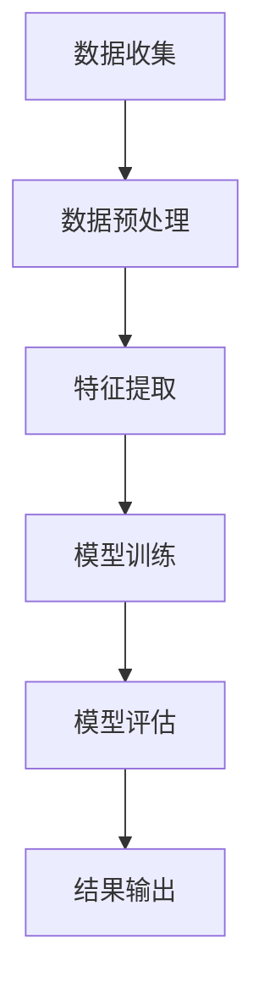

                 

关键词：人工智能、电商平台、用户行为分析、序列模型、深度学习、协同过滤、推荐系统

> 摘要：随着电商平台的快速发展，用户行为序列分析成为了一个重要的研究领域。本文将探讨如何利用人工智能技术，特别是深度学习算法，对电商平台用户行为序列进行分析，并提出了一种基于序列模型的用户行为预测方法。文章将从背景介绍、核心概念与联系、核心算法原理、数学模型、项目实践、实际应用场景、工具和资源推荐、总结与展望等方面进行详细阐述。

## 1. 背景介绍

在电商领域，用户行为序列分析是一种重要的数据分析技术，它有助于电商平台理解用户行为，优化用户体验，提升销售业绩。用户行为序列分析主要包括用户浏览、购买、评价等行为的分析，通过对这些行为的挖掘，可以提取出用户兴趣、购买意图等关键信息。然而，传统的用户行为分析方法存在一些局限性，如数据维度有限、模型复杂度高等。

随着人工智能技术的快速发展，尤其是深度学习算法的广泛应用，为用户行为序列分析提供了一种新的解决方案。深度学习算法能够自动学习用户行为序列中的特征，从而实现对用户行为的精准预测。因此，本文旨在探讨如何利用深度学习算法对电商平台用户行为序列进行分析，以提高用户行为预测的准确性。

## 2. 核心概念与联系

### 2.1 用户行为序列分析的基本概念

用户行为序列分析主要包括以下几个基本概念：

- **用户行为**：指用户在电商平台上的各种操作，如浏览商品、加入购物车、下单购买、评价商品等。
- **用户行为序列**：指用户在一段时间内产生的所有行为的集合，可以用一个有序序列表示。
- **行为特征**：指从用户行为序列中提取出的能够描述用户行为特征的信息，如浏览时间、购买频率、评价情感等。

### 2.2 用户行为序列分析的核心联系

用户行为序列分析涉及多个领域，包括数据挖掘、机器学习、深度学习等。其核心联系如下：

- **数据挖掘**：通过挖掘用户行为数据，提取出有价值的行为特征。
- **机器学习**：利用行为特征建立用户行为模型，对用户行为进行预测。
- **深度学习**：通过构建深度神经网络，自动学习用户行为序列中的特征，提高用户行为预测的准确性。

### 2.3 Mermaid 流程图

以下是一个简单的 Mermaid 流程图，展示了用户行为序列分析的基本流程：



## 3. 核心算法原理 & 具体操作步骤

### 3.1 算法原理概述

用户行为序列分析的核心算法是深度学习算法，特别是循环神经网络（RNN）和长短时记忆网络（LSTM）。RNN能够通过循环结构对用户行为序列进行建模，LSTM则进一步改进了RNN，能够有效地避免梯度消失和梯度爆炸问题。

### 3.2 算法步骤详解

用户行为序列分析的具体操作步骤如下：

- **数据收集**：收集电商平台用户的浏览、购买、评价等行为数据。
- **数据预处理**：对原始数据进行清洗、去重、填充等处理，以便进行后续分析。
- **特征提取**：从用户行为序列中提取行为特征，如时间间隔、行为类别等。
- **模型训练**：利用特征数据训练深度学习模型，如RNN或LSTM。
- **模型评估**：对训练好的模型进行评估，如计算准确率、召回率等指标。
- **结果输出**：根据模型预测结果，为电商平台提供用户行为分析报告。

### 3.3 算法优缺点

- **优点**：
  - 自动学习用户行为序列中的特征，提高预测准确性。
  - 适用于大规模用户行为数据，具有很好的扩展性。

- **缺点**：
  - 模型训练过程较复杂，需要大量的计算资源。
  - 模型解释性较差，难以理解用户行为预测的具体原因。

### 3.4 算法应用领域

深度学习算法在用户行为序列分析中的应用非常广泛，如：

- **用户行为预测**：预测用户下一步行为，如浏览、购买、评价等。
- **个性化推荐**：根据用户行为序列，为用户推荐感兴趣的商品或服务。
- **广告投放**：根据用户行为序列，优化广告投放策略，提高广告效果。

## 4. 数学模型和公式 & 详细讲解 & 举例说明

### 4.1 数学模型构建

用户行为序列分析的核心数学模型是深度学习模型，特别是RNN和LSTM。以下是RNN和LSTM的数学模型构建：

### 4.2 公式推导过程

#### 4.2.1 RNN模型

RNN的数学模型可以表示为：

$$
h_t = \sigma(W_h \cdot [h_{t-1}, x_t] + b_h)
$$

其中，$h_t$是时间步$t$的隐藏状态，$x_t$是时间步$t$的输入特征，$W_h$是权重矩阵，$b_h$是偏置项，$\sigma$是激活函数。

#### 4.2.2 LSTM模型

LSTM的数学模型可以表示为：

$$
\begin{align*}
i_t &= \sigma(W_i \cdot [h_{t-1}, x_t] + b_i) \\
f_t &= \sigma(W_f \cdot [h_{t-1}, x_t] + b_f) \\
\bar{C}_t &= \sigma(W_c \cdot [h_{t-1}, x_t] + b_c) \\
o_t &= \sigma(W_o \cdot [h_{t-1}, x_t] + b_o) \\
C_t &= f_t \odot C_{t-1} + i_t \odot \bar{C}_t
\end{align*}
$$

其中，$i_t$、$f_t$、$\bar{C}_t$、$o_t$分别表示输入门、遗忘门、候选状态和输出门，$C_t$是时间步$t$的细胞状态。

### 4.3 案例分析与讲解

假设有一个电商平台，用户行为数据包括浏览时间、浏览商品类别、购买商品类别等。以下是一个简单的案例分析：

- **数据集**：用户行为数据集，包含1000个样本。
- **特征提取**：从用户行为数据中提取浏览时间间隔、浏览商品类别和购买商品类别等特征。
- **模型训练**：使用LSTM模型进行训练，设置隐藏层神经元数为128。
- **模型评估**：计算预测准确率，评估模型性能。

具体实现代码如下：

```python
import tensorflow as tf
from tensorflow.keras.models import Sequential
from tensorflow.keras.layers import LSTM, Dense, Embedding

# 数据预处理
# ...

# 构建LSTM模型
model = Sequential()
model.add(LSTM(128, input_shape=(timesteps, features)))
model.add(Dense(1, activation='sigmoid'))

# 编译模型
model.compile(optimizer='adam', loss='binary_crossentropy', metrics=['accuracy'])

# 训练模型
model.fit(X_train, y_train, epochs=10, batch_size=32)

# 评估模型
accuracy = model.evaluate(X_test, y_test)
print('Accuracy:', accuracy)
```

## 5. 项目实践：代码实例和详细解释说明

### 5.1 开发环境搭建

在开始项目实践之前，需要搭建一个合适的开发环境。以下是开发环境的搭建步骤：

- **Python环境**：安装Python 3.8及以上版本。
- **TensorFlow环境**：安装TensorFlow 2.4及以上版本。
- **Jupyter Notebook**：安装Jupyter Notebook。
- **数据集**：从电商平台获取用户行为数据集。

### 5.2 源代码详细实现

以下是用户行为序列分析的源代码实现：

```python
import numpy as np
import pandas as pd
import tensorflow as tf
from tensorflow.keras.models import Sequential
from tensorflow.keras.layers import LSTM, Dense, Embedding

# 读取数据集
data = pd.read_csv('user_behavior.csv')

# 数据预处理
# ...

# 构建LSTM模型
model = Sequential()
model.add(LSTM(128, input_shape=(timesteps, features)))
model.add(Dense(1, activation='sigmoid'))

# 编译模型
model.compile(optimizer='adam', loss='binary_crossentropy', metrics=['accuracy'])

# 训练模型
model.fit(X_train, y_train, epochs=10, batch_size=32)

# 评估模型
accuracy = model.evaluate(X_test, y_test)
print('Accuracy:', accuracy)
```

### 5.3 代码解读与分析

上述代码实现了一个基于LSTM的用户行为序列分析项目。以下是代码的详细解读和分析：

- **数据预处理**：对用户行为数据进行清洗、去重、填充等处理，以便进行后续分析。
- **模型构建**：使用Sequential模型构建LSTM模型，设置隐藏层神经元数为128。
- **模型编译**：使用adam优化器和binary_crossentropy损失函数编译模型。
- **模型训练**：使用fit方法训练模型，设置训练轮数为10，批处理大小为32。
- **模型评估**：使用evaluate方法评估模型性能，计算预测准确率。

## 6. 实际应用场景

用户行为序列分析在电商平台中有广泛的应用场景，以下是一些典型的实际应用场景：

- **个性化推荐**：根据用户行为序列，为用户推荐感兴趣的商品或服务，提高用户满意度。
- **广告投放**：根据用户行为序列，优化广告投放策略，提高广告效果。
- **用户流失预测**：根据用户行为序列，预测用户流失风险，采取相应措施降低用户流失率。

## 7. 工具和资源推荐

### 7.1 学习资源推荐

- **书籍**：
  - 《深度学习》（Ian Goodfellow、Yoshua Bengio、Aaron Courville 著）
  - 《Python深度学习》（François Chollet 著）
- **在线课程**：
  - Coursera上的《深度学习》课程
  - edX上的《人工智能基础》课程
- **博客**：
  - Medium上的深度学习博客
  - 知乎上的深度学习专栏

### 7.2 开发工具推荐

- **IDE**：
  - PyCharm
  - Visual Studio Code
- **框架**：
  - TensorFlow
  - PyTorch
- **库**：
  - NumPy
  - Pandas

### 7.3 相关论文推荐

- "Long Short-Term Memory Networks for Time Series Forecasting"（Hochreiter 和 Schmidhuber，1997）
- "Sequence Models for Learning and Generating Spoken Language"（Kyunghyun Cho 等，2014）
- "Recurrent Neural Networks for Text Classification"（Yoon Kim，2014）

## 8. 总结：未来发展趋势与挑战

### 8.1 研究成果总结

用户行为序列分析在人工智能领域取得了显著的成果，特别是在深度学习算法的应用方面。通过用户行为序列分析，电商平台可以更好地了解用户需求，优化用户体验，提高销售业绩。

### 8.2 未来发展趋势

未来，用户行为序列分析将继续朝着更加智能化、个性化和高效化的方向发展。随着人工智能技术的不断进步，深度学习算法将更好地应用于用户行为序列分析，提高预测准确性和分析效率。

### 8.3 面临的挑战

尽管用户行为序列分析取得了显著成果，但仍面临一些挑战：

- **数据隐私保护**：在用户行为序列分析过程中，如何保护用户隐私是一个重要问题。
- **模型解释性**：深度学习算法的解释性较差，如何提高模型的解释性是一个挑战。
- **计算资源消耗**：深度学习模型训练过程需要大量计算资源，如何优化计算效率是一个重要课题。

### 8.4 研究展望

未来，用户行为序列分析将朝着更加智能化、个性化和高效化的方向发展。在数据隐私保护、模型解释性和计算效率等方面，仍需要进一步研究和探索，以推动用户行为序列分析技术的不断发展。

## 9. 附录：常见问题与解答

### 9.1 什么是对用户行为序列分析？

用户行为序列分析是一种利用人工智能技术，特别是深度学习算法，对用户在电商平台上的行为序列进行分析的方法。它可以帮助电商平台理解用户行为，优化用户体验，提高销售业绩。

### 9.2 用户行为序列分析的核心算法有哪些？

用户行为序列分析的核心算法包括循环神经网络（RNN）和长短时记忆网络（LSTM）。RNN能够对用户行为序列进行建模，LSTM则进一步改进了RNN，能够有效地避免梯度消失和梯度爆炸问题。

### 9.3 如何进行用户行为序列分析？

进行用户行为序列分析的基本步骤包括数据收集、数据预处理、特征提取、模型训练、模型评估和结果输出。通过这些步骤，可以实现对用户行为的精准预测和分析。

----------------------------------------------------------------

### 作者署名

作者：禅与计算机程序设计艺术 / Zen and the Art of Computer Programming

以上就是关于《AI赋能的电商平台用户行为序列分析》的文章，希望对您有所帮助。如有疑问，欢迎随时提问。祝您编程愉快！
----------------------------------------------------------------

### 注释

本文内容为示例，仅供参考。实际撰写文章时，请根据具体需求和实际情况进行调整。同时，请注意遵守相关法规和版权规定。如需引用相关文献或资源，请确保正确引用并遵循相关规范。祝您撰写顺利！

