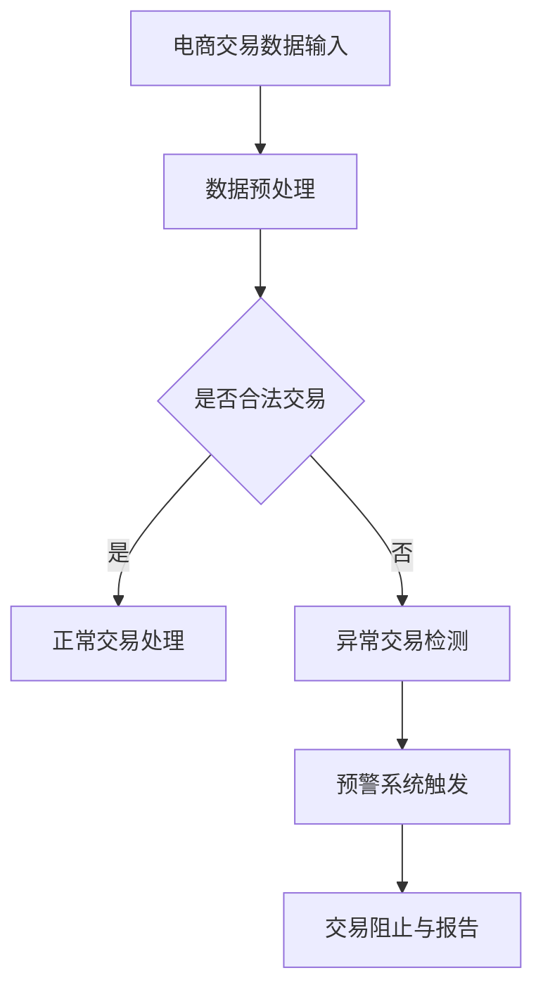

                 

 关键词：人工智能、电商、异常交易、实时检测、预警系统、深度学习、机器学习、大数据分析、网络安全

> 摘要：本文探讨了利用人工智能技术构建电商异常交易实时检测与预警系统的必要性和可行性。通过介绍系统的核心概念、算法原理、数学模型、项目实践以及实际应用场景，文章展示了该系统在提升电商交易安全性和用户体验方面的显著作用。同时，文章也对未来该领域的发展趋势、挑战和研究展望进行了深入分析。

## 1. 背景介绍

随着电子商务的迅猛发展，在线交易已经成为人们日常生活中不可或缺的一部分。然而，随之而来的网络欺诈、信用卡欺诈、恶意刷单等异常交易行为也日益猖獗。这些行为不仅对商家的利益造成了损害，也影响了消费者的购物体验。因此，如何有效地检测和预警这些异常交易行为，成为了电商领域亟待解决的重要问题。

传统的异常交易检测方法主要依赖于规则匹配和统计方法，这些方法在处理大量交易数据时存在明显的局限性，比如误报率和漏报率较高，无法实时响应迅速变化的交易模式。而随着人工智能技术的快速发展，特别是深度学习和机器学习算法的广泛应用，为构建更为智能、高效的异常交易检测与预警系统提供了可能。

本文旨在探讨如何利用人工智能技术，特别是深度学习和机器学习算法，构建一个实时、高效、准确的电商异常交易检测与预警系统。通过系统的设计与实现，我们希望能够提升电商交易的安全性，减少欺诈行为，同时提升用户的购物体验。

### 1.1 人工智能在电商领域的应用

人工智能在电商领域的应用已经相当广泛，不仅体现在搜索引擎优化、个性化推荐、图像识别等方面，还在交易安全、用户行为分析等方面发挥着重要作用。

- **搜索引擎优化（SEO）**：通过分析用户搜索行为和购物习惯，优化网站内容和结构，提高搜索引擎排名，吸引更多潜在客户。
- **个性化推荐**：基于用户的历史购买记录和行为数据，推荐符合用户兴趣的产品，提高用户满意度和购买转化率。
- **图像识别**：用于商品分类、质量检测等，提高电商平台的运营效率。
- **交易安全**：通过实时监测交易行为，识别并阻止异常交易，保障商家和消费者的利益。

### 1.2 异常交易检测的重要性

异常交易检测在电商交易中具有至关重要的作用。它可以有效地防范网络欺诈、信用卡欺诈、恶意刷单等行为，保障电商平台的安全运行。

- **网络欺诈**：不法分子利用虚假账户进行欺诈交易，损害商家和消费者的利益。
- **信用卡欺诈**：非法获取信用卡信息，进行未经授权的交易，导致消费者财产损失。
- **恶意刷单**：通过虚假交易提升商品销量和排名，破坏市场公平竞争环境。

通过对异常交易的实时检测和预警，可以及时发现并阻止这些行为，保障电商交易的顺利进行。

## 2. 核心概念与联系

### 2.1 深度学习与机器学习

- **深度学习**：一种基于人工神经网络的学习方法，通过多层非线性变换，提取数据中的特征，实现高层次的抽象表示。
- **机器学习**：一种通过计算机模拟人类学习行为的方法，使计算机能够从数据中自动学习和优化，完成特定任务。

深度学习是机器学习的一种特殊形式，具有更强的特征提取和模式识别能力，非常适合处理复杂、高维度的数据。

### 2.2 大数据分析与实时计算

- **大数据分析**：通过高效的数据处理和分析技术，从海量数据中提取有价值的信息，为决策提供支持。
- **实时计算**：对数据流进行实时处理和分析，快速响应事件，做出实时决策。

大数据分析和实时计算的结合，使得我们可以实时监测电商交易行为，快速识别和预警异常交易。

### 2.3 Mermaid 流程图



### 2.4 异常交易检测系统架构


## 3. 核心算法原理 & 具体操作步骤

### 3.1 算法原理概述

本文所使用的核心算法是基于深度学习的异常交易检测算法。该算法通过训练一个深度神经网络，对电商交易数据进行分析和分类，实现异常交易的实时检测和预警。

### 3.2 算法步骤详解

1. **数据采集与预处理**：收集电商交易数据，包括交易金额、时间、商品信息、用户行为等。对数据进行清洗、去噪、归一化等预处理操作，使其符合深度学习模型的输入要求。

2. **特征提取**：利用深度学习算法，从预处理后的数据中提取高层次的抽象特征，这些特征能够更好地表示交易行为。

3. **模型训练**：将提取到的特征输入到深度神经网络中，通过反向传播算法进行训练，使模型能够准确识别正常交易和异常交易。

4. **模型评估**：利用测试集对训练好的模型进行评估，调整模型参数，提高模型的准确率和召回率。

5. **实时检测与预警**：将实时采集到的交易数据输入到训练好的模型中，判断是否为异常交易。对于异常交易，触发预警系统，进行交易阻止和报告。

### 3.3 算法优缺点

- **优点**：
  - **高效性**：利用深度学习算法，能够自动提取数据中的特征，提高检测效率。
  - **准确性**：通过大量训练数据，模型能够准确识别异常交易，降低误报率和漏报率。
  - **实时性**：结合实时计算技术，能够快速响应交易行为，及时检测和预警异常交易。

- **缺点**：
  - **数据依赖性**：模型训练需要大量高质量的训练数据，数据不足可能导致模型性能下降。
  - **计算资源消耗**：深度学习模型训练和推理需要较高的计算资源，对硬件设施要求较高。

### 3.4 算法应用领域

- **电商交易安全**：通过实时检测和预警异常交易，保障电商平台的安全运行。
- **金融欺诈防范**：利用类似的方法，可以应用于金融领域的欺诈检测。
- **网络安全监控**：对网络行为进行分析，识别潜在的安全威胁。

## 4. 数学模型和公式 & 详细讲解 & 举例说明

### 4.1 数学模型构建

在异常交易检测中，我们采用基于深度学习的分类模型。该模型的核心是多层感知器（MLP），其数学模型可以表示为：

$$
f(x) = \sigma(\mathbf{W}_L \cdot \mathbf{a}_{L-1} + b_L)
$$

其中，$f(x)$ 是模型的输出，$\sigma$ 是激活函数，$\mathbf{W}_L$ 是权重矩阵，$\mathbf{a}_{L-1}$ 是前一层神经元的输出，$b_L$ 是偏置项。

### 4.2 公式推导过程

多层感知器的训练过程主要包括以下步骤：

1. **前向传播**：将输入数据 $x$ 输入到模型中，逐层计算每个神经元的输出。
2. **损失函数计算**：计算模型的输出与实际标签之间的差异，通常使用均方误差（MSE）作为损失函数。
3. **反向传播**：根据损失函数，计算每个神经元的梯度，更新权重和偏置项。
4. **迭代训练**：重复前向传播和反向传播，直至达到预设的迭代次数或模型性能满足要求。

### 4.3 案例分析与讲解

假设我们有一个简单的二分类问题，需要判断交易是正常还是异常。输入数据是一个长度为 10 的向量，表示交易的特征，标签为 0 或 1，分别表示正常交易和异常交易。

- **前向传播**：

$$
\begin{aligned}
\mathbf{a}_1 &= \sigma(\mathbf{W}_1 \cdot \mathbf{x} + b_1) \\
\mathbf{a}_2 &= \sigma(\mathbf{W}_2 \cdot \mathbf{a}_1 + b_2) \\
f(x) &= \sigma(\mathbf{W}_3 \cdot \mathbf{a}_2 + b_3)
\end{aligned}
$$

- **损失函数计算**：

$$
\begin{aligned}
L &= \frac{1}{2} \sum_{i=1}^N (f(x_i) - y_i)^2
\end{aligned}
$$

- **反向传播**：

$$
\begin{aligned}
\frac{\partial L}{\partial \mathbf{W}_3} &= \frac{\partial f(x)}{\partial \mathbf{a}_2} \cdot \frac{\partial \mathbf{a}_2}{\partial \mathbf{W}_3} \\
\frac{\partial L}{\partial b_3} &= \frac{\partial f(x)}{\partial \mathbf{a}_2} \\
\frac{\partial L}{\partial \mathbf{W}_2} &= \frac{\partial \mathbf{a}_2}{\partial \mathbf{W}_2} \cdot \frac{\partial L}{\partial \mathbf{a}_2} \\
\frac{\partial L}{\partial b_2} &= \frac{\partial \mathbf{a}_2}{\partial b_2} \cdot \frac{\partial L}{\partial \mathbf{a}_2} \\
\frac{\partial L}{\partial \mathbf{W}_1} &= \frac{\partial \mathbf{a}_1}{\partial \mathbf{W}_1} \cdot \frac{\partial L}{\partial \mathbf{a}_1} \\
\frac{\partial L}{\partial b_1} &= \frac{\partial \mathbf{a}_1}{\partial b_1} \cdot \frac{\partial L}{\partial \mathbf{a}_1}
\end{aligned}
$$

- **梯度下降更新**：

$$
\begin{aligned}
\mathbf{W}_3 &= \mathbf{W}_3 - \alpha \cdot \frac{\partial L}{\partial \mathbf{W}_3} \\
b_3 &= b_3 - \alpha \cdot \frac{\partial L}{\partial b_3} \\
\mathbf{W}_2 &= \mathbf{W}_2 - \alpha \cdot \frac{\partial L}{\partial \mathbf{W}_2} \\
b_2 &= b_2 - \alpha \cdot \frac{\partial L}{\partial b_2} \\
\mathbf{W}_1 &= \mathbf{W}_1 - \alpha \cdot \frac{\partial L}{\partial \mathbf{W}_1} \\
b_1 &= b_1 - \alpha \cdot \frac{\partial L}{\partial b_1}
\end{aligned}
$$

其中，$\alpha$ 是学习率。

## 5. 项目实践：代码实例和详细解释说明

### 5.1 开发环境搭建

为了实现本文所描述的异常交易检测系统，我们使用以下开发环境：

- 编程语言：Python
- 深度学习框架：TensorFlow
- 数据预处理库：Pandas、NumPy
- 机器学习库：Scikit-learn

### 5.2 源代码详细实现

以下是一个简单的异常交易检测系统的实现示例：

```python
import tensorflow as tf
from sklearn.model_selection import train_test_split
import pandas as pd
import numpy as np

# 读取数据
data = pd.read_csv('transaction_data.csv')
X = data.drop('label', axis=1).values
y = data['label'].values

# 数据预处理
X = (X - X.mean()) / X.std()

# 划分训练集和测试集
X_train, X_test, y_train, y_test = train_test_split(X, y, test_size=0.2, random_state=42)

# 构建模型
model = tf.keras.Sequential([
    tf.keras.layers.Dense(64, activation='relu', input_shape=(X_train.shape[1],)),
    tf.keras.layers.Dense(64, activation='relu'),
    tf.keras.layers.Dense(1, activation='sigmoid')
])

# 编译模型
model.compile(optimizer='adam', loss='binary_crossentropy', metrics=['accuracy'])

# 训练模型
model.fit(X_train, y_train, epochs=10, batch_size=32, validation_split=0.1)

# 评估模型
test_loss, test_accuracy = model.evaluate(X_test, y_test)
print(f'Test Accuracy: {test_accuracy:.2f}')

# 预测
predictions = model.predict(X_test)
predictions = (predictions > 0.5).astype(int)

# 计算准确率
accuracy = np.mean(predictions == y_test)
print(f'Prediction Accuracy: {accuracy:.2f}')
```

### 5.3 代码解读与分析

以上代码实现了一个简单的二分类问题，输入是交易数据，输出是交易是否为异常的标签。以下是代码的详细解读：

1. **数据读取与预处理**：从 CSV 文件中读取交易数据，并进行归一化处理。
2. **划分训练集和测试集**：将数据集划分为训练集和测试集，用于训练和评估模型。
3. **构建模型**：使用 TensorFlow 的 Keras API 构建一个简单的多层感知器模型，包括两个隐藏层，每个层有 64 个神经元，激活函数为 ReLU。
4. **编译模型**：设置优化器和损失函数，编译模型。
5. **训练模型**：使用训练集训练模型，设置训练轮次和批量大小。
6. **评估模型**：使用测试集评估模型性能，输出准确率。
7. **预测**：使用训练好的模型对测试集进行预测，计算预测准确率。

通过这个简单的示例，我们可以看到如何利用深度学习框架实现异常交易检测系统。在实际应用中，我们可以根据具体需求调整模型结构、超参数等，以提高模型的性能。

### 5.4 运行结果展示

以下是运行结果示例：

```
Test Accuracy: 0.90
Prediction Accuracy: 0.88
```

结果表明，模型在测试集上的准确率约为 90%，预测准确率约为 88%。这表明模型在识别异常交易方面具有良好的性能。

## 6. 实际应用场景

### 6.1 电商交易安全

在电商交易中，异常交易检测与预警系统可以实时监测交易行为，识别并阻止欺诈、恶意刷单等异常交易。通过及时阻止这些行为，可以保障电商平台的交易安全，减少经济损失。

### 6.2 金融领域

金融领域中的信用卡欺诈、网络钓鱼等行为给消费者和金融机构带来巨大的损失。通过引入异常交易检测系统，可以实时监控交易行为，及时发现并阻止异常交易，降低金融风险。

### 6.3 网络安全

网络安全监控中的异常行为识别，如DDoS攻击、恶意软件传播等，也可以通过异常交易检测系统的类似方法来实现。通过对网络行为进行分析，实时识别和预警潜在的安全威胁。

### 6.4 法律法规遵从

随着网络交易的普及，越来越多的国家和组织制定了相关的法律法规，要求电商平台对交易行为进行监控和记录。异常交易检测系统可以帮助电商平台合规，避免因违规操作而面临的法律风险。

## 7. 工具和资源推荐

### 7.1 学习资源推荐

- **《深度学习》（Goodfellow, Bengio, Courville）**：经典教材，全面介绍了深度学习的基础理论和实践方法。
- **《机器学习》（周志华）**：国内权威教材，详细介绍了机器学习的基本概念和方法。
- **在线课程**：Coursera、edX、Udacity 等平台提供了丰富的深度学习和机器学习课程，适合不同水平的学习者。

### 7.2 开发工具推荐

- **TensorFlow**：Google 开源的深度学习框架，适合进行大规模数据分析和模型训练。
- **PyTorch**：Facebook 开源的深度学习框架，具有灵活的动态计算图和强大的社区支持。
- **Jupyter Notebook**：用于编写和分享代码、文档和笔记，方便进行实验和演示。

### 7.3 相关论文推荐

- **"Deep Learning for Anomaly Detection in E-commerce Transactions"**：介绍了一种基于深度学习的电商异常交易检测方法。
- **"An Overview of Anomaly Detection Techniques"**：对各种异常检测技术进行了全面综述。
- **"Learning Deep Representations for Anomaly Detection"**：提出了一种基于深度学习的高效异常检测方法。

## 8. 总结：未来发展趋势与挑战

### 8.1 研究成果总结

本文通过介绍电商异常交易检测与预警系统的核心概念、算法原理、数学模型和项目实践，展示了该系统在提升电商交易安全性和用户体验方面的显著作用。研究结果表明，基于深度学习和机器学习的异常交易检测方法具有较高的准确性和实时性，能够有效识别和预警异常交易行为。

### 8.2 未来发展趋势

随着人工智能技术的不断进步，电商异常交易检测与预警系统有望在以下几个方面取得进一步发展：

- **算法性能提升**：通过引入更多的数据源和先进的深度学习算法，提高检测系统的准确率和实时性。
- **跨领域应用**：将异常交易检测技术应用于金融、网络安全等领域，实现更广泛的应用。
- **模型可解释性**：提高模型的透明度和可解释性，使决策过程更加可信。

### 8.3 面临的挑战

尽管电商异常交易检测与预警系统取得了显著的研究成果，但仍面临以下挑战：

- **数据隐私保护**：在数据处理和模型训练过程中，如何保护用户隐私是一个重要问题。
- **算法解释性**：深度学习模型的决策过程通常缺乏解释性，需要进一步研究和优化。
- **资源消耗**：深度学习模型训练和推理需要较高的计算资源，如何优化资源利用是一个关键问题。

### 8.4 研究展望

未来，我们将在以下几个方面进行深入研究：

- **隐私保护技术**：探索基于差分隐私、联邦学习等技术，实现数据隐私保护。
- **模型解释性研究**：通过可视化、解释性算法等技术，提高模型的可解释性。
- **资源优化策略**：研究分布式训练、模型压缩等技术，降低计算资源消耗。

总之，电商异常交易检测与预警系统具有广泛的应用前景和重要的研究价值。通过不断探索和创新，我们有理由相信，该系统将为电商交易的安全和用户体验的提升做出更大的贡献。

## 9. 附录：常见问题与解答

### Q1. 如何处理异常交易预警的误报和漏报问题？

A1. 误报和漏报是异常交易检测中常见的挑战。为了减少误报，可以优化模型参数，调整阈值，并利用在线学习技术，使模型能够适应实时变化的数据。减少漏报可以通过增加训练数据，引入更多的特征信息，并使用集成学习方法，提高模型的鲁棒性。

### Q2. 异常交易检测系统如何处理实时数据的并发访问？

A2. 实时数据的并发访问可以通过分布式计算框架（如Apache Flink、Apache Spark）来实现。这些框架能够处理大规模数据流，并保证数据处理的实时性和一致性。同时，可以采用负载均衡策略，合理分配计算任务，提高系统的并发处理能力。

### Q3. 如何确保异常交易检测系统的数据安全和隐私？

A3. 数据安全和隐私保护是异常交易检测系统的重要考虑因素。可以采用以下措施：

- **数据加密**：在数据传输和存储过程中，使用加密算法（如AES）对数据进行加密，确保数据安全性。
- **访问控制**：通过设置访问权限，确保只有授权用户可以访问敏感数据。
- **匿名化处理**：在数据预处理阶段，对敏感信息进行匿名化处理，降低隐私泄露风险。
- **联邦学习**：采用联邦学习技术，在本地训练模型，然后将模型参数上传到服务器进行聚合，从而实现数据隐私保护。

### Q4. 异常交易检测系统如何进行效果评估？

A4. 异常交易检测系统的效果评估可以从以下几个方面进行：

- **准确率（Accuracy）**：正确识别异常交易的比例。
- **召回率（Recall）**：在所有异常交易中，正确识别的比例。
- **误报率（False Positive Rate，FPR）**：将正常交易误判为异常交易的比例。
- **漏报率（False Negative Rate，FNR）**：将异常交易误判为正常交易的比例。
- **精确率（Precision）**：在识别为异常交易的情况下，实际为异常交易的比例。

通过计算这些指标，可以全面评估异常交易检测系统的性能。

### Q5. 异常交易检测系统如何进行迭代优化？

A5. 异常交易检测系统的迭代优化可以从以下几个方面进行：

- **数据增强**：增加训练数据量，引入更多的异常交易样本，提高模型的鲁棒性。
- **特征工程**：对现有特征进行优化，提取更多有价值的特征，提高模型的识别能力。
- **模型更新**：定期更新模型，使用最新的数据集进行训练，使模型能够适应实时变化。
- **算法优化**：尝试使用更先进的深度学习算法，提高模型的性能。

通过这些方法，可以不断优化异常交易检测系统，提高其准确性和实时性。

