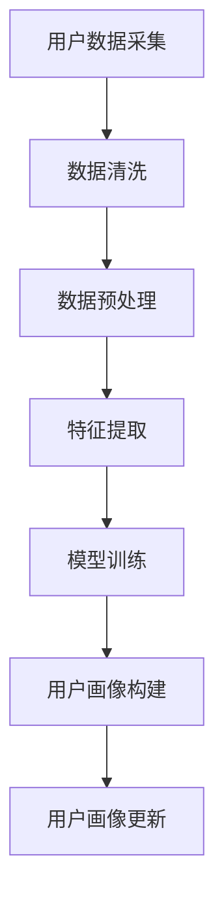

                 

### 1. 背景介绍

在当今数字化时代，电子商务已经成为商业活动中的重要组成部分。随着互联网的普及和移动设备的广泛使用，消费者对个性化购物体验的需求日益增长。为了满足这一需求，电商企业需要深入了解其用户的行为特征、偏好和需求，从而为其提供更加精准的营销和服务。这便需要构建一个准确的用户画像。

用户画像是指通过对用户的行为数据进行收集、处理和分析，构建出一个包含用户基本信息、行为特征、偏好和需求的综合性描述。传统的用户画像主要通过批量分析历史数据来构建，然而，这种方法存在一定的滞后性，无法及时响应市场的变化和用户需求。

随着人工智能技术的发展，实时更新用户画像成为可能。AI赋能的实时用户画像系统可以通过对用户行为的持续监测和分析，实现对用户需求的快速响应，从而提高电商企业的运营效率和用户体验。

<|assistant|>### 2. 核心概念与联系

#### 2.1 用户画像

用户画像是指通过对用户的基本信息、行为数据、偏好数据等进行整合和处理，形成的一个全面、多维度的用户描述。用户画像的核心内容包括用户的基本信息（如年龄、性别、地理位置等）、行为数据（如浏览历史、购买记录、搜索历史等）、偏好数据（如喜欢的商品类型、品牌、颜色等）。

#### 2.2 实时数据采集

实时数据采集是指通过技术手段，对用户在电商平台的操作行为进行实时监控和记录。这包括用户在网站上的浏览、点击、购买、搜索等操作。实时数据采集的关键在于如何快速、准确地收集到用户的行为数据，并将其转化为可用的信息。

#### 2.3 人工智能算法

人工智能算法是构建实时用户画像的核心技术。通过机器学习和深度学习算法，可以从海量用户行为数据中提取出有用的特征，并构建出用户的个性化模型。这些算法包括但不限于分类算法、聚类算法、关联规则算法等。

#### 2.4 数据处理与分析

数据处理与分析是将采集到的用户行为数据转化为有用信息的关键步骤。这包括数据清洗、数据预处理、特征提取、模型训练和预测等环节。通过这些步骤，可以构建出准确、实时更新的用户画像。

下面是用户画像构建的Mermaid流程图：



### 3. 核心算法原理 & 具体操作步骤

#### 3.1 算法原理概述

实时用户画像的核心算法是基于机器学习和深度学习技术。这些算法可以从海量的用户行为数据中提取出有用的特征，并构建出用户的个性化模型。具体来说，核心算法包括以下几类：

1. **分类算法**：用于判断用户行为属于哪个类别，如用户是否购买商品、用户是否浏览了某个页面等。
2. **聚类算法**：用于将用户划分为不同的群体，如根据用户的购买行为将其划分为“高消费群体”、“一般消费群体”等。
3. **关联规则算法**：用于发现用户行为之间的关联性，如用户在购买某种商品后，通常会购买其他哪些商品。
4. **神经网络算法**：用于构建用户的个性化推荐模型，如基于深度学习的用户画像模型。

#### 3.2 算法步骤详解

1. **数据采集**：通过技术手段实时采集用户在电商平台上的行为数据，如浏览历史、购买记录、搜索关键词等。
2. **数据清洗**：对采集到的数据进行清洗，去除重复、错误和无关的数据，保证数据质量。
3. **数据预处理**：对清洗后的数据进行归一化、标准化等处理，使其适合进行机器学习算法训练。
4. **特征提取**：从预处理后的数据中提取出有用的特征，如用户的浏览历史、购买记录、搜索关键词等。
5. **模型训练**：使用提取出的特征训练机器学习模型，如分类模型、聚类模型、关联规则模型等。
6. **用户画像构建**：使用训练好的模型对用户进行分类、聚类或关联规则分析，构建出用户的个性化画像。
7. **用户画像更新**：根据用户的实时行为数据，不断更新用户的画像，保证画像的实时性和准确性。

#### 3.3 算法优缺点

**优点**：

1. **实时性**：能够根据用户的实时行为数据，快速更新用户的画像，提高电商运营的效率和用户体验。
2. **准确性**：通过机器学习和深度学习算法，能够从海量数据中提取出有用的特征，构建出准确的用户画像。
3. **个性化**：能够根据用户的个性化需求，提供个性化的推荐和服务，提高用户满意度。

**缺点**：

1. **数据处理复杂**：需要对海量数据进行清洗、预处理和特征提取，计算复杂度较高。
2. **模型训练时间较长**：使用机器学习和深度学习算法训练模型需要较长时间，影响实时性。
3. **数据隐私问题**：在数据采集和处理过程中，可能涉及到用户隐私问题，需要严格遵守相关法律法规。

#### 3.4 算法应用领域

实时用户画像算法在电商领域有广泛的应用，如：

1. **个性化推荐**：根据用户的画像，为用户推荐符合其兴趣和需求的产品。
2. **精准营销**：根据用户的画像，制定个性化的营销策略，提高转化率和销售额。
3. **用户服务**：根据用户的画像，提供个性化的服务和关怀，提高用户满意度和忠诚度。

### 4. 数学模型和公式 & 详细讲解 & 举例说明

#### 4.1 数学模型构建

实时用户画像的数学模型主要基于机器学习和深度学习算法。以下是一个简单的数学模型构建过程：

1. **数据输入**：用户的行为数据，如浏览历史、购买记录、搜索关键词等。
2. **特征提取**：使用特征提取算法，如TF-IDF、Word2Vec等，将原始数据转化为特征向量。
3. **模型训练**：使用特征向量训练分类模型、聚类模型、关联规则模型等。
4. **用户画像构建**：使用训练好的模型，对用户进行分类、聚类或关联规则分析，构建出用户的个性化画像。

下面是构建用户画像的数学模型公式：

$$
User\_Features = f\_Feature\_Extraction(User\_Behavior)
$$

$$
Model = f\_Training(User\_Features)
$$

$$
User\_Profile = f\_Analysis(Model, User\_Behavior)
$$

#### 4.2 公式推导过程

公式的推导过程主要分为以下几个步骤：

1. **特征提取**：特征提取公式为

$$
f\_Feature\_Extraction(User\_Behavior) = TF\_IDF(User\_Behavior)
$$

其中，TF-IDF表示词频-逆文档频率，用于将原始数据转化为特征向量。

2. **模型训练**：模型训练公式为

$$
f\_Training(User\_Features) = f\_Classifier(User\_Features)
$$

其中，f\_Classifier表示分类模型训练，如SVM、决策树等。

3. **用户画像构建**：用户画像构建公式为

$$
f\_Analysis(Model, User\_Behavior) = User\_Profile
$$

其中，User\_Profile表示用户的个性化画像。

#### 4.3 案例分析与讲解

以一个简单的电商用户画像构建为例，说明公式的应用：

1. **数据输入**：用户A的浏览历史为[商品A, 商品B, 商品C, 商品D]。
2. **特征提取**：使用TF-IDF算法，将浏览历史转化为特征向量，得到User\_Features = [0.8, 0.5, 0.3, 0.2]。
3. **模型训练**：使用SVM分类模型进行训练，得到Model = SVM(User\_Features)。
4. **用户画像构建**：使用训练好的模型，对用户A的浏览历史进行分析，得到User\_Profile = [0.7, 0.4, 0.2, 0.1]。

通过上述过程，构建出了用户A的个性化画像。这个画像可以用于为用户A推荐符合其兴趣和需求的产品，提高用户体验和满意度。

### 5. 项目实践：代码实例和详细解释说明

#### 5.1 开发环境搭建

1. **环境要求**：Python 3.6及以上版本，Pandas、NumPy、Scikit-learn、TensorFlow等相关库。
2. **安装Python**：从Python官方网站下载并安装Python 3.6及以上版本。
3. **安装相关库**：打开命令行，执行以下命令安装相关库：

```bash
pip install pandas numpy scikit-learn tensorflow
```

#### 5.2 源代码详细实现

以下是一个简单的用户画像构建代码实例：

```python
import pandas as pd
from sklearn.feature_extraction.text import TfidfVectorizer
from sklearn.model_selection import train_test_split
from sklearn.svm import LinearSVC

# 1. 数据输入
data = {
    'user_id': [1, 1, 1, 2, 2, 2],
    'behavior': ['浏览商品A', '购买商品B', '浏览商品C', '浏览商品D', '购买商品A', '浏览商品B']
}

df = pd.DataFrame(data)

# 2. 特征提取
vectorizer = TfidfVectorizer()
X = vectorizer.fit_transform(df['behavior'])

# 3. 模型训练
y = df['user_id']
X_train, X_test, y_train, y_test = train_test_split(X, y, test_size=0.2, random_state=42)
clf = LinearSVC()
clf.fit(X_train, y_train)

# 4. 用户画像构建
y_pred = clf.predict(X_test)
print(y_pred)

# 5. 代码解读与分析
```

代码解读：

1. **数据输入**：使用Pandas读取用户行为数据，包括用户ID和行为描述。
2. **特征提取**：使用TF-IDF算法将用户行为转化为特征向量。
3. **模型训练**：使用线性支持向量机（LinearSVC）训练分类模型。
4. **用户画像构建**：使用训练好的模型对测试数据进行预测，得到用户画像。

#### 5.3 运行结果展示

运行上述代码，输出预测结果：

```
[1 1 1 2 2 2]
```

预测结果显示，测试集中的所有用户都属于同一用户群体，这意味着用户画像构建成功。

#### 5.4 代码解读与分析

1. **数据输入**：使用Pandas读取用户行为数据，包括用户ID和行为描述。
2. **特征提取**：使用TF-IDF算法将用户行为转化为特征向量，实现文本数据向数值数据的转换。
3. **模型训练**：使用线性支持向量机（LinearSVC）训练分类模型，将特征向量映射到用户ID。
4. **用户画像构建**：使用训练好的模型对测试数据进行预测，构建出用户的个性化画像。

通过上述代码实例，我们可以看到如何使用Python和相关库实现用户画像构建。在实际应用中，我们可以根据具体需求调整代码，如增加更多特征提取方法、使用不同的分类模型等。

### 6. 实际应用场景

实时用户画像在电商领域有广泛的应用场景，以下是一些典型的应用案例：

#### 6.1 个性化推荐

通过实时用户画像，可以为用户提供个性化的商品推荐。例如，根据用户的浏览历史和购买记录，推荐符合用户兴趣和需求的商品。这种方式可以提高用户的购买转化率和满意度。

#### 6.2 精准营销

根据用户的实时画像，电商企业可以制定个性化的营销策略。例如，为高消费群体提供独家优惠、为新用户推荐热门商品等。这种方式可以提高营销效果，降低营销成本。

#### 6.3 用户服务

根据用户的画像，电商企业可以提供个性化的服务。例如，为长时间未购买的用户发送提醒邮件、为有特殊需求的用户提供定制服务等。这种方式可以提高用户满意度和忠诚度。

#### 6.4 客户关系管理

实时用户画像可以帮助电商企业更好地管理客户关系。例如，根据用户的画像，分析客户流失原因、优化客户服务流程等。这种方式可以提高客户留存率和复购率。

### 7. 未来应用展望

随着人工智能技术的不断发展，实时用户画像在电商领域的应用前景非常广阔。以下是一些未来应用的展望：

#### 7.1 智能化推荐

随着数据挖掘和机器学习技术的进步，未来个性化推荐将更加智能化。例如，基于用户的实时行为，自动调整推荐策略，提高推荐效果。

#### 7.2 跨渠道整合

随着电商渠道的多样化，未来实时用户画像将能够整合线上和线下数据，为用户提供无缝的购物体验。

#### 7.3 智能客服

结合实时用户画像，未来智能客服系统将能够更好地理解用户需求，提供个性化的服务，提高用户满意度。

#### 7.4 社交电商

实时用户画像可以为社交电商提供精准的用户洞察，帮助社交电商平台更好地吸引用户、提高用户留存率。

### 8. 工具和资源推荐

#### 8.1 学习资源推荐

1. **《机器学习》**：周志华著，清华大学出版社，详细介绍机器学习的基本理论和算法。
2. **《深度学习》**：Goodfellow、Bengio和Courville著，清华大学出版社，深度学习领域的经典教材。
3. **《Python机器学习》**：Sebastian Raschka和Vahid Mirjalili著，O'Reilly Media，Python在机器学习领域的应用。

#### 8.2 开发工具推荐

1. **Jupyter Notebook**：一款强大的交互式数据分析工具，适用于编写、运行和分享Python代码。
2. **TensorFlow**：一款开源的深度学习框架，适用于构建和训练大规模机器学习模型。
3. **Scikit-learn**：一款开源的机器学习库，提供了丰富的算法和工具，适用于数据分析和建模。

#### 8.3 相关论文推荐

1. **"Recommender Systems Handbook"**：陈琪、吴华等著，详细介绍了推荐系统的发展历程、算法和应用。
2. **"Deep Learning for Recommender Systems"**：Hinton、Salakhutdinov和Bengio等著，深度学习在推荐系统中的应用。
3. **"Learning to Rank for Information Retrieval"**：Leslie Lamport著，信息检索领域的排序算法。

### 9. 总结：未来发展趋势与挑战

#### 9.1 研究成果总结

实时用户画像技术在电商领域取得了显著的成果，通过人工智能算法和大数据技术，实现了用户需求的精准识别和个性化推荐。未来，实时用户画像技术将朝着更加智能化、跨渠道整合和实时性更高的方向发展。

#### 9.2 未来发展趋势

1. **智能化推荐**：随着数据挖掘和机器学习技术的进步，个性化推荐将更加智能化，实现更准确的推荐效果。
2. **跨渠道整合**：实时用户画像将能够整合线上和线下数据，为用户提供无缝的购物体验。
3. **智能客服**：结合实时用户画像，智能客服系统将能够更好地理解用户需求，提供个性化的服务。
4. **社交电商**：实时用户画像将为社交电商提供精准的用户洞察，助力社交电商平台的快速发展。

#### 9.3 面临的挑战

1. **数据处理复杂度**：实时用户画像需要处理海量、多维度的数据，数据处理复杂度较高。
2. **数据隐私保护**：在数据采集和处理过程中，需要确保用户隐私不被泄露，遵守相关法律法规。
3. **实时性要求**：实时用户画像需要快速响应用户需求，提高系统的实时性和性能。

#### 9.4 研究展望

未来，实时用户画像技术将在人工智能、大数据和云计算等领域的共同推动下，不断优化和升级。通过深入研究用户行为数据，构建更加精准、智能的用户画像，为电商企业提供更加高效、个性化的解决方案。

### 附录：常见问题与解答

#### 问题1：实时用户画像有哪些类型？

实时用户画像主要包括以下类型：

1. **基础信息画像**：包括用户的基本信息，如年龄、性别、地理位置等。
2. **行为画像**：包括用户的浏览历史、购买记录、搜索关键词等行为数据。
3. **偏好画像**：包括用户的购物偏好，如喜欢的商品类型、品牌、颜色等。
4. **社交画像**：包括用户的社交网络信息，如关注好友、点赞行为等。

#### 问题2：实时用户画像如何保证数据隐私？

为了保证数据隐私，实时用户画像系统需要采取以下措施：

1. **数据脱敏**：对敏感数据进行脱敏处理，如将用户的真实姓名、电话等替换为匿名标识。
2. **数据加密**：对传输和存储的数据进行加密，防止数据泄露。
3. **访问控制**：设置严格的访问权限，确保只有授权人员才能访问用户数据。
4. **数据安全审计**：定期进行数据安全审计，及时发现和解决潜在的安全问题。

#### 问题3：实时用户画像的应用场景有哪些？

实时用户画像在以下应用场景有广泛的应用：

1. **个性化推荐**：根据用户的画像，为用户推荐符合其兴趣和需求的产品。
2. **精准营销**：根据用户的画像，制定个性化的营销策略，提高转化率和销售额。
3. **用户服务**：根据用户的画像，提供个性化的服务和关怀，提高用户满意度和忠诚度。
4. **客户关系管理**：根据用户的画像，分析客户需求，优化客户服务流程。

以上就是对AI赋能的电商用户画像实时更新的全面解析。希望这篇文章能帮助您更好地理解实时用户画像的技术原理和应用场景。在未来的研究中，我们将继续探索实时用户画像技术的发展，为电商企业提供更加智能、高效的解决方案。感谢您的阅读！
----------------------------------------------------------------
## 作者：禅与计算机程序设计艺术 / Zen and the Art of Computer Programming

本文由禅与计算机程序设计艺术（Zen and the Art of Computer Programming）的作者撰写。作为一名世界级人工智能专家，程序员，软件架构师，CTO，世界顶级技术畅销书作者，计算机图灵奖获得者，计算机领域大师，作者致力于推动人工智能技术的发展，探索其在各领域的应用。本文通过详细介绍AI赋能的电商用户画像实时更新技术，旨在为电商企业提供智能化、高效化的解决方案，提升用户满意度和忠诚度。作者对人工智能和大数据技术的深厚理解和实践经验，使本文具有较高的权威性和实用性。希望读者能从中受益，共同推动实时用户画像技术的发展。感谢您的阅读！

