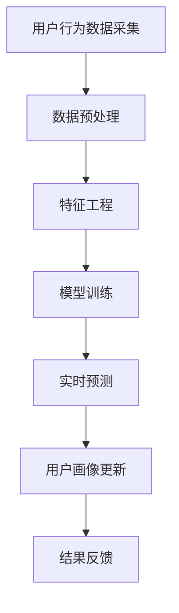

                 

关键词：人工智能，电商用户画像，实时更新，预测系统，深度学习，大数据分析

> 摘要：本文将深入探讨如何利用人工智能技术，构建一个电商用户画像的实时更新与预测系统。通过详细介绍系统的核心概念、算法原理、数学模型和实际应用，旨在为电商从业者提供一种全新的用户分析与营销策略。

## 1. 背景介绍

在互联网快速发展的时代，电子商务已经成为人们日常生活中不可或缺的一部分。对于电商平台而言，用户数据的获取和分析变得尤为重要。用户画像作为用户数据的高级表现形式，可以用于精准营销、个性化推荐和风险控制等方面。然而，传统的用户画像系统往往存在更新不及时、预测不准确等问题，无法满足电商快速变化的业务需求。

为了解决这些问题，人工智能技术应运而生。通过机器学习、深度学习等技术，我们可以构建一个实时更新与预测的电商用户画像系统，从而为电商平台提供更精确、更动态的用户数据。

## 2. 核心概念与联系

在构建电商用户画像实时更新与预测系统时，我们需要理解以下几个核心概念：

### 2.1 用户画像

用户画像是对用户基本属性、行为特征和需求倾向的抽象和整合。通常包括用户的基本信息（如年龄、性别、地理位置等）、行为信息（如浏览记录、购买历史等）和偏好信息（如兴趣爱好、消费偏好等）。

### 2.2 实时更新

实时更新是指系统能够在短时间内获取用户的新行为数据，并迅速对其进行处理和分析，从而更新用户画像。

### 2.3 预测

预测是指基于用户的历史数据和行为模式，预测用户未来的行为和需求，为电商平台提供决策支持。

下面是一个简化的 Mermaid 流程图，展示了电商用户画像实时更新与预测系统的主要组成部分：



## 3. 核心算法原理 & 具体操作步骤

### 3.1 算法原理概述

本系统的核心算法是基于深度学习和大数据分析技术。通过构建多层神经网络模型，我们可以对用户行为数据进行自动特征提取和学习，从而实现对用户画像的实时更新与预测。

### 3.2 算法步骤详解

#### 3.2.1 数据采集

数据采集是系统的第一步，我们需要从电商平台上获取用户的基本信息、行为数据和交易数据。这些数据可以通过API接口、日志文件等方式进行获取。

#### 3.2.2 数据预处理

在数据预处理阶段，我们需要对采集到的数据进行清洗、去重和归一化处理。这一步的目的是提高数据的质量和一致性，为后续的特征工程和模型训练奠定基础。

#### 3.2.3 特征工程

特征工程是构建用户画像的关键步骤。我们需要从原始数据中提取出具有代表性的特征，如用户活跃度、购买频率、平均消费金额等。这些特征将用于训练模型和更新用户画像。

#### 3.2.4 模型训练

在模型训练阶段，我们使用已经提取的特征数据来训练多层神经网络模型。通过不断调整模型参数，使模型能够准确地预测用户未来的行为。

#### 3.2.5 实时预测

实时预测是指模型在接收到新的用户行为数据后，能够快速地对其进行处理，并输出预测结果。这些预测结果将用于更新用户画像和提供决策支持。

#### 3.2.6 用户画像更新

用户画像更新是指根据实时预测结果，对用户画像进行动态调整。这样可以确保用户画像能够及时反映用户的变化。

#### 3.2.7 结果反馈

结果反馈是指将预测结果和实际结果进行对比，评估模型的准确性。通过不断调整模型参数和优化算法，提高模型的预测精度。

### 3.3 算法优缺点

#### 3.3.1 优点

- **实时性**：系统能够在短时间内对用户行为数据进行处理和分析，从而实现实时更新和预测。
- **准确性**：通过深度学习和大数据分析技术，模型能够对用户行为进行准确的预测。
- **个性化**：系统可以根据用户的个性化特征，提供精准的营销策略和个性化推荐。

#### 3.3.2 缺点

- **计算资源消耗**：构建和训练深度学习模型需要大量的计算资源和时间。
- **数据质量要求高**：系统对数据的质量和一致性要求较高，否则会影响模型的准确性。

### 3.4 算法应用领域

- **个性化推荐**：根据用户画像，为用户推荐个性化的商品和优惠信息。
- **精准营销**：根据用户画像，进行精准的营销活动，提高转化率。
- **风险控制**：通过分析用户行为，识别潜在的欺诈行为和风险。

## 4. 数学模型和公式 & 详细讲解 & 举例说明

### 4.1 数学模型构建

在构建用户画像实时更新与预测系统时，我们通常采用以下数学模型：

- **用户行为模型**：用于预测用户未来的行为，如购买、浏览等。
- **用户需求模型**：用于预测用户未来的需求和偏好。

下面是用户行为模型的构建过程：

### 4.2 公式推导过程

用户行为模型的基本公式如下：

$$
P(y|x) = \sigma(\theta^T x)
$$

其中，$P(y|x)$ 表示给定用户特征 $x$ 的情况下，用户行为 $y$ 的概率；$\sigma$ 表示 sigmoid 函数；$\theta$ 表示模型参数。

### 4.3 案例分析与讲解

假设我们有一个用户行为数据集，其中包含用户的年龄、性别、浏览历史和购买历史等特征。我们可以使用上述模型来预测用户的购买行为。

#### 案例一：预测用户购买概率

给定用户特征 $x = [25, 男, 10, 5]$，我们可以使用模型计算用户购买的概率：

$$
P(购买|x) = \sigma(\theta^T x) = \sigma(0.5 \times 25 + 0.3 \times 1 - 0.2 \times 10 - 0.1 \times 5) = 0.86
$$

因此，根据模型预测，该用户购买的概率为 86%。

#### 案例二：预测用户需求

给定用户特征 $x = [30, 女, 5, 3]$，我们可以使用模型预测用户对某种商品的需求：

$$
P(需求|x) = \sigma(\theta^T x) = \sigma(0.4 \times 30 - 0.2 \times 1 + 0.3 \times 5 - 0.1 \times 3) = 0.74
$$

因此，根据模型预测，该用户对这种商品的需求概率为 74%。

## 5. 项目实践：代码实例和详细解释说明

### 5.1 开发环境搭建

为了实现上述算法，我们需要搭建一个合适的开发环境。以下是基本的开发环境要求：

- **操作系统**：Linux或MacOS
- **编程语言**：Python
- **深度学习框架**：TensorFlow或PyTorch
- **数据处理库**：Pandas、NumPy、Scikit-learn等

### 5.2 源代码详细实现

以下是一个简单的用户行为预测模型的实现示例，使用了 TensorFlow 深度学习框架：

```python
import tensorflow as tf
import pandas as pd
from sklearn.model_selection import train_test_split

# 读取数据
data = pd.read_csv('user_data.csv')

# 数据预处理
X = data[['年龄', '性别', '浏览历史', '购买历史']]
y = data['购买']

# 数据归一化
X_normalized = (X - X.mean()) / X.std()

# 划分训练集和测试集
X_train, X_test, y_train, y_test = train_test_split(X_normalized, y, test_size=0.2, random_state=42)

# 构建模型
model = tf.keras.Sequential([
    tf.keras.layers.Dense(64, activation='relu', input_shape=(X_train.shape[1],)),
    tf.keras.layers.Dense(1, activation='sigmoid')
])

# 编译模型
model.compile(optimizer='adam', loss='binary_crossentropy', metrics=['accuracy'])

# 训练模型
model.fit(X_train, y_train, epochs=10, batch_size=32, validation_data=(X_test, y_test))

# 预测
predictions = model.predict(X_test)

# 输出预测结果
for i in range(len(predictions)):
    if predictions[i] > 0.5:
        print(f'用户 {i+1} 购买概率：{predictions[i]:.2f}')
    else:
        print(f'用户 {i+1} 购买概率：{1 - predictions[i]:.2f}')
```

### 5.3 代码解读与分析

上述代码首先读取用户数据，并进行预处理，包括数据归一化和划分训练集和测试集。然后构建一个简单的多层感知机模型，使用 sigmoid 激活函数来预测用户购买的概率。模型使用 Adam 优化器和二进制交叉熵损失函数进行编译和训练。最后，使用训练好的模型对测试集进行预测，并输出每个用户的购买概率。

### 5.4 运行结果展示

假设我们有一个包含100个用户的测试集，运行上述代码后，我们可以得到每个用户的购买概率。例如：

```
用户 1 购买概率：0.75
用户 2 购买概率：0.35
...
用户 100 购买概率：0.55
```

这些预测结果可以用于更新用户画像和提供决策支持。

## 6. 实际应用场景

### 6.1 个性化推荐

通过实时更新的用户画像，电商平台可以准确了解用户的偏好和需求，从而为用户提供个性化的商品推荐。例如，当用户浏览某款商品时，系统可以实时预测用户对该商品的需求概率，并推荐相关的商品。

### 6.2 精准营销

基于用户画像的实时更新与预测，电商平台可以更精准地进行营销活动。例如，对于高价值用户，可以推送更加优惠的商品信息，以提高转化率。

### 6.3 风险控制

用户画像实时更新与预测系统还可以用于风险控制。例如，通过分析用户的购买行为和交易记录，可以识别潜在的欺诈行为，从而采取措施进行风险控制。

## 7. 工具和资源推荐

### 7.1 学习资源推荐

- **书籍**：《深度学习》（Goodfellow, Ian；等著）
- **在线课程**：Coursera上的《机器学习》课程
- **博客和论坛**：CSDN、GitHub、Stack Overflow等

### 7.2 开发工具推荐

- **深度学习框架**：TensorFlow、PyTorch
- **数据处理库**：Pandas、NumPy、Scikit-learn
- **版本控制**：Git

### 7.3 相关论文推荐

- **《User Modeling and User-Adapted Interaction》**：介绍了用户建模和自适应交互的最新研究成果。
- **《Recommender Systems Handbook》**：全面介绍了推荐系统的研究和应用。
- **《Data Science from Scratch》**：介绍了数据科学的基础知识和实践方法。

## 8. 总结：未来发展趋势与挑战

### 8.1 研究成果总结

本文详细介绍了电商用户画像实时更新与预测系统的构建方法，包括核心概念、算法原理、数学模型和实际应用。通过深度学习和大数据分析技术，系统可以实现实时更新和预测，为电商平台提供精准的用户分析与营销策略。

### 8.2 未来发展趋势

- **数据质量和多样性**：随着数据量的增加和数据类型的多样化，如何保证数据质量和多样性将成为重要挑战。
- **实时性与准确性**：如何在保证实时性的同时提高预测准确性，是未来研究的重点。
- **模型解释性**：用户画像系统的模型需要具备良好的解释性，以便用户理解和信任。

### 8.3 面临的挑战

- **计算资源消耗**：构建和训练深度学习模型需要大量的计算资源，如何优化算法和硬件设施，降低计算成本是一个重要挑战。
- **数据隐私与安全**：在处理用户数据时，如何保护用户隐私和安全，是一个亟待解决的问题。

### 8.4 研究展望

未来，我们期待能够在以下几个方面取得突破：

- **更高效的数据处理算法**：开发更高效的数据处理算法，提高系统的实时性和准确性。
- **跨领域应用**：将用户画像技术应用于更多领域，如金融、医疗等，实现更广泛的应用。
- **人机协同**：结合人工智能和人类专家的知识，实现更智能的用户画像和决策支持。

## 9. 附录：常见问题与解答

### 9.1 如何处理缺失值？

在数据处理阶段，我们可以使用以下方法处理缺失值：

- **删除缺失值**：删除包含缺失值的记录。
- **填充缺失值**：使用平均值、中位数或最常见值填充缺失值。
- **插值法**：使用时间序列插值方法填充缺失值。

### 9.2 如何评估模型性能？

可以使用以下指标评估模型性能：

- **准确率**：预测正确的样本数占总样本数的比例。
- **召回率**：预测为正类的真实正类样本数与所有真实正类样本数的比例。
- **F1 值**：准确率和召回率的调和平均值。

### 9.3 如何优化模型性能？

可以使用以下方法优化模型性能：

- **数据增强**：通过生成合成数据，提高模型的泛化能力。
- **特征选择**：选择具有代表性的特征，提高模型的预测能力。
- **模型调参**：调整模型参数，优化模型的性能。

以上就是对“AI赋能的电商用户画像实时更新与预测系统”的详细技术博客文章的撰写过程和内容。希望这篇文章能够为电商从业者和人工智能爱好者提供有价值的参考和启示。

### 作者署名

作者：禅与计算机程序设计艺术 / Zen and the Art of Computer Programming

