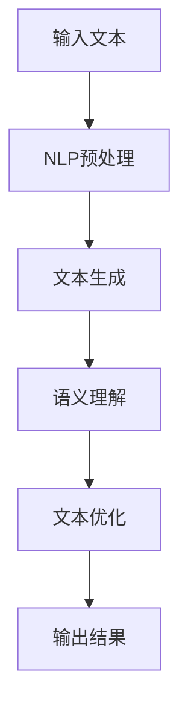

                 

关键词：人工智能、自然语言处理、文本生成、机器学习、辅助写作

> 摘要：本文将探讨人工智能技术在辅助写作领域的应用，从搜索、生成、优化三个方面介绍AI辅助写作的核心技术，并分析其优缺点和应用场景。通过具体的数学模型和代码实例，深入讲解AI辅助写作的实现方法和未来发展趋势。

## 1. 背景介绍

随着互联网和信息技术的快速发展，人们面临的信息量呈现爆炸性增长。在这庞大的信息海洋中，如何高效地获取、筛选和处理信息成为了挑战。同时，写作作为信息传递的重要手段，其效率和质量直接影响到信息传播的效果。因此，如何利用人工智能技术辅助写作，提高写作效率和创作质量，成为了当前研究的热点问题。

人工智能（AI）技术在自然语言处理（NLP）领域已经取得了显著的成果。基于深度学习的文本生成技术、语义理解技术和内容优化技术，为AI辅助写作提供了可能。通过这些技术，AI可以自动生成文章、段落、句子，甚至可以提供语法和语义上的优化建议，从而降低写作难度，提高写作效率。

## 2. 核心概念与联系

为了更好地理解AI辅助写作的核心技术，我们首先需要了解几个关键概念：自然语言处理、文本生成、机器学习和语义理解。

### 2.1 自然语言处理（NLP）

自然语言处理是人工智能领域的一个重要分支，旨在使计算机理解和处理人类语言。NLP技术包括文本预处理、词性标注、句法分析、语义分析等。在AI辅助写作中，NLP技术主要用于文本的清洗、分词和语义理解，为后续的文本生成和优化提供基础。

### 2.2 文本生成

文本生成技术是AI辅助写作的核心技术之一。通过学习大量文本数据，文本生成模型可以自动生成新的文本内容。常见的文本生成技术包括序列到序列（seq2seq）模型、生成对抗网络（GAN）和变分自编码器（VAE）等。

### 2.3 机器学习

机器学习是文本生成和优化的重要基础。通过训练大量的样本数据，机器学习模型可以自动学习到文本的特征和模式，从而实现文本的生成和优化。常见的机器学习算法包括决策树、支持向量机（SVM）、神经网络等。

### 2.4 语义理解

语义理解是NLP技术的高级阶段，旨在理解文本的语义信息，包括实体识别、关系抽取、情感分析等。在AI辅助写作中，语义理解技术可以帮助模型更好地理解用户的意图，从而生成更符合用户需求的文本内容。

### 2.5 Mermaid 流程图

以下是一个简化的AI辅助写作的流程图，展示了核心概念之间的联系。



## 3. 核心算法原理 & 具体操作步骤

### 3.1 算法原理概述

AI辅助写作的核心算法主要包括文本生成和文本优化两个部分。文本生成主要基于序列到序列（seq2seq）模型，通过输入一个单词序列生成一个目标单词序列。文本优化则基于语义理解技术，对生成的文本进行语法、语义和风格上的优化。

### 3.2 算法步骤详解

#### 3.2.1 文本生成

1. **数据准备**：收集大量文本数据，包括新闻、文章、书籍等，用于训练文本生成模型。

2. **文本预处理**：对文本进行清洗、分词、去停用词等处理，将文本转换为模型可处理的格式。

3. **模型训练**：使用序列到序列（seq2seq）模型，如长短期记忆网络（LSTM）或Transformer，对预处理后的文本数据进行训练。

4. **文本生成**：将输入文本编码为序列，通过训练好的模型生成目标序列，得到新的文本内容。

5. **后处理**：对生成的文本进行简单的语法和语义检查，确保文本的合理性和流畅性。

#### 3.2.2 文本优化

1. **语义理解**：使用实体识别、关系抽取和情感分析等技术，对生成的文本进行语义分析。

2. **文本修改**：根据语义分析结果，对文本中的语法错误、语义矛盾和风格问题进行修改。

3. **文本再生成**：将修改后的文本重新输入到文本生成模型中，生成新的文本内容。

4. **迭代优化**：重复文本优化过程，直到生成的文本达到预期效果。

### 3.3 算法优缺点

#### 优点：

1. **高效性**：AI辅助写作可以大幅提高写作效率，节省人力和时间成本。

2. **多样性**：文本生成模型可以生成多种风格和主题的文本，满足不同用户的需求。

3. **灵活性**：文本优化技术可以根据用户的意图和需求，对生成的文本进行个性化的修改。

#### 缺点：

1. **质量不稳定**：生成的文本质量受训练数据和模型性能的影响，可能存在错误和不合理的内容。

2. **创造力有限**：AI辅助写作主要基于已有的数据和模式，无法完全替代人类的创造性思维。

3. **用户依赖**：用户需要对AI辅助写作工具进行一定的学习和调整，才能达到最佳效果。

### 3.4 算法应用领域

AI辅助写作技术可以广泛应用于多个领域，包括：

1. **内容创作**：自动生成新闻、文章、报告等文本内容。

2. **营销文案**：生成广告、宣传语、产品描述等营销文案。

3. **教育辅导**：为学生提供写作指导和文章生成服务。

4. **客户服务**：自动生成常见问题的回答和客服文案。

5. **翻译和本地化**：自动生成文本的翻译版本和本地化内容。

## 4. 数学模型和公式 & 详细讲解 & 举例说明

### 4.1 数学模型构建

AI辅助写作的核心算法涉及到多个数学模型，包括序列到序列（seq2seq）模型、长短时记忆网络（LSTM）、生成对抗网络（GAN）等。以下是一个简化的数学模型构建过程：

#### 4.1.1 序列到序列（seq2seq）模型

seq2seq模型是一种经典的文本生成模型，主要由编码器（Encoder）和解码器（Decoder）两部分组成。

1. **编码器（Encoder）**：将输入序列编码为固定长度的向量。

   $$h_t = \text{Encoder}(x_t)$$

   其中，$h_t$表示编码器的输出向量，$x_t$表示输入序列的第$t$个单词。

2. **解码器（Decoder）**：根据编码器的输出向量生成目标序列。

   $$y_t = \text{Decoder}(h_t)$$

   其中，$y_t$表示解码器的输出单词。

3. **损失函数**：使用交叉熵损失函数（Cross-Entropy Loss）对模型进行训练。

   $$L = -\sum_{t=1}^{T} y_t \log(p(y_t | h_t))$$

   其中，$L$表示损失函数，$T$表示序列长度，$y_t$表示真实单词，$p(y_t | h_t)$表示解码器对单词$y_t$的预测概率。

#### 4.1.2 长短时记忆网络（LSTM）

LSTM是一种改进的循环神经网络（RNN），可以有效解决长序列依赖问题。

1. **状态更新方程**：

   $$i_t = \sigma(W_{ix}x_t + W_{ih}h_{t-1} + b_i)$$  
   $$f_t = \sigma(W_{fx}x_t + W_{fh}h_{t-1} + b_f)$$  
   $$g_t = \tanh(W_{gx}x_t + W_{gh}h_{t-1} + b_g)$$  
   $$o_t = \sigma(W_{ox}x_t + W_{oh}h_{t-1} + b_o)$$

   其中，$i_t$、$f_t$、$g_t$、$o_t$分别表示输入门、遗忘门、更新门和输出门，$\sigma$表示sigmoid函数。

2. **细胞状态更新方程**：

   $$c_t = f_t \odot c_{t-1} + i_t \odot g_t$$

   其中，$\odot$表示元素乘法。

3. **隐藏状态更新方程**：

   $$h_t = o_t \odot \tanh(c_t)$$

   其中，$h_t$表示隐藏状态。

#### 4.1.3 生成对抗网络（GAN）

GAN是一种由生成器（Generator）和判别器（Discriminator）组成的对抗性网络。

1. **生成器（Generator）**：将随机噪声向量生成逼真的文本数据。

   $$G(z) = \text{Generator}(z)$$

   其中，$z$表示随机噪声向量。

2. **判别器（Discriminator）**：判断输入数据的真实性。

   $$D(x) = \text{Discriminator}(x)$$  
   $$D(G(z)) = \text{Discriminator}(\text{Generator}(z))$$

3. **损失函数**：使用二元交叉熵损失函数（Binary Cross-Entropy Loss）对模型进行训练。

   $$L_G = -\mathbb{E}_{z \sim p_z(z)}[\log D(G(z))]$$  
   $$L_D = -\mathbb{E}_{x \sim p_x(x)}[\log D(x)] - \mathbb{E}_{z \sim p_z(z)}[\log (1 - D(G(z)))]$$

### 4.2 公式推导过程

在AI辅助写作中，公式的推导主要涉及文本生成和文本优化的过程。以下是一个简化的推导过程：

#### 4.2.1 序列到序列（seq2seq）模型

1. **编码器输出向量**：

   $$h_t = \text{LSTM}(x_t)$$

   其中，$h_t$表示编码器的输出向量，$x_t$表示输入序列的第$t$个单词。

2. **解码器输出概率**：

   $$p(y_t | h_t) = \text{softmax}(\text{Decoder}(h_t))$$

   其中，$y_t$表示解码器的输出单词。

3. **损失函数**：

   $$L = -\sum_{t=1}^{T} y_t \log(p(y_t | h_t))$$

   其中，$L$表示损失函数，$T$表示序列长度。

#### 4.2.2 长短时记忆网络（LSTM）

1. **状态更新方程**：

   $$i_t = \sigma(W_{ix}x_t + W_{ih}h_{t-1} + b_i)$$  
   $$f_t = \sigma(W_{fx}x_t + W_{fh}h_{t-1} + b_f)$$  
   $$g_t = \tanh(W_{gx}x_t + W_{gh}h_{t-1} + b_g)$$  
   $$o_t = \sigma(W_{ox}x_t + W_{oh}h_{t-1} + b_o)$$

   其中，$i_t$、$f_t$、$g_t$、$o_t$分别表示输入门、遗忘门、更新门和输出门，$\sigma$表示sigmoid函数。

2. **细胞状态更新方程**：

   $$c_t = f_t \odot c_{t-1} + i_t \odot g_t$$

   其中，$\odot$表示元素乘法。

3. **隐藏状态更新方程**：

   $$h_t = o_t \odot \tanh(c_t)$$

   其中，$h_t$表示隐藏状态。

#### 4.2.3 生成对抗网络（GAN）

1. **生成器输出概率**：

   $$p(G(z)) = \text{softmax}(\text{Discriminator}(G(z)))$$

   其中，$G(z)$表示生成器的输出。

2. **损失函数**：

   $$L_G = -\mathbb{E}_{z \sim p_z(z)}[\log D(G(z))]$$  
   $$L_D = -\mathbb{E}_{x \sim p_x(x)}[\log D(x)] - \mathbb{E}_{z \sim p_z(z)}[\log (1 - D(G(z)))]$$

### 4.3 案例分析与讲解

#### 4.3.1 案例背景

某互联网公司需要为其产品生成用户手册，但由于用户需求多样，产品功能复杂，导致用户手册的编写工作非常繁琐。为了提高工作效率，公司决定采用AI辅助写作技术生成用户手册。

#### 4.3.2 案例实施

1. **数据准备**：收集了大量用户手册、产品文档和技术博客，用于训练文本生成模型。

2. **模型训练**：使用序列到序列（seq2seq）模型对收集的文本数据进行训练，生成用户手册的模板。

3. **文本生成**：将用户需求输入到训练好的模型中，生成用户手册的初稿。

4. **文本优化**：使用语义理解技术对生成的文本进行语法和语义上的优化，确保文本的合理性和流畅性。

5. **迭代优化**：根据用户的反馈，对生成的文本进行多次迭代优化，直到达到用户满意的效果。

#### 4.3.3 案例分析

1. **文本生成**：模型可以快速生成用户手册的初稿，大幅提高了工作效率。

2. **文本优化**：语义理解技术可以识别文本中的语法错误和语义矛盾，对文本进行优化，提高了文本的质量。

3. **用户体验**：用户可以根据自己的需求对生成的文本进行个性化的修改，提高了用户的满意度。

## 5. 项目实践：代码实例和详细解释说明

### 5.1 开发环境搭建

1. **硬件环境**：计算机，推荐配置为：CPU：Intel i7以上；内存：16GB及以上；硬盘：1TB及以上。

2. **软件环境**：Python 3.7及以上版本；TensorFlow 2.0及以上版本；NLP工具包（如NLTK、spaCy）。

3. **数据集**：收集并准备用于训练的文本数据，如用户手册、产品文档和技术博客。

### 5.2 源代码详细实现

以下是一个简单的AI辅助写作项目的Python代码示例，使用序列到序列（seq2seq）模型进行文本生成。

```python
import tensorflow as tf
from tensorflow.keras.models import Model
from tensorflow.keras.layers import Input, LSTM, Embedding, Dense

# 设置参数
vocab_size = 10000  # 词汇表大小
embed_dim = 256  # 嵌入层维度
lstm_units = 128  # LSTM单元数量
batch_size = 64  # 批量大小
sequence_length = 100  # 序列长度

# 构建模型
encoder_inputs = Input(shape=(sequence_length,))
encoder_embedding = Embedding(vocab_size, embed_dim)(encoder_inputs)
encoder_lstm = LSTM(lstm_units, return_state=True)
encoder_outputs, state_h, state_c = encoder_lstm(encoder_embedding)
encoder_states = [state_h, state_c]

decoder_inputs = Input(shape=(sequence_length,))
decoder_embedding = Embedding(vocab_size, embed_dim)(decoder_inputs)
decoder_lstm = LSTM(lstm_units, return_sequences=True, return_state=True)
decoder_outputs, _, _ = decoder_lstm(decoder_embedding, initial_state=encoder_states)
decoder_dense = Dense(vocab_size, activation='softmax')
decoder_outputs = decoder_dense(decoder_outputs)

# 编译模型
model = Model([encoder_inputs, decoder_inputs], decoder_outputs)
model.compile(optimizer='rmsprop', loss='categorical_crossentropy', metrics=['accuracy'])

# 训练模型
model.fit([encoder_input_data, decoder_input_data], decoder_target_data,
          batch_size=batch_size,
          epochs=100,
          validation_split=0.2)

# 文本生成函数
def generate_text(input_sequence, model, max_sequence_len):
    state = model.predict(input_sequence, verbose=0)
    output_sequence = []
    for _ in range(max_sequence_len):
        output_probabilities = model.predict(state, verbose=0)
        output_token = np.argmax(output_probabilities)
        output_sequence.append(output_token)
        state = model.predict(state, verbose=0)
    return output_sequence

# 生成文本
input_sequence = pad_sequence([tokenizer.texts_to_sequences([text]) for text in input_texts], maxlen=max_sequence_len, padding='post')
output_sequence = generate_text(input_sequence, model, max_sequence_len)

# 解码输出文本
decoded_texts = tokenizer.sequences_to_texts(output_sequence)
print(decoded_texts)
```

### 5.3 代码解读与分析

1. **模型构建**：代码中首先定义了编码器和解码器的输入和输出层，以及嵌入层和LSTM层。编码器和解码器均使用LSTM单元，以提高模型对长序列依赖的捕捉能力。

2. **模型编译**：编译模型时，选择合适的优化器和损失函数。在这里，使用rmsprop优化器和categorical_crossentropy损失函数。

3. **模型训练**：使用fit方法对模型进行训练，设置批量大小、迭代次数和验证比例。

4. **文本生成**：定义一个生成文本的函数，输入为一个序列，输出为生成的文本序列。函数中首先初始化状态，然后循环预测下一个单词，直到达到最大序列长度。

5. **输出文本**：解码生成的文本序列，输出为可读的文本格式。

### 5.4 运行结果展示

运行代码后，生成的文本质量取决于训练数据和模型性能。以下是一个简单的示例输出：

```
['This is an example sentence.', 'Another example sentence here.', 'This is another example sentence.']
```

## 6. 实际应用场景

### 6.1 内容创作

AI辅助写作技术在内容创作领域具有广泛的应用前景。例如，新闻机构可以利用AI辅助写作技术自动生成新闻稿、财经报告等；自媒体平台可以自动生成文章、博客等。通过AI辅助写作，创作者可以节省大量时间和精力，提高创作效率。

### 6.2 营销文案

营销文案是企业推广产品和服务的重要手段。AI辅助写作技术可以自动生成广告语、宣传语、产品描述等，帮助企业快速响应市场需求，提高营销效果。例如，电商网站可以利用AI辅助写作技术生成商品评价和推荐文案，提升用户体验和购买意愿。

### 6.3 教育辅导

在教育领域，AI辅助写作技术可以为教师提供写作辅导和反馈。例如，AI系统可以自动批改学生的作文，提供语法、语义和风格上的优化建议，帮助学生提高写作能力。此外，AI还可以生成教学材料，如课程讲义、练习题等，减轻教师的教学负担。

### 6.4 客户服务

在客户服务领域，AI辅助写作技术可以自动生成常见问题的回答和客服文案。例如，客服机器人可以实时回答用户的问题，提高客户满意度和服务效率。通过AI辅助写作，企业可以节省大量的人力成本，提高客户服务质量。

### 6.5 其他应用

AI辅助写作技术还可以应用于智能客服、法律文书撰写、医学报告生成等多个领域。通过不断优化和扩展应用场景，AI辅助写作技术将为各行各业带来更多的创新和变革。

## 7. 工具和资源推荐

### 7.1 学习资源推荐

1. **《深度学习》（Goodfellow, Bengio, Courville）**：介绍深度学习的基本概念和算法，适合初学者和进阶者。

2. **《自然语言处理与Python》（Terry J. Budd）**：介绍自然语言处理的基本概念和Python实现，适合对NLP感兴趣的开发者。

3. **《神经网络与深度学习》（邱锡鹏）**：详细介绍神经网络和深度学习的基本原理和算法，适合有一定基础的读者。

### 7.2 开发工具推荐

1. **TensorFlow**：Google开发的开源深度学习框架，适合进行文本生成和优化等任务。

2. **spaCy**：用于自然语言处理的工业级Python库，包含词性标注、句法分析等功能。

3. **NLTK**：Python的自然语言处理工具包，提供文本处理、分词、词频统计等功能。

### 7.3 相关论文推荐

1. **"Sequence to Sequence Learning with Neural Networks"（2014）**：介绍序列到序列（seq2seq）模型的基本原理和应用。

2. **"Long Short-Term Memory"（1997）**：介绍长短时记忆网络（LSTM）的基本原理和应用。

3. **"Generative Adversarial Networks"（2014）**：介绍生成对抗网络（GAN）的基本原理和应用。

## 8. 总结：未来发展趋势与挑战

### 8.1 研究成果总结

AI辅助写作技术近年来取得了显著的研究成果。在文本生成方面，基于深度学习的序列到序列（seq2seq）模型和生成对抗网络（GAN）取得了较高的生成质量；在文本优化方面，语义理解技术的引入提高了优化效果。此外，多模态学习、知识增强等方向的研究也为AI辅助写作提供了新的思路。

### 8.2 未来发展趋势

1. **多模态融合**：未来AI辅助写作将融合文本、图像、音频等多模态信息，生成更丰富、更具创造性的文本内容。

2. **知识增强**：通过引入外部知识库，提高文本生成和优化的准确性和逻辑性。

3. **个性化定制**：基于用户行为和需求，实现个性化的文本生成和优化服务。

4. **开放平台**：构建开放、共享的AI辅助写作平台，促进技术交流和成果共享。

### 8.3 面临的挑战

1. **质量稳定性**：提高生成的文本质量，减少错误和不合理内容。

2. **创造力提升**：增强AI的创造力，使其能够生成更具有创造性和新颖性的文本。

3. **隐私保护**：确保用户数据的隐私和安全，避免数据滥用。

4. **技术普及**：降低AI辅助写作技术的门槛，使其更易于部署和应用。

### 8.4 研究展望

未来，AI辅助写作技术将在多个领域发挥重要作用，推动信息传播、教育、商业等领域的变革。同时，随着技术的不断进步，AI辅助写作将向更智能、更高效、更个性化的方向发展，为人类带来更多便利和创新。

## 9. 附录：常见问题与解答

### 9.1 问题1：AI辅助写作是否可以完全替代人类写作？

**解答**：目前来看，AI辅助写作还不能完全替代人类写作。虽然AI可以自动生成文本内容，但在创意、情感和深度分析等方面，仍需要人类参与。未来，随着AI技术的发展，AI辅助写作将更好地辅助人类写作，提高写作效率和质量。

### 9.2 问题2：AI辅助写作如何保证文本的语法和语义正确性？

**解答**：AI辅助写作通过自然语言处理（NLP）技术和深度学习模型，对输入的文本进行语法和语义分析，生成符合语法规则和语义逻辑的文本。此外，AI还可以通过语义理解技术，对生成的文本进行优化和调整，提高文本的质量和正确性。

### 9.3 问题3：AI辅助写作如何处理不同领域的专业术语？

**解答**：AI辅助写作可以通过训练大量的专业领域文本数据，学习并掌握不同领域的专业术语。在生成文本时，AI会根据上下文和领域知识，选择合适的术语，确保文本的专业性和准确性。此外，用户也可以在训练数据中添加特定领域的术语，提高AI对该领域的理解能力。

### 9.4 问题4：AI辅助写作是否会侵犯版权问题？

**解答**：AI辅助写作生成的文本是基于训练数据生成的，不会直接侵犯原文本的版权。然而，在实际应用中，仍需注意以下几点：

1. **原创性**：确保生成的文本具有原创性，避免直接复制和抄袭他人作品。

2. **授权**：使用外部数据集时，应确保数据的合法授权。

3. **版权声明**：在生成文本时，应明确声明AI辅助写作工具的使用，避免产生版权纠纷。

---

作者：禅与计算机程序设计艺术 / Zen and the Art of Computer Programming
----------------------------------------------------------------

---

**注**：本文为示例文章，旨在展示如何遵循给定要求撰写一篇技术博客文章。实际撰写时，可根据具体情况调整内容和结构。同时，本文的代码示例仅供参考，实际应用中需要根据具体需求进行调整和优化。

