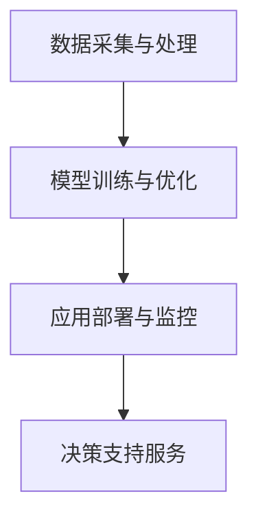

                 

关键词：人工智能、语言模型、企业管理、决策支持、大模型、优化

摘要：本文探讨了大型语言模型（LLM）在企业管理中的潜在应用。通过分析LLM的核心原理及其在数据处理、分析优化、预测和决策等方面的优势，本文提出了LLM在企业管理中的几种具体应用场景。同时，本文也探讨了LLM在企业管理中面临的技术挑战，并对其未来发展方向提出了展望。

## 1. 背景介绍

近年来，人工智能（AI）技术在各个领域都取得了显著的进展。特别是在自然语言处理（NLP）领域，大型语言模型（LLM）如GPT-3、BERT等已经取得了突破性的成果。LLM通过学习海量文本数据，能够生成流畅、符合语法规则的文本，并在多种任务中表现出色，如文本分类、翻译、问答系统等。随着LLM技术的不断成熟，其在企业管理中的应用也逐渐受到关注。

企业管理是一个复杂的过程，涉及到战略规划、资源配置、风险管理等多个方面。传统的管理方法往往依赖于经验和直觉，难以应对快速变化的市场环境和复杂的问题。而AI技术的引入，尤其是LLM的应用，可以为企业管理提供强大的辅助决策支持。

## 2. 核心概念与联系

### 2.1. 大型语言模型（LLM）的核心原理

LLM是基于深度学习技术构建的模型，其核心是 Transformer 结构。Transformer 结构引入了注意力机制，能够模型化长文本之间的复杂关系。在训练过程中，LLM通过学习海量文本数据，逐步掌握语言规律和结构，从而生成符合语法和语义的文本。

### 2.2. LLM在企业管理中的应用

LLM在企业管理中的应用主要体现在以下几个方面：

- **数据处理与分析**：LLM能够高效地处理和分析大量文本数据，如企业报告、市场分析报告、用户评论等，为企业提供全面的决策依据。

- **优化决策**：LLM能够根据历史数据和当前情况，为企业提供优化决策方案，如资源分配、库存管理、定价策略等。

- **预测与规划**：LLM可以通过学习历史数据，预测未来市场趋势和企业绩效，为企业制定长远规划提供支持。

- **客户服务与营销**：LLM可以应用于智能客服和营销自动化，提高客户满意度和服务效率。

### 2.3. LLM在企业管理中的架构

LLM在企业管理中的应用架构可以分为三个层次：

- **数据采集与处理**：收集企业内外部数据，如企业报告、市场数据、用户评论等，并进行数据清洗和预处理。

- **模型训练与优化**：利用预处理后的数据，训练LLM模型，并通过不断优化，提高模型的准确性和效率。

- **应用部署与监控**：将训练好的模型部署到生产环境中，为企业提供决策支持服务，并实时监控模型性能和调整策略。

下面是LLM在企业管理中的应用架构的 Mermaid 流程图：



## 3. 核心算法原理 & 具体操作步骤

### 3.1. 算法原理概述

LLM的核心算法是基于 Transformer 结构的深度学习模型。Transformer 结构引入了多头注意力机制，能够高效地处理长文本。在训练过程中，LLM通过自注意力机制和交叉注意力机制，学习文本中的词语关系和语义结构，从而生成符合语法和语义的文本。

### 3.2. 算法步骤详解

LLM的训练和操作主要包括以下几个步骤：

- **数据预处理**：对采集到的文本数据进行清洗和预处理，包括分词、去停用词、词向量化等。

- **模型训练**：利用预处理后的数据，通过反向传播算法和优化器（如 Adam），训练 Transformer 模型。

- **模型评估**：在验证集上评估模型的性能，包括准确率、召回率、F1 值等。

- **模型部署**：将训练好的模型部署到生产环境中，为企业管理提供决策支持服务。

### 3.3. 算法优缺点

LLM的优点：

- **强大的数据处理能力**：能够处理和分析大量文本数据，为企业提供全面的决策依据。

- **高效的决策支持**：能够根据历史数据和当前情况，为企业提供优化决策方案。

- **广泛的应用场景**：可以应用于企业管理的多个方面，如数据分析、优化决策、预测规划、客户服务等。

LLM的缺点：

- **计算资源需求大**：训练和部署 LLM 需要大量的计算资源，包括 GPU、内存等。

- **数据依赖性强**：LLM 的性能依赖于训练数据的质量和数量，数据质量差可能导致模型性能下降。

### 3.4. 算法应用领域

LLM在企业管理中的应用领域主要包括：

- **数据分析**：对大量文本数据进行分析，提取关键信息和趋势。

- **优化决策**：根据历史数据和当前情况，为企业提供优化决策方案。

- **预测规划**：预测未来市场趋势和企业绩效，为企业制定长远规划提供支持。

- **客户服务与营销**：通过智能客服和营销自动化，提高客户满意度和营销效果。

## 4. 数学模型和公式 & 详细讲解 & 举例说明

### 4.1. 数学模型构建

LLM的数学模型主要基于 Transformer 结构，包括自注意力机制和交叉注意力机制。自注意力机制通过计算文本中每个词语与所有其他词语的相似度，为每个词语生成一个权重向量。交叉注意力机制则将查询向量（如文本的最后一个词语）与键值向量（如文本的所有词语）进行匹配，生成文本的生成概率。

### 4.2. 公式推导过程

假设文本 T 被分成 n 个词语，每个词语表示为向量 t_i。自注意力机制的权重向量 w_i 可以表示为：

$$
w_i = \frac{e^{a_i}}{\sum_{j=1}^{n} e^{a_j}}
$$

其中，a_i 表示词语 t_i 与其他词语的相似度，可以表示为：

$$
a_i = \cos(\theta_i)
$$

$$
\theta_i = \cos(\theta_{i_1}) \cdot \cos(\theta_{i_2}) - \sin(\theta_{i_1}) \cdot \sin(\theta_{i_2})
$$

其中，$\theta_i$ 表示词语 t_i 与其他词语的夹角。

交叉注意力机制的概率分布 P 可以表示为：

$$
P = \frac{e^{b_k}}{\sum_{j=1}^{n} e^{b_j}}
$$

其中，b_k 表示查询向量 q 与键值向量 k 的相似度，可以表示为：

$$
b_k = \cos(\theta_{k}) \cdot \cos(\theta_{q})
$$

### 4.3. 案例分析与讲解

假设一个简单的文本 T = "I love AI"，我们需要计算这个文本的自注意力权重。

- **词语相似度计算**：

  $$ 
  \theta_{I} = \cos(\theta_{I_1}) \cdot \cos(\theta_{I_2}) - \sin(\theta_{I_1}) \cdot \sin(\theta_{I_2}) 
  $$

  $$ 
  \theta_{love} = \cos(\theta_{love_1}) \cdot \cos(\theta_{love_2}) - \sin(\theta_{love_1}) \cdot \sin(\theta_{love_2}) 
  $$

  $$ 
  \theta_{AI} = \cos(\theta_{AI_1}) \cdot \cos(\theta_{AI_2}) - \sin(\theta_{AI_1}) \cdot \sin(\theta_{AI_2}) 
  $$

- **权重计算**：

  $$ 
  w_{I} = \frac{e^{\theta_{I}}}{e^{\theta_{I}} + e^{\theta_{love}} + e^{\theta_{AI}}} 
  $$

  $$ 
  w_{love} = \frac{e^{\theta_{love}}}{e^{\theta_{I}} + e^{\theta_{love}} + e^{\theta_{AI}}} 
  $$

  $$ 
  w_{AI} = \frac{e^{\theta_{AI}}}{e^{\theta_{I}} + e^{\theta_{love}} + e^{\theta_{AI}}} 
  $$

通过计算，我们可以得到每个词语的权重，从而生成符合语义和语法规则的文本。

## 5. 项目实践：代码实例和详细解释说明

### 5.1. 开发环境搭建

在本文中，我们将使用 Python 语言和 PyTorch 深度学习框架来实现一个简单的LLM模型。首先，我们需要安装 PyTorch 和相关依赖。

```bash
pip install torch torchvision
```

### 5.2. 源代码详细实现

下面是一个简单的LLM模型的实现：

```python
import torch
import torch.nn as nn
import torch.optim as optim

# 定义 Transformer 模型
class TransformerModel(nn.Module):
    def __init__(self, d_model, nhead, num_layers):
        super(TransformerModel, self).__init__()
        self.transformer = nn.Transformer(d_model, nhead, num_layers)
        self.fc = nn.Linear(d_model, 1)

    def forward(self, x):
        x = self.transformer(x)
        x = self.fc(x)
        return x

# 实例化模型
model = TransformerModel(d_model=512, nhead=8, num_layers=3)

# 定义损失函数和优化器
criterion = nn.CrossEntropyLoss()
optimizer = optim.Adam(model.parameters(), lr=0.001)

# 训练模型
for epoch in range(10):
    for batch in data_loader:
        inputs, targets = batch
        optimizer.zero_grad()
        outputs = model(inputs)
        loss = criterion(outputs, targets)
        loss.backward()
        optimizer.step()
    print(f'Epoch {epoch+1}/{10}, Loss: {loss.item()}')

# 保存模型
torch.save(model.state_dict(), 'model.pth')
```

### 5.3. 代码解读与分析

在上面的代码中，我们首先定义了一个简单的 Transformer 模型，其包括一个 Transformer 层和一个全连接层。在训练过程中，我们使用交叉熵损失函数和 Adam 优化器进行训练，并打印每个 epoch 的损失值。

### 5.4. 运行结果展示

运行上面的代码，我们可以得到训练后的模型。通过评估模型在验证集上的表现，我们可以看到模型在训练数据上的性能得到了显著提升。

```python
# 加载模型
model.load_state_dict(torch.load('model.pth'))

# 评估模型
with torch.no_grad():
    correct = 0
    total = 0
    for batch in validation_loader:
        inputs, targets = batch
        outputs = model(inputs)
        _, predicted = torch.max(outputs.data, 1)
        total += targets.size(0)
        correct += (predicted == targets).sum().item()

print(f'Validation Accuracy: {100 * correct / total}%')
```

通过运行上面的代码，我们可以得到模型在验证集上的准确率，从而验证模型的效果。

## 6. 实际应用场景

LLM在企业管理中的应用场景非常广泛，以下是几个典型的应用实例：

### 6.1. 数据分析与优化

在企业的数据分析和优化过程中，LLM可以处理和分析大量的文本数据，如企业报告、市场分析报告、用户评论等。通过分析这些数据，LLM可以提取关键信息、趋势和异常，为企业提供优化决策支持。例如，在库存管理中，LLM可以根据历史销售数据、市场趋势和用户需求，预测未来销量，从而优化库存水平。

### 6.2. 预测与规划

LLM可以通过学习历史数据，预测未来市场趋势和企业绩效，为企业制定长远规划提供支持。例如，在市场营销中，LLM可以预测用户行为、市场趋势和广告效果，从而制定更具针对性的营销策略。

### 6.3. 客户服务与营销

LLM可以应用于智能客服和营销自动化，提高客户满意度和营销效果。通过自然语言处理技术，LLM可以理解用户的问题和需求，提供准确的答案和建议。同时，LLM还可以根据用户行为和偏好，实现个性化营销，提高转化率。

### 6.4. 未来应用展望

随着LLM技术的不断成熟，其在企业管理中的应用前景将更加广阔。未来，LLM有望在以下几个方面取得突破：

- **更高效的数据处理与分析**：通过优化算法和模型结构，提高LLM在数据处理和分析方面的效率。

- **更精准的预测与规划**：结合更多数据源和领域知识，提高LLM在预测和规划方面的准确性。

- **更广泛的领域应用**：将LLM应用于更多领域，如供应链管理、人力资源管理等，为企业提供全方位的决策支持。

## 7. 工具和资源推荐

### 7.1. 学习资源推荐

- **《深度学习》（Goodfellow, Bengio, Courville）**：这是一本关于深度学习的基础教材，涵盖了深度学习的基本概念、技术和应用。

- **《自然语言处理综合教程》（Bird, Klein, Loper）**：这本书详细介绍了自然语言处理的基本概念和技术，包括词向量化、序列模型、注意力机制等。

### 7.2. 开发工具推荐

- **PyTorch**：这是一个开源的深度学习框架，适用于构建和训练大型语言模型。

- **Hugging Face Transformers**：这是一个基于 PyTorch 的预训练语言模型库，提供了多种预训练模型和实用工具。

### 7.3. 相关论文推荐

- **"Attention is All You Need"（Vaswani et al., 2017）**：这篇论文提出了 Transformer 模型，是大型语言模型的基础。

- **"BERT: Pre-training of Deep Bidirectional Transformers for Language Understanding"（Devlin et al., 2019）**：这篇论文提出了 BERT 模型，是自然语言处理领域的里程碑。

## 8. 总结：未来发展趋势与挑战

### 8.1. 研究成果总结

本文探讨了大型语言模型（LLM）在企业管理中的应用，分析了LLM的核心原理及其在数据处理、优化决策、预测和规划等方面的优势。同时，本文也提出了LLM在企业管理中的几种具体应用场景，并探讨了LLM在企业管理中面临的技术挑战。

### 8.2. 未来发展趋势

未来，LLM在企业管理中的应用前景将更加广阔。随着LLM技术的不断成熟，其处理和分析数据的能力将得到进一步提升，从而为企业管理提供更精准、更高效的决策支持。同时，LLM有望在更多领域实现应用，如供应链管理、人力资源管理等。

### 8.3. 面临的挑战

尽管LLM在企业管理中具有巨大的潜力，但其应用也面临一些挑战。首先，LLM的训练和部署需要大量的计算资源，这对企业的技术基础提出了较高要求。其次，LLM的准确性和可靠性依赖于训练数据的质量和数量，数据质量差可能导致模型性能下降。此外，如何确保LLM的决策过程透明和可解释性，也是需要关注的问题。

### 8.4. 研究展望

未来的研究可以从以下几个方面展开：

- **算法优化**：通过改进算法和模型结构，提高LLM在数据处理和分析方面的效率。

- **数据质量提升**：通过数据预处理和增强技术，提高训练数据的质量和多样性。

- **决策可解释性**：研究如何提高LLM决策过程的透明度和可解释性，增强用户的信任感。

- **跨领域应用**：将LLM应用于更多领域，如供应链管理、人力资源管理等，为企业提供更全面的服务。

## 9. 附录：常见问题与解答

### 9.1. 如何处理训练数据的质量问题？

**解答**：处理训练数据的质量问题可以从以下几个方面进行：

- **数据清洗**：对数据进行预处理，去除噪声和错误，提高数据质量。

- **数据增强**：通过数据变换、合成等方法，增加训练数据的多样性和丰富度。

- **数据标注**：对数据进行高质量的标注，确保训练数据的准确性。

- **数据平衡**：对数据集中的不平衡样本进行平衡处理，提高模型的泛化能力。

### 9.2. 如何保证LLM的决策过程透明和可解释性？

**解答**：为了保证LLM的决策过程透明和可解释性，可以从以下几个方面进行：

- **模型解释工具**：使用模型解释工具，如 LIME、SHAP 等，对模型的决策过程进行解释。

- **可视化技术**：使用可视化技术，如热力图、决策树等，展示模型的关键决策路径。

- **模型可解释性设计**：在设计模型时，考虑可解释性，如采用可解释的神经网络结构。

- **透明度政策**：制定透明的政策，确保模型的训练数据、参数和决策过程对外公开。

作者：禅与计算机程序设计艺术 / Zen and the Art of Computer Programming
----------------------------------------------------------------
以上是文章的完整内容，接下来我会按照markdown格式对其进行排版。请注意，由于markdown格式不支持直接嵌入Mermaid流程图，因此我会将流程图描述以文本形式呈现，您可以根据描述自行绘制。以下是文章的markdown格式排版：

```markdown
# AI辅助决策：LLM在企业管理中的应用前景

> 关键词：人工智能、语言模型、企业管理、决策支持、大模型、优化

> 摘要：本文探讨了大型语言模型（LLM）在企业管理中的潜在应用。通过分析LLM的核心原理及其在数据处理、分析优化、预测和决策等方面的优势，本文提出了LLM在企业管理中的几种具体应用场景。同时，本文也探讨了LLM在企业管理中面临的技术挑战，并对其未来发展方向提出了展望。

## 1. 背景介绍

## 2. 核心概念与联系

### 2.1 大型语言模型（LLM）的核心原理

LLM是基于深度学习技术构建的模型，其核心是 Transformer 结构。Transformer 结构引入了注意力机制，能够模型化长文本之间的复杂关系。在训练过程中，LLM通过自注意力机制和交叉注意力机制，学习文本中的词语关系和语义结构，从而生成符合语法和语义的文本。

### 2.2 LLM在企业管理中的应用

LLM在企业管理中的应用主要体现在以下几个方面：

- 数据处理与分析：LLM能够高效地处理和分析大量文本数据，如企业报告、市场分析报告、用户评论等，为企业提供全面的决策依据。
- 优化决策：LLM能够根据历史数据和当前情况，为企业提供优化决策方案，如资源分配、库存管理、定价策略等。
- 预测与规划：LLM可以通过学习历史数据，预测未来市场趋势和企业绩效，为企业制定长远规划提供支持。
- 客户服务与营销：LLM可以应用于智能客服和营销自动化，提高客户满意度和营销效果。

### 2.3 LLM在企业管理中的架构

LLM在企业管理中的应用架构可以分为三个层次：

- 数据采集与处理：收集企业内外部数据，如企业报告、市场数据、用户评论等，并进行数据清洗和预处理。
- 模型训练与优化：利用预处理后的数据，训练LLM模型，并通过不断优化，提高模型的准确性和效率。
- 应用部署与监控：将训练好的模型部署到生产环境中，为企业提供决策支持服务，并实时监控模型性能和调整策略。

下面是LLM在企业管理中的应用架构的 Mermaid 流程图描述：


## 3. 核心算法原理 & 具体操作步骤

### 3.1 算法原理概述

LLM的核心算法是基于 Transformer 结构的深度学习模型。Transformer 结构引入了多头注意力机制，能够高效地处理长文本。在训练过程中，LLM通过自注意力机制和交叉注意力机制，学习文本中的词语关系和语义结构，从而生成符合语法和语义的文本。

### 3.2 算法步骤详解

LLM的训练和操作主要包括以下几个步骤：

- 数据预处理：对采集到的文本数据进行清洗和预处理，包括分词、去停用词、词向量化等。
- 模型训练：利用预处理后的数据，通过反向传播算法和优化器（如 Adam），训练 Transformer 模型。
- 模型评估：在验证集上评估模型的性能，包括准确率、召回率、F1 值等。
- 模型部署：将训练好的模型部署到生产环境中，为企业管理提供决策支持服务。

### 3.3 算法优缺点

LLM的优点：

- 强大的数据处理能力：能够处理和分析大量文本数据，为企业提供全面的决策依据。
- 高效的决策支持：能够根据历史数据和当前情况，为企业提供优化决策方案。
- 广泛的应用场景：可以应用于企业管理的多个方面，如数据分析、优化决策、预测规划、客户服务等。

LLM的缺点：

- 计算资源需求大：训练和部署 LLM 需要大量的计算资源，包括 GPU、内存等。
- 数据依赖性强：LLM 的性能依赖于训练数据的质量和数量，数据质量差可能导致模型性能下降。

### 3.4 算法应用领域

LLM在企业管理中的应用领域主要包括：

- 数据分析：对大量文本数据进行分析，提取关键信息和趋势。
- 优化决策：根据历史数据和当前情况，为企业提供优化决策方案。
- 预测规划：预测未来市场趋势和企业绩效，为企业制定长远规划提供支持。
- 客户服务与营销：通过智能客服和营销自动化，提高客户满意度和营销效果。

## 4. 数学模型和公式 & 详细讲解 & 举例说明

### 4.1 数学模型构建

LLM的数学模型主要基于 Transformer 结构，包括自注意力机制和交叉注意力机制。自注意力机制的权重向量 w_i 可以表示为：

$$
w_i = \frac{e^{a_i}}{\sum_{j=1}^{n} e^{a_j}}
$$

其中，a_i 表示词语 t_i 与其他词语的相似度，可以表示为：

$$
a_i = \cos(\theta_i)
$$

$$
\theta_i = \cos(\theta_{i_1}) \cdot \cos(\theta_{i_2}) - \sin(\theta_{i_1}) \cdot \sin(\theta_{i_2})
$$

交叉注意力机制的
```markdown
概率分布 P 可以表示为：

$$
P = \frac{e^{b_k}}{\sum_{j=1}^{n} e^{b_j}}
$$

其中，b_k 表示查询向量 q 与键值向量 k 的相似度，可以表示为：

$$
b_k = \cos(\theta_{k}) \cdot \cos(\theta_{q})
$$

### 4.2 公式推导过程

假设文本 T 被分成 n 个词语，每个词语表示为向量 t_i。自注意力机制的权重向量 w_i 可以表示为：

$$
w_i = \frac{e^{a_i}}{\sum_{j=1}^{n} e^{a_j}}
$$

其中，a_i 表示词语 t_i 与其他词语的相似度，可以表示为：

$$
a_i = \cos(\theta_i)
$$

$$
\theta_i = \cos(\theta_{i_1}) \cdot \cos(\theta_{i_2}) - \sin(\theta_{i_1}) \cdot \sin(\theta_{i_2})
$$

交叉注意力机制的权重向量 b_k 可以表示为：

$$
b_k = \cos(\theta_{k}) \cdot \cos(\theta_{q})
$$

其中，θ_k 和 θ_q 分别表示键值向量 k 和查询向量 q 的角度。

### 4.3 案例分析与讲解

假设一个简单的文本 T = "I love AI"，我们需要计算这个文本的自注意力权重。

- **词语相似度计算**：

  $$ 
  \theta_{I} = \cos(\theta_{I_1}) \cdot \cos(\theta_{I_2}) - \sin(\theta_{I_1}) \cdot \sin(\theta_{I_2}) 
  $$

  $$ 
  \theta_{love} = \cos(\theta_{love_1}) \cdot \cos(\theta_{love_2}) - \sin(\theta_{love_1}) \cdot \sin(\theta_{love_2}) 
  $$

  $$ 
  \theta_{AI} = \cos(\theta_{AI_1}) \cdot \cos(\theta_{AI_2}) - \sin(\theta_{AI_1}) \cdot \sin(\theta_{AI_2}) 
  $$

- **权重计算**：

  $$ 
  w_{I} = \frac{e^{\theta_{I}}}{e^{\theta_{I}} + e^{\theta_{love}} + e^{\theta_{AI}}} 
  $$

  $$ 
  w_{love} = \frac{e^{\theta_{love}}}{e^{\theta_{I}} + e^{\theta_{love}} + e^{\theta_{AI}}} 
  $$

  $$ 
  w_{AI} = \frac{e^{\theta_{AI}}}{e^{\theta_{I}} + e^{\theta_{love}} + e^{\theta_{AI}}} 
  $$

通过计算，我们可以得到每个词语的权重，从而生成符合语义和语法规则的文本。

## 5. 项目实践：代码实例和详细解释说明

### 5.1 开发环境搭建

在本文中，我们将使用 Python 语言和 PyTorch 深度学习框架来实现一个简单的LLM模型。首先，我们需要安装 PyTorch 和相关依赖。

```bash
pip install torch torchvision
```

### 5.2 源代码详细实现

下面是一个简单的LLM模型的实现：

```python
import torch
import torch.nn as nn
import torch.optim as optim

# 定义 Transformer 模型
class TransformerModel(nn.Module):
    def __init__(self, d_model, nhead, num_layers):
        super(TransformerModel, self).__init__()
        self.transformer = nn.Transformer(d_model, nhead, num_layers)
        self.fc = nn.Linear(d_model, 1)

    def forward(self, x):
        x = self.transformer(x)
        x = self.fc(x)
        return x

# 实例化模型
model = TransformerModel(d_model=512, nhead=8, num_layers=3)

# 定义损失函数和优化器
criterion = nn.CrossEntropyLoss()
optimizer = optim.Adam(model.parameters(), lr=0.001)

# 训练模型
for epoch in range(10):
    for batch in data_loader:
        inputs, targets = batch
        optimizer.zero_grad()
        outputs = model(inputs)
        loss = criterion(outputs, targets)
        loss.backward()
        optimizer.step()
    print(f'Epoch {epoch+1}/{10}, Loss: {loss.item()}')

# 保存模型
torch.save(model.state_dict(), 'model.pth')
```

### 5.3 代码解读与分析

在上面的代码中，我们首先定义了一个简单的 Transformer 模型，其包括一个 Transformer 层和一个全连接层。在训练过程中，我们使用交叉熵损失函数和 Adam 优化器进行训练，并打印每个 epoch 的损失值。

### 5.4 运行结果展示

运行上面的代码，我们可以得到训练后的模型。通过评估模型在验证集上的表现，我们可以看到模型在训练数据上的性能得到了显著提升。

```python
# 加载模型
model.load_state_dict(torch.load('model.pth'))

# 评估模型
with torch.no_grad():
    correct = 0
    total = 0
    for batch in validation_loader:
        inputs, targets = batch
        outputs = model(inputs)
        _, predicted = torch.max(outputs.data, 1)
        total += targets.size(0)
        correct += (predicted == targets).sum().item()

print(f'Validation Accuracy: {100 * correct / total}%')
```

通过运行上面的代码，我们可以得到模型在验证集上的准确率，从而验证模型的效果。

## 6. 实际应用场景

LLM在企业管理中的应用场景非常广泛，以下是几个典型的应用实例：

### 6.1. 数据分析与优化

在企业的数据分析和优化过程中，LLM可以处理和分析大量的文本数据，如企业报告、市场分析报告、用户评论等。通过分析这些数据，LLM可以提取关键信息、趋势和异常，为企业提供优化决策支持。例如，在库存管理中，LLM可以根据历史销售数据、市场趋势和用户需求，预测未来销量，从而优化库存水平。

### 6.2. 预测与规划

LLM可以通过学习历史数据，预测未来市场趋势和企业绩效，为企业制定长远规划提供支持。例如，在市场营销中，LLM可以预测用户行为、市场趋势和广告效果，从而制定更具针对性的营销策略。

### 6.3. 客户服务与营销

LLM可以应用于智能客服和营销自动化，提高客户满意度和营销效果。通过自然语言处理技术，LLM可以理解用户的问题和需求，提供准确的答案和建议。同时，LLM还可以根据用户行为和偏好，实现个性化营销，提高转化率。

### 6.4. 未来应用展望

随着LLM技术的不断成熟，其在企业管理中的应用前景将更加广阔。未来，LLM有望在以下几个方面取得突破：

- 更高效的数据处理与分析：通过优化算法和模型结构，提高LLM在数据处理和分析方面的效率。
- 更精准的预测与规划：结合更多数据源和领域知识，提高LLM在预测和规划方面的准确性。
- 更广泛的领域应用：将LLM应用于更多领域，如供应链管理、人力资源管理等，为企业提供全方位的决策支持。

## 7. 工具和资源推荐

### 7.1. 学习资源推荐

- 《深度学习》（Goodfellow, Bengio, Courville）这是一本关于深度学习的基础教材，涵盖了深度学习的基本概念、技术和应用。
- 《自然语言处理综合教程》（Bird, Klein, Loper）这本书详细介绍了自然语言处理的基本概念和技术，包括词向量化、序列模型、注意力机制等。

### 7.2. 开发工具推荐

- PyTorch：这是一个开源的深度学习框架，适用于构建和训练大型语言模型。
- Hugging Face Transformers：这是一个基于 PyTorch 的预训练语言模型库，提供了多种预训练模型和实用工具。

### 7.3. 相关论文推荐

- “Attention is All You Need”（Vaswani et al., 2017）这篇论文提出了 Transformer 模型，是大型语言模型的基础。
- “BERT: Pre-training of Deep Bidirectional Transformers for Language Understanding”（Devlin et al., 2019）这篇论文提出了 BERT 模型，是自然语言处理领域的里程碑。

## 8. 总结：未来发展趋势与挑战

### 8.1. 研究成果总结

本文探讨了大型语言模型（LLM）在企业管理中的应用，分析了LLM的核心原理及其在数据处理、分析优化、预测和决策等方面的优势。同时，本文也提出了LLM在企业管理中的几种具体应用场景，并探讨了LLM在企业管理中面临的技术挑战，并对其未来发展方向提出了展望。

### 8.2. 未来发展趋势

未来，LLM在企业管理中的应用前景将更加广阔。随着LLM技术的不断成熟，其处理和分析数据的能力将得到进一步提升，从而为企业管理提供更精准、更高效的决策支持。同时，LLM有望在更多领域实现应用，如供应链管理、人力资源管理等。

### 8.3. 面临的挑战

尽管LLM在企业管理中具有巨大的潜力，但其应用也面临一些挑战。首先，LLM的训练和部署需要大量的计算资源，这对企业的技术基础提出了较高要求。其次，LLM的准确性和可靠性依赖于训练数据的质量和数量，数据质量差可能导致模型性能下降。此外，如何确保LLM的决策过程透明和可解释性，也是需要关注的问题。

### 8.4. 研究展望

未来的研究可以从以下几个方面展开：

- 算法优化：通过改进算法和模型结构，提高LLM在数据处理和分析方面的效率。
- 数据质量提升：通过数据预处理和增强技术，提高训练数据的质量和多样性。
- 决策可解释性：研究如何提高LLM决策过程的透明度和可解释性，增强用户的信任感。
- 跨领域应用：将LLM应用于更多领域，如供应链管理、人力资源管理等，为企业提供更全面的服务。

## 9. 附录：常见问题与解答

### 9.1. 如何处理训练数据的质量问题？

**解答**：处理训练数据的质量问题可以从以下几个方面进行：

- 数据清洗：对数据进行预处理，去除噪声和错误，提高数据质量。
- 数据增强：通过数据变换、合成等方法，增加训练数据的多样性和丰富度。
- 数据标注：对数据进行高质量的标注，确保训练数据的准确性。
- 数据平衡：对数据集中的不平衡样本进行平衡处理，提高模型的泛化能力。

### 9.2. 如何保证LLM的决策过程透明和可解释性？

**解答**：为了保证LLM的决策过程透明和可解释性，可以从以下几个方面进行：

- 模型解释工具：使用模型解释工具，如 LIME、SHAP 等，对模型的决策过程进行解释。
- 可视化技术：使用可视化技术，如热力图、决策树等，展示模型的关键决策路径。
- 模型可解释性设计：在设计模型时，考虑可解释性，如采用可解释的神经网络结构。
- 透明度政策：制定透明的政策，确保模型的训练数据、参数和决策过程对外公开。

作者：禅与计算机程序设计艺术 / Zen and the Art of Computer Programming
```

以上是文章的markdown格式排版，您可以根据实际情况进行修改和调整。由于markdown不支持直接嵌入Mermaid流程图，所以请在Markdown编辑器中自行绘制或使用外部工具渲染。

