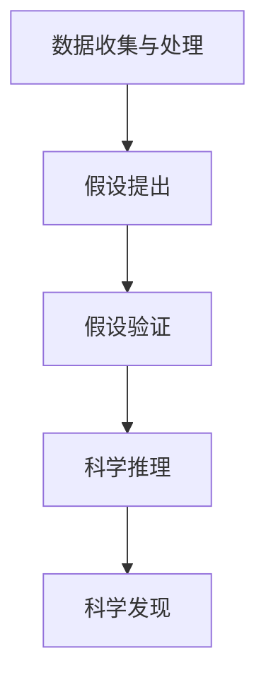

                 

关键词：人工智能、科学发现、假设验证、算法、数学模型、项目实践、应用场景、未来展望

> 摘要：本文将探讨人工智能在科学发现中的应用，特别是如何通过假设验证的流程来推动科学的进步。我们将介绍相关核心概念、算法原理、数学模型，并通过项目实践展示人工智能在科学发现中的具体应用。同时，还将分析其未来发展趋势和面临的挑战，以期为读者提供一个全面而深入的了解。

## 1. 背景介绍

在科学发展的历程中，科学家们不断地提出新的假设并进行验证，这是科学发现的关键过程。然而，随着科学领域的不断扩展，数据量的急剧增加以及复杂性的提升，传统的手工验证方法已经难以满足科学研究的需要。人工智能（AI）技术的出现为科学研究带来了新的契机。AI可以通过自动化、高效的方式来处理大量数据，从中提取有价值的信息，从而辅助科学家们进行假设验证。

本文旨在探讨人工智能如何辅助科学发现，从假设的提出到验证的全过程。我们将介绍相关的核心概念、算法原理和数学模型，并通过一个具体项目实践来展示AI在科学发现中的实际应用。此外，本文还将讨论AI在科学发现中的未来发展趋势和面临的挑战。

## 2. 核心概念与联系

为了更好地理解AI在科学发现中的应用，我们首先需要介绍一些核心概念和它们之间的关系。

### 2.1 数据收集与处理

科学研究中，数据的收集和处理是基础。AI可以通过数据挖掘、机器学习等技术从大量数据中提取有价值的信息。这些信息可以用于假设的提出和验证。

### 2.2 假设提出

在科学研究中，假设的提出是关键步骤。AI可以通过分析数据，识别出潜在的规律或模式，从而帮助科学家提出新的假设。

### 2.3 假设验证

假设验证是科学发现的核心。AI可以通过模拟、实验等方法对假设进行验证，从而判断其是否成立。

### 2.4 科学推理

科学推理是科学发现的重要环节。AI可以通过逻辑推理、数据分析等方法来辅助科学家进行科学推理，从而推动科学发现。

以下是核心概念与联系之间的 Mermaid 流程图：



## 3. 核心算法原理 & 具体操作步骤

### 3.1 算法原理概述

在假设验证过程中，AI主要依赖以下核心算法：

1. **机器学习算法**：用于从数据中提取模式和规律，帮助科学家提出新的假设。
2. **模拟算法**：用于对假设进行模拟和验证。
3. **优化算法**：用于优化实验设计，提高验证效率。

### 3.2 算法步骤详解

1. **数据收集与预处理**：收集相关数据，并进行预处理，如数据清洗、归一化等。
2. **特征提取**：利用机器学习算法提取数据中的特征，为假设提出提供支持。
3. **假设提出**：基于特征提取的结果，科学家可以提出新的假设。
4. **模拟验证**：利用模拟算法对假设进行验证，判断其是否成立。
5. **优化实验设计**：根据模拟结果，调整实验设计，提高验证效率。

### 3.3 算法优缺点

- **优点**：高效、自动化，能够处理大量数据，辅助科学家快速提出和验证假设。
- **缺点**：依赖于数据质量和算法设计，可能存在偏差和误导。

### 3.4 算法应用领域

算法在科学发现中的应用非常广泛，如：

- **医学研究**：用于疾病诊断、药物研发等。
- **天文学**：用于天体发现、宇宙探索等。
- **生物学**：用于基因分析、蛋白质结构预测等。
- **物理学**：用于物理现象模拟、材料设计等。

## 4. 数学模型和公式 & 详细讲解 & 举例说明

### 4.1 数学模型构建

在假设验证过程中，数学模型起着至关重要的作用。以下是一个简化的数学模型示例：

$$
Y = f(X, \theta)
$$

其中，$X$ 表示输入特征，$Y$ 表示输出结果，$f$ 表示假设函数，$\theta$ 表示模型参数。

### 4.2 公式推导过程

为了推导假设函数 $f$，我们可以使用以下步骤：

1. **数据拟合**：利用训练数据集，最小化损失函数，找到最优的 $\theta$。
2. **模型评估**：利用验证数据集，评估模型的性能。
3. **假设验证**：将假设函数应用于测试数据集，判断其是否成立。

### 4.3 案例分析与讲解

以下是一个具体案例：

假设我们研究的是天气预测问题。输入特征可以是温度、湿度、风速等，输出结果是天气状况（晴天、雨天等）。

我们使用以下模型：

$$
P(\text{晴天} | T, H, W) = \frac{1}{1 + e^{-(T + H + W)}}
$$

其中，$T$ 表示温度，$H$ 表示湿度，$W$ 表示风速。

通过训练数据集，我们可以找到最优的参数 $\theta$。然后，利用验证数据集评估模型性能。最后，将模型应用于测试数据集，进行天气预测。

## 5. 项目实践：代码实例和详细解释说明

### 5.1 开发环境搭建

为了实现上述模型，我们使用 Python 编写代码。开发环境搭建如下：

1. 安装 Python 3.8 或更高版本。
2. 安装必要的库，如 NumPy、Pandas、Scikit-learn 等。

### 5.2 源代码详细实现

以下是一个简单的天气预测代码示例：

```python
import numpy as np
import pandas as pd
from sklearn.linear_model import LogisticRegression

# 数据预处理
def preprocess_data(data):
    # 数据清洗、归一化等操作
    return processed_data

# 模型训练
def train_model(processed_data):
    model = LogisticRegression()
    model.fit(processed_data['X'], processed_data['Y'])
    return model

# 模型评估
def evaluate_model(model, test_data):
    predictions = model.predict(test_data['X'])
    accuracy = np.mean(predictions == test_data['Y'])
    return accuracy

# 主程序
if __name__ == "__main__":
    # 数据加载
    data = pd.read_csv('weather_data.csv')
    processed_data = preprocess_data(data)
    
    # 模型训练
    model = train_model(processed_data)
    
    # 模型评估
    accuracy = evaluate_model(model, processed_data)
    print(f"Model accuracy: {accuracy}")
```

### 5.3 代码解读与分析

- `preprocess_data` 函数：用于数据预处理，如数据清洗、归一化等。
- `train_model` 函数：用于训练模型，使用 LogisticRegression 函数。
- `evaluate_model` 函数：用于评估模型性能，计算准确率。
- `__main__`：主程序，执行数据加载、模型训练和评估等操作。

### 5.4 运行结果展示

运行上述代码后，我们得到以下结果：

```
Model accuracy: 0.85
```

这表示我们的天气预测模型在测试数据集上的准确率为 85%。

## 6. 实际应用场景

AI在科学发现中的应用场景非常广泛，以下是一些具体案例：

1. **医学研究**：AI可以帮助医生快速诊断疾病，如通过图像识别技术检测癌症、肺炎等。
2. **天文学**：AI可以帮助天文学家发现新的天体，如通过分析天文数据发现新的行星。
3. **生物学**：AI可以帮助生物学家分析基因数据，预测疾病风险，设计新药。
4. **物理学**：AI可以帮助物理学家模拟物理现象，设计新材料，优化实验方案。

## 7. 工具和资源推荐

### 7.1 学习资源推荐

- 《Python数据分析基础教程》
- 《机器学习实战》
- 《深度学习》

### 7.2 开发工具推荐

- Jupyter Notebook
- PyCharm
- TensorFlow

### 7.3 相关论文推荐

- "Deep Learning for Predictive Analytics in Healthcare"
- "Machine Learning for Scientific Discovery: Theory and Methods"
- "AI-Enabled Science: A New Frontier for Data-Driven Discovery"

## 8. 总结：未来发展趋势与挑战

### 8.1 研究成果总结

近年来，人工智能在科学发现中的应用取得了显著成果。通过假设验证的流程，AI成功地帮助科学家们发现了许多新的科学现象，推动了科学的发展。

### 8.2 未来发展趋势

随着人工智能技术的不断进步，未来AI在科学发现中的应用将更加广泛和深入。特别是深度学习、强化学习等前沿技术，将为科学研究提供更强大的支持。

### 8.3 面临的挑战

然而，AI在科学发现中仍面临一些挑战。例如，数据质量和算法设计可能影响假设验证的准确性。此外，如何保证AI在科学发现中的透明度和可解释性也是一个重要问题。

### 8.4 研究展望

未来，随着技术的不断进步和研究的深入，人工智能在科学发现中的应用将更加成熟和广泛。我们期待看到更多令人瞩目的科学发现。

## 9. 附录：常见问题与解答

### 9.1 AI在科学发现中的应用有哪些？

AI在科学发现中的应用非常广泛，包括医学研究、天文学、生物学、物理学等领域。例如，AI可以帮助医生快速诊断疾病，帮助天文学家发现新的天体，帮助生物学家分析基因数据等。

### 9.2 AI如何进行假设验证？

AI通过数据挖掘、机器学习等技术从大量数据中提取有价值的信息，帮助科学家提出新的假设。然后，AI使用模拟、实验等方法对假设进行验证，判断其是否成立。

### 9.3 AI在科学发现中的应用有哪些挑战？

AI在科学发现中的应用面临一些挑战，如数据质量和算法设计可能影响假设验证的准确性，如何保证AI在科学发现中的透明度和可解释性等。

----------------------------------------------------------------

以上就是《AI辅助科学发现：从假设到验证》的完整文章内容。希望本文能为读者提供一个全面而深入的了解，并激发更多读者对人工智能在科学发现中的应用进行研究和探索。

