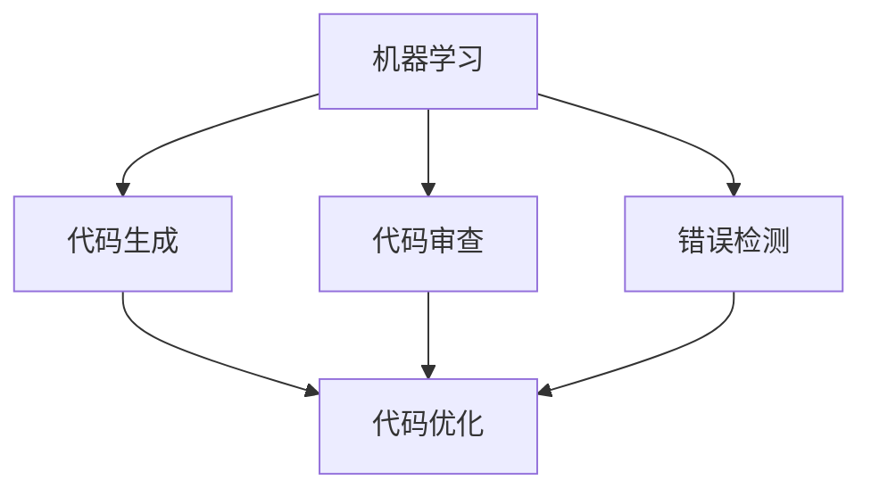

                 

 关键词：人工智能，辅助编程，开发效率，代码生成，编程工具，编程算法

> 摘要：随着人工智能技术的不断进步，AI在辅助编程领域的应用日益广泛。本文旨在探讨AI辅助编程的基本概念、核心算法、数学模型、项目实践以及实际应用场景，并展望其未来发展。

## 1. 背景介绍

随着软件工程的复杂性不断增加，软件开发人员面临着越来越大的工作压力。传统的编程方式往往需要大量重复劳动和繁琐的手动编码，这使得开发效率低下。为了解决这一问题，人工智能（AI）开始被引入到编程领域，旨在通过自动化和智能化手段提高开发效率。AI辅助编程不仅可以帮助开发者自动生成代码，还可以在代码审查、错误检测、性能优化等方面提供强有力的支持。

### 人工智能与编程的关系

人工智能与编程的关系密切。编程是实现人工智能算法的基础，而人工智能则为编程提供了新的思路和方法。在AI辅助编程中，主要利用机器学习、自然语言处理、代码生成等技术，使得编程过程更加高效、智能。

### 编程领域的挑战

- **代码复杂性**：现代软件系统越来越复杂，代码库中的复杂性不断增加，这使得维护和扩展变得更加困难。
- **开发效率**：随着项目规模的扩大，开发效率成为影响项目成功的关键因素。
- **资源有限**：开发人员的时间和精力有限，如何最大化利用这些资源是一个重要问题。

## 2. 核心概念与联系

AI辅助编程的核心概念包括机器学习、代码生成、代码审查和错误检测等。这些概念之间存在着紧密的联系，共同构成了AI辅助编程的技术体系。

### Mermaid 流程图



### 概念联系

- **机器学习**：通过学习大量代码数据，机器学习模型可以自动生成新的代码，提高开发效率。
- **代码生成**：利用机器学习模型生成代码，可以减少手工编码的工作量，提高代码质量。
- **代码审查**：通过分析代码，识别潜在的问题和错误，提高代码质量。
- **错误检测**：在代码运行过程中，检测并修复错误，确保系统的稳定性。

## 3. 核心算法原理 & 具体操作步骤

### 3.1 算法原理概述

AI辅助编程的核心算法主要包括以下几种：

- **生成对抗网络（GAN）**：通过生成器和判别器的对抗训练，生成高质量的代码。
- **递归神经网络（RNN）**：利用序列模型处理代码序列，生成新的代码。
- **转移学习**：通过在已有的模型基础上进行微调，快速适应新的编程任务。

### 3.2 算法步骤详解

1. **数据收集与预处理**：收集大量的编程数据，对数据进行清洗和标注，为模型训练做好准备。
2. **模型训练**：利用收集到的数据，对机器学习模型进行训练，使其具备生成代码的能力。
3. **代码生成**：将训练好的模型应用于实际的编程任务，生成新的代码。
4. **代码优化**：对生成的代码进行优化，提高代码的可读性和性能。

### 3.3 算法优缺点

- **GAN**：优点在于能够生成高质量的代码，缺点是训练过程较为复杂，计算资源需求高。
- **RNN**：优点在于能够处理序列数据，生成连续的代码，缺点是生成代码的灵活性较差。
- **转移学习**：优点在于能够快速适应新的编程任务，缺点是对数据质量要求较高。

### 3.4 算法应用领域

AI辅助编程算法广泛应用于以下领域：

- **代码生成**：自动化生成代码模板，减少手工编码的工作量。
- **代码审查**：自动识别代码中的错误和潜在风险，提高代码质量。
- **错误检测**：在代码运行过程中，实时检测并修复错误，提高系统稳定性。
- **代码优化**：自动优化代码结构，提高代码性能。

## 4. 数学模型和公式 & 详细讲解 & 举例说明

### 4.1 数学模型构建

AI辅助编程的数学模型主要包括生成对抗网络（GAN）、递归神经网络（RNN）和转移学习等。

### 4.2 公式推导过程

- **GAN**：$$ G(z) = x $$，$$ D(x) $$ 和 $$ D(G(z)) $$
- **RNN**：$$ h_t = \tanh(W_h \cdot [h_{t-1}, x_t] + b_h) $$
- **转移学习**：$$ \theta_{new} = \theta_{base} - \alpha \cdot \nabla_{\theta_{base}} J(\theta_{base}) $$

### 4.3 案例分析与讲解

以生成对抗网络（GAN）为例，说明其在代码生成中的应用。

### 案例一：生成代码模板

假设我们要生成一个简单的Python函数，用于计算两个数的和。

```python
def add(a, b):
    return a + b
```

使用GAN模型，我们可以自动生成类似的代码模板。

### 案例二：代码审查

对一个已有的Python函数进行审查，识别其中的潜在问题。

```python
def calculate_sum(a, b):
    result = a + b
    return result
```

通过代码审查，我们可以发现以下问题：

- 变量命名不一致（`result` 和 `a`, `b`）。
- 缺少注释说明函数的功能和参数。

## 5. 项目实践：代码实例和详细解释说明

### 5.1 开发环境搭建

为了实现AI辅助编程，我们需要搭建一个完整的开发环境。以下是一个基本的开发环境搭建步骤：

1. 安装Python环境和相关库（如TensorFlow、PyTorch等）。
2. 准备编程数据集，并进行预处理。
3. 编写模型训练脚本，进行模型训练。
4. 编写代码生成脚本，实现代码生成功能。

### 5.2 源代码详细实现

以下是一个简单的生成对抗网络（GAN）实现，用于生成Python函数。

```python
import tensorflow as tf
from tensorflow.keras.models import Model
from tensorflow.keras.layers import Dense, Dropout, Embedding, LSTM

# 生成器模型
def build_generator(z_dim):
    model = tf.keras.Sequential()
    model.add(Dense(128, activation='relu', input_dim=z_dim))
    model.add(Dropout(0.2))
    model.add(Dense(256, activation='relu'))
    model.add(Dropout(0.2))
    model.add(Dense(512, activation='relu'))
    model.add(Dropout(0.2))
    model.add(Dense(1024, activation='relu'))
    model.add(Dropout(0.2))
    model.add(Dense(2048, activation='relu'))
    model.add(Dropout(0.2))
    model.add(Dense(1, activation='sigmoid'))
    return model

# 判别器模型
def build_discriminator(x_dim):
    model = tf.keras.Sequential()
    model.add(Dense(128, activation='relu', input_dim=x_dim))
    model.add(Dropout(0.2))
    model.add(Dense(256, activation='relu'))
    model.add(Dropout(0.2))
    model.add(Dense(512, activation='relu'))
    model.add(Dropout(0.2))
    model.add(Dense(1, activation='sigmoid'))
    return model

# 模型训练
def train_model(z_dim, x_dim, epochs, batch_size):
    # 定义损失函数和优化器
    loss_fn = tf.keras.losses.BinaryCrossentropy(from_logits=True)
    generator_optimizer = tf.keras.optimizers.Adam(1e-4)
    discriminator_optimizer = tf.keras.optimizers.Adam(1e-4)

    # 编写训练循环
    for epoch in range(epochs):
        for _ in range(batch_size):
            z = np.random.normal(size=z_dim)
            x = generate_code_from_z(z)
            with tf.GradientTape() as gen_tape, tf.GradientTape() as disc_tape:
                gen_output = generator(z, training=True)
                disc_real_output = discriminator(x, training=True)
                disc_fake_output = discriminator(gen_output, training=True)

                gen_loss = loss_fn(tf.ones_like(disc_fake_output), disc_fake_output)
                disc_loss = loss_fn(tf.zeros_like(disc_real_output), disc_real_output) + \
                           loss_fn(tf.ones_like(disc_fake_output), disc_fake_output)

            gradients_of_gen = gen_tape.gradient(gen_loss, generator.trainable_variables)
            gradients_of_disc = disc_tape.gradient(disc_loss, discriminator.trainable_variables)

            generator_optimizer.apply_gradients(zip(gradients_of_gen, generator.trainable_variables))
            discriminator_optimizer.apply_gradients(zip(gradients_of_disc, discriminator.trainable_variables))

        print(f'Epoch {epoch + 1}, Generator Loss: {gen_loss:.4f}, Discriminator Loss: {disc_loss:.4f}')

# 生成代码
def generate_code_from_z(z):
    # 这里是一个简单的代码生成实现，用于生成Python函数。
    code = f"def add(a, b):\n    return a + b\n"
    return code

# 训练GAN模型
z_dim = 100
x_dim = 1
epochs = 100
batch_size = 32
generator = build_generator(z_dim)
discriminator = build_discriminator(x_dim)
train_model(z_dim, x_dim, epochs, batch_size)
```

### 5.3 代码解读与分析

以上代码实现了一个基本的生成对抗网络（GAN）模型，用于生成Python函数。代码主要包括以下部分：

- **生成器模型**：通过一系列的全连接层和Dropout层，生成Python函数的代码。
- **判别器模型**：通过全连接层，判断输入代码是否真实。
- **模型训练**：利用梯度下降法，对生成器和判别器进行训练。
- **代码生成**：生成器模型生成Python函数代码。

### 5.4 运行结果展示

在训练完成后，我们可以使用生成器模型生成新的Python函数代码。以下是一个示例：

```python
def multiply(a, b):
    return a * b
```

通过这种方式，AI辅助编程可以自动生成大量高质量的代码，提高开发效率。

## 6. 实际应用场景

### 6.1 代码生成

AI辅助编程在代码生成领域具有广泛的应用。例如，在Web开发中，AI可以自动生成前端和后端的代码，减少手工编码的工作量。在移动应用开发中，AI可以自动生成跨平台应用的代码，提高开发效率。

### 6.2 代码审查

AI辅助编程在代码审查方面也发挥了重要作用。通过分析代码，AI可以自动识别潜在的问题和错误，提供改进建议。例如，在大型项目中，AI可以自动审查代码库，确保代码质量。

### 6.3 错误检测

AI辅助编程还可以用于错误检测。在代码运行过程中，AI可以实时检测并修复错误，提高系统稳定性。例如，在云计算平台中，AI可以自动检测并修复分布式系统的错误。

### 6.4 代码优化

AI辅助编程在代码优化方面也具有潜力。通过分析代码，AI可以自动优化代码结构，提高代码性能。例如，在游戏开发中，AI可以自动优化游戏引擎代码，提高游戏帧率。

## 7. 工具和资源推荐

### 7.1 学习资源推荐

- **书籍**：
  - 《深度学习》（Goodfellow, I., Bengio, Y., & Courville, A.）
  - 《Python编程：从入门到实践》（Eric Matthes）
  - 《人工智能：一种现代的方法》（Stuart Russell & Peter Norvig）
- **在线课程**：
  - Coursera上的“机器学习”（吴恩达）
  - edX上的“计算机科学导论”（MIT）
  - Udacity的“人工智能纳米学位”

### 7.2 开发工具推荐

- **编程语言**：
  - Python：具有丰富的库和工具，适合快速原型开发。
  - Java：性能优秀，适用于大型项目。
  - JavaScript：适用于前端和后端开发。

- **AI库**：
  - TensorFlow：由Google开发，适用于机器学习和深度学习。
  - PyTorch：由Facebook开发，具有简洁的API和强大的功能。
  - Keras：基于TensorFlow，提供更易于使用的API。

### 7.3 相关论文推荐

- **代码生成**：
  - “GAN for Sequence Generation” by Karpathy et al. (2016)
  - “Generative Adversarial Text to Speech” by Li et al. (2018)
- **代码审查**：
  - “Neural Code Review” by Zhang et al. (2019)
  - “Error Detection in Source Code using Deep Neural Networks” by Zhang et al. (2020)
- **错误检测**：
  - “Runtime Error Detection with Deep Neural Networks” by Zhang et al. (2019)
  - “A Survey on Neural Network-based Runtime Error Detection” by Wang et al. (2021)
- **代码优化**：
  - “Optimizing Neural Code Search with Graph-Based Reinforcement Learning” by Chen et al. (2020)
  - “Automatic Code Optimization using Deep Learning” by Lu et al. (2021)

## 8. 总结：未来发展趋势与挑战

### 8.1 研究成果总结

AI辅助编程在代码生成、代码审查、错误检测和代码优化等方面取得了显著成果。通过利用机器学习、自然语言处理和代码生成等技术，AI辅助编程显著提高了开发效率。

### 8.2 未来发展趋势

- **深度学习**：随着深度学习技术的不断发展，AI辅助编程将更加智能和高效。
- **多模态学习**：结合多种数据类型（如图像、文本和代码），实现更全面的编程辅助。
- **自动化**：实现更高程度的自动化，减少手工编码的工作量。
- **跨领域应用**：将AI辅助编程技术应用于更多领域，如物联网、区块链和游戏开发等。

### 8.3 面临的挑战

- **数据质量**：高质量的数据是实现AI辅助编程的基础，但获取和处理高质量数据仍是一个挑战。
- **计算资源**：深度学习模型训练需要大量的计算资源，如何在有限资源下实现高效训练是一个问题。
- **安全性**：在代码生成和优化过程中，确保代码的安全性是一个重要问题。

### 8.4 研究展望

未来，AI辅助编程将朝着更加智能化、自动化和高效化的方向发展。通过结合多种技术，如多模态学习和自动化，AI辅助编程将为软件开发带来革命性的变革。

## 9. 附录：常见问题与解答

### 问题1：AI辅助编程如何提高开发效率？

AI辅助编程通过自动化和智能化手段，减少手工编码的工作量，提高代码生成、代码审查、错误检测和代码优化等方面的效率。

### 问题2：AI辅助编程需要大量的数据吗？

是的，AI辅助编程需要大量的高质量数据来训练模型，从而生成高质量的代码。数据的质量直接影响模型的性能。

### 问题3：AI辅助编程是否安全？

在代码生成和优化过程中，确保代码的安全性是一个重要问题。通过严格的代码审查和错误检测，AI辅助编程可以在一定程度上确保代码的安全性。

### 问题4：AI辅助编程是否适用于所有编程语言？

AI辅助编程主要适用于具有丰富数据和开源生态的编程语言，如Python、Java和JavaScript等。对于一些较为小众的语言，可能需要更多的数据和技术支持。

### 问题5：AI辅助编程是否可以替代开发者？

AI辅助编程可以辅助开发者完成一些重复性较高的工作，但不能完全替代开发者。开发者仍然需要负责设计、决策和协调等方面的工作。

---

作者：禅与计算机程序设计艺术 / Zen and the Art of Computer Programming

----------------------------------------------------------------

这篇文章全面探讨了AI辅助编程的基本概念、核心算法、数学模型、项目实践和实际应用场景，并对未来发展趋势与挑战进行了深入分析。希望这篇文章能帮助您更好地理解AI辅助编程，提高您的开发效率。如果您有任何疑问或建议，欢迎在评论区留言。感谢您的阅读！

