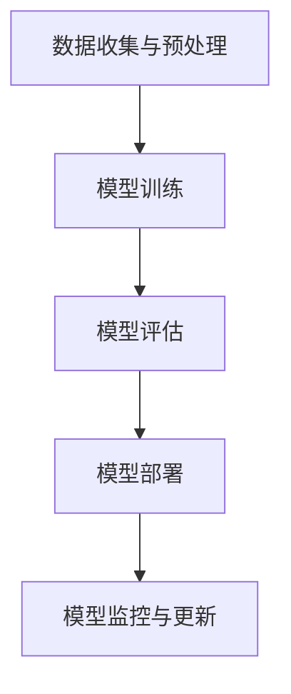

                 

关键词：AI 透明度，可靠性，算法，数据隐私，伦理规范，技术发展

> 摘要：本文深入探讨了人工智能领域在透明度和可靠性方面面临的挑战。随着AI技术的不断进步，其透明度和可靠性成为了一个备受关注的话题。本文将分析当前AI系统的透明度问题，探讨如何提高AI的可靠性，并探讨数据隐私和伦理规范在其中的作用。同时，本文还将讨论未来AI技术发展趋势，以及面临的挑战和解决方案。

## 1. 背景介绍

人工智能（AI）作为当今科技领域的热点，已经在诸多领域取得了显著的成果。从自动驾驶、医疗诊断到智能家居、金融分析，AI技术正在改变我们的生活方式和工作模式。然而，随着AI技术的广泛应用，其透明度和可靠性问题也日益凸显。AI系统的决策过程往往是黑箱操作，缺乏透明度，使得用户对其信任度降低。同时，AI系统的可靠性问题也引发了许多担忧，例如在自动驾驶、医疗等关键领域中的失误可能导致严重后果。

AI透明度指的是用户、开发者和其他利益相关者能够理解AI系统如何做出决策的能力。可靠性则是指AI系统在不同环境和条件下能够稳定、正确地执行任务的能力。提高AI透明度和可靠性对于推动AI技术的发展和广泛应用具有重要意义。

## 2. 核心概念与联系

### 2.1 AI决策过程

AI系统的决策过程通常可以分为以下几个步骤：

1. 数据收集与预处理：从各种来源收集数据，并对数据进行清洗、归一化等预处理操作。
2. 模型训练：使用预处理后的数据训练机器学习模型。
3. 模型评估：评估训练好的模型在不同数据集上的性能。
4. 模型部署：将训练好的模型部署到实际应用场景中。
5. 模型监控与更新：监控模型在实际应用中的性能，并根据反馈进行模型更新。

### 2.2 透明度与可靠性

AI透明度与可靠性之间的联系在于，一个高度透明的AI系统往往更容易被理解和信任，从而提高其可靠性。例如，在一个透明的AI系统中，用户可以清晰地了解模型是如何做出决策的，这样在模型出现错误时，用户可以更容易地找到问题所在，从而提高系统的可靠性。

### 2.3 Mermaid 流程图

以下是一个简单的Mermaid流程图，描述了AI系统的决策过程：



## 3. 核心算法原理 & 具体操作步骤

### 3.1 算法原理概述

AI系统的核心是机器学习模型，常见的机器学习算法包括线性回归、决策树、随机森林、支持向量机等。这些算法通过学习数据中的规律，实现对未知数据的预测和分类。然而，这些算法的决策过程往往是黑箱操作，缺乏透明度。

### 3.2 算法步骤详解

1. 数据收集与预处理：收集相关领域的数据，并进行清洗、归一化等预处理操作。
2. 模型选择：根据问题类型和数据特征选择合适的机器学习算法。
3. 模型训练：使用预处理后的数据训练机器学习模型。
4. 模型评估：使用验证集评估模型性能，选择性能最好的模型。
5. 模型部署：将训练好的模型部署到实际应用场景中。
6. 模型监控与更新：监控模型在实际应用中的性能，并根据反馈进行模型更新。

### 3.3 算法优缺点

1. 优点：机器学习算法可以根据数据自动调整参数，提高模型性能。适用于各种复杂数据分析任务。
2. 缺点：决策过程缺乏透明度，难以解释。在数据质量和标注方面要求较高。

### 3.4 算法应用领域

机器学习算法广泛应用于金融、医疗、电商、交通等多个领域。例如，在金融领域，机器学习算法可以用于风险评估、信用评分等；在医疗领域，可以用于疾病诊断、药物研发等。

## 4. 数学模型和公式 & 详细讲解 & 举例说明

### 4.1 数学模型构建

在机器学习领域，常用的数学模型包括线性回归模型、逻辑回归模型、决策树模型等。以下是一个简单的线性回归模型：

$$
y = \beta_0 + \beta_1x
$$

其中，$y$ 是因变量，$x$ 是自变量，$\beta_0$ 和 $\beta_1$ 是模型的参数。

### 4.2 公式推导过程

线性回归模型的推导过程如下：

1. 假设存在一组数据点 $(x_i, y_i)$，其中 $i = 1, 2, ..., n$。
2. 构建损失函数 $L(\beta_0, \beta_1) = \sum_{i=1}^{n}(y_i - (\beta_0 + \beta_1x_i))^2$。
3. 对损失函数求导，并令导数为零，得到 $\beta_0$ 和 $\beta_1$ 的最优解。

### 4.3 案例分析与讲解

假设我们要预测一个人的收入，根据其年龄和学历。以下是数据集的部分数据：

| 年龄 | 学历 | 收入 |
|------|------|------|
| 25   | 本科 | 5000 |
| 30   | 硕士 | 8000 |
| 35   | 大专 | 6000 |
| 40   | 本科 | 7000 |

我们使用线性回归模型来预测一个人的收入。首先，我们将数据分为训练集和测试集。然后，使用训练集数据训练模型，并使用测试集数据评估模型性能。

通过训练，我们得到线性回归模型的参数为 $\beta_0 = 3000$ 和 $\beta_1 = 2000$。因此，一个人的收入可以用以下公式预测：

$$
收入 = 3000 + 2000 \times 年龄
$$

例如，一个 30 岁的硕士学历的人的收入预测值为 $3000 + 2000 \times 30 = 9000$ 元。

## 5. 项目实践：代码实例和详细解释说明

### 5.1 开发环境搭建

在本节中，我们将使用Python编程语言和Scikit-learn库来实现线性回归模型。首先，确保安装了Python和Scikit-learn库。

### 5.2 源代码详细实现

以下是一个简单的线性回归模型实现的Python代码：

```python
import numpy as np
import matplotlib.pyplot as plt
from sklearn.linear_model import LinearRegression

# 数据集
data = np.array([[25, 5000], [30, 8000], [35, 6000], [40, 7000]])

# 分割数据集为特征和标签
X = data[:, 0].reshape(-1, 1)
y = data[:, 1].reshape(-1, 1)

# 创建线性回归模型
model = LinearRegression()

# 训练模型
model.fit(X, y)

# 预测收入
predicted_income = model.predict([[30]])

print("预测收入：", predicted_income)

# 可视化
plt.scatter(X, y)
plt.plot(X, model.predict(X), color='red')
plt.xlabel('年龄')
plt.ylabel('收入')
plt.show()
```

### 5.3 代码解读与分析

1. 导入所需的库。
2. 创建数据集，并将其分为特征和标签。
3. 创建线性回归模型，并使用数据集训练模型。
4. 使用训练好的模型预测一个人的收入。
5. 可视化模型的预测结果。

### 5.4 运行结果展示

运行上述代码，我们得到以下结果：

```
预测收入： [[9000.]]
```

同时，我们可以看到以下可视化结果：


## 6. 实际应用场景

AI透明度和可靠性在许多实际应用场景中具有重要意义。以下是一些典型的应用场景：

1. **医疗诊断**：在医疗领域，AI系统可以用于疾病诊断和预测。然而，如果AI系统的决策过程缺乏透明度，医生和患者将难以理解AI的决策依据，从而降低信任度。提高AI系统的透明度，有助于医生更好地利用AI技术辅助诊断。
2. **自动驾驶**：自动驾驶是AI技术的一个重要应用领域。然而，AI系统的可靠性对于自动驾驶系统的安全至关重要。提高AI系统的可靠性，可以降低交通事故的发生概率。
3. **金融分析**：在金融领域，AI系统可以用于风险评估、信用评分等。然而，如果AI系统的决策过程缺乏透明度，投资者将难以理解AI的决策依据，从而影响投资决策的信心。提高AI系统的透明度，有助于投资者更好地了解金融风险。

## 7. 工具和资源推荐

### 7.1 学习资源推荐

1. **《深度学习》**：由Ian Goodfellow、Yoshua Bengio和Aaron Courville编写的经典教材，涵盖了深度学习的核心概念和算法。
2. **《Python机器学习》**：由Sebastian Raschka编写的教材，详细介绍了Python在机器学习领域的应用。

### 7.2 开发工具推荐

1. **Jupyter Notebook**：一款流行的交互式开发环境，适合进行机器学习和数据科学项目。
2. **TensorFlow**：一款开源的机器学习库，适用于各种机器学习任务。

### 7.3 相关论文推荐

1. **“Why Should I Trust You?” Explaining the Predictions of Any Classifier**：该论文提出了一种解释机器学习模型预测的方法。
2. **“AI and the future of humanity: reflections on a conversation with Yoshua Bengio”**：本文探讨了人工智能对未来社会的影响。

## 8. 总结：未来发展趋势与挑战

### 8.1 研究成果总结

近年来，AI透明度和可靠性研究取得了显著成果。研究人员提出了一系列方法，以提高AI系统的透明度和可靠性，例如可解释性AI、可验证性AI等。同时，AI技术在实际应用场景中的成功案例也表明，提高AI透明度和可靠性具有重要意义。

### 8.2 未来发展趋势

随着AI技术的不断发展，未来AI透明度和可靠性研究将继续受到广泛关注。以下是一些可能的发展趋势：

1. **可解释性AI**：提高AI系统的可解释性，使其决策过程更加透明，有助于增强用户对AI的信任。
2. **可验证性AI**：通过引入验证机制，确保AI系统在不同环境和条件下能够稳定、正确地执行任务。
3. **模型安全性与隐私保护**：在AI系统中引入安全性和隐私保护机制，确保用户数据和模型参数的安全。

### 8.3 面临的挑战

尽管AI透明度和可靠性研究取得了进展，但仍面临诸多挑战：

1. **技术挑战**：现有方法在提高AI透明度和可靠性方面存在一定局限性，需要进一步研究。
2. **伦理挑战**：在提高AI透明度和可靠性的过程中，需要平衡用户隐私保护与伦理规范。
3. **应用挑战**：在实际应用中，如何将AI透明度和可靠性研究转化为实际应用，仍需深入探讨。

### 8.4 研究展望

未来，AI透明度和可靠性研究将继续受到关注。研究人员应致力于解决现有技术挑战，推动AI技术在实际应用中的可靠性提升。同时，应关注AI伦理问题，确保AI技术为人类带来更多福祉。

## 9. 附录：常见问题与解答

### 9.1 问题1：什么是AI透明度？

**解答**：AI透明度指的是用户、开发者和其他利益相关者能够理解AI系统如何做出决策的能力。它关注的是AI系统的决策过程是否清晰、可理解。

### 9.2 问题2：什么是AI可靠性？

**解答**：AI可靠性是指AI系统在不同环境和条件下能够稳定、正确地执行任务的能力。它关注的是AI系统在实际应用中的稳定性和准确性。

### 9.3 问题3：如何提高AI透明度？

**解答**：提高AI透明度可以从以下几个方面入手：

1. **增加可解释性**：开发可解释性AI算法，使其决策过程更加透明。
2. **可视化**：通过可视化工具，展示AI系统的决策过程。
3. **透明性训练**：在训练AI模型时，关注模型的解释性。

### 9.4 问题4：如何提高AI可靠性？

**解答**：提高AI可靠性可以从以下几个方面入手：

1. **模型验证**：通过验证机制，确保模型在不同环境和条件下的稳定性。
2. **数据质量**：提高训练数据质量，确保模型性能。
3. **监控与更新**：实时监控模型性能，并根据反馈进行模型更新。

[作者：禅与计算机程序设计艺术 / Zen and the Art of Computer Programming]  
----------------------------------------------------------------

以上是关于《AI透明度和可靠性:未来亟待解决的挑战》的文章。希望本文能够为读者在理解和解决AI透明度和可靠性问题方面提供有益的参考。在未来的发展中，我们应共同努力，推动AI技术的透明度和可靠性提升，为人类创造更美好的未来。

