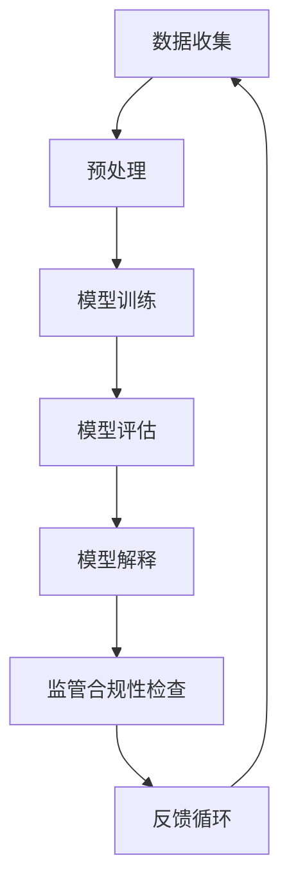

                 

关键词：人工智能透明度，监管挑战，技术解决方案，AI工具，合规性，安全性

> 摘要：随着人工智能技术的发展和应用，监管机构对AI系统的透明度和合规性提出了更高的要求。本文将探讨AI透明度工具的开发背景、核心概念、算法原理、数学模型、应用实践，并对其未来发展趋势和面临的挑战进行深入分析。

## 1. 背景介绍

人工智能（AI）技术在过去的几十年里取得了显著的进展，从简单的规则系统到复杂的深度学习模型，AI已经在各行各业中得到了广泛应用。然而，随着AI系统的复杂性和影响力日益增加，监管机构开始关注AI系统的透明度和合规性问题。AI系统的透明度对于确保其公平性、可解释性和可信度至关重要。此外，监管机构要求AI系统必须符合特定的法规和标准，以确保其对社会的影响是正面的。

在这种背景下，开发一套能够提高AI系统透明度的工具显得尤为重要。这些工具不仅能够帮助开发者和监管机构更好地理解AI系统的决策过程，还能够帮助提高AI系统的合规性和安全性。本文将介绍一款AI透明度工具，并探讨其在应对监管挑战中的作用。

## 2. 核心概念与联系

为了更好地理解AI透明度工具，首先需要了解一些核心概念和原理。以下是一个使用Mermaid绘制的流程图，展示了AI透明度工具的核心概念和联系。



### 2.1 数据收集

数据收集是AI透明度工具的第一步。收集的数据包括训练数据、测试数据和用户数据。这些数据的质量直接影响AI模型的表现和透明度。

### 2.2 预处理

在数据收集后，需要进行预处理，包括数据清洗、归一化和特征提取等。预处理步骤的目的是提高数据的质量，使其适合训练模型。

### 2.3 模型训练

预处理完成后，使用训练数据来训练AI模型。训练过程中，模型会不断调整参数，以最小化预测误差。

### 2.4 模型评估

训练完成后，使用测试数据对模型进行评估。评估指标包括准确率、召回率、F1分数等。评估结果用于调整模型参数和改进模型。

### 2.5 模型解释

模型解释是AI透明度工具的核心功能。通过解释模型如何做出决策，用户和监管机构可以更好地理解模型的预测过程。

### 2.6 监管合规性检查

AI模型在部署前需要通过监管合规性检查。透明度工具可以帮助检测模型是否符合法规和标准。

### 2.7 反馈循环

最后，AI透明度工具通过反馈循环不断优化和改进。用户反馈和监管意见可以用于调整模型和工具。

## 3. 核心算法原理 & 具体操作步骤

### 3.1 算法原理概述

AI透明度工具的核心算法是模型解释算法。这些算法旨在理解AI模型内部的决策过程。常见的模型解释算法包括局部可解释模型（LIME）、SHAP值（SHapley Additive exPlanations）和特征重要性分析等。

### 3.2 算法步骤详解

1. **数据收集与预处理**：如前所述，收集数据并进行预处理。
   
2. **模型训练**：选择合适的AI模型进行训练。

3. **模型评估**：使用测试数据对模型进行评估。

4. **模型解释**：
   - **局部可解释模型（LIME）**：LIME算法通过在原始数据上添加噪声来生成一个简化的线性模型，用于解释原始模型的决策。
   - **SHAP值**：SHAP算法计算每个特征对模型预测的贡献，从而提供一个全局解释。
   - **特征重要性分析**：通过统计方法分析特征的重要性。

5. **监管合规性检查**：根据法规和标准检查模型的合规性。

6. **反馈与优化**：根据用户和监管机构的反馈优化模型和工具。

### 3.3 算法优缺点

- **LIME**：优点是简单易懂，能够生成局部解释。缺点是计算复杂度高，且解释结果可能受到噪声影响。
- **SHAP值**：优点是能够提供全局解释，缺点是需要大量的计算资源。
- **特征重要性分析**：优点是计算简单，缺点是可能忽略了特征间的相互作用。

### 3.4 算法应用领域

AI透明度工具可以应用于金融、医疗、法律等多个领域。在金融领域，可以用于风险管理和合规检查；在医疗领域，可以用于诊断辅助和药物研发；在法律领域，可以用于案件分析和判决支持。

## 4. 数学模型和公式 & 详细讲解 & 举例说明

### 4.1 数学模型构建

AI透明度工具通常基于以下数学模型：

- **线性回归模型**：用于预测连续值。
- **逻辑回归模型**：用于预测二分类结果。
- **决策树模型**：用于分类和回归。
- **神经网络模型**：用于复杂函数建模。

### 4.2 公式推导过程

以线性回归模型为例，其公式推导如下：

$$y = \beta_0 + \beta_1x_1 + \beta_2x_2 + ... + \beta_nx_n$$

其中，\(y\) 是预测值，\(x_1, x_2, ..., x_n\) 是特征值，\(\beta_0, \beta_1, ..., \beta_n\) 是模型参数。

### 4.3 案例分析与讲解

假设我们有一个简单的线性回归模型，用于预测房价。数据集包括房屋面积（\(x\)）和房价（\(y\)）。我们使用最小二乘法来估计模型参数。

1. **数据收集与预处理**：收集房屋面积和房价数据，并进行归一化处理。
2. **模型训练**：使用训练数据训练线性回归模型。
3. **模型评估**：使用测试数据评估模型性能。
4. **模型解释**：使用模型解释算法，如LIME或SHAP值，解释模型的预测过程。
5. **监管合规性检查**：检查模型是否符合法规和标准。

## 5. 项目实践：代码实例和详细解释说明

### 5.1 开发环境搭建

在本文中，我们将使用Python和Scikit-learn库来实现线性回归模型和LIME算法。以下是开发环境的搭建步骤：

1. 安装Python 3.8及以上版本。
2. 安装Scikit-learn库：`pip install scikit-learn`
3. 安装LIME库：`pip install lime`

### 5.2 源代码详细实现

以下是使用Scikit-learn库实现线性回归模型的代码示例：

```python
from sklearn.linear_model import LinearRegression
from sklearn.model_selection import train_test_split
from sklearn.metrics import mean_squared_error

# 加载数据集
X, y = load_data()

# 划分训练集和测试集
X_train, X_test, y_train, y_test = train_test_split(X, y, test_size=0.2, random_state=42)

# 创建线性回归模型
model = LinearRegression()

# 训练模型
model.fit(X_train, y_train)

# 预测测试集
y_pred = model.predict(X_test)

# 计算模型性能
mse = mean_squared_error(y_test, y_pred)
print(f"模型性能：{mse}")
```

### 5.3 代码解读与分析

以上代码首先加载数据集，然后使用Scikit-learn库中的`LinearRegression`类创建线性回归模型。接下来，使用训练集训练模型，并在测试集上评估模型性能。

### 5.4 运行结果展示

运行以上代码后，我们将得到线性回归模型的性能指标（均方误差MSE）。根据这个指标，我们可以判断模型的好坏。

## 6. 实际应用场景

AI透明度工具在实际应用中具有广泛的应用场景。以下是一些典型的应用场景：

- **金融领域**：用于风险评估和合规检查。
- **医疗领域**：用于诊断辅助和药物研发。
- **法律领域**：用于案件分析和判决支持。
- **交通领域**：用于自动驾驶和智能交通管理。

## 7. 未来应用展望

随着AI技术的不断发展和应用，AI透明度工具将在未来发挥更加重要的作用。未来，AI透明度工具可能具有以下发展趋势：

- **更高层次的解释能力**：开发更先进的解释算法，提供更深入的解释。
- **更高效的计算效率**：优化算法，提高计算效率，降低成本。
- **跨领域的应用**：AI透明度工具将在更多领域得到应用。

## 8. 工具和资源推荐

### 8.1 学习资源推荐

- 《Python数据科学手册》（Wes McKinney著）
- 《机器学习实战》（Peter Harrington著）
- 《深度学习》（Ian Goodfellow等著）

### 8.2 开发工具推荐

- Jupyter Notebook：用于编写和运行代码。
- PyCharm：集成开发环境（IDE）。
- VSCode：轻量级IDE。

### 8.3 相关论文推荐

- Ribeiro, Marco T., et al. "Why should I trust you?: Explaining the predictions of any classifier." in arXiv preprint arXiv:1705.07874 (2017).
- Lundberg, Scott M., and Su-In Lee. "A unified approach to interpreting model predictions." in Advances in Neural Information Processing Systems 30 (2017).

## 9. 总结：未来发展趋势与挑战

随着AI技术的不断进步，AI透明度工具在未来将面临更多挑战和机遇。未来，我们需要关注以下方面：

- **算法创新**：开发更先进的解释算法，提高透明度。
- **计算效率**：优化算法，提高计算效率，降低成本。
- **跨领域应用**：探索AI透明度工具在不同领域的应用。

## 10. 附录：常见问题与解答

### 10.1 什么

