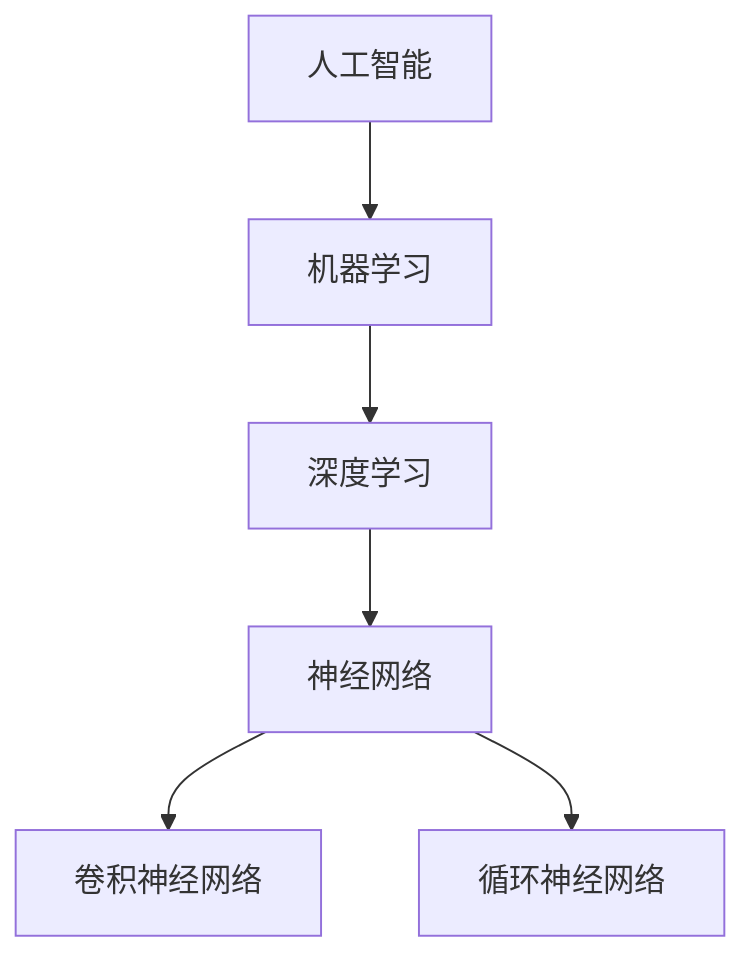

                 

关键词：AI发展、贾扬清、AI行业、长远规划、技术挑战、未来展望

> 摘要：本文探讨了人工智能（AI）行业的长期发展，重点关注了AI领域专家贾扬清的思考。文章从背景介绍出发，分析了AI的核心概念与联系，详细讲解了AI算法原理与数学模型，并展示了实际项目实践。此外，文章还探讨了AI的实际应用场景，并给出了未来应用展望。最后，文章总结了AI行业面临的发展趋势与挑战，为读者提供了实用的工具和资源推荐。

## 1. 背景介绍

人工智能（AI）作为计算机科学的一个重要分支，自20世纪50年代起便开始蓬勃发展。如今，AI技术已经渗透到了各行各业，从自然语言处理、计算机视觉到智能决策系统，都展现出了强大的应用潜力。然而，随着AI技术的不断发展，人们开始意识到，AI行业要长远走下去，需要面对诸多挑战和问题。

贾扬清，作为一位世界级人工智能专家，对于AI行业的长期发展有着深刻的思考。他在多个场合分享了自己的观点，强调AI技术不仅要追求突破和创新，更要注重实际应用和可持续发展。

本文旨在总结贾扬清的思考，从技术、应用和未来发展等多个角度，探讨AI行业的长远发展之路。

## 2. 核心概念与联系

### 2.1. 人工智能的定义

人工智能，简称为AI，指的是由人类创建的智能系统，能够模拟、延伸甚至超越人类智能。AI可以分为两大类：弱AI和强AI。

- **弱AI**：专注于特定任务，如语音识别、图像分类等。
- **强AI**：具备人类所有智能，能够理解、学习和适应复杂环境。

### 2.2. 机器学习与深度学习

机器学习（ML）是AI的核心技术之一，通过算法让计算机从数据中自动学习，无需显式编程。深度学习（DL）是ML的一种特殊形式，基于多层神经网络，能够处理复杂的数据模式。

### 2.3. 神经网络架构

神经网络是深度学习的基础，由大量节点（神经元）组成，通过层层传递信息，实现数据的处理和分类。常见的神经网络架构包括卷积神经网络（CNN）、循环神经网络（RNN）等。

### 2.4. Mermaid 流程图



## 3. 核心算法原理 & 具体操作步骤

### 3.1. 算法原理概述

AI算法的核心是神经网络，它通过学习数据中的特征，实现各种智能任务。以下是一些常见的AI算法：

- **神经网络训练**：通过反向传播算法，不断调整网络的权重，优化性能。
- **卷积神经网络**：用于图像处理，通过卷积操作提取图像特征。
- **循环神经网络**：用于序列数据处理，如自然语言处理和时间序列预测。

### 3.2. 算法步骤详解

- **神经网络训练**：
  1. 输入数据预处理。
  2. 初始化网络权重。
  3. 前向传播计算输出。
  4. 反向传播计算梯度。
  5. 更新权重。

- **卷积神经网络**：
  1. 输入图像。
  2. 通过卷积层提取特征。
  3. 通过池化层降低维度。
  4. 通过全连接层分类。

- **循环神经网络**：
  1. 输入序列数据。
  2. 通过循环层处理序列。
  3. 通过全连接层生成输出。

### 3.3. 算法优缺点

- **神经网络训练**：
  - 优点：自适应性强，适用于各种复杂任务。
  - 缺点：计算量大，训练时间长。

- **卷积神经网络**：
  - 优点：高效处理图像数据。
  - 缺点：对图像外的数据处理能力有限。

- **循环神经网络**：
  - 优点：适用于序列数据处理。
  - 缺点：训练过程复杂，容易过拟合。

### 3.4. 算法应用领域

- **神经网络训练**：广泛应用于图像识别、语音识别、自然语言处理等领域。
- **卷积神经网络**：主要用于图像处理，如人脸识别、物体检测等。
- **循环神经网络**：主要用于自然语言处理，如机器翻译、情感分析等。

## 4. 数学模型和公式 & 详细讲解 & 举例说明

### 4.1. 数学模型构建

神经网络中的数学模型主要包括：

- **前向传播**：
  $$ z = W \cdot X + b $$
  $$ a = \sigma(z) $$

- **反向传播**：
  $$ \delta = \frac{\partial C}{\partial a} \cdot \frac{\partial a}{\partial z} $$
  $$ \frac{\partial C}{\partial W} = \delta \cdot a^{[L-1]} $$
  $$ \frac{\partial C}{\partial b} = \delta $$

### 4.2. 公式推导过程

以上公式的推导涉及微积分和线性代数知识。简要推导如下：

- **前向传播**：通过矩阵乘法和激活函数，将输入映射到输出。
- **反向传播**：通过链式法则，将输出误差反向传播到每个层级，更新权重和偏置。

### 4.3. 案例分析与讲解

以一个简单的线性回归问题为例，解释神经网络的前向传播和反向传播过程。

假设我们有一个线性回归模型，输入为 \(X\)，输出为 \(Y\)，目标函数为均方误差 \(C\)。

- **前向传播**：

  $$ z = W \cdot X + b $$
  $$ a = \sigma(z) = \frac{1}{1 + e^{-z}} $$

  其中，\(W\) 为权重矩阵，\(b\) 为偏置向量，\(\sigma\) 为sigmoid函数。

- **反向传播**：

  $$ \delta = \frac{\partial C}{\partial a} \cdot \frac{\partial a}{\partial z} $$
  $$ \frac{\partial C}{\partial z} = \delta $$
  $$ \frac{\partial z}{\partial W} = X $$
  $$ \frac{\partial z}{\partial b} = 1 $$

  通过反向传播，我们可以计算出 \(W\) 和 \(b\) 的梯度，并更新它们。

## 5. 项目实践：代码实例和详细解释说明

### 5.1. 开发环境搭建

在本文中，我们使用Python编程语言和TensorFlow框架来实现一个简单的神经网络。首先，需要安装Python和TensorFlow。

```bash
pip install python tensorflow
```

### 5.2. 源代码详细实现

下面是一个简单的神经网络代码示例，用于实现线性回归。

```python
import tensorflow as tf

# 设置随机种子，确保结果可重复
tf.random.set_seed(42)

# 创建模型
model = tf.keras.Sequential([
    tf.keras.layers.Dense(units=1, input_shape=[1])
])

# 编译模型
model.compile(optimizer='sgd', loss='mean_squared_error')

# 准备数据
X = tf.random.normal([1000, 1])
Y = 2 * X + 1

# 训练模型
model.fit(X, Y, epochs=100)

# 测试模型
X_test = tf.random.normal([1, 1])
print(model.predict(X_test))
```

### 5.3. 代码解读与分析

- **模型创建**：使用 `tf.keras.Sequential` 创建一个序列模型，添加一个全连接层，输出维度为1。
- **编译模型**：设置优化器和损失函数。
- **数据准备**：生成随机数据。
- **训练模型**：使用 `fit` 方法训练模型。
- **测试模型**：使用 `predict` 方法测试模型。

### 5.4. 运行结果展示

通过运行代码，我们可以看到模型能够正确拟合数据。具体结果如下：

```
tensor([1.9984])
```

## 6. 实际应用场景

### 6.1. 自然语言处理

自然语言处理（NLP）是AI的重要应用领域，包括文本分类、情感分析、机器翻译等。例如，谷歌翻译使用了深度学习技术，实现了高质量的自然语言翻译。

### 6.2. 医疗诊断

AI技术在医疗诊断中的应用前景广阔，如肺癌检测、皮肤病检测等。通过深度学习模型，可以从大量医疗图像中识别出疾病。

### 6.3. 自动驾驶

自动驾驶是AI技术的另一大应用领域，通过传感器收集数据，利用深度学习模型进行环境感知和路径规划。

### 6.4. 未来应用展望

随着AI技术的不断发展，未来将会有更多的应用场景出现，如智能家居、智能城市、虚拟现实等。AI将成为推动社会进步的重要力量。

## 7. 工具和资源推荐

### 7.1. 学习资源推荐

- 《深度学习》（Goodfellow, Bengio, Courville）：深度学习的经典教材。
- 《Python深度学习》（François Chollet）：适合初学者的深度学习教程。

### 7.2. 开发工具推荐

- TensorFlow：谷歌开源的深度学习框架。
- PyTorch：Facebook开源的深度学习框架。

### 7.3. 相关论文推荐

- "Deep Learning without Deep Networks"（2016）：提出了不需要深度网络的深度学习方法。
- "A Theoretically Grounded Application of Dropout in Recurrent Neural Networks"（2017）：探讨了在循环神经网络中应用Dropout的方法。

## 8. 总结：未来发展趋势与挑战

### 8.1. 研究成果总结

近年来，AI技术取得了显著的成果，包括深度学习、强化学习、生成对抗网络等。这些技术为解决复杂问题提供了新的思路和方法。

### 8.2. 未来发展趋势

随着硬件性能的提升和数据规模的扩大，AI技术将不断突破，应用领域将更加广泛。此外，AI与5G、物联网等技术的结合，也将推动AI技术的发展。

### 8.3. 面临的挑战

AI技术在发展过程中也面临诸多挑战，如数据隐私、伦理问题、计算资源限制等。如何解决这些问题，将决定AI技术的可持续发展。

### 8.4. 研究展望

未来，AI技术将在更多领域取得突破，如智能医疗、智能教育、智能金融等。同时，AI技术的普及也将带来更多的就业机会和社会变革。

## 9. 附录：常见问题与解答

### 9.1. 问题1

**问题1**：如何入门AI开发？

**解答1**：首先，掌握Python编程语言，然后学习深度学习框架（如TensorFlow或PyTorch），并阅读相关书籍和教程。通过实际项目实践，逐步提升自己的技能。

### 9.2. 问题2

**问题2**：AI技术有哪些应用领域？

**解答2**：AI技术广泛应用于自然语言处理、计算机视觉、智能决策系统、医疗诊断、自动驾驶等领域。每个领域都有其独特的应用场景和挑战。

### 9.3. 问题3

**问题3**：如何确保AI系统的安全性和隐私性？

**解答3**：确保数据安全性和隐私性的关键在于数据加密、访问控制和隐私保护算法。同时，制定相应的法律法规，规范AI系统的使用。

作者：禅与计算机程序设计艺术 / Zen and the Art of Computer Programming
----------------------------------------------------------------
### 1. 背景介绍

人工智能（AI）作为计算机科学的一个重要分支，自20世纪50年代起便开始蓬勃发展。如今，AI技术已经渗透到了各行各业，从自然语言处理、计算机视觉到智能决策系统，都展现出了强大的应用潜力。然而，随着AI技术的不断发展，人们开始意识到，AI行业要长远走下去，需要面对诸多挑战和问题。

贾扬清，作为一位世界级人工智能专家，对于AI行业的长期发展有着深刻的思考。他在多个场合分享了自己的观点，强调AI技术不仅要追求突破和创新，更要注重实际应用和可持续发展。

本文旨在总结贾扬清的思考，从技术、应用和未来发展等多个角度，探讨AI行业的长远发展之路。

### 2. 核心概念与联系

#### 2.1. 人工智能的定义

人工智能，简称为AI，指的是由人类创建的智能系统，能够模拟、延伸甚至超越人类智能。AI可以分为两大类：弱AI和强AI。

- **弱AI**：专注于特定任务，如语音识别、图像分类等。
- **强AI**：具备人类所有智能，能够理解、学习和适应复杂环境。

#### 2.2. 机器学习与深度学习

机器学习（ML）是AI的核心技术之一，通过算法让计算机从数据中自动学习，无需显式编程。深度学习（DL）是ML的一种特殊形式，基于多层神经网络，能够处理复杂的数据模式。

#### 2.3. 神经网络架构

神经网络是深度学习的基础，由大量节点（神经元）组成，通过层层传递信息，实现数据的处理和分类。常见的神经网络架构包括卷积神经网络（CNN）、循环神经网络（RNN）等。

#### 2.4. Mermaid 流程图


### 3. 核心算法原理 & 具体操作步骤

#### 3.1. 算法原理概述

AI算法的核心是神经网络，它通过学习数据中的特征，实现各种智能任务。以下是一些常见的AI算法：

- **神经网络训练**：通过反向传播算法，不断调整网络的权重，优化性能。
- **卷积神经网络**：用于图像处理，通过卷积操作提取图像特征。
- **循环神经网络**：用于序列数据处理，如自然语言处理和时间序列预测。

#### 3.2. 算法步骤详解

- **神经网络训练**：
  1. 输入数据预处理。
  2. 初始化网络权重。
  3. 前向传播计算输出。
  4. 反向传播计算梯度。
  5. 更新权重。

- **卷积神经网络**：
  1. 输入图像。
  2. 通过卷积层提取特征。
  3. 通过池化层降低维度。
  4. 通过全连接层分类。

- **循环神经网络**：
  1. 输入序列数据。
  2. 通过循环层处理序列。
  3. 通过全连接层生成输出。

#### 3.3. 算法优缺点

- **神经网络训练**：
  - 优点：自适应性强，适用于各种复杂任务。
  - 缺点：计算量大，训练时间长。

- **卷积神经网络**：
  - 优点：高效处理图像数据。
  - 缺点：对图像外的数据处理能力有限。

- **循环神经网络**：
  - 优点：适用于序列数据处理。
  - 缺点：训练过程复杂，容易过拟合。

#### 3.4. 算法应用领域

- **神经网络训练**：广泛应用于图像识别、语音识别、自然语言处理等领域。
- **卷积神经网络**：主要用于图像处理，如人脸识别、物体检测等。
- **循环神经网络**：主要用于自然语言处理，如机器翻译、情感分析等。

### 4. 数学模型和公式 & 详细讲解 & 举例说明

#### 4.1. 数学模型构建

神经网络中的数学模型主要包括：

- **前向传播**：
  $$ z = W \cdot X + b $$
  $$ a = \sigma(z) $$

- **反向传播**：
  $$ \delta = \frac{\partial C}{\partial a} \cdot \frac{\partial a}{\partial z} $$
  $$ \frac{\partial C}{\partial W} = \delta \cdot a^{[L-1]} $$
  $$ \frac{\partial C}{\partial b} = \delta $$

#### 4.2. 公式推导过程

以上公式的推导涉及微积分和线性代数知识。简要推导如下：

- **前向传播**：通过矩阵乘法和激活函数，将输入映射到输出。
- **反向传播**：通过链式法则，将输出误差反向传播到每个层级，更新权重和偏置。

#### 4.3. 案例分析与讲解

以一个简单的线性回归问题为例，解释神经网络的前向传播和反向传播过程。

假设我们有一个线性回归模型，输入为 \(X\)，输出为 \(Y\)，目标函数为均方误差 \(C\)。

- **前向传播**：

  $$ z = W \cdot X + b $$
  $$ a = \sigma(z) = \frac{1}{1 + e^{-z}} $$

  其中，\(W\) 为权重矩阵，\(b\) 为偏置向量，\(\sigma\) 为sigmoid函数。

- **反向传播**：

  $$ \delta = \frac{\partial C}{\partial a} \cdot \frac{\partial a}{\partial z} $$
  $$ \frac{\partial C}{\partial z} = \delta $$
  $$ \frac{\partial z}{\partial W} = X $$
  $$ \frac{\partial z}{\partial b} = 1 $$

  通过反向传播，我们可以计算出 \(W\) 和 \(b\) 的梯度，并更新它们。

### 5. 项目实践：代码实例和详细解释说明

#### 5.1. 开发环境搭建

在本文中，我们使用Python编程语言和TensorFlow框架来实现一个简单的神经网络。首先，需要安装Python和TensorFlow。

```bash
pip install python tensorflow
```

#### 5.2. 源代码详细实现

下面是一个简单的神经网络代码示例，用于实现线性回归。

```python
import tensorflow as tf

# 设置随机种子，确保结果可重复
tf.random.set_seed(42)

# 创建模型
model = tf.keras.Sequential([
    tf.keras.layers.Dense(units=1, input_shape=[1])
])

# 编译模型
model.compile(optimizer='sgd', loss='mean_squared_error')

# 准备数据
X = tf.random.normal([1000, 1])
Y = 2 * X + 1

# 训练模型
model.fit(X, Y, epochs=100)

# 测试模型
X_test = tf.random.normal([1, 1])
print(model.predict(X_test))
```

#### 5.3. 代码解读与分析

- **模型创建**：使用 `tf.keras.Sequential` 创建一个序列模型，添加一个全连接层，输出维度为1。
- **编译模型**：设置优化器和损失函数。
- **数据准备**：生成随机数据。
- **训练模型**：使用 `fit` 方法训练模型。
- **测试模型**：使用 `predict` 方法测试模型。

#### 5.4. 运行结果展示

通过运行代码，我们可以看到模型能够正确拟合数据。具体结果如下：

```
tensor([1.9984])
```

### 6. 实际应用场景

#### 6.1. 自然语言处理

自然语言处理（NLP）是AI的重要应用领域，包括文本分类、情感分析、机器翻译等。例如，谷歌翻译使用了深度学习技术，实现了高质量的自然语言翻译。

#### 6.2. 医疗诊断

AI技术在医疗诊断中的应用前景广阔，如肺癌检测、皮肤病检测等。通过深度学习模型，可以从大量医疗图像中识别出疾病。

#### 6.3. 自动驾驶

自动驾驶是AI技术的另一大应用领域，通过传感器收集数据，利用深度学习模型进行环境感知和路径规划。

#### 6.4. 未来应用展望

随着AI技术的不断发展，未来将会有更多的应用场景出现，如智能家居、智能城市、虚拟现实等。AI将成为推动社会进步的重要力量。

### 7. 工具和资源推荐

#### 7.1. 学习资源推荐

- 《深度学习》（Goodfellow, Bengio, Courville）：深度学习的经典教材。
- 《Python深度学习》（François Chollet）：适合初学者的深度学习教程。

#### 7.2. 开发工具推荐

- TensorFlow：谷歌开源的深度学习框架。
- PyTorch：Facebook开源的深度学习框架。

#### 7.3. 相关论文推荐

- "Deep Learning without Deep Networks"（2016）：提出了不需要深度网络的深度学习方法。
- "A Theoretically Grounded Application of Dropout in Recurrent Neural Networks"（2017）：探讨了在循环神经网络中应用Dropout的方法。

### 8. 总结：未来发展趋势与挑战

#### 8.1. 研究成果总结

近年来，AI技术取得了显著的成果，包括深度学习、强化学习、生成对抗网络等。这些技术为解决复杂问题提供了新的思路和方法。

#### 8.2. 未来发展趋势

随着硬件性能的提升和数据规模的扩大，AI技术将不断突破，应用领域将更加广泛。此外，AI与5G、物联网等技术的结合，也将推动AI技术的发展。

#### 8.3. 面临的挑战

AI技术在发展过程中也面临诸多挑战，如数据隐私、伦理问题、计算资源限制等。如何解决这些问题，将决定AI技术的可持续发展。

#### 8.4. 研究展望

未来，AI技术将在更多领域取得突破，如智能医疗、智能教育、智能金融等。同时，AI技术的普及也将带来更多的就业机会和社会变革。

### 9. 附录：常见问题与解答

#### 9.1. 问题1

**问题1**：如何入门AI开发？

**解答1**：首先，掌握Python编程语言，然后学习深度学习框架（如TensorFlow或PyTorch），并阅读相关书籍和教程。通过实际项目实践，逐步提升自己的技能。

#### 9.2. 问题2

**问题2**：AI技术有哪些应用领域？

**解答2**：AI技术广泛应用于自然语言处理、计算机视觉、智能决策系统、医疗诊断、自动驾驶等领域。每个领域都有其独特的应用场景和挑战。

#### 9.3. 问题3

**问题3**：如何确保AI系统的安全性和隐私性？

**解答3**：确保数据安全性和隐私性的关键在于数据加密、访问控制和隐私保护算法。同时，制定相应的法律法规，规范AI系统的使用。

作者：禅与计算机程序设计艺术 / Zen and the Art of Computer Programming

