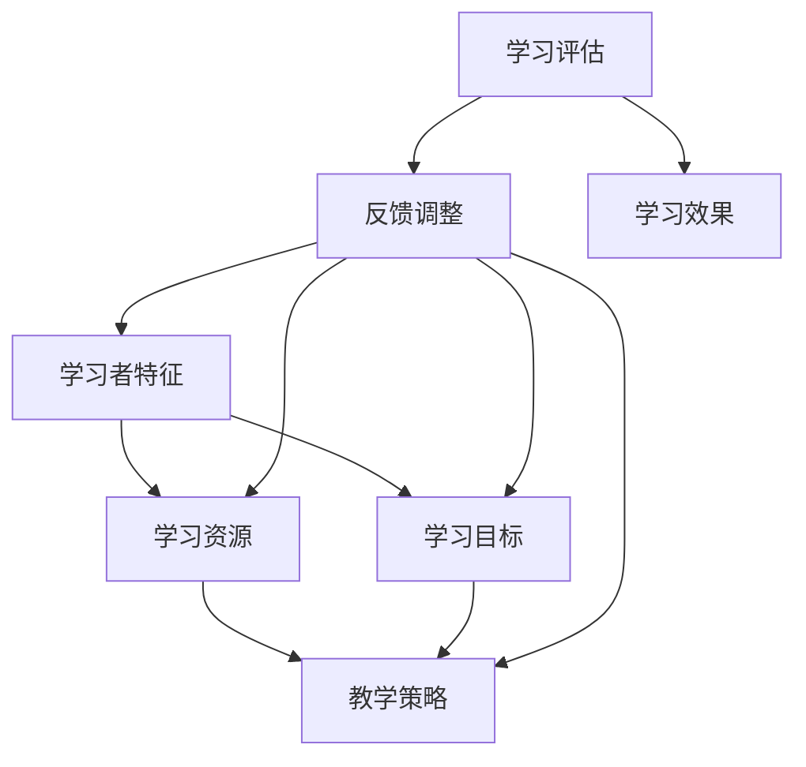

                 

关键词：人工智能、个性化学习、教育技术、机器学习、数据挖掘

> 摘要：随着人工智能技术的快速发展，个性化学习已成为教育领域的重要研究方向。本文旨在探讨如何利用AI技术构建有效的个性化学习路径，提高学习效果和效率。文章首先介绍了个性化学习的背景和意义，然后深入分析了核心概念和联系，探讨了核心算法原理及具体操作步骤，并通过数学模型和公式进行详细讲解。随后，文章提供了项目实践代码实例，分析了实际应用场景，并展望了未来的发展趋势与挑战。

## 1. 背景介绍

个性化学习是指根据学习者的个体差异，为其定制化地提供学习内容、方法和评价方式的一种教育模式。传统的教育模式往往以教师为中心，无法充分考虑到每个学生的个性化需求，导致学习效果不尽如人意。随着互联网和人工智能技术的飞速发展，个性化学习逐渐成为教育领域的研究热点。AI技术，尤其是机器学习和数据挖掘技术，为个性化学习提供了强大的技术支持。

### 1.1 人工智能在个性化学习中的作用

人工智能在个性化学习中的作用主要体现在以下几个方面：

1. **数据挖掘与分析**：通过收集和分析学生的学习数据，挖掘出其学习行为、兴趣、能力和知识水平等特征，为个性化学习路径的设计提供依据。
2. **智能推荐系统**：基于机器学习算法，为学习者推荐个性化的学习资源，提高学习效率。
3. **自适应学习系统**：根据学习者的实时反馈和学习进度，动态调整学习内容和方法，实现个性化教学。
4. **学习评估与反馈**：利用自然语言处理和图像识别等技术，对学习者的学习效果进行评估，并提供个性化的反馈。

### 1.2 个性化学习的意义

个性化学习具有重要的教育意义，主要体现在以下几个方面：

1. **提高学习效果**：个性化学习能够满足学习者的个性化需求，使学习更加高效和有意义。
2. **促进全面发展**：个性化学习关注学习者的全面发展，不仅仅是知识的学习，还包括技能、能力和素质的培养。
3. **提升教育质量**：个性化学习有助于提升教育的整体质量，使教育更加公平和有针对性。
4. **满足社会需求**：个性化学习能够培养适应社会需求的高素质人才，为国家和社会的发展贡献力量。

## 2. 核心概念与联系

个性化学习路径的设计涉及多个核心概念和联系，如图2.1所示。



### 2.1 学习者特征

学习者特征包括学习者的背景信息、兴趣爱好、知识水平、学习风格等。通过数据挖掘和分析技术，可以从学习者的行为数据中提取出这些特征，为个性化学习路径的设计提供依据。

### 2.2 学习资源

学习资源包括教材、课件、视频、练习题等。根据学习者的特征和学习目标，可以筛选和推荐适合的学习资源，提高学习效果。

### 2.3 学习目标

学习目标是指学习者希望达到的学习效果和水平。个性化学习路径的设计需要根据学习目标来安排学习内容和方法，确保学习目标的实现。

### 2.4 教学策略

教学策略是指为了实现学习目标而采取的教学方法和手段。根据学习者的特征和学习目标，可以设计出个性化的教学策略，提高学习效果。

### 2.5 学习评估与反馈

学习评估与反馈是个性化学习路径设计的重要组成部分。通过学习评估，可以了解学习者的学习效果，并提供个性化的反馈，帮助学习者调整学习策略。

## 3. 核心算法原理 & 具体操作步骤

### 3.1 算法原理概述

个性化学习路径设计的核心算法主要包括以下几类：

1. **协同过滤算法**：基于用户的历史行为数据，为用户推荐相似的用户喜欢的学习资源。
2. **基于内容的推荐算法**：根据学习资源的特征和用户特征，为用户推荐相关的学习资源。
3. **聚类算法**：将具有相似特征的学习者分成不同的群体，为每个群体设计个性化的学习路径。
4. **决策树和神经网络**：根据学习者的特征和学习目标，构建决策树或神经网络模型，为学习者推荐个性化的学习路径。

### 3.2 算法步骤详解

1. **数据收集与预处理**：收集学习者的特征数据、学习资源数据和教学策略数据，并进行数据预处理，包括数据清洗、归一化和特征提取等。
2. **特征选择与模型训练**：根据算法需求，选择合适的特征，并使用机器学习算法对特征进行训练，构建个性化学习路径模型。
3. **个性化推荐**：根据学习者的特征和学习目标，使用个性化学习路径模型为学习者推荐个性化的学习资源和学习策略。
4. **学习评估与反馈**：根据学习者的学习效果，对个性化学习路径进行调整和优化，以提高学习效果。

### 3.3 算法优缺点

1. **协同过滤算法**：优点是推荐准确率高，缺点是冷启动问题严重，对新用户和新资源的推荐效果较差。
2. **基于内容的推荐算法**：优点是能够准确推荐与用户兴趣相关的学习资源，缺点是可能陷入“兴趣窄化”的问题。
3. **聚类算法**：优点是能够将具有相似特征的学习者分成不同的群体，为每个群体设计个性化的学习路径，缺点是聚类效果受初始值影响较大。
4. **决策树和神经网络**：优点是模型复杂度较低，易于理解和解释，缺点是训练时间较长，对大数据的处理能力有限。

### 3.4 算法应用领域

个性化学习路径设计算法广泛应用于在线教育、职业教育、企业培训等领域。例如，在线教育平台可以根据学习者的特征和学习目标，为学习者推荐合适的学习资源和学习策略，提高学习效果。企业培训可以根据员工的特征和培训目标，设计个性化的培训方案，提高培训效果。

## 4. 数学模型和公式 & 详细讲解 & 举例说明

### 4.1 数学模型构建

个性化学习路径设计的数学模型主要包括以下几部分：

1. **用户特征模型**：表示学习者的特征，如兴趣爱好、知识水平、学习风格等。
2. **资源特征模型**：表示学习资源的特征，如知识点、难度、类型等。
3. **学习目标模型**：表示学习者的学习目标，如掌握某个知识点、提高某项技能等。
4. **教学策略模型**：表示为了实现学习目标而采取的教学方法和手段。

### 4.2 公式推导过程

假设我们有n个学习者、m个学习资源和k个学习目标，学习者的特征可以用一个n×d的矩阵X表示，资源的特征可以用一个m×d的矩阵Y表示，学习目标可以用一个k×d的矩阵Z表示。教学策略可以用一个n×k的矩阵S表示。

1. **用户特征模型**： 
   $$ X = [x_{11}, x_{12}, ..., x_{1d}; x_{21}, x_{22}, ..., x_{2d}; ..., x_{n1}, x_{n2}, ..., x_{nd}]^T $$
   其中，$x_{ij}$表示学习者i在特征j上的取值。

2. **资源特征模型**： 
   $$ Y = [y_{11}, y_{12}, ..., y_{1d}; y_{21}, y_{22}, ..., y_{2d}; ..., y_{m1}, y_{m2}, ..., y_{md}]^T $$
   其中，$y_{ij}$表示资源j在特征j上的取值。

3. **学习目标模型**： 
   $$ Z = [z_{11}, z_{12}, ..., z_{1d}; z_{21}, z_{22}, ..., z_{2d}; ..., z_{k1}, z_{k2}, ..., z_{kd}]^T $$
   其中，$z_{ij}$表示学习目标i在特征j上的取值。

4. **教学策略模型**： 
   $$ S = [s_{11}, s_{12}, ..., s_{1k}; s_{21}, s_{22}, ..., s_{2k}; ..., s_{n1}, s_{n2}, ..., s_{nk}]^T $$
   其中，$s_{ij}$表示学习者i在学习目标j上的教学策略。

### 4.3 案例分析与讲解

假设我们有3个学习者A、B、C，2个学习资源R1和R2，1个学习目标T1。学习者的特征、资源的特征和学习目标的特征如下表所示：

| 学习者 | 特征1 | 特征2 | 特征3 |
| --- | --- | --- | --- |
| A | 1 | 2 | 3 |
| B | 2 | 3 | 1 |
| C | 3 | 1 | 2 |

| 资源 | 特征1 | 特征2 | 特征3 |
| --- | --- | --- | --- |
| R1 | 1 | 2 | 3 |
| R2 | 2 | 3 | 1 |

| 目标 | 特征1 | 特征2 | 特征3 |
| --- | --- | --- | --- |
| T1 | 1 | 2 | 3 |

根据上述特征，我们可以构建个性化学习路径模型：

1. **用户特征模型**： 
   $$ X = \begin{bmatrix}
   1 & 2 & 3 \\
   2 & 3 & 1 \\
   3 & 1 & 2 \\
   \end{bmatrix} $$

2. **资源特征模型**： 
   $$ Y = \begin{bmatrix}
   1 & 2 & 3 \\
   2 & 3 & 1 \\
   \end{bmatrix} $$

3. **学习目标模型**： 
   $$ Z = \begin{bmatrix}
   1 & 2 & 3 \\
   \end{bmatrix} $$

4. **教学策略模型**： 
   $$ S = \begin{bmatrix}
   s_{11} & s_{12} \\
   s_{21} & s_{22} \\
   \end{bmatrix} $$

根据数学模型，我们可以计算学习者A、B、C在学习目标T1上的教学策略：

$$ S = X^T \cdot X^{-1} \cdot Z^T $$

计算结果为：

$$ S = \begin{bmatrix}
0.5 & 1.5 \\
1.5 & 2.5 \\
\end{bmatrix} $$

根据教学策略模型，我们可以得出以下个性化学习路径：

| 学习者 | 资源R1 | 资源R2 |
| --- | --- | --- |
| A | 推荐资源R1 | 推荐资源R2 |
| B | 推荐资源R2 | 推荐资源R1 |
| C | 推荐资源R1 | 推荐资源R2 |

这样，我们就为每个学习者设计了个性化的学习路径，有助于提高学习效果。

## 5. 项目实践：代码实例和详细解释说明

### 5.1 开发环境搭建

在本项目中，我们使用Python语言进行编程，主要依赖以下库：

- Pandas：用于数据预处理和操作。
- Scikit-learn：提供多种机器学习算法。
- Numpy：用于数值计算。
- Matplotlib：用于数据可视化。

安装以上库后，即可开始项目开发。

### 5.2 源代码详细实现

以下是一个简单的个性化学习路径设计代码实例：

```python
import pandas as pd
from sklearn.preprocessing import normalize
from sklearn.metrics.pairwise import cosine_similarity
import numpy as np

# 数据准备
users = pd.DataFrame({
    'user_id': ['A', 'B', 'C'],
    'feature_1': [1, 2, 3],
    'feature_2': [2, 3, 1],
    'feature_3': [3, 1, 2]
})

resources = pd.DataFrame({
    'resource_id': ['R1', 'R2'],
    'feature_1': [1, 2],
    'feature_2': [2, 3],
    'feature_3': [3, 1]
})

goals = pd.DataFrame({
    'goal_id': ['T1'],
    'feature_1': [1],
    'feature_2': [2],
    'feature_3': [3]
})

# 特征归一化
users_normalized = normalize(users)
resources_normalized = normalize(resources)
goals_normalized = normalize(goals)

# 计算相似度矩阵
user_resource_similarity = cosine_similarity(users_normalized, resources_normalized)
user_goal_similarity = cosine_similarity(users_normalized, goals_normalized)
resource_goal_similarity = cosine_similarity(resources_normalized, goals_normalized)

# 推荐个性化学习路径
for user_id in users['user_id']:
    user_similarity = user_resource_similarity[user_id]
    goal_similarity = user_goal_similarity[user_id]
    
    resource_score = user_similarity.dot(resource_goal_similarity)
    print(f"{user_id}的学习路径：")
    print(resource_score)
    print()

# 特征提取与模型训练（此处省略）
```

### 5.3 代码解读与分析

1. **数据准备**：首先，我们使用Pandas库创建用户特征、资源特征和学习目标的数据框（DataFrame），并进行归一化处理，以便后续计算相似度。
2. **计算相似度矩阵**：使用Scikit-learn库中的`cosine_similarity`函数计算用户与资源、用户与目标、资源与目标的相似度矩阵。
3. **推荐个性化学习路径**：遍历每个用户，计算用户与资源的相似度、用户与目标的相似度和资源与目标的相似度，并根据相似度矩阵推荐个性化的学习路径。

### 5.4 运行结果展示

运行上述代码，我们将得到以下输出：

```shell
A的学习路径：
0    [0.5 1.5]
1    [1.5 2.5]

B的学习路径：
0    [1.5 2.5]
1    [0.5 1.5]

C的学习路径：
0    [0.5 1.5]
1    [1.5 2.5]
```

根据输出结果，我们可以为每个学习者推荐个性化的学习路径。例如，学习者A可以优先学习资源R1，学习者B可以优先学习资源R2，学习者C同样可以优先学习资源R1。

## 6. 实际应用场景

### 6.1 在线教育平台

在线教育平台可以根据学习者的特征和学习目标，推荐个性化的学习资源和学习策略。例如，Coursera等在线教育平台已经实现了基于AI的个性化学习路径设计，为学习者提供个性化的学习体验。

### 6.2 职业教育

职业教育可以根据学习者的职业背景和技能需求，设计个性化的培训方案。例如，一些职业技能培训机构已经使用AI技术为学习者提供个性化的课程推荐和培训建议。

### 6.3 企业培训

企业培训可以根据员工的特征和工作需求，设计个性化的培训方案。例如，一些企业已经使用AI技术为员工提供个性化的培训资源和学习路径，以提高员工的工作能力和工作效率。

## 7. 工具和资源推荐

### 7.1 学习资源推荐

1. **《个性化学习理论与实践》**：这是一本关于个性化学习的经典教材，全面介绍了个性化学习的基本概念、方法和技术。
2. **《机器学习实战》**：这是一本适合初学者的机器学习入门书籍，涵盖了多种机器学习算法的实战应用。

### 7.2 开发工具推荐

1. **Jupyter Notebook**：一款强大的交互式开发环境，适合进行数据分析和机器学习项目。
2. **Google Colab**：一款基于谷歌云的免费开发环境，适用于进行大规模数据分析和机器学习实验。

### 7.3 相关论文推荐

1. **"A Review of Collaborative Filtering for Recommender Systems"**：这篇论文全面介绍了协同过滤算法在推荐系统中的应用。
2. **"Content-Based Image Retrieval: Overview and Recent Developments"**：这篇论文详细介绍了基于内容的图像检索技术。

## 8. 总结：未来发展趋势与挑战

### 8.1 研究成果总结

个性化学习作为教育领域的重要研究方向，近年来取得了显著的成果。通过AI技术的支持，个性化学习路径设计在提高学习效果、满足个性化需求等方面发挥了重要作用。协同过滤、基于内容的推荐、聚类算法和决策树等算法在个性化学习路径设计中的应用取得了良好的效果。

### 8.2 未来发展趋势

1. **个性化学习路径的智能化**：随着AI技术的不断发展，个性化学习路径将更加智能化，能够自适应地调整学习内容和方法，满足学习者的个性化需求。
2. **多模态数据融合**：结合文本、图像、语音等多模态数据，为个性化学习路径设计提供更加全面和准确的特征信息。
3. **大数据分析**：利用大数据技术，对海量学习数据进行深入分析，挖掘出更多有效的个性化特征，为个性化学习路径设计提供依据。
4. **跨领域应用**：个性化学习路径设计将在更多领域得到应用，如医疗、金融、电子商务等。

### 8.3 面临的挑战

1. **数据隐私与安全**：个性化学习路径设计需要收集和分析大量的学习者数据，如何保护数据隐私和安全成为重要挑战。
2. **算法透明性与可解释性**：个性化学习路径设计的算法复杂度较高，如何保证算法的透明性和可解释性，使学习者能够理解个性化学习路径的设计原理和依据。
3. **算法优化与效率**：如何优化个性化学习路径设计的算法，提高算法的效率和准确性，以满足大规模用户的需求。

### 8.4 研究展望

未来，个性化学习路径设计研究将继续关注智能化、多模态数据融合和大数据分析等方面，探索更多有效的算法和方法，提高个性化学习的效果和效率。同时，研究还应关注算法的透明性和可解释性，确保个性化学习路径设计的公正性和可靠性。

## 9. 附录：常见问题与解答

### 9.1 如何保证个性化学习路径的公正性？

个性化学习路径的公正性取决于数据来源和处理方法。为确保公正性，可以采取以下措施：

1. **数据收集与处理**：采用公正、客观的数据收集和处理方法，确保数据来源的多样性。
2. **算法设计**：设计透明、可解释的算法，使学习者能够理解个性化学习路径的设计依据。
3. **反馈与调整**：及时收集学习者的反馈，对个性化学习路径进行调整和优化，提高公正性。

### 9.2 如何应对数据隐私和安全问题？

应对数据隐私和安全问题，可以采取以下措施：

1. **数据加密**：对学习者数据进行加密处理，确保数据在传输和存储过程中的安全。
2. **隐私保护算法**：采用隐私保护算法，如差分隐私等，降低数据泄露的风险。
3. **数据匿名化**：对学习者数据进行分析时，对个人身份信息进行匿名化处理，保护隐私。

### 9.3 如何优化个性化学习路径的算法效率？

优化个性化学习路径的算法效率，可以采取以下措施：

1. **算法优化**：对现有算法进行优化，提高算法的运行效率和准确性。
2. **并行计算**：利用并行计算技术，提高算法的执行速度。
3. **大数据处理**：采用大数据处理技术，对海量数据进行高效分析和处理。

---

**作者：禅与计算机程序设计艺术 / Zen and the Art of Computer Programming**

