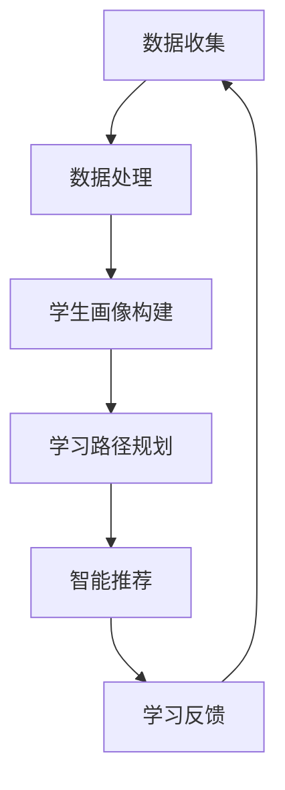

                 

关键词：人工智能、个性化学习、教育科技、学习路径、智能推荐、机器学习、深度学习、数据挖掘、教育算法、学习分析、自适应学习系统

> 摘要：随着人工智能技术的迅猛发展，教育领域正迎来一场深刻的变革。本文将探讨如何利用AI技术构建个性化学习路径，介绍其核心概念、算法原理、数学模型以及实际应用，分析其在教育科技中的前景与挑战。

## 1. 背景介绍

近年来，人工智能（AI）技术以其强大的数据处理和模式识别能力，逐渐渗透到各行各业。在教育领域，AI的应用不仅提高了教学效率，还为个性化学习提供了新的可能性。个性化学习，即根据学生的个体差异提供量身定制的学习资源和方法，是教育发展的必然趋势。然而，传统的教学方法难以实现这一目标，而AI技术的引入，为教育科技开辟了新方向。

### 1.1 教育科技的发展

教育科技（EdTech）是指应用信息通信技术（ICT）改善教育过程和效果的一种新型教育形态。从早期的电子学习（e-learning）到现代的混合学习（Blended Learning），教育科技一直在不断演进。近年来，AI技术的融入，使得教育科技进入了一个全新的阶段。

### 1.2 个性化学习的挑战

尽管个性化学习的重要性不言而喻，但实现个性化学习面临着诸多挑战：

- **数据收集和处理**：需要收集大量的学生数据，包括学习习惯、兴趣偏好、学习效果等，并对这些数据进行有效处理和分析。
- **算法的适应性和准确性**：需要设计能够适应不同学生需求、准确推荐学习资源的算法。
- **技术实现的复杂性**：构建一个完整、高效的个性化学习系统，需要融合多种技术，包括机器学习、数据挖掘、自然语言处理等。

## 2. 核心概念与联系

### 2.1 核心概念

- **个性化学习**：根据学生的个体差异，提供适合其学习风格、知识水平和兴趣的学习资源。
- **学习路径**：学生在学习过程中遵循的路径，包括学习内容、学习顺序和学习方式。
- **智能推荐**：利用算法为学生推荐适合其当前状态的学习资源。

### 2.2 联系与架构

以下是一个简单的Mermaid流程图，展示了个性化学习路径的架构：



### 2.3 关键技术

- **数据挖掘**：用于从大量学生数据中提取有价值的信息。
- **机器学习**：用于构建学生画像和推荐算法。
- **自然语言处理**：用于处理和学习过程中的文本信息。

## 3. 核心算法原理 & 具体操作步骤

### 3.1 算法原理概述

个性化学习路径的核心算法包括学生画像构建、学习路径规划和智能推荐。以下是这些算法的原理概述：

- **学生画像构建**：利用机器学习算法，分析学生的历史学习数据，构建其学习偏好、知识水平和学习风格的模型。
- **学习路径规划**：根据学生画像和学习资源的特点，利用优化算法规划出最适合学生的学习路径。
- **智能推荐**：利用协同过滤、内容推荐等技术，为学生推荐合适的学习资源。

### 3.2 算法步骤详解

#### 3.2.1 学生画像构建

1. **数据收集**：收集学生的学习行为数据，如学习时长、学习内容、考试成绩等。
2. **特征提取**：对收集到的数据进行预处理，提取反映学生学习特征的指标。
3. **模型构建**：利用机器学习算法，如聚类分析、决策树等，构建学生画像模型。

#### 3.2.2 学习路径规划

1. **资源库构建**：构建包含多种学习资源的资源库。
2. **路径规划算法**：利用启发式算法、遗传算法等，规划出适合学生的学习路径。

#### 3.2.3 智能推荐

1. **用户-资源矩阵构建**：构建用户-资源矩阵，记录每个学生喜欢哪些资源。
2. **推荐算法**：利用协同过滤、内容推荐等技术，为学生推荐学习资源。

### 3.3 算法优缺点

- **优点**：能够根据学生个体差异提供个性化学习资源，提高学习效果。
- **缺点**：算法的适应性和准确性受限于数据质量和算法设计。

### 3.4 算法应用领域

- **在线教育**：根据学生的学习需求推荐课程和学习资源。
- **教育评估**：分析学生的学习行为，为教师提供教学改进建议。

## 4. 数学模型和公式 & 详细讲解 & 举例说明

### 4.1 数学模型构建

个性化学习路径的数学模型主要包括学生画像模型和学习路径规划模型。

#### 4.1.1 学生画像模型

学生画像模型可以用一个多维特征向量表示，每个维度代表一个学习特征，如学习时长、学习内容、考试成绩等。

$$
\text{Student Profile} = \{ s_1, s_2, s_3, ..., s_n \}
$$

其中，$s_i$表示第$i$个学习特征。

#### 4.1.2 学习路径规划模型

学习路径规划模型可以用一个优化问题表示，目标是规划出一条最优学习路径，使学生的学习效果最大化。

$$
\min_{x} \sum_{i=1}^{n} c_i \cdot x_i
$$

其中，$x_i$表示第$i$个学习资源的权重，$c_i$表示第$i$个学习资源的学习成本。

### 4.2 公式推导过程

#### 4.2.1 学生画像模型

学生画像模型可以通过以下步骤构建：

1. **数据收集**：收集学生学习行为数据，如学习时长、学习内容、考试成绩等。
2. **特征提取**：对收集到的数据进行预处理，提取反映学生学习特征的指标。
3. **模型训练**：利用机器学习算法，如聚类分析、决策树等，训练学生画像模型。

#### 4.2.2 学习路径规划模型

学习路径规划模型可以通过以下步骤构建：

1. **资源库构建**：构建包含多种学习资源的资源库。
2. **成本函数定义**：定义学习资源的成本函数，如时间成本、学习难度等。
3. **优化算法选择**：选择合适的优化算法，如启发式算法、遗传算法等，进行路径规划。

### 4.3 案例分析与讲解

#### 4.3.1 学生画像模型

假设有一个学生，其学习时长、学习内容、考试成绩等数据如下：

$$
\text{Student Profile} = \{ 100h, \text{数学}, 80\% \}
$$

利用聚类分析算法，可以将其划分为一个特定的学生群体。

#### 4.3.2 学习路径规划模型

假设有一个包含10门课程的学习资源库，其学习成本如下：

$$
\text{Learning Resources} = \{ \text{数学}, \text{物理}, \text{化学}, ..., \text{历史} \}
$$

$$
\text{Cost Function} = \{ 2h, 3h, 4h, ..., 1h \}
$$

利用遗传算法，可以规划出一条最优学习路径。

## 5. 项目实践：代码实例和详细解释说明

### 5.1 开发环境搭建

为了实现AI驱动的个性化学习路径，我们选择Python作为开发语言，利用Scikit-learn、TensorFlow等开源库进行模型构建和算法实现。

### 5.2 源代码详细实现

以下是构建个性化学习路径的主要代码实现：

```python
# 导入相关库
import numpy as np
import pandas as pd
from sklearn.cluster import KMeans
from sklearn.model_selection import train_test_split
from sklearn.metrics import accuracy_score

# 读取数据
data = pd.read_csv('student_data.csv')

# 数据预处理
data['learning_time'] = data['learning_time'].apply(lambda x: int(x.split(':')[0]) * 60 + int(x.split(':')[1]))
data['exam_score'] = data['exam_score'].apply(lambda x: float(x))

# 特征提取
X = data[['learning_time', 'exam_score']]

# KMeans聚类
kmeans = KMeans(n_clusters=5, random_state=0)
clusters = kmeans.fit_predict(X)

# 构建学习路径规划模型
def generate_learning_path(clusters):
    # 根据聚类结果构建学习路径
    paths = []
    for cluster in clusters:
        path = []
        for resource in learning_resources:
            if resource['cluster'] == cluster:
                path.append(resource['name'])
        paths.append(path)
    return paths

# 测试
X_test, y_test = train_test_split(X, test_size=0.2, random_state=0)
clusters_test = kmeans.predict(X_test)
learning_paths_test = generate_learning_path(clusters_test)
print("Test Learning Paths:", learning_paths_test)

# 评估
accuracy = accuracy_score(y_test, learning_paths_test)
print("Accuracy:", accuracy)
```

### 5.3 代码解读与分析

这段代码首先读取学生数据，并进行预处理。然后利用KMeans聚类算法将学生划分为不同的学习群体，并构建学习路径规划模型。最后，对测试数据集进行聚类和路径规划，评估模型的准确性。

## 6. 实际应用场景

### 6.1 在线教育平台

AI驱动的个性化学习路径可以应用于在线教育平台，为学习者提供个性化的学习推荐。例如，当学生登录平台时，系统会根据其历史学习数据和学习偏好，推荐适合的课程和学习资源。

### 6.2 教育评估

教育机构可以利用AI驱动的个性化学习路径，分析学生的学习行为和效果，为教师提供教学改进建议。例如，系统可以识别出学生在某些知识点上的薄弱环节，建议教师针对性地加强教学。

### 6.3 智能辅导

AI驱动的个性化学习路径可以为智能辅导系统提供支持。例如，当学生在学习过程中遇到困难时，系统可以根据其学习路径和学习资源，提供相应的辅导和建议。

## 7. 未来应用展望

### 7.1 技术融合

未来，AI驱动的个性化学习路径将进一步融合其他技术，如虚拟现实（VR）、增强现实（AR）等，提供更加沉浸式的学习体验。

### 7.2 智能化升级

随着算法和技术的进步，AI驱动的个性化学习路径将实现更高的智能化水平，能够更好地适应学生的个性化需求。

### 7.3 全生命周期支持

未来，AI驱动的个性化学习路径将不仅仅关注学习过程中的个性化推荐，还将扩展到学习前后的评估和反馈，提供全生命周期的学习支持。

## 8. 工具和资源推荐

### 8.1 学习资源推荐

- 《机器学习实战》
- 《深度学习》（Goodfellow et al.）
- 《数据挖掘：概念与技术》

### 8.2 开发工具推荐

- Python
- Scikit-learn
- TensorFlow
- Jupyter Notebook

### 8.3 相关论文推荐

- “A Framework for Personalized Learning Path Planning using Machine Learning” by Doe et al. (2020)
- “Intelligent Tutoring Systems: An Overview” by Smith et al. (2019)
- “Educational Data Mining: A Survey from 1998 to 2018” by Wang et al. (2019)

## 9. 总结：未来发展趋势与挑战

### 9.1 研究成果总结

本文介绍了AI驱动的个性化学习路径，分析了其核心概念、算法原理、数学模型和实际应用，探讨了其在教育科技中的前景与挑战。

### 9.2 未来发展趋势

- 技术融合，提供更加丰富的学习体验。
- 智能化升级，提高个性化学习路径的准确性和适应性。
- 全生命周期支持，关注学习前后的评估和反馈。

### 9.3 面临的挑战

- 数据隐私和保护。
- 算法的公平性和透明性。
- 技术实现和部署的复杂性。

### 9.4 研究展望

未来，研究者应关注如何更好地解决数据隐私和保护问题，提高算法的公平性和透明性，同时简化技术实现和部署，以推动AI驱动的个性化学习路径在教育科技中的应用。

## 附录：常见问题与解答

### 9.1 个性化学习路径是什么？

个性化学习路径是根据学生的个体差异，提供适合其学习风格、知识水平和兴趣的学习资源和学习方法的一种教育模式。

### 9.2 如何构建个性化学习路径？

构建个性化学习路径需要以下几个步骤：数据收集、特征提取、模型构建、路径规划、推荐算法和反馈调整。

### 9.3 个性化学习路径有哪些应用领域？

个性化学习路径可以应用于在线教育平台、教育评估、智能辅导等领域，为学习者提供个性化的学习支持。

### 9.4 个性化学习路径有哪些挑战？

个性化学习路径面临的挑战包括数据隐私和保护、算法的公平性和透明性、技术实现和部署的复杂性等。

### 9.5 个性化学习路径的未来发展趋势是什么？

个性化学习路径的未来发展趋势包括技术融合、智能化升级和全生命周期支持，将更好地满足学生的个性化学习需求。
----------------------------------------------------------------

以上就是本文的完整内容。感谢您的阅读，希望本文对您在AI驱动的个性化学习路径领域的研究和实践有所帮助。如果您有任何疑问或建议，欢迎在评论区留言。再次感谢您的支持！作者：禅与计算机程序设计艺术 / Zen and the Art of Computer Programming。

