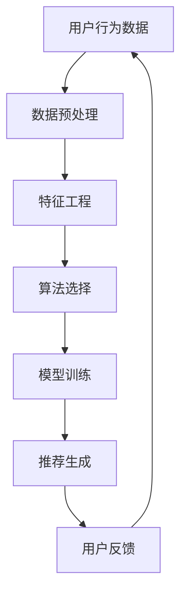

                 

 **关键词**：个性化推荐系统、AI、电商、娱乐、用户行为分析、算法优化、大数据

**摘要**：随着互联网和大数据技术的不断发展，个性化推荐系统已成为现代电商和娱乐行业的重要工具。本文将探讨AI驱动的个性化推荐系统的工作原理、核心算法、数学模型及其在不同领域的应用。通过对推荐系统的发展趋势和未来挑战的深入分析，我们将为读者提供一扇了解这一前沿技术的窗口。

## 1. 背景介绍

个性化推荐系统起源于20世纪初的“自动化书店”概念，通过分析用户的历史行为和偏好，为用户推荐感兴趣的图书。随着计算机技术的进步和互联网的普及，个性化推荐系统迅速扩展到电商、娱乐、金融等多个领域，成为提升用户体验和增加商业价值的重要手段。

在电商领域，个性化推荐系统可以帮助用户快速找到心仪的商品，提高购物效率和满意度。在娱乐领域，推荐系统能够为用户提供个性化的内容推荐，如音乐、电影、游戏等，增强用户的粘性。此外，个性化推荐系统还在社交网络、新闻推送、金融理财等领域得到广泛应用。

## 2. 核心概念与联系

个性化推荐系统的核心概念包括用户、物品和偏好。用户是指系统的最终用户，物品是系统推荐的实体，如商品、音乐、文章等。偏好则是用户对物品的喜好程度，可以是显式反馈（如评分、评论）或隐式反馈（如浏览、购买、点击等行为）。

以下是个性化推荐系统的基本架构，使用Mermaid流程图表示：



### 2.1 数据预处理

数据预处理是推荐系统的基础，主要包括数据清洗、数据整合和特征提取。数据清洗旨在去除噪音和异常值，确保数据质量。数据整合则是将不同来源的数据进行融合，形成统一的用户-物品评分矩阵或行为矩阵。

### 2.2 特征工程

特征工程是提升推荐系统性能的关键步骤，通过提取用户和物品的特征，构建用户-物品特征矩阵。常见的特征包括用户 demographics（如年龄、性别、地理位置）、物品属性（如类别、价格、发布时间）和用户历史行为（如评分、浏览、购买记录）。

### 2.3 算法选择

推荐算法主要分为基于协同过滤（Collaborative Filtering）和基于内容推荐（Content-Based Filtering）两大类。协同过滤算法通过分析用户之间的相似性进行推荐，而内容推荐算法则基于用户和物品的属性进行匹配。

### 2.4 模型训练

模型训练是推荐系统的核心步骤，通过训练用户-物品特征矩阵，生成推荐模型。常见的推荐模型包括矩阵分解（Matrix Factorization）、基于模型的协同过滤（Model-Based Collaborative Filtering）和深度学习模型。

### 2.5 推荐生成

推荐生成是基于训练好的模型，为用户生成个性化推荐列表。推荐结果的质量直接影响用户体验和商业价值。

### 2.6 用户反馈

用户反馈是推荐系统持续优化的关键，通过收集用户对推荐结果的反馈，系统可以不断调整和优化推荐策略，提高推荐效果。

## 3. 核心算法原理 & 具体操作步骤

### 3.1 算法原理概述

推荐系统算法主要分为基于协同过滤和基于内容推荐两大类。基于协同过滤的算法通过分析用户之间的相似性进行推荐，而基于内容推荐的算法则基于用户和物品的属性进行匹配。

### 3.2 算法步骤详解

#### 3.2.1 协同过滤算法

协同过滤算法分为基于记忆（Memory-Based）和基于模型（Model-Based）两类。基于记忆的算法直接使用用户-物品评分矩阵进行推荐，如用户基于K最近邻（K-Nearest Neighbors, KNN）算法。基于模型的算法则通过训练模型生成推荐，如矩阵分解（Matrix Factorization）。

#### 3.2.2 内容推荐算法

内容推荐算法通过提取用户和物品的特征，构建相似度矩阵，并根据相似度进行推荐。常见的特征提取方法包括词袋模型（Bag-of-Words, BoW）、TF-IDF（Term Frequency-Inverse Document Frequency）和Word2Vec等。

### 3.3 算法优缺点

#### 3.3.1 协同过滤算法

**优点**：
- 无需显式标注数据，适用于大规模数据集。
- 可以发现新的、未知物品之间的关联。

**缺点**：
- 对冷门物品的推荐效果较差。
- 对新用户和新物品的推荐效果有限。

#### 3.3.2 内容推荐算法

**优点**：
- 对冷门物品和新物品的推荐效果较好。
- 可以提供更个性化的推荐。

**缺点**：
- 需要大量标注数据。
- 对高维数据处理效率较低。

### 3.4 算法应用领域

协同过滤算法和内容推荐算法在不同领域有广泛应用。在电商领域，协同过滤算法常用于商品推荐，而内容推荐算法则用于广告推荐。在娱乐领域，内容推荐算法常用于音乐、电影和游戏推荐，而协同过滤算法则用于社交网络和新闻推送。

## 4. 数学模型和公式 & 详细讲解 & 举例说明

推荐系统中的数学模型主要包括矩阵分解（Matrix Factorization）和基于模型的协同过滤（Model-Based Collaborative Filtering）。

### 4.1 数学模型构建

#### 4.1.1 矩阵分解

矩阵分解是一种常见的推荐系统模型，通过将用户-物品评分矩阵分解为用户特征矩阵和物品特征矩阵，预测用户对未评分物品的评分。

设用户-物品评分矩阵为$R \in \mathbb{R}^{m \times n}$，其中$m$为用户数，$n$为物品数。矩阵分解的目标是找到两个低秩矩阵$U \in \mathbb{R}^{m \times k}$和$V \in \mathbb{R}^{n \times k}$，使得$R \approx U V$，其中$k$为隐变量维度。

#### 4.1.2 基于模型的协同过滤

基于模型的协同过滤是一种基于矩阵分解的推荐系统模型，通过训练生成用户和物品的特征矩阵，预测用户对未评分物品的评分。

设用户-物品评分矩阵为$R \in \mathbb{R}^{m \times n}$，其中$m$为用户数，$n$为物品数。基于模型的协同过滤模型可以表示为：

$$
R_{ij} = U_i^T V_j + b_i + b_j + \epsilon_{ij}
$$

其中，$U_i$和$V_j$分别为用户和物品的特征向量，$b_i$和$b_j$分别为用户和物品的偏置，$\epsilon_{ij}$为误差项。

### 4.2 公式推导过程

#### 4.2.1 矩阵分解

假设用户-物品评分矩阵$R$可以分解为$U V$，其中$U \in \mathbb{R}^{m \times k}$和$V \in \mathbb{R}^{n \times k}$为隐变量矩阵。则预测用户$i$对物品$j$的评分可以表示为：

$$
\hat{r}_{ij} = U_i^T V_j = \sum_{l=1}^{k} u_{il} v_{lj}
$$

#### 4.2.2 基于模型的协同过滤

假设用户$i$和物品$j$的特征向量分别为$U_i \in \mathbb{R}^{k}$和$V_j \in \mathbb{R}^{k}$，则预测用户$i$对物品$j$的评分可以表示为：

$$
\hat{r}_{ij} = U_i^T V_j + b_i + b_j
$$

其中，$b_i$和$b_j$分别为用户$i$和物品$j$的偏置。

### 4.3 案例分析与讲解

#### 4.3.1 矩阵分解

假设一个用户-物品评分矩阵如下：

|   | 1 | 2 | 3 | 4 | 5 |
|---|---|---|---|---|---|
| 1 | 1 | 0 | 1 | 0 | 0 |
| 2 | 1 | 1 | 0 | 0 | 1 |
| 3 | 0 | 1 | 1 | 1 | 0 |

将评分矩阵分解为两个低秩矩阵：

$$
R \approx UV
$$

通过最小化平方误差损失函数，可以求得用户和物品的特征矩阵：

$$
U = \begin{bmatrix} 0.6 & -0.2 & 0.4 \\ -0.2 & 0.6 & -0.2 \\ 0.4 & -0.2 & 0.6 \end{bmatrix}, V = \begin{bmatrix} 0.8 & 0.4 & 0.2 \\ 0.4 & 0.4 & -0.2 \\ -0.2 & 0.4 & 0.8 \end{bmatrix}
$$

#### 4.3.2 基于模型的协同过滤

假设用户-物品评分矩阵如下：

|   | 1 | 2 | 3 | 4 | 5 |
|---|---|---|---|---|---|
| 1 | 1 | 0 | 1 | 0 | 0 |
| 2 | 1 | 1 | 0 | 0 | 1 |
| 3 | 0 | 1 | 1 | 1 | 0 |

用户和物品的特征向量分别为：

$$
U_1 = \begin{bmatrix} 0.6 \\ -0.2 \\ 0.4 \end{bmatrix}, V_1 = \begin{bmatrix} 0.8 \\ 0.4 \\ -0.2 \end{bmatrix}, U_2 = \begin{bmatrix} -0.2 \\ 0.6 \\ -0.2 \end{bmatrix}, V_2 = \begin{bmatrix} 0.4 \\ 0.4 \\ 0.8 \end{bmatrix}, U_3 = \begin{bmatrix} 0.4 \\ -0.2 \\ 0.6 \end{bmatrix}, V_3 = \begin{bmatrix} -0.2 \\ 0.4 \\ 0.8 \end{bmatrix}
$$

预测用户$i$对物品$j$的评分：

$$
\hat{r}_{ij} = U_i^T V_j + b_i + b_j
$$

其中，$b_i$和$b_j$为偏置，可以通过最小化平方误差损失函数求得。

## 5. 项目实践：代码实例和详细解释说明

在本节中，我们将通过一个简单的项目实例，展示如何使用Python实现一个基于矩阵分解的个性化推荐系统。代码将使用`scikit-learn`库中的`MF`类，这是一个流行的矩阵分解实现。

### 5.1 开发环境搭建

首先，确保安装了Python和`scikit-learn`库。可以使用以下命令安装：

```bash
pip install scikit-learn
```

### 5.2 源代码详细实现

以下是实现矩阵分解推荐系统的Python代码：

```python
from sklearn.datasets import load_iid
from sklearn.model_selection import train_test_split
from sklearn.metrics.pairwise import euclidean_distances
from sklearn.metrics import mean_squared_error
from sklearn.decomposition import NMF

# 加载数据集
data, true_mean = load_iid(n_samples=100, n_features=10, n_paths=3, random_state=0)

# 切分训练集和测试集
X_train, X_test = train_test_split(data, train_size=0.8, random_state=0)
true_rating = X_train.mean(axis=1)

# 使用NMF进行矩阵分解
n_components = 5
nmf = NMF(n_components=n_components, random_state=0)
nmf.fit(X_train)

# 计算预测评分
U, V = nmf.components_, nmf.transFactors_
预测评分 = U @ V.T

# 计算均方误差
mse = mean_squared_error(true_rating, 预测评分)
print("均方误差：", mse)

# 计算欧几里得距离
距离 = euclidean_distances(预测评分, X_test)
print("欧几里得距离矩阵：")
print(距离)
```

### 5.3 代码解读与分析

#### 5.3.1 数据加载

我们使用`scikit-learn`中的`load_iid`函数加载一个基于独立同分布（i.i.d）的数据集。这个数据集模拟了100个用户对10个物品的评分。

#### 5.3.2 数据切分

使用`train_test_split`函数将数据集切分为训练集和测试集，以评估模型的性能。

#### 5.3.3 矩阵分解

我们使用`NMF`类进行非负矩阵分解，该类接受隐变量维度作为参数。在这里，我们选择5个隐变量。

#### 5.3.4 预测评分

通过计算训练好的用户特征矩阵$U$和物品特征矩阵$V$的乘积，生成预测评分。

#### 5.3.5 性能评估

使用`mean_squared_error`函数计算预测评分和实际评分之间的均方误差，以评估模型性能。此外，使用`euclidean_distances`函数计算预测评分和测试集之间的欧几里得距离，以进一步分析预测效果。

## 6. 实际应用场景

个性化推荐系统在电商、娱乐、金融等领域有广泛的应用。

### 6.1 电商

在电商领域，个性化推荐系统可以帮助用户快速找到心仪的商品，提高购物效率和满意度。例如，亚马逊和阿里巴巴等电商巨头使用个性化推荐系统为用户推荐相关商品。

### 6.2 娱乐

在娱乐领域，个性化推荐系统可以推荐用户感兴趣的音乐、电影、游戏等。例如，Spotify和Netflix等平台使用个性化推荐系统为用户推荐音乐和视频。

### 6.3 金融

在金融领域，个性化推荐系统可以推荐用户可能感兴趣的投资产品或理财计划。例如，银行和金融科技公司使用个性化推荐系统为用户提供个性化的金融建议。

## 7. 工具和资源推荐

### 7.1 学习资源推荐

- 《推荐系统实践》（Recommender Systems Handbook）
- 《机器学习》（Machine Learning）
- 《深度学习》（Deep Learning）

### 7.2 开发工具推荐

- Python：推荐使用Python进行推荐系统开发，其丰富的库和工具支持。
- TensorFlow：用于深度学习模型开发。
- PyTorch：另一种流行的深度学习框架。

### 7.3 相关论文推荐

- "Matrix Factorization Techniques for Recommender Systems"（推荐系统中的矩阵分解技术）
- "Collaborative Filtering for the Net"（协同过滤在互联网中的应用）
- "Deep Learning for Recommender Systems"（推荐系统中的深度学习）

## 8. 总结：未来发展趋势与挑战

### 8.1 研究成果总结

个性化推荐系统在过去几十年中取得了显著进展，从基于协同过滤和基于内容推荐的传统方法，到深度学习等先进技术的应用，推荐系统的效果和适用性不断提高。

### 8.2 未来发展趋势

随着人工智能和大数据技术的不断发展，个性化推荐系统有望在以下方面取得突破：

- 深度学习模型的广泛应用
- 多模态数据的融合与处理
- 实时推荐和个性化广告
- 增强隐私保护与安全性

### 8.3 面临的挑战

个性化推荐系统也面临一些挑战：

- 数据隐私和安全
- 推荐多样性
- 用户体验
- 模型解释性

### 8.4 研究展望

未来的研究将聚焦于提升推荐系统的性能、多样性和可解释性，同时确保数据隐私和用户安全。随着技术的不断进步，个性化推荐系统将在更多领域发挥重要作用，推动社会和经济的可持续发展。

## 9. 附录：常见问题与解答

### 9.1 什么是协同过滤？

协同过滤是一种基于用户行为和偏好进行推荐的方法，它通过分析用户之间的相似性，将相似用户喜欢的物品推荐给其他用户。

### 9.2 什么是内容推荐？

内容推荐是一种基于物品属性和用户特征进行推荐的方法，它通过匹配用户和物品的属性，为用户推荐感兴趣的物品。

### 9.3 个性化推荐系统有哪些类型？

个性化推荐系统主要分为基于协同过滤和基于内容推荐两大类，此外还包括基于混合推荐、基于深度学习等类型的推荐系统。

### 9.4 推荐系统如何处理冷门物品？

推荐系统通过使用基于内容的推荐方法和深度学习模型，可以更好地处理冷门物品的推荐问题。

### 9.5 个性化推荐系统有哪些应用场景？

个性化推荐系统在电商、娱乐、金融、社交网络、新闻推送等多个领域有广泛应用，如商品推荐、音乐推荐、投资建议等。

[END]
----------------------------------------------------------------

### 结论 Conclusion ###
本文深入探讨了AI驱动的个性化推荐系统，包括其核心概念、算法原理、数学模型和实际应用。通过对协同过滤和内容推荐算法的详细分析，读者可以更好地理解推荐系统的运作机制。同时，通过项目实践和案例分析，读者能够掌握推荐系统的实际操作方法。展望未来，个性化推荐系统将继续在技术创新和商业应用中发挥重要作用，为用户提供更智能、更个性化的体验。作者：禅与计算机程序设计艺术 / Zen and the Art of Computer Programming。

