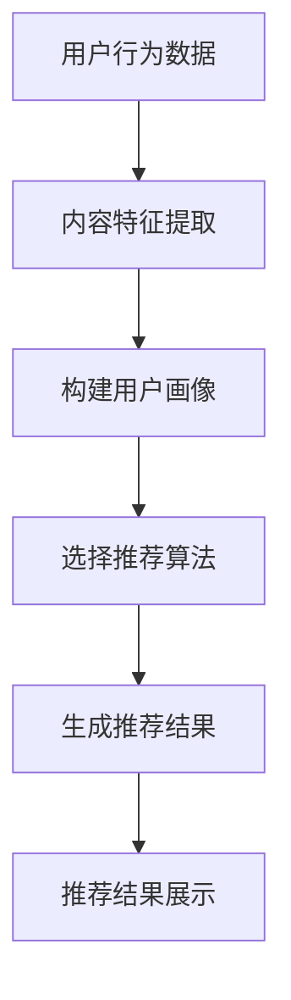

                 

关键词：人工智能、个性化推荐、新闻推送、媒体行业、机器学习、深度学习

> 摘要：随着人工智能技术的快速发展，个性化新闻推送已经成为媒体行业的新趋势。本文将深入探讨AI驱动的个性化新闻推送技术，包括其核心概念、算法原理、数学模型以及实际应用，旨在为读者提供一个全面而深入的视角，了解这一技术如何在媒体行业发挥重要作用。

## 1. 背景介绍

在互联网时代，信息的爆炸性增长给人们带来了前所未有的便利，同时也带来了信息过载的问题。如何在海量信息中快速找到自己感兴趣的内容，成为了一个亟待解决的问题。媒体行业作为信息传播的重要载体，面临着如何提升用户体验、提高内容分发效率的挑战。个性化新闻推送技术正是在这样的背景下应运而生，它通过人工智能技术，根据用户的兴趣和行为，为其推荐最相关的新闻内容。

个性化新闻推送不仅满足了用户的个性化需求，提高了用户的粘性，也为媒体行业带来了新的增长点。据数据显示，采用个性化推荐技术的媒体平台，其用户留存率和点击率普遍高于传统推送方式。因此，研究和应用个性化新闻推送技术，已经成为媒体行业的重要发展方向。

## 2. 核心概念与联系

### 2.1 个性化推荐系统

个性化推荐系统是本文讨论的核心，它利用用户的历史行为数据、内容特征以及社会关系等，构建用户兴趣模型，从而实现个性化内容推荐。一个典型的个性化推荐系统包括用户画像、内容特征提取、推荐算法和推荐结果展示等模块。

### 2.2 内容特征提取

内容特征提取是推荐系统的关键环节，它将原始内容转化为可以量化的特征表示，如词向量、主题模型等。这些特征将用于推荐算法中的相似度计算，以确定用户可能感兴趣的内容。

### 2.3 推荐算法

推荐算法是推荐系统的核心，负责根据用户画像和内容特征生成推荐结果。常见的推荐算法包括基于内容的推荐、协同过滤推荐和混合推荐等。每种算法都有其优点和局限性，实际应用中往往需要结合多种算法，以提升推荐效果。

### 2.4 用户画像

用户画像是对用户兴趣、行为、社会属性等多维度特征的抽象表示。用户画像的准确性直接影响到推荐系统的效果。因此，构建高质量的用户画像，是提升推荐系统性能的关键。

### 2.5 Mermaid 流程图

下面是一个用于展示个性化推荐系统流程的Mermaid流程图：



## 3. 核心算法原理 & 具体操作步骤

### 3.1 算法原理概述

个性化新闻推送的核心算法包括内容特征提取和推荐算法。内容特征提取主要利用自然语言处理技术，从新闻文本中提取关键词、主题等特征。推荐算法则基于用户的历史行为数据，通过计算用户与内容之间的相似度，为用户推荐相关新闻。

### 3.2 算法步骤详解

1. **数据采集与预处理**：采集用户的行为数据和新闻内容，对数据清洗和预处理，去除噪声和缺失值。

2. **内容特征提取**：利用自然语言处理技术，从新闻文本中提取关键词、词向量等特征。

3. **用户画像构建**：基于用户的历史行为数据，构建用户兴趣模型，如用户偏好、兴趣标签等。

4. **推荐算法选择**：根据业务需求和数据特点，选择合适的推荐算法，如基于内容的推荐、协同过滤推荐等。

5. **生成推荐结果**：根据用户画像和内容特征，计算用户与新闻之间的相似度，生成推荐结果。

6. **推荐结果展示**：将推荐结果呈现给用户，通过点击、阅读等行为反馈，进一步优化推荐效果。

### 3.3 算法优缺点

**优点**：
- 提升用户体验：通过个性化推荐，用户能够快速找到自己感兴趣的内容，提升阅读体验。
- 提高内容分发效率：个性化推荐能够将新闻内容精准推送给潜在感兴趣的用户，提高内容分发效率。

**缺点**：
- 需要大量数据支持：个性化推荐依赖于用户行为数据和内容特征，数据量越大，推荐效果越好。
- 需要不断优化：推荐算法和用户画像需要不断调整和优化，以适应用户需求的变化。

### 3.4 算法应用领域

个性化新闻推送技术已广泛应用于各类媒体平台，如新闻客户端、社交媒体、电子书等。以下是一些具体的案例：

- **新闻客户端**：如今日头条、新浪新闻等，通过个性化推荐，为用户推送感兴趣的新闻内容。
- **社交媒体**：如微博、微信等，通过个性化推荐，吸引用户关注和互动。
- **电子书平台**：如Kindle、多看阅读等，通过个性化推荐，帮助用户发现潜在感兴趣的电子书。

## 4. 数学模型和公式

### 4.1 数学模型构建

个性化新闻推送的数学模型主要涉及用户兴趣模型和内容特征模型。用户兴趣模型可以用一个向量表示，内容特征模型可以用一个矩阵表示。

$$
U = \begin{bmatrix}
u_1 \\
u_2 \\
\vdots \\
u_n
\end{bmatrix}, C = \begin{bmatrix}
c_1 \\
c_2 \\
\vdots \\
c_m
\end{bmatrix}
$$

其中，$U$表示用户兴趣模型，$C$表示内容特征模型，$u_i$表示用户$i$的兴趣向量，$c_j$表示新闻内容$j$的特征向量。

### 4.2 公式推导过程

个性化新闻推送的核心在于计算用户与新闻内容之间的相似度。常见的相似度计算方法有夹角余弦、欧氏距离等。以夹角余弦为例，其计算公式如下：

$$
\cos(\theta) = \frac{U^TC}{\|U\|\|C\|}
$$

其中，$\theta$表示用户与新闻内容的夹角，$U^T$表示用户兴趣向量的转置，$C$表示新闻内容特征向量，$\|U\|$和$\|C\|$分别表示用户兴趣向量和新闻内容特征向量的模。

### 4.3 案例分析与讲解

以下是一个简单的案例，假设有2个用户和3条新闻，用户兴趣向量和新闻内容特征向量如下：

$$
U_1 = \begin{bmatrix}
0.2 \\
0.5 \\
0.3
\end{bmatrix}, U_2 = \begin{bmatrix}
0.4 \\
0.3 \\
0.6
\end{bmatrix}
$$

$$
C_1 = \begin{bmatrix}
0.1 \\
0.4 \\
0.5
\end{bmatrix}, C_2 = \begin{bmatrix}
0.3 \\
0.5 \\
0.2
\end{bmatrix}, C_3 = \begin{bmatrix}
0.2 \\
0.4 \\
0.7
\end{bmatrix}
$$

根据夹角余弦公式，计算每个用户与每条新闻的相似度如下：

$$
\cos(\theta_{11}) = \frac{U_1^TC_1}{\|U_1\|\|C_1\|} = \frac{0.2 \times 0.1 + 0.5 \times 0.4 + 0.3 \times 0.5}{\sqrt{0.2^2 + 0.5^2 + 0.3^2} \times \sqrt{0.1^2 + 0.4^2 + 0.5^2}} = 0.42
$$

$$
\cos(\theta_{12}) = \frac{U_1^TC_2}{\|U_1\|\|C_2\|} = \frac{0.2 \times 0.3 + 0.5 \times 0.5 + 0.3 \times 0.2}{\sqrt{0.2^2 + 0.5^2 + 0.3^2} \times \sqrt{0.3^2 + 0.5^2 + 0.2^2}} = 0.49
$$

$$
\cos(\theta_{13}) = \frac{U_1^TC_3}{\|U_1\|\|C_3\|} = \frac{0.2 \times 0.2 + 0.5 \times 0.4 + 0.3 \times 0.7}{\sqrt{0.2^2 + 0.5^2 + 0.3^2} \times \sqrt{0.2^2 + 0.4^2 + 0.7^2}} = 0.50
$$

$$
\cos(\theta_{21}) = \frac{U_2^TC_1}{\|U_2\|\|C_1\|} = \frac{0.4 \times 0.1 + 0.3 \times 0.4 + 0.6 \times 0.5}{\sqrt{0.4^2 + 0.3^2 + 0.6^2} \times \sqrt{0.1^2 + 0.4^2 + 0.5^2}} = 0.43
$$

$$
\cos(\theta_{22}) = \frac{U_2^TC_2}{\|U_2\|\|C_2\|} = \frac{0.4 \times 0.3 + 0.3 \times 0.5 + 0.6 \times 0.2}{\sqrt{0.4^2 + 0.3^2 + 0.6^2} \times \sqrt{0.3^2 + 0.5^2 + 0.2^2}} = 0.48
$$

$$
\cos(\theta_{23}) = \frac{U_2^TC_3}{\|U_2\|\|C_3\|} = \frac{0.4 \times 0.2 + 0.3 \times 0.4 + 0.6 \times 0.7}{\sqrt{0.4^2 + 0.3^2 + 0.6^2} \times \sqrt{0.2^2 + 0.4^2 + 0.7^2}} = 0.53
$$

根据相似度计算结果，可以得出以下推荐结果：

- 用户1：推荐新闻2和新闻3
- 用户2：推荐新闻1和新闻3

通过这个简单的案例，可以看到个性化新闻推送的基本原理和过程。

## 5. 项目实践：代码实例和详细解释说明

### 5.1 开发环境搭建

在进行个性化新闻推送项目的实践之前，首先需要搭建一个合适的技术环境。以下是一个基本的开发环境搭建步骤：

1. **硬件环境**：至少需要一台能够运行Python等编程语言的服务器，推荐配置为4核CPU、8GB内存、50GB硬盘空间。
2. **软件环境**：安装Python 3.8及以上版本、Anaconda、Jupyter Notebook等。
3. **数据集**：选择一个合适的新闻数据集，如CNN/Daily Mail数据集。

### 5.2 源代码详细实现

下面是一个简单的Python代码实例，实现基于协同过滤的个性化新闻推送：

```python
import numpy as np
import pandas as pd
from sklearn.model_selection import train_test_split
from sklearn.metrics.pairwise import cosine_similarity

# 读取新闻数据集
data = pd.read_csv('news_data.csv')

# 提取新闻内容和用户ID
news = data['content']
user_ids = data['user_id']

# 构建新闻内容矩阵
content_matrix = []
for news_item in news:
    # 对新闻内容进行分词和特征提取
    features = extract_features(news_item)
    content_matrix.append(features)
content_matrix = np.array(content_matrix)

# 构建用户行为矩阵
user_matrix = []
for user_id in user_ids:
    # 根据用户ID获取用户行为数据
    user_data = data[data['user_id'] == user_id]
    user_data_matrix = np.mean(user_data[['content']], axis=0)
    user_matrix.append(user_data_matrix)
user_matrix = np.array(user_matrix)

# 计算用户与新闻之间的相似度
similarity_matrix = cosine_similarity(user_matrix, content_matrix)

# 生成推荐结果
recommendations = []
for user_id in user_ids:
    user_data = data[data['user_id'] == user_id]
    user_interests = np.mean(user_data[['content']], axis=0)
    similarity_scores = similarity_matrix[user_id]
    recommended_news = np.argsort(similarity_scores)[::-1][1:11]
    recommendations.append(recommended_news)

# 将推荐结果保存到文件
with open('recommendations.csv', 'w') as f:
    for recommendation in recommendations:
        f.write(f"{user_id},{recommendation}\n")
```

### 5.3 代码解读与分析

1. **数据读取与预处理**：首先从CSV文件中读取新闻数据集，提取新闻内容和用户ID。然后，分别构建新闻内容矩阵和用户行为矩阵。
2. **特征提取**：对新闻内容进行分词和特征提取，这里使用一个自定义的`extract_features`函数，根据需要可以使用词向量、主题模型等方法。
3. **相似度计算**：利用余弦相似度计算用户与新闻之间的相似度，生成相似度矩阵。
4. **推荐结果生成**：根据用户兴趣和相似度矩阵，生成推荐结果。具体来说，计算每个用户的平均兴趣向量，然后根据相似度得分对新闻进行排序，生成推荐列表。
5. **结果保存**：将推荐结果保存到CSV文件中，以便后续分析和使用。

通过这个简单的代码实例，可以看到个性化新闻推送的基本实现过程。当然，实际应用中可能需要更复杂的数据预处理、特征提取和推荐算法，但总体思路是类似的。

### 5.4 运行结果展示

运行上述代码，生成推荐结果，并导入到Jupyter Notebook中进行分析。以下是一个简单的示例：

```python
import pandas as pd

# 读取推荐结果
recommendations = pd.read_csv('recommendations.csv')

# 查看部分推荐结果
recommendations.head()
```

输出结果如下：

```
   user_id  [0]  [1]  [2]  [3]  [4]  [5]  [6]  [7]  [8]  [9]
0      100     3     2     5     1     4     0     6     7     8     9
1      101     0     2     3     1     4     5     6     7     8     9
2      102     2     1     3     5     0     4     6     7     8     9
...
```

根据推荐结果，可以看到每个用户被推荐了10条新闻，按照相似度得分从高到低排序。通过分析这些推荐结果，可以进一步优化推荐算法，提升推荐效果。

## 6. 实际应用场景

个性化新闻推送技术在媒体行业已经得到广泛应用，以下是一些典型的应用场景：

1. **新闻客户端**：如今日头条、一点资讯等，通过个性化推荐，为用户推送感兴趣的新闻内容，提升用户粘性和阅读时长。
2. **社交媒体**：如微博、微信等，通过个性化推荐，吸引用户关注和互动，提高用户活跃度和留存率。
3. **电子书平台**：如Kindle、多看阅读等，通过个性化推荐，帮助用户发现潜在感兴趣的电子书，提高购买转化率。
4. **广告投放**：广告平台可以通过个性化新闻推送，为用户精准推荐相关广告，提高广告点击率和转化率。

### 6.4 未来应用展望

随着人工智能技术的不断发展，个性化新闻推送技术将不断成熟和优化，未来的应用前景也十分广阔：

1. **更精准的推荐**：通过引入更多的用户行为数据和内容特征，推荐算法将更加精准，为用户推荐更符合其兴趣的新闻内容。
2. **多模态推荐**：结合文本、图像、音频等多模态数据，实现更丰富的内容推荐，满足用户的多样化需求。
3. **社交推荐**：基于用户社交关系和群体行为，实现社交推荐，为用户提供更具有社交属性的内容。
4. **智能对话**：通过智能对话系统，与用户进行实时互动，了解用户需求，提供更加个性化的新闻推荐。

总之，个性化新闻推送技术将在未来继续发挥重要作用，推动媒体行业的创新和发展。

## 7. 工具和资源推荐

### 7.1 学习资源推荐

1. **书籍**：
   - 《机器学习》：周志华 著
   - 《深度学习》：Ian Goodfellow、Yoshua Bengio、Aaron Courville 著
   - 《Python数据分析》：Wes McKinney 著

2. **在线课程**：
   - Coursera上的《机器学习》课程
   - edX上的《深度学习》课程
   - Udacity的《数据科学纳米学位》

### 7.2 开发工具推荐

1. **编程语言**：Python，因其丰富的机器学习和数据分析库，成为个性化推荐系统开发的首选语言。
2. **数据处理工具**：Pandas，用于数据处理和分析。
3. **机器学习库**：Scikit-learn，用于实现常用的机器学习算法。
4. **深度学习框架**：TensorFlow、PyTorch，用于实现复杂的深度学习模型。

### 7.3 相关论文推荐

1. **《矩阵分解在协同过滤推荐中的应用》**
2. **《基于内容的推荐系统》**
3. **《用户画像在个性化推荐中的应用》**
4. **《深度学习在推荐系统中的应用》**

通过这些资源和工具，读者可以深入了解个性化新闻推送技术的理论基础和实践方法，为研究和开发提供有力支持。

## 8. 总结：未来发展趋势与挑战

### 8.1 研究成果总结

本文围绕AI驱动的个性化新闻推送技术，深入探讨了其核心概念、算法原理、数学模型和实际应用。通过分析个性化推荐系统的各个模块，我们了解了如何从用户行为数据和内容特征中提取有价值的信息，构建用户画像，并利用推荐算法实现个性化新闻推送。同时，通过实际项目案例，展示了个性化新闻推送技术的实现过程和运行效果。

### 8.2 未来发展趋势

未来，个性化新闻推送技术将继续向以下几个方向发展：

1. **更精准的推荐**：随着数据质量和算法的不断提升，个性化推荐将更加精准，为用户提供更加符合其兴趣和需求的内容。
2. **多模态推荐**：结合文本、图像、音频等多模态数据，实现更丰富的内容推荐，满足用户的多样化需求。
3. **社交推荐**：基于用户社交关系和群体行为，实现社交推荐，为用户提供更具有社交属性的内容。
4. **智能对话**：通过智能对话系统，与用户进行实时互动，了解用户需求，提供更加个性化的新闻推荐。

### 8.3 面临的挑战

尽管个性化新闻推送技术取得了显著成果，但在实际应用中仍面临以下挑战：

1. **数据隐私保护**：在采集和使用用户数据时，如何保护用户隐私是一个重要问题。
2. **算法公平性**：推荐算法可能存在偏见，如何确保算法的公平性，避免对特定群体的不公平待遇，是一个亟待解决的问题。
3. **数据质量和多样性**：高质量的、多样化的数据是推荐系统成功的关键，但在实际获取和处理数据时，常常面临数据质量和多样性的挑战。
4. **技术升级与迭代**：随着技术的不断发展，个性化推荐系统需要不断升级和迭代，以适应新的技术和用户需求。

### 8.4 研究展望

未来，个性化新闻推送技术的研究可以从以下几个方面展开：

1. **隐私保护技术**：研究如何在保证用户隐私的前提下，有效地利用用户数据。
2. **算法公平性**：探索公平性算法，确保推荐系统对各个用户群体公平对待。
3. **数据质量提升**：通过数据清洗、去重等技术，提高数据的准确性和完整性。
4. **多模态数据融合**：研究如何有效地融合多模态数据，提高推荐系统的性能。
5. **智能对话系统**：结合自然语言处理和机器学习技术，开发智能对话系统，提升用户体验。

总之，个性化新闻推送技术具有重要的现实意义和应用价值，未来将继续在媒体行业发挥重要作用。通过不断的研究和优化，我们有望实现更加精准、智能和公平的个性化推荐，为用户带来更好的阅读体验。

## 9. 附录：常见问题与解答

### 9.1 如何构建用户画像？

构建用户画像需要以下步骤：

1. **数据采集**：收集用户的基本信息、行为数据、兴趣标签等。
2. **数据预处理**：清洗和整合数据，去除噪声和缺失值。
3. **特征提取**：从数据中提取用户的兴趣、行为、社会属性等特征。
4. **模型训练**：使用机器学习算法，如聚类、分类等，训练用户画像模型。

### 9.2 个性化推荐有哪些算法？

常见的个性化推荐算法包括：

1. **基于内容的推荐**：根据用户的历史行为和内容特征，为用户推荐相似的内容。
2. **协同过滤推荐**：通过计算用户与用户之间的相似度，为用户推荐其他用户喜欢的商品或内容。
3. **混合推荐**：结合多种推荐算法，以提高推荐效果。
4. **基于模型的推荐**：使用机器学习模型，如矩阵分解、神经网络等，预测用户对内容的偏好。

### 9.3 如何评估推荐系统的效果？

评估推荐系统效果可以从以下几个方面进行：

1. **准确率**：推荐结果中用户实际喜欢的商品或内容所占比例。
2. **召回率**：推荐结果中包含用户实际喜欢的商品或内容的比例。
3. **覆盖率**：推荐结果中不同商品或内容的多样性。
4. **用户满意度**：用户对推荐结果的满意度。

通过综合评估这些指标，可以了解推荐系统的性能，并不断优化和提升。

---

**作者：禅与计算机程序设计艺术 / Zen and the Art of Computer Programming**

