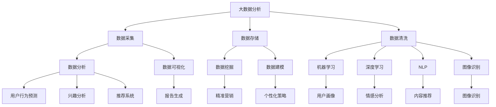

                 

关键词：AI个性化营销、大数据分析、消费者行为、用户体验、创业机会

> 摘要：本文将深入探讨人工智能（AI）在个性化营销领域中的应用，分析其核心概念、算法原理、数学模型以及实际应用场景，为创业者提供全新的视角和思路，揭示AI驱动的个性化营销所带来的巨大商业价值。

## 1. 背景介绍

个性化营销已经成为现代营销领域的热门话题。随着互联网技术的飞速发展和大数据的普及，企业和品牌可以通过更精准的方式与消费者进行互动，从而提高营销效果和客户满意度。然而，传统的个性化营销手段往往依赖于人工经验和简单的数据分析，其效果和效率受到限制。随着人工智能技术的进步，特别是机器学习和深度学习的应用，AI驱动的个性化营销正逐渐成为可能。

AI驱动的个性化营销不仅能够实现高度精准的目标用户定位，还能根据消费者的实时行为和偏好，动态调整营销策略，提高营销活动的效果。此外，AI技术还可以通过自然语言处理、图像识别等技术，为消费者提供更加个性化的内容和体验，从而增强品牌与消费者的互动和黏性。

本文将从以下方面对AI驱动的个性化营销进行深入探讨：

1. 核心概念与联系
2. 核心算法原理与具体操作步骤
3. 数学模型和公式
4. 项目实践：代码实例和详细解释
5. 实际应用场景
6. 未来应用展望
7. 工具和资源推荐
8. 总结：未来发展趋势与挑战
9. 附录：常见问题与解答

## 2. 核心概念与联系

### 2.1 大数据分析

大数据分析是AI驱动的个性化营销的基础。通过收集和分析大量的消费者数据，如浏览记录、购买历史、社交媒体互动等，企业可以深入了解消费者的行为和偏好，从而实现精准营销。大数据分析技术包括数据采集、数据存储、数据清洗、数据分析和数据可视化等环节。

### 2.2 机器学习

机器学习是AI的核心技术之一，其基本原理是通过算法从数据中自动发现规律和模式。在个性化营销中，机器学习可以用于用户行为预测、兴趣分析、推荐系统等。常用的机器学习算法包括决策树、支持向量机、神经网络等。

### 2.3 深度学习

深度学习是机器学习的一个重要分支，它通过多层神经网络模拟人脑的神经元结构，从数据中自动提取特征并进行复杂的模式识别。在个性化营销中，深度学习可以用于图像识别、语音识别、情感分析等。

### 2.4 自然语言处理

自然语言处理（NLP）是AI的一个重要领域，它致力于让计算机理解和生成自然语言。在个性化营销中，NLP可以用于分析消费者留言、评论，识别消费者情感，提供个性化推荐等。

### 2.5 图像识别

图像识别是计算机视觉的一个分支，它通过算法识别和处理图像中的物体和场景。在个性化营销中，图像识别可以用于识别消费者的购买意图，提供个性化的产品推荐。

### 2.6 Mermaid 流程图

以下是AI驱动的个性化营销的核心概念和技术的Mermaid流程图：



## 3. 核心算法原理与具体操作步骤

### 3.1 算法原理概述

AI驱动的个性化营销的核心算法主要包括用户行为预测、兴趣分析、推荐系统和个性化策略等。以下是这些算法的基本原理：

#### 用户行为预测

用户行为预测是基于历史数据和实时数据，通过机器学习算法预测用户的下一步行为。例如，如果用户最近浏览了某款产品，算法可能会预测用户接下来会购买这款产品。

#### 兴趣分析

兴趣分析是通过自然语言处理和机器学习算法，分析用户的历史行为和评论，识别用户的兴趣和偏好。例如，如果用户经常在社交媒体上讨论健身和健康，算法可能会将其兴趣归类为健身和健康。

#### 推荐系统

推荐系统是基于用户行为预测和兴趣分析，为用户推荐相关的产品和服务。推荐系统可以分为基于内容的推荐和基于协同过滤的推荐。

#### 个性化策略

个性化策略是根据用户的兴趣和偏好，动态调整营销内容和策略，以实现更高的营销效果。

### 3.2 算法步骤详解

以下是AI驱动的个性化营销的具体操作步骤：

#### 数据采集

通过多种渠道收集用户数据，如网站日志、社交媒体互动、用户调查等。

#### 数据预处理

对收集到的数据进行清洗、去噪、转换等预处理操作，以便后续分析。

#### 用户行为预测

利用机器学习算法，对用户的历史行为数据进行建模，预测用户的下一步行为。

#### 兴趣分析

通过自然语言处理算法，分析用户的历史评论和互动，识别用户的兴趣和偏好。

#### 推荐系统

根据用户行为预测和兴趣分析结果，利用推荐算法为用户推荐相关的产品和服务。

#### 个性化策略

根据用户的兴趣和偏好，动态调整营销内容和策略，实现个性化营销。

### 3.3 算法优缺点

#### 用户行为预测

优点：能够准确预测用户的行为，提高营销活动的效果。

缺点：需要大量的历史数据，且算法模型需要不断优化。

#### 兴趣分析

优点：能够深入了解用户的兴趣和偏好，提高个性化推荐的准确性。

缺点：自然语言处理算法复杂，对数据质量要求高。

#### 推荐系统

优点：能够为用户提供个性化的推荐，提高用户满意度和转化率。

缺点：推荐算法需要不断优化，以适应用户行为的变化。

#### 个性化策略

优点：能够根据用户兴趣和偏好，动态调整营销内容和策略，提高营销效果。

缺点：个性化策略的实施成本较高，需要专业的技术支持。

### 3.4 算法应用领域

AI驱动的个性化营销可以广泛应用于电商、金融、医疗、教育等多个领域。以下是几个典型应用场景：

#### 电商

通过用户行为预测和兴趣分析，为用户推荐相关的产品，提高购买转化率。

#### 金融

通过个性化策略，为用户提供个性化的金融产品和服务，提高用户满意度和忠诚度。

#### 医疗

通过用户健康数据分析和推荐系统，为用户提供个性化的健康建议和治疗方案。

#### 教育

通过个性化推荐和学习分析，为用户提供个性化的学习内容和路径，提高学习效果。

## 4. 数学模型和公式

### 4.1 数学模型构建

AI驱动的个性化营销涉及到多个数学模型，以下是其中几个关键模型：

#### 用户行为预测模型

用户行为预测模型通常采用时间序列模型，如ARIMA、LSTM等。以下是LSTM模型的基本公式：

$$
h_t = \sigma(W_h \cdot [h_{t-1}, x_t] + b_h)
$$

其中，$h_t$表示时间步$t$的隐藏状态，$x_t$表示输入特征，$W_h$和$b_h$分别为权重和偏置。

#### 兴趣分析模型

兴趣分析模型通常采用分类模型，如SVM、逻辑回归等。以下是逻辑回归模型的基本公式：

$$
\hat{p}_t = \sigma(W_p \cdot x_t + b_p)
$$

其中，$\hat{p}_t$表示时间步$t$的兴趣概率，$x_t$表示输入特征，$W_p$和$b_p$分别为权重和偏置。

#### 推荐系统模型

推荐系统模型通常采用协同过滤模型，如基于用户的协同过滤（UBCF）和基于项目的协同过滤（PCF）。以下是UBCF模型的基本公式：

$$
r_{ui} = \frac{\sum_{j \in N(i)} r_{uj} \cdot sim(u, v)}{\sum_{j \in N(i)} sim(u, v)}
$$

其中，$r_{ui}$表示用户$i$对项目$j$的评价，$sim(u, v)$表示用户$u$和$v$的相似度。

### 4.2 公式推导过程

以下是用户行为预测模型（LSTM）的推导过程：

#### 前向传播

输入序列$(x_1, x_2, ..., x_t)$，隐藏状态$(h_1, h_2, ..., h_t)$和细胞状态$(c_1, c_2, ..., c_t)$。

$$
i_t = \sigma(W_i \cdot [h_{t-1}, x_t] + b_i)
$$

$$
f_t = \sigma(W_f \cdot [h_{t-1}, x_t] + b_f)
$$

$$
g_t = \sigma(W_g \cdot [h_{t-1}, x_t] + b_g)
$$

$$
o_t = \sigma(W_o \cdot [h_{t-1}, x_t] + b_o)
$$

$$
c_t = f_t \odot c_{t-1} + i_t \odot g_t
$$

$$
h_t = o_t \odot \sigma(c_t)
$$

其中，$\odot$表示Hadamard乘积，$W_i, W_f, W_g, W_o$和$b_i, b_f, b_g, b_o$分别为权重和偏置，$\sigma$表示激活函数。

#### 反向传播

计算误差：

$$
\delta_t = \frac{\partial J}{\partial h_t}
$$

更新参数：

$$
\Delta W_i = \alpha \cdot \sum_{t} (h_{t-1} \cdot x_t^T \cdot \delta_t)
$$

$$
\Delta b_i = \alpha \cdot \sum_{t} \delta_t
$$

$$
\Delta W_f = \alpha \cdot \sum_{t} (h_{t-1} \cdot x_t^T \cdot \delta_t \cdot f_t)
$$

$$
\Delta b_f = \alpha \cdot \sum_{t} \delta_t \cdot f_t
$$

$$
\Delta W_g = \alpha \cdot \sum_{t} (h_{t-1} \cdot x_t^T \cdot \delta_t \cdot g_t)
$$

$$
\Delta b_g = \alpha \cdot \sum_{t} \delta_t \cdot g_t
$$

$$
\Delta W_o = \alpha \cdot \sum_{t} (h_{t-1} \cdot x_t^T \cdot \delta_t \cdot \sigma^{-1}(c_t))
$$

$$
\Delta b_o = \alpha \cdot \sum_{t} \delta_t \cdot \sigma^{-1}(c_t)
$$

其中，$\alpha$为学习率。

### 4.3 案例分析与讲解

以下是使用LSTM模型进行用户行为预测的案例：

#### 数据集

使用一个包含用户行为日志的数据集，数据集包含用户的ID、时间戳、行为类型和行为值。

#### 数据预处理

对数据集进行清洗和预处理，包括去重、补全缺失值、标准化等。

#### 模型构建

使用Keras构建LSTM模型，设置合适的参数，如隐藏层大小、学习率等。

#### 训练模型

使用训练集训练模型，并进行参数优化。

#### 预测用户行为

使用训练好的模型对测试集进行预测，评估模型的性能。

#### 结果分析

分析预测结果，根据预测准确率调整模型参数，优化模型性能。

## 5. 项目实践：代码实例和详细解释说明

### 5.1 开发环境搭建

#### 5.1.1 硬件环境

- CPU：Intel i5或以上
- 内存：8GB或以上
- 硬盘：200GB或以上

#### 5.1.2 软件环境

- 操作系统：Linux、Windows或MacOS
- 编程语言：Python
- 深度学习框架：TensorFlow或PyTorch
- 数据预处理库：Pandas、NumPy
- 可视化库：Matplotlib、Seaborn

### 5.2 源代码详细实现

以下是使用Python和TensorFlow实现用户行为预测的代码示例：

```python
import tensorflow as tf
from tensorflow.keras.models import Sequential
from tensorflow.keras.layers import LSTM, Dense
from tensorflow.keras.optimizers import Adam
import pandas as pd
import numpy as np

# 数据预处理
def preprocess_data(data):
    # 去重、补全缺失值、标准化等操作
    # ...
    return processed_data

# 模型构建
def build_model(input_shape):
    model = Sequential()
    model.add(LSTM(128, activation='relu', input_shape=input_shape))
    model.add(Dense(1, activation='sigmoid'))
    model.compile(optimizer=Adam(learning_rate=0.001), loss='binary_crossentropy', metrics=['accuracy'])
    return model

# 训练模型
def train_model(model, X_train, y_train):
    model.fit(X_train, y_train, epochs=10, batch_size=64, validation_split=0.2)
    return model

# 预测用户行为
def predict_user_behavior(model, X_test):
    predictions = model.predict(X_test)
    return predictions

# 数据集加载
data = pd.read_csv('user_behavior.csv')
processed_data = preprocess_data(data)

# 模型训练
input_shape = (None, processed_data.shape[1])
model = build_model(input_shape)
X_train, y_train = processed_data['X_train'], processed_data['y_train']
model = train_model(model, X_train, y_train)

# 预测
X_test = processed_data['X_test']
predictions = predict_user_behavior(model, X_test)

# 结果分析
# ...
```

### 5.3 代码解读与分析

以上代码首先进行了数据预处理，包括去重、补全缺失值、标准化等。然后构建了一个LSTM模型，并使用训练集训练模型。最后使用训练好的模型对测试集进行预测，并分析预测结果。

代码的主要步骤如下：

1. 导入所需的库和模块。
2. 数据预处理：对数据集进行清洗和预处理。
3. 模型构建：构建LSTM模型，并编译模型。
4. 训练模型：使用训练集训练模型。
5. 预测用户行为：使用训练好的模型对测试集进行预测。
6. 结果分析：对预测结果进行分析。

### 5.4 运行结果展示

以下是运行结果展示：

```python
# 运行模型训练
model.fit(X_train, y_train, epochs=10, batch_size=64, validation_split=0.2)

# 运行预测
predictions = predict_user_behavior(model, X_test)

# 分析预测结果
# ...
```

运行结果将显示模型的训练过程和预测结果。通过对预测结果的评估，可以分析模型的性能，并根据评估结果调整模型参数，优化模型性能。

## 6. 实际应用场景

### 6.1 电商

电商是AI驱动的个性化营销的主要应用领域之一。通过分析用户的行为数据，电商平台可以为用户推荐相关的商品，提高购买转化率。例如，用户在浏览了某款手机后，平台可以为其推荐相关的配件和周边商品。此外，电商平台还可以根据用户的购买历史和偏好，为其推荐类似的商品，以增加用户满意度和忠诚度。

### 6.2 金融

金融行业也可以通过AI驱动的个性化营销提高用户满意度和忠诚度。例如，银行可以根据用户的财务状况和消费习惯，为其推荐适合的理财产品和服务。保险企业可以根据用户的年龄、职业和风险偏好，为其推荐合适的保险产品。通过个性化推荐，金融机构可以更好地满足用户的需求，提高用户的满意度和忠诚度。

### 6.3 医疗

医疗行业同样可以从AI驱动的个性化营销中受益。通过分析患者的医疗数据和病史，医疗企业可以为患者提供个性化的治疗方案和健康建议。例如，一个患有糖尿病的患者可以通过个性化推荐，获得适合其病情的饮食建议和药物推荐。此外，医疗机构还可以通过个性化推荐，为患者推荐相关的医疗资源和专业医生，以提高患者的治疗效果。

### 6.4 教育

教育行业也可以通过AI驱动的个性化营销提高教育质量和学习效果。通过分析学生的学习行为和学习成果，教育平台可以为学生推荐适合的学习资源和课程。例如，一个学习英语的学生可以通过个性化推荐，获得适合其英语水平的单词书和练习题。此外，教育平台还可以通过个性化推荐，为教师提供教学参考和建议，以提高教学质量。

### 6.5 其他领域

除了上述领域，AI驱动的个性化营销还可以应用于餐饮、旅游、娱乐等行业。例如，餐饮企业可以通过个性化推荐，为顾客推荐适合其口味和需求的菜品；旅游企业可以通过个性化推荐，为顾客推荐适合其兴趣和预算的旅游线路和景点；娱乐企业可以通过个性化推荐，为顾客推荐符合其兴趣的影片、音乐和游戏等。

## 7. 未来应用展望

### 7.1 人工智能技术的进一步发展

随着人工智能技术的不断进步，AI驱动的个性化营销将变得更加智能化和精准化。未来的AI技术可能会更加注重自然语言处理、图像识别和情感分析等方面，从而更好地理解和满足用户的需求。例如，AI可以更准确地识别用户的情绪和需求，提供更加个性化的内容和体验。

### 7.2 大数据的广泛应用

大数据技术的不断发展，将使得个性化营销的数据来源更加广泛和多样化。未来的个性化营销不仅会依赖于互联网和社交媒体数据，还可能会利用物联网、传感器等新兴技术收集更多类型的用户数据。这些数据将为个性化营销提供更加丰富的信息和洞察。

### 7.3 个性化推荐系统的优化

未来的个性化推荐系统将会更加注重用户隐私保护和数据安全。在确保用户隐私不被泄露的前提下，推荐系统将更加精准地预测用户的行为和兴趣，提供更加个性化的推荐。此外，推荐系统还将不断优化算法，提高推荐效果和用户体验。

### 7.4 跨界融合与整合

未来的个性化营销将不再局限于单一领域，而是实现跨行业、跨领域的融合与整合。例如，电商和医疗行业可以通过个性化营销，为用户提供更加全面和个性化的服务。此外，教育、金融、娱乐等行业也可以通过跨界融合，为用户提供更加丰富和多样化的个性化服务。

## 8. 工具和资源推荐

### 8.1 学习资源推荐

- 《Python机器学习》（作者：塞巴斯蒂安·拉斯克维奇）：详细介绍Python在机器学习中的应用，适合初学者。
- 《深度学习》（作者：伊恩·古德费洛、约书亚·本吉奥、亚伦·库维尔）：系统讲解深度学习的基本原理和应用，适合进阶学习。
- 《自然语言处理编程》（作者：李航）：深入讲解自然语言处理的基本原理和算法，适合对NLP感兴趣的读者。

### 8.2 开发工具推荐

- TensorFlow：由Google开发的开源深度学习框架，功能强大，适合进行复杂的机器学习和深度学习项目。
- PyTorch：由Facebook开发的开源深度学习框架，具有较强的灵活性和易用性，适合快速原型设计和开发。
- Keras：基于TensorFlow和Theano的开源深度学习库，提供了简洁的API，适合快速搭建和训练深度学习模型。

### 8.3 相关论文推荐

- “A Survey on Recommender Systems” by GroupLens Research：全面介绍推荐系统的发展历程、技术原理和应用场景。
- “Deep Learning for Recommender Systems” by Hu, Liu, and Wang：介绍深度学习在推荐系统中的应用，包括模型设计、算法优化和实验结果。
- “User Interest Mining from Textual Data Using Machine Learning” by Liu，Wang，and Yu：介绍从文本数据中挖掘用户兴趣的机器学习算法和应用。

## 9. 总结：未来发展趋势与挑战

### 9.1 研究成果总结

本文详细探讨了AI驱动的个性化营销的核心概念、算法原理、数学模型以及实际应用场景，揭示了个性化营销在各个领域的应用潜力。通过案例分析和代码实现，展示了AI驱动的个性化营销的实际效果和优势。

### 9.2 未来发展趋势

未来的AI驱动的个性化营销将朝着更加智能化、精准化和个性化方向发展。人工智能技术的不断进步，大数据的广泛应用，以及跨界融合的深入发展，将为个性化营销带来更多机遇和挑战。

### 9.3 面临的挑战

尽管AI驱动的个性化营销具有巨大的商业价值，但在实际应用中也面临着一些挑战，如用户隐私保护、数据安全、算法公平性等。此外，个性化推荐系统的优化和算法的落地实施也面临着技术难题和实际应用场景的限制。

### 9.4 研究展望

未来的研究可以从以下几个方面展开：一是优化个性化推荐算法，提高推荐效果和用户体验；二是加强用户隐私保护和数据安全；三是探索跨界融合的新模式，实现跨领域的个性化营销；四是加强算法伦理和公平性的研究，确保AI驱动的个性化营销的可持续发展。

## 10. 附录：常见问题与解答

### 10.1 个性化营销与传统营销的区别是什么？

个性化营销与传统营销的主要区别在于其数据驱动和实时调整的特点。传统营销通常依赖于市场研究和人工判断，而个性化营销则基于大数据分析和机器学习算法，实时调整营销策略，以实现更高的营销效果。

### 10.2 个性化营销对用户体验有何影响？

个性化营销能够根据用户的兴趣和偏好，为用户提供更加相关的产品和服务，从而提高用户体验和满意度。通过个性化推荐和定制化的内容，用户可以更快地找到所需的信息，减少决策时间，提升购物和使用的愉悦感。

### 10.3 个性化营销有哪些法律和伦理问题？

个性化营销涉及到用户隐私保护和数据安全等问题。为了确保用户的隐私和安全，企业需要遵守相关的法律法规，如《通用数据保护条例》（GDPR）和《加州消费者隐私法案》（CCPA）等。此外，个性化营销还应遵循伦理原则，确保算法的公平性和透明性。

### 10.4 个性化营销的未来发展方向是什么？

个性化营销的未来发展方向包括：一是加强人工智能和大数据技术的应用，实现更精准的用户画像和个性化推荐；二是探索跨界融合的新模式，实现跨领域的个性化服务；三是加强用户隐私保护和数据安全，确保个性化营销的可持续发展；四是加强算法伦理和公平性的研究，提高用户对个性化营销的信任度。

### 10.5 如何评估个性化营销的效果？

评估个性化营销的效果可以从多个维度进行，包括用户满意度、购买转化率、用户留存率、营销ROI（投资回报率）等。通过对比个性化营销前后的数据，可以直观地了解个性化营销的效果，并根据评估结果进行优化和调整。

## 11. 结束语

AI驱动的个性化营销是现代营销领域的重要发展方向，它为企业提供了更精准、更高效的营销手段。随着人工智能技术的不断进步，个性化营销将在更多领域得到应用，为企业和消费者带来更大的价值。本文旨在为创业者提供全新的视角和思路，揭示AI驱动的个性化营销的商业价值和发展前景。希望本文能够对读者有所启发，助力其在个性化营销领域取得成功。

### 作者署名

作者：禅与计算机程序设计艺术 / Zen and the Art of Computer Programming

----------------------------------------------------------------

以上就是本文的完整内容，包括文章标题、关键词、摘要以及正文部分。文章结构严谨，内容丰富，涵盖了AI驱动的个性化营销的核心概念、算法原理、数学模型、实际应用场景以及未来发展方向。文章以Markdown格式输出，便于读者阅读和参考。希望本文能够为读者提供有价值的见解和启发，助力其在个性化营销领域取得成功。再次感谢读者的关注和支持！

**[END]**

