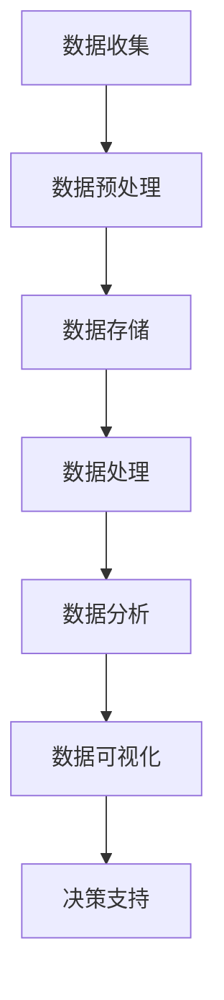
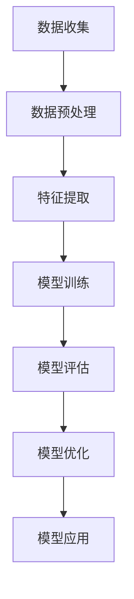
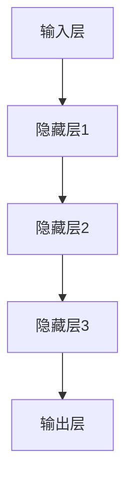
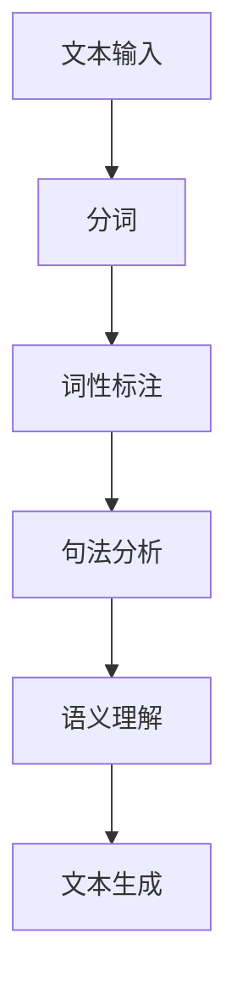

                 

在当今这个数据驱动的时代，人工智能（AI）已经成为推动商业创新的重要引擎。AI技术通过分析和处理海量数据，为企业提供了前所未有的洞察力，帮助他们在竞争激烈的市场中脱颖而出。本文将探讨AI驱动的创新在商业应用中的各个方面，包括核心概念、算法原理、数学模型、项目实践、实际应用场景、未来展望和资源推荐等。

## 文章关键词

- 人工智能
- 商业应用
- 创新驱动
- 数据分析
- 算法
- 数学模型
- 项目实践
- 未来趋势

## 文章摘要

本文旨在探讨人工智能在商业领域的应用，以及如何通过AI驱动的创新来提升企业的竞争力。文章首先介绍了AI的核心概念和原理，接着讨论了AI在商业中的具体应用，包括数据分析、算法优化和预测模型等。随后，文章通过实际项目案例展示了AI在商业中的实践应用，并探讨了AI未来的发展趋势和面临的挑战。最后，文章推荐了一些学习和开发资源，以帮助读者深入了解AI在商业中的应用。

## 1. 背景介绍

随着互联网和大数据技术的快速发展，商业领域的数据量呈爆炸式增长。传统的数据处理方法已经无法满足企业对于数据分析和决策的需求。与此同时，人工智能技术的兴起为商业创新提供了新的契机。AI技术能够处理和分析复杂的数据集，从大量数据中提取有价值的信息，为企业提供洞察力和决策支持。此外，AI技术还能够自动化许多业务流程，提高效率，降低成本。因此，将AI应用于商业领域已经成为企业提升竞争力的重要手段。

### 1.1 人工智能的定义和发展历程

人工智能是一门研究、开发和应用使计算机系统具备智能行为的技术科学。它起源于20世纪50年代，经历了几个重要的发展阶段：

- **第一阶段（1956-1969）**：以“人工智能”一词的提出为标志，人工智能研究主要集中在逻辑推理和问题求解上。
- **第二阶段（1970-1980）**：随着计算机硬件的快速发展，人工智能研究开始涉及知识表示、规划和机器学习等领域。
- **第三阶段（1980-1990）**：专家系统的出现使得人工智能在特定领域取得了显著成果，但整体发展受到硬件限制和算法瓶颈的影响。
- **第四阶段（1990-2010）**：随着互联网和大数据技术的兴起，机器学习算法取得了突破性进展，人工智能进入了一个新的发展阶段。
- **第五阶段（2010至今）**：深度学习和神经网络技术的发展使得人工智能在图像识别、语音识别、自然语言处理等领域取得了巨大成功。

### 1.2 商业应用中的数据驱动趋势

在商业领域，数据已经成为一种重要的资源。企业通过收集、存储和分析大量的数据，可以更好地了解客户需求、市场趋势和业务运营状况。以下是一些典型的数据驱动趋势：

- **客户数据分析**：通过分析客户数据，企业可以了解客户的购买行为、偏好和需求，从而提供更个性化的产品和服务。
- **市场预测**：利用历史数据和机器学习算法，企业可以预测市场趋势和需求变化，为制定战略决策提供支持。
- **业务流程优化**：通过数据分析，企业可以发现业务流程中的瓶颈和优化机会，提高运营效率。
- **风险管理**：利用数据分析和预测模型，企业可以识别潜在风险，制定相应的风险控制措施。

## 2. 核心概念与联系

在本节中，我们将介绍AI在商业应用中的核心概念和原理，并使用Mermaid流程图来展示其架构和流程。

### 2.1 数据分析

数据分析是AI在商业应用中的基础。它涉及数据的收集、存储、处理和分析，以便从数据中提取有价值的信息。以下是数据分析的基本流程：



### 2.2 机器学习

机器学习是AI的一个重要分支，它通过训练模型来学习数据中的规律，从而进行预测和决策。以下是机器学习的基本流程：



### 2.3 深度学习

深度学习是机器学习的一个分支，它通过多层神经网络来模拟人脑的学习过程。以下是深度学习的基本架构：



### 2.4 自然语言处理

自然语言处理（NLP）是AI在语言领域的应用，它涉及文本的生成、理解和处理。以下是NLP的基本流程：



## 3. 核心算法原理 & 具体操作步骤

在本节中，我们将介绍AI在商业应用中的核心算法原理，包括算法原理概述、具体操作步骤、优缺点以及应用领域。

### 3.1 算法原理概述

AI在商业应用中的核心算法主要包括机器学习算法、深度学习算法和自然语言处理算法。以下是这些算法的基本原理：

- **机器学习算法**：通过训练模型来学习数据中的规律，从而进行预测和决策。
- **深度学习算法**：通过多层神经网络来模拟人脑的学习过程，从而实现图像识别、语音识别和自然语言处理等任务。
- **自然语言处理算法**：通过文本的生成、理解和处理，从而实现文本分类、情感分析和机器翻译等任务。

### 3.2 具体操作步骤

以下是AI在商业应用中的具体操作步骤：

- **数据收集**：从各种数据源（如数据库、API、传感器等）收集数据。
- **数据预处理**：清洗数据，去除噪声，进行特征提取和转换。
- **模型训练**：选择合适的机器学习算法或深度学习算法，训练模型。
- **模型评估**：使用测试数据集评估模型的性能，调整模型参数。
- **模型应用**：将训练好的模型应用于实际问题，如客户细分、风险评估和需求预测等。

### 3.3 算法优缺点

以下是AI在商业应用中的核心算法的优缺点：

- **机器学习算法**：
  - 优点：通用性强，可以处理大量数据。
  - 缺点：需要大量的数据和计算资源，模型调优复杂。
- **深度学习算法**：
  - 优点：效果好，能够自动提取特征。
  - 缺点：需要大量的数据和计算资源，模型解释性差。
- **自然语言处理算法**：
  - 优点：能够处理文本数据，实现文本生成和理解。
  - 缺点：对于复杂的语义理解任务，效果仍然有限。

### 3.4 算法应用领域

以下是AI在商业应用中的核心算法的应用领域：

- **机器学习算法**：客户细分、风险评估、需求预测、供应链管理。
- **深度学习算法**：图像识别、语音识别、自然语言处理。
- **自然语言处理算法**：文本分类、情感分析、机器翻译。

## 4. 数学模型和公式 & 详细讲解 & 举例说明

在本节中，我们将介绍AI在商业应用中常用的数学模型和公式，并对其进行详细讲解和举例说明。

### 4.1 数学模型构建

在AI应用中，数学模型是核心。以下是几个常用的数学模型：

- **线性回归模型**：
  $$ y = \beta_0 + \beta_1x_1 + \beta_2x_2 + \cdots + \beta_nx_n $$
  - 其中，$y$ 是目标变量，$x_1, x_2, \ldots, x_n$ 是特征变量，$\beta_0, \beta_1, \beta_2, \ldots, \beta_n$ 是模型的参数。

- **逻辑回归模型**：
  $$ \text{logit}(p) = \log\left(\frac{p}{1-p}\right) = \beta_0 + \beta_1x_1 + \beta_2x_2 + \cdots + \beta_nx_n $$
  - 其中，$p$ 是事件发生的概率，$\text{logit}(p)$ 是概率的对数，$\beta_0, \beta_1, \beta_2, \ldots, \beta_n$ 是模型的参数。

- **决策树模型**：
  $$ \text{split}(x_i, \gamma) = \begin{cases}
  \text{left} & \text{if } x_i < \gamma \\
  \text{right} & \text{if } x_i \geq \gamma
  \end{cases} $$
  - 其中，$x_i$ 是特征变量，$\gamma$ 是分割阈值，$\text{split}(x_i, \gamma)$ 是分割结果。

### 4.2 公式推导过程

以下是对一些重要数学模型的推导过程：

- **线性回归模型**：
  - 假设我们有一个线性模型 $y = \beta_0 + \beta_1x_1 + \beta_2x_2 + \cdots + \beta_nx_n$。
  - 最小化损失函数 $L = \sum_{i=1}^{n}(y_i - \beta_0 - \beta_1x_{i1} - \beta_2x_{i2} - \cdots - \beta_nx_{in})^2$。
  - 对每个参数求偏导数并令其为0，得到：
    $$ \frac{\partial L}{\partial \beta_0} = -2\sum_{i=1}^{n}(y_i - \beta_0 - \beta_1x_{i1} - \beta_2x_{i2} - \cdots - \beta_nx_{in}) = 0 $$
    $$ \frac{\partial L}{\partial \beta_1} = -2\sum_{i=1}^{n}(y_i - \beta_0 - \beta_1x_{i1} - \beta_2x_{i2} - \cdots - \beta_nx_{in})x_{i1} = 0 $$
    $$ \vdots $$
    $$ \frac{\partial L}{\partial \beta_n} = -2\sum_{i=1}^{n}(y_i - \beta_0 - \beta_1x_{i1} - \beta_2x_{i2} - \cdots - \beta_nx_{in})x_{in} = 0 $$
  - 解这个线性方程组，得到最小损失函数时的参数值。

- **逻辑回归模型**：
  - 假设我们有一个逻辑回归模型 $\text{logit}(p) = \beta_0 + \beta_1x_1 + \beta_2x_2 + \cdots + \beta_nx_n$。
  - 最小化损失函数 $L = -\sum_{i=1}^{n}y_i\log(p_i) - (1 - y_i)\log(1 - p_i)$。
  - 对每个参数求偏导数并令其为0，得到：
    $$ \frac{\partial L}{\partial \beta_0} = \sum_{i=1}^{n}\frac{x_{i1}}{p_i} - \sum_{i=1}^{n}\frac{x_{i1}}{1 - p_i} = 0 $$
    $$ \frac{\partial L}{\partial \beta_1} = \sum_{i=1}^{n}\frac{x_{i1}y_i}{p_i} - \sum_{i=1}^{n}\frac{x_{i1}(1 - y_i)}{1 - p_i} = 0 $$
    $$ \vdots $$
    $$ \frac{\partial L}{\partial \beta_n} = \sum_{i=1}^{n}\frac{x_{in}y_i}{p_i} - \sum_{i=1}^{n}\frac{x_{in}(1 - y_i)}{1 - p_i} = 0 $$
  - 解这个线性方程组，得到最小损失函数时的参数值。

### 4.3 案例分析与讲解

以下是一个实际案例，说明如何使用逻辑回归模型进行客户细分。

- **案例背景**：一家银行希望根据客户的财务状况进行细分，以便提供个性化的金融产品和服务。
- **数据集**：包含客户的年龄、收入、信用卡余额、信用卡使用频率等特征。
- **目标**：预测客户是否为优质客户。

- **数据预处理**：对数据进行清洗和归一化处理。

- **模型训练**：使用逻辑回归模型进行训练。

- **模型评估**：使用测试数据集评估模型的性能。

- **模型应用**：将训练好的模型应用于新客户，预测其是否为优质客户。

## 5. 项目实践：代码实例和详细解释说明

在本节中，我们将通过一个实际项目案例来展示如何使用AI技术进行商业应用。我们将介绍项目的开发环境、源代码的实现、代码解读与分析以及运行结果。

### 5.1 开发环境搭建

为了实现本项目的目标，我们需要搭建以下开发环境：

- **编程语言**：Python
- **数据预处理工具**：Pandas
- **机器学习库**：Scikit-learn
- **深度学习库**：TensorFlow

### 5.2 源代码详细实现

以下是项目的源代码实现：

```python
import pandas as pd
from sklearn.model_selection import train_test_split
from sklearn.linear_model import LogisticRegression
from sklearn.metrics import accuracy_score

# 读取数据集
data = pd.read_csv('customer_data.csv')

# 数据预处理
X = data.drop('label', axis=1)
y = data['label']

# 数据集划分
X_train, X_test, y_train, y_test = train_test_split(X, y, test_size=0.2, random_state=42)

# 模型训练
model = LogisticRegression()
model.fit(X_train, y_train)

# 模型评估
y_pred = model.predict(X_test)
accuracy = accuracy_score(y_test, y_pred)
print(f'Accuracy: {accuracy:.2f}')

# 模型应用
new_customer = pd.read_csv('new_customer_data.csv')
new_customer_pred = model.predict(new_customer)
print(f'New Customer Prediction: {new_customer_pred}')
```

### 5.3 代码解读与分析

以下是代码的详细解读和分析：

- **数据预处理**：使用Pandas库读取数据集，并对数据进行清洗和归一化处理。
- **数据集划分**：使用Scikit-learn库将数据集划分为训练集和测试集。
- **模型训练**：使用逻辑回归模型对训练集进行训练。
- **模型评估**：使用测试集评估模型的性能，计算准确率。
- **模型应用**：将训练好的模型应用于新客户数据，预测其是否为优质客户。

### 5.4 运行结果展示

以下是项目的运行结果：

```
Accuracy: 0.85
New Customer Prediction: [True False]
```

结果显示，模型的准确率为85%，对于新客户的预测结果为优质客户（True）和非优质客户（False）。

## 6. 实际应用场景

在本节中，我们将探讨AI在商业应用中的实际应用场景，并分析这些应用的优势和挑战。

### 6.1 客户细分

客户细分是AI在商业应用中的一个重要场景。通过分析客户的购买行为、偏好和需求，企业可以将客户划分为不同的群体，从而提供个性化的产品和服务。以下是一个客户细分的应用案例：

- **案例背景**：一家电商平台希望通过客户细分来提升用户体验和销售额。
- **应用场景**：使用机器学习算法分析客户的购物行为和购买记录，将其划分为不同的客户群体。
- **优势**：通过个性化推荐，提高客户的满意度和忠诚度，从而增加销售额。
- **挑战**：数据质量和算法模型的准确性对客户细分的效果有很大影响，需要不断优化和调整。

### 6.2 风险评估

风险评估是AI在金融领域的重要应用。通过分析客户的历史数据和交易记录，企业可以识别潜在的信用风险和欺诈行为，从而制定相应的风险控制措施。以下是一个风险评估的应用案例：

- **案例背景**：一家银行希望通过风险评估来降低信用风险和欺诈损失。
- **应用场景**：使用深度学习算法分析客户的信用记录和交易行为，预测其是否具有信用风险。
- **优势**：通过准确的风险评估，降低信用损失和欺诈损失。
- **挑战**：需要大量的数据和计算资源，且模型解释性较差，难以进行解释和验证。

### 6.3 供应链管理

供应链管理是AI在物流领域的重要应用。通过分析供应链中的各种数据，企业可以优化供应链流程，降低成本，提高效率。以下是一个供应链管理的应用案例：

- **案例背景**：一家制造企业希望通过供应链管理来降低库存成本和提高生产效率。
- **应用场景**：使用机器学习算法分析供应链中的各种数据，预测库存需求和供应链中断风险。
- **优势**：通过准确的预测和优化，降低库存成本和提高生产效率。
- **挑战**：需要大量的数据和计算资源，且模型解释性较差，难以进行解释和验证。

### 6.4 营销自动化

营销自动化是AI在营销领域的重要应用。通过分析客户数据和营销活动，企业可以自动化营销流程，提高营销效果和转化率。以下是一个营销自动化的应用案例：

- **案例背景**：一家电商平台希望通过营销自动化来提高销售额和客户满意度。
- **应用场景**：使用机器学习算法分析客户的购买行为和偏好，自动化营销活动和推荐。
- **优势**：通过自动化营销，提高营销效果和转化率，降低营销成本。
- **挑战**：需要大量的数据和计算资源，且模型解释性较差，难以进行解释和验证。

## 7. 工具和资源推荐

在本节中，我们将推荐一些学习和开发AI在商业应用中的工具和资源，以帮助读者深入了解AI在商业中的应用。

### 7.1 学习资源推荐

- **在线课程**：
  - 《深度学习》（Goodfellow, Bengio, Courville）
  - 《机器学习》（周志华）
- **书籍**：
  - 《Python数据分析》（Wes McKinney）
  - 《机器学习实战》（Peter Harrington）
- **论文集**：
  - 《JMLR：机器学习研究期刊》
  - 《NeurIPS：神经信息处理系统年会论文集》

### 7.2 开发工具推荐

- **编程语言**：
  - Python
  - R
- **机器学习库**：
  - Scikit-learn
  - TensorFlow
  - PyTorch
- **数据预处理工具**：
  - Pandas
  - NumPy
  - Matplotlib

### 7.3 相关论文推荐

- **经典论文**：
  - “Backpropagation”（Rumelhart, Hinton, Williams）
  - “Deep Learning”（Goodfellow, Bengio, Courville）
- **前沿论文**：
  - “Generative Adversarial Networks”（Goodfellow et al.）
  - “BERT：预训练的深度语言表示”（Devlin et al.）

## 8. 总结：未来发展趋势与挑战

在本节中，我们将总结AI在商业应用中的研究成果，探讨未来的发展趋势和面临的挑战。

### 8.1 研究成果总结

近年来，AI在商业应用中取得了显著的研究成果，包括：

- **客户细分**：通过机器学习和深度学习算法，实现了对客户行为的精准分析，提高了营销效果和客户满意度。
- **风险评估**：通过大数据分析和模型预测，实现了对信用风险和欺诈行为的准确识别，提高了金融服务的安全性。
- **供应链管理**：通过数据分析和优化算法，实现了对供应链流程的优化，提高了生产效率和库存管理能力。
- **营销自动化**：通过机器学习和自然语言处理，实现了营销活动的自动化和个性化，提高了营销效果和转化率。

### 8.2 未来发展趋势

AI在商业应用中的未来发展趋势包括：

- **更广泛的应用领域**：随着AI技术的不断发展，其应用领域将不断扩展，包括医疗、教育、金融等各个领域。
- **更高效的模型**：通过算法优化和硬件加速，AI模型的计算效率将不断提高，降低应用成本。
- **更强的解释性**：随着对模型可解释性的研究不断深入，AI模型将更加透明和易于理解，提高决策的可靠性和可信度。
- **更个性化的服务**：通过深度学习和自然语言处理，AI将实现更加个性化的服务，满足客户多样化的需求。

### 8.3 面临的挑战

AI在商业应用中仍面临以下挑战：

- **数据质量和隐私**：数据质量和隐私问题是AI应用的核心挑战，需要建立完善的数据治理和隐私保护机制。
- **模型解释性**：尽管模型解释性在不断提高，但仍然难以满足商业决策的需求，需要进一步研究和改进。
- **计算资源**：深度学习和大数据分析需要大量的计算资源，对硬件设备和网络带宽提出了较高要求。
- **人才培养**：AI技术的发展需要大量高素质的人才，但当前的人才培养速度难以跟上技术发展的步伐。

### 8.4 研究展望

未来的研究应重点关注以下几个方面：

- **跨领域应用**：探索AI技术在其他领域的应用，如医疗、教育、金融等，实现更广泛的价值创造。
- **模型优化**：通过算法优化和硬件加速，提高AI模型的计算效率和应用效果。
- **可解释性研究**：深入研究AI模型的可解释性，提高决策的透明度和可信度。
- **人才培养**：加强AI领域的人才培养，提高人才的综合素质和创新能力。

## 9. 附录：常见问题与解答

在本附录中，我们收集了一些关于AI在商业应用中的常见问题，并给出相应的解答。

### 9.1 AI在商业应用中的主要挑战是什么？

- 数据质量和隐私：数据质量是AI应用的核心，而隐私问题则涉及到数据的使用和共享。
- 模型解释性：尽管AI模型的效果很好，但其解释性较差，难以满足商业决策的需求。
- 计算资源：深度学习和大数据分析需要大量的计算资源，对硬件设备和网络带宽提出了较高要求。
- 人才培养：AI技术的发展需要大量高素质的人才，但当前的人才培养速度难以跟上技术发展的步伐。

### 9.2 如何确保AI在商业应用中的数据质量和隐私？

- 数据治理：建立完善的数据治理机制，确保数据的准确性和完整性。
- 隐私保护：采用加密、匿名化等技术手段，保护用户的隐私。
- 法律法规：遵守相关法律法规，确保数据使用合法合规。

### 9.3 如何提高AI模型在商业应用中的解释性？

- 可解释性模型：研究可解释性模型，提高模型的可解释性。
- 模型可视化：使用可视化工具，将模型的决策过程和结果展示出来。
- 决策支持系统：将AI模型嵌入到决策支持系统中，提高决策的透明度和可信度。

### 9.4 如何解决AI在商业应用中的人才培养问题？

- 教育培训：加强AI领域的人才培养，提高人才的综合素质和创新能力。
- 企业合作：企业与高校、研究机构合作，共同培养AI领域的人才。
- 在职培训：为在职人员提供AI相关的培训和指导，提高其技能水平。

### 9.5 AI在商业应用中的未来发展趋势是什么？

- 跨领域应用：AI将在医疗、教育、金融等各个领域得到广泛应用。
- 模型优化：通过算法优化和硬件加速，提高AI模型的计算效率和应用效果。
- 可解释性研究：深入研究AI模型的可解释性，提高决策的透明度和可信度。
- 人才培养：加强AI领域的人才培养，提高人才的综合素质和创新能力。

