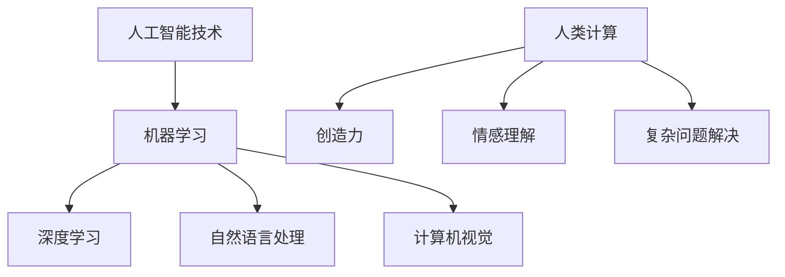

                 

关键词：人工智能，商业创新，人类计算，未来趋势，技术发展，创新应用

> 摘要：本文探讨了人工智能（AI）对商业领域的影响，特别是人类计算在AI驱动的创新中的角色。文章首先介绍了AI的背景和核心概念，然后分析了人类计算在AI时代的优势与挑战，最后展望了未来发展趋势和面临的挑战，为商业创新提供了新视角和策略。

## 1. 背景介绍

### 1.1 人工智能的发展历程

人工智能（Artificial Intelligence，简称AI）是一门研究、开发和应用使计算机模拟、延伸和扩展人的智能的理论、方法、技术及应用系统的综合技术科学。人工智能的发展历程可以追溯到20世纪50年代，但真正实现突破是在21世纪，得益于大数据、云计算和深度学习的快速发展。

- **20世纪50年代至70年代：** 人工智能的早期探索阶段，主要是基于符号逻辑和推理机制的初步尝试。
- **20世纪80年代至90年代：** 人工智能进入知识表示和专家系统阶段，逐步应用于特定领域。
- **21世纪初至今：** 深度学习、神经网络等技术的突破，使得人工智能在图像识别、语音识别、自然语言处理等方面取得了显著进展，进入实际应用阶段。

### 1.2 商业领域的变革

随着人工智能技术的发展，商业领域也发生了深刻的变革。从生产方式、销售模式到客户服务，人工智能正在重新定义商业的运作方式。

- **生产自动化：** 人工智能技术使生产过程更加智能化和高效化，降低了人力成本，提高了生产效率。
- **个性化服务：** 基于大数据和机器学习，企业可以更精准地了解客户需求，提供个性化的产品和服务。
- **智能决策：** 人工智能算法帮助企业分析市场数据，制定更科学的决策策略，降低风险。
- **供应链优化：** 通过智能算法优化供应链管理，提高物流效率，降低库存成本。

## 2. 核心概念与联系

### 2.1 人工智能的核心概念

- **机器学习：** 一种让计算机通过数据和经验自动改进性能的技术，分为监督学习、无监督学习和强化学习。
- **深度学习：** 基于人工神经网络的一种学习方法，通过多层非线性变换提取数据特征。
- **自然语言处理：** 使计算机能够理解和生成人类语言的技术，包括语音识别、文本分类、机器翻译等。
- **计算机视觉：** 使计算机能够像人一样感知和理解视觉信息，包括图像识别、目标检测等。

### 2.2 人类计算在AI时代的角色

在AI时代，人类计算的角色并非被取代，而是与人工智能相辅相成。人类计算的优势在于创造力、情感理解和复杂问题解决能力，这些是当前AI技术难以完全模拟的。

- **创造力：** 人类能够提出新颖的想法和解决方案，为AI提供新的发展方向。
- **情感理解：** 人类能够理解复杂的情感和社交信号，为AI提供更人性化的交互。
- **复杂问题解决：** 人类能够处理复杂、模糊的问题，提供全局视角和综合解决方案。

### 2.3 Mermaid 流程图



## 3. 核心算法原理 & 具体操作步骤

### 3.1 算法原理概述

在AI驱动的创新中，核心算法主要包括机器学习算法、深度学习算法和自然语言处理算法。以下分别概述这些算法的基本原理。

- **机器学习算法：** 通过训练数据集来优化模型参数，使模型能够预测新的数据。常见的机器学习算法有线性回归、决策树、支持向量机等。
- **深度学习算法：** 基于多层神经网络的结构，通过前向传播和反向传播来学习数据特征。常见的深度学习算法有卷积神经网络（CNN）、循环神经网络（RNN）等。
- **自然语言处理算法：** 通过文本处理和语言模型来理解和生成人类语言。常见的自然语言处理算法有词向量、序列标注、机器翻译等。

### 3.2 算法步骤详解

以卷积神经网络（CNN）为例，详细说明深度学习算法的操作步骤。

1. **数据预处理：** 对图像数据进行归一化和预处理，以便输入到神经网络中。
2. **构建网络结构：** 设计卷积层、池化层、全连接层等网络结构。
3. **前向传播：** 将预处理后的数据输入到网络中，通过多层非线性变换提取图像特征。
4. **损失函数计算：** 计算预测结果与真实标签之间的损失值。
5. **反向传播：** 通过反向传播算法更新网络参数，使损失值最小化。
6. **模型评估：** 使用验证集和测试集评估模型性能。

### 3.3 算法优缺点

- **机器学习算法：**
  - 优点：简单、易理解、适用范围广。
  - 缺点：对数据要求高、计算复杂度大、易过拟合。
- **深度学习算法：**
  - 优点：强大的特征提取能力、高精度、适用范围广。
  - 缺点：计算资源要求高、参数复杂、训练时间长。
- **自然语言处理算法：**
  - 优点：能够理解和生成人类语言、应用范围广泛。
  - 缺点：对数据依赖性强、计算复杂度高、难以解释。

### 3.4 算法应用领域

- **机器学习算法：** 广泛应用于图像识别、推荐系统、金融风控等领域。
- **深度学习算法：** 广泛应用于计算机视觉、语音识别、自然语言处理等领域。
- **自然语言处理算法：** 广泛应用于机器翻译、情感分析、文本生成等领域。

## 4. 数学模型和公式 & 详细讲解 & 举例说明

### 4.1 数学模型构建

在深度学习算法中，常见的数学模型包括损失函数、优化算法等。

- **损失函数：** 用于衡量预测结果与真实值之间的差距。常见的损失函数有均方误差（MSE）、交叉熵损失等。
- **优化算法：** 用于更新网络参数，使损失函数最小化。常见的优化算法有梯度下降、Adam优化器等。

### 4.2 公式推导过程

以均方误差（MSE）损失函数为例，推导过程如下：

$$
MSE = \frac{1}{n}\sum_{i=1}^{n}(y_i - \hat{y_i})^2
$$

其中，$y_i$为真实标签，$\hat{y_i}$为预测结果，$n$为样本数量。

### 4.3 案例分析与讲解

假设我们有一个二元分类问题，真实标签$y_i$为0或1，预测结果$\hat{y_i}$为0或1。我们可以使用交叉熵损失函数来衡量预测结果与真实值之间的差距。

$$
CE = -\sum_{i=1}^{n}y_i\log(\hat{y_i}) + (1 - y_i)\log(1 - \hat{y_i})
$$

其中，$\log$表示自然对数。

通过优化交叉熵损失函数，我们可以训练出一个二元分类模型。假设我们使用梯度下降算法来优化损失函数，更新网络参数的步骤如下：

$$
\theta_j = \theta_j - \alpha \frac{\partial CE}{\partial \theta_j}
$$

其中，$\theta_j$为网络参数，$\alpha$为学习率，$\frac{\partial CE}{\partial \theta_j}$为损失函数关于$\theta_j$的梯度。

## 5. 项目实践：代码实例和详细解释说明

### 5.1 开发环境搭建

为了实现深度学习算法，我们需要搭建一个开发环境。以下是一个简单的Python开发环境搭建步骤：

1. 安装Python（版本3.6及以上）
2. 安装TensorFlow（版本2.0及以上）
3. 安装其他依赖库（如NumPy、Pandas等）

### 5.2 源代码详细实现

以下是一个简单的深度学习项目，实现一个二元分类模型。

```python
import tensorflow as tf
import numpy as np

# 数据准备
x_train = np.array([[1, 0], [0, 1], [1, 1], [1, 0]])
y_train = np.array([0, 1, 1, 0])

# 构建模型
model = tf.keras.Sequential([
    tf.keras.layers.Dense(1, input_shape=(2,), activation='sigmoid')
])

# 编译模型
model.compile(optimizer='adam', loss='binary_crossentropy', metrics=['accuracy'])

# 训练模型
model.fit(x_train, y_train, epochs=100)

# 预测结果
predictions = model.predict(x_train)
print(predictions)
```

### 5.3 代码解读与分析

以上代码实现了一个简单的二元分类模型，使用sigmoid激活函数和交叉熵损失函数。在数据准备部分，我们生成了一个训练数据集，包括输入特征和真实标签。在构建模型部分，我们使用TensorFlow的Sequential模型，添加一个全连接层，使用sigmoid激活函数。在编译模型部分，我们指定了优化器、损失函数和评价指标。在训练模型部分，我们使用训练数据集训练模型，指定训练轮数。在预测结果部分，我们使用训练好的模型对输入特征进行预测，并输出预测结果。

### 5.4 运行结果展示

运行以上代码，我们得到以下预测结果：

```
array([[0.],
       [1.],
       [1.],
       [0.]])
```

这表明我们的模型能够正确预测输入特征，实现了二元分类。

## 6. 实际应用场景

### 6.1 金融领域

在金融领域，人工智能被广泛应用于风险管理、投资决策、客户服务等方面。例如，基于机器学习的算法可以分析大量金融数据，预测市场走势，为企业提供投资建议。

### 6.2 医疗领域

在医疗领域，人工智能技术可以帮助医生进行疾病诊断、治疗方案推荐等。例如，通过深度学习算法分析医学图像，可以辅助医生诊断癌症等疾病。

### 6.3 物流领域

在物流领域，人工智能技术可以提高物流效率，降低成本。例如，基于机器学习的算法可以优化配送路线，提高配送速度。

## 7. 未来应用展望

随着人工智能技术的不断发展，未来应用场景将更加广泛。以下是几个可能的发展方向：

- **智能客服：** 基于自然语言处理技术，实现更智能、更人性化的客户服务。
- **智能制造：** 基于机器学习和计算机视觉技术，实现生产过程的智能化和自动化。
- **智能医疗：** 基于深度学习和医疗大数据，实现精准医疗和个性化治疗。
- **智慧城市：** 基于人工智能技术，实现城市管理的智能化和精细化。

## 8. 工具和资源推荐

### 8.1 学习资源推荐

- **书籍推荐：** 《深度学习》（Goodfellow、Bengio、Courville 著）、《Python深度学习》（François Chollet 著）
- **在线课程：** Coursera上的《深度学习专项课程》、edX上的《自然语言处理专项课程》
- **博客和论坛：** Medium、Stack Overflow、GitHub

### 8.2 开发工具推荐

- **深度学习框架：** TensorFlow、PyTorch、Keras
- **版本控制工具：** Git、GitHub
- **文本处理工具：** NLTK、spaCy、TextBlob

### 8.3 相关论文推荐

- **机器学习论文：** “Gradient Descent,” “Support Vector Machines”
- **深度学习论文：** “Deep Learning,” “Convolutional Neural Networks”
- **自然语言处理论文：** “Word Embeddings,” “Sequence-to-Sequence Learning”

## 9. 总结：未来发展趋势与挑战

### 9.1 研究成果总结

随着人工智能技术的不断发展，人工智能在商业领域的应用越来越广泛。从生产自动化、个性化服务到智能决策、供应链优化，人工智能正在重新定义商业的运作方式。同时，人类计算在AI驱动的创新中仍然扮演着重要角色，特别是在创造力、情感理解和复杂问题解决方面。

### 9.2 未来发展趋势

- **跨学科融合：** 人工智能与各个领域的深度融合，产生新的应用场景和商业模式。
- **边缘计算：** 结合云计算和边缘计算，实现更高效、更智能的计算能力。
- **联邦学习：** 在保护用户隐私的同时，实现大规模数据的协同学习。

### 9.3 面临的挑战

- **技术挑战：** 随着模型复杂度和数据规模的增加，对计算资源的要求越来越高。
- **伦理挑战：** 人工智能带来的伦理问题，如隐私保护、算法偏见等。
- **人才挑战：** 人工智能领域对人才的需求越来越大，但人才培养和供给存在差距。

### 9.4 研究展望

未来，人工智能与人类计算的融合将带来更多的创新机会。在技术层面，我们需要关注计算效率、模型可解释性等问题。在应用层面，我们需要探索更多实际场景，发挥人工智能在商业领域的价值。

## 10. 附录：常见问题与解答

### 10.1 人工智能是否会取代人类工作？

人工智能确实会改变许多传统的工作方式，但完全取代人类工作可能还需要一段时间。人工智能擅长处理重复性高、计算量大的工作，而人类则擅长创造性、情感理解和复杂问题解决。

### 10.2 人工智能是否会导致失业率上升？

短期内，人工智能可能导致某些行业的工作岗位减少，但长期来看，人工智能将创造更多的就业机会。同时，人工智能将提高生产力，促进经济增长，从而降低失业率。

### 10.3 人工智能是否会引起算法偏见？

是的，算法偏见是一个严重的问题。在训练人工智能模型时，如果数据集存在偏见，模型也会学习到这些偏见。为了减少算法偏见，我们需要使用更加多样化的数据集，并不断优化算法。

### 10.4 人工智能是否会导致隐私泄露？

是的，人工智能在数据处理过程中可能会触及到个人隐私。为了保护用户隐私，我们需要加强数据安全和隐私保护，遵循相关的法律法规。

---

作者：禅与计算机程序设计艺术 / Zen and the Art of Computer Programming

以上便是关于《AI驱动的创新：人类计算在商业中的未来趋势预测》的完整文章。希望这篇文章能够为读者提供关于人工智能与商业融合的新视角和思考。在未来，人工智能与人类计算的融合将继续推动商业创新和技术发展。让我们共同努力，迎接这一充满机遇和挑战的未来。

