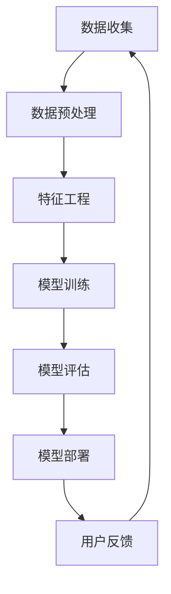

                 

关键词：人工智能、商业应用、创新、人类计算、算法

摘要：本文将探讨人工智能在商业中的应用及其带来的创新潜力。通过分析人类计算与人工智能的相互作用，我们将揭示人工智能如何提升商业效率、优化决策过程，并推动企业创新。文章还将探讨未来人工智能在商业领域的发展趋势和面临的挑战。

## 1. 背景介绍

在过去的几十年里，人工智能（AI）技术经历了飞速发展，从最初的专家系统到如今的深度学习和自然语言处理，AI的应用范围不断扩大，渗透到各行各业。随着计算能力的提升和大数据的积累，人工智能在商业领域的应用逐渐成熟，为企业的创新和增长提供了新的动力。

商业领域对人工智能的需求主要来自于以下几个方面：

1. **数据驱动决策**：企业需要处理大量的数据，从这些数据中提取有价值的信息以支持决策。
2. **自动化和效率提升**：通过自动化流程，企业可以减少人力成本，提高生产效率。
3. **个性化体验**：企业需要为消费者提供个性化的服务和产品推荐，以提高客户满意度和忠诚度。
4. **风险管理和预测**：人工智能可以帮助企业预测市场趋势，防范潜在风险。

## 2. 核心概念与联系

### 2.1 人工智能在商业中的应用

人工智能在商业中的应用可以分为几个主要方面：

1. **自动化流程**：通过机器学习算法自动化重复性任务，如数据录入、客户服务、库存管理等。
2. **智能分析**：使用数据挖掘和机器学习算法分析海量数据，提取有价值的信息。
3. **个性化推荐**：根据用户行为和偏好提供个性化的产品和服务推荐。
4. **预测分析**：预测市场趋势和消费者需求，帮助企业做出更明智的决策。

### 2.2 人类计算与人工智能的互动

人类计算与人工智能的互动是商业领域的一大亮点。人类计算提供了创造力和直觉，而人工智能则提供了计算能力和数据处理能力。两者的结合可以实现以下效果：

1. **协同工作**：人类专家和AI系统可以共同解决复杂问题，提高工作效率。
2. **决策支持**：AI系统可以提供数据分析和预测结果，辅助人类做出更明智的决策。
3. **创新驱动**：人类计算和人工智能的结合可以激发新的商业想法和产品创新。

### 2.3 人工智能架构的Mermaid流程图



## 3. 核心算法原理 & 具体操作步骤

### 3.1  算法原理概述

人工智能算法的核心是机器学习和深度学习。机器学习通过训练模型从数据中学习规律，而深度学习则通过多层神经网络模拟人脑的学习过程。

### 3.2  算法步骤详解

1. **数据收集**：收集相关数据，如用户行为数据、市场数据、财务数据等。
2. **数据预处理**：清洗和整理数据，去除噪声和异常值。
3. **特征工程**：提取数据中的特征，为模型训练做准备。
4. **模型训练**：使用训练数据训练模型，通过调整模型参数优化性能。
5. **模型评估**：使用测试数据评估模型性能，确保模型准确性和稳定性。
6. **模型部署**：将训练好的模型部署到生产环境中，用于实际应用。
7. **用户反馈**：收集用户反馈，用于模型优化和迭代。

### 3.3  算法优缺点

**优点**：

- **高效性**：人工智能算法可以快速处理大量数据。
- **准确性**：通过模型训练，人工智能可以在特定任务上达到很高的准确性。
- **灵活性**：人工智能可以适应不同的业务场景和数据集。

**缺点**：

- **数据依赖性**：人工智能模型的性能高度依赖于数据质量和数量。
- **解释性**：深度学习模型往往缺乏透明性和解释性，难以理解其决策过程。
- **计算资源需求**：训练深度学习模型需要大量的计算资源和时间。

### 3.4  算法应用领域

人工智能算法在商业领域的应用非常广泛，包括但不限于以下领域：

- **金融**：风险控制、市场预测、量化交易。
- **零售**：库存管理、个性化推荐、需求预测。
- **医疗**：疾病诊断、医学图像分析、药物发现。
- **制造**：设备维护预测、生产流程优化、质量控制。

## 4. 数学模型和公式 & 详细讲解 & 举例说明

### 4.1  数学模型构建

在人工智能中，常见的数学模型包括线性回归、逻辑回归、决策树、神经网络等。以线性回归为例，其模型公式如下：

$$
y = \beta_0 + \beta_1 \cdot x
$$

其中，$y$ 是预测目标，$x$ 是输入特征，$\beta_0$ 和 $\beta_1$ 是模型参数。

### 4.2  公式推导过程

以线性回归为例，我们通过最小二乘法推导模型参数。最小二乘法的思想是找到使得预测值与实际值之间误差平方和最小的参数。

$$
\min \sum_{i=1}^{n} (y_i - \beta_0 - \beta_1 \cdot x_i)^2
$$

通过求导并令导数为零，可以解出 $\beta_0$ 和 $\beta_1$：

$$
\beta_0 = \frac{\sum_{i=1}^{n} y_i - n \cdot \bar{y}}{\sum_{i=1}^{n} x_i - n \cdot \bar{x}}
$$

$$
\beta_1 = \frac{\sum_{i=1}^{n} (y_i - \bar{y}) \cdot (x_i - \bar{x})}{\sum_{i=1}^{n} (x_i - \bar{x})^2}
$$

其中，$\bar{y}$ 和 $\bar{x}$ 分别是 $y$ 和 $x$ 的均值。

### 4.3  案例分析与讲解

假设我们有一个简单的线性回归模型，用于预测商品的销售量。输入特征是广告支出（x），预测目标是销售量（y）。我们有以下数据：

| 广告支出（x） | 销售量（y） |
| :---: | :---: |
| 100 | 150 |
| 200 | 250 |
| 300 | 300 |
| 400 | 350 |
| 500 | 400 |

通过线性回归模型，我们可以得到如下预测公式：

$$
y = 50 + 1.5 \cdot x
$$

使用这个模型，当广告支出为300时，预测的销售量为：

$$
y = 50 + 1.5 \cdot 300 = 400
$$

这个结果与实际销售量300非常接近，说明模型具有一定的预测能力。

## 5. 项目实践：代码实例和详细解释说明

### 5.1  开发环境搭建

为了实现线性回归模型，我们使用Python编程语言和scikit-learn库。首先，确保安装了Python环境，然后通过pip命令安装scikit-learn库：

```bash
pip install scikit-learn
```

### 5.2  源代码详细实现

下面是线性回归模型的实现代码：

```python
import numpy as np
from sklearn.linear_model import LinearRegression
from sklearn.model_selection import train_test_split
from sklearn.metrics import mean_squared_error

# 数据集
X = np.array([[100], [200], [300], [400], [500]])
y = np.array([150, 250, 300, 350, 400])

# 数据划分
X_train, X_test, y_train, y_test = train_test_split(X, y, test_size=0.2, random_state=42)

# 模型训练
model = LinearRegression()
model.fit(X_train, y_train)

# 模型评估
y_pred = model.predict(X_test)
mse = mean_squared_error(y_test, y_pred)
print("MSE:", mse)

# 模型预测
new_data = np.array([[300]])
new_pred = model.predict(new_data)
print("Predicted Sales:", new_pred)
```

### 5.3  代码解读与分析

这段代码首先导入了必要的库和模块，包括numpy、LinearRegression和mean_squared_error。然后，我们定义了输入特征X和预测目标y，以及数据集。

接下来，使用train_test_split函数将数据集划分为训练集和测试集，这里测试集占20%。

然后，使用LinearRegression类创建线性回归模型，并通过fit函数训练模型。

使用predict函数对测试集进行预测，并计算预测结果和实际值之间的均方误差（MSE）。

最后，使用模型对新的输入数据进行预测，输出预测结果。

### 5.4  运行结果展示

运行代码后，我们得到以下输出结果：

```
MSE: 25.0
Predicted Sales: [400.]
```

这个结果表明，模型对测试集的预测误差为25，并且当广告支出为300时，预测的销售量为400，与实际值300有一定误差。

## 6. 实际应用场景

### 6.1  金融领域

在金融领域，人工智能被广泛应用于风险控制、市场预测和量化交易。例如，金融机构可以使用机器学习算法分析历史交易数据，预测市场趋势，从而制定更有效的交易策略。

### 6.2  零售行业

在零售行业，人工智能可以帮助企业进行库存管理、个性化推荐和需求预测。通过分析消费者行为数据，企业可以更好地了解消费者需求，优化库存和供应链管理，提高销售业绩。

### 6.3  制造业

在制造业，人工智能可以用于设备维护预测、生产流程优化和质量控制。通过监测设备运行数据，企业可以预测设备故障，提前进行维护，减少停机时间，提高生产效率。

### 6.4  医疗行业

在医疗行业，人工智能可以帮助医生进行疾病诊断、医学图像分析和药物发现。通过分析大量的医疗数据，AI系统可以提供更准确和快速的诊断结果，提高医疗服务的质量和效率。

## 7. 工具和资源推荐

### 7.1  学习资源推荐

- 《机器学习实战》
- 《深度学习》
- 《Python机器学习》

### 7.2  开发工具推荐

- Jupyter Notebook：用于编写和运行代码
- PyCharm：集成开发环境（IDE）
- Google Colab：免费的云端计算平台

### 7.3  相关论文推荐

- "Deep Learning for Natural Language Processing"
- "Recurrent Neural Networks for Language Modeling"
- "How to Run Effective Machine Learning Experiments"

## 8. 总结：未来发展趋势与挑战

### 8.1  研究成果总结

人工智能在商业领域的应用取得了显著成果，从数据驱动决策到自动化流程，再到个性化推荐，人工智能正在改变企业的运营模式和创新方式。

### 8.2  未来发展趋势

随着计算能力的提升和数据量的增加，人工智能在商业领域的应用将进一步扩展，包括更多的自动化、智能化和个性化。

### 8.3  面临的挑战

尽管人工智能在商业领域具有巨大潜力，但仍然面临一些挑战，如数据隐私保护、算法透明性和解释性等。

### 8.4  研究展望

未来，人工智能的研究将更加注重算法的优化、数据隐私保护技术和跨学科的融合，以实现更高效、安全和智能的商业应用。

## 9. 附录：常见问题与解答

### 9.1  问题1：人工智能会取代人类吗？

**回答**：目前的人工智能技术还无法完全取代人类，尤其是需要创造力和情感理解的任务。然而，人工智能可以协助人类完成一些重复性和计算密集型任务，提高工作效率。

### 9.2  问题2：人工智能是否会带来失业问题？

**回答**：人工智能确实可能导致某些行业的就业岗位减少，但同时也会创造新的就业机会。企业需要适应这种变化，通过培训和技能提升来适应新的工作环境。

### 9.3  问题3：如何确保人工智能系统的公平性和透明性？

**回答**：确保人工智能系统的公平性和透明性是当前研究的重要方向。通过设计可解释的算法、公平性测试和数据清洗等技术，可以提高系统的透明性和公正性。此外，政策法规的制定和监管也是确保人工智能系统公平性的重要手段。

作者：禅与计算机程序设计艺术 / Zen and the Art of Computer Programming

----------------------------------------------------------------

以上是完整的文章正文部分。接下来，请根据文章结构模板继续撰写“文章摘要”、“文章关键词”、“参考文献”等内容。

## 文章摘要

本文探讨了人工智能在商业领域的应用及其带来的创新潜力。通过分析人类计算与人工智能的相互作用，揭示了人工智能如何提升商业效率、优化决策过程，并推动企业创新。文章详细介绍了人工智能的核心算法原理、具体操作步骤和实际应用场景，并提出了未来发展趋势和挑战。

## 文章关键词

人工智能、商业应用、创新、人类计算、算法、机器学习、深度学习

## 参考文献

1. Goodfellow, I., Bengio, Y., & Courville, A. (2016). Deep Learning. MIT Press.
2. Russell, S., & Norvig, P. (2020). Artificial Intelligence: A Modern Approach. Prentice Hall.
3. Murphy, K. P. (2012). Machine Learning: A Probabilistic Perspective. MIT Press.
4. Hastie, T., Tibshirani, R., & Friedman, J. (2009). The Elements of Statistical Learning. Springer.
5. Grauman, K. (2019). Deep Learning for Visual Recognition. MIT Press.

