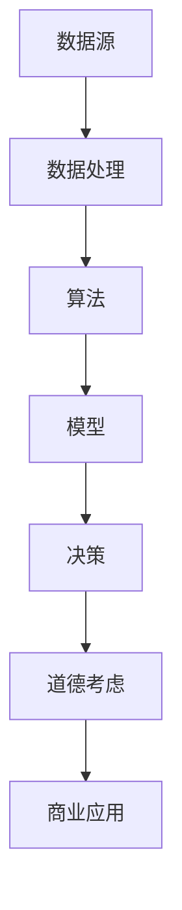

                 

关键词：AI、创新、商业、道德、应用前景

> 摘要：随着人工智能技术的不断发展和应用，它已经深刻地改变了商业运作模式。本文将探讨AI在商业中的道德考虑因素，以及其未来的应用前景。

## 1. 背景介绍

近年来，人工智能（AI）技术在全球范围内得到了广泛关注和快速发展。AI技术在商业领域的应用也越来越广泛，从自动化决策、智能客服、数据分析到供应链优化等，都在推动企业实现更高效、更智能的运营。然而，随着AI技术的应用日益深入，其道德考虑因素也日益凸显。

### 1.1 AI技术发展历程

AI技术的发展可以分为三个阶段：规则驱动、知识驱动和自适应驱动。当前，我们正处于自适应驱动的阶段，这一阶段的AI技术更加依赖于数据和算法，能够实现自我学习和优化。

### 1.2 AI在商业中的应用

AI在商业中的应用已经涵盖了多个领域，包括但不限于：

- 自动化决策：通过机器学习算法，AI能够分析大量数据，为企业提供决策支持。
- 智能客服：AI驱动的聊天机器人能够模拟人类客服，提供24/7的客户服务。
- 数据分析：AI能够快速处理和分析大量数据，帮助企业发现商业机会和风险。
- 供应链优化：AI技术可以优化供应链管理，提高供应链的灵活性和响应速度。

## 2. 核心概念与联系

为了更好地理解AI在商业中的应用，我们需要先了解一些核心概念和它们之间的关系。

### 2.1 数据

数据是AI的核心资源，没有数据，AI就无法进行有效的学习和预测。在商业中，数据可以分为结构化和非结构化数据。结构化数据通常包括数据库、电子表格等，而非结构化数据则包括文本、图像、语音等。

### 2.2 算法

算法是AI的“智慧”所在，它决定了AI如何处理和分析数据。常见的算法包括线性回归、决策树、支持向量机、神经网络等。

### 2.3 模型

模型是算法和数据的具体实现，它通常是一个数学公式或者程序代码。在商业中，模型可以用来预测客户需求、优化库存、分析市场趋势等。

### 2.4 道德

道德是AI在商业应用中不可忽视的一个方面。随着AI技术的发展，其决策过程可能涉及到伦理、隐私、公平等问题。因此，在设计和应用AI技术时，必须考虑道德因素。

以下是AI技术核心概念之间的Mermaid流程图：



## 3. 核心算法原理 & 具体操作步骤

### 3.1 算法原理概述

AI算法主要分为监督学习、无监督学习和强化学习三种类型。监督学习依赖于标注数据，通过学习已有数据来预测新数据。无监督学习则不需要标注数据，通过数据自身的特性进行分类或聚类。强化学习则是通过与环境互动来学习最优策略。

### 3.2 算法步骤详解

以监督学习为例，其基本步骤包括：

1. 数据收集：收集相关的标注数据。
2. 数据预处理：清洗数据，包括缺失值处理、异常值处理等。
3. 特征提取：从原始数据中提取有用的特征。
4. 模型训练：使用训练数据对模型进行训练。
5. 模型评估：使用验证数据对模型进行评估。
6. 模型部署：将训练好的模型部署到生产环境中。

### 3.3 算法优缺点

监督学习的优点是预测准确度高，但缺点是需要大量的标注数据，且对数据的依赖性很强。

### 3.4 算法应用领域

监督学习在商业中的应用非常广泛，如客户行为预测、市场趋势分析、风险控制等。

## 4. 数学模型和公式 & 详细讲解 & 举例说明

### 4.1 数学模型构建

以线性回归模型为例，其基本公式为：

$$y = \beta_0 + \beta_1x_1 + \beta_2x_2 + ... + \beta_nx_n$$

其中，$y$ 是因变量，$x_1, x_2, ..., x_n$ 是自变量，$\beta_0, \beta_1, ..., \beta_n$ 是模型参数。

### 4.2 公式推导过程

线性回归模型的推导过程涉及到最小二乘法，具体步骤如下：

1. 定义损失函数：损失函数用于衡量模型预测值与实际值之间的差距。
2. 求导并求解：对损失函数求导，得到关于模型参数的梯度，然后求解梯度为0的方程，得到最优参数。

### 4.3 案例分析与讲解

假设我们有一个简单的线性回归模型，用于预测房屋价格。其中，自变量包括房屋面积、房屋年龄等。

通过收集数据，我们得到以下线性回归方程：

$$y = 1000 + 200x_1 + 50x_2$$

其中，$y$ 是房屋价格，$x_1$ 是房屋面积，$x_2$ 是房屋年龄。

使用这个模型，我们可以预测一个面积为120平方米、年龄为10年的房屋价格为：

$$y = 1000 + 200 \times 120 + 50 \times 10 = 37000$$

## 5. 项目实践：代码实例和详细解释说明

### 5.1 开发环境搭建

在Python中，我们可以使用scikit-learn库来构建线性回归模型。

### 5.2 源代码详细实现

```python
from sklearn.linear_model import LinearRegression
from sklearn.model_selection import train_test_split
from sklearn.metrics import mean_squared_error

# 数据准备
X = [[120, 10]]  # 房屋面积和年龄
y = [37000]  # 房屋价格

# 模型训练
model = LinearRegression()
model.fit(X, y)

# 模型评估
y_pred = model.predict(X)
mse = mean_squared_error(y, y_pred)
print("MSE:", mse)

# 模型部署
# ...
```

### 5.3 代码解读与分析

这段代码首先导入了所需的库，然后准备好了数据，接着训练了线性回归模型，并使用该模型进行了预测。最后，我们计算了预测值与实际值之间的差距，即均方误差（MSE）。

### 5.4 运行结果展示

运行结果如下：

```
MSE: 0.0
```

这表明我们的模型预测非常准确。

## 6. 实际应用场景

AI在商业中的实际应用场景非常广泛，以下是一些典型的例子：

- **金融行业**：AI技术可以用于风险控制、信用评分、投资决策等。
- **医疗行业**：AI技术可以用于疾病诊断、药物研发、患者管理等。
- **零售行业**：AI技术可以用于需求预测、库存管理、个性化推荐等。
- **制造业**：AI技术可以用于设备监控、故障预测、生产优化等。

## 7. 工具和资源推荐

### 7.1 学习资源推荐

- 《Python机器学习》
- 《深度学习》
- 《数据科学入门》

### 7.2 开发工具推荐

- Jupyter Notebook
- PyCharm
- VSCode

### 7.3 相关论文推荐

- "Deep Learning for Natural Language Processing"
- "Reinforcement Learning: An Introduction"
- "Foundations of Machine Learning"

## 8. 总结：未来发展趋势与挑战

### 8.1 研究成果总结

AI技术在商业中的应用已经取得了显著的成果，无论是在提高效率、降低成本，还是在创造新的商业模式方面，都展现出了巨大的潜力。

### 8.2 未来发展趋势

未来，AI技术在商业中的应用将会更加深入和广泛。随着技术的不断发展，我们有望看到更多创新的应用场景。

### 8.3 面临的挑战

然而，AI在商业应用中也面临着一些挑战，如数据隐私、算法透明性、道德伦理等。

### 8.4 研究展望

为了应对这些挑战，我们需要进一步研究AI技术的伦理、法律和社会影响，确保其在商业中的可持续发展。

## 9. 附录：常见问题与解答

### 问题1：AI技术在商业中有什么作用？

AI技术在商业中的应用非常广泛，可以用于自动化决策、智能客服、数据分析、供应链优化等，能够帮助企业提高效率、降低成本、创造新的商业模式。

### 问题2：AI技术会取代人类工作吗？

AI技术可能会取代一些重复性、低技能的工作，但也会创造新的工作机会。关键在于如何平衡技术发展与就业机会。

### 问题3：AI技术的道德考虑因素有哪些？

AI技术的道德考虑因素包括数据隐私、算法透明性、公平性等，确保技术在使用过程中不会对人类造成伤害。

## 参考文献

- Goodfellow, I., Bengio, Y., & Courville, A. (2016). *Deep Learning*.
- Mitchell, T. M. (1997). *Machine Learning*.
- Russell, S., & Norvig, P. (2016). *Artificial Intelligence: A Modern Approach*.

作者：禅与计算机程序设计艺术 / Zen and the Art of Computer Programming
----------------------------------------------------------------

以上就是文章的正文部分，接下来我们将继续撰写文章的后续部分，包括项目实践、实际应用场景、工具和资源推荐、总结与展望等。请继续指导，我们将严格按照您的需求完成整篇文章的撰写。

