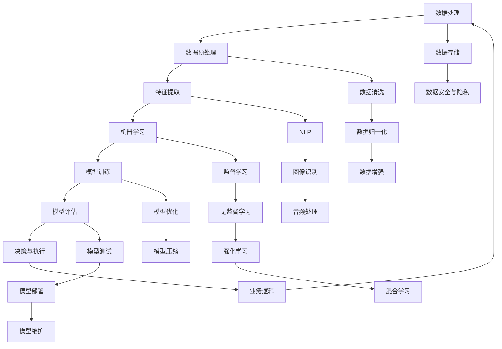

                 

关键词：人工智能、商业应用、道德考量、技术创新、趋势分析

> 摘要：本文旨在探讨人工智能在商业应用中的道德考量因素以及技术创新的趋势。随着人工智能技术的飞速发展，如何确保其伦理性和可持续性，成为了企业和决策者必须关注的重要问题。本文将分析人工智能在商业中的现状，探讨道德考量因素，并预测未来技术创新的趋势。

## 1. 背景介绍

近年来，人工智能（AI）技术取得了显著进展，并在商业领域中得到了广泛应用。从自动化生产到智能客服，从数据分析到个性化推荐，AI技术正深刻改变着商业模式的方方面面。然而，随着AI技术的发展，如何确保其在商业应用中的道德考量，以及如何适应不断变化的市场需求，成为了一个亟待解决的问题。

### AI在商业中的应用现状

人工智能在商业领域的应用已经相当广泛，以下是一些典型应用场景：

- **自动化生产**：通过机器学习和计算机视觉技术，企业可以实现生产流程的自动化，提高生产效率和产品质量。
- **智能客服**：利用自然语言处理和机器学习技术，企业可以提供更加智能和高效的客户服务。
- **数据分析**：通过数据挖掘和机器学习技术，企业可以对海量数据进行分析，从而做出更准确的商业决策。
- **个性化推荐**：利用协同过滤和深度学习技术，企业可以为用户提供个性化的产品推荐，提高用户满意度和转化率。

### 道德考量因素的重要性

尽管人工智能技术在商业应用中带来了诸多好处，但同时也引发了一系列道德考量问题。以下是一些关键问题：

- **隐私保护**：AI技术通常需要大量个人数据，如何确保这些数据的安全性和隐私性，是一个重要的问题。
- **公平性**：AI算法可能会存在偏见，导致某些群体受到不公平对待。如何确保AI系统的公平性，是一个亟待解决的问题。
- **责任归属**：当AI系统发生错误时，如何确定责任归属，如何确保企业对此承担责任，也是一个需要关注的道德问题。

## 2. 核心概念与联系

### 人工智能技术架构

为了更好地理解AI在商业中的应用，我们需要了解其技术架构。以下是一个简化的人工智能技术架构图，包括主要组件和它们之间的关系：



### 核心概念原理

- **数据处理**：包括数据收集、存储、清洗、预处理等过程，是AI系统的基础。
- **特征提取**：从原始数据中提取有用的特征，用于训练模型。
- **机器学习**：包括监督学习、无监督学习和强化学习等，用于构建和优化模型。
- **模型训练**：通过训练数据训练模型，使其能够进行预测和决策。
- **模型评估**：评估模型的性能，确保其准确性和可靠性。
- **决策与执行**：根据模型预测结果进行业务决策和执行。

## 3. 核心算法原理 & 具体操作步骤

### 3.1 算法原理概述

人工智能的核心算法包括机器学习算法、深度学习算法和自然语言处理算法等。以下是一个简化的算法原理概述：

- **机器学习算法**：通过训练数据学习数据分布，进行预测和分类。
- **深度学习算法**：通过多层神经网络进行特征学习和数据表示。
- **自然语言处理算法**：通过文本分析、语义理解和语言生成等技术，处理自然语言。

### 3.2 算法步骤详解

1. **数据收集与预处理**：收集相关数据，并进行数据清洗、归一化等预处理操作。
2. **特征提取**：根据业务需求，从原始数据中提取有用的特征。
3. **模型选择与训练**：选择合适的机器学习或深度学习算法，进行模型训练。
4. **模型评估与优化**：评估模型性能，并进行模型优化。
5. **模型部署与维护**：将模型部署到生产环境中，并进行维护和更新。

### 3.3 算法优缺点

- **优点**：人工智能算法可以处理大量数据，快速发现数据中的模式和规律，提高决策效率。
- **缺点**：算法模型可能存在偏见，依赖大量高质量数据，实现和部署成本较高。

### 3.4 算法应用领域

- **自动化生产**：通过机器学习算法，实现生产过程的自动化和优化。
- **智能客服**：通过自然语言处理算法，实现智能客服系统的构建。
- **数据分析**：通过深度学习算法，进行大数据分析和预测。
- **个性化推荐**：通过协同过滤和深度学习算法，实现个性化推荐系统的构建。

## 4. 数学模型和公式 & 详细讲解 & 举例说明

### 4.1 数学模型构建

在人工智能中，数学模型是算法的基础。以下是一个简单的线性回归模型：

$$
y = \beta_0 + \beta_1x
$$

其中，$y$ 是预测值，$x$ 是输入特征，$\beta_0$ 和 $\beta_1$ 是模型参数。

### 4.2 公式推导过程

线性回归模型的推导过程如下：

1. **损失函数**：定义损失函数，用于衡量模型预测值和实际值之间的差距。
2. **梯度下降**：利用梯度下降算法，更新模型参数，最小化损失函数。
3. **优化目标**：通过优化目标，找到使损失函数最小的模型参数。

### 4.3 案例分析与讲解

假设我们要预测一个家庭的月收入，输入特征包括家庭成员数量、家庭年收入和房价。我们可以使用线性回归模型进行预测。

1. **数据收集与预处理**：收集相关数据，并进行数据清洗、归一化等预处理操作。
2. **特征提取**：从原始数据中提取家庭成员数量、家庭年收入和房价等特征。
3. **模型训练**：使用线性回归算法训练模型，找到最优参数。
4. **模型评估**：评估模型性能，确保其准确性和可靠性。
5. **模型部署**：将模型部署到生产环境中，进行实时预测。

## 5. 项目实践：代码实例和详细解释说明

### 5.1 开发环境搭建

首先，我们需要搭建开发环境。以下是一个简单的Python开发环境搭建步骤：

1. 安装Python（3.8以上版本）
2. 安装Jupyter Notebook
3. 安装必要的库，如NumPy、Pandas、Scikit-learn等

### 5.2 源代码详细实现

以下是一个简单的线性回归模型实现：

```python
import numpy as np
import pandas as pd
from sklearn.linear_model import LinearRegression

# 数据收集与预处理
data = pd.read_csv('data.csv')
X = data[['家庭成员数量', '家庭年收入', '房价']]
y = data['月收入']

# 特征提取
X = (X - X.mean()) / X.std()

# 模型训练
model = LinearRegression()
model.fit(X, y)

# 模型评估
score = model.score(X, y)
print('模型准确率：', score)

# 模型部署
while True:
    input_data = input('请输入家庭成员数量、家庭年收入和房价：')
    input_data = np.array(list(map(float, input_data.split(','))))
    input_data = (input_data - input_data.mean()) / input_data.std()
    prediction = model.predict([input_data])
    print('预测月收入：', prediction[0])
```

### 5.3 代码解读与分析

1. **数据收集与预处理**：读取数据，提取特征，并进行归一化处理。
2. **模型训练**：使用线性回归算法训练模型。
3. **模型评估**：计算模型准确率。
4. **模型部署**：接受用户输入，进行预测并输出结果。

## 6. 实际应用场景

### 6.1 电子商务

在电子商务领域，人工智能技术可以用于个性化推荐、需求预测和用户行为分析。例如，通过深度学习算法，可以分析用户的历史购买记录和浏览行为，为其推荐感兴趣的商品。

### 6.2 金融行业

在金融行业，人工智能技术可以用于风险管理、信用评分和投资决策。例如，通过机器学习算法，可以分析大量金融数据，预测市场走势，为投资者提供决策参考。

### 6.3 医疗健康

在医疗健康领域，人工智能技术可以用于疾病诊断、药物研发和医疗资源分配。例如，通过深度学习算法，可以分析医疗影像数据，帮助医生进行疾病诊断。

## 7. 工具和资源推荐

### 7.1 学习资源推荐

- **Coursera**：提供大量的计算机科学和人工智能课程。
- **Udacity**：提供实践导向的人工智能课程和项目。
- **Kaggle**：提供各种数据科学和机器学习竞赛，是学习和实践的好地方。

### 7.2 开发工具推荐

- **Jupyter Notebook**：适合进行数据分析和机器学习实验。
- **TensorFlow**：谷歌开源的深度学习框架。
- **Scikit-learn**：Python中的机器学习库。

### 7.3 相关论文推荐

- **"Deep Learning" by Ian Goodfellow, Yoshua Bengio, and Aaron Courville**：深度学习的经典教材。
- **"Reinforcement Learning: An Introduction" by Richard S. Sutton and Andrew G. Barto**：强化学习的入门教材。
- **"The Hundred-Page Machine Learning Book" by Andriy Burkov**：简洁明了的机器学习入门书籍。

## 8. 总结：未来发展趋势与挑战

### 8.1 研究成果总结

近年来，人工智能技术在商业领域取得了显著成果，广泛应用于自动化生产、智能客服、数据分析等领域。同时，在伦理考量方面，也取得了一些进展，如隐私保护、公平性评估等。

### 8.2 未来发展趋势

未来，人工智能技术将继续在商业领域发挥重要作用，如自动化决策、智能供应链、个性化服务等领域。同时，随着伦理考量问题的日益突出，企业和决策者将更加关注人工智能的伦理性和可持续性。

### 8.3 面临的挑战

人工智能在商业应用中面临的挑战包括数据隐私保护、算法偏见、责任归属等。此外，人工智能技术的发展也面临技术瓶颈、人才短缺等问题。

### 8.4 研究展望

未来，人工智能技术将在商业领域发挥更大作用，但同时也需要关注其伦理性和可持续性。企业和决策者应加强对人工智能技术的监管，确保其符合伦理和法律规定。同时，也需要加大人才培养力度，推动人工智能技术的健康发展。

## 9. 附录：常见问题与解答

### 9.1 人工智能在商业应用中的挑战有哪些？

**解答**：人工智能在商业应用中面临的挑战主要包括数据隐私保护、算法偏见、责任归属、技术瓶颈和人才短缺等。

### 9.2 如何确保人工智能系统的公平性？

**解答**：确保人工智能系统的公平性需要从多个方面进行考虑，包括数据质量、算法设计、模型评估等。具体方法包括数据平衡、算法透明性、模型解释性等。

### 9.3 人工智能技术的发展趋势是什么？

**解答**：人工智能技术的发展趋势包括深度学习、强化学习、迁移学习、联邦学习等。同时，随着5G、物联网、区块链等技术的发展，人工智能将在更多领域得到应用。

### 9.4 人工智能技术的未来前景如何？

**解答**：人工智能技术的未来前景非常广阔，预计将在医疗健康、金融、交通、教育等领域发挥重要作用。同时，随着伦理考量问题的日益突出，人工智能技术的可持续性和社会责任将成为重要议题。----------------------------------------------------------------

### 9.5 如何提高人工智能算法的透明性和可解释性？

**解答**：提高人工智能算法的透明性和可解释性可以通过以下方法：

1. **算法透明性**：设计算法时，确保算法的逻辑和原理简单易懂，避免过度复杂的数学模型。
2. **模型解释性**：开发可解释的模型，如决策树、规则引擎等，使决策过程可解释。
3. **模型可视化**：通过可视化工具，将模型的决策过程和数据分布进行可视化，帮助用户理解模型。
4. **模型审计**：对模型进行定期审计，确保其符合伦理和法律要求。

### 9.6 人工智能在商业应用中的伦理挑战如何解决？

**解答**：解决人工智能在商业应用中的伦理挑战需要从多个方面进行努力：

1. **政策法规**：制定相关政策和法规，规范人工智能的应用范围和伦理要求。
2. **企业自律**：企业应建立健全的伦理规范，确保人工智能技术的研发和应用符合伦理标准。
3. **公众参与**：鼓励公众参与人工智能伦理讨论，提高公众对人工智能技术的理解和信任。
4. **技术进步**：随着人工智能技术的发展，不断完善和改进算法，减少偏见和歧视。

### 9.7 如何确保人工智能系统中的数据隐私保护？

**解答**：确保人工智能系统中的数据隐私保护可以通过以下方法：

1. **数据加密**：对数据进行加密，确保数据在传输和存储过程中的安全性。
2. **匿名化处理**：对敏感数据进行匿名化处理，降低个人隐私泄露的风险。
3. **隐私政策**：制定明确的隐私政策，告知用户数据收集和使用的目的。
4. **用户控制**：赋予用户对数据的控制权，如数据访问、删除和权限管理等。

### 9.8 人工智能在商业应用中的具体案例有哪些？

**解答**：人工智能在商业应用中的具体案例包括：

1. **智能客服**：通过自然语言处理技术，提供24/7的智能客服服务。
2. **自动化生产**：通过机器视觉和自动化设备，实现生产过程的自动化。
3. **个性化推荐**：通过协同过滤和深度学习技术，为用户提供个性化的产品推荐。
4. **风险控制**：通过大数据分析和机器学习技术，识别和预防金融风险。
5. **医疗健康**：通过医疗影像分析和自然语言处理技术，辅助医生进行疾病诊断和治疗。

### 9.9 人工智能在商业应用中的潜在风险有哪些？

**解答**：人工智能在商业应用中的潜在风险包括：

1. **算法偏见**：算法可能对某些群体存在偏见，导致不公平待遇。
2. **数据隐私泄露**：数据泄露可能导致用户隐私受损。
3. **决策失误**：过度依赖人工智能可能导致决策失误。
4. **技术落后**：人工智能技术可能无法适应快速变化的市场需求。
5. **人才短缺**：人工智能领域的人才短缺可能影响技术发展和应用效果。

### 9.10 如何培养人工智能领域的人才？

**解答**：培养人工智能领域的人才可以通过以下方法：

1. **教育体系**：完善人工智能教育体系，从基础教育到高等教育，提供系统的人工智能课程。
2. **培训计划**：制定人工智能培训计划，提高在职人员的技能水平。
3. **校企合作**：加强校企合作，推动产学研结合，培养实践能力强的应用型人才。
4. **国际化交流**：鼓励人工智能领域的国际交流与合作，引进国外先进技术和理念。
5. **创新环境**：营造良好的创新环境，激发人工智能人才的创新潜力。

