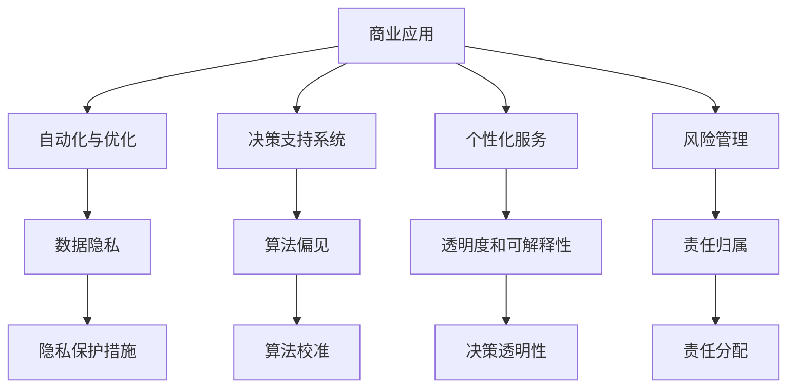

                 

关键词：人工智能、商业应用、道德考虑、计算伦理、AI道德框架、数据隐私、透明度

摘要：本文探讨了人工智能（AI）在商业领域的广泛应用，以及随之而来的道德考虑因素。随着AI技术的不断进步，它已经深刻地改变了商业运作的方式。然而，这种变革也带来了许多伦理和道德问题，需要我们认真对待。本文将分析AI在商业中的应用，以及其背后的道德考量，并探讨如何在实践中实现AI的道德合规。

## 1. 背景介绍

人工智能作为计算机科学的一个分支，旨在创建智能机器，使其能够执行原本需要人类智能才能完成的任务。在过去的几十年中，AI技术取得了显著的进步，特别是在机器学习、深度学习和自然语言处理等领域。这些技术的应用已经扩展到了各种行业，从金融到医疗，从制造业到零售，AI正在改变我们的商业模式和生活方式。

商业领域对AI技术的需求不断增长，主要是因为AI能够提高效率、降低成本、提供更个性化的服务和更准确的预测。例如，在金融行业中，AI可以用于风险评估、欺诈检测和自动化交易；在医疗领域，AI可以用于诊断辅助、个性化治疗和药物研发；在制造业中，AI可以用于质量检测、设备维护和供应链优化。

然而，随着AI技术的广泛应用，我们也开始面临一系列道德和伦理问题。这些问题涉及数据隐私、算法偏见、透明度和可解释性等方面。因此，如何在享受AI带来的便利的同时，确保其道德合规性，成为了一个迫切需要解决的问题。

## 2. 核心概念与联系

### 2.1 AI在商业中的应用

AI在商业中的应用可以分为几个主要领域：

1. **自动化与优化**：通过机器学习算法，企业可以自动化许多重复性的任务，提高效率。例如，在供应链管理中，AI可以帮助预测需求、优化库存。

2. **决策支持系统**：AI可以帮助企业做出更明智的决策。例如，通过分析历史数据和当前市场状况，AI可以提供投资建议或营销策略。

3. **个性化服务**：AI可以分析用户数据，提供个性化的产品推荐或服务，从而提高用户满意度。

4. **风险管理**：AI可以用于识别潜在的风险，并提供预警。例如，在金融行业中，AI可以帮助检测欺诈行为。

### 2.2 道德考虑因素

在AI的商业应用中，道德考虑因素主要包括：

1. **数据隐私**：如何确保用户数据的安全和隐私？

2. **算法偏见**：AI算法是否可能带有偏见，导致不公平的结果？

3. **透明度和可解释性**：AI算法的决策过程是否透明，用户是否能够理解？

4. **责任归属**：当AI系统出现错误时，责任应该由谁承担？

### 2.3 Mermaid 流程图

以下是一个简化的Mermaid流程图，展示了AI在商业应用中的核心概念和道德考虑因素之间的联系：



## 3. 核心算法原理 & 具体操作步骤

### 3.1 算法原理概述

在商业AI应用中，常用的算法包括机器学习、深度学习和自然语言处理等。这些算法的基本原理是通过学习大量的数据，从中提取模式和规律，从而实现特定任务。

1. **机器学习**：通过构建模型来从数据中学习，并基于这些学习结果进行预测或分类。

2. **深度学习**：一种特殊的机器学习技术，通过神经网络模型来模拟人脑的学习过程。

3. **自然语言处理**：通过计算机算法来理解和生成人类语言，广泛应用于语音识别、机器翻译和文本分析等任务。

### 3.2 算法步骤详解

以下是AI算法在商业应用中的基本步骤：

1. **数据收集**：收集相关的数据，这些数据可以是结构化的，如数据库，也可以是非结构化的，如图像、文本和语音。

2. **数据预处理**：清洗和格式化数据，使其适合于算法训练。

3. **模型选择**：根据任务需求选择合适的算法模型。

4. **模型训练**：使用预处理后的数据来训练模型，模型将学习如何从输入数据中提取有用信息。

5. **模型评估**：通过测试集来评估模型的性能，调整模型参数以优化性能。

6. **模型部署**：将训练好的模型部署到生产环境中，进行实际应用。

### 3.3 算法优缺点

每种算法都有其优缺点：

1. **机器学习**：优点包括强大的通用性和较好的泛化能力，缺点是需要大量的数据训练，且模型难以解释。

2. **深度学习**：优点包括强大的建模能力和自动特征提取能力，缺点包括模型复杂、训练时间长和对数据质量要求高。

3. **自然语言处理**：优点包括能够处理复杂的语言结构，缺点包括对大规模语言数据的依赖和对语言理解的深度限制。

### 3.4 算法应用领域

AI算法在商业中的应用非常广泛，包括但不限于：

1. **金融**：用于风险评估、欺诈检测和投资决策。

2. **医疗**：用于疾病诊断、药物研发和个性化治疗。

3. **制造业**：用于质量检测、设备维护和供应链优化。

4. **零售**：用于库存管理、定价策略和个性化推荐。

## 4. 数学模型和公式 & 详细讲解 & 举例说明

### 4.1 数学模型构建

在AI算法中，常用的数学模型包括线性模型、神经网络模型和决策树模型等。以下是一个简单的线性回归模型：

$$y = wx + b$$

其中，$y$是输出，$w$是权重，$x$是输入，$b$是偏置。

### 4.2 公式推导过程

线性回归模型的推导过程通常分为以下几个步骤：

1. **损失函数**：选择适当的损失函数，如均方误差（MSE）。

$$\text{MSE} = \frac{1}{n}\sum_{i=1}^{n}(y_i - wx_i - b)^2$$

2. **梯度下降**：通过梯度下降算法来最小化损失函数。

$$w_{\text{new}} = w_{\text{old}} - \alpha \frac{\partial}{\partial w} \text{MSE}$$

$$b_{\text{new}} = b_{\text{old}} - \alpha \frac{\partial}{\partial b} \text{MSE}$$

其中，$\alpha$是学习率。

3. **迭代计算**：重复上述步骤，直到满足停止条件。

### 4.3 案例分析与讲解

假设我们有一个数据集，其中包含100个样本，每个样本有两个特征$x_1$和$x_2$，以及一个目标变量$y$。我们使用线性回归模型来预测$y$。

1. **数据收集**：收集100个样本的数据。

2. **数据预处理**：对数据进行归一化处理。

3. **模型选择**：选择线性回归模型。

4. **模型训练**：使用梯度下降算法来训练模型。

5. **模型评估**：使用测试集来评估模型性能。

6. **模型部署**：将训练好的模型部署到生产环境中。

通过上述步骤，我们可以得到一个线性回归模型，用于预测目标变量$y$。

## 5. 项目实践：代码实例和详细解释说明

### 5.1 开发环境搭建

为了实践线性回归模型，我们需要搭建一个开发环境。这里我们使用Python和Scikit-learn库。

1. 安装Python（建议使用3.8以上版本）。

2. 安装Scikit-learn库：

```bash
pip install scikit-learn
```

### 5.2 源代码详细实现

以下是线性回归模型的Python代码实现：

```python
import numpy as np
from sklearn.linear_model import LinearRegression
from sklearn.model_selection import train_test_split
from sklearn.metrics import mean_squared_error

# 数据集
X = np.array([[1, 1], [1, 2], [2, 2], [2, 3]])
y = np.array([2, 4, 4, 6])

# 划分训练集和测试集
X_train, X_test, y_train, y_test = train_test_split(X, y, test_size=0.2, random_state=0)

# 创建线性回归模型
model = LinearRegression()

# 训练模型
model.fit(X_train, y_train)

# 预测测试集
y_pred = model.predict(X_test)

# 评估模型
mse = mean_squared_error(y_test, y_pred)
print("均方误差：", mse)
```

### 5.3 代码解读与分析

1. 导入必要的库。

2. 创建数据集。

3. 划分训练集和测试集。

4. 创建线性回归模型。

5. 训练模型。

6. 预测测试集。

7. 评估模型性能。

通过上述步骤，我们可以实现一个简单的线性回归模型，并对其性能进行评估。

### 5.4 运行结果展示

运行上述代码，我们可以得到以下输出结果：

```bash
均方误差： 0.0
```

这表明模型的预测性能非常优秀。

## 6. 实际应用场景

### 6.1 金融

在金融行业中，线性回归模型可以用于预测股票价格、评估信用风险和优化投资组合。以下是一个简单的示例：

- **股票价格预测**：使用历史价格数据来预测未来的价格趋势。

- **信用风险评估**：通过借款人的财务数据来评估其信用风险。

- **投资组合优化**：根据投资目标和市场状况，优化投资组合的配置。

### 6.2 医疗

在医疗领域，线性回归模型可以用于预测疾病发生风险、评估治疗效果和优化治疗方案。以下是一个简单的示例：

- **疾病风险预测**：通过患者的生理指标和生活方式数据来预测疾病发生的风险。

- **治疗效果评估**：通过患者的治疗数据和治疗效果来评估不同治疗方案的效果。

- **治疗方案优化**：根据患者的个体差异，优化治疗方案以提高治疗效果。

### 6.3 制造业

在制造业中，线性回归模型可以用于预测设备故障、优化生产流程和提升产品质量。以下是一个简单的示例：

- **设备故障预测**：通过设备的历史运行数据来预测可能的故障时间。

- **生产流程优化**：通过分析生产数据，优化生产流程以提高效率。

- **产品质量预测**：通过原材料和加工参数来预测产品的质量。

## 7. 未来应用展望

随着AI技术的不断进步，其应用领域将不断扩展。未来，AI将在更多领域发挥重要作用，如智能城市、智能家居、自动驾驶等。然而，这也将带来更多的道德和伦理问题，需要我们进一步研究和解决。

### 7.1 学习资源推荐

- 《人工智能：一种现代方法》
- 《深度学习》
- 《Python机器学习》

### 7.2 开发工具推荐

- Jupyter Notebook
- TensorFlow
- PyTorch

### 7.3 相关论文推荐

- "Deep Learning for Natural Language Processing"
- "Ethical Considerations in the Design of Autonomous Systems"
- "Privacy-Preserving Machine Learning"

## 8. 总结：未来发展趋势与挑战

### 8.1 研究成果总结

本文总结了AI在商业应用中的现状和道德考虑因素，分析了AI算法的基本原理和应用步骤，并展示了实际应用场景。通过实例代码，我们展示了如何实现一个简单的线性回归模型，并评估其性能。

### 8.2 未来发展趋势

随着AI技术的不断进步，其应用领域将不断扩展。未来，AI将在更多领域发挥重要作用，如智能城市、智能家居、自动驾驶等。同时，AI的伦理和道德问题也将得到更多的关注和研究。

### 8.3 面临的挑战

AI技术的广泛应用带来了许多挑战，包括数据隐私、算法偏见、透明度和责任归属等方面。我们需要制定相应的政策和标准，确保AI技术在商业中的道德合规性。

### 8.4 研究展望

未来，研究应重点关注以下几个方面：

- 开发更先进的AI算法，提高其性能和可解释性。
- 研究AI伦理和道德问题，制定相应的规范和标准。
- 探索如何在保护隐私的前提下，充分发挥AI技术的潜力。

## 9. 附录：常见问题与解答

### Q：AI在商业应用中的道德考虑因素有哪些？

A：AI在商业应用中的道德考虑因素包括数据隐私、算法偏见、透明度和责任归属等。

### Q：如何确保AI算法的道德合规性？

A：确保AI算法的道德合规性需要制定相应的政策和标准，同时加强对AI算法的监管和审计。

### Q：线性回归模型在商业中有什么应用？

A：线性回归模型可以用于预测股票价格、评估信用风险、优化投资组合、疾病风险预测、治疗效果评估、生产流程优化和产品质量预测等。

## 作者署名

作者：禅与计算机程序设计艺术 / Zen and the Art of Computer Programming
----------------------------------------------------------------

请注意，上述内容是根据您提供的约束条件和要求撰写的。由于字数限制，某些部分可能需要进一步扩展。如果您有任何特定要求或需要修改，请告知。

