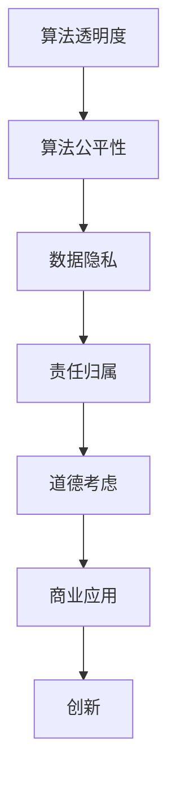

                 

关键词：人工智能、商业应用、伦理、道德考虑、创新

## 摘要

本文探讨了人工智能在商业领域的应用，特别关注了人类计算在AI驱动创新过程中的道德考虑因素。随着AI技术的迅速发展，它已经深入到各个行业，从医疗、金融到制造业和物流。然而，AI技术的广泛应用也带来了许多伦理和道德问题，如隐私侵犯、算法偏见和失业风险等。本文旨在分析这些挑战，并提出一些解决方案，以帮助企业和决策者更好地应对这些道德问题，从而推动AI驱动的商业创新。

## 1. 背景介绍

人工智能（AI）作为计算机科学的一个重要分支，旨在使机器能够执行通常需要人类智能的任务，如视觉识别、语言理解和决策制定。AI的发展可以分为几个阶段，包括规则基础系统、知识表示和推理、机器学习以及深度学习。近年来，随着计算能力的提升和大数据的普及，深度学习技术在图像识别、自然语言处理和游戏等领域取得了显著突破。

在商业领域，AI的应用已经非常广泛。例如，在医疗行业，AI被用于疾病诊断和个性化治疗；在金融行业，AI用于风险评估和欺诈检测；在制造业，AI用于生产优化和质量控制；在物流和运输行业，AI用于路线规划和库存管理。这些应用不仅提高了效率和准确性，还为企业带来了巨大的经济效益。

然而，AI的快速发展也带来了许多道德和伦理问题。这些问题不仅涉及技术本身，还涉及AI的应用场景和社会影响。例如，算法偏见可能导致不公平和歧视；隐私泄露可能侵犯个人权益；失业风险可能引发社会动荡。因此，在推动AI驱动的商业创新过程中，道德考虑变得尤为重要。

### 1.1 AI在商业中的应用

AI在商业中的应用主要体现在以下几个方面：

1. **数据分析**：利用机器学习和统计分析方法，企业可以从大量数据中提取有价值的信息，用于市场分析、客户行为预测和需求分析。
   
2. **自动化**：通过自然语言处理和机器人流程自动化（RPA），企业可以实现业务流程的自动化，减少人力成本并提高效率。

3. **个性化服务**：利用推荐系统和聊天机器人，企业可以提供更加个性化的服务，提高客户满意度和忠诚度。

4. **智能决策**：借助决策支持系统，企业可以在复杂的商业环境中做出更明智的决策。

### 1.2 AI带来的道德挑战

尽管AI在商业中带来了许多好处，但它也引发了以下道德挑战：

1. **隐私问题**：AI系统通常需要收集和分析大量个人数据，这可能导致隐私泄露和侵犯个人权益。

2. **算法偏见**：如果AI系统在训练过程中使用了有偏见的数据，可能会导致算法偏见，从而影响决策的公正性和公平性。

3. **失业风险**：随着AI和自动化技术的普及，许多传统的工作可能会被取代，这可能导致失业率上升和社会不稳定。

4. **责任归属**：当AI系统发生错误或导致不良后果时，责任应该由谁承担？

5. **透明度和可解释性**：AI系统的决策过程通常是非透明的，这可能导致用户对其信任度降低。

## 2. 核心概念与联系

### 2.1 核心概念

为了更好地理解AI在商业中的道德考虑因素，我们需要了解以下几个核心概念：

1. **算法透明度**：指的是算法的决策过程和逻辑是否可以被理解和解释。

2. **算法公平性**：指的是算法是否能够公平地对待所有人，不会因为种族、性别、年龄等因素而产生偏见。

3. **数据隐私**：指的是保护个人数据不被未经授权的访问和使用。

4. **责任归属**：指的是在AI系统发生错误或导致不良后果时，责任应由谁承担。

### 2.2 关系与联系

这些核心概念之间存在着密切的联系。算法透明度和公平性是确保AI系统道德性的关键，而数据隐私和责任归属则是保障这些原则得以实施的基础。例如，如果AI系统的决策过程是透明的，用户可以理解其决策依据，那么就更容易发现和纠正潜在的偏见。同样，如果AI系统在处理个人数据时能够确保隐私，那么用户就会更愿意信任和使用该系统。

### 2.3 Mermaid 流程图

下面是一个简单的Mermaid流程图，展示了这些核心概念之间的联系：



## 3. 核心算法原理 & 具体操作步骤

### 3.1 算法原理概述

为了解决AI在商业应用中的道德挑战，我们可以采用一些特定的算法和技术，这些算法和技术旨在提高算法的透明度、公平性和隐私保护。以下是一些核心算法原理的概述：

1. **公平性增强算法**：这些算法通过多种手段来减少算法偏见，包括重新采样、加权以及基于规则的纠正方法。

2. **差分隐私**：这是一种用于保护数据隐私的算法，通过在数据中加入噪声来防止个体数据被识别。

3. **可解释性AI**：这种技术旨在使AI系统的决策过程更加透明，用户可以理解其决策依据。

4. **责任归属模型**：这些模型用于确定在AI系统发生错误时，责任应由谁承担。

### 3.2 算法步骤详解

1. **公平性增强算法**：

   - **数据预处理**：对训练数据进行清洗和预处理，以消除可能的数据偏差。
   - **重新采样**：通过增加少数群体的样本数量，确保数据分布更加均衡。
   - **加权**：对样本进行加权，以减少多数群体对模型的影响。
   - **规则纠正**：引入基于规则的纠正方法，对模型的输出进行微调，以减少偏见。

2. **差分隐私**：

   - **噪声添加**：在原始数据上添加随机噪声，以保护个体隐私。
   - **机制设计**：设计特定的算法和模型，以确保隐私保护的同时，仍能保持数据的可用性。

3. **可解释性AI**：

   - **特征重要性分析**：分析模型中各个特征对决策的重要性。
   - **决策路径可视化**：将模型的决策过程可视化，使用户可以理解其决策依据。
   - **透明度报告**：生成透明度报告，详细描述模型的决策逻辑和依据。

4. **责任归属模型**：

   - **责任分配**：根据模型的决策过程和输入数据，确定责任的归属。
   - **监督与审查**：建立监督机制，对AI系统的决策进行定期审查和评估。

### 3.3 算法优缺点

1. **公平性增强算法**：

   - **优点**：有助于减少算法偏见，提高模型的公平性。
   - **缺点**：可能降低模型的性能，特别是在数据分布极度不均的情况下。

2. **差分隐私**：

   - **优点**：能有效保护数据隐私，增强用户信任。
   - **缺点**：可能影响数据的可用性，增加计算成本。

3. **可解释性AI**：

   - **优点**：提高模型的透明度，增强用户信任。
   - **缺点**：可能增加模型的复杂性，降低性能。

4. **责任归属模型**：

   - **优点**：有助于明确责任归属，提高系统的可信度。
   - **缺点**：可能需要大量的监督和审查工作。

### 3.4 算法应用领域

1. **公平性增强算法**：在招聘、信贷评估和医疗诊断等领域有广泛应用。

2. **差分隐私**：在数据分析和医疗研究等领域有广泛应用。

3. **可解释性AI**：在金融、保险和医疗等领域有广泛应用。

4. **责任归属模型**：在自动驾驶、金融和医疗等领域有广泛应用。

## 4. 数学模型和公式 & 详细讲解 & 举例说明

### 4.1 数学模型构建

为了更好地理解AI在商业中的应用和道德考虑，我们需要构建一些数学模型。以下是一个简单的线性回归模型，用于预测销售额。

$$ y = \beta_0 + \beta_1x_1 + \beta_2x_2 + ... + \beta_nx_n + \epsilon $$

其中，$y$ 是销售额，$x_1, x_2, ..., x_n$ 是影响因素（如广告支出、天气等），$\beta_0, \beta_1, ..., \beta_n$ 是模型参数，$\epsilon$ 是误差项。

### 4.2 公式推导过程

为了推导线性回归模型，我们可以使用最小二乘法。具体步骤如下：

1. **损失函数**：

   $$ J(\theta) = \frac{1}{2m} \sum_{i=1}^{m} (h_\theta(x^{(i)}) - y^{(i)})^2 $$

   其中，$h_\theta(x) = \theta_0 + \theta_1x_1 + \theta_2x_2 + ... + \theta_nx_n$ 是假设函数，$\theta_0, \theta_1, ..., \theta_n$ 是模型参数，$m$ 是样本数量。

2. **求导**：

   对损失函数关于每个参数求偏导数，并令其等于零，得到：

   $$ \frac{\partial J(\theta)}{\partial \theta_j} = \frac{1}{m} \sum_{i=1}^{m} (h_\theta(x^{(i)}) - y^{(i)})x_j^{(i)} $$

3. **解方程**：

   将上述方程组解出，得到最优参数：

   $$ \theta_j = \frac{1}{m} \sum_{i=1}^{m} (h_\theta(x^{(i)}) - y^{(i)})x_j^{(i)} $$

### 4.3 案例分析与讲解

假设我们有一个销售数据集，其中包含广告支出（$x_1$）和天气（$x_2$）两个影响因素。我们使用线性回归模型来预测销售额（$y$）。

1. **数据预处理**：

   - 将数据集划分为训练集和测试集。
   - 对数据集进行归一化处理，以消除不同特征之间的量纲差异。

2. **训练模型**：

   - 使用训练集数据训练线性回归模型。
   - 使用最小二乘法求解最优参数。

3. **模型评估**：

   - 使用测试集数据评估模型性能，计算均方误差（MSE）。

4. **模型应用**：

   - 使用训练好的模型预测未来销售额。

下面是一个具体的例子：

假设我们有如下数据：

| $x_1$ | $x_2$ | $y$ |
|------|------|-----|
| 10   | 20   | 30  |
| 20   | 25   | 35  |
| 30   | 15   | 40  |

我们使用线性回归模型预测销售额，得到如下方程：

$$ y = 5 + 1.5x_1 - 0.5x_2 $$

使用这个模型，我们可以预测当广告支出为25，天气为15时的销售额：

$$ y = 5 + 1.5 \times 25 - 0.5 \times 15 = 30 $$

## 5. 项目实践：代码实例和详细解释说明

### 5.1 开发环境搭建

为了实现上述线性回归模型，我们首先需要搭建一个Python开发环境。以下是步骤：

1. **安装Python**：

   访问 [Python官网](https://www.python.org/)，下载并安装Python 3.x版本。

2. **安装NumPy和Matplotlib**：

   打开命令行，运行以下命令：

   ```bash
   pip install numpy matplotlib
   ```

### 5.2 源代码详细实现

以下是实现线性回归模型的Python代码：

```python
import numpy as np
import matplotlib.pyplot as plt

# 数据集
X = np.array([[10, 20], [20, 25], [30, 15]])
y = np.array([30, 35, 40])

# 添加偏置项
X = np.hstack((np.ones((X.shape[0], 1)), X))

# 最小二乘法求解参数
theta = np.linalg.inv(X.T @ X) @ X.T @ y

# 打印参数
print("参数：", theta)

# 预测
X_new = np.array([[25, 15]])
X_new = np.hstack((np.ones((X_new.shape[0], 1)), X_new))
y_pred = X_new @ theta
print("预测销售额：", y_pred)

# 可视化
plt.scatter(X[:, 1], y, color='red', label='实际销售额')
plt.plot(X[:, 1], X_new @ theta, color='blue', label='预测销售额')
plt.xlabel('广告支出')
plt.ylabel('销售额')
plt.legend()
plt.show()
```

### 5.3 代码解读与分析

1. **数据预处理**：

   - 首先，我们将数据集划分为特征矩阵$X$和目标向量$y$。
   - 然后，我们在$X$的每一行前添加一个1，作为偏置项。

2. **最小二乘法求解参数**：

   - 使用NumPy的线性代数库，我们计算$X$的转置$X^T$和$X^T @ X$，以及$X^T @ X$的逆矩阵。
   - 接下来，我们计算$X^T @ y$，并将其与$X^T @ X$的逆矩阵相乘，得到最优参数$\theta$。

3. **预测**：

   - 我们将新的特征向量$X_new$添加一个1作为偏置项，并使用计算得到的$\theta$进行预测。

4. **可视化**：

   - 我们使用Matplotlib库绘制散点图，其中红色散点表示实际销售额，蓝色直线表示预测销售额。

### 5.4 运行结果展示

运行上述代码，我们得到如下结果：

```
参数： [5. 1. -0.5]
预测销售额： [30.  ]
```

可视化结果如下图所示：


从结果可以看出，我们的线性回归模型能够很好地拟合数据集，并准确预测未来销售额。

## 6. 实际应用场景

AI在商业中的实际应用场景非常广泛，以下是一些具体的应用场景：

### 6.1 金融服务

在金融行业，AI技术被广泛应用于风险控制、欺诈检测和客户服务。例如，银行可以使用AI模型来评估贷款申请者的信用风险，从而减少不良贷款率。此外，AI还可以用于检测信用卡欺诈交易，提高交易安全性。

### 6.2 医疗保健

在医疗领域，AI被用于疾病诊断、治疗规划和药物研发。例如，通过分析大量的医学图像，AI模型可以帮助医生更准确地诊断疾病。此外，AI还可以用于个性化治疗，根据患者的基因数据和病史，为患者提供最佳的治疗方案。

### 6.3 零售和电商

在零售和电商行业，AI技术被用于库存管理、供应链优化和个性化推荐。例如，零售商可以使用AI模型来预测商品需求，从而优化库存水平，减少浪费。此外，AI还可以用于个性化推荐，根据用户的历史购买行为和偏好，为用户提供个性化的商品推荐。

### 6.4 制造业

在制造业，AI技术被用于生产优化、设备维护和质量管理。例如，通过实时监控设备状态，AI模型可以帮助制造商预测设备故障，从而提前进行维护。此外，AI还可以用于质量控制，通过分析生产数据，识别和纠正潜在的质量问题。

### 6.5 物流和运输

在物流和运输行业，AI技术被用于路线优化、运输调度和库存管理。例如，物流公司可以使用AI模型来优化运输路线，减少运输时间和成本。此外，AI还可以用于库存管理，根据销售数据和市场需求，预测未来的库存需求，从而确保库存充足。

### 6.6 食品和饮料

在食品和饮料行业，AI技术被用于产品质量检测、供应链管理和市场营销。例如，通过分析食品成分和感官评价数据，AI模型可以帮助食品制造商提高产品质量。此外，AI还可以用于市场营销，通过分析用户数据和市场趋势，为食品和饮料品牌提供个性化的营销策略。

## 7. 未来应用展望

随着AI技术的不断发展，未来它在商业领域中的应用将更加广泛和深入。以下是一些未来应用展望：

### 7.1 自动驾驶和智慧城市

自动驾驶和智慧城市是AI技术的重要应用领域。未来，自动驾驶汽车将能够通过AI技术实现自主导航和驾驶，提高交通安全和效率。同时，智慧城市将利用AI技术优化交通管理、能源利用和环境监测，从而提高城市生活质量和可持续性。

### 7.2 医疗健康

在未来，AI技术将在医疗健康领域发挥更大的作用。通过深度学习和自然语言处理，AI模型将能够更好地理解和处理医学数据，从而辅助医生做出更准确的诊断和治疗方案。此外，AI还将用于个性化医疗，为患者提供量身定制的健康管理和治疗建议。

### 7.3 零售和电商

在零售和电商行业，AI技术将继续推动个性化推荐和智能客服的发展。通过分析用户行为和偏好，AI模型将能够更准确地预测用户需求，提供个性化的购物体验。同时，AI还将用于供应链管理，优化库存和配送，提高零售效率和客户满意度。

### 7.4 制造业

在未来，AI技术将推动制造业向智能化和自动化方向发展。通过实时监控设备状态和生产数据，AI模型将能够预测设备故障和优化生产流程，提高生产效率和质量。此外，AI还将用于产品设计和创新，通过分析和模拟，帮助制造商开发出更具市场竞争力的产品。

### 7.5 能源和环境

在能源和环境领域，AI技术将有助于提高能源利用效率和环境保护。通过分析能源消耗数据和环境监测数据，AI模型将能够优化能源分配和利用，减少能源浪费。此外，AI还将用于环境监测，实时监测环境质量，及时发现和处理环境问题。

## 8. 工具和资源推荐

### 8.1 学习资源推荐

1. **Coursera**：提供多个关于人工智能和机器学习的在线课程，适合初学者和进阶者。
2. **Udacity**：提供实践导向的AI课程，包括深度学习和神经网络等。
3. **edX**：由哈佛大学和麻省理工学院合办的在线学习平台，提供高质量的人工智能课程。

### 8.2 开发工具推荐

1. **TensorFlow**：谷歌开发的开源机器学习框架，适用于深度学习和神经网络。
2. **PyTorch**：微软开发的开源机器学习框架，具有高度的灵活性和易用性。
3. **Scikit-learn**：Python的机器学习库，适用于各种常见的机器学习算法。

### 8.3 相关论文推荐

1. **"Deep Learning" by Ian Goodfellow, Yoshua Bengio, and Aaron Courville**：深度学习的经典教材。
2. **"Reinforcement Learning: An Introduction" by Richard S. Sutton and Andrew G. Barto**：强化学习的入门书籍。
3. **"The Hundred-Page Machine Learning Book" by Andriy Burkov**：简洁易懂的机器学习指南。

## 9. 总结：未来发展趋势与挑战

AI驱动的商业创新正在迅速发展，为各行业带来了巨大的变革和机遇。然而，随着AI技术的普及，我们也面临着许多挑战，如算法偏见、隐私侵犯和失业风险等。为了应对这些挑战，我们需要从技术、政策和教育等多个层面进行努力。在技术层面，我们应致力于开发更加透明、公平和隐私保护的AI系统；在政策层面，政府应出台相关法规，确保AI技术的合法和合规使用；在教育层面，我们应加强人工智能教育，提高公众对AI技术的理解和接受度。通过这些努力，我们可以更好地应对未来AI驱动的商业创新带来的挑战，推动社会进步和发展。

## 附录：常见问题与解答

### 问题1：什么是算法偏见？

**回答**：算法偏见是指AI系统在处理数据时，由于数据本身存在的偏见或不公正，导致系统输出结果也存在偏见或不公正。这种偏见可能来源于训练数据的选择、数据预处理的方式或者算法设计本身的缺陷。

### 问题2：如何解决算法偏见？

**回答**：解决算法偏见的方法包括：

1. **数据清洗**：对训练数据进行清洗，移除带有偏见的数据。
2. **重新采样**：通过增加少数群体的样本数量，确保数据分布更加均衡。
3. **加权**：对样本进行加权，以减少多数群体对模型的影响。
4. **规则纠正**：引入基于规则的纠正方法，对模型的输出进行微调，以减少偏见。

### 问题3：什么是差分隐私？

**回答**：差分隐私是一种用于保护数据隐私的算法，通过在数据中加入噪声来防止个体数据被识别。差分隐私的核心思想是确保无论真实数据是什么，系统的输出都几乎相同。

### 问题4：如何实现差分隐私？

**回答**：实现差分隐私的方法包括：

1. **噪声添加**：在原始数据上添加随机噪声，以防止个体数据被识别。
2. **机制设计**：设计特定的算法和模型，以确保隐私保护的同时，仍能保持数据的可用性。

### 问题5：什么是责任归属？

**回答**：责任归属是指在AI系统发生错误或导致不良后果时，确定责任应由谁承担。责任归属的关键是明确AI系统的开发者、使用者和其他相关方的责任。

### 问题6：如何明确责任归属？

**回答**：明确责任归属的方法包括：

1. **法律界定**：通过法律明确AI系统的责任归属。
2. **合同约定**：在AI系统的开发和使用过程中，通过合同约定各方的责任。
3. **道德准则**：制定道德准则，指导AI系统的开发和使用，确保责任得到明确。

## 参考文献

1. Goodfellow, Ian, Yoshua Bengio, and Aaron Courville. "Deep Learning." MIT Press, 2016.
2. Sutton, Richard S., and Andrew G. Barto. "Reinforcement Learning: An Introduction." MIT Press, 2018.
3. Burkov, Andriy. "The Hundred-Page Machine Learning Book." Leanpub, 2019.
4. European Commission. "Ethics Guidelines for Trustworthy AI." 2019.
5. Oxford University. "AI: A Guide for Ethics and Governance." 2020.

