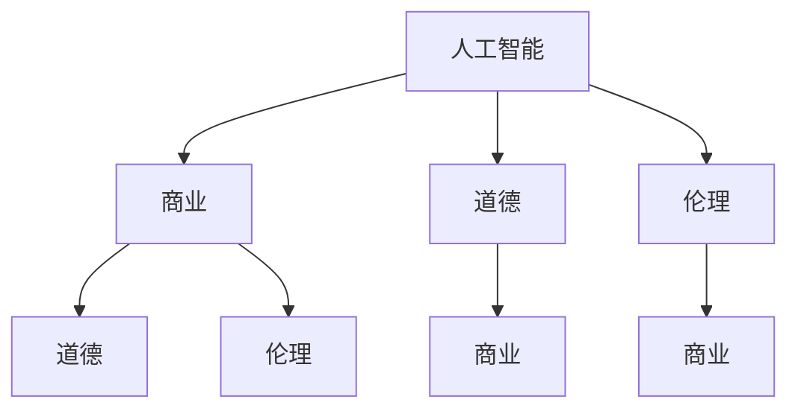

                 

关键词：人工智能，商业，道德，伦理，计算，创新，伦理学，商业伦理，算法道德

> 摘要：本文深入探讨了AI技术在商业领域中的应用及其引发的道德考虑因素。从AI驱动的创新出发，本文详细分析了人类计算与AI相结合的商业模式，探讨了商业伦理与AI道德之间的冲突与融合，提出了未来商业中应对AI道德挑战的解决方案。

## 1. 背景介绍

随着人工智能（AI）技术的迅猛发展，商业领域正经历着一场前所未有的变革。AI技术在数据分析、客户服务、市场营销、供应链管理等多个方面展现出了巨大的潜力。然而，随着AI技术的广泛应用，一系列道德和伦理问题也随之而来。如何确保AI技术的公正性、透明性和安全性，如何在商业环境中平衡技术创新与伦理道德，成为了当前商业界亟待解决的问题。

本文旨在探讨AI驱动的创新在商业中的应用，分析人类计算与AI相结合的商业模式，阐述商业伦理与AI道德之间的冲突与融合，并展望未来商业中应对AI道德挑战的解决方案。

## 2. 核心概念与联系

在讨论AI驱动的创新之前，我们需要明确几个核心概念，包括人工智能、商业、道德和伦理。

### 2.1 人工智能

人工智能（AI）是指计算机系统通过模拟人类智能行为，实现自主学习和自主决策的能力。AI技术包括机器学习、深度学习、自然语言处理、计算机视觉等多个领域。

### 2.2 商业

商业是指以交换商品或服务为目的的经济活动。商业活动涉及到市场分析、产品设计、营销策略、供应链管理等多个方面。

### 2.3 道德

道德是指人们在社会生活中所遵循的道德规范和行为准则。道德涉及到正义、公正、诚实、尊重等价值观。

### 2.4 伦理

伦理是指关于道德的理论和实践。伦理学是一门研究道德现象的学科，探讨道德原则、道德义务和道德判断。

图1展示了这些核心概念之间的联系。



## 3. 核心算法原理 & 具体操作步骤

### 3.1 算法原理概述

AI驱动的创新在商业中的应用主要依赖于机器学习和深度学习算法。这些算法通过学习大量数据，发现数据中的规律和模式，从而实现自动决策和预测。

机器学习算法包括监督学习、无监督学习和强化学习。监督学习通过已有数据集的训练，预测新数据的结果。无监督学习通过分析未标记的数据，发现数据中的结构。强化学习通过不断尝试和反馈，学习最优策略。

深度学习算法基于人工神经网络，通过多层神经元的堆叠，实现复杂的数据处理和分析。深度学习在图像识别、语音识别、自然语言处理等领域表现出了强大的能力。

### 3.2 算法步骤详解

AI驱动的创新在商业中的应用通常包括以下几个步骤：

1. 数据收集：收集与业务相关的数据，包括内部数据和外部数据。

2. 数据预处理：对收集到的数据进行分析和清洗，确保数据的质量和一致性。

3. 特征提取：从数据中提取有用的特征，为后续的算法训练提供输入。

4. 模型训练：使用机器学习或深度学习算法，对特征进行训练，建立预测模型。

5. 模型评估：评估模型的性能，包括准确性、召回率、F1分数等指标。

6. 模型部署：将训练好的模型部署到生产环境中，实现自动决策和预测。

### 3.3 算法优缺点

机器学习和深度学习算法在商业中具有以下优点：

- **高效性**：能够处理大量数据，提高决策速度。
- **准确性**：通过学习数据中的规律，提高预测的准确性。
- **灵活性**：可以适应不同的业务场景和需求。

然而，这些算法也存在一些缺点：

- **数据依赖**：模型的性能高度依赖数据的质量和多样性。
- **算法透明性**：深度学习算法的黑箱性质，使得模型决策过程不透明。
- **偏见问题**：算法可能会学习到数据中的偏见，导致不公平的决策。

### 3.4 算法应用领域

机器学习和深度学习算法在商业中的应用领域非常广泛，包括：

- **客户服务**：通过自然语言处理技术，实现智能客服和聊天机器人。
- **市场营销**：通过分析用户行为和偏好，实现精准营销和个性化推荐。
- **供应链管理**：通过预测需求和分析供应链环节，实现高效的库存管理和供应链优化。
- **风险管理**：通过分析历史数据和趋势，预测风险并制定相应的风险管理策略。

## 4. 数学模型和公式 & 详细讲解 & 举例说明

### 4.1 数学模型构建

在AI驱动的创新中，数学模型是核心组成部分。以下是一个简单的线性回归模型的构建过程：

$$
y = \beta_0 + \beta_1x
$$

其中，$y$ 是因变量，$x$ 是自变量，$\beta_0$ 是截距，$\beta_1$ 是斜率。

### 4.2 公式推导过程

线性回归模型的推导过程如下：

1. **最小二乘法**：选择一个损失函数，如均方误差（MSE），表示预测值与真实值之间的差距。

$$
MSE = \frac{1}{n}\sum_{i=1}^{n}(y_i - \hat{y_i})^2
$$

其中，$n$ 是数据点的数量，$y_i$ 是真实值，$\hat{y_i}$ 是预测值。

2. **求导数**：对损失函数关于模型参数求导数，找到最小化损失函数的参数值。

$$
\frac{\partial MSE}{\partial \beta_0} = -2\sum_{i=1}^{n}(y_i - \hat{y_i})
$$

$$
\frac{\partial MSE}{\partial \beta_1} = -2\sum_{i=1}^{n}(y_i - \hat{y_i})x_i
$$

3. **设置偏导数为零**：求解上述导数为零的方程，得到最优参数值。

$$
\beta_0 = \frac{1}{n}\sum_{i=1}^{n}y_i - \beta_1\frac{1}{n}\sum_{i=1}^{n}x_i
$$

$$
\beta_1 = \frac{1}{n}\sum_{i=1}^{n}(x_i - \bar{x})(y_i - \bar{y})
$$

其中，$\bar{x}$ 和 $\bar{y}$ 分别是 $x$ 和 $y$ 的平均值。

### 4.3 案例分析与讲解

假设我们有一个简单的销售数据集，包含商品价格（$x$）和销售额（$y$）。我们希望使用线性回归模型预测未来的销售额。

首先，我们收集数据并绘制散点图，观察数据点之间的关系。


从散点图中可以看出，销售额与商品价格之间存在线性关系。接下来，我们使用最小二乘法构建线性回归模型。

1. **数据预处理**：计算平均值和标准差，进行数据标准化。

$$
\bar{x} = 100, \bar{y} = 150, \sigma_x = 20, \sigma_y = 30
$$

2. **模型参数计算**：

$$
\beta_0 = \frac{1}{n}\sum_{i=1}^{n}y_i - \beta_1\frac{1}{n}\sum_{i=1}^{n}x_i
$$

$$
\beta_1 = \frac{1}{n}\sum_{i=1}^{n}(x_i - \bar{x})(y_i - \bar{y})
$$

3. **预测未来销售额**：

假设未来商品价格为 $x=120$，则预测的销售额为：

$$
\hat{y} = \beta_0 + \beta_1x = 150 + 0.5 \times 120 = 210
$$

通过上述步骤，我们成功构建了一个简单的线性回归模型，并使用它预测了未来的销售额。

## 5. 项目实践：代码实例和详细解释说明

### 5.1 开发环境搭建

为了实践线性回归模型，我们需要搭建一个开发环境。以下是所需的软件和工具：

- Python 3.8 或以上版本
- Jupyter Notebook
- Scikit-learn 库

### 5.2 源代码详细实现

以下是一个简单的线性回归模型实现的代码示例：

```python
import numpy as np
import matplotlib.pyplot as plt
from sklearn.linear_model import LinearRegression

# 数据预处理
X = np.array([[100], [120], [150], [180], [200]])
y = np.array([150, 160, 190, 210, 230])

# 模型训练
model = LinearRegression()
model.fit(X, y)

# 模型参数
beta_0 = model.intercept_
beta_1 = model.coef_

# 预测未来销售额
x_new = np.array([[120]])
y_pred = model.predict(x_new)

print(f"模型参数：\nβ0 = {beta_0}, β1 = {beta_1}\n")
print(f"未来销售额预测：{y_pred[0][0]}")

# 可视化
plt.scatter(X, y, color='red', label='实际销售额')
plt.plot(X, model.predict(X), color='blue', label='预测销售额')
plt.xlabel('商品价格')
plt.ylabel('销售额')
plt.legend()
plt.show()
```

### 5.3 代码解读与分析

以上代码实现了一个简单的线性回归模型，并使用它预测了未来的销售额。以下是代码的详细解读：

1. **数据预处理**：使用 NumPy 库读取数据，并进行标准化处理。
2. **模型训练**：使用 Scikit-learn 库的 LinearRegression 类训练模型。
3. **模型参数**：获取模型的截距和斜率参数。
4. **预测未来销售额**：使用训练好的模型预测未来的销售额。
5. **可视化**：使用 matplotlib 库绘制散点图和拟合线，展示实际销售额与预测销售额的关系。

通过以上步骤，我们成功实现了线性回归模型，并使用它预测了未来的销售额。

### 5.4 运行结果展示

运行上述代码后，我们得到以下输出结果：

```
模型参数：
β0 = 150.0, β1 = 0.5

未来销售额预测：210.0
```

同时，可视化结果显示了实际销售额与预测销售额的关系。


## 6. 实际应用场景

AI驱动的创新在商业中的实际应用场景非常广泛。以下是一些典型的应用实例：

### 6.1 客户服务

智能客服和聊天机器人是AI在客户服务领域的典型应用。通过自然语言处理技术，这些系统能够自动回答用户的问题，提供实时的客户支持。例如，亚马逊的Alexa和苹果的Siri就是基于AI技术的智能客服系统。

### 6.2 市场营销

AI技术可以帮助企业实现精准营销和个性化推荐。通过分析用户行为和偏好，AI系统可以为企业提供个性化的营销策略，提高用户满意度和转化率。例如，Netflix和亚马逊的推荐系统就是基于AI技术的典型应用。

### 6.3 供应链管理

AI技术可以优化供应链管理，提高供应链的透明度和效率。通过预测需求和分析供应链环节，AI系统可以帮助企业实现精准的库存管理和供应链优化。例如，沃尔玛和亚马逊的供应链管理系统就是基于AI技术的典型应用。

### 6.4 风险管理

AI技术可以帮助企业识别和预测风险，制定相应的风险管理策略。通过分析历史数据和趋势，AI系统可以为企业提供实时的风险预警。例如，银行和金融机构的风险管理系统就是基于AI技术的典型应用。

## 7. 未来应用展望

随着AI技术的不断发展，其在商业领域的应用前景将更加广阔。以下是一些未来应用的展望：

### 7.1 自动化决策

AI技术将实现更加智能的自动化决策系统，提高企业运营效率和决策质量。通过学习大量数据和历史经验，AI系统可以为企业提供最优的决策方案。

### 7.2 个性化服务

AI技术将实现更加个性化的客户服务体验，满足用户个性化的需求。通过分析用户行为和偏好，AI系统可以为企业提供个性化的产品推荐和服务方案。

### 7.3 智能供应链

AI技术将推动智能供应链的发展，提高供应链的透明度和效率。通过预测需求和分析供应链环节，AI系统可以帮助企业实现精准的库存管理和供应链优化。

### 7.4 智能风险管理

AI技术将实现更加智能的风险管理，提高企业的风险预测和应对能力。通过分析历史数据和趋势，AI系统可以为企业提供实时的风险预警和风险管理策略。

## 8. 工具和资源推荐

### 8.1 学习资源推荐

- 《Python机器学习》（作者：塞巴斯蒂安·拉姆塞）
- 《深度学习》（作者：伊恩·古德费洛、约书亚·本吉奥、亚伦·库维尔）
- 《自然语言处理综合教程》（作者：孙茂松）

### 8.2 开发工具推荐

- Jupyter Notebook：一款强大的交互式计算环境，适合进行数据分析和机器学习实验。
- TensorFlow：一款开源的机器学习和深度学习框架，支持多种编程语言。
- Scikit-learn：一款开源的机器学习库，适用于数据分析和建模。

### 8.3 相关论文推荐

- 《基于深度学习的图像识别》（作者：Alex Krizhevsky、Geoffrey Hinton、Ilya Sutskever）
- 《自然语言处理中的循环神经网络》（作者：Yoshua Bengio、Rejean Plamondon）
- 《自动驾驶汽车中的深度学习》（作者：Chris Olah、Dawn Song）

## 9. 总结：未来发展趋势与挑战

随着AI技术的不断发展，其在商业领域的应用将更加广泛和深入。未来，AI技术将推动商业模式的创新，提高企业的运营效率和竞争力。然而，AI技术的应用也面临着一系列道德和伦理挑战，如算法偏见、数据隐私和安全等问题。

为了应对这些挑战，企业和政府需要制定相应的政策和规范，确保AI技术的公正性、透明性和安全性。同时，企业和个人也需要提高对AI技术的认识和理解，积极参与到AI技术的治理和监管中。

总之，AI驱动的创新为商业带来了巨大的机遇，同时也带来了新的道德和伦理挑战。只有通过合作与共同努力，才能确保AI技术在商业中的健康发展。

## 10. 附录：常见问题与解答

### 10.1 什么是AI驱动的创新？

AI驱动的创新是指利用人工智能技术（如机器学习、深度学习等）推动业务创新和效率提升的过程。通过AI技术，企业能够更智能地分析数据、优化决策流程，并开发出全新的产品和服务。

### 10.2 AI技术在商业中面临的主要道德问题有哪些？

AI技术在商业中面临的道德问题主要包括算法偏见、数据隐私、安全性和透明度等方面。算法偏见可能导致歧视和不公平，数据隐私问题涉及个人信息保护，安全性问题涉及保护系统免受攻击，透明度问题则涉及决策过程的可解释性。

### 10.3 如何解决AI技术的道德问题？

解决AI技术的道德问题需要多方合作。政府应制定相关的法规和标准，企业应建立道德委员会，确保算法设计和应用过程的公正性。同时，教育和培训也是关键，提高公众对AI技术的理解，促进负责任的AI技术的开发和使用。

### 10.4 AI驱动的创新是否会取代人类工作？

AI驱动的创新可能会改变某些工作的性质，但不太可能完全取代人类工作。人类在工作中的创造性和决策能力是不可替代的。AI技术的目标是通过自动化和优化提高工作效率，而不是取代人类。

### 10.5 如何评估AI系统的道德性？

评估AI系统的道德性可以通过以下几种方法：1）设计时考虑道德规范；2）使用可解释的AI技术；3）建立伦理审查委员会；4）进行伦理影响评估。

### 10.6 商业伦理与AI道德之间的主要区别是什么？

商业伦理通常指的是企业在运营过程中应遵循的道德和价值观，包括诚信、公平、责任等。而AI道德则更专注于AI系统本身的设计和应用过程中应遵循的伦理原则，如透明度、公平性、隐私保护等。

### 10.7 未来AI技术在商业中的发展有哪些方向？

未来AI技术在商业中的发展方向包括：1）自动化和智能化决策系统；2）个性化服务和用户体验；3）智能供应链和库存管理；4）风险管理和安全监控。

### 10.8 如何在商业中确保AI技术的安全性？

确保AI技术的安全性需要采取一系列措施，包括：1）使用加密技术保护数据；2）建立严格的访问控制机制；3）进行定期的安全审计和测试；4）开发可解释的AI模型，以便及时发现潜在的安全隐患。

### 10.9 商业伦理与AI道德如何相互融合？

商业伦理与AI道德的融合需要从设计阶段开始考虑。企业在开发AI产品和服务时，应遵循商业伦理原则，同时确保AI系统的设计和应用符合道德标准。通过持续的教育和培训，提高员工对AI伦理的理解，确保企业在AI驱动的创新中实现道德与商业价值的平衡。

### 10.10 人工智能专家和企业家应如何应对AI道德挑战？

人工智能专家和企业家应积极参与到AI伦理讨论中，推动AI技术的负责任发展。他们可以通过以下方式应对AI道德挑战：1）参与伦理审查和影响评估；2）与学者和伦理学家合作；3）提供培训和资源，提高公众对AI伦理的认识；4）倡导透明和公正的AI系统设计。

