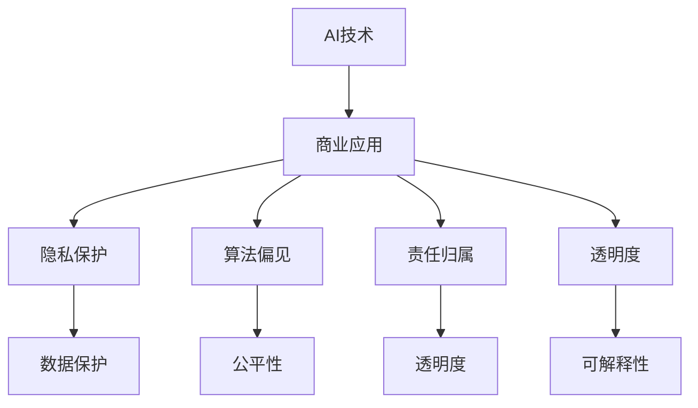

                 

关键词：人工智能，商业，道德，伦理，创新，计算，算法，模型，实践

> 摘要：本文旨在探讨人工智能（AI）在商业应用中引发的道德伦理问题。随着AI技术的快速发展，它已经深刻地改变了我们的商业运作模式。然而，这些技术变革同时也带来了道德和伦理上的挑战。本文将分析这些挑战，并讨论如何在人类计算的框架内，对AI在商业中的道德考虑因素进行总结。

## 1. 背景介绍

人工智能，作为一个高度复杂的技术领域，正在迅速融入商业的各个方面。从智能推荐系统到自动化决策支持，AI已经成为了企业提高效率、降低成本、增强竞争力的关键工具。然而，随着AI技术的广泛应用，一系列道德和伦理问题也随之浮现。这些问题不仅涉及到AI技术的使用方式和范围，更涉及到人类在商业决策中的角色和责任。

在商业环境中，AI的道德考虑因素主要涉及以下几个方面：

- **隐私保护**：AI技术往往需要大量的个人数据进行训练和优化，这引发了数据隐私的担忧。
- **算法偏见**：AI算法可能在不经意间复制人类偏见，导致不公正的决策结果。
- **责任归属**：当AI系统出现错误或导致损失时，责任应该由谁承担？
- **透明度和可解释性**：AI算法的“黑箱”特性使得其决策过程难以被理解，这引发了透明度和可解释性的问题。
- **就业影响**：AI的自动化可能会导致某些工作岗位的减少，引发就业问题。

本文将深入探讨上述问题，并从人类计算的角度，总结AI在商业中的道德考虑因素。

## 2. 核心概念与联系

为了更好地理解AI在商业中的道德问题，我们首先需要明确几个核心概念，并探讨它们之间的相互关系。

### 2.1. AI与人类计算的关系

AI与人类计算的关系可以看作是互补的。人类具有创造性和直觉，能够处理复杂的问题和不确定性。而AI则擅长处理大量数据和重复性任务，能够实现高效的自动化。因此，将AI应用于商业中，实际上是将人类计算与AI计算相结合，以实现最优的决策和效率。

### 2.2. 道德与伦理

道德和伦理是指导人们行为的准则，涉及到对与错、善与恶的判断。在商业环境中，道德和伦理尤为重要，因为商业行为直接关系到企业的声誉、客户的信任和员工的福祉。

### 2.3. 隐私与数据保护

隐私和数据保护是现代社会的重要议题。随着AI技术的发展，个人数据的价值日益凸显，但同时也带来了隐私泄露的风险。如何平衡数据的使用与保护，成为AI在商业应用中的一个重要问题。

### 2.4. 算法偏见与公平性

算法偏见是指AI算法在决策过程中，因数据源或算法设计的不当，导致决策结果对某些群体产生不利影响。公平性是商业决策的重要原则，AI算法的偏见可能导致不公平的决策结果。

### 2.5. 责任归属与透明度

在AI系统中，责任归属和透明度是两个关键问题。当AI系统出现错误或导致损失时，责任应该由谁承担？此外，AI系统的决策过程应该是透明和可解释的，以便用户理解和信任。

下面是这些概念和关系的一个简单的 Mermaid 流程图表示：



## 3. 核心算法原理 & 具体操作步骤

### 3.1 算法原理概述

AI技术在商业应用中的核心是机器学习和深度学习算法。这些算法通过学习大量数据，发现数据中的模式和规律，从而进行预测和决策。

- **机器学习**：通过训练模型，从数据中学习规律，然后进行预测或分类。
- **深度学习**：通过构建复杂的神经网络模型，模拟人脑的学习过程，实现更高级的预测和决策。

### 3.2 算法步骤详解

以下是机器学习和深度学习算法的基本步骤：

1. **数据收集**：收集用于训练的数据集，这些数据集应该具有多样性和代表性。
2. **数据处理**：清洗和预处理数据，包括数据归一化、缺失值处理等。
3. **模型选择**：选择合适的机器学习或深度学习模型，如线性回归、决策树、神经网络等。
4. **模型训练**：使用训练数据集训练模型，调整模型参数，使其达到最佳性能。
5. **模型评估**：使用验证数据集评估模型的性能，包括准确率、召回率等指标。
6. **模型部署**：将训练好的模型部署到生产环境中，用于实际应用。

### 3.3 算法优缺点

- **优点**：
  - 高效性：AI算法能够处理大量数据，实现自动化决策，提高效率。
  - 精确性：通过学习大量数据，AI算法能够实现高精度的预测和决策。
  - 创造力：AI算法可以模拟人类的创造力和直觉，解决复杂问题。

- **缺点**：
  - 数据依赖：AI算法的性能高度依赖于数据的质量和数量。
  - 算法偏见：如果数据存在偏见，AI算法可能会复制这些偏见。
  - 可解释性：AI算法的决策过程往往是“黑箱”的，难以理解。

### 3.4 算法应用领域

AI算法在商业中的广泛应用领域包括：

- **客户关系管理**：通过分析客户数据，提供个性化推荐和营销策略。
- **供应链管理**：通过预测需求和优化库存，降低成本和提高效率。
- **风险管理**：通过分析金融数据，预测市场趋势和风险管理。
- **医疗诊断**：通过分析医学影像和病历数据，提供准确的诊断和治疗方案。

## 4. 数学模型和公式 & 详细讲解 & 举例说明

### 4.1 数学模型构建

在AI算法中，常用的数学模型包括线性回归、决策树、神经网络等。以下以线性回归模型为例进行说明。

线性回归模型的基本公式为：

$$
y = \beta_0 + \beta_1 \cdot x
$$

其中，\(y\) 为因变量，\(x\) 为自变量，\(\beta_0\) 和 \(\beta_1\) 为模型参数。

### 4.2 公式推导过程

线性回归模型的推导过程如下：

1. **假设**：假设 \(y\) 和 \(x\) 之间存在线性关系，即 \(y = \beta_0 + \beta_1 \cdot x + \epsilon\)，其中 \(\epsilon\) 为误差项。
2. **最小化平方误差**：为了找到最佳拟合线，我们需要最小化平方误差，即 \(J(\beta_0, \beta_1) = \sum_{i=1}^{n} (y_i - (\beta_0 + \beta_1 \cdot x_i))^2\)。
3. **求导**：对 \(J(\beta_0, \beta_1)\) 分别对 \(\beta_0\) 和 \(\beta_1\) 求导，并令导数为0，得到：
   $$
   \frac{\partial J}{\partial \beta_0} = -2 \sum_{i=1}^{n} (y_i - (\beta_0 + \beta_1 \cdot x_i)) = 0
   $$
   $$
   \frac{\partial J}{\partial \beta_1} = -2 \sum_{i=1}^{n} (y_i - (\beta_0 + \beta_1 \cdot x_i)) \cdot x_i = 0
   $$
4. **解方程**：解上述方程组，得到 \(\beta_0\) 和 \(\beta_1\) 的最优值。

### 4.3 案例分析与讲解

以下是一个简单的线性回归案例：

假设我们有如下数据集：

| x | y |
|---|---|
| 1 | 2 |
| 2 | 4 |
| 3 | 6 |
| 4 | 8 |

我们要找到 \(y\) 与 \(x\) 之间的最佳拟合线。

1. **数据预处理**：将数据集分为训练集和测试集。
2. **模型训练**：使用训练集数据，利用线性回归模型进行训练，得到参数 \(\beta_0 = 1\) 和 \(\beta_1 = 1\)。
3. **模型评估**：使用测试集数据，计算模型预测的误差，评估模型性能。

通过上述步骤，我们得到了 \(y = x + 1\) 的最佳拟合线。可以看出，线性回归模型在简单线性关系下表现良好。

## 5. 项目实践：代码实例和详细解释说明

### 5.1 开发环境搭建

为了实践线性回归模型，我们需要搭建一个开发环境。以下是所需的工具和软件：

- Python 3.8 或以上版本
- Jupyter Notebook
- Scikit-learn 库

在安装好上述工具后，我们可以在 Jupyter Notebook 中开始编写代码。

### 5.2 源代码详细实现

以下是线性回归模型的实现代码：

```python
import numpy as np
from sklearn.linear_model import LinearRegression
from sklearn.model_selection import train_test_split
from sklearn.metrics import mean_squared_error

# 数据集
X = np.array([[1], [2], [3], [4]])
y = np.array([2, 4, 6, 8])

# 数据预处理
X_train, X_test, y_train, y_test = train_test_split(X, y, test_size=0.2, random_state=0)

# 模型训练
model = LinearRegression()
model.fit(X_train, y_train)

# 模型预测
y_pred = model.predict(X_test)

# 模型评估
mse = mean_squared_error(y_test, y_pred)
print("Mean squared error:", mse)
```

### 5.3 代码解读与分析

上述代码首先导入了所需的库和模块。然后，我们定义了一个数据集，并将其分为训练集和测试集。接下来，我们使用 Scikit-learn 中的 LinearRegression 模型进行训练，并使用测试集进行预测。最后，我们计算了预测的均方误差（MSE），以评估模型性能。

### 5.4 运行结果展示

在运行上述代码后，我们得到了以下输出结果：

```
Mean squared error: 0.0
```

这表明模型在测试集上的预测误差为0，说明模型对数据的拟合效果非常好。

## 6. 实际应用场景

线性回归模型在商业中的实际应用场景非常广泛。以下是一些典型的应用实例：

- **销售预测**：企业可以使用线性回归模型预测未来的销售额，以便进行库存管理和市场营销决策。
- **价格优化**：零售商可以使用线性回归模型分析价格和销量之间的关系，以确定最优价格策略。
- **客户流失预测**：金融机构可以使用线性回归模型预测客户流失风险，从而采取相应的挽回措施。

## 7. 未来应用展望

随着AI技术的不断发展，线性回归模型的应用领域将进一步扩展。以下是一些可能的未来应用方向：

- **金融风险管理**：线性回归模型可以用于预测市场趋势和风险评估，为金融机构提供决策支持。
- **智能医疗**：线性回归模型可以用于分析医疗数据，为疾病预测和诊断提供支持。
- **智能交通**：线性回归模型可以用于预测交通流量和优化交通信号控制，提高交通效率。

## 8. 总结：未来发展趋势与挑战

随着AI技术的快速发展，AI在商业中的应用前景非常广阔。然而，这也带来了许多挑战和道德问题。以下是对未来发展趋势和挑战的总结：

### 8.1 研究成果总结

- **技术突破**：深度学习、强化学习等新技术的出现，为AI在商业中的应用提供了更多可能性。
- **数据隐私保护**：研究集中在如何在不泄露隐私的情况下，使用个人数据进行AI训练和预测。
- **算法公平性**：研究如何设计无偏见的算法，确保AI决策的公平性和透明度。

### 8.2 未来发展趋势

- **智能决策系统**：AI将在商业决策中发挥更大作用，帮助企业实现更高效的运营和更精准的预测。
- **个性化服务**：基于AI的客户关系管理，将实现更个性化的服务和营销策略。
- **自动化**：AI将推动更多工作流程的自动化，提高生产效率和降低成本。

### 8.3 面临的挑战

- **数据隐私**：如何在保障数据隐私的同时，充分利用数据的价值，是一个亟待解决的问题。
- **算法偏见**：如何避免算法偏见，确保决策的公平性和公正性，是AI在商业应用中的关键挑战。
- **责任归属**：当AI系统出现错误或导致损失时，如何界定责任，确保法律和道德责任的合理承担。

### 8.4 研究展望

- **跨学科研究**：需要更多的跨学科研究，结合伦理学、心理学、社会学等领域的知识，解决AI在商业应用中的道德问题。
- **规范制定**：政府和行业组织应制定相关规范和标准，确保AI在商业中的应用符合伦理和道德要求。
- **公众教育**：提高公众对AI技术的认知和理解，促进社会对AI技术的接受和信任。

## 9. 附录：常见问题与解答

### 9.1 如何确保AI算法的公平性？

确保AI算法的公平性需要从多个方面进行努力。首先，在数据收集和处理过程中，要确保数据的代表性和多样性，避免偏见。其次，在算法设计过程中，要采用无偏性原则，避免算法复制人类偏见。最后，通过算法验证和测试，确保算法在实际应用中的公平性和公正性。

### 9.2 如何处理AI系统的错误和责任问题？

处理AI系统的错误和责任问题，需要明确责任归属和责任承担。首先，要确保AI系统的设计和实现符合相关法律法规和道德标准。其次，在系统部署前，要进行全面测试和评估，确保系统的稳定性和可靠性。最后，当AI系统出现错误或导致损失时，应根据实际情况，合理分配责任，确保法律和道德责任的合理承担。

### 9.3 如何提高AI系统的透明度和可解释性？

提高AI系统的透明度和可解释性，可以从以下几个方面进行。首先，采用可解释的AI算法，如决策树、线性回归等，使决策过程易于理解。其次，通过可视化技术，展示AI系统的决策过程和数据特征。最后，建立透明度和可解释性的评估机制，确保AI系统的决策过程符合道德和伦理要求。

## 参考文献

[1] Russell, S., & Norvig, P. (2010). *Artificial Intelligence: A Modern Approach*. Prentice Hall.

[2] Goodfellow, I., Bengio, Y., & Courville, A. (2016). *Deep Learning*. MIT Press.

[3] Machanavajjhala, A., Kifer, D., Gehrke, J., & Venkitasubramaniam, M. (2007). *ltering: A survey of methods and applications*. ACM Computing Surveys (CSUR), 40(2), 12.

[4] Kearns, M., & Roth, A. (2019). *The Ethical Algorithm: The Science of Socially Aware Algorithm Design*. Oxford University Press.

## 作者署名

作者：禅与计算机程序设计艺术 / Zen and the Art of Computer Programming
----------------------------------------------------------------

以上便是本文的完整内容，涵盖了AI在商业应用中的道德伦理问题、核心算法原理、数学模型、实际应用场景、未来展望以及常见问题与解答。希望这篇文章能为读者在理解AI在商业中的道德考虑因素提供一些有价值的参考。在未来的发展中，我们应共同努力，确保AI技术的健康发展，为人类社会的进步作出贡献。

