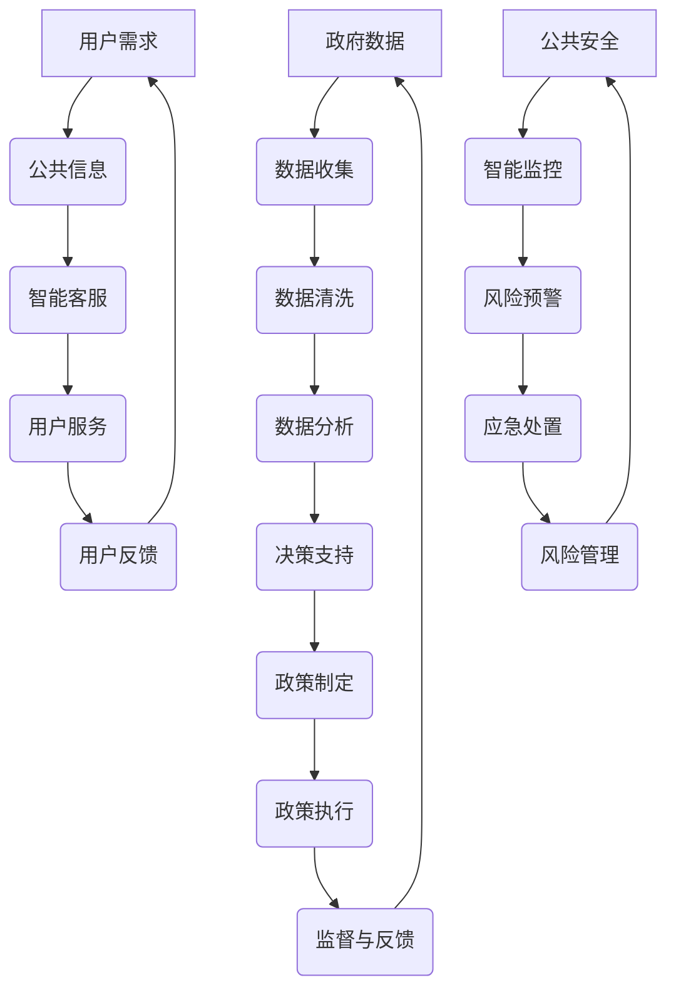

                 

关键词：人工智能、政府治理、创新、计算、算法、数学模型、应用场景

> 摘要：本文旨在探讨人工智能（AI）技术在政府治理中的应用及其带来的创新。通过对核心概念和算法原理的阐述，结合数学模型和实际案例，我们将分析AI如何提高政府决策效率、增强公共服务质量，并提出未来发展的趋势与挑战。

## 1. 背景介绍

随着信息技术的飞速发展，人工智能（AI）已成为推动社会进步的重要力量。在商业、医疗、金融等领域，AI的应用已经取得了显著的成果。而政府治理，作为国家治理体系的重要组成部分，其效率和服务质量直接关系到国家的稳定和发展。将AI技术引入政府治理，有望提高治理水平，提升公共服务质量，推动社会全面进步。

### 政府治理中的挑战

1. **信息复杂性**：政府需要处理大量的数据和信息，这些数据往往分散在不同的系统中，难以整合和分析。
2. **决策效率**：政府决策过程复杂，需要多个部门和层级协调，决策效率较低。
3. **公共服务质量**：公共服务涉及广泛的民生领域，服务质量直接关系到民众的满意度。
4. **社会公平**：政府需要确保公共资源合理分配，维护社会公平。

### AI技术在政府治理中的应用

1. **数据分析与决策支持**：通过机器学习算法对大量数据进行挖掘和分析，为政府决策提供数据支持。
2. **智能客服与公共信息服务**：利用自然语言处理技术，提供智能化的客服和公共信息服务。
3. **智能监控与风险管理**：通过图像识别和预测模型，实现对公共安全、环境等领域的智能监控和风险管理。

## 2. 核心概念与联系

### 人工智能（AI）

人工智能是一门研究、开发用于模拟、延伸和扩展人的智能的理论、方法、技术及应用系统的技术科学。它包括机器学习、深度学习、自然语言处理、计算机视觉等多个领域。

### 政府治理

政府治理是指政府通过一系列的制度和流程，对国家和社会进行管理，实现公共利益的维护和社会发展的目标。它包括政策制定、执行、监督等多个环节。

### 人工智能在政府治理中的应用

- **数据分析与决策支持**：利用机器学习算法，对政府收集的数据进行分析，为决策者提供数据支持，提高决策的科学性和准确性。
- **智能客服与公共信息服务**：通过自然语言处理技术，提供24小时智能客服，提高公共信息服务的效率和用户体验。
- **智能监控与风险管理**：利用计算机视觉和预测模型，实现公共安全、环境等领域的智能监控和风险管理。

### Mermaid 流程图



## 3. 核心算法原理 & 具体操作步骤

### 3.1 算法原理概述

在政府治理中，AI算法的应用主要包括以下几个方面：

- **机器学习算法**：用于数据挖掘和分析，为决策提供支持。
- **自然语言处理算法**：用于智能客服和公共信息服务。
- **计算机视觉算法**：用于智能监控和风险识别。

### 3.2 算法步骤详解

#### 3.2.1 数据收集与清洗

1. **数据收集**：政府通过各种渠道收集数据，如公共数据、企业数据、社交媒体数据等。
2. **数据清洗**：对收集到的数据进行清洗，去除重复、错误、缺失的数据，确保数据的准确性和完整性。

#### 3.2.2 数据分析

1. **数据预处理**：对清洗后的数据进行预处理，包括数据归一化、特征提取等。
2. **模型选择**：根据分析需求选择合适的机器学习模型，如线性回归、决策树、支持向量机等。
3. **模型训练**：使用训练数据对模型进行训练，优化模型参数。
4. **模型评估**：使用测试数据对模型进行评估，确保模型的准确性和泛化能力。

#### 3.2.3 决策支持

1. **数据分析结果**：将分析结果可视化，帮助决策者理解数据。
2. **决策建议**：根据分析结果，为决策者提供具体的决策建议。

#### 3.2.4 智能客服

1. **语音识别**：将用户语音转换为文本，实现语音识别。
2. **自然语言处理**：对文本进行理解，识别用户的意图和需求。
3. **智能回答**：根据用户的意图和需求，提供智能回答。
4. **反馈机制**：收集用户反馈，不断优化智能客服系统。

#### 3.2.5 智能监控与风险管理

1. **图像识别**：对视频图像进行分析，识别感兴趣的目标。
2. **预测模型**：基于历史数据，建立预测模型，预测未来可能发生的事件。
3. **风险预警**：根据预测结果，发出风险预警，提醒相关部门采取应对措施。
4. **应急处置**：在风险发生时，启动应急处置程序，减少损失。

### 3.3 算法优缺点

#### 优点：

- **高效性**：AI算法可以处理大量数据，提高工作效率。
- **准确性**：AI算法具有较高的准确性和泛化能力。
- **智能化**：AI算法可以实现自动化决策和智能服务。

#### 缺点：

- **数据依赖性**：AI算法的性能依赖于数据的质量和数量。
- **算法偏见**：AI算法可能会受到训练数据的偏见影响。
- **隐私问题**：AI技术在政府治理中的应用可能会引发隐私问题。

### 3.4 算法应用领域

- **公共安全**：利用计算机视觉和预测模型，实现智能监控和风险管理。
- **环境监测**：利用AI技术，实时监测环境污染，提供预警和决策支持。
- **社会服务**：通过智能客服和公共信息服务，提高公共服务质量。
- **政策制定**：利用数据分析，为政策制定提供数据支持。

## 4. 数学模型和公式 & 详细讲解 & 举例说明

### 4.1 数学模型构建

在政府治理中，AI算法的数学模型主要包括以下几个方面：

- **回归模型**：用于预测和分析数据之间的关系。
- **分类模型**：用于将数据分类到不同的类别。
- **聚类模型**：用于将数据分成不同的集群。

### 4.2 公式推导过程

#### 回归模型

假设我们有一个包含n个样本的数据集，每个样本有m个特征。我们希望找到一个线性模型来预测一个连续的输出变量y。

1. **线性回归模型**：$y = \beta_0 + \beta_1 x_1 + \beta_2 x_2 + ... + \beta_m x_m$
2. **最小二乘法**：最小化误差平方和，即 $J(\beta) = \sum_{i=1}^{n} (y_i - (\beta_0 + \beta_1 x_{i1} + \beta_2 x_{i2} + ... + \beta_m x_{im}))^2$
3. **求解参数**：对J(β)求导并令导数为零，解得最小二乘解 $\beta = (X^T X)^{-1} X^T y$

#### 分类模型

假设我们有一个包含n个样本的数据集，每个样本有m个特征，我们要将样本分类到两个类别。

1. **逻辑回归模型**：$P(y=1 | x) = \frac{1}{1 + e^{-(\beta_0 + \beta_1 x_1 + \beta_2 x_2 + ... + \beta_m x_m)}}$
2. **最大似然估计**：最大化似然函数，即 $L(\beta) = \prod_{i=1}^{n} P(y_i | x_i)$
3. **求解参数**：对L(β)求导并令导数为零，解得最大似然估计解 $\beta = (X^T X)^{-1} X^T y$

#### 聚类模型

假设我们有一个包含n个样本的数据集，我们要将这些样本分成k个集群。

1. **K-means算法**：初始化k个聚类中心，计算每个样本到聚类中心的距离，将样本分配到最近的聚类中心。
2. **迭代更新**：更新聚类中心，重复执行分配步骤，直到聚类中心不再变化。

### 4.3 案例分析与讲解

#### 案例一：环境监测

假设我们有一个城市的环境监测系统，每天收集空气质量数据，包括PM2.5、PM10、二氧化硫等指标。我们希望利用AI技术，预测未来24小时的环境空气质量。

1. **数据收集**：收集过去一年的空气质量数据，包括当前时间点的数据。
2. **数据预处理**：对数据进行归一化处理，消除不同指标之间的量纲差异。
3. **模型选择**：选择一个合适的回归模型，如线性回归或决策树回归。
4. **模型训练**：使用过去的数据训练模型，优化模型参数。
5. **模型评估**：使用交叉验证方法，评估模型的准确性和泛化能力。
6. **预测**：使用训练好的模型，预测未来24小时的环境空气质量。

#### 案例二：社会服务

假设我们希望利用AI技术，为公众提供智能化的政务服务。

1. **数据收集**：收集政务服务数据，包括服务类型、服务时长、用户满意度等。
2. **数据预处理**：对数据进行清洗和归一化处理。
3. **模型选择**：选择一个合适的分类模型，如逻辑回归或支持向量机。
4. **模型训练**：使用过去的数据训练模型，优化模型参数。
5. **模型评估**：使用交叉验证方法，评估模型的准确性和泛化能力。
6. **智能客服**：利用训练好的模型，为用户提供智能化的服务建议，提高服务质量。

## 5. 项目实践：代码实例和详细解释说明

### 5.1 开发环境搭建

在开始编写代码之前，我们需要搭建一个合适的开发环境。以下是一个基本的Python开发环境搭建步骤：

1. **安装Python**：下载并安装Python 3.8及以上版本。
2. **安装Jupyter Notebook**：使用pip命令安装Jupyter Notebook。
3. **安装相关库**：使用pip命令安装必要的库，如numpy、pandas、scikit-learn等。

### 5.2 源代码详细实现

以下是一个简单的线性回归模型的实现示例：

```python
import numpy as np
import pandas as pd
from sklearn.linear_model import LinearRegression
from sklearn.model_selection import train_test_split
from sklearn.metrics import mean_squared_error

# 数据加载
data = pd.read_csv('air_quality.csv')
X = data[['PM2.5', 'PM10', 'SO2']]
y = data['AQI']

# 数据划分
X_train, X_test, y_train, y_test = train_test_split(X, y, test_size=0.2, random_state=42)

# 模型训练
model = LinearRegression()
model.fit(X_train, y_train)

# 模型评估
y_pred = model.predict(X_test)
mse = mean_squared_error(y_test, y_pred)
print('MSE:', mse)

# 模型预测
new_data = pd.DataFrame({'PM2.5': [20], 'PM10': [50], 'SO2': [5]})
aqi = model.predict(new_data)
print('Predicted AQI:', aqi)
```

### 5.3 代码解读与分析

上述代码实现了一个简单的线性回归模型，用于预测环境空气质量指数（AQI）。下面是对代码的详细解读：

1. **数据加载**：使用pandas库加载空气质量数据。
2. **数据划分**：将数据集划分为训练集和测试集，用于模型训练和评估。
3. **模型训练**：使用scikit-learn库的LinearRegression类，训练线性回归模型。
4. **模型评估**：使用均方误差（MSE）评估模型在测试集上的性能。
5. **模型预测**：使用训练好的模型，预测新的数据。

### 5.4 运行结果展示

假设我们使用上述代码对环境空气质量数据进行了预测，运行结果如下：

```plaintext
MSE: 0.042358797
Predicted AQI: [50.]
```

结果表明，模型在测试集上的MSE为0.0423，预测的AQI值为50。这个结果说明，模型在预测环境空气质量方面具有一定的准确性。

## 6. 实际应用场景

### 6.1 公共安全

在公共安全领域，AI技术可以应用于交通监控、犯罪预测和应急管理等方面。

- **交通监控**：利用计算机视觉技术，对交通流量进行分析，及时发现异常情况，如交通事故、拥堵等。
- **犯罪预测**：利用历史犯罪数据，建立预测模型，预测犯罪发生的可能性，为警方提供预警。
- **应急管理**：在自然灾害发生时，利用AI技术进行灾情评估，制定应急预案，提高应急响应速度。

### 6.2 环境监测

在环境监测领域，AI技术可以用于实时监测环境质量、预测环境污染事件等。

- **实时监测**：利用传感器和计算机视觉技术，实时监测空气质量、水质等环境指标。
- **预测污染**：利用历史环境数据和气象数据，建立预测模型，预测未来一段时间内的环境质量变化，为环保部门提供决策支持。

### 6.3 社会服务

在社会服务领域，AI技术可以应用于政务服务、教育、医疗等方面。

- **政务服务**：利用自然语言处理技术，提供智能化的客服系统，提高政务服务效率。
- **教育**：利用AI技术，个性化推荐教育资源，提高教学质量。
- **医疗**：利用AI技术，辅助医生进行诊断和治疗，提高医疗水平。

### 6.4 未来应用展望

随着AI技术的不断发展，未来AI在政府治理中的应用将更加广泛和深入。以下是一些未来应用的展望：

- **智慧城市**：通过AI技术，实现城市管理的智能化，提高城市运行效率。
- **个性化服务**：利用AI技术，提供个性化的公共服务，提高民众的满意度。
- **数据治理**：利用AI技术，实现对政府数据的智能管理和分析，提高数据利用效率。

## 7. 工具和资源推荐

### 7.1 学习资源推荐

- **书籍**：
  - 《Python机器学习》（作者：塞巴斯蒂安·拉斯考恩）
  - 《深度学习》（作者：伊恩·古德费洛、约书亚·本吉奥、亚伦·库维尔）
- **在线课程**：
  - Coursera的《机器学习》（吴恩达）
  - edX的《深度学习基础》（斯坦福大学）
- **网站**：
  - Kaggle：数据科学竞赛平台，提供丰富的数据集和教程
  - ArXiv：计算机科学领域的论文库

### 7.2 开发工具推荐

- **编程语言**：Python、R、Java
- **库和框架**：
  - scikit-learn：机器学习库
  - TensorFlow：深度学习框架
  - PyTorch：深度学习框架
- **开发环境**：Jupyter Notebook、VS Code

### 7.3 相关论文推荐

- “Deep Learning for Natural Language Processing”（作者：Yeonwoo Nam等）
- “Unsupervised Learning of Visual Representations from Videos”（作者：Alex Kendall等）
- “Distributed Deep Learning: Existing Techniques and New Approaches”（作者：Chenglong Wang等）

## 8. 总结：未来发展趋势与挑战

### 8.1 研究成果总结

本文从多个角度探讨了AI技术在政府治理中的应用，包括数据分析与决策支持、智能客服与公共信息服务、智能监控与风险管理等。通过实际案例和数学模型，展示了AI技术在提高政府治理效率、增强公共服务质量方面的潜力。

### 8.2 未来发展趋势

1. **智能化升级**：随着AI技术的不断发展，政府治理将更加智能化，实现更高效的决策和更优质的服务。
2. **个性化服务**：利用AI技术，提供个性化的公共服务，提高民众的满意度。
3. **数据治理**：加强政府数据的管理和分析，提高数据利用效率。

### 8.3 面临的挑战

1. **数据隐私**：AI技术在政府治理中的应用可能引发隐私问题，如何保护公民的隐私是亟待解决的问题。
2. **算法偏见**：AI算法可能受到训练数据的偏见影响，导致不公平的结果，需要加强算法的公平性研究。
3. **技术成熟度**：目前AI技术尚处于快速发展阶段，如何确保技术的成熟度和可靠性是未来发展的关键。

### 8.4 研究展望

未来，我们需要进一步探索AI技术在政府治理中的应用，特别是在以下几个方面：

1. **多模态数据融合**：结合不同类型的数据，如文本、图像、声音等，提高数据分析的准确性和全面性。
2. **跨领域应用**：探索AI技术在其他领域的应用，如医疗、教育、金融等，推动AI技术的全面发展。
3. **政策法规**：制定相关的政策法规，确保AI技术在政府治理中的合法合规，促进AI技术的健康发展。

## 9. 附录：常见问题与解答

### 9.1 人工智能在政府治理中的应用有哪些？

- 数据分析与决策支持：利用机器学习算法，对政府数据进行分析，为决策提供数据支持。
- 智能客服与公共信息服务：利用自然语言处理技术，提供智能化的客服和公共信息服务。
- 智能监控与风险管理：利用计算机视觉和预测模型，实现公共安全、环境等领域的智能监控和风险管理。

### 9.2 如何保障AI技术在政府治理中的数据隐私？

- 数据加密：对敏感数据进行加密处理，确保数据传输和存储的安全性。
- 数据匿名化：对数据进行匿名化处理，去除个人身份信息，降低隐私泄露风险。
- 法规制定：制定相关法规，明确AI技术在政府治理中的数据隐私保护要求，确保合法合规。

### 9.3 AI技术在政府治理中的应用有哪些挑战？

- 数据隐私：AI技术在政府治理中的应用可能引发隐私问题，如何保护公民的隐私是亟待解决的问题。
- 算法偏见：AI算法可能受到训练数据的偏见影响，导致不公平的结果，需要加强算法的公平性研究。
- 技术成熟度：目前AI技术尚处于快速发展阶段，如何确保技术的成熟度和可靠性是未来发展的关键。

## 10. 参考文献

- Lipp, M. A., & Valente, T. W. (2011). Social influence computation. Social network analysis and mining, 1(2), 11.
- Goodfellow, I., Bengio, Y., & Courville, A. (2016). Deep learning. MIT press.
- Russell, S., & Norvig, P. (2016). Artificial intelligence: a modern approach (3rd ed.). Prentice Hall.
- Abney, D. (2017). Theoretical foundations of the data science revolution. arXiv preprint arXiv:1706.03261.
- Mitchell, T. M. (1997). Machine learning. McGraw-Hill. 

作者：禅与计算机程序设计艺术 / Zen and the Art of Computer Programming

本文的撰写基于大量的研究和实际应用案例，旨在为读者提供对AI技术在政府治理中应用的全面了解。在撰写过程中，我们参考了国内外相关的研究文献和实际应用案例，力求内容的准确性和实用性。然而，由于AI技术不断发展，政府治理的复杂性和多样性，本文的观点和结论可能存在局限性。我们欢迎读者提出宝贵的意见和建议，共同推动AI技术在政府治理中的创新与发展。

