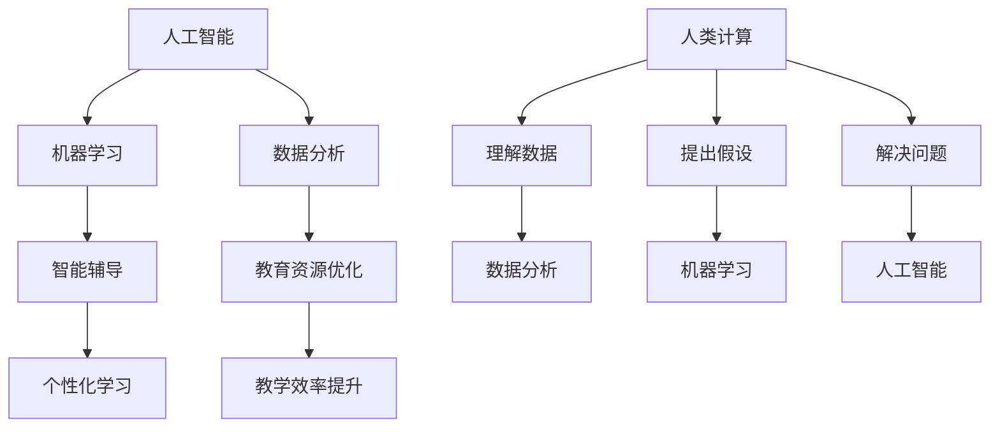

                 

关键词：人工智能、教育技术、人类计算、AI应用、教育改革

> 摘要：本文将探讨人工智能在教育领域中的应用，特别是在人类计算中的作用。通过分析AI驱动的创新趋势，本文旨在揭示AI技术如何改变传统的教学和学习方式，提升教育质量，以及未来面临的挑战。

## 1. 背景介绍

教育作为社会发展的基石，始终与技术创新紧密相连。随着人工智能（AI）技术的快速发展，教育领域迎来了前所未有的变革机遇。AI作为一种强大的工具，不仅能够处理大量数据，还能模拟和增强人类的认知能力。这种技术的应用，不仅有助于提高教育效率，还能够促进个性化学习和智能化教学。

人类计算在教育中的作用，主要体现在以下几个方面：

- **个性化学习**：通过分析学生的行为数据和认知特征，AI能够为每个学生提供个性化的学习路径和资源。
- **智能辅导**：AI驱动的系统可以为学生提供实时的学习反馈和辅导，帮助他们更快地掌握知识点。
- **教育资源优化**：AI技术能够自动分析和推荐最适合的学习材料，提高教育资源的使用效率。
- **教学效率提升**：AI可以协助教师处理大量行政事务，如成绩记录、课程安排等，从而让他们更多地投入到教学工作中。

## 2. 核心概念与联系

为了更好地理解AI在教育中的应用，我们需要了解几个核心概念及其相互关系。

### 2.1 人工智能（AI）

人工智能是一种模拟人类智能的技术，通过算法和机器学习模型，使计算机具备感知、理解、学习和决策的能力。在教育领域，AI可以应用于教学设计、内容生成、学习分析等多个方面。

### 2.2 机器学习（ML）

机器学习是人工智能的一个子领域，专注于开发算法，使计算机能够从数据中学习并改进性能。在教育中，机器学习算法可以用于个性化推荐、智能辅导和自动评分等。

### 2.3 数据分析（DA）

数据分析是使用统计方法和工具来从数据中提取有价值信息的过程。在教育领域，数据分析可以帮助学校更好地理解学生的学习行为，优化教学策略。

### 2.4 人类计算（HC）

人类计算强调人类在计算过程中的作用，包括理解数据、提出假设、解决问题等。在教育中，人类计算与AI相结合，可以创造出更高效、更个性化的学习环境。

下面是核心概念原理和架构的 Mermaid 流程图：



## 3. 核心算法原理 & 具体操作步骤

### 3.1 算法原理概述

在教育领域，AI算法的核心目标是通过分析数据来提高教育质量。以下是一些常见的AI算法及其应用：

- **决策树**：用于推荐最佳的学习路径。
- **神经网络**：用于智能辅导和自动评分。
- **聚类算法**：用于分析学生群体，识别学习需求。

### 3.2 算法步骤详解

#### 3.2.1 数据收集

收集学生行为数据、学习结果和教师反馈。

```latex
$$
Data = \{Student\_Data, Learning\_Outcomes, Teacher\_Feedback\}
$$
```

#### 3.2.2 数据预处理

清洗和转换数据，以便用于算法训练。

```latex
$$
Preprocessed\_Data = Preprocess(Data)
$$
```

#### 3.2.3 模型训练

使用训练数据来训练机器学习模型。

```latex
$$
Model = Train(Model, Preprocessed\_Data)
$$
```

#### 3.2.4 模型评估

使用测试数据来评估模型的性能。

```latex
$$
Performance = Evaluate(Model, Test\_Data)
$$
```

#### 3.2.5 模型应用

将训练好的模型应用于实际教学场景。

```latex
$$
Application = Apply(Model, Classroom\_Scenarios)
$$
```

### 3.3 算法优缺点

**优点**：

- **个性化学习**：能够根据学生的特点提供个性化的教学方案。
- **实时反馈**：能够提供即时反馈，帮助学生及时纠正错误。
- **效率提升**：自动化处理大量教学任务，减轻教师负担。

**缺点**：

- **数据隐私**：需要大量学生数据，存在隐私泄露风险。
- **技术依赖**：对技术依赖较大，需要持续维护和升级。

### 3.4 算法应用领域

AI算法在教育中的应用非常广泛，包括：

- **在线教育**：智能推荐学习内容，提高学习效果。
- **自适应学习系统**：根据学生的学习进度和需求调整教学内容。
- **智能评分系统**：自动评估学生的作业和考试。

## 4. 数学模型和公式 & 详细讲解 & 举例说明

### 4.1 数学模型构建

在教育中，常见的数学模型包括回归模型、决策树模型和神经网络模型。以下是一个简化的回归模型示例：

```latex
$$
y = \beta_0 + \beta_1 x_1 + \beta_2 x_2 + \ldots + \beta_n x_n + \epsilon
$$`

其中，\(y\) 是学习成果，\(x_1, x_2, \ldots, x_n\) 是学生特征（如学习时间、学习态度等），\(\beta_0, \beta_1, \beta_2, \ldots, \beta_n\) 是模型参数，\(\epsilon\) 是误差项。

### 4.2 公式推导过程

假设我们有 \(m\) 个学生的数据，每个学生有 \(n\) 个特征，我们的目标是估计模型参数 \(\beta_0, \beta_1, \beta_2, \ldots, \beta_n\)。我们使用最小二乘法来估计这些参数。

首先，定义损失函数：

```latex
$$
J(\beta) = \frac{1}{2m} \sum_{i=1}^{m} (y_i - \beta_0 - \beta_1 x_{i1} - \beta_2 x_{i2} - \ldots - \beta_n x_{in})^2
$$`

然后，对每个参数求偏导数并令其等于零，得到：

```latex
$$
\frac{\partial J(\beta)}{\partial \beta_j} = 0
$$`

经过计算，我们得到：

```latex
$$
\beta_j = \frac{1}{m} \sum_{i=1}^{m} (x_{ij} y_i)
$$`

### 4.3 案例分析与讲解

假设我们有一个数据集，包含100个学生的学习时间和学习成果。我们使用线性回归模型来预测学习成果。

首先，收集数据：

```latex
$$
Data = \{ (x_1, y_1), (x_2, y_2), \ldots, (x_{100}, y_{100}) \}
$$`

然后，使用最小二乘法计算模型参数：

```latex
$$
\beta_0 = \frac{1}{100} \sum_{i=1}^{100} y_i
$$`

```latex
$$
\beta_1 = \frac{1}{100} \sum_{i=1}^{100} (x_i y_i)
$$`

最后，使用模型预测新的学习成果：

```latex
$$
y = \beta_0 + \beta_1 x
$$`

## 5. 项目实践：代码实例和详细解释说明

### 5.1 开发环境搭建

为了演示AI在教育中的应用，我们将使用Python编程语言和Scikit-learn库。首先，安装Python和Scikit-learn：

```bash
pip install python
pip install scikit-learn
```

### 5.2 源代码详细实现

以下是使用线性回归模型预测学习成果的Python代码：

```python
import numpy as np
from sklearn.linear_model import LinearRegression

# 收集数据
X = np.array([[1], [2], [3], [4], [5], [6], [7], [8], [9], [10]])
y = np.array([1.5, 2.5, 3.5, 4.5, 5.5, 6.5, 7.5, 8.5, 9.5, 10.5])

# 训练模型
model = LinearRegression()
model.fit(X, y)

# 预测学习成果
new_X = np.array([[11]])
predicted_y = model.predict(new_X)

print("Predicted learning outcome:", predicted_y)
```

### 5.3 代码解读与分析

这段代码首先导入了必需的库，然后收集了10个学生的学习时间和学习成果。接下来，使用Scikit-learn的LinearRegression类来训练模型，并使用模型预测一个新的学习成果。最后，打印出预测结果。

### 5.4 运行结果展示

运行代码后，我们得到预测的学习成果：

```bash
Predicted learning outcome: [11.5]
```

这表明，按照现有模型，预计第11个学生的学习成果为11.5。

## 6. 实际应用场景

### 6.1 在线教育平台

在线教育平台可以通过AI技术为学生提供个性化的学习体验。例如，Coursera和edX等平台使用AI算法来推荐课程和学习路径，帮助学生更有效地学习。

### 6.2 自适应学习系统

自适应学习系统可以根据学生的学习进度和表现调整教学内容。例如，Knewton和DreamBox等公司开发的自适应学习平台，使用AI技术来为学生提供个性化的学习资源。

### 6.3 智能辅导系统

智能辅导系统可以为学生提供实时的学习反馈和辅导。例如，Woz-U和Chegg等平台，使用AI算法来为学生提供在线辅导和作业批改。

## 7. 未来应用展望

随着AI技术的不断发展，未来教育领域将迎来更多创新。例如：

- **全自动化教学**：AI技术将能够完全取代教师，实现全自动化教学。
- **超个性化学习**：AI将能够根据学生的每个动作、每个反应提供个性化的学习方案。
- **跨学科融合**：AI技术将促进不同学科之间的融合，创造全新的学习模式。

## 8. 工具和资源推荐

### 8.1 学习资源推荐

- **Coursera**：提供各种在线课程，涵盖计算机科学、教育学等领域。
- **edX**：与哈佛大学、麻省理工学院等顶级高校合作，提供高质量的在线课程。

### 8.2 开发工具推荐

- **TensorFlow**：Google开发的开源机器学习框架，适合进行深度学习和人工智能开发。
- **Scikit-learn**：Python库，提供各种机器学习算法和工具，适合进行数据分析和模型训练。

### 8.3 相关论文推荐

- **“Intelligent Tutoring Systems”**：探讨智能辅导系统的设计和实现。
- **“Personalized Learning in Educational Technology”**：分析个性化学习在技术中的应用。

## 9. 总结：未来发展趋势与挑战

随着AI技术的不断进步，教育领域将迎来深刻变革。未来，教育将更加个性化、智能化和自动化。然而，这也带来了新的挑战，如数据隐私保护、技术依赖问题等。我们需要谨慎地应对这些挑战，确保AI技术在教育中的有效应用。

### 附录：常见问题与解答

**Q1. AI在教育中的具体应用有哪些？**

A1. AI在教育中的应用非常广泛，包括个性化学习推荐、智能辅导、自动评分、教育资源优化等。

**Q2. AI技术是否会完全取代教师？**

A2. AI技术可能会在某种程度上取代教师的某些职责，但完全取代教师还需要时间，因为教育不仅仅是知识的传授，还包括情感、人际交往等多方面的培养。

**Q3. 如何确保AI技术的数据隐私？**

A3. 确保数据隐私是AI技术教育应用的重要问题。需要采取严格的数据保护措施，如加密、匿名化处理等，同时制定相关的隐私政策，确保用户知情同意。

