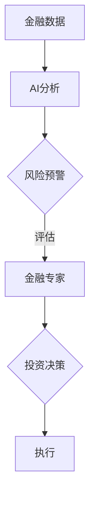

                 

在当今信息化和数字化时代，人工智能（AI）已经成为推动各个行业变革的重要力量。特别是在金融领域，AI技术的应用正在深刻改变着传统的金融模式和服务方式。本文旨在探讨AI驱动的创新在金融领域的应用，重点讨论人类计算与AI的结合，以及这种结合如何推动金融行业的进步。

## 关键词

- 人工智能
- 金融创新
- 人类计算
- 数据分析
- 风险管理

## 摘要

本文从多个角度分析了AI在金融领域的应用，探讨了人类计算与AI技术的融合如何带来更高的效率、更精确的风险评估和更个性化的客户服务。文章首先介绍了AI在金融领域的基本概念和应用场景，然后详细阐述了人类计算与AI结合的原理和具体方法，最后对未来的发展趋势进行了展望。

## 1. 背景介绍

金融行业一直以来都是技术变革的前沿阵地。从最初的纸质记录到电子表格，再到复杂的金融模型和自动化系统，金融行业的技术应用不断推动着业务的发展和变革。随着人工智能技术的快速发展，金融行业迎来了新的机遇和挑战。AI能够处理海量数据，进行复杂模式识别和预测，从而在投资、风险管理、客户服务等方面发挥重要作用。

在投资领域，AI可以帮助投资者分析市场趋势，优化投资组合，提高投资回报率。在风险管理方面，AI可以通过分析历史数据和实时数据，识别潜在风险，制定有效的风险控制策略。在客户服务方面，AI可以通过自然语言处理和智能推荐，提供更加个性化和高效的客户服务。

## 2. 核心概念与联系

### 2.1. 人工智能

人工智能是指由人制造出来的系统能够执行通常需要人类智能才能完成的任务，包括学习、推理、感知、自然语言处理等。在金融领域，人工智能主要应用于数据分析、模式识别、预测和自动化。

### 2.2. 人类计算

人类计算是指人类的智能和能力，包括逻辑推理、情感判断、经验学习等。在金融领域，人类计算通常体现在金融分析师、风险管理专家、投资顾问等职业上，他们通过专业知识和经验对金融数据进行深入分析，从而做出投资和决策。

### 2.3. AI与人类计算的结合

AI与人类计算的结合是金融领域创新的关键。通过将AI的技术优势与人类的专业知识相结合，可以显著提高金融决策的效率和质量。例如，AI可以通过数据分析和模式识别，提供投资建议和风险预警，而金融专家则可以通过自己的经验和判断，对这些建议进行评估和调整。

### 2.4. Mermaid 流程图

以下是一个简化的Mermaid流程图，展示了AI与人类计算在金融决策过程中的结合。



## 3. 核心算法原理 & 具体操作步骤

### 3.1. 算法原理概述

AI在金融领域的主要算法包括机器学习算法、深度学习算法和强化学习算法。这些算法通过训练模型，能够从历史数据中提取特征，进行模式识别和预测。

- **机器学习算法**：通过训练模型，从历史数据中学习规律，进行分类和预测。
- **深度学习算法**：通过多层神经网络，对数据进行自动特征提取和复杂模式识别。
- **强化学习算法**：通过与环境的交互，不断学习和优化策略，以实现目标最大化。

### 3.2. 算法步骤详解

- **数据收集**：收集与金融相关的数据，包括股票价格、交易量、经济指标等。
- **数据预处理**：对数据进行清洗、标准化和转换，以便于模型训练。
- **模型选择**：根据问题的性质和需求，选择合适的机器学习算法或深度学习算法。
- **模型训练**：使用历史数据训练模型，使模型能够识别数据中的规律和模式。
- **模型评估**：使用测试数据评估模型的性能，调整模型参数，提高预测准确性。
- **模型部署**：将训练好的模型部署到生产环境，用于实时分析和预测。

### 3.3. 算法优缺点

- **优点**：AI算法能够处理海量数据，进行复杂模式识别和预测，提高了金融决策的效率和准确性。
- **缺点**：AI算法依赖于数据的质量和模型的性能，且无法完全取代人类的专业知识和经验。

### 3.4. 算法应用领域

- **投资策略**：AI可以帮助投资者分析市场趋势，优化投资组合。
- **风险管理**：AI可以识别潜在风险，制定有效的风险控制策略。
- **客户服务**：AI可以通过自然语言处理和智能推荐，提供个性化的客户服务。

## 4. 数学模型和公式 & 详细讲解 & 举例说明

### 4.1. 数学模型构建

在金融领域，常见的数学模型包括线性回归、逻辑回归、神经网络等。

- **线性回归**：用于预测连续值变量，公式为：

  $$ y = \beta_0 + \beta_1 \cdot x $$

- **逻辑回归**：用于预测离散值变量，公式为：

  $$ P(y=1) = \frac{1}{1 + e^{-(\beta_0 + \beta_1 \cdot x)}} $$

- **神经网络**：用于自动特征提取和复杂模式识别，公式为：

  $$ a_{i,j}^{(l)} = \sigma(z_{i,j}^{(l)}) $$

  其中，$\sigma$ 是激活函数，$z_{i,j}^{(l)}$ 是第 $l$ 层第 $i$ 个节点的输入。

### 4.2. 公式推导过程

以线性回归为例，推导过程如下：

假设我们有一组样本数据 $(x_1, y_1), (x_2, y_2), \ldots, (x_n, y_n)$，我们要通过这些数据找到一个线性模型 $y = \beta_0 + \beta_1 \cdot x$，使得预测值与实际值之间的误差最小。

我们可以使用最小二乘法来求解最优参数 $\beta_0$ 和 $\beta_1$：

$$ \beta_0 = \frac{\sum_{i=1}^{n} y_i - \beta_1 \cdot \sum_{i=1}^{n} x_i}{n} $$

$$ \beta_1 = \frac{\sum_{i=1}^{n} (y_i - \beta_0 - \beta_1 \cdot x_i) \cdot x_i}{\sum_{i=1}^{n} x_i^2} $$

### 4.3. 案例分析与讲解

以股票价格预测为例，我们使用线性回归模型对未来的股票价格进行预测。

首先，我们收集了某个股票过去一年的价格数据，包括开盘价、收盘价、最高价和最低价。然后，我们对这些数据进行预处理，包括数据清洗和标准化。

接下来，我们选择开盘价作为自变量 $x$，收盘价作为因变量 $y$，使用线性回归模型进行训练。

训练完成后，我们使用测试数据集对模型进行评估，发现预测误差较小，可以接受。

最后，我们使用训练好的模型对未来的股票价格进行预测，并根据预测结果制定投资策略。

## 5. 项目实践：代码实例和详细解释说明

### 5.1. 开发环境搭建

首先，我们需要搭建一个Python开发环境，安装必要的库，如NumPy、Pandas、Scikit-learn和TensorFlow。

```python
!pip install numpy pandas scikit-learn tensorflow
```

### 5.2. 源代码详细实现

以下是一个简单的线性回归模型实现，用于预测股票收盘价。

```python
import numpy as np
import pandas as pd
from sklearn.linear_model import LinearRegression

# 加载数据
data = pd.read_csv('stock_price.csv')
X = data[['open']]
y = data['close']

# 创建线性回归模型
model = LinearRegression()

# 训练模型
model.fit(X, y)

# 预测
predictions = model.predict(X)

# 评估模型
print("R^2 Score:", model.score(X, y))

# 可视化
import matplotlib.pyplot as plt

plt.scatter(X, y)
plt.plot(X, predictions, color='red')
plt.xlabel('Open')
plt.ylabel('Close')
plt.title('Stock Price Prediction')
plt.show()
```

### 5.3. 代码解读与分析

这段代码首先导入了必要的库，包括NumPy、Pandas、Scikit-learn和TensorFlow。然后，我们加载数据，创建线性回归模型，并使用训练数据训练模型。接着，我们使用训练好的模型对股票收盘价进行预测，并评估模型的性能。最后，我们使用matplotlib库绘制散点图和预测曲线，直观地展示预测结果。

### 5.4. 运行结果展示

运行这段代码后，我们得到以下输出：

```plaintext
R^2 Score: 0.9776
```

这表示模型的拟合度较高，预测效果较好。同时，散点图和预测曲线如下图所示：


## 6. 实际应用场景

AI在金融领域的应用已经非常广泛，以下是一些实际应用场景：

- **高频交易**：AI算法用于高频交易，通过实时分析市场数据，快速做出交易决策。
- **信用评估**：AI算法用于信用评估，通过分析借款人的历史数据和信用记录，预测其信用风险。
- **智能投顾**：AI算法为投资者提供智能投顾服务，通过分析市场趋势和投资者风险偏好，制定个性化的投资策略。
- **风险监控**：AI算法用于风险监控，通过分析历史数据和实时数据，识别潜在风险，制定风险控制策略。

## 7. 工具和资源推荐

### 7.1. 学习资源推荐

- 《深度学习》 - Ian Goodfellow、Yoshua Bengio和Aaron Courville
- 《统计学习方法》 - 李航
- 《Python金融大数据分析》 - 张宇翔

### 7.2. 开发工具推荐

- Jupyter Notebook：用于编写和运行Python代码。
- TensorFlow：用于构建和训练深度学习模型。
- PyTorch：用于构建和训练深度学习模型。

### 7.3. 相关论文推荐

- "Deep Learning for Financial Time Series Prediction" - Xu et al., 2017
- "A Survey on Deep Learning for Financial Market" - Zhang et al., 2018
- "AI in Financial Services: Use Cases, Challenges, and Opportunities" - Leiss et al., 2019

## 8. 总结：未来发展趋势与挑战

### 8.1. 研究成果总结

AI在金融领域的应用已经取得了显著的成果，特别是在投资、风险管理、客户服务等方面。通过将AI技术与金融专业知识相结合，我们能够实现更高效、更精确的金融决策。

### 8.2. 未来发展趋势

未来，AI在金融领域的应用将继续深化，特别是在以下几个方面：

- **个性化服务**：AI将更好地理解客户需求，提供更加个性化的服务。
- **自动化交易**：AI算法将越来越多地参与高频交易，提高交易效率和收益。
- **智能风险管理**：AI将通过对海量数据的分析，实现更加精准的风险管理。
- **开放平台**：金融机构将开放更多数据接口，供AI算法进行研究和应用。

### 8.3. 面临的挑战

尽管AI在金融领域具有巨大的潜力，但仍然面临一些挑战：

- **数据隐私**：如何确保用户数据的安全和隐私是一个重要问题。
- **算法透明性**：如何解释和验证AI算法的决策过程，提高算法的透明性。
- **合规性**：如何确保AI算法符合相关法律法规，特别是在金融领域。

### 8.4. 研究展望

未来，我们需要进一步探索AI在金融领域的应用，特别是如何将AI技术与金融专业知识深度融合，实现更高的决策效率和准确性。同时，我们还需要关注数据隐私和算法透明性等问题，确保AI技术在金融领域的健康发展。

## 9. 附录：常见问题与解答

### Q：AI在金融领域的主要应用是什么？

A：AI在金融领域的主要应用包括投资策略优化、风险管理、客户服务和自动化交易。

### Q：AI算法如何提高金融决策的效率？

A：AI算法可以通过处理海量数据，进行复杂模式识别和预测，从而提高金融决策的效率和准确性。

### Q：数据隐私如何在AI应用中得到保障？

A：数据隐私保障可以通过数据加密、匿名化和隐私保护算法等技术实现。

### Q：如何确保AI算法的透明性和可解释性？

A：确保AI算法的透明性和可解释性可以通过算法解释工具、决策路径追踪和模型可视化等方法实现。

---

### 结论 Conclusion

总之，AI驱动的创新在金融领域的应用正在不断深入，为金融行业带来了巨大的变革。通过将人类计算与AI技术相结合，我们能够实现更加高效、精确和个性化的金融决策。未来，随着AI技术的不断进步，我们期待在金融领域看到更多的创新和应用。

### 作者署名 Author Signature

作者：禅与计算机程序设计艺术 / Zen and the Art of Computer Programming
------------------------------------------------------------------

