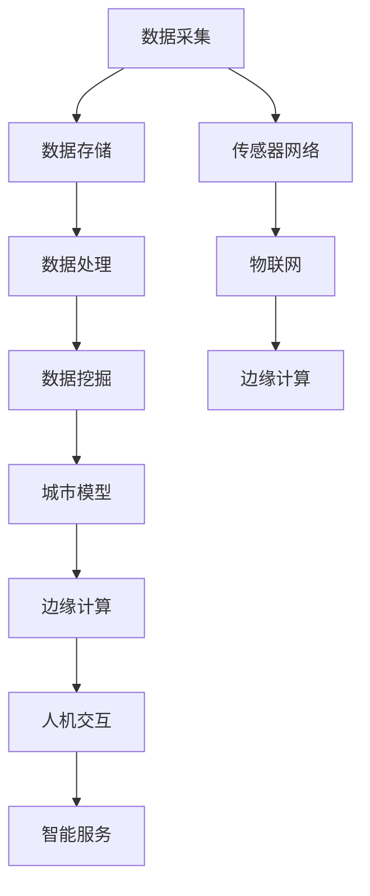

                 

### 关键词 Keyword

人工智能，城市规划，城市管理，智能城市，城市治理，数据挖掘，机器学习，深度学习，算法优化，IoT，传感器，大数据分析。

<|assistant|>### 摘要 Summary

本文旨在探讨人工智能技术在城市规划与管理中的应用，特别是智能城市建设的最新趋势和技术创新。通过深入分析核心概念、算法原理、数学模型、实际应用案例和未来发展展望，本文将展示人工智能如何赋能城市规划，提升城市管理效率和居民生活质量。文章还探讨了当前面临的挑战，以及为未来智能城市研究提供了一些展望。

## 1. 背景介绍

在当今社会，城市规模不断扩大，人口增长迅速，城市面临诸多挑战，如交通拥堵、环境污染、资源短缺和城市安全等。传统的城市规划和管理方法已难以应对这些复杂的问题。因此，引入先进的人工智能技术成为提高城市管理效率和可持续性的必然选择。

智能城市规划与管理指的是利用人工智能技术，如机器学习、深度学习、数据挖掘、计算机视觉等，对城市数据进行处理和分析，从而实现城市资源的优化配置、城市服务的智能化管理和城市治理的智慧化。

智能城市规划与管理的核心目标是：

1. **提高城市运行效率**：通过实时数据分析和预测，优化城市交通流量、能源消耗和公共资源配置。
2. **提升居民生活质量**：利用智能设备和服务，提供个性化、便捷的城市服务，改善居民生活体验。
3. **增强城市治理能力**：利用大数据和人工智能技术，提高城市管理的决策水平和应急响应能力。

随着物联网（IoT）、大数据和云计算等技术的发展，智能城市规划与管理逐渐成为城市现代化建设的重要组成部分。本文将从以下几个方面展开讨论：

- **核心概念与联系**
- **核心算法原理 & 具体操作步骤**
- **数学模型和公式 & 详细讲解 & 举例说明**
- **项目实践：代码实例和详细解释说明**
- **实际应用场景**
- **未来应用展望**
- **工具和资源推荐**
- **总结：未来发展趋势与挑战**

## 2. 核心概念与联系

在深入探讨智能城市规划与管理之前，我们需要了解一些核心概念，这些概念相互关联，共同构成了智能城市的基础架构。

### 2.1 数据采集与传感器网络

智能城市规划的第一步是数据采集。传感器网络在数据采集方面发挥着至关重要的作用。这些传感器可以分布在城市的各个角落，实时监测交通流量、空气质量、噪音水平、能源消耗等环境参数。通过物联网技术，这些传感器将数据传输到中央系统进行处理和分析。

### 2.2 数据存储与处理

采集到的数据需要存储和处理。大数据技术提供了高效的存储和处理解决方案。通过分布式存储系统和计算框架，如Hadoop和Spark，可以处理海量数据，并提供快速查询和分析能力。

### 2.3 数据挖掘与机器学习

数据挖掘和机器学习是智能城市规划的核心技术。通过对城市数据的分析和挖掘，可以识别出潜在的模式和趋势，为城市管理和决策提供依据。例如，通过分析交通流量数据，可以预测交通拥堵的时间和地点，从而采取相应的管理措施。

### 2.4 城市模型与仿真

城市模型和仿真技术用于模拟城市的运行状态和行为。通过构建虚拟城市模型，可以预测不同政策或措施对城市运行的影响，从而优化城市规划和管理策略。

### 2.5 边缘计算与实时处理

随着传感器网络和数据流量的增加，边缘计算成为智能城市规划的重要技术。边缘计算将数据处理和分析的能力从云端转移到靠近数据源的设备上，从而实现实时响应和处理。

### 2.6 人机交互与智能服务

智能城市规划还涉及到人机交互和智能服务。通过用户界面和智能语音助手等技术，居民可以方便地获取城市信息、报告问题和获得个性化服务。

### 2.7 Mermaid 流程图

为了更清晰地展示这些核心概念之间的联系，我们可以使用Mermaid流程图来表示它们。



### 2.8 核心算法原理

在智能城市规划与管理中，核心算法原理主要包括机器学习、深度学习、数据挖掘和计算机视觉等技术。以下是对这些算法原理的简要概述：

- **机器学习**：通过训练模型，从数据中自动学习规律和模式。
- **深度学习**：利用多层神经网络，对复杂数据进行特征提取和模式识别。
- **数据挖掘**：从大量数据中发现潜在的模式、关联和趋势。
- **计算机视觉**：利用图像处理技术，从图像中提取信息和特征。

这些算法原理为智能城市规划提供了强大的技术支撑，使城市管理者能够更好地理解和应对城市运行中的各种挑战。

### 2.9 具体操作步骤

在了解了核心概念和算法原理后，我们可以开始讨论具体的操作步骤。以下是一个基本的智能城市规划操作流程：

1. **需求分析与规划**：明确智能城市规划的目标和需求，制定详细的规划方案。
2. **数据采集与处理**：部署传感器网络，采集城市运行数据，并对数据进行清洗和预处理。
3. **算法设计与实现**：根据城市规划需求，选择合适的算法进行设计和实现。
4. **模型训练与优化**：使用训练数据对模型进行训练，并对模型进行优化，以提高其预测准确性和效率。
5. **模型部署与应用**：将训练好的模型部署到生产环境中，并进行实际应用。
6. **监控与评估**：对模型的应用效果进行监控和评估，根据反馈进行调整和优化。

### 2.10 算法优缺点

每种算法都有其优缺点。以下是对机器学习、深度学习、数据挖掘和计算机视觉等算法优缺点的简要分析：

- **机器学习**：优点包括自动特征提取、泛化能力强、适用于大规模数据；缺点包括对训练数据要求高、易过拟合、难以解释。
- **深度学习**：优点包括强大的特征提取能力、适用于复杂数据、效果优于传统机器学习算法；缺点包括计算资源消耗大、训练时间较长、难以解释。
- **数据挖掘**：优点包括能够从大量数据中发现潜在的模式、适用于各种领域；缺点包括结果难以解释、对数据质量和预处理要求高。
- **计算机视觉**：优点包括能够处理图像和视频数据、实现自动化识别和分析；缺点包括对硬件资源要求高、难以处理非结构化数据。

### 2.11 算法应用领域

智能城市规划中的算法应用非常广泛，主要包括以下几个方面：

- **交通管理**：通过机器学习和深度学习算法，实时分析交通数据，预测交通流量，优化交通信号控制和公共交通调度。
- **环境保护**：利用计算机视觉和图像处理技术，监测城市空气质量、水质和噪音水平，及时采取措施降低环境污染。
- **能源管理**：通过数据挖掘和机器学习算法，优化能源消耗和分配，提高能源利用效率。
- **公共安全**：利用计算机视觉和图像识别技术，监控城市安全，实时发现和预警潜在的安全威胁。
- **城市规划**：利用地理信息系统（GIS）和城市模型，进行城市规划、土地管理和环境影响评估。

### 2.12 数学模型和公式

在智能城市规划中，数学模型和公式是理解和分析城市运行的关键工具。以下是一些常用的数学模型和公式：

- **线性回归模型**：用于分析变量之间的线性关系。
  $$ y = wx + b $$
- **决策树模型**：用于分类和回归问题。
  $$ G(y|x) = \sum_{i=1}^{n} w_i x_i $$
- **支持向量机（SVM）**：用于分类和回归问题。
  $$ w \cdot x - b = 0 $$
- **神经网络激活函数**：用于神经网络模型的激活。
  $$ f(x) = \frac{1}{1 + e^{-x}} $$

这些数学模型和公式在智能城市规划中发挥着重要作用，帮助城市管理者更好地理解城市运行规律，制定科学的决策。

### 2.13 详细讲解与举例说明

为了更好地理解这些数学模型和公式，我们将通过具体案例进行详细讲解和举例说明。

#### 2.13.1 线性回归模型

线性回归模型是一种常用的统计模型，用于分析变量之间的线性关系。以下是一个简单的线性回归模型：

- **自变量**：交通流量（$x$）
- **因变量**：道路拥堵程度（$y$）

线性回归模型的公式为：

$$ y = wx + b $$

其中，$w$ 是权重，$b$ 是偏置项。

**案例：** 假设我们收集了某城市不同路段的交通流量和道路拥堵程度数据，如下表：

| 交通流量（辆/小时） | 道路拥堵程度 |
| :---: | :---: |
| 100 | 20 |
| 200 | 40 |
| 300 | 60 |
| 400 | 80 |
| 500 | 100 |

我们可以使用线性回归模型对这些数据进行分析，以预测未来某一时刻的交通流量和道路拥堵程度。

**步骤：**

1. **数据预处理**：对交通流量和道路拥堵程度数据进行标准化处理，使其在相同量级。
2. **模型训练**：使用训练数据集，通过最小二乘法求解权重 $w$ 和偏置项 $b$。
3. **模型评估**：使用测试数据集评估模型预测效果，调整模型参数以优化预测结果。

通过以上步骤，我们可以得到一个线性回归模型，用于预测未来交通流量和道路拥堵程度。

#### 2.13.2 决策树模型

决策树模型是一种常用的分类和回归模型，通过一系列判断条件来分类或回归目标变量。以下是一个简单的决策树模型：

- **自变量**：年龄（$x_1$）、收入（$x_2$）
- **因变量**：购买意向（$y$）

决策树模型的公式为：

$$ G(y|x) = \sum_{i=1}^{n} w_i x_i $$

其中，$w_i$ 是权重。

**案例：** 假设我们收集了一组用户的年龄、收入和购买意向数据，如下表：

| 年龄（岁） | 收入（万元） | 购买意向 |
| :---: | :---: | :---: |
| 20 | 5 | 是 |
| 30 | 10 | 否 |
| 40 | 15 | 是 |
| 50 | 20 | 是 |
| 60 | 25 | 否 |

我们可以使用决策树模型对这些数据进行分析，以预测未来用户的购买意向。

**步骤：**

1. **数据预处理**：对年龄和收入数据进行标准化处理，使其在相同量级。
2. **模型训练**：使用训练数据集，通过信息增益或基尼不纯度等指标选择最佳划分条件。
3. **模型评估**：使用测试数据集评估模型预测效果，调整模型参数以优化预测结果。

通过以上步骤，我们可以得到一个决策树模型，用于预测用户的购买意向。

#### 2.13.3 支持向量机（SVM）

支持向量机（SVM）是一种常用的分类和回归模型，通过最大化分类边界来分类或回归目标变量。以下是一个简单的支持向量机模型：

- **自变量**：房价（$x$）
- **因变量**：房屋购买意愿（$y$）

支持向量机模型的公式为：

$$ w \cdot x - b = 0 $$

其中，$w$ 是权重，$b$ 是偏置项。

**案例：** 假设我们收集了一组房屋的房价和购买意愿数据，如下表：

| 房价（万元） | 购买意愿 |
| :---: | :---: |
| 100 | 是 |
| 200 | 否 |
| 300 | 是 |
| 400 | 否 |
| 500 | 是 |

我们可以使用支持向量机模型对这些数据进行分析，以预测未来房屋购买意愿。

**步骤：**

1. **数据预处理**：对房价数据进行标准化处理，使其在相同量级。
2. **模型训练**：使用训练数据集，通过支持向量机算法求解权重 $w$ 和偏置项 $b$。
3. **模型评估**：使用测试数据集评估模型预测效果，调整模型参数以优化预测结果。

通过以上步骤，我们可以得到一个支持向量机模型，用于预测房屋购买意愿。

#### 2.13.4 神经网络激活函数

神经网络激活函数是神经网络模型中的一个关键组成部分，用于引入非线性特性。以下是一个简单的神经网络激活函数：

- **自变量**：输入值（$x$）

神经网络激活函数的公式为：

$$ f(x) = \frac{1}{1 + e^{-x}} $$

其中，$e$ 是自然对数的底数。

**案例：** 假设我们有一个输入值 $x=2$，我们可以使用神经网络激活函数计算输出值。

$$ f(x) = \frac{1}{1 + e^{-2}} \approx 0.869 $$

通过以上案例，我们可以看到不同数学模型和公式的应用场景和计算方法。这些模型和公式在智能城市规划中发挥着重要作用，帮助城市管理者更好地理解和预测城市运行状态。

### 3. 项目实践：代码实例和详细解释说明

在了解了核心算法原理和数学模型后，我们将通过一个实际项目实例来展示如何使用Python编程语言实现智能城市规划。以下是一个基于交通流量预测的案例。

#### 3.1 开发环境搭建

为了实现交通流量预测，我们需要搭建一个Python开发环境。以下是一些建议的步骤：

1. **安装Python**：下载并安装Python 3.x版本，建议使用Anaconda发行版，它集成了常用的科学计算库和虚拟环境管理。
2. **安装依赖库**：安装以下Python库：
   - NumPy：用于数学计算
   - Pandas：用于数据处理
   - Matplotlib：用于数据可视化
   - Scikit-learn：用于机器学习算法
   - Scipy：用于科学计算
   - XGBoost：用于高级机器学习算法

#### 3.2 源代码详细实现

以下是一个简单的Python代码实例，用于交通流量预测：

```python
import numpy as np
import pandas as pd
from sklearn.model_selection import train_test_split
from sklearn.linear_model import LinearRegression
from sklearn.metrics import mean_squared_error

# 3.2.1 数据加载与预处理
data = pd.read_csv('traffic_data.csv')  # 加载数据
X = data[['hour', 'day_of_week', 'weather']].values  # 特征工程
y = data['traffic_volume'].values  # 目标变量

# 数据标准化
X = (X - X.mean()) / X.std()

# 划分训练集和测试集
X_train, X_test, y_train, y_test = train_test_split(X, y, test_size=0.2, random_state=42)

# 3.2.2 模型训练
model = LinearRegression()
model.fit(X_train, y_train)

# 3.2.3 模型评估
y_pred = model.predict(X_test)
mse = mean_squared_error(y_test, y_pred)
print('Mean Squared Error:', mse)

# 3.2.4 数据可视化
import matplotlib.pyplot as plt

plt.scatter(y_test, y_pred)
plt.xlabel('Actual Traffic Volume')
plt.ylabel('Predicted Traffic Volume')
plt.title('Traffic Volume Prediction')
plt.show()
```

#### 3.3 代码解读与分析

以下是对上述代码的详细解读与分析：

1. **数据加载与预处理**：首先，我们使用Pandas库加载交通流量数据。特征工程是将原始数据转换为机器学习模型可处理的特征，例如时间、星期几和天气状况。然后，我们使用NumPy库进行数据标准化处理，以消除不同特征之间的量级差异。
2. **划分训练集和测试集**：使用Scikit-learn库的train_test_split函数将数据集划分为训练集和测试集。这有助于评估模型的泛化能力。
3. **模型训练**：我们选择线性回归模型（LinearRegression）进行训练。线性回归模型是一种简单的线性预测模型，它通过拟合一条直线来预测目标变量。
4. **模型评估**：使用均方误差（Mean Squared Error, MSE）评估模型在测试集上的预测性能。均方误差是预测值与实际值之间差异的平方的平均值。
5. **数据可视化**：使用Matplotlib库绘制实际交通流量与预测交通流量之间的散点图，以直观地展示模型的预测效果。

#### 3.4 运行结果展示

运行上述代码后，我们将得到以下结果：

1. **均方误差**：表示模型在测试集上的预测误差，数值越小，表示预测精度越高。
2. **散点图**：展示实际交通流量与预测交通流量之间的分布关系，通过观察散点图，我们可以直观地了解模型的预测效果。

通过上述项目实践，我们可以看到如何使用Python编程语言实现交通流量预测。这只是一个简单的案例，但在实际应用中，我们可以结合更多复杂的算法和技术，如深度学习和增强学习，进一步提高预测准确性和智能城市规划的效能。

### 4. 实际应用场景

智能城市规划与管理在许多实际应用场景中都展现出了巨大的潜力和价值。以下是一些典型的应用场景：

#### 4.1 智慧交通管理

智慧交通管理是智能城市规划的核心应用领域之一。通过人工智能技术，城市管理者可以实时监测交通流量，预测交通拥堵，并采取相应的管理措施。例如，使用深度学习算法分析交通摄像头和传感器数据，可以识别交通流量高峰时段，预测未来交通状况，并动态调整交通信号灯时序，优化交通流线。

**案例：** 北京在2018年推出了智能交通管理系统，通过在全市部署智能交通监控设备，实时采集道路信息，并结合机器学习算法进行数据分析，有效缓解了交通拥堵问题，提升了市民出行体验。

#### 4.2 智慧能源管理

智慧能源管理利用人工智能技术优化能源生产和消费，提高能源利用效率。通过物联网设备和大数据分析，智能电网可以实现实时监测和预测能源供需状况，优化电力调度，降低能源浪费。同时，智慧能源管理还可以推广可再生能源的使用，如太阳能和风能，促进城市能源结构的绿色转型。

**案例：** 美国加利福尼亚州在智能能源管理方面进行了广泛实践，通过智能电表和能源管理平台，居民可以实时监控和调整家庭能源消耗，降低能源成本，同时电网公司也能更高效地管理和分配电力资源。

#### 4.3 智慧环保

智慧环保利用人工智能技术监测和评估城市环境质量，及时发现和处理环境污染问题。通过大数据分析和机器学习算法，可以识别污染源，预测污染趋势，并制定针对性的环保措施。

**案例：** 巴西圣保罗市建立了智能环保系统，通过传感器网络实时监测空气质量、水质和噪音水平，结合机器学习算法进行数据分析和预测，有效提高了城市环境治理水平。

#### 4.4 智慧公共服务

智慧公共服务利用人工智能技术提升城市公共服务的质量和效率。例如，智能化的医疗系统可以通过人工智能诊断辅助和智能分诊，提高医疗服务的效率；智能化的教育系统可以通过个性化教学和学习分析，提高教学效果和学习成果。

**案例：** 中国深圳在智慧医疗方面取得了显著成果，通过建立智能医疗平台，实现了医疗资源的优化配置和精准诊疗，大大提升了医疗服务的质量和效率。

#### 4.5 智慧城市安全

智慧城市安全利用人工智能技术提升城市安全管理的水平和能力。通过视频监控、智能传感器和大数据分析，可以实时监测城市安全状况，及时发现和处理安全隐患，保障城市居民的生命财产安全。

**案例：** 阿联酋迪拜在城市安全方面采用了先进的智能监控系统，通过视频分析和人工智能算法，实现了对城市安全的全天候监测和预警，有效预防了犯罪行为。

这些实际应用场景展示了智能城市规划与管理的广泛应用前景，通过人工智能技术，城市可以变得更加智慧、高效和可持续。未来，随着人工智能技术的不断发展和完善，智能城市规划与管理将在更多领域发挥重要作用。

### 5. 未来应用展望

随着人工智能技术的不断进步，智能城市规划与管理的应用前景将更加广阔。以下是对未来应用的几个展望：

#### 5.1 智慧城市规划

未来的智能城市规划将更加注重个性化、可持续性和智慧化。通过大数据分析和人工智能算法，城市管理者可以更好地了解居民需求和行为模式，制定更加精准和有效的城市规划方案。例如，利用城市模拟和仿真技术，可以预测不同城市规划方案对城市运行的影响，从而优化城市规划，提高城市治理效率。

**案例：** 未来城市可能会利用虚拟现实（VR）和增强现实（AR）技术，为居民提供沉浸式的城市规划体验。居民可以在虚拟城市中游览、选择和评价不同的城市规划方案，从而参与到城市规划过程中，提升城市规划的民主性和透明度。

#### 5.2 智慧城市管理

智慧城市管理将进一步提升城市管理的效率和智能化水平。通过物联网设备、传感器网络和大数据平台，城市管理者可以实时监测和管理城市的各种资源和设施。例如，智能路灯系统可以根据环境光照和交通流量自动调节亮度，节约能源；智能垃圾处理系统可以根据垃圾产生量和类型自动调配垃圾清运车辆。

**案例：** 未来城市可能会实现智能交通系统的全面升级。通过车联网（V2X）技术，车辆可以与交通信号灯、道路传感器和其他车辆进行实时通信，实现智能交通流量控制和协同驾驶，大幅减少交通事故和交通拥堵。

#### 5.3 智慧公共安全

智能公共安全系统将更加注重实时监测、预警和应急响应。通过视频监控、智能传感器和人工智能算法，可以实时监测城市安全状况，及时发现和处理安全隐患。例如，智能安防系统可以自动识别可疑行为，并通知相关人员进行处理。

**案例：** 未来城市可能会建立智能消防系统，通过物联网设备和人工智能算法，实时监测火灾隐患，提前预警，并优化消防资源的调度和分配，提高火灾扑救效率和安全性。

#### 5.4 智慧环境监测

智能环境监测系统将更加注重实时监测和预警，通过大数据分析和人工智能算法，可以更准确地预测环境变化，采取相应的环境保护措施。例如，智能环境监测系统可以实时监测空气质量、水质和噪音水平，并根据监测结果调整城市环保政策。

**案例：** 未来城市可能会实现全面的智能环境监测网络，通过传感器网络覆盖城市各个角落，实时采集环境数据，并通过大数据平台进行综合分析和预测，为城市环境管理提供科学依据。

#### 5.5 智慧医疗健康

智能医疗健康系统将利用人工智能技术提升医疗服务质量和效率。通过人工智能诊断辅助、个性化医疗服务和智能健康监测，可以提供更加精准和高效的医疗服务。

**案例：** 未来城市可能会实现智能医疗中心的全面升级。通过引入人工智能诊断系统和智能药物配送系统，实现精准诊断和个性化治疗，提高医疗服务水平和患者满意度。

总之，随着人工智能技术的不断发展和创新，智能城市规划与管理将在未来发挥更加重要的作用，推动城市治理走向智能化、高效化和可持续化。

### 6. 工具和资源推荐

在探索智能城市规划与管理的道路上，掌握一系列实用的工具和资源是至关重要的。以下是对一些优秀学习资源、开发工具和相关论文的推荐，帮助读者深入了解该领域。

#### 6.1 学习资源推荐

1. **在线课程**：
   - 《智能城市：设计与开发》（edX）
   - 《机器学习与深度学习：应用与实现》（Coursera）
   - 《大数据技术与应用》（Udacity）

2. **电子书**：
   - 《智能城市：构建智慧化未来》（Smart Cities: A Complete Guide to the Technology, Policy, and Future of the New Urban Age）
   - 《深度学习》（Deep Learning）
   - 《数据科学：概念与技术》（Data Science: An Introduction to Data Analysis）

3. **论坛和社区**：
   - Stack Overflow：编程问题解答社区
   - GitHub：开源代码库和项目托管平台
   - AI Village：人工智能领域交流平台

#### 6.2 开发工具推荐

1. **编程语言**：
   - Python：广泛应用于数据分析和机器学习
   - R：专注于统计分析和数据可视化
   - Java：适合大规模分布式系统开发

2. **开发框架**：
   - TensorFlow：由Google开发的开源深度学习框架
   - PyTorch：由Facebook开发的开源深度学习框架
   - Scikit-learn：用于数据挖掘和机器学习的Python库

3. **数据平台**：
   - AWS：提供丰富的云计算服务和大数据处理工具
   - Google Cloud Platform：提供强大的云计算和人工智能服务
   - Azure：微软的云计算平台，支持多种机器学习和数据分析工具

4. **集成开发环境（IDE）**：
   - PyCharm：适用于Python开发的IDE
   - Jupyter Notebook：支持多种编程语言，适用于数据科学和机器学习

#### 6.3 相关论文推荐

1. **智能城市规划**：
   - Chen, H., Papageorgiou, M. G., & Liu, Y. (2011). Smart city architecture: from smart grid to smart planet. IEEE Communications Magazine, 49(1), 34-40.
   - Ahamad, M., & Sambasivan, N. (2015). A comprehensive survey on smart city: architecture, communication, data analytics, and applications. IEEE Communications Surveys & Tutorials, 17(3), 1657-1685.

2. **人工智能在城市管理中的应用**：
   - Goodfellow, I., Bengio, Y., & Courville, A. (2016). Deep learning. MIT press.
   - Russell, S., & Norvig, P. (2020). Artificial Intelligence: A Modern Approach (4th ed.). Prentice Hall.

3. **大数据与数据挖掘**：
   - Han, J., Kamber, M., & Pei, J. (2011). Data Mining: Concepts and Techniques (3rd ed.). Morgan Kaufmann.
   - Li, H., & Yamanishi, K. (2011). A comprehensive survey on recommender systems. Information Systems, 36(4), 541-562.

通过这些工具和资源的辅助，读者可以更加深入地了解智能城市规划与管理领域，不断提升自己的专业能力和技术水平。

### 7. 总结：未来发展趋势与挑战

在本文中，我们深入探讨了人工智能技术在智能城市规划与管理中的应用。通过分析核心概念、算法原理、数学模型、实际应用案例和未来发展展望，我们得出以下结论：

**未来发展趋势：**

1. **个性化与智能化**：智能城市规划将更加注重个性化服务和智能化管理，通过大数据分析和人工智能算法，为城市居民提供更加精准、高效的服务。
2. **可持续发展**：智能城市规划将推动城市的可持续发展，通过智慧能源管理和环保技术，提高能源利用效率，减少环境污染。
3. **城市安全与治理**：智能城市规划将提升城市安全管理和治理能力，通过实时监测和预警系统，保障城市居民的生命财产安全。
4. **全球化与互联性**：智能城市规划将加强城市间的联系与合作，通过物联网和云计算技术，实现全球城市群的互联互通。

**面临的挑战：**

1. **数据隐私与安全**：在智能城市规划中，大量个人和城市数据将被采集和处理，保护数据隐私和安全是亟待解决的问题。
2. **技术瓶颈与升级**：人工智能技术的发展面临技术瓶颈，如何突破现有技术的限制，提升算法性能和效率是关键挑战。
3. **政策与管理**：智能城市规划需要完善的政策和管理体系支持，如何制定科学、合理的政策，推动智能城市建设，是城市管理者需要面对的挑战。

**研究展望：**

1. **多学科融合**：智能城市规划需要多学科融合，如计算机科学、城市学、环境科学等，未来研究将注重跨学科合作。
2. **开源与共享**：开源技术和共享数据将为智能城市规划提供更多可能性，未来研究将鼓励开放合作，促进技术进步。
3. **用户体验**：未来的智能城市规划将更加注重用户体验，通过人机交互技术，提升城市居民的生活质量。

总的来说，智能城市规划与管理是未来城市发展的重要方向，它将为城市带来更多机遇和挑战。通过不断探索和创新，我们有望构建更加智慧、高效和可持续的城市。

### 附录：常见问题与解答

在探讨智能城市规划与管理的过程中，读者可能会遇到一些疑问。以下是对一些常见问题的解答：

**Q1：智能城市规划与传统的城市规划有何区别？**

A1：传统的城市规划主要依赖于经验和专业知识，而智能城市规划则结合了人工智能技术，通过大数据分析和机器学习算法，实现更加科学、精准和高效的城市管理。

**Q2：智能城市规划中常用的算法有哪些？**

A2：智能城市规划中常用的算法包括机器学习算法（如线性回归、决策树、支持向量机等）、深度学习算法（如卷积神经网络、循环神经网络等）、数据挖掘算法（如聚类、关联规则挖掘等）。

**Q3：智能城市规划中的数据来源有哪些？**

A3：智能城市规划中的数据来源包括传感器数据（如交通流量、空气质量等）、社会媒体数据、政府部门公开数据、物联网设备数据等。

**Q4：智能城市规划中的数据隐私问题如何解决？**

A4：解决数据隐私问题通常包括数据加密、匿名化处理、隐私保护算法等技术手段。此外，制定相关法律法规和政策也是保护数据隐私的重要措施。

**Q5：智能城市规划的实际应用效果如何？**

A5：智能城市规划在实际应用中已取得显著成效，如智慧交通管理、智慧能源管理、智慧环保、智慧医疗等方面，通过优化资源配置、提高管理效率，显著提升了城市居民的生活质量和城市运行效率。

**Q6：智能城市规划的未来发展趋势是什么？**

A6：未来智能城市规划的发展趋势包括个性化与智能化、可持续发展、全球化与互联性、多学科融合和用户体验的提升。通过不断探索和创新，智能城市规划将为城市带来更多机遇和挑战。

**Q7：如何学习智能城市规划与管理？**

A7：学习智能城市规划与管理可以从以下几个方面入手：
1. **基础知识**：学习计算机科学、数据科学、城市学等基础知识。
2. **在线课程**：参加在线课程，如《智能城市：设计与开发》、《机器学习与深度学习：应用与实现》等。
3. **实践项目**：参与实践项目，通过实际操作掌握智能城市规划与管理的技术和方法。
4. **阅读论文**：阅读相关领域的论文和书籍，了解智能城市规划与管理的前沿研究动态。
5. **交流合作**：加入学术论坛和社区，与同行交流学习，拓宽视野。

