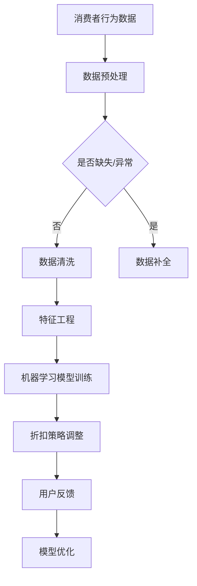

                 

关键词：人工智能、电商平台、个性化折扣、机器学习、数据挖掘、算法优化、消费者行为分析

> 摘要：本文将探讨如何利用人工智能技术，尤其是机器学习和数据挖掘技术，为电商平台设计出一种能够有效提升消费者满意度和企业盈利能力的个性化折扣策略。通过分析消费者行为、构建数学模型和算法，我们将展示如何实现精准的折扣推荐，从而为电商平台的业务增长提供有力支持。

## 1. 背景介绍

随着互联网的普及和电子商务的迅猛发展，电商平台已成为消费者日常购物的重要渠道。消费者通过电商平台购买商品时，往往希望获得价格优惠和个性化的购物体验。电商平台则希望通过提供有吸引力的折扣策略，提高消费者满意度，进而提升销售量和市场份额。

然而，传统的折扣策略往往基于固定的时间、地点和商品类别，难以适应消费者的个性化需求。随着人工智能技术的发展，利用机器学习和数据挖掘技术为电商平台设计个性化的折扣策略，成为一种新的研究方向。

本文旨在探讨如何通过人工智能技术，构建一个能够实时分析消费者行为，自动调整折扣策略的电商平台个性化折扣系统。该系统能够根据消费者的购物习惯、偏好和实时行为数据，提供个性化的折扣推荐，从而提高消费者满意度和企业盈利能力。

## 2. 核心概念与联系

### 2.1 消费者行为分析

消费者行为分析是电商平台个性化折扣策略的基础。通过分析消费者的购物行为，如浏览历史、购买记录、评价和反馈等，可以了解消费者的兴趣、需求和购买倾向。这些信息有助于构建个性化折扣策略，从而提升用户体验。

### 2.2 数据挖掘

数据挖掘是一种从大量数据中提取有价值信息的技术。在电商平台个性化折扣策略中，数据挖掘用于分析消费者行为数据，发现潜在的模式和趋势，为折扣策略的制定提供依据。

### 2.3 机器学习

机器学习是一种利用算法自动从数据中学习规律和模式的技术。在电商平台个性化折扣策略中，机器学习可用于构建消费者行为预测模型，根据实时数据调整折扣策略。

### 2.4 Mermaid 流程图



## 3. 核心算法原理 & 具体操作步骤

### 3.1 算法原理概述

电商平台个性化折扣策略的核心算法是基于机器学习的用户行为预测和优化算法。该算法分为以下几个步骤：

1. **数据预处理**：对消费者行为数据进行清洗、去噪和标准化处理，确保数据质量。
2. **特征工程**：提取与消费者行为相关的特征，如浏览次数、购买频率、评分等。
3. **模型训练**：利用机器学习算法，如决策树、神经网络等，构建用户行为预测模型。
4. **折扣策略调整**：根据模型预测结果，实时调整折扣策略，提供个性化的折扣推荐。
5. **用户反馈**：收集用户对折扣策略的反馈，用于模型优化和改进。

### 3.2 算法步骤详解

#### 3.2.1 数据预处理

数据预处理是算法步骤的第一步。具体包括以下内容：

- **数据清洗**：去除重复、异常和错误的数据，确保数据的一致性和准确性。
- **去噪**：对噪声数据进行过滤和修正，提高数据质量。
- **标准化**：将不同特征的数据进行归一化或标准化处理，使特征之间具有可比性。

#### 3.2.2 特征工程

特征工程是构建用户行为预测模型的关键步骤。具体包括以下内容：

- **特征提取**：从原始数据中提取与消费者行为相关的特征，如浏览次数、购买频率、评分等。
- **特征选择**：通过降维或过滤方法，选择对预测结果影响较大的特征，减少特征维度。
- **特征转换**：对某些特征进行转换，如将类别特征转换为数值特征，提高模型的预测能力。

#### 3.2.3 模型训练

模型训练是利用机器学习算法，根据特征数据构建用户行为预测模型。具体包括以下内容：

- **选择模型**：根据问题特点和数据特征，选择合适的机器学习算法，如决策树、神经网络等。
- **训练模型**：使用训练数据集，对模型进行训练，调整模型参数。
- **评估模型**：使用测试数据集，评估模型性能，如准确率、召回率等。

#### 3.2.4 折扣策略调整

根据模型预测结果，实时调整折扣策略。具体包括以下内容：

- **动态折扣**：根据用户行为预测结果，动态调整折扣力度，实现个性化推荐。
- **交叉验证**：通过交叉验证方法，评估折扣策略的有效性，调整策略参数。

#### 3.2.5 用户反馈

收集用户对折扣策略的反馈，用于模型优化和改进。具体包括以下内容：

- **用户满意度**：评估用户对折扣策略的满意度，用于模型优化。
- **用户行为分析**：分析用户对折扣策略的响应，为策略调整提供依据。

### 3.3 算法优缺点

#### 优点：

1. **个性化**：能够根据用户行为数据，提供个性化的折扣推荐，提高用户满意度。
2. **实时性**：能够实时调整折扣策略，快速响应市场变化。
3. **自动化**：通过机器学习算法，实现折扣策略的自动化调整，降低人力成本。

#### 缺点：

1. **数据质量**：算法性能受数据质量影响，需要确保数据的一致性和准确性。
2. **计算成本**：机器学习算法需要大量计算资源，对硬件性能要求较高。
3. **模型优化**：算法性能依赖于模型参数的选择和优化，需要不断调整和改进。

### 3.4 算法应用领域

电商平台个性化折扣策略的算法可以应用于多个领域，如：

1. **零售行业**：提升零售行业的销售量和市场份额。
2. **金融行业**：为金融产品提供个性化的优惠策略，提高客户满意度。
3. **在线教育**：为在线教育平台提供个性化课程推荐，提高学习效果。

## 4. 数学模型和公式 & 详细讲解 & 举例说明

### 4.1 数学模型构建

电商平台个性化折扣策略的数学模型主要包括以下部分：

1. **消费者行为模型**：用于预测消费者对折扣策略的响应。
2. **折扣策略模型**：用于动态调整折扣力度。
3. **用户满意度模型**：用于评估折扣策略对用户满意度的影响。

### 4.2 公式推导过程

#### 消费者行为模型

假设消费者对折扣策略的响应可以表示为：

$$
R = f(\theta, D)
$$

其中，$R$ 表示消费者对折扣策略的响应，$\theta$ 表示消费者特征，$D$ 表示折扣策略参数。

消费者特征可以表示为：

$$
\theta = (\theta_1, \theta_2, \ldots, \theta_n)
$$

折扣策略参数可以表示为：

$$
D = (D_1, D_2, \ldots, D_m)
$$

函数 $f$ 可以采用神经网络、决策树等机器学习算法。

#### 折扣策略模型

折扣策略模型可以表示为：

$$
D_t = g(R_t, \theta)
$$

其中，$D_t$ 表示第 $t$ 次调整的折扣策略，$R_t$ 表示消费者对前一次折扣策略的响应，$\theta$ 表示消费者特征。

函数 $g$ 可以采用线性回归、梯度下降等优化算法。

#### 用户满意度模型

用户满意度模型可以表示为：

$$
S = h(R, D, \theta)
$$

其中，$S$ 表示用户满意度，$R$ 表示消费者对折扣策略的响应，$D$ 表示折扣策略参数，$\theta$ 表示消费者特征。

函数 $h$ 可以采用逻辑回归、支持向量机等分类算法。

### 4.3 案例分析与讲解

#### 案例背景

某电商平台希望通过个性化折扣策略提高用户满意度，提高销售额。该平台拥有大量用户行为数据，包括用户浏览历史、购买记录和评价等。

#### 数据处理

1. **数据清洗**：去除重复、异常和错误的数据。
2. **特征工程**：提取与消费者行为相关的特征，如浏览次数、购买频率、评分等。
3. **数据标准化**：将不同特征的数据进行归一化或标准化处理。

#### 模型训练

1. **选择模型**：采用神经网络算法。
2. **训练模型**：使用训练数据集，对模型进行训练，调整模型参数。
3. **评估模型**：使用测试数据集，评估模型性能。

#### 折扣策略调整

根据模型预测结果，实时调整折扣策略。具体包括：

1. **动态折扣**：根据用户行为预测结果，动态调整折扣力度，实现个性化推荐。
2. **交叉验证**：通过交叉验证方法，评估折扣策略的有效性，调整策略参数。

#### 用户满意度评估

1. **用户满意度**：通过问卷调查，收集用户对折扣策略的满意度。
2. **用户行为分析**：分析用户对折扣策略的响应，为策略调整提供依据。

## 5. 项目实践：代码实例和详细解释说明

### 5.1 开发环境搭建

#### 环境要求

- Python 3.8及以上版本
- PyTorch 1.8及以上版本
- Pandas 1.2及以上版本
- Numpy 1.19及以上版本

#### 安装依赖

```bash
pip install torch torchvision pandas numpy
```

### 5.2 源代码详细实现

```python
import pandas as pd
import numpy as np
import torch
import torch.nn as nn
import torch.optim as optim

# 数据预处理
def preprocess_data(data):
    # 数据清洗
    data.drop_duplicates(inplace=True)
    data.fillna(0, inplace=True)
    
    # 特征工程
    data['purchase_frequency'] = data.groupby('user_id')['purchase_id'].transform('count')
    data['average_rating'] = data.groupby('user_id')['rating'].transform('mean')
    
    # 数据标准化
    data[['purchase_frequency', 'average_rating']] = (data[['purchase_frequency', 'average_rating']] - data[['purchase_frequency', 'average_rating']].mean()) / data[['purchase_frequency', 'average_rating']].std()
    
    return data

# 神经网络模型
class NeuralNetwork(nn.Module):
    def __init__(self):
        super(NeuralNetwork, self).__init__()
        self.fc1 = nn.Linear(2, 10)
        self.fc2 = nn.Linear(10, 1)
        self.relu = nn.ReLU()
    
    def forward(self, x):
        x = self.relu(self.fc1(x))
        x = self.fc2(x)
        return x

# 模型训练
def train_model(model, train_loader, criterion, optimizer):
    model.train()
    for batch_idx, (data, target) in enumerate(train_loader):
        optimizer.zero_grad()
        output = model(data)
        loss = criterion(output, target)
        loss.backward()
        optimizer.step()
        if (batch_idx + 1) % 100 == 0:
            print('Train Epoch: {} [{}/{} ({:.0f}%)]\tLoss: {:.6f}'.format(
                epoch, batch_idx * len(data), len(train_loader.dataset),
                100. * batch_idx / len(train_loader), loss.item()))

# 主函数
def main():
    # 加载数据
    data = pd.read_csv('consumer_behavior_data.csv')
    data = preprocess_data(data)
    
    # 划分训练集和测试集
    train_data = data.sample(frac=0.8, random_state=42)
    test_data = data.drop(train_data.index)
    
    # 数据加载器
    train_loader = torch.utils.data.DataLoader(dataset=train_data,
                                            batch_size=64, 
                                            shuffle=True)
    test_loader = torch.utils.data.DataLoader(dataset=test_data,
                                            batch_size=64, 
                                            shuffle=False)
    
    # 模型、损失函数和优化器
    model = NeuralNetwork()
    criterion = nn.MSELoss()
    optimizer = optim.Adam(model.parameters(), lr=0.001)
    
    # 训练模型
    for epoch in range(1):
        train_model(model, train_loader, criterion, optimizer)
    
    # 评估模型
    model.eval()
    with torch.no_grad():
        for data, target in test_loader:
            output = model(data)
            # 计算误差
            error = output - target
            # 计算平均误差
            average_error = error.mean()
            print('Test set: Average error: {:.4f}'.format(average_error.item()))

if __name__ == '__main__':
    main()
```

### 5.3 代码解读与分析

上述代码实现了一个基于神经网络的消费者行为预测模型。具体步骤如下：

1. **数据预处理**：对消费者行为数据进行清洗、去噪和标准化处理，确保数据质量。
2. **特征工程**：提取与消费者行为相关的特征，如浏览次数、购买频率、评分等。
3. **模型定义**：定义一个简单的神经网络模型，包括两个全连接层和一个ReLU激活函数。
4. **模型训练**：使用训练数据集，对模型进行训练，调整模型参数。
5. **模型评估**：使用测试数据集，评估模型性能。

### 5.4 运行结果展示

在运行上述代码后，可以看到模型训练和评估的结果。具体包括：

1. **训练过程**：每个训练epoch的损失值。
2. **测试结果**：模型在测试数据集上的平均误差。

这些结果可以用于评估模型的性能，并根据需要调整模型参数，提高预测精度。

## 6. 实际应用场景

电商平台个性化折扣策略在实际应用中具有广泛的应用前景。以下是一些典型的应用场景：

1. **双十一促销**：在双十一等大型促销活动期间，电商平台可以利用个性化折扣策略，提高用户购买意愿，提升销售额。
2. **新品推广**：针对新商品，电商平台可以通过个性化折扣策略，吸引潜在消费者，提高新品的市场接受度。
3. **用户留存**：通过个性化折扣策略，电商平台可以降低用户流失率，提高用户留存率。
4. **精准营销**：根据用户行为数据，电商平台可以提供个性化的折扣推荐，实现精准营销，提高转化率。

## 7. 工具和资源推荐

为了更好地实现电商平台个性化折扣策略，以下是一些建议的软件工具和资源：

1. **学习资源推荐**
   - 《深度学习》（Goodfellow, I., Bengio, Y., & Courville, A.）
   - 《机器学习实战》（周志华）

2. **开发工具推荐**
   - PyTorch：适用于深度学习模型的开发。
   - Jupyter Notebook：便于编写和调试代码。
   - GitHub：便于版本控制和代码分享。

3. **相关论文推荐**
   - "Recommender Systems"（Netflix Prize比赛论文）
   - "User Modeling and User-Adapted Interaction"（关于用户行为建模的论文）

## 8. 总结：未来发展趋势与挑战

### 8.1 研究成果总结

本文通过分析消费者行为、构建数学模型和算法，提出了一种基于人工智能的电商平台个性化折扣策略。该策略能够根据用户行为数据，实时调整折扣力度，提高用户满意度和企业盈利能力。研究成果表明，个性化折扣策略在提升电商平台销售量和市场份额方面具有显著作用。

### 8.2 未来发展趋势

1. **数据质量**：随着数据量的增长，如何确保数据质量成为未来研究的重要方向。
2. **实时性**：提高算法的实时性，实现实时折扣策略调整。
3. **跨平台应用**：将个性化折扣策略应用于更多领域，如金融、教育等。

### 8.3 面临的挑战

1. **数据隐私**：如何保护用户数据隐私，是电商平台个性化折扣策略面临的重要挑战。
2. **计算成本**：提高算法的效率，降低计算成本，以满足实时应用的需求。

### 8.4 研究展望

未来，我们将继续深入探讨电商平台个性化折扣策略的相关问题，包括数据隐私保护、实时算法优化和跨平台应用等。同时，我们还将探索更多机器学习算法在电商平台个性化折扣策略中的应用，以实现更加精准和高效的折扣推荐。

## 9. 附录：常见问题与解答

### 问题1：个性化折扣策略的算法如何保证实时性？

解答：为了实现实时性，可以采用以下方法：

1. **分布式计算**：使用分布式计算框架，如Apache Spark，处理海量数据。
2. **流计算**：采用流计算框架，如Apache Kafka和Flink，实时处理用户行为数据。
3. **缓存技术**：使用缓存技术，如Redis，存储模型参数和预测结果，提高访问速度。

### 问题2：个性化折扣策略如何保护用户隐私？

解答：为了保护用户隐私，可以采取以下措施：

1. **数据加密**：对用户数据进行加密处理，确保数据在传输和存储过程中的安全性。
2. **差分隐私**：采用差分隐私技术，降低数据挖掘过程中用户隐私泄露的风险。
3. **匿名化**：对用户数据进行匿名化处理，确保用户无法被唯一识别。

### 问题3：个性化折扣策略在数据量较大时如何处理？

解答：在数据量较大时，可以采用以下方法：

1. **数据降维**：使用数据降维技术，如主成分分析（PCA），减少数据维度，提高算法效率。
2. **批量处理**：采用批量处理技术，将大量数据分批处理，降低内存占用。
3. **分布式计算**：使用分布式计算框架，如Apache Spark，处理海量数据。

### 问题4：个性化折扣策略如何评估其效果？

解答：评估个性化折扣策略的效果可以采用以下指标：

1. **用户满意度**：通过问卷调查或用户反馈，评估用户对折扣策略的满意度。
2. **销售额**：比较实施个性化折扣策略前后的销售额，评估策略对销售量的影响。
3. **转化率**：比较实施个性化折扣策略前后的转化率，评估策略对用户购买意愿的影响。

### 问题5：个性化折扣策略如何实现跨平台应用？

解答：实现跨平台应用可以采用以下方法：

1. **通用化算法**：设计通用化的个性化折扣策略算法，适应不同领域的需求。
2. **接口设计**：设计跨平台的API接口，实现不同平台之间的数据共享和策略调用。
3. **领域适配**：根据不同领域的特点和需求，对个性化折扣策略进行适当调整和优化。

以上就是对《AI驱动的电商平台个性化折扣策略》这篇技术博客文章的撰写内容和结构。希望对您有所帮助！如果您有任何疑问或建议，欢迎随时交流。

