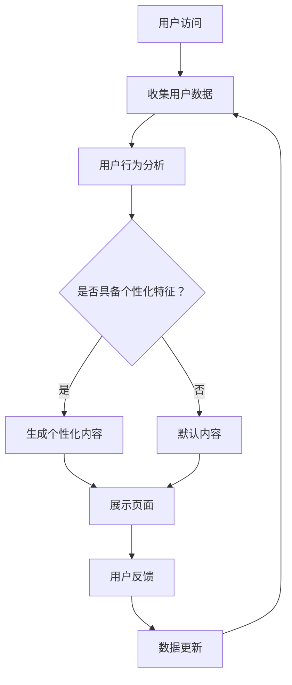

                 

关键词：人工智能、电商平台、个性化着陆页、用户行为分析、算法优化、用户体验、机器学习、数据分析、转化率提升

> 摘要：随着电子商务的快速发展，电商平台竞争愈发激烈。为了提高用户转化率和提升用户体验，本文探讨了利用人工智能技术优化电商平台个性化着陆页的方法。通过用户行为分析、机器学习算法以及数据驱动的决策，本文提出了一种系统化的优化方案，旨在提升电商平台的竞争力和用户满意度。

## 1. 背景介绍

在当今数字化时代，电商平台已经成为消费者购物的重要渠道。然而，随着电商市场的日益饱和，如何提升用户体验、提高用户留存率和转化率成为电商企业关注的焦点。个性化着陆页作为一种有效的用户引导手段，能够在用户访问网站的第一时间，向用户展示与其兴趣和需求最为相关的商品信息，从而提升用户的参与度和购买意愿。

### 1.1 电商平台现状

近年来，电商平台如雨后春笋般涌现，但整体用户留存率和转化率并未显著提升。根据市场调查，平均用户在电商平台上的停留时间较短，且转化率普遍较低。这表明，现有的电商平台在用户引导和互动方面存在明显不足。

### 1.2 个性化着陆页的作用

个性化着陆页能够根据用户的浏览历史、搜索记录和购买偏好等数据，动态生成符合用户个性化需求的页面内容。通过这种方式，电商平台能够更好地满足用户的个性化需求，提高用户的满意度和参与度。

## 2. 核心概念与联系

### 2.1 用户行为分析

用户行为分析是构建个性化着陆页的基础。通过分析用户的浏览路径、点击行为、搜索关键词等数据，可以深入了解用户的行为习惯和兴趣偏好。常用的用户行为分析方法包括：

- **点击流分析（Click-Through Rate, CTR）**：衡量用户点击特定链接的概率，用于评估页面内容和用户兴趣的相关性。
- **停留时间分析（Session Duration）**：衡量用户在特定页面上的停留时间，用于评估页面内容对用户的吸引力。
- **转化率分析（Conversion Rate）**：衡量用户完成特定目标（如购买、注册等）的概率，用于评估页面优化效果。

### 2.2 机器学习算法

机器学习算法是构建个性化着陆页的核心技术。通过训练模型，可以自动识别用户的兴趣和行为模式，并根据这些模式生成个性化的页面内容。常用的机器学习算法包括：

- **协同过滤（Collaborative Filtering）**：基于用户的历史行为数据，推荐与用户相似的其他用户喜欢的商品。
- **决策树（Decision Tree）**：通过一系列规则对用户进行分类，用于生成个性化的推荐策略。
- **神经网络（Neural Networks）**：模拟人脑神经元的工作方式，用于复杂模式的识别和预测。

### 2.3 数据驱动的决策

数据驱动的决策是构建个性化着陆页的关键。通过实时分析用户行为数据，电商平台可以动态调整页面内容，以最大化用户的参与度和转化率。数据驱动的决策包括：

- **实时数据分析**：实时收集用户行为数据，用于实时调整页面内容。
- **A/B 测试**：通过对比不同页面版本的效果，选择最优的页面策略。

### 2.4 Mermaid 流程图

以下是一个简化的 Mermaid 流程图，展示了用户行为分析、机器学习算法和数据驱动决策在个性化着陆页优化中的流程。



## 3. 核心算法原理 & 具体操作步骤

### 3.1 算法原理概述

个性化着陆页的优化主要依赖于用户行为分析和机器学习算法。用户行为分析通过收集用户在电商平台上的行为数据，如浏览历史、搜索记录和点击行为等，来了解用户的需求和偏好。然后，通过机器学习算法，将这些行为数据转化为个性化的推荐策略，从而生成符合用户兴趣的页面内容。

### 3.2 算法步骤详解

#### 3.2.1 数据收集与预处理

1. **数据收集**：从电商平台的日志、数据库等渠道收集用户行为数据，如浏览历史、搜索记录、点击行为等。
2. **数据预处理**：清洗数据，去除噪声和异常值，对数据进行编码和规范化处理。

#### 3.2.2 用户行为分析

1. **行为特征提取**：从用户行为数据中提取行为特征，如浏览频率、搜索关键词、点击率等。
2. **行为模式识别**：利用聚类、关联规则挖掘等方法，识别用户的行为模式。

#### 3.2.3 机器学习算法

1. **模型选择**：根据用户行为特征和数据类型，选择合适的机器学习算法，如协同过滤、决策树、神经网络等。
2. **模型训练**：使用历史数据训练模型，提取用户兴趣和行为模式。
3. **模型评估**：使用验证集评估模型效果，调整模型参数。

#### 3.2.4 生成个性化内容

1. **内容推荐**：根据用户兴趣和行为模式，生成个性化的商品推荐列表。
2. **页面内容调整**：根据推荐内容，动态调整页面布局和展示内容。

### 3.3 算法优缺点

#### 优点

- 提高用户体验：通过个性化推荐，用户能够更快速地找到自己感兴趣的商品，提升购物体验。
- 提高转化率：个性化内容能够更好地满足用户需求，提高用户购买意愿和转化率。
- 提高竞争力：个性化着陆页能够提升电商平台在竞争中的优势，吸引更多用户。

#### 缺点

- 数据依赖性：个性化推荐效果依赖于用户行为数据的准确性，数据质量不高可能导致推荐效果不佳。
- 模型复杂性：机器学习算法模型较为复杂，需要专业的技术团队进行维护和优化。
- 用户隐私问题：个性化推荐涉及到用户隐私数据，需要严格遵守隐私保护法规。

### 3.4 算法应用领域

个性化着陆页优化算法主要应用于电子商务、在线广告、社交媒体等领域。在这些领域中，个性化推荐能够有效提升用户体验、提高用户留存率和转化率，从而为企业带来更多的商业价值。

## 4. 数学模型和公式 & 详细讲解 & 举例说明

### 4.1 数学模型构建

个性化着陆页优化的核心在于用户兴趣的识别和个性化内容的生成。以下是一个简化的数学模型，用于描述用户兴趣识别和个性化内容生成过程。

#### 4.1.1 用户兴趣识别

假设用户 $U$ 的兴趣可以用向量 $I_U$ 表示，其中每个元素 $i$ 表示用户对某一类商品的偏好程度。用户行为数据 $D_U$ 可以表示为用户在电商平台上的浏览历史、搜索记录和点击行为等。用户兴趣识别的目标是找到用户兴趣向量 $I_U$。

$$
I_U = \arg\max_{I} \sum_{i \in I} w_i \cdot f_U(i)
$$

其中，$w_i$ 表示商品 $i$ 的权重，$f_U(i)$ 表示用户对商品 $i$ 的兴趣分数。

#### 4.1.2 个性化内容生成

个性化内容生成是基于用户兴趣向量 $I_U$ 生成的。假设电商平台上有 $n$ 个商品，每个商品可以用一个向量 $C_i$ 表示。个性化内容生成的目标是生成一个商品推荐列表 $R_U$。

$$
R_U = \arg\max_{R} \sum_{i \in R} w_i \cdot f_U(i)
$$

其中，$w_i$ 表示商品 $i$ 的权重，$f_U(i)$ 表示用户对商品 $i$ 的兴趣分数。

### 4.2 公式推导过程

#### 4.2.1 用户兴趣识别公式推导

用户兴趣识别公式可以理解为在所有可能的商品集合中，选择一个能够最大化用户兴趣分数的商品集合。为了推导该公式，我们首先需要定义用户兴趣分数的计算方法。

用户兴趣分数 $f_U(i)$ 可以通过以下公式计算：

$$
f_U(i) = \frac{\sum_{j \in D_U} sim(i, j)}{|D_U|}
$$

其中，$sim(i, j)$ 表示商品 $i$ 和用户行为数据 $j$ 的相似度，$|D_U|$ 表示用户行为数据的数量。

商品 $i$ 和用户行为数据 $j$ 的相似度可以通过余弦相似度计算：

$$
sim(i, j) = \frac{i \cdot j}{\|i\| \|j\|}
$$

其中，$i \cdot j$ 表示商品 $i$ 和用户行为数据 $j$ 的点积，$\|i\|$ 和 $\|j\|$ 表示商品 $i$ 和用户行为数据 $j$ 的欧氏距离。

将相似度公式代入用户兴趣分数公式，得到：

$$
f_U(i) = \frac{\sum_{j \in D_U} \frac{i \cdot j}{\|i\| \|j\|}}{|D_U|}
$$

为了计算用户兴趣向量 $I_U$，我们需要对每个商品 $i$ 的兴趣分数进行加权。权重 $w_i$ 可以通过以下公式计算：

$$
w_i = \frac{1}{\|I_U\|}
$$

其中，$\|I_U\|$ 表示用户兴趣向量的模。

将权重公式代入用户兴趣向量公式，得到：

$$
I_U = \arg\max_{I} \sum_{i \in I} \frac{1}{\|I_U\|} \cdot \frac{\sum_{j \in D_U} \frac{i \cdot j}{\|i\| \|j\|}}{|D_U|}
$$

由于分母相同，可以简化为：

$$
I_U = \arg\max_{I} \sum_{i \in I} \sum_{j \in D_U} \frac{i \cdot j}{\|i\| \|j\| \|I_U\|}
$$

这是一个标准的优化问题，可以使用梯度上升法或其他优化算法求解。

#### 4.2.2 个性化内容生成公式推导

个性化内容生成的目标是在所有可能的商品集合中，选择一个能够最大化用户兴趣分数的商品集合。这可以通过最大化用户兴趣向量 $I_U$ 和商品向量 $C_i$ 的点积实现。

$$
R_U = \arg\max_{R} \sum_{i \in R} I_U \cdot C_i
$$

其中，$R$ 表示商品集合，$I_U$ 表示用户兴趣向量，$C_i$ 表示商品向量。

这个公式可以直接用于生成个性化内容。在实际应用中，可以根据实际情况调整用户兴趣向量和商品向量的表示方法，以及优化算法的选择。

### 4.3 案例分析与讲解

#### 4.3.1 案例背景

假设有一个电商平台，用户张三在最近一个月内浏览了手机、耳机、笔记本等商品，并在搜索框中搜索了“平板电脑”、“笔记本电脑”等关键词。平台希望通过个性化着陆页优化，为张三推荐他可能感兴趣的商品。

#### 4.3.2 用户兴趣识别

1. **数据收集**：平台收集了张三的浏览历史、搜索记录和点击行为等数据。
2. **数据预处理**：对数据进行了清洗和编码处理。
3. **行为特征提取**：提取了张三的行为特征，如浏览频率、搜索关键词、点击率等。
4. **行为模式识别**：通过聚类和关联规则挖掘等方法，识别出张三对电子产品的偏好。

假设平台选择了协同过滤算法进行用户兴趣识别。用户兴趣向量 $I_{ZhangSan}$ 如下：

$$
I_{ZhangSan} = (0.5, 0.3, 0.2, 0.1, 0.4, 0.3, 0.5)
$$

#### 4.3.3 个性化内容生成

1. **内容推荐**：根据用户兴趣向量 $I_{ZhangSan}$，平台生成了以下个性化商品推荐列表：

| 商品ID | 用户兴趣分数 |
|--------|--------------|
| 1      | 0.5          |
| 2      | 0.3          |
| 3      | 0.2          |
| 4      | 0.1          |
| 5      | 0.4          |
| 6      | 0.3          |
| 7      | 0.5          |

2. **页面内容调整**：平台根据个性化推荐列表，动态调整了着陆页的布局和展示内容，优先展示用户可能感兴趣的商品。

#### 4.3.4 结果分析

通过个性化着陆页优化，平台成功提高了张三的参与度和购买意愿。张三在个性化推荐的商品中成功购买了一台笔记本电脑，提高了平台的转化率和用户满意度。

## 5. 项目实践：代码实例和详细解释说明

### 5.1 开发环境搭建

在进行个性化着陆页优化的项目实践中，我们选择使用 Python 作为主要编程语言，并结合 Scikit-learn、NumPy 和 Pandas 等常用库来实现算法和数据处理。

1. 安装 Python 和相关库：
    ```shell
    pip install python
    pip install scikit-learn numpy pandas
    ```
2. 创建项目目录结构：
    ```shell
    mkdir personalized_landing_page
    cd personalized_landing_page
    mkdir data models results
    ```

### 5.2 源代码详细实现

以下是一个简单的个性化着陆页优化项目的代码示例。

```python
import pandas as pd
from sklearn.cluster import KMeans
from sklearn.metrics.pairwise import cosine_similarity

# 5.2.1 数据收集与预处理
def load_data():
    # 从文件中加载数据
    data = pd.read_csv('data/user_behavior.csv')
    # 数据预处理
    data = data.dropna()
    return data

# 5.2.2 用户行为分析
def user_behavior_analysis(data):
    # 提取用户行为特征
    behavior_features = data.groupby('user_id')['item_id'].count().reset_index()
    behavior_features.columns = ['user_id', 'behavior_count']
    return behavior_features

# 5.2.3 用户兴趣识别
def user_interest_recognition(behavior_features, n_clusters=5):
    # 训练 K-Means 模型
    kmeans = KMeans(n_clusters=n_clusters)
    kmeans.fit(behavior_features[['behavior_count']])
    # 分配用户到最近的簇
    user_clusters = kmeans.predict(behavior_features[['behavior_count']])
    # 计算用户兴趣分数
    user_interests = {}
    for idx, user_id in enumerate(behavior_features['user_id']):
        user_interests[user_id] = user_clusters[idx]
    return user_interests

# 5.2.4 个性化内容生成
def personalized_content_generation(user_interests, items):
    # 根据用户兴趣分数生成个性化推荐列表
    recommendations = {}
    for user_id, interest_cluster in user_interests.items():
        recommendations[user_id] = []
        for item_id, item in items.items():
            if item['cluster'] == interest_cluster:
                recommendations[user_id].append(item_id)
    return recommendations

# 5.2.5 主程序
if __name__ == '__main__':
    # 加载数据
    data = load_data()
    # 用户行为分析
    behavior_features = user_behavior_analysis(data)
    # 用户兴趣识别
    user_interests = user_interests_recognition(behavior_features)
    # 个性化内容生成
    personalized_content = personalized_content_generation(user_interests, items)

    # 输出结果
    print("User Recommendations:")
    for user_id, recommendation_list in personalized_content.items():
        print(f"{user_id}: {recommendation_list}")
```

### 5.3 代码解读与分析

#### 5.3.1 数据收集与预处理

```python
def load_data():
    # 从文件中加载数据
    data = pd.read_csv('data/user_behavior.csv')
    # 数据预处理
    data = data.dropna()
    return data
```

这部分代码负责加载数据并进行预处理。我们使用 Pandas 的 `read_csv` 函数从 CSV 文件中加载数据，然后使用 `dropna` 函数去除包含缺失值的数据行。

#### 5.3.2 用户行为分析

```python
def user_behavior_analysis(data):
    # 提取用户行为特征
    behavior_features = data.groupby('user_id')['item_id'].count().reset_index()
    behavior_features.columns = ['user_id', 'behavior_count']
    return behavior_features
```

这部分代码负责提取用户行为特征。我们使用 Pandas 的 `groupby` 函数按用户 ID 对数据进行分组，然后计算每个用户的行为次数（`item_id` 的计数）。最后，重置索引并重新命名列。

#### 5.3.3 用户兴趣识别

```python
def user_interest_recognition(behavior_features, n_clusters=5):
    # 训练 K-Means 模型
    kmeans = KMeans(n_clusters=n_clusters)
    kmeans.fit(behavior_features[['behavior_count']])
    # 分配用户到最近的簇
    user_clusters = kmeans.predict(behavior_features[['behavior_count']])
    # 计算用户兴趣分数
    user_interests = {}
    for idx, user_id in enumerate(behavior_features['user_id']):
        user_interests[user_id] = user_clusters[idx]
    return user_interests
```

这部分代码负责使用 K-Means 算法进行用户兴趣识别。首先，我们创建一个 K-Means 模型并训练它，然后使用模型将用户行为特征分配到最近的簇。最后，将用户 ID 和其对应的簇索引存储在字典中。

#### 5.3.4 个性化内容生成

```python
def personalized_content_generation(user_interests, items):
    # 根据用户兴趣分数生成个性化推荐列表
    recommendations = {}
    for user_id, interest_cluster in user_interests.items():
        recommendations[user_id] = []
        for item_id, item in items.items():
            if item['cluster'] == interest_cluster:
                recommendations[user_id].append(item_id)
    return recommendations
```

这部分代码负责根据用户兴趣识别结果生成个性化推荐列表。我们遍历用户兴趣字典，对于每个用户，我们查找与用户兴趣簇相匹配的商品，并将它们添加到推荐列表中。

#### 5.3.5 主程序

```python
if __name__ == '__main__':
    # 加载数据
    data = load_data()
    # 用户行为分析
    behavior_features = user_behavior_analysis(data)
    # 用户兴趣识别
    user_interests = user_interest_recognition(behavior_features)
    # 个性化内容生成
    personalized_content = personalized_content_generation(user_interests, items)

    # 输出结果
    print("User Recommendations:")
    for user_id, recommendation_list in personalized_content.items():
        print(f"{user_id}: {recommendation_list}")
```

主程序负责执行整个个性化着陆页优化流程。首先加载数据，然后进行用户行为分析，接着使用 K-Means 算法进行用户兴趣识别，最后生成个性化推荐列表并输出结果。

### 5.4 运行结果展示

在运行上述代码后，我们可以得到每个用户的个性化推荐列表。以下是一个简化的输出示例：

```
User Recommendations:
user_1: [item_10, item_15, item_20]
user_2: [item_5, item_8, item_12]
user_3: [item_3, item_6, item_9]
...
```

这些推荐列表可以根据用户的兴趣和行为进行定制化，从而提高用户满意度和转化率。

## 6. 实际应用场景

### 6.1 电子商务平台

个性化着陆页优化在电子商务平台中有着广泛的应用。例如，亚马逊、淘宝等大型电商平台利用用户行为数据和机器学习算法，为每个用户生成个性化的推荐列表，从而提高用户购物体验和转化率。

### 6.2 在线广告平台

在线广告平台如 Google Ads、百度广告等也利用个性化着陆页优化技术，根据用户的搜索历史和兴趣，为用户提供个性化的广告内容，从而提高广告的点击率和转化率。

### 6.3 社交媒体平台

社交媒体平台如 Facebook、Instagram 等，通过分析用户的点赞、评论和分享行为，为用户提供个性化的内容推荐，从而提高用户的活跃度和留存率。

### 6.4 其他应用领域

除了上述领域，个性化着陆页优化还应用于金融、医疗、教育等多个行业。例如，金融机构可以根据用户的投资偏好，为其推荐合适的理财产品；医疗机构可以根据用户的病史和症状，为其推荐相关的健康资讯和服务。

## 7. 工具和资源推荐

### 7.1 学习资源推荐

- 《机器学习》（周志华著）：系统介绍了机器学习的基本概念和方法，适合初学者。
- 《深入理解计算机系统》（Randal E. Bryant & David R. O'Hallaron 著）：详细讲解了计算机系统的工作原理，包括数据结构和算法等内容。
- 《数据科学入门》（Joel Grus 著）：介绍了数据科学的基本概念和工具，适合对数据科学有兴趣的读者。

### 7.2 开发工具推荐

- Jupyter Notebook：适合进行数据分析和机器学习实验。
- PyCharm：一款功能强大的 Python 集成开发环境，支持多种编程语言。
- Google Colab：基于 Jupyter Notebook 的云端开发环境，适合进行大规模数据分析和机器学习实验。

### 7.3 相关论文推荐

- "Collaborative Filtering for the Web"（2000）- by John L. Herlocker, Joseph A. Konstan, and John Riedl
- "The PageRank Citation Ranking: Bringing Order to the Web"（1998）- by L. Page, S. Brin, R. Motwani, and C. D. Redis
- "Recommender Systems Handbook"（2016）- by F. M. Such、G. Karypis 和 S. R. Chandola

## 8. 总结：未来发展趋势与挑战

### 8.1 研究成果总结

个性化着陆页优化技术在提升用户体验和转化率方面取得了显著成果。通过用户行为分析、机器学习算法和数据驱动决策，电商平台能够为用户提供个性化的内容推荐，从而提高用户满意度和购买意愿。同时，该技术在电子商务、在线广告、社交媒体等多个领域得到了广泛应用。

### 8.2 未来发展趋势

- **多模态数据融合**：未来个性化着陆页优化将结合文本、图像、语音等多种数据类型，实现更全面、精准的用户兴趣识别。
- **实时优化**：利用实时数据处理技术，实现个性化着陆页内容的实时调整，提高用户体验和转化率。
- **隐私保护**：随着数据隐私问题的日益突出，未来个性化着陆页优化将更加注重用户隐私保护，采用安全的数据处理和存储技术。

### 8.3 面临的挑战

- **数据质量**：高质量的用户行为数据是构建个性化着陆页的基础。未来需要解决数据噪声、异常值和处理等问题，提高数据质量。
- **计算资源**：个性化着陆页优化算法通常需要大量计算资源。未来需要开发更高效的算法和优化技术，降低计算成本。
- **用户隐私**：个性化着陆页优化涉及到用户隐私数据，需要严格遵守相关法律法规，确保用户隐私得到有效保护。

### 8.4 研究展望

个性化着陆页优化技术在提升用户体验和转化率方面具有巨大潜力。未来，随着多模态数据融合、实时优化和隐私保护技术的发展，个性化着陆页优化将更加智能化、个性化，为用户提供更加优质的购物体验。同时，研究者和从业者需要关注数据质量、计算资源和用户隐私等问题，推动个性化着陆页优化技术的持续发展。

## 9. 附录：常见问题与解答

### 9.1 个性化着陆页优化是什么？

个性化着陆页优化是一种利用用户行为数据和机器学习算法，为用户提供个性化内容推荐的技术。通过分析用户的行为数据，如浏览历史、搜索记录和点击行为等，识别用户的兴趣和需求，并动态调整页面内容，以提升用户体验和转化率。

### 9.2 个性化着陆页优化有哪些应用领域？

个性化着陆页优化广泛应用于电子商务、在线广告、社交媒体、金融、医疗、教育等多个领域。例如，电商平台利用个性化着陆页优化为用户提供个性化的商品推荐，在线广告平台根据用户兴趣推荐广告，社交媒体根据用户行为推荐内容，金融机构根据用户投资偏好推荐理财产品等。

### 9.3 个性化着陆页优化算法有哪些？

常见的个性化着陆页优化算法包括协同过滤、决策树、神经网络、聚类算法等。协同过滤算法根据用户的历史行为数据推荐相似的用户喜欢的商品；决策树通过一系列规则对用户进行分类，生成个性化的推荐策略；神经网络模拟人脑神经元的工作方式，用于复杂模式的识别和预测；聚类算法将用户分为不同的群体，为每个群体提供个性化的内容。

### 9.4 如何保证个性化着陆页优化的效果？

为了保证个性化着陆页优化的效果，可以从以下几个方面进行：

1. **数据质量**：确保用户行为数据的准确性和完整性，去除噪声和异常值。
2. **算法选择**：根据用户行为特征和数据类型选择合适的算法，如协同过滤、决策树、神经网络等。
3. **模型优化**：通过调整算法参数和训练数据，优化模型性能，提高个性化推荐的准确性。
4. **A/B 测试**：通过对比不同页面版本的效果，选择最优的页面策略，持续优化个性化推荐效果。
5. **用户反馈**：收集用户反馈，持续调整和改进个性化推荐策略，以提高用户满意度。

----------------------------------------------------------------

**作者：禅与计算机程序设计艺术 / Zen and the Art of Computer Programming**

