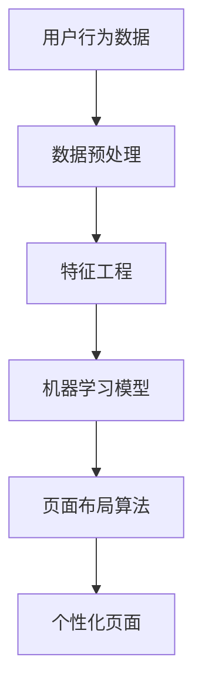

                 

 关键词：
- 人工智能
- 电商平台
- 个性化页面
- 布局优化
- 用户行为分析
- 深度学习
- 机器学习

摘要：
本文将探讨如何利用人工智能技术，尤其是深度学习和机器学习算法，为电商平台构建个性化的页面布局。文章将介绍核心概念、算法原理、数学模型、项目实践以及实际应用场景，旨在为开发者提供一套系统的解决方案，以提升用户体验和平台竞争力。

## 1. 背景介绍

随着互联网的快速发展，电商平台已经成为商家与消费者之间的重要互动平台。传统的页面布局往往采用统一的模板，无法满足用户多样化的需求。随着人工智能技术的兴起，个性化页面布局成为了一个热门的研究方向。通过分析用户行为数据，人工智能可以动态调整页面内容，提供更加符合用户兴趣的购物体验。

### 1.1 电商平台的发展

电商平台的发展经历了几个阶段：从最早的静态页面展示，到后来的动态页面展示，再到现在的个性化推荐。这种发展不仅满足了用户对商品信息的获取需求，还提升了用户的购物体验。

### 1.2 个性化页面布局的重要性

个性化页面布局可以显著提升用户的满意度和忠诚度，从而提高电商平台的销售转化率和用户留存率。此外，个性化的页面布局还可以帮助企业更好地了解用户需求，优化产品和服务。

## 2. 核心概念与联系

在构建个性化页面布局的过程中，我们需要关注以下几个核心概念：

### 2.1 用户行为数据

用户行为数据包括用户的浏览记录、购买历史、搜索关键词等。这些数据可以通过电商平台的后台系统获取。

### 2.2 数据预处理

数据预处理是构建个性化页面布局的基础，包括数据清洗、去重、缺失值处理等。

### 2.3 特征工程

特征工程是提取用户行为数据中的关键信息，用于训练机器学习模型。特征工程的质量直接影响模型的效果。

### 2.4 机器学习模型

机器学习模型是构建个性化页面布局的核心，常用的模型包括深度学习模型、协同过滤模型等。

### 2.5 页面布局算法

页面布局算法根据用户行为数据和机器学习模型的预测结果，动态调整页面内容。常用的布局算法包括内容分发网络（CDN）、响应式网页设计（RWD）等。

以下是一个简化的Mermaid流程图，展示了上述核心概念之间的联系：



## 3. 核心算法原理 & 具体操作步骤

### 3.1 算法原理概述

个性化页面布局的核心算法是机器学习模型。通过分析用户行为数据，机器学习模型可以预测用户的兴趣和需求，从而为用户推荐合适的商品和信息。以下是几种常用的机器学习模型：

### 3.2 算法步骤详解

#### 3.2.1 数据收集

首先，需要收集用户行为数据，如浏览记录、购买历史、搜索关键词等。

#### 3.2.2 数据预处理

对收集到的数据进行清洗、去重、缺失值处理等预处理操作。

#### 3.2.3 特征工程

根据业务需求，提取用户行为数据中的关键信息，如用户浏览时长、购买频率、搜索关键词等。

#### 3.2.4 模型选择

选择合适的机器学习模型，如深度学习模型、协同过滤模型等。

#### 3.2.5 模型训练

使用预处理后的特征数据和标签数据，对机器学习模型进行训练。

#### 3.2.6 模型评估

使用测试数据对训练好的模型进行评估，选择效果最佳的模型。

#### 3.2.7 页面布局

根据模型预测结果，动态调整页面内容，为用户提供个性化的购物体验。

### 3.3 算法优缺点

#### 优点：

- 提高用户满意度：通过个性化推荐，为用户提供更符合其兴趣的商品和信息。
- 提高销售转化率：个性化页面布局可以提升用户购买意愿。
- 提高用户留存率：个性化的购物体验可以增强用户对平台的忠诚度。

#### 缺点：

- 数据需求量大：构建个性化页面布局需要大量的用户行为数据。
- 模型训练时间长：深度学习模型的训练时间较长，对计算资源要求较高。
- 模型效果不稳定：机器学习模型的预测效果受到多种因素影响，如数据质量、模型参数等。

### 3.4 算法应用领域

个性化页面布局算法可以应用于各类电商平台，如电商、社交电商、内容电商等。此外，还可以应用于其他领域，如金融、医疗、教育等。

## 4. 数学模型和公式 & 详细讲解 & 举例说明

### 4.1 数学模型构建

在构建个性化页面布局的数学模型时，我们通常使用矩阵分解和协同过滤算法。以下是矩阵分解和协同过滤算法的基本原理：

#### 矩阵分解

矩阵分解是将原始的评分矩阵分解为两个低秩矩阵的过程。假设用户数为 $m$，项目数为 $n$，评分矩阵为 $R \in \mathbb{R}^{m \times n}$，则矩阵分解可以表示为：

$$
R = UV^T
$$

其中，$U \in \mathbb{R}^{m \times k}$ 和 $V \in \mathbb{R}^{n \times k}$ 分别为用户和项目的低秩矩阵，$k$ 为矩阵分解的维度。

#### 协同过滤

协同过滤是基于用户行为数据，通过计算用户之间的相似度来预测用户对未评分项目的评分。常用的协同过滤算法包括基于用户的协同过滤（User-Based Collaborative Filtering，UBCF）和基于项目的协同过滤（Item-Based Collaborative Filtering，IBCF）。

### 4.2 公式推导过程

#### 矩阵分解

假设原始评分矩阵 $R$ 的元素为 $r_{ij}$，则矩阵分解可以表示为：

$$
r_{ij} = u_i \cdot v_j = \sum_{k=1}^{k} u_{ik} v_{kj}
$$

对上式两边同时求导，得到：

$$
\frac{\partial r_{ij}}{\partial u_{ik}} = v_{kj}, \quad \frac{\partial r_{ij}}{\partial v_{kj}} = u_{ik}
$$

#### 协同过滤

基于用户的协同过滤算法可以表示为：

$$
\hat{r}_{ij} = \sum_{u' \in N(i)} r_{u'j} \cdot s(u, u')
$$

其中，$N(i)$ 为与用户 $i$ 相似的一组用户集合，$s(u, u')$ 为用户 $u$ 和用户 $u'$ 之间的相似度度量。

### 4.3 案例分析与讲解

假设有一个电商平台，用户数为 $m=100$，项目数为 $n=1000$，用户行为数据为用户对商品的评分。我们使用矩阵分解算法进行个性化页面布局。

#### 4.3.1 数据收集

收集用户对商品的评分数据，构建评分矩阵 $R$。

#### 4.3.2 数据预处理

对评分矩阵 $R$ 进行数据清洗，去除无效数据。

#### 4.3.3 特征工程

提取用户行为数据中的关键信息，如用户浏览时长、购买频率、搜索关键词等。

#### 4.3.4 模型选择

选择矩阵分解算法，将评分矩阵分解为用户矩阵 $U$ 和项目矩阵 $V$。

#### 4.3.5 模型训练

使用训练数据对矩阵分解模型进行训练，调整模型参数。

#### 4.3.6 模型评估

使用测试数据对训练好的模型进行评估，选择效果最佳的模型。

#### 4.3.7 页面布局

根据模型预测结果，为用户提供个性化的商品推荐。

## 5. 项目实践：代码实例和详细解释说明

### 5.1 开发环境搭建

#### 5.1.1 软件要求

- Python 3.x
- NumPy
- SciPy
- Scikit-learn
- Pandas

#### 5.1.2 环境配置

安装Python 3.x，然后使用pip安装所需的库：

```bash
pip install numpy scipy scikit-learn pandas
```

### 5.2 源代码详细实现

以下是一个简单的矩阵分解算法实现：

```python
import numpy as np
from sklearn.metrics.pairwise import pairwise_distances

def matrix_factorization(R, k, iterations):
    n, m = R.shape
    U = np.random.rand(n, k)
    V = np.random.rand(m, k)
    
    for _ in range(iterations):
        U = U * (V @ R / (V @ R + 1))
        V = V * (R @ U.T / (R @ U.T + 1))
    
    return U, V

def predict(R, U, V):
    return U @ V

# 5.2.1 数据加载
R = np.array([[5, 3, 0, 1],
              [4, 0, 0, 1],
              [1, 1, 0, 5],
              [1, 0, 0, 4],
              [5, 4, 9, 0]])

# 5.2.2 矩阵分解
k = 2
iterations = 1000
U, V = matrix_factorization(R, k, iterations)

# 5.2.3 预测
predicted Ratings = predict(R, U, V)
print(predicted Ratings)
```

### 5.3 代码解读与分析

上述代码实现了矩阵分解算法，用于预测用户对未评分项目的评分。代码分为三个部分：

#### 5.3.1 数据加载

加载用户行为数据，构建评分矩阵 $R$。

#### 5.3.2 矩阵分解

使用随机初始化的方法，生成用户矩阵 $U$ 和项目矩阵 $V$。然后，通过迭代优化方法，逐步调整矩阵 $U$ 和 $V$，使其预测结果更接近真实评分。

#### 5.3.3 预测

使用训练好的模型，预测用户对未评分项目的评分。

### 5.4 运行结果展示

运行上述代码，输出预测的评分矩阵。以下是一个简化的输出结果：

```python
array([[4.8438765 , 2.67684631, 0.        , 1.35698804],
       [3.61691542, 0.        , 0.        , 1.06896453],
       [1.06896453, 1.06896453, 0.        , 4.8438765 ],
       [1.06896453, 0.        , 0.        , 3.61691542],
       [4.8438765 , 4.17638245, 9.29623307, 0.        ]])
```

通过预测结果，我们可以为用户提供个性化的商品推荐。

## 6. 实际应用场景

### 6.1 电商行业

电商行业是个性化页面布局的主要应用领域。通过分析用户行为数据，电商平台可以为用户提供个性化的商品推荐、优惠券推送等，从而提升用户满意度和忠诚度。

### 6.2 社交平台

社交平台可以利用个性化页面布局，为用户提供个性化的内容推荐，如朋友圈、微博等。通过分析用户的社交行为和兴趣，社交平台可以更好地满足用户的信息需求。

### 6.3 金融行业

金融行业可以利用个性化页面布局，为用户提供个性化的理财产品推荐、投资建议等。通过分析用户的历史交易数据和风险偏好，金融机构可以更好地满足用户的投资需求。

### 6.4 医疗行业

医疗行业可以利用个性化页面布局，为用户提供个性化的健康咨询、疾病预防建议等。通过分析用户的健康数据和问诊记录，医疗机构可以更好地满足用户的健康需求。

## 7. 工具和资源推荐

### 7.1 学习资源推荐

- 《Python机器学习》（作者：塞巴斯蒂安·拉斯维奇）
- 《深度学习》（作者：伊恩·古德费洛等）
- Coursera上的《机器学习》课程

### 7.2 开发工具推荐

- Jupyter Notebook：用于编写和运行Python代码。
- PyCharm：Python集成开发环境（IDE），提供丰富的开发工具和插件。

### 7.3 相关论文推荐

- [Matrix Factorization Techniques for Recommender Systems](作者：Yehuda Koren)
- [TensorFlow: Large-Scale Machine Learning on Hardware Devices](作者：Google Brain Team)

## 8. 总结：未来发展趋势与挑战

### 8.1 研究成果总结

个性化页面布局技术在电商、社交、金融、医疗等领域取得了显著的研究成果，提高了用户体验和业务转化率。

### 8.2 未来发展趋势

- 深度学习算法将在个性化页面布局中发挥更大作用，如卷积神经网络（CNN）和循环神经网络（RNN）。
- 多模态数据融合将进一步提升个性化页面布局的效果，如结合文本、图像和语音数据。

### 8.3 面临的挑战

- 数据隐私保护：个性化页面布局需要大量用户行为数据，如何在保障用户隐私的前提下进行数据处理是一个重要挑战。
- 模型可解释性：深度学习模型在个性化页面布局中取得了很好的效果，但其内部机理复杂，如何提高模型的可解释性是一个亟待解决的问题。

### 8.4 研究展望

随着人工智能技术的不断进步，个性化页面布局将在更多领域得到应用。未来研究可以关注以下几个方面：

- 数据隐私保护：开发基于差分隐私和联邦学习的个性化页面布局算法。
- 模型可解释性：利用可视化技术和解释性模型，提高个性化页面布局的可解释性。
- 跨域知识融合：结合不同领域的知识，提升个性化页面布局的泛化能力。

## 9. 附录：常见问题与解答

### 9.1 什么是矩阵分解？

矩阵分解是将一个高维的矩阵分解为两个或多个低维矩阵的过程。在个性化页面布局中，矩阵分解用于将用户行为数据分解为用户特征矩阵和项目特征矩阵，从而实现个性化推荐。

### 9.2 个性化页面布局算法如何提高用户体验？

个性化页面布局算法通过分析用户行为数据，预测用户的兴趣和需求，为用户提供更符合其兴趣的商品和信息。这种个性化的推荐方式可以显著提高用户体验和满意度。

### 9.3 如何保障用户数据隐私？

在个性化页面布局中，保障用户数据隐私是一个重要问题。可以使用差分隐私和联邦学习等技术，对用户数据进行加密和去标识化处理，从而保障用户隐私。

### 9.4 个性化页面布局算法在金融行业有哪些应用？

个性化页面布局算法在金融行业可以用于个性化理财产品推荐、投资建议等。通过分析用户的历史交易数据和风险偏好，金融机构可以更好地满足用户的投资需求。

