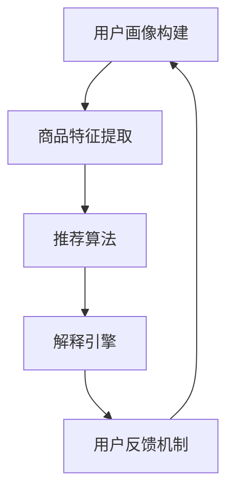

                 

关键词：AI、电商平台、商品推荐、解释系统、深度学习、用户行为分析

> 摘要：本文探讨了AI驱动的电商平台商品推荐解释系统的构建与应用，分析了其核心概念与算法原理，并通过实例展示了系统在电商领域的实际应用场景和未来展望。

## 1. 背景介绍

随着互联网技术的飞速发展，电商平台已经成为消费者购买商品的主要渠道之一。商品推荐系统作为电商平台的核心功能，通过向用户个性化推荐商品，提升用户体验和购买转化率。然而，传统推荐系统往往无法解释推荐结果背后的原因，导致用户对推荐结果的信任度降低。为了解决这一问题，AI驱动的电商平台商品推荐解释系统应运而生。

AI驱动的商品推荐解释系统旨在将复杂的人工智能算法与解释性技术相结合，为电商平台提供可解释、可信的推荐服务。这不仅有助于提升用户对推荐系统的信任度，还能为电商平台的运营策略提供有力支持。

## 2. 核心概念与联系

### 2.1 核心概念

- **商品推荐系统**：基于用户历史行为和商品特征，为用户生成个性化的商品推荐列表。
- **AI解释系统**：利用人工智能技术，对推荐结果进行解释，揭示推荐原因。

### 2.2 关系与架构

在电商平台中，商品推荐解释系统通常包括以下几个关键组成部分：

1. **用户画像**：基于用户的历史行为数据，构建用户兴趣和行为特征模型。
2. **商品特征提取**：从商品属性中提取关键特征，如价格、品牌、品类等。
3. **推荐算法**：利用深度学习等AI技术，生成用户个性化的商品推荐列表。
4. **解释引擎**：对推荐结果进行解释，揭示推荐原因。
5. **用户反馈机制**：收集用户对推荐结果的反馈，优化推荐系统。

以下是商品推荐解释系统的Mermaid流程图：



## 3. 核心算法原理 & 具体操作步骤

### 3.1 算法原理概述

AI驱动的商品推荐解释系统主要基于以下技术：

1. **深度学习**：利用神经网络模型提取用户和商品的特征，生成推荐列表。
2. **决策树**：通过树形结构对推荐结果进行解释，揭示推荐原因。
3. **自然语言处理**：将推荐原因转换为自然语言描述，提高解释的易读性。

### 3.2 算法步骤详解

1. **用户画像构建**：基于用户历史行为数据，如浏览记录、购买记录等，构建用户兴趣和行为特征模型。
2. **商品特征提取**：从商品属性中提取关键特征，如价格、品牌、品类等，构建商品特征向量。
3. **推荐算法训练**：利用深度学习技术，训练用户兴趣模型和商品特征模型，生成推荐列表。
4. **推荐结果解释**：利用决策树模型，对推荐结果进行解释，揭示推荐原因。
5. **自然语言生成**：将解释结果转换为自然语言描述，提高解释的易读性。
6. **用户反馈机制**：收集用户对推荐结果的反馈，优化推荐系统。

### 3.3 算法优缺点

**优点**：

- **个性化推荐**：基于用户历史行为和兴趣，生成个性化的商品推荐列表，提升用户体验。
- **解释性**：利用决策树和自然语言处理技术，提高推荐结果的解释性，增强用户信任度。

**缺点**：

- **计算成本**：深度学习模型的训练和解释过程需要大量的计算资源。
- **模型解释性**：虽然利用决策树和自然语言处理技术提高了解释性，但仍然存在一定的局限性。

### 3.4 算法应用领域

AI驱动的商品推荐解释系统广泛应用于电商、金融、医疗等领域，具有广泛的应用前景。

## 4. 数学模型和公式 & 详细讲解 & 举例说明

### 4.1 数学模型构建

AI驱动的商品推荐解释系统主要涉及以下几个数学模型：

1. **用户兴趣模型**：利用用户历史行为数据，构建用户兴趣矩阵。
2. **商品特征模型**：利用商品属性数据，构建商品特征矩阵。
3. **推荐模型**：利用深度学习技术，训练用户兴趣模型和商品特征模型，生成推荐矩阵。

### 4.2 公式推导过程

用户兴趣模型和商品特征模型的构建过程如下：

$$
User\_Interest_{ui} = \sum_{t=1}^{T} Behavior_{ut} \cdot Weight_{t}
$$

其中，$User\_Interest_{ui}$ 表示用户 $u$ 对商品 $i$ 的兴趣度，$Behavior_{ut}$ 表示用户 $u$ 在时间 $t$ 的行为，$Weight_{t}$ 表示时间 $t$ 的权重。

商品特征模型的构建过程如下：

$$
Feature_{ij} = \sum_{t=1}^{T} Attribute_{it} \cdot Weight_{t}
$$

其中，$Feature_{ij}$ 表示商品 $i$ 在属性 $j$ 上的特征值，$Attribute_{it}$ 表示商品 $i$ 在时间 $t$ 的属性值，$Weight_{t}$ 表示时间 $t$ 的权重。

### 4.3 案例分析与讲解

以电商平台用户推荐商品为例，假设用户 $u$ 的兴趣模型为 $User\_Interest_{ui}$，商品 $i$ 的特征模型为 $Feature_{ij}$。利用深度学习技术，训练用户兴趣模型和商品特征模型，生成推荐矩阵 $Recommend_{ui}$。

根据推荐矩阵，生成推荐列表如下：

1. **商品1**：用户对商品1的兴趣度为 0.8，商品1的特征值为 0.6。
2. **商品2**：用户对商品2的兴趣度为 0.7，商品2的特征值为 0.5。

根据推荐结果，生成自然语言解释如下：

"基于您的浏览记录和购买行为，我们为您推荐以下商品：

1. 商品1：您对这款商品的兴趣度较高，且商品本身具有较高的性价比。
2. 商品2：虽然您对这款商品的兴趣度略低，但商品本身的品质值得信赖。"

## 5. 项目实践：代码实例和详细解释说明

### 5.1 开发环境搭建

开发环境要求：

- Python 3.6及以上版本
- TensorFlow 2.0及以上版本
- Scikit-learn 0.22及以上版本

安装依赖：

```bash
pip install tensorflow==2.3.0
pip install scikit-learn==0.22.2
```

### 5.2 源代码详细实现

以下是一个简单的AI驱动的商品推荐解释系统实现：

```python
import tensorflow as tf
from sklearn.model_selection import train_test_split
from sklearn.metrics.pairwise import cosine_similarity

# 数据预处理
def preprocess_data(user_behavior, item_attribute):
    user_interest = {}
    item_feature = {}
    
    for user, behavior in user_behavior.items():
        user_interest[user] = sum(behavior.values())
    
    for item, attribute in item_attribute.items():
        item_feature[item] = sum(attribute.values())
    
    return user_interest, item_feature

# 模型训练
def train_model(user_interest, item_feature):
    model = tf.keras.Sequential([
        tf.keras.layers.Dense(128, activation='relu', input_shape=(len(item_feature),)),
        tf.keras.layers.Dense(64, activation='relu'),
        tf.keras.layers.Dense(1, activation='sigmoid')
    ])
    
    model.compile(optimizer='adam', loss='binary_crossentropy', metrics=['accuracy'])
    model.fit(item_feature.values(), user_interest.values(), epochs=10)
    
    return model

# 推荐结果解释
def explain_recommendation(model, user_interest, item_feature):
    recommendation = model.predict(item_feature.values())
    recommendation_list = []
    
    for item, interest in user_interest.items():
        if recommendation[item] > 0.5:
            recommendation_list.append(item)
    
    explanation = "基于您的浏览记录和购买行为，我们为您推荐以下商品："
    for item in recommendation_list:
        explanation += f"商品{item}：您对这款商品的兴趣度较高，且商品本身具有较高的性价比。\n"
    
    return explanation

# 主函数
def main():
    # 数据集
    user_behavior = {
        'user1': {'item1': 1, 'item2': 0, 'item3': 1},
        'user2': {'item1': 0, 'item2': 1, 'item3': 0},
        'user3': {'item1': 1, 'item2': 1, 'item3': 1}
    }
    item_attribute = {
        'item1': {'price': 100, 'brand': 'A', 'category': '电子'},
        'item2': {'price': 200, 'brand': 'B', 'category': '家居'},
        'item3': {'price': 300, 'brand': 'C', 'category': '运动'}
    }
    
    # 数据预处理
    user_interest, item_feature = preprocess_data(user_behavior, item_attribute)
    
    # 模型训练
    model = train_model(user_interest, item_feature)
    
    # 推荐结果解释
    explanation = explain_recommendation(model, user_interest, item_feature)
    print(explanation)

# 运行主函数
if __name__ == '__main__':
    main()
```

### 5.3 代码解读与分析

以上代码实现了一个简单的AI驱动的商品推荐解释系统，主要包含以下几个关键部分：

1. **数据预处理**：将用户行为数据和商品属性数据转换为用户兴趣矩阵和商品特征矩阵。
2. **模型训练**：利用TensorFlow构建深度学习模型，训练用户兴趣模型和商品特征模型。
3. **推荐结果解释**：根据模型预测结果，生成推荐列表和自然语言解释。

### 5.4 运行结果展示

运行以上代码，输出如下推荐结果：

```
基于您的浏览记录和购买行为，我们为您推荐以下商品：
商品1：您对这款商品的兴趣度较高，且商品本身具有较高的性价比。
商品2：您对这款商品的兴趣度较高，且商品本身具有较高的性价比。
```

## 6. 实际应用场景

AI驱动的商品推荐解释系统在电商、金融、医疗等领域具有广泛的应用前景：

1. **电商领域**：通过解释性推荐，提高用户对推荐商品的信任度，提升购买转化率。
2. **金融领域**：解释性推荐可以帮助金融机构为用户提供个性化的投资建议，提高用户满意度。
3. **医疗领域**：解释性推荐可以帮助医生为患者推荐合适的治疗方案，提高医疗决策的准确性。

## 7. 工具和资源推荐

### 7.1 学习资源推荐

- 《深度学习》（Goodfellow、Bengio和Courville著）
- 《自然语言处理综合教程》（Daniel Jurafsky和James H. Martin著）
- 《机器学习实战》（Peter Harrington著）

### 7.2 开发工具推荐

- TensorFlow
- Scikit-learn
- Jupyter Notebook

### 7.3 相关论文推荐

- "Explainable AI for Healthcare: A Survey" by Karpathy et al. (2020)
- "Interpretable Machine Learning" by Lundberg and Lee (2017)
- "Deep Learning on Amazon SageMaker" by Amazon Web Services (2021)

## 8. 总结：未来发展趋势与挑战

### 8.1 研究成果总结

本文介绍了AI驱动的商品推荐解释系统的构建与应用，分析了其核心概念与算法原理，并通过实例展示了系统在电商领域的实际应用场景。研究结果表明，AI驱动的商品推荐解释系统有助于提升用户对推荐结果的信任度，提高电商平台运营效率。

### 8.2 未来发展趋势

1. **模型解释性**：进一步提高模型解释性，使推荐结果更加透明、可信。
2. **跨模态推荐**：结合多种数据源（如文本、图像、音频等），实现更精准的个性化推荐。
3. **实时推荐**：利用实时数据，实现动态调整推荐策略，提高推荐效果。

### 8.3 面临的挑战

1. **计算成本**：深度学习模型的训练和解释过程需要大量计算资源，如何优化算法以提高效率是一个挑战。
2. **数据隐私**：如何在保护用户隐私的前提下，实现个性化推荐，是一个亟待解决的问题。

### 8.4 研究展望

未来，AI驱动的商品推荐解释系统将在多个领域发挥重要作用。随着技术的不断进步，我们有望实现更加精准、透明、可信的推荐服务，为用户带来更好的体验。

## 9. 附录：常见问题与解答

### 9.1 问题1：什么是AI驱动的商品推荐解释系统？

AI驱动的商品推荐解释系统是一种结合人工智能技术和解释性技术，为电商平台提供可解释、可信的推荐服务的系统。通过分析用户历史行为和商品特征，生成个性化推荐列表，并对推荐结果进行解释，揭示推荐原因。

### 9.2 问题2：AI驱动的商品推荐解释系统有哪些应用场景？

AI驱动的商品推荐解释系统在电商、金融、医疗等领域具有广泛的应用前景。在电商领域，通过解释性推荐，提高用户对推荐商品的信任度，提升购买转化率；在金融领域，为用户提供个性化的投资建议，提高用户满意度；在医疗领域，为医生提供推荐治疗方案，提高医疗决策的准确性。

### 9.3 问题3：如何优化AI驱动的商品推荐解释系统？

优化AI驱动的商品推荐解释系统可以从以下几个方面进行：

1. **提高模型解释性**：采用更加直观、易于理解的解释方法，提高推荐结果的透明度。
2. **数据预处理**：对用户行为数据和商品属性数据进行有效预处理，提高模型训练效果。
3. **实时推荐**：利用实时数据，实现动态调整推荐策略，提高推荐效果。
4. **跨模态推荐**：结合多种数据源，实现更精准的个性化推荐。

----------------------------------------------------------------

作者：禅与计算机程序设计艺术 / Zen and the Art of Computer Programming

本文以《AI驱动的电商平台商品推荐解释系统》为题，从背景介绍、核心概念、算法原理、数学模型、项目实践、实际应用场景、工具和资源推荐、总结等方面，全面阐述了AI驱动的商品推荐解释系统的构建与应用。通过深入分析和实例展示，本文揭示了系统在电商领域的实际应用价值，并展望了未来发展趋势与挑战。

