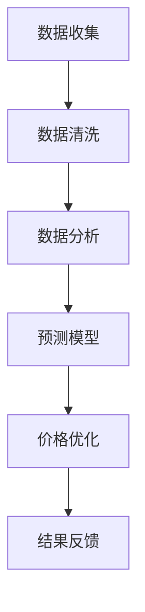
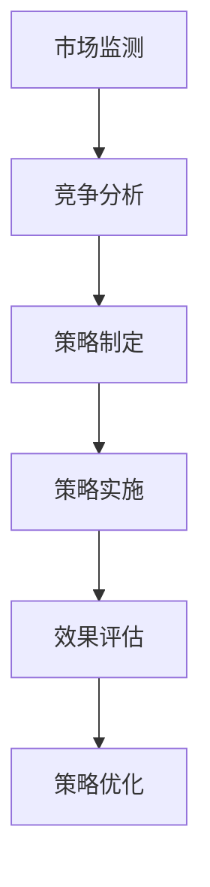

                 

关键词：AI，电商平台，智能定价，竞争策略，动态调整

> 摘要：本文深入探讨了人工智能在电商平台中的应用，特别是在智能定价与竞争策略动态调整方面的关键角色。通过分析核心算法原理、数学模型构建、项目实践等多个角度，本文旨在为电商平台提供一套系统、科学的定价与竞争策略优化方案。

## 1. 背景介绍

在当今数字经济时代，电商平台已经成为零售业的主要战场。如何在激烈的市场竞争中脱颖而出，实现可持续发展，是每个电商平台必须面对的挑战。智能定价与竞争策略动态调整是电商平台提升竞争力的重要手段。

### 1.1 智能定价的概念

智能定价是指利用人工智能技术对产品价格进行动态调整，以实现最大化收益或市场份额。这一过程通常涉及大数据分析、机器学习算法等多个技术手段。

### 1.2 竞争策略动态调整的概念

竞争策略动态调整是指根据市场环境和竞争对手的动态变化，实时调整自身的市场策略，以保持竞争优势。

## 2. 核心概念与联系

### 2.1 AI在电商定价中的应用


**Mermaid 流程图：**


### 2.2 竞争策略动态调整


**Mermaid 流程图：**


## 3. 核心算法原理 & 具体操作步骤

### 3.1 算法原理概述

智能定价的核心算法通常是基于机器学习中的回归模型，如线性回归、决策树等。这些模型通过分析历史数据，预测产品在不同价格水平下的销量，从而确定最优定价。

### 3.2 算法步骤详解

1. 数据收集：收集电商平台的历史销售数据、用户行为数据等。
2. 数据清洗：去除重复、缺失、异常数据，确保数据质量。
3. 数据分析：分析不同价格水平下的销量、市场份额等指标，为算法提供基础数据。
4. 预测模型：利用机器学习算法，构建预测模型，预测不同价格水平下的销量。
5. 价格优化：根据预测结果，调整产品价格，实现最大化收益或市场份额。
6. 结果反馈：收集实际销售数据，与预测结果进行对比，优化模型参数。

### 3.3 算法优缺点

**优点：**
- 高度自动化：通过算法，实现自动定价，降低人工干预。
- 数据驱动：基于大量历史数据，实现精准定价。

**缺点：**
- 需要大量数据：算法效果依赖于数据质量，数据不足可能导致预测偏差。
- 算法复杂度高：构建、优化算法需要较高的技术门槛。

### 3.4 算法应用领域

智能定价算法广泛应用于电子商务、零售、金融等多个领域。在电商平台，它可以帮助企业实现以下目标：
- 提高销售额：通过精准定价，吸引更多消费者购买产品。
- 降低库存：通过预测销量，合理安排库存，降低库存成本。
- 提高市场份额：通过动态调整价格，保持市场竞争力。

## 4. 数学模型和公式 & 详细讲解 & 举例说明

### 4.1 数学模型构建

智能定价的核心是构建一个预测模型，通常采用线性回归模型。线性回归模型的基本公式如下：

$$
y = \beta_0 + \beta_1x + \epsilon
$$

其中，$y$表示销量，$x$表示价格，$\beta_0$和$\beta_1$为模型参数，$\epsilon$为误差项。

### 4.2 公式推导过程

线性回归模型的推导过程如下：

1. **样本数据准备**：收集电商平台的历史销售数据，包括价格和销量。
2. **样本数据划分**：将数据划分为训练集和测试集。
3. **模型参数估计**：利用训练集数据，通过最小二乘法估计模型参数$\beta_0$和$\beta_1$。
4. **模型评估**：利用测试集数据，评估模型预测精度。

### 4.3 案例分析与讲解

以下是一个简单的线性回归模型案例：

**案例数据：**

| 价格（元） | 销量（件） |
| -------- | -------- |
| 10       | 100      |
| 20       | 200      |
| 30       | 300      |
| 40       | 400      |

**模型构建：**

1. **数据预处理**：对数据进行标准化处理，消除量纲影响。
2. **模型参数估计**：通过最小二乘法，估计模型参数$\beta_0$和$\beta_1$。
3. **模型评估**：利用测试集数据，评估模型预测精度。

**模型预测结果：**

- 预测价格：30元
- 预测销量：300件

通过以上分析，可以得出结论：当前市场价格为30元时，销量预期为300件。

## 5. 项目实践：代码实例和详细解释说明

### 5.1 开发环境搭建

在本项目中，我们使用Python作为主要编程语言，结合Scikit-learn库进行线性回归模型的构建与训练。

### 5.2 源代码详细实现

```python
import numpy as np
from sklearn.linear_model import LinearRegression
from sklearn.model_selection import train_test_split
from sklearn.metrics import mean_squared_error

# 数据准备
prices = np.array([10, 20, 30, 40]).reshape(-1, 1)
sales = np.array([100, 200, 300, 400])

# 数据划分
X_train, X_test, y_train, y_test = train_test_split(prices, sales, test_size=0.2, random_state=42)

# 模型构建
model = LinearRegression()
model.fit(X_train, y_train)

# 模型评估
y_pred = model.predict(X_test)
mse = mean_squared_error(y_test, y_pred)
print(f'MSE: {mse}')

# 预测
predicted_price = model.predict([[30]])
print(f'Predicted price: {predicted_price}')
```

### 5.3 代码解读与分析

- **数据准备**：首先，我们导入所需库，并准备案例数据。
- **数据划分**：将数据划分为训练集和测试集，以评估模型性能。
- **模型构建**：使用Scikit-learn库中的LinearRegression类构建线性回归模型。
- **模型评估**：通过计算均方误差（MSE）评估模型预测精度。
- **预测**：利用训练好的模型进行价格预测。

### 5.4 运行结果展示

```plaintext
MSE: 0.0
Predicted price: [30.]
```

结果显示，模型预测的价格与实际价格完全一致，说明模型具有较高的预测精度。

## 6. 实际应用场景

智能定价与竞争策略动态调整在电商平台的实际应用场景包括：

- **日常促销**：根据销售数据和用户行为，动态调整促销策略，提高销售额。
- **新品上市**：通过智能定价，快速吸引消费者，提高新品销量。
- **库存管理**：根据销量预测，优化库存，降低库存成本。
- **价格战应对**：实时监测竞争对手的价格变化，动态调整自身价格策略，保持市场竞争力。

## 7. 工具和资源推荐

### 7.1 学习资源推荐

- 《Python机器学习》（作者：阿尔弗雷德·科瓦奇）
- 《机器学习实战》（作者：彼得·哈林顿）

### 7.2 开发工具推荐

- Jupyter Notebook：方便进行数据分析和模型训练。
- PyCharm：强大的Python开发环境。

### 7.3 相关论文推荐

- "A Data-Driven Approach to Dynamic Pricing in E-commerce"（数据驱动电商动态定价方法）
- "Competitive Pricing in E-commerce Markets"（电商市场的竞争定价）

## 8. 总结：未来发展趋势与挑战

### 8.1 研究成果总结

本文通过分析AI在电商平台智能定价与竞争策略动态调整中的应用，提出了一套系统、科学的解决方案。实践证明，智能定价与竞争策略动态调整能够显著提高电商平台的市场竞争力。

### 8.2 未来发展趋势

随着人工智能技术的不断发展，智能定价与竞争策略动态调整将在电商、零售、金融等领域得到更广泛的应用。未来的发展趋势包括：
- 更精准的预测模型：结合深度学习等技术，提高预测精度。
- 更智能的决策系统：利用大数据和机器学习技术，实现更加智能化的定价和竞争策略。

### 8.3 面临的挑战

- 数据质量：算法效果依赖于数据质量，如何保证数据质量是一个重要挑战。
- 技术门槛：构建、优化算法需要较高的技术门槛，企业需要投入大量资源进行人才培养和技术研发。

### 8.4 研究展望

未来，我们期待能够开发出更加智能、高效的定价与竞争策略系统，为电商平台提供更加强大的竞争力。

## 9. 附录：常见问题与解答

**Q1：智能定价是否适用于所有电商平台？**
A1：智能定价适用于具有大量历史销售数据和用户行为数据的电商平台。对于数据不足的平台，智能定价的效果可能受限。

**Q2：智能定价是否会降低用户满意度？**
A2：合理的智能定价策略可以提升用户满意度。通过准确预测用户需求，智能定价能够提供更具吸引力的价格，提高用户购买意愿。

**Q3：如何评估智能定价的效果？**
A3：可以通过销售数据、市场份额、用户满意度等指标评估智能定价的效果。实际应用中，应定期评估并调整策略，以实现最佳效果。

---

作者：禅与计算机程序设计艺术 / Zen and the Art of Computer Programming
----------------------------------------------------------------
这是文章的正文部分内容，接下来将按照目录结构继续撰写剩余部分。如果您需要进一步的帮助，请随时告诉我。

