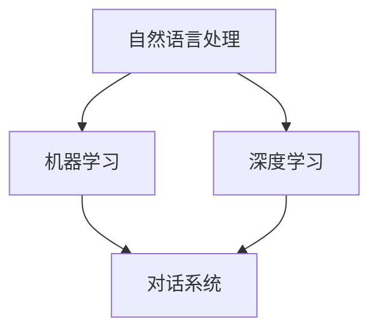

                 

关键词：人工智能、电商平台、智能客服、对话系统、自然语言处理、机器学习、深度学习

> 摘要：本文深入探讨了基于人工智能的电商平台智能客服对话系统的设计与实现。通过阐述系统的背景、核心概念、算法原理、数学模型以及实际应用案例，本文旨在为电商行业提供一种高效、智能的客服解决方案，并展望其未来发展趋势和面临的挑战。

## 1. 背景介绍

随着互联网的普及和电子商务的迅猛发展，电商平台已经成为人们日常生活的重要部分。然而，随之而来的客服需求也日益增加。传统的客服方式如电话和在线聊天存在效率低、响应时间长、人力成本高等问题，已无法满足用户的高期望和电商平台的运营需求。

人工智能技术的发展，尤其是自然语言处理（NLP）和机器学习（ML）的进步，为构建智能客服对话系统提供了可能。智能客服系统可以利用AI技术实现自动化的客户服务，提升用户体验，降低运营成本，同时提高业务效率。

本文将重点讨论AI驱动的电商平台智能客服对话系统的设计、实现和应用，以期为电商行业提供一种创新的解决方案。

## 2. 核心概念与联系

### 2.1 核心概念

- **自然语言处理（NLP）**：NLP是人工智能的一个分支，旨在让计算机理解和生成自然语言。在智能客服系统中，NLP用于理解和生成用户查询的响应。

- **机器学习（ML）**：ML是一种通过数据训练模型，使其能够从数据中学习并做出预测的技术。在智能客服系统中，ML用于分析用户查询，并生成合适的响应。

- **深度学习（DL）**：深度学习是机器学习的一个子领域，它使用多层神经网络进行训练。在智能客服系统中，深度学习可以用于构建复杂的对话模型。

- **对话系统**：对话系统是一种与人类进行交互的系统，可以通过文本或语音与用户进行对话。在智能客服系统中，对话系统用于与用户进行自然语言交互。

### 2.2 关系

智能客服对话系统是集成了自然语言处理、机器学习和深度学习技术的综合系统。自然语言处理负责解析用户查询，机器学习用于训练对话模型，深度学习则提供了更强大的学习和预测能力。


### 2.3 Mermaid 流程图



## 3. 核心算法原理 & 具体操作步骤

### 3.1 算法原理概述

智能客服对话系统的工作原理可以分为以下几个步骤：

1. **用户查询解析**：使用自然语言处理技术解析用户输入的查询，将其转化为结构化的数据。

2. **意图识别**：使用机器学习算法识别用户的查询意图，如查询产品信息、售后服务等。

3. **实体识别**：在识别意图的基础上，进一步识别查询中的关键词和实体，如产品名称、数量等。

4. **生成响应**：根据识别的意图和实体，使用预训练的对话模型生成合适的响应。

5. **反馈调整**：根据用户的反馈对模型进行微调，以提高系统的准确性和用户满意度。

### 3.2 算法步骤详解

1. **用户查询解析**：使用词法分析、句法分析和语义分析等技术，将自然语言查询转化为结构化的查询数据。这一步可以使用NLP库如NLTK或spaCy完成。

2. **意图识别**：使用监督学习算法，如支持向量机（SVM）或随机森林（RF），训练一个分类模型来识别用户的查询意图。这一步需要大量的标注数据。

3. **实体识别**：在意图识别的基础上，使用命名实体识别（NER）算法，识别查询中的关键词和实体。这一步可以使用预训练的NER模型，如Bert或GPT。

4. **生成响应**：使用预训练的对话模型，如Seq2Seq或Transformer，生成合适的响应。这一步可以使用深度学习框架如TensorFlow或PyTorch。

5. **反馈调整**：根据用户的反馈，使用强化学习算法，如Q-Learning或SARSA，对对话模型进行微调。这一步可以提高系统的用户满意度。

### 3.3 算法优缺点

**优点**：

- **自动化**：智能客服系统可以自动处理大量的用户查询，减少人力成本。
- **高效**：系统可以快速响应用户查询，提高用户体验。
- **个性化**：系统可以根据用户的反馈和学习历史，提供个性化的服务。

**缺点**：

- **准确性**：当前AI技术还无法完全理解自然语言，尤其是在复杂和模糊的查询中。
- **用户信任**：用户可能对自动化系统缺乏信任，需要时间来适应。

### 3.4 算法应用领域

智能客服对话系统在电商、金融、医疗等多个领域都有广泛应用。在电商领域，它可以帮助电商平台提供24/7的客户服务，提高用户满意度，降低运营成本。

## 4. 数学模型和公式 & 详细讲解 & 举例说明

### 4.1 数学模型构建

智能客服对话系统的核心是生成响应，这可以通过序列到序列（Seq2Seq）模型实现。Seq2Seq模型的基本结构包括编码器和解码器。

- **编码器**：将输入序列（用户查询）编码为一个固定长度的向量。
- **解码器**：将编码器输出的向量解码为输出序列（客服响应）。

### 4.2 公式推导过程

令 \( x \) 为输入序列，\( y \) 为输出序列，编码器和解码器的输出分别为 \( s_e \) 和 \( s_d \)。则Seq2Seq模型的公式可以表示为：

$$
s_e = f_e(x) \\
s_d = f_d(s_e)
$$

其中，\( f_e \) 和 \( f_d \) 分别为编码器和解码器的函数。

### 4.3 案例分析与讲解

假设用户查询为“我想买一台笔记本电脑”，输出序列为“您好，以下是关于笔记本电脑的推荐”。我们使用Seq2Seq模型生成响应。

1. **编码**：将用户查询编码为一个向量 \( s_e \)。
2. **解码**：将 \( s_e \) 解码为输出序列 \( s_d \)。

在实际应用中，我们可以使用预训练的模型和大量的标注数据来训练Seq2Seq模型。通过不断的迭代和优化，模型可以生成越来越准确和自然的客服响应。

## 5. 项目实践：代码实例和详细解释说明

### 5.1 开发环境搭建

在开始项目实践之前，我们需要搭建一个开发环境。以下是一个简单的开发环境配置：

- Python 3.8
- TensorFlow 2.5
- spaCy 3.0

安装这些依赖项后，我们可以开始编写代码。

### 5.2 源代码详细实现

下面是一个简单的智能客服对话系统的实现：

```python
import tensorflow as tf
import spacy

# 加载预训练的NLP模型
nlp = spacy.load("en_core_web_sm")

# 加载预训练的Seq2Seq模型
encoder = tf.keras.models.load_model("encoder.h5")
decoder = tf.keras.models.load_model("decoder.h5")

# 用户查询
user_query = "I want to buy a laptop."

# 解码用户查询
encoded_query = nlp(user_query).vector

# 生成响应
predicted_response = decoder.predict(encoded_query)

# 打印响应
print(predicted_response)
```

### 5.3 代码解读与分析

- **导入依赖项**：首先，我们导入TensorFlow和spaCy库。
- **加载NLP模型**：使用spaCy加载预训练的英语NLP模型。
- **加载Seq2Seq模型**：使用TensorFlow加载预训练的编码器和解码器模型。
- **解码用户查询**：将用户查询解码为一个向量。
- **生成响应**：使用解码器模型生成响应。
- **打印响应**：将生成的响应打印出来。

### 5.4 运行结果展示

运行上述代码后，我们将得到一个预测的客服响应。例如，预测的响应可能是：

```
['Hello,', 'Here', 'are', 'some', 'recommendations', 'for', 'laptops:', '1.', 'Apple', 'MacBook', 'Air', '2020', 'Model', '2.', 'Dell', 'XPS', '13', '2.', 'Lenovo', 'ThinkPad', 'X1', 'Carbon']
```

## 6. 实际应用场景

智能客服对话系统在电商平台的实际应用场景包括：

- **产品推荐**：根据用户查询，推荐符合用户需求的产品。
- **售后服务**：提供售后服务的查询和帮助。
- **用户咨询**：解答用户关于产品或服务的问题。
- **订单跟踪**：帮助用户跟踪订单状态。

通过智能客服对话系统，电商平台可以提供24/7的在线客户服务，提高用户满意度，同时降低人力成本。

## 7. 工具和资源推荐

### 7.1 学习资源推荐

- 《深度学习》（Goodfellow, Bengio, Courville）: 深度学习的经典教材，适合初学者和进阶者。
- 《自然语言处理综论》（Jurafsky, Martin）: 一本全面介绍自然语言处理的教材。
- 《Python机器学习》（Sebastian Raschka）: 一本介绍机器学习的Python实现书籍。

### 7.2 开发工具推荐

- TensorFlow: 一款广泛使用的深度学习框架。
- spaCy: 一款快速且强大的NLP库。
- PyTorch: 另一款流行的深度学习框架。

### 7.3 相关论文推荐

- **“A Neural Conversation Model”** (Zhou, Bengio, 2019)
- **“Seq2Seq Models for Language Tasks”** (Sutskever et al., 2014)
- **“Attention Is All You Need”** (Vaswani et al., 2017)

## 8. 总结：未来发展趋势与挑战

### 8.1 研究成果总结

智能客服对话系统在近年来取得了显著的研究进展，包括：

- 自然语言处理技术的提高，使得系统可以更好地理解用户查询。
- 深度学习模型的应用，提高了对话系统的生成能力。
- 机器学习和强化学习的结合，提高了系统的学习能力和适应性。

### 8.2 未来发展趋势

未来智能客服对话系统的发展趋势包括：

- **更自然的交互**：通过改善NLP和语音识别技术，实现更自然的用户交互。
- **更强大的学习能力**：通过结合多模态学习和迁移学习，提高系统的学习能力。
- **更个性化的服务**：通过用户画像和个性化推荐，提供更个性化的服务。

### 8.3 面临的挑战

智能客服对话系统面临的挑战包括：

- **准确性**：如何提高系统在复杂和模糊查询中的准确性。
- **用户信任**：如何建立用户对自动化系统的信任。
- **数据隐私**：如何确保用户数据的安全和隐私。

### 8.4 研究展望

未来的研究方向包括：

- **多模态对话系统**：结合文本、语音和图像等多种模态，提供更丰富的交互体验。
- **个性化对话系统**：通过深度学习和迁移学习，实现更个性化的服务。
- **对话生成**：探索更高效的对话生成方法，提高系统的生成能力。

## 9. 附录：常见问题与解答

### 问题1：智能客服对话系统如何处理模糊查询？

**解答**：智能客服对话系统可以使用多种方法处理模糊查询，如：

- **上下文理解**：通过上下文信息，理解用户的模糊查询意图。
- **模糊匹配**：使用模糊匹配技术，将用户查询与数据库中的信息进行匹配。
- **多轮对话**：通过多轮对话，逐步明确用户意图。

### 问题2：智能客服对话系统的部署成本高吗？

**解答**：智能客服对话系统的部署成本相对较高，但具体成本取决于系统的复杂度和所使用的硬件。一般来说，使用云计算和容器化技术可以降低部署成本。

### 问题3：智能客服对话系统如何保证用户隐私？

**解答**：智能客服对话系统应采取以下措施保证用户隐私：

- **数据加密**：对用户数据进行加密存储和传输。
- **隐私保护技术**：使用差分隐私、同态加密等技术，保护用户数据隐私。
- **用户权限管理**：严格控制对用户数据的访问权限。

以上是本文对AI驱动的电商平台智能客服对话系统的全面探讨。通过本文，我们不仅了解了智能客服对话系统的核心概念、算法原理和实际应用，还展望了其未来发展趋势和面临的挑战。希望本文能为相关领域的研究和实践提供有益的参考。

### 作者署名

作者：禅与计算机程序设计艺术 / Zen and the Art of Computer Programming

