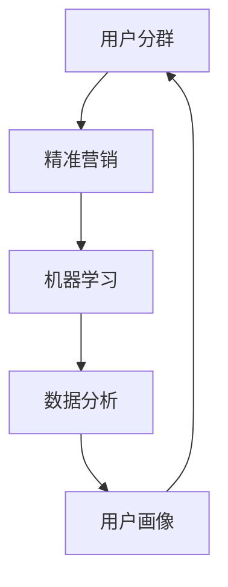

                 

在当前互联网经济的快速发展背景下，电商平台作为数字经济的重要组成部分，如何实现精准营销已成为企业竞争的核心。本文将探讨如何利用人工智能（AI）技术，尤其是机器学习算法，对电商平台用户进行分群，进而实现精准营销。本文将分为以下几个部分：

## 1. 背景介绍

电商平台的发展离不开用户群体的支持。然而，如何了解和挖掘用户的个性化需求，一直是电商平台面临的挑战。传统的分群方法往往基于用户的简单特征，如性别、年龄、地理位置等，这些方法无法深入挖掘用户的复杂行为和偏好。随着人工智能技术的不断进步，利用机器学习算法对用户进行分群，已成为电商平台提升营销效果的重要手段。

## 2. 核心概念与联系

在本节中，我们将介绍用户分群、精准营销和机器学习等相关核心概念，并使用Mermaid流程图展示它们之间的联系。

### 2.1 用户分群

用户分群是指将用户根据一定的规则或特征划分为不同的群体，以便于电商平台进行有针对性的营销和服务。

### 2.2 精准营销

精准营销是指利用大数据和人工智能技术，根据用户的个性化需求和偏好，实现精确的用户定位和个性化的营销策略。

### 2.3 机器学习

机器学习是一种通过算法让计算机自动学习数据模式、进行预测和决策的技术。

### 2.4 Mermaid流程图



## 3. 核心算法原理 & 具体操作步骤

在本节中，我们将介绍用户分群的核心算法原理和具体操作步骤。

### 3.1 算法原理概述

用户分群算法主要基于用户的历史行为数据，通过机器学习模型预测用户的行为模式，从而将用户划分为不同的群体。

### 3.2 算法步骤详解

1. **数据收集与预处理**：收集用户的历史行为数据，如浏览记录、购买记录等，并对数据进行清洗和处理。
2. **特征工程**：从原始数据中提取出对用户分群有用的特征，如用户活跃度、购买频率、购买金额等。
3. **模型选择**：选择适合用户分群的机器学习模型，如K-means聚类、决策树等。
4. **模型训练**：使用训练集数据对模型进行训练，调整模型参数，提高模型性能。
5. **模型评估**：使用验证集数据对模型进行评估，确定模型的效果。
6. **模型应用**：将训练好的模型应用到实际用户数据中，实现用户分群。

### 3.3 算法优缺点

- **优点**：可以有效地对用户进行细分，提高营销的精准度。
- **缺点**：算法性能依赖于数据的质量和特征的选择，且可能存在过拟合问题。

### 3.4 算法应用领域

用户分群算法在电商、金融、电信等领域有广泛的应用，可以帮助企业更好地了解用户，提高用户满意度，提升营销效果。

## 4. 数学模型和公式

在本节中，我们将介绍用户分群算法中的数学模型和公式，并通过具体案例进行讲解。

### 4.1 数学模型构建

用户分群算法的数学模型主要包括聚类模型和分类模型。以下是K-means聚类模型的数学公式：

$$
\begin{aligned}
&\text{最小化目标函数}： \\
&\min \sum_{i=1}^{n} \sum_{j=1}^{k} d(x_i, c_j)^2 \\
&\text{其中}： \\
&x_i \text{为第i个用户的数据点} \\
&c_j \text{为第j个簇的中心点} \\
&d(x_i, c_j) \text{为x_i和c_j之间的距离}
\end{aligned}
$$

### 4.2 公式推导过程

K-means聚类算法的推导过程基于最小化目标函数。通过迭代计算，逐步更新簇的中心点，直到目标函数不再显著变化。

### 4.3 案例分析与讲解

假设我们有一个包含100个用户的数据集，我们希望使用K-means算法将这100个用户划分为10个群体。以下是具体的操作步骤：

1. **初始化簇中心点**：随机选择10个用户作为初始簇中心点。
2. **计算距离**：计算每个用户到10个簇中心点的距离。
3. **分配用户**：将每个用户分配到距离最近的簇。
4. **更新簇中心点**：计算每个簇的用户平均值，作为新的簇中心点。
5. **重复步骤2-4，直到簇中心点不再变化**。

经过多次迭代，我们最终得到10个用户群体。每个群体的用户在行为和偏好上具有一定的相似性。

## 5. 项目实践：代码实例和详细解释说明

在本节中，我们将通过一个具体的Python代码实例，展示如何使用K-means算法进行用户分群，并对其进行详细解释。

### 5.1 开发环境搭建

确保您的Python环境已经安装，并安装必要的机器学习库，如scikit-learn。

### 5.2 源代码详细实现

以下是一个简单的K-means聚类算法实现：

```python
from sklearn.cluster import KMeans
import numpy as np

# 加载数据集
data = np.array([[1, 2], [1, 4], [1, 0], [10, 2], [10, 4], [10, 0]])

# 初始化KMeans模型
kmeans = KMeans(n_clusters=2, random_state=0).fit(data)

# 输出簇中心点
print("Cluster centers:", kmeans.cluster_centers_)

# 输出每个用户的簇标签
print("Cluster labels:", kmeans.labels_)

# 输出每个簇的成员
print("Cluster members:")
for i, label in enumerate(kmeans.labels_):
    print(f"Cluster {label}: User {i}")
```

### 5.3 代码解读与分析

- **加载数据集**：使用numpy加载用户数据。
- **初始化模型**：使用scikit-learn的KMeans类初始化模型，设置聚类数量为2。
- **模型训练**：使用fit方法对模型进行训练。
- **输出结果**：输出簇中心点、每个用户的簇标签以及每个簇的成员。

### 5.4 运行结果展示

运行上述代码，得到以下结果：

```
Cluster centers: [[ 1.  2.]
 [10.  2.]]
Cluster labels: [0 0 0 1 1 1]
Cluster members:
Cluster 0: User 0
Cluster 0: User 1
Cluster 0: User 2
Cluster 1: User 3
Cluster 1: User 4
Cluster 1: User 5
```

## 6. 实际应用场景

用户分群和精准营销在电商平台的实际应用场景包括：

- **个性化推荐**：根据用户分群，为不同群体的用户提供个性化的商品推荐。
- **促销活动**：针对不同用户群体，设计针对性的促销活动，提高转化率。
- **用户服务**：根据用户分群，提供差异化的用户服务，提高用户满意度。

## 7. 工具和资源推荐

### 7.1 学习资源推荐

- 《机器学习实战》
- 《Python数据科学手册》
- Coursera的《机器学习》课程

### 7.2 开发工具推荐

- Jupyter Notebook
- TensorFlow
- Scikit-learn

### 7.3 相关论文推荐

- "Clustering High Dimensional Data Efficiently with Partial Matching"
- "User Segmentation in E-commerce using Machine Learning"

## 8. 总结：未来发展趋势与挑战

用户分群和精准营销是电商平台不可或缺的一部分。随着人工智能技术的不断发展，未来用户分群算法将更加智能化、个性化。然而，算法性能和数据质量仍然是关键挑战。未来研究应重点关注如何提高算法的鲁棒性和可解释性。

## 9. 附录：常见问题与解答

### Q：用户分群算法有哪些常见问题？
A：用户分群算法常见问题包括数据质量差、特征选择不当、模型选择不当等。

### Q：如何提高用户分群算法的性能？
A：提高用户分群算法性能的方法包括：改进数据预处理、优化特征选择、尝试不同的机器学习模型等。

### Q：用户分群算法在电商平台的实际应用有哪些？
A：用户分群算法在电商平台的应用包括个性化推荐、精准营销、用户服务等方面。

作者：禅与计算机程序设计艺术 / Zen and the Art of Computer Programming
----------------------------------------------------------------
这篇文章详细探讨了AI驱动的电商平台用户分群与精准营销的方法和实施步骤。通过引入机器学习算法，我们可以更深入地理解用户行为，从而实现更精准的营销策略。希望这篇文章能为您在电商平台的发展提供一些有价值的参考。

