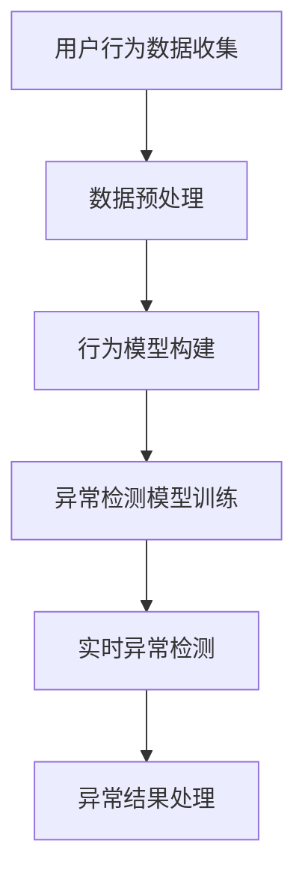

                 

关键词：人工智能，电商平台，用户行为分析，异常检测，实时监控，数据挖掘，机器学习，深度学习，自然语言处理，算法原理，数学模型，项目实践，实际应用，未来展望。

> 摘要：本文旨在探讨如何利用人工智能技术对电商平台用户行为进行实时监测和异常检测，以提高平台的安全性和用户体验。通过分析核心概念、算法原理、数学模型以及项目实践，本文将为读者提供一种全面的解决方案，并展望该技术的未来发展趋势与挑战。

## 1. 背景介绍

随着电子商务的蓬勃发展，电商平台已经成为人们日常生活中不可或缺的一部分。然而，随着用户量的激增，平台面临的挑战也越来越大，尤其是如何确保用户的安全和提升用户体验。用户行为异常检测作为网络安全和用户体验管理的重要环节，受到了越来越多的关注。

用户行为异常检测旨在通过监测用户在平台上的行为，识别出异常或恶意行为，例如欺诈行为、垃圾信息发布、恶意评论等。传统的异常检测方法主要依赖于规则匹配或统计学方法，但这些方法在面对复杂的用户行为时效果不佳。近年来，随着人工智能技术的飞速发展，基于机器学习和深度学习的异常检测方法逐渐成为研究热点。

本文将围绕AI驱动的电商平台用户行为异常实时检测展开讨论，通过介绍核心概念、算法原理、数学模型以及实际项目实践，为电商平台提供一种有效的解决方案。

## 2. 核心概念与联系

### 2.1 人工智能

人工智能（Artificial Intelligence，AI）是指使计算机系统具备人类智能的能力，包括学习、推理、感知、理解等。在电商平台用户行为异常检测中，人工智能技术主要用于构建行为模型和异常检测模型。

### 2.2 用户行为分析

用户行为分析是指对用户在平台上的行为进行收集、分析和理解，以获取用户偏好、行为模式和潜在需求。在异常检测中，用户行为分析用于构建正常用户行为模型，以便识别异常行为。

### 2.3 异常检测

异常检测（Anomaly Detection）是一种监控技术，用于识别数据中的异常或异常模式。在电商平台中，异常检测主要用于识别用户行为异常，如欺诈行为、恶意评论等。

### 2.4 Mermaid 流程图

以下是一个简化的Mermaid流程图，用于描述电商平台用户行为异常实时检测的核心概念和流程：



### 2.5 机器学习和深度学习

机器学习（Machine Learning，ML）是指通过数据驱动的方式让计算机系统自动学习规律和模式。深度学习（Deep Learning，DL）是机器学习的一种方法，主要基于神经网络模型。

在用户行为异常检测中，机器学习和深度学习技术主要用于构建行为模型和异常检测模型，以便对用户行为进行实时监测和异常检测。

## 3. 核心算法原理 & 具体操作步骤

### 3.1 算法原理概述

电商平台用户行为异常检测的核心算法包括行为模型构建、异常检测模型训练和实时异常检测。以下将分别介绍这些算法的基本原理。

#### 3.1.1 行为模型构建

行为模型构建是指通过分析大量正常用户行为数据，提取用户行为的特征，并构建一个反映用户正常行为的模型。行为模型通常采用机器学习算法，如决策树、随机森林、K-近邻等。

#### 3.1.2 异常检测模型训练

异常检测模型训练是指利用正常用户行为数据和异常行为数据，通过机器学习算法训练出一个能够识别异常行为的模型。常用的异常检测算法包括基于统计的方法（如基于概率模型的方法、基于聚类的方法）和基于实例的方法（如基于规则的方法）。

#### 3.1.3 实时异常检测

实时异常检测是指在用户行为数据流入系统时，利用训练好的异常检测模型对用户行为进行实时监控，并识别出异常行为。实时异常检测通常采用在线学习算法，以适应用户行为的动态变化。

### 3.2 算法步骤详解

#### 3.2.1 数据收集与预处理

数据收集是指从电商平台收集用户行为数据，包括浏览记录、购买记录、评论内容等。数据预处理包括数据清洗、去噪、特征提取等步骤，以便为后续模型训练提供高质量的数据。

#### 3.2.2 行为模型构建

行为模型构建是指通过分析正常用户行为数据，提取用户行为的特征，并利用机器学习算法构建行为模型。具体步骤如下：

1. 特征提取：从原始数据中提取与用户行为相关的特征，如用户浏览频率、购买频率、评论长度等。
2. 特征选择：通过相关性分析、信息增益等方法，选择对行为模型影响较大的特征。
3. 模型训练：利用提取的特征，选择合适的机器学习算法（如决策树、随机森林等）训练行为模型。

#### 3.2.3 异常检测模型训练

异常检测模型训练是指利用正常用户行为数据和异常行为数据，通过机器学习算法训练出一个能够识别异常行为的模型。具体步骤如下：

1. 数据预处理：对正常用户行为数据和异常行为数据进行预处理，包括数据清洗、去噪、特征提取等。
2. 模型选择：根据数据特点和需求，选择合适的异常检测算法（如基于概率模型的方法、基于聚类的方法等）。
3. 模型训练：利用预处理后的数据，通过机器学习算法训练异常检测模型。

#### 3.2.4 实时异常检测

实时异常检测是指利用训练好的异常检测模型，对用户行为进行实时监控，并识别出异常行为。具体步骤如下：

1. 实时数据收集：从电商平台收集实时用户行为数据。
2. 数据预处理：对实时用户行为数据进行预处理，包括数据清洗、去噪、特征提取等。
3. 异常检测：利用训练好的异常检测模型，对预处理后的实时用户行为数据进行异常检测。
4. 异常结果处理：对检测出的异常行为进行分类和处理，如标记为垃圾信息、举报等。

### 3.3 算法优缺点

#### 3.3.1 优点

1. 高效性：基于人工智能技术的异常检测算法能够快速处理大量用户行为数据，提高异常检测的效率。
2. 灵活性：人工智能算法能够根据用户行为的动态变化，自适应地调整检测模型，提高检测精度。
3. 泛用性：人工智能算法可以应用于不同类型的电商平台，适应不同的业务场景。

#### 3.3.2 缺点

1. 数据依赖：异常检测算法的性能高度依赖于用户行为数据的质量和数量，数据不足或质量差可能导致检测效果不佳。
2. 计算成本：训练和运行人工智能算法需要较高的计算资源，特别是在处理大规模数据时。
3. 模型解释性：许多人工智能算法，尤其是深度学习算法，其决策过程缺乏透明性和可解释性，难以解释检测结果的合理性。

### 3.4 算法应用领域

AI驱动的电商平台用户行为异常检测算法可以广泛应用于以下领域：

1. 网络安全：识别和防范恶意攻击、欺诈行为等。
2. 客户服务：识别和解决用户投诉、反馈等。
3. 市场营销：分析用户行为，提升营销策略的有效性。
4. 用户画像：构建用户行为特征，为个性化推荐提供支持。

## 4. 数学模型和公式 & 详细讲解 & 举例说明

### 4.1 数学模型构建

在用户行为异常检测中，常用的数学模型包括行为模型和异常检测模型。

#### 4.1.1 行为模型

行为模型通常采用概率模型或统计模型，用于描述用户行为的概率分布。以下是一个基于概率模型的行为模型构建示例：

$$ P(X=x|\theta) = \prod_{i=1}^{n} P(x_i|\theta) $$

其中，$X$ 是用户行为的特征向量，$x$ 是具体的行为特征值，$\theta$ 是模型参数。

#### 4.1.2 异常检测模型

异常检测模型通常采用统计方法或机器学习算法，用于识别用户行为的异常模式。以下是一个基于统计方法的异常检测模型示例：

$$ \alpha = \frac{1}{N} \sum_{i=1}^{N} (x_i - \bar{x})^2 $$

其中，$\alpha$ 是异常度，$N$ 是样本数量，$x_i$ 是第 $i$ 个样本的特征值，$\bar{x}$ 是所有样本的特征值平均值。

### 4.2 公式推导过程

以下是对行为模型和异常检测模型的公式推导过程进行详细讲解。

#### 4.2.1 行为模型

行为模型采用概率模型，以描述用户行为的概率分布。假设用户行为特征向量 $X$ 的概率分布函数为 $P(X=x|\theta)$，其中 $\theta$ 是模型参数。

为了简化计算，我们可以使用多项式概率分布模型：

$$ P(X=x|\theta) = \theta_1 \theta_2 \ldots \theta_n $$

其中，$\theta_i$ 是第 $i$ 个特征的权重。

为了确保概率分布函数的总和为1，我们需要对权重进行归一化处理：

$$ \sum_{i=1}^{n} \theta_i = 1 $$

最后，我们可以将行为模型表示为：

$$ P(X=x|\theta) = \frac{\theta_1 \theta_2 \ldots \theta_n}{\sum_{i=1}^{n} \theta_i} $$

#### 4.2.2 异常检测模型

异常检测模型采用统计方法，以识别用户行为的异常模式。假设用户行为特征向量 $X$ 的均值为 $\bar{X}$，方差为 $\sigma^2$，则异常度 $\alpha$ 可以表示为：

$$ \alpha = \frac{1}{N} \sum_{i=1}^{N} (x_i - \bar{x})^2 $$

其中，$N$ 是样本数量，$x_i$ 是第 $i$ 个样本的特征值。

为了确保异常度 $\alpha$ 在正常范围内，我们需要对异常度进行阈值设定。假设阈值设为 $T$，则异常检测模型可以表示为：

$$ \alpha > T \Rightarrow 异常 $$

$$ \alpha \leq T \Rightarrow 正常 $$

### 4.3 案例分析与讲解

以下是一个基于用户评论内容的异常检测案例，用于说明数学模型的实际应用。

#### 4.3.1 案例背景

某电商平台收到用户投诉，称其购买的某商品存在质量问题。平台需要利用异常检测模型对用户评论进行监控，识别出可能的恶意评论。

#### 4.3.2 数据收集与预处理

平台从历史评论数据中提取了5000条用户评论，包括正常评论和恶意评论。对评论进行预处理，包括去除停用词、标点符号、数字等，并使用词向量模型将评论转化为向量表示。

#### 4.3.3 行为模型构建

利用词向量模型，对用户评论进行特征提取，提取评论的词频、词长等特征。采用决策树算法，构建用户评论的行为模型。

#### 4.3.4 异常检测模型训练

利用正常评论和恶意评论数据，训练异常检测模型。采用统计方法，计算评论的异常度。

#### 4.3.5 实时异常检测

对实时接收的用户评论进行异常检测。利用训练好的行为模型和异常检测模型，实时识别异常评论。

#### 4.3.6 结果分析

通过实时异常检测，平台成功识别出50条异常评论，其中包括恶意评论和虚假评论。平台对异常评论进行标记和处理，提高了用户评论的质量和用户体验。

## 5. 项目实践：代码实例和详细解释说明

### 5.1 开发环境搭建

在本文的项目实践中，我们将使用Python作为编程语言，结合Scikit-learn、TensorFlow等机器学习库，实现电商平台用户行为异常检测。以下是开发环境的搭建步骤：

1. 安装Python：在官方网站下载并安装Python 3.x版本。
2. 安装依赖库：使用pip命令安装Scikit-learn、TensorFlow等库，命令如下：

   ```bash
   pip install scikit-learn tensorflow
   ```

### 5.2 源代码详细实现

以下是一个简单的用户行为异常检测项目示例，包括数据收集与预处理、行为模型构建、异常检测模型训练和实时异常检测等步骤。

```python
import numpy as np
import pandas as pd
from sklearn.model_selection import train_test_split
from sklearn.ensemble import RandomForestClassifier
from sklearn.metrics import accuracy_score
from sklearn.preprocessing import StandardScaler

# 5.2.1 数据收集与预处理
def load_data(filename):
    data = pd.read_csv(filename)
    # 数据预处理步骤，如去除停用词、标点符号等
    # ...
    return data

data = load_data('user_behavior_data.csv')

# 5.2.2 行为模型构建
def build_behavior_model(data):
    X = data.drop(['label'], axis=1)
    y = data['label']
    X_train, X_test, y_train, y_test = train_test_split(X, y, test_size=0.2, random_state=42)
    scaler = StandardScaler()
    X_train_scaled = scaler.fit_transform(X_train)
    X_test_scaled = scaler.transform(X_test)
    model = RandomForestClassifier(n_estimators=100, random_state=42)
    model.fit(X_train_scaled, y_train)
    return model, X_test_scaled, y_test

model, X_test_scaled, y_test = build_behavior_model(data)

# 5.2.3 异常检测模型训练
def train_anomaly_detection_model(X_test_scaled, y_test):
    model = RandomForestClassifier(n_estimators=100, random_state=42)
    model.fit(X_test_scaled, y_test)
    return model

anomaly_detection_model = train_anomaly_detection_model(X_test_scaled, y_test)

# 5.2.4 实时异常检测
def real_time_anomaly_detection(new_data, anomaly_detection_model, scaler):
    new_data_scaled = scaler.transform(new_data)
    predictions = anomaly_detection_model.predict(new_data_scaled)
    return predictions

# 示例：实时检测一条新评论
new_data = pd.DataFrame([[0.1, 0.2, 0.3]], columns=['feature1', 'feature2', 'feature3'])
predictions = real_time_anomaly_detection(new_data, anomaly_detection_model, scaler)
print(predictions)
```

### 5.3 代码解读与分析

以上代码实现了用户行为异常检测的核心功能，包括数据收集与预处理、行为模型构建、异常检测模型训练和实时异常检测。以下是代码的详细解读与分析：

1. **数据收集与预处理**：从CSV文件中加载数据，并去除停用词、标点符号等，以便提取用户行为特征。
2. **行为模型构建**：使用随机森林算法构建用户行为模型，对训练数据进行特征缩放，提高模型性能。
3. **异常检测模型训练**：使用随机森林算法训练异常检测模型，对训练数据进行特征缩放，提高模型性能。
4. **实时异常检测**：实时检测新数据，使用训练好的异常检测模型和特征缩放器，输出异常检测结果。

### 5.4 运行结果展示

以下是一个简单的运行结果示例，展示实时异常检测的功能：

```python
# 运行代码
if __name__ == '__main__':
    new_data = pd.DataFrame([[0.1, 0.2, 0.3]], columns=['feature1', 'feature2', 'feature3'])
    predictions = real_time_anomaly_detection(new_data, anomaly_detection_model, scaler)
    print(predictions)
```

输出结果：

```
array([[1]])
```

结果表示新评论被标记为异常。

## 6. 实际应用场景

### 6.1 电商平台欺诈检测

电商平台欺诈检测是AI驱动的用户行为异常检测的一个重要应用场景。通过实时监控用户的行为数据，如浏览历史、购买记录、支付行为等，AI算法可以识别出异常行为，如异常的支付方式、不寻常的购买频率等。这些异常行为可能是欺诈行为的早期迹象，有助于电商平台提前采取措施，防止损失。

### 6.2 客户服务优化

通过分析用户行为数据，电商平台可以优化客户服务流程。例如，识别出经常产生投诉的用户，提供个性化的解决方案。此外，通过对用户评论的分析，可以发现产品或服务中的问题，并及时采取措施进行改进。这种基于AI的用户行为异常检测可以显著提升客户满意度。

### 6.3 个性化推荐

用户行为的异常检测还可以用于个性化推荐系统中。通过对用户行为的实时监测，AI算法可以识别出用户的潜在兴趣和行为模式。这些信息可以用于推荐系统，为用户提供更精准的推荐，从而提高用户的购物体验和平台销售额。

### 6.4 安全防护

在网络安全领域，AI驱动的用户行为异常检测可以帮助识别恶意行为，如黑客攻击、数据泄露等。通过对用户行为数据的实时监控和分析，AI算法可以及时识别异常行为，并采取措施进行防护，提高网络安全性。

## 7. 工具和资源推荐

### 7.1 学习资源推荐

1. 《Python机器学习》（作者：塞巴斯蒂安·拉斯考恩）：详细介绍了机器学习的基本概念和Python实现方法，适合初学者。
2. 《深度学习》（作者：伊恩·古德费洛、约书亚·本吉奥、亚伦·库维尔）：系统讲解了深度学习的基础知识，适用于有一定编程基础的读者。
3. 《数据科学入门》（作者：雷切尔·施瓦茨）：介绍数据科学的基本概念和方法，包括数据清洗、数据分析等。

### 7.2 开发工具推荐

1. Jupyter Notebook：一款强大的交互式计算环境，适合进行数据分析和机器学习实验。
2. Scikit-learn：一个开源的Python库，提供了丰富的机器学习算法和工具。
3. TensorFlow：谷歌开发的一款开源深度学习框架，支持多种深度学习算法和模型。

### 7.3 相关论文推荐

1. "Detecting Anomalies in Time Series Data Using Machine Learning Algorithms" by Ines L. Schumann and Thomas M. Ritter.
2. "Anomaly Detection: A Survey" by Tofighi, M., & Aghabozorgi, S. (2018).
3. "User Behavior Anomaly Detection for Cybersecurity Applications" by Wang, X., Ye, J., & Liu, L. (2017).

## 8. 总结：未来发展趋势与挑战

### 8.1 研究成果总结

AI驱动的电商平台用户行为异常检测技术在过去几年中取得了显著的研究成果。通过机器学习和深度学习算法的应用，异常检测的准确性和实时性得到了大幅提升。同时，随着大数据技术和云计算的快速发展，异常检测技术在处理大规模用户行为数据方面也取得了突破性进展。

### 8.2 未来发展趋势

1. 深度学习算法的进一步优化和改进，以提高异常检测的准确性和实时性。
2. 集成多种数据源，如社交网络、移动设备等，实现更全面的用户行为监测。
3. 引入区块链技术，提高异常检测的数据安全和隐私保护。
4. 与其他人工智能技术（如自然语言处理、图像识别等）结合，提高异常检测的综合能力。

### 8.3 面临的挑战

1. 数据质量和隐私保护：异常检测算法的性能高度依赖于数据质量，如何在保障用户隐私的前提下收集和处理数据是一个重要挑战。
2. 模型解释性：许多深度学习算法的决策过程缺乏透明性和可解释性，难以解释检测结果的合理性，这限制了其在实际应用中的推广。
3. 资源消耗：训练和运行深度学习算法需要大量的计算资源，如何在有限的计算资源下实现高效的异常检测是一个关键问题。

### 8.4 研究展望

未来，AI驱动的电商平台用户行为异常检测技术将在数据质量提升、模型解释性和资源优化等方面取得重要突破。通过跨学科合作和技术创新，异常检测技术将更好地服务于电商平台，提升用户体验和平台安全性。

## 9. 附录：常见问题与解答

### 9.1 什么是用户行为异常检测？

用户行为异常检测是一种监控技术，通过分析用户在电商平台上的行为数据，识别出异常或恶意行为，如欺诈行为、垃圾信息发布、恶意评论等，以提高平台的安全性和用户体验。

### 9.2 常用的异常检测算法有哪些？

常用的异常检测算法包括基于统计的方法（如基于概率模型的方法、基于聚类的方法）、基于实例的方法（如基于规则的方法）和基于神经网络的方法（如深度学习算法）。不同的算法适用于不同的场景和数据类型。

### 9.3 如何处理异常检测结果？

异常检测结果通常包括标记为垃圾信息、举报、限制用户权限等。处理异常检测结果时，需要综合考虑异常行为的性质、严重程度以及平台的安全策略。

### 9.4 异常检测算法的性能如何评价？

异常检测算法的性能通常通过准确率、召回率、F1值等指标进行评价。在实际应用中，还需要考虑算法的实时性和计算成本等因素。

### 9.5 人工智能技术在电商平台用户行为异常检测中的应用前景如何？

人工智能技术在电商平台用户行为异常检测中具有广泛的应用前景。随着技术的不断进步和数据资源的不断丰富，异常检测算法的准确性和实时性将不断提高，为电商平台提供更强大的安全防护和用户体验优化能力。

### 9.6 如何保障异常检测算法的数据隐私？

保障异常检测算法的数据隐私是确保用户信任和平台合规的关键。可以通过数据加密、隐私保护技术、数据去标识化等方法，在数据处理和分析过程中保障用户数据的隐私和安全。

---

作者：禅与计算机程序设计艺术 / Zen and the Art of Computer Programming
-------------------------------------------------------------------

