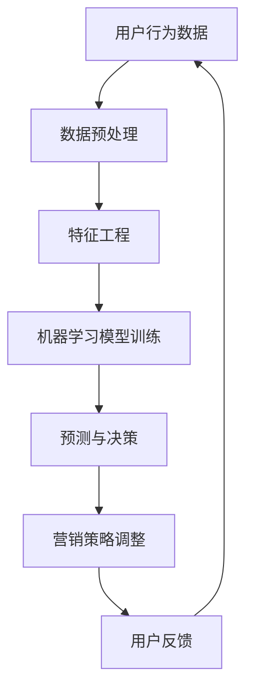

                 

关键词：人工智能、电商平台、精准营销、自动化、机器学习、数据挖掘

摘要：本文将探讨如何利用人工智能技术，尤其是机器学习和数据挖掘技术，实现电商平台精准营销活动的自动化。通过详细的分析和实际案例，我们旨在展示这种自动化营销方法的优势和应用前景。

## 1. 背景介绍

在当今竞争激烈的市场环境中，电商平台面临的一个主要挑战是如何吸引并留住顾客。传统的营销手段往往成本高昂且效果不理想。为了提升营销效率，电商平台开始寻求更加智能和自动化的解决方案。人工智能（AI）技术的发展为此提供了新的机遇。

### 1.1 人工智能在电商平台的应用

人工智能在电商平台的应用主要集中在以下几个方面：

- **个性化推荐**：通过分析用户的购买历史和浏览行为，推荐用户可能感兴趣的商品。
- **用户行为分析**：实时监控用户的行为，预测其购买意图和偏好。
- **聊天机器人**：为用户提供即时和个性化的服务，提高用户体验。
- **自动化营销**：利用机器学习算法，自动优化营销策略，提高转化率。

### 1.2 自动化营销的必要性

自动化营销具有以下优势：

- **提高效率**：自动化系统可以处理大量数据，节省人力成本。
- **精准定位**：通过数据分析，可以更准确地定位目标客户，提高营销效果。
- **实时调整**：根据实时数据分析，自动调整营销策略，快速响应市场变化。
- **降低错误**：减少人为干预，降低决策错误。

## 2. 核心概念与联系

### 2.1 核心概念

- **机器学习**：一种让计算机从数据中学习，自动改进和优化性能的方法。
- **数据挖掘**：从大量数据中提取有价值的信息和知识的过程。
- **深度学习**：一种复杂的机器学习方法，通过多层神经网络模拟人脑的学习过程。
- **自然语言处理（NLP）**：使计算机能够理解、解释和生成人类语言的技术。

### 2.2 Mermaid 流程图

以下是一个简化的 Mermaid 流程图，展示了电商平台精准营销自动化过程中涉及的核心概念和联系：



## 3. 核心算法原理 & 具体操作步骤

### 3.1 算法原理概述

电商平台精准营销活动自动化的核心在于使用机器学习算法对用户数据进行处理和分析，从而实现以下目标：

- **用户行为预测**：通过分析用户的历史行为，预测其未来的购买意图。
- **个性化推荐**：基于用户的偏好和购买历史，推荐相应的商品。
- **自动化营销策略**：根据用户行为和预测结果，自动调整营销策略，提高转化率。

### 3.2 算法步骤详解

#### 3.2.1 数据预处理

数据预处理是机器学习模型训练的重要步骤。主要包括以下任务：

- **数据清洗**：去除噪声数据和异常值。
- **数据转换**：将不同类型的数据转换为统一的格式。
- **数据归一化**：通过归一化处理，使得不同特征的数据具有相似的尺度。

#### 3.2.2 特征工程

特征工程是提高机器学习模型性能的关键。主要包括以下步骤：

- **特征选择**：从原始数据中提取最有用的特征。
- **特征构造**：通过组合原始特征，构造新的特征。
- **特征归一化**：对特征进行归一化处理，消除不同特征之间的尺度差异。

#### 3.2.3 机器学习模型训练

常见的机器学习模型包括：

- **分类模型**：用于预测用户是否会购买某个商品。
- **回归模型**：用于预测用户的购买金额或购买频率。
- **协同过滤模型**：用于基于用户的行为和偏好进行商品推荐。

#### 3.2.4 预测与决策

通过训练好的机器学习模型，对用户的行为进行预测，并根据预测结果自动调整营销策略。例如，可以发送个性化推荐邮件或推送消息给目标用户。

#### 3.2.5 营销策略调整

根据用户反馈和预测结果，不断调整和优化营销策略，以提高营销效果。

### 3.3 算法优缺点

#### 优点：

- **高效性**：自动化处理大量用户数据，节省时间和人力成本。
- **精准性**：通过机器学习和数据挖掘技术，实现精准的用户行为预测和推荐。
- **灵活性**：可以根据实时数据动态调整营销策略，快速响应市场变化。

#### 缺点：

- **初始成本高**：建立机器学习模型和自动化系统需要大量投资。
- **数据隐私问题**：收集和分析用户数据可能涉及隐私问题。
- **模型过拟合**：机器学习模型可能因为数据集有限而出现过拟合现象。

### 3.4 算法应用领域

电商平台精准营销活动自动化不仅适用于电商平台，还可以应用于以下领域：

- **在线广告**：通过自动化算法，提高广告投放的精准性和效果。
- **金融服务**：通过分析用户行为，提供个性化的金融产品和服务。
- **医疗服务**：通过分析患者数据，提供个性化的医疗服务和健康建议。

## 4. 数学模型和公式 & 详细讲解 & 举例说明

### 4.1 数学模型构建

电商平台精准营销活动自动化的数学模型主要包括以下部分：

- **用户行为模型**：用于描述用户的行为特征和购买意图。
- **推荐模型**：用于基于用户行为和偏好进行商品推荐。
- **优化模型**：用于优化营销策略，提高转化率和用户满意度。

### 4.2 公式推导过程

以下是一个简化的用户行为模型推导过程：

$$
P(y=1|X) = \sigma(\beta_0 + \beta_1X_1 + \beta_2X_2 + ... + \beta_nX_n)
$$

其中，\(P(y=1|X)\) 表示用户购买某个商品的概率，\(\sigma\) 是 sigmoid 函数，\(\beta_0, \beta_1, \beta_2, ..., \beta_n\) 是模型的参数，\(X_1, X_2, ..., X_n\) 是用户行为特征。

### 4.3 案例分析与讲解

假设我们有一个电商平台，用户数据包括购买历史、浏览行为和用户属性（如年龄、性别等）。我们可以使用以下步骤进行用户行为预测和推荐：

1. **数据预处理**：清洗和转换用户数据，包括去除噪声数据、缺失值填充等。
2. **特征工程**：提取有用的特征，如用户购买频率、浏览时长等。
3. **模型训练**：使用分类模型（如逻辑回归）对用户行为进行预测。
4. **推荐**：基于用户的行为特征和预测结果，推荐相应的商品。

## 5. 项目实践：代码实例和详细解释说明

### 5.1 开发环境搭建

1. 安装 Python 和相关库（如 NumPy、Pandas、Scikit-learn 等）。
2. 准备用户数据集。

### 5.2 源代码详细实现

```python
import pandas as pd
from sklearn.model_selection import train_test_split
from sklearn.linear_model import LogisticRegression
from sklearn.metrics import accuracy_score

# 读取用户数据
data = pd.read_csv('user_data.csv')

# 数据预处理
data.fillna(0, inplace=True)

# 特征工程
X = data[['purchase_frequency', 'browse_duration', 'age', 'gender']]
y = data['purchase']

# 划分训练集和测试集
X_train, X_test, y_train, y_test = train_test_split(X, y, test_size=0.2, random_state=42)

# 模型训练
model = LogisticRegression()
model.fit(X_train, y_train)

# 预测
y_pred = model.predict(X_test)

# 评估
accuracy = accuracy_score(y_test, y_pred)
print(f"Accuracy: {accuracy}")

# 推荐商品
recommendations = data[data['predicted_purchase']==1]['product_id'].values
print(f"Recommended products: {recommendations}")
```

### 5.3 代码解读与分析

以上代码实现了一个简单的用户行为预测和推荐系统。首先，我们读取用户数据，并进行数据预处理和特征工程。然后，使用逻辑回归模型对用户行为进行预测，并根据预测结果推荐商品。代码中使用了 Scikit-learn 库中的 LogisticRegression 类进行模型训练和预测，以及 accuracy_score 函数评估模型性能。

## 6. 实际应用场景

电商平台精准营销活动自动化在实际应用中具有广泛的应用场景：

- **个性化推荐**：基于用户行为和偏好，推荐相应的商品，提高用户购买意愿。
- **流失用户召回**：预测可能流失的用户，并通过个性化营销策略召回。
- **新品推广**：为新上市的商品制定个性化的营销策略，提高销售量。
- **营销活动优化**：根据用户行为数据，自动优化营销活动的预算分配和投放策略。

## 7. 工具和资源推荐

### 7.1 学习资源推荐

- **《机器学习》**：周志华 著，清华大学出版社
- **《数据挖掘：实用工具与技术》**：刘铁岩 著，电子工业出版社
- **《深度学习》**：Ian Goodfellow、Yoshua Bengio、Aaron Courville 著，电子工业出版社

### 7.2 开发工具推荐

- **Jupyter Notebook**：用于编写和运行 Python 代码。
- **PyCharm**：强大的 Python 集成开发环境。
- **Scikit-learn**：常用的 Python 机器学习库。
- **TensorFlow**：用于构建和训练深度学习模型。

### 7.3 相关论文推荐

- **"A Survey on Recommender Systems"**：N. Fu, J. Gao, X. Xu, Z. Wang, X. Li, and Z. Shi
- **"Deep Learning for Recommender Systems"**：H. Zhang, Y. Hu, J. Xu, X. Zhu, and Y. Chen
- **"User Behavior Modeling for Personalized Recommendation"**：S. Wang, Y. Zhu, Z. Liu, and J. Gao

## 8. 总结：未来发展趋势与挑战

### 8.1 研究成果总结

电商平台精准营销活动自动化技术已取得显著成果，包括用户行为预测、个性化推荐和自动化营销策略等。这些技术在实际应用中取得了良好的效果，提高了电商平台的营销效率和用户满意度。

### 8.2 未来发展趋势

- **更先进的算法**：随着深度学习和强化学习技术的发展，将会有更多先进的算法应用于电商平台精准营销活动自动化。
- **跨平台融合**：电商平台将与其他平台（如社交媒体、线下实体店等）进行数据融合，实现更全面的用户画像和个性化推荐。
- **隐私保护**：随着数据隐私问题的日益突出，未来的研究将更加关注如何在保障用户隐私的同时实现精准营销。

### 8.3 面临的挑战

- **数据质量和多样性**：高质量和多样化的数据是实现精准营销的关键，但电商平台面临的数据质量和多样性问题仍然存在。
- **算法公平性和透明性**：算法的公平性和透明性是用户和社会关注的焦点，如何确保算法的公平性和透明性是一个重要挑战。
- **计算资源和成本**：构建和运行大规模的机器学习模型需要大量的计算资源和成本，如何优化计算资源和降低成本是未来的一个重要研究方向。

### 8.4 研究展望

未来，电商平台精准营销活动自动化技术将在以下几个方面取得突破：

- **数据融合与挖掘**：结合多种数据源，构建更加全面和准确的用户画像。
- **个性化推荐**：基于用户行为和偏好，实现更精准和个性化的推荐。
- **自动化营销策略**：通过深度学习和强化学习等技术，实现更加智能和自动化的营销策略。
- **隐私保护**：研究更加有效的隐私保护技术，实现精准营销与用户隐私的平衡。

## 9. 附录：常见问题与解答

### 9.1 问题 1

**问**：如何处理缺失值？

**答**：常见的处理方法包括缺失值填充（如使用平均值、中位数或最常见值填充）和缺失值删除（如删除包含缺失值的记录）。具体方法取决于数据的重要性和缺失值的比例。

### 9.2 问题 2

**问**：如何选择特征？

**答**：可以选择具有高相关性、高信息量和较少冗余的特征。常用的特征选择方法包括基于统计的方法（如皮尔逊相关系数、卡方检验等）和基于模型的方法（如递归特征消除、主成分分析等）。

### 9.3 问题 3

**问**：如何评估模型性能？

**答**：常用的评估指标包括准确率、精确率、召回率、F1 值等。可以根据业务需求和数据特征选择合适的评估指标。

---

作者：禅与计算机程序设计艺术 / Zen and the Art of Computer Programming

