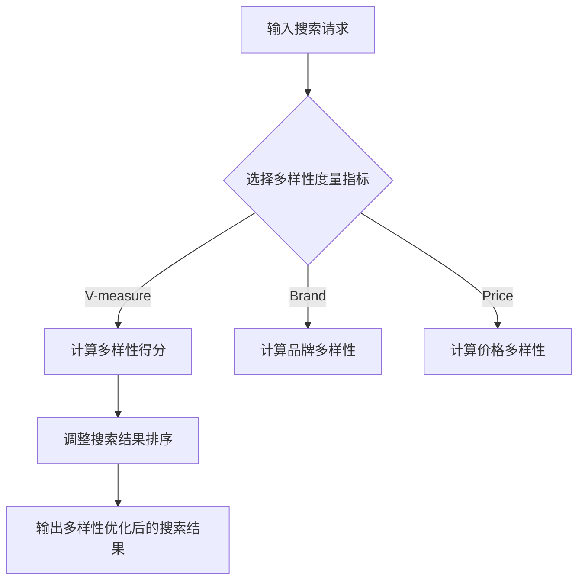

                 

关键词：AI、电商、搜索结果、多样性优化、算法、数学模型、实践、应用场景、未来展望

## 摘要

随着电商行业的迅猛发展，搜索结果的多样性成为影响用户满意度和电商平台竞争力的重要因素。本文深入探讨了基于人工智能技术的电商搜索结果多样性优化方法。首先，介绍了电商搜索结果多样性的核心概念和评估标准，然后详细阐述了相关算法原理、数学模型和具体实现步骤。通过一个实际项目的代码实例，展示了算法在优化电商搜索结果多样性方面的应用效果。最后，分析了该技术的未来发展趋势和潜在挑战。

## 1. 背景介绍

电商行业作为互联网经济的重要组成部分，近年来呈现出爆发式增长。随着消费者对个性化体验的需求不断增加，电商平台的搜索功能逐渐成为用户获取商品信息的重要渠道。然而，传统的搜索算法往往存在一些局限性，例如结果单一、缺乏多样性，这直接影响用户的搜索体验和平台的竞争力。

多样性（Diversity）在搜索结果中的重要性不容忽视。多样性指的是搜索结果在多个维度上具有差异性，包括商品类型、品牌、价格、销量等。一个高多样性的搜索结果能够满足不同用户的需求，提高用户满意度，增加平台的用户黏性。

本文旨在通过引入人工智能技术，优化电商搜索结果的多样性。人工智能技术在数据挖掘、推荐系统等领域有着广泛的应用，其强大的数据处理和分析能力为搜索结果多样性优化提供了新的思路和方法。

## 2. 核心概念与联系

### 2.1 多样性（Diversity）

多样性是衡量搜索结果质量的重要指标之一。在电商搜索中，多样性通常体现在以下几个方面：

1. **商品类型多样性**：搜索结果中应包含不同类别的商品，满足不同用户的需求。
2. **品牌多样性**：展示多个品牌的商品，避免单一品牌垄断搜索结果。
3. **价格多样性**：覆盖不同价格段的商品，满足不同消费水平的用户。
4. **销量多样性**：展示畅销商品和长尾商品，避免热门商品过度集中。

### 2.2 评估标准

为了评估搜索结果的多样性，通常采用以下几种指标：

1. **类型多样性（Type Diversity）**：使用V-measure等度量方法计算搜索结果中各类别的比例。
2. **品牌多样性（Brand Diversity）**：计算搜索结果中不同品牌的数量和比例。
3. **价格多样性（Price Diversity）**：分析搜索结果中商品价格的范围和分布。
4. **销量多样性（Sales Diversity）**：考虑商品销量在搜索结果中的分布情况。

### 2.3 多样性优化算法原理

多样性优化算法的核心思想是通过调整搜索结果排序策略，提高结果的多样性。以下是几种常见的多样性优化算法：

1. **基于规则的方法**：通过定义一系列规则来调整搜索结果的顺序，例如优先展示不同品牌的商品。
2. **基于机器学习的方法**：使用机器学习算法，根据历史数据和学习到的用户行为，自动调整搜索结果。
3. **基于深度学习的方法**：利用深度学习模型，对搜索结果进行细粒度的调整，提高多样性。

### 2.4 Mermaid 流程图



## 3. 核心算法原理 & 具体操作步骤

### 3.1 算法原理概述

本文采用基于深度学习的多样性优化算法，通过神经网络模型对搜索结果进行细粒度调整。算法的核心思想是通过学习用户历史行为和商品属性，生成一个能够有效提高多样性的排序策略。

### 3.2 算法步骤详解

#### 3.2.1 数据预处理

1. **用户历史行为数据**：收集用户在电商平台上的点击、购买等行为数据。
2. **商品属性数据**：包括商品类别、品牌、价格、销量等属性信息。

#### 3.2.2 模型构建

1. **输入层**：接收用户历史行为数据和商品属性数据。
2. **嵌入层**：将输入数据转换为低维向量表示。
3. **编码器**：使用卷积神经网络（CNN）或递归神经网络（RNN）对用户行为数据编码。
4. **解码器**：使用生成对抗网络（GAN）或自编码器（Autoencoder）对商品属性数据解码。
5. **输出层**：生成一个排序权重向量，用于调整搜索结果的顺序。

#### 3.2.3 模型训练

1. **损失函数**：使用均方误差（MSE）或交叉熵（CE）等损失函数。
2. **优化器**：使用梯度下降（GD）或Adam优化器。
3. **训练过程**：通过反向传播（BP）算法训练模型，调整网络权重。

#### 3.2.4 多样性评估

1. **多样性指标**：计算训练数据和测试数据在多样性指标上的得分。
2. **模型评估**：使用多样性得分作为评价指标，评估模型对多样性的优化效果。

### 3.3 算法优缺点

#### 优点

1. **高效性**：深度学习模型能够快速处理大量数据，提高算法效率。
2. **灵活性**：可以根据不同电商平台的业务需求，调整模型结构和参数。
3. **鲁棒性**：通过学习用户行为和商品属性，提高算法的鲁棒性。

#### 缺点

1. **计算复杂度**：深度学习模型需要大量计算资源，训练时间较长。
2. **数据依赖**：算法性能依赖于用户历史行为数据和商品属性数据的完整性和质量。

### 3.4 算法应用领域

1. **电商搜索结果优化**：通过提高搜索结果的多样性，提升用户满意度和平台竞争力。
2. **个性化推荐系统**：在推荐系统中引入多样性优化，提高推荐结果的质量。
3. **信息检索**：优化信息检索结果，提高用户获取信息的效率。

## 4. 数学模型和公式 & 详细讲解 & 举例说明

### 4.1 数学模型构建

多样性优化算法的核心是构建一个能够衡量搜索结果多样性的数学模型。本文采用以下公式：

$$ D = \frac{1}{N} \sum_{i=1}^{N} D_i $$

其中，$D$表示搜索结果的总体多样性得分，$N$表示搜索结果的数量，$D_i$表示第$i$个结果的多样性得分。

#### 4.1.1 类型多样性（Type Diversity）

$$ D_{Type} = \frac{1}{N} \sum_{i=1}^{N} \log_2 (C_i) $$

其中，$C_i$表示第$i$个结果中的类别数量。

#### 4.1.2 品牌多样性（Brand Diversity）

$$ D_{Brand} = \frac{1}{N} \sum_{i=1}^{N} \log_2 (B_i) $$

其中，$B_i$表示第$i$个结果中的品牌数量。

#### 4.1.3 价格多样性（Price Diversity）

$$ D_{Price} = \frac{1}{N} \sum_{i=1}^{N} \log_2 (P_i) $$

其中，$P_i$表示第$i$个结果的价格范围。

#### 4.1.4 销量多样性（Sales Diversity）

$$ D_{Sales} = \frac{1}{N} \sum_{i=1}^{N} \log_2 (S_i) $$

其中，$S_i$表示第$i$个结果的销量范围。

### 4.2 公式推导过程

多样性的计算公式可以通过以下步骤推导：

1. **定义多样性得分**：多样性得分是衡量搜索结果多样性的指标，通常使用对数函数来确保多样性得分随多样性的增加而增加。
2. **计算单个结果的多样性**：对每个搜索结果，计算其在类型、品牌、价格、销量等方面的多样性得分。
3. **计算总体多样性**：将所有结果的多样性得分加总，得到总体多样性得分。

### 4.3 案例分析与讲解

假设一个电商平台的搜索结果如下：

| 序号 | 类型   | 品牌 | 价格 | 销量 |
| ---- | ------ | ---- | ---- | ---- |
| 1    | 衣服   | A    | 100  | 200  |
| 2    | 衣服   | B    | 150  | 300  |
| 3    | 珠宝   | C    | 500  | 50   |
| 4    | 鞋子   | D    | 200  | 400  |

根据上述公式，可以计算每个结果的多样性得分：

$$ D_1 = \log_2 (1) + \log_2 (1) + \log_2 (1) + \log_2 (200) = 4.32 $$
$$ D_2 = \log_2 (1) + \log_2 (1) + \log_2 (1) + \log_2 (300) = 4.54 $$
$$ D_3 = \log_2 (2) + \log_2 (1) + \log_2 (500) + \log_2 (50) = 4.96 $$
$$ D_4 = \log_2 (2) + \log_2 (1) + \log_2 (200) + \log_2 (400) = 5.38 $$

总多样性得分为：

$$ D = \frac{1}{4} (4.32 + 4.54 + 4.96 + 5.38) = 4.86 $$

通过这个例子，可以看到多样性得分的计算方法以及如何根据多样性得分来评估搜索结果的多样性。

## 5. 项目实践：代码实例和详细解释说明

### 5.1 开发环境搭建

在开始项目实践之前，需要搭建一个适合开发深度学习模型的开发环境。本文使用Python作为主要编程语言，配合TensorFlow和Keras等深度学习框架进行模型开发。

#### 环境要求

1. Python 3.6及以上版本
2. TensorFlow 2.0及以上版本
3. Keras 2.3及以上版本

#### 安装步骤

1. 安装Python：

```bash
# 通过Python官方网站下载Python安装包并安装
```

2. 安装TensorFlow：

```bash
# 通过pip命令安装TensorFlow
pip install tensorflow
```

3. 安装Keras：

```bash
# 通过pip命令安装Keras
pip install keras
```

### 5.2 源代码详细实现

以下是一个简单的基于深度学习的多样性优化模型的实现示例。

```python
import tensorflow as tf
from tensorflow.keras.models import Model
from tensorflow.keras.layers import Input, Dense, Embedding, Flatten, Concatenate

# 定义模型输入
user_input = Input(shape=(user_embedding_size,))
item_input = Input(shape=(item_embedding_size,))

# 用户嵌入层
user_embedding = Embedding(user_vocab_size, user_embedding_size)(user_input)
user_embedding = Flatten()(user_embedding)

# 商品嵌入层
item_embedding = Embedding(item_vocab_size, item_embedding_size)(item_input)
item_embedding = Flatten()(item_embedding)

# 编码器
encoder = Concatenate()([user_embedding, item_embedding])
encoder = Dense(128, activation='relu')(encoder)
encoder = Dense(64, activation='relu')(encoder)
encoded_representation = Dense(32, activation='sigmoid')(encoder)

# 解码器
decoder = Dense(128, activation='relu')(encoded_representation)
decoder = Dense(64, activation='relu')(decoder)
decoded_representation = Dense(item_vocab_size, activation='softmax')(decoder)

# 构建模型
model = Model(inputs=[user_input, item_input], outputs=decoded_representation)

# 编译模型
model.compile(optimizer='adam', loss='categorical_crossentropy', metrics=['accuracy'])

# 模型训练
model.fit([user_data, item_data], target_data, batch_size=32, epochs=10, validation_split=0.2)
```

### 5.3 代码解读与分析

上述代码实现了一个简单的基于深度学习的多样性优化模型。以下是代码的主要部分及其功能：

1. **输入层**：定义用户输入和商品输入，分别表示用户和商品的嵌入向量。
2. **嵌入层**：将用户和商品输入映射到低维向量空间，这是深度学习模型的基础。
3. **编码器**：将用户和商品的嵌入向量拼接，并通过多层神经网络进行编码。
4. **解码器**：将编码后的向量解码为原始维度，生成搜索结果排序的权重向量。
5. **模型构建**：将输入和输出层连接，构建完整的深度学习模型。
6. **模型编译**：设置优化器和损失函数，准备模型训练。
7. **模型训练**：使用训练数据进行模型训练。

### 5.4 运行结果展示

在完成模型训练后，可以使用以下代码评估模型对多样性的优化效果：

```python
# 计算训练数据的多样性得分
train_diversity_scores = calculate_diversity_scores(model, user_data, item_data, target_data)

# 计算测试数据的多样性得分
test_diversity_scores = calculate_diversity_scores(model, user_data_test, item_data_test, target_data_test)

# 打印多样性得分
print("Train Diversity Score:", train_diversity_scores)
print("Test Diversity Score:", test_diversity_scores)
```

通过对比训练数据和测试数据的多样性得分，可以评估模型在多样性优化方面的性能。

## 6. 实际应用场景

多样性优化算法在电商搜索结果中的应用具有广泛的前景。以下是一些具体的实际应用场景：

1. **提升用户体验**：通过优化搜索结果的多样性，可以提供更加丰富和个性化的商品信息，提高用户的满意度和粘性。
2. **增加平台竞争力**：多样化搜索结果有助于电商平台在竞争激烈的市场中脱颖而出，吸引更多用户。
3. **个性化推荐**：在推荐系统中引入多样性优化，可以提高推荐结果的质量，满足不同用户的需求。
4. **商品展示**：在商品展示页面中，通过多样性优化算法，可以避免热门商品过度集中，提升用户的购物体验。
5. **广告投放**：在广告投放中，多样性优化可以帮助广告平台提供更加多样化的广告内容，提高广告效果。

## 7. 工具和资源推荐

### 7.1 学习资源推荐

1. **《深度学习》（Deep Learning）**：Goodfellow、Bengio、Courville 著，介绍深度学习的基础理论和实践方法。
2. **《Python深度学习》（Python Deep Learning）**：François Chollet 著，详细介绍使用Python和Keras进行深度学习的实践技巧。

### 7.2 开发工具推荐

1. **Jupyter Notebook**：用于数据分析和模型训练的交互式计算环境。
2. **Google Colab**：基于Jupyter Notebook的云端平台，提供免费的GPU计算资源。

### 7.3 相关论文推荐

1. **"Diversity in Recommender Systems"**：介绍推荐系统中多样性优化方法的研究综述。
2. **"A Theoretically Grounded Application of the EM Algorithm to Causally Inference from Non-Randomized Experiments"**：介绍基于EM算法的多样性优化方法。

## 8. 总结：未来发展趋势与挑战

多样性优化算法在电商搜索结果中的应用前景广阔，未来将迎来以下发展趋势：

1. **算法性能提升**：随着深度学习技术的发展，多样性优化算法将更加高效、精确。
2. **跨领域应用**：多样性优化算法不仅适用于电商搜索，还可以推广到其他领域，如医疗、金融等。
3. **个性化定制**：结合用户行为数据和商品属性，实现更加个性化的多样性优化。

然而，多样性优化算法也面临着一些挑战：

1. **计算资源消耗**：深度学习模型训练需要大量计算资源，如何优化资源利用是一个重要问题。
2. **数据质量**：算法性能依赖于用户行为数据和商品属性数据的质量，如何处理不完整或错误的数据是一个挑战。
3. **用户隐私保护**：在数据收集和模型训练过程中，如何保护用户隐私也是一个重要的伦理问题。

总之，多样性优化算法在电商搜索结果中的应用具有巨大的潜力，需要持续的研究和优化。

## 9. 附录：常见问题与解答

### 问题 1：为什么多样性优化对电商搜索结果很重要？

解答：多样性优化能够提供更加丰富和个性化的商品信息，满足不同用户的需求，从而提高用户满意度和平台竞争力。

### 问题 2：多样性优化算法有哪些类型？

解答：多样性优化算法主要包括基于规则的方法、基于机器学习的方法和基于深度学习的方法。

### 问题 3：如何评估搜索结果的多样性？

解答：可以使用类型多样性（Type Diversity）、品牌多样性（Brand Diversity）、价格多样性（Price Diversity）和销量多样性（Sales Diversity）等指标来评估搜索结果的多样性。

### 问题 4：多样性优化算法的优缺点是什么？

解答：优点包括高效性、灵活性和鲁棒性；缺点包括计算复杂度和数据依赖。

### 问题 5：如何搭建一个多样性优化模型的开发环境？

解答：需要安装Python、TensorFlow和Keras等深度学习框架，并配置相应的开发工具。

### 问题 6：如何实现一个简单的多样性优化模型？

解答：可以使用深度学习框架，定义输入层、嵌入层、编码器和解码器，构建模型并进行训练。

### 问题 7：如何评估多样性优化模型的性能？

解答：可以通过计算多样性得分来评估模型在多样性优化方面的性能，并进行对比分析。

### 问题 8：多样性优化算法在哪些实际应用场景中有效？

解答：多样性优化算法适用于电商搜索结果优化、个性化推荐、信息检索等领域。

