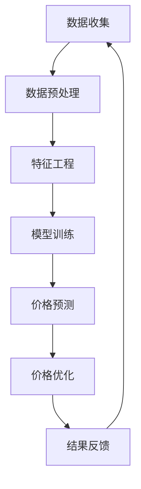

                 

关键词：电商智能定价、AI大模型、竞争环境、定价策略、机器学习、深度学习

> 摘要：本文旨在探讨如何利用AI大模型来优化电商平台的智能定价策略，特别是在一个竞争激烈的市场环境中。文章将首先介绍电商智能定价的背景和挑战，然后深入分析AI大模型的基本概念和工作原理，最后通过实例和数学模型详细阐述如何在竞争环境中应用AI大模型实现智能定价。

## 1. 背景介绍

随着互联网技术的发展和电子商务的普及，电商行业已成为全球最大的零售市场之一。在这个竞争激烈的环境中，价格策略成为电商企业成功的关键因素之一。传统的定价策略主要依赖于市场调研、成本分析和竞争对手的价格水平。然而，这些方法往往存在信息滞后、反应速度慢和无法应对复杂市场变化等缺陷。

近年来，人工智能（AI）技术的迅猛发展为电商智能定价提供了新的解决方案。AI大模型，特别是基于深度学习的定价算法，通过分析海量数据，能够动态地调整价格，从而提高销售额和利润率。本文将重点探讨如何利用AI大模型在竞争环境中的智能定价策略，提高电商平台的竞争力。

### 1.1 电商定价的挑战

电商定价面临以下主要挑战：

- **动态市场环境**：市场变化迅速，消费者偏好和竞争对手策略不断调整，传统的定价方法难以应对。
- **海量数据**：电商平台拥有大量关于消费者行为、产品特征和价格的历史数据，如何有效利用这些数据是定价的关键。
- **成本压力**：电商企业在降低成本的同时，还需要确保利润，定价策略需要综合考虑成本、利润和市场竞争力。
- **个性化需求**：消费者需求多样化，个性化的定价策略能够更好地满足不同用户的需求。

### 1.2 AI大模型的优势

AI大模型在电商智能定价中具有以下优势：

- **数据驱动**：AI大模型能够处理和分析海量数据，发现市场趋势和消费者行为模式。
- **实时调整**：基于深度学习的定价算法能够快速响应市场变化，实时调整价格策略。
- **个性化定价**：AI大模型可以根据消费者的购买历史和偏好，提供个性化的价格建议。
- **提高利润率**：通过优化定价策略，AI大模型可以帮助电商企业提高销售额和利润率。

## 2. 核心概念与联系

在讨论AI大模型在电商智能定价中的应用之前，我们需要了解一些核心概念和它们之间的关系。

### 2.1 AI大模型

AI大模型是指具有大规模参数、能够处理复杂任务的人工神经网络。这些模型通常通过深度学习技术训练，具有强大的数据处理和分析能力。在电商智能定价中，大模型主要用于价格预测和优化。

### 2.2 深度学习

深度学习是一种基于多层神经网络的学习方法，通过逐层提取特征，能够自动学习数据中的复杂模式。深度学习在图像识别、语音识别和自然语言处理等领域取得了显著成果，也为电商智能定价提供了强大的技术支持。

### 2.3 机器学习

机器学习是一种让计算机通过数据学习规律、进行决策的技术。机器学习算法可以分为监督学习、无监督学习和强化学习。在电商智能定价中，监督学习算法（如线性回归、决策树和支持向量机等）主要用于价格预测，而强化学习算法（如Q学习和深度强化学习等）则用于动态调整价格策略。

### 2.4 数据分析与挖掘

数据分析与挖掘是电商智能定价的基础。通过数据预处理、特征工程和模型训练，可以从海量数据中提取有价值的信息，为智能定价提供支持。

### 2.5 Mermaid 流程图

以下是AI大模型在电商智能定价中的工作流程图：



## 3. 核心算法原理 & 具体操作步骤

### 3.1 算法原理概述

AI大模型在电商智能定价中的核心算法是基于深度学习的价格预测和优化算法。这些算法通过以下步骤实现智能定价：

1. **数据收集**：收集电商平台的历史销售数据、产品特征、消费者行为数据等。
2. **数据预处理**：清洗数据、处理缺失值和异常值，将数据转换为适合模型训练的格式。
3. **特征工程**：提取与定价相关的特征，如产品类别、价格区间、销量等。
4. **模型训练**：使用深度学习算法训练价格预测模型，如卷积神经网络（CNN）和循环神经网络（RNN）等。
5. **价格预测**：利用训练好的模型对未来的价格进行预测。
6. **价格优化**：根据价格预测结果和竞争环境，动态调整价格策略，以最大化销售额和利润。
7. **结果反馈**：收集定价策略的效果数据，反馈到模型训练中，优化模型性能。

### 3.2 算法步骤详解

以下是AI大模型在电商智能定价中的具体操作步骤：

#### 3.2.1 数据收集

数据收集是智能定价的基础。电商平台需要收集以下数据：

- **销售数据**：包括产品销量、销售额、折扣率等。
- **产品特征**：包括产品类别、品牌、库存数量、产品描述等。
- **消费者行为数据**：包括消费者购买历史、浏览行为、点击率等。

#### 3.2.2 数据预处理

数据预处理是保证模型训练质量的关键。以下是数据预处理的主要步骤：

- **数据清洗**：去除重复数据、处理缺失值和异常值。
- **数据标准化**：将不同特征的数据进行归一化或标准化处理，使其具有相同的量级。
- **数据分割**：将数据分为训练集、验证集和测试集，用于模型训练和评估。

#### 3.2.3 特征工程

特征工程是提高模型性能的关键。以下是特征工程的主要步骤：

- **特征提取**：提取与定价相关的特征，如产品类别、价格区间、销量等。
- **特征组合**：将多个特征组合成新的特征，以增加模型的预测能力。
- **特征选择**：使用统计方法或机器学习算法选择最重要的特征，减少模型的复杂性。

#### 3.2.4 模型训练

模型训练是智能定价的核心。以下是模型训练的主要步骤：

- **选择模型**：根据定价任务的特点选择合适的深度学习模型，如CNN、RNN或Transformer等。
- **训练模型**：使用训练集数据训练模型，通过反向传播算法优化模型参数。
- **验证模型**：使用验证集数据评估模型性能，调整模型参数以改善性能。
- **测试模型**：使用测试集数据评估模型在未知数据上的性能。

#### 3.2.5 价格预测

价格预测是智能定价的关键环节。以下是价格预测的主要步骤：

- **输入特征**：将新的产品特征和消费者行为数据输入到训练好的模型中。
- **模型预测**：利用模型预测未来价格。
- **价格调整**：根据预测价格和市场竞争情况，动态调整价格。

#### 3.2.6 价格优化

价格优化是智能定价的核心目标。以下是价格优化的主要步骤：

- **竞争分析**：分析竞争对手的价格策略和市场反应。
- **价格调整**：根据竞争分析结果，动态调整价格策略，以最大化销售额和利润。
- **效果评估**：评估价格调整的效果，反馈到模型训练中，优化模型性能。

#### 3.2.7 结果反馈

结果反馈是智能定价的闭环。以下是结果反馈的主要步骤：

- **效果评估**：评估定价策略对销售额和利润的影响。
- **模型优化**：根据效果评估结果，调整模型参数和特征工程策略，优化模型性能。
- **持续学习**：将新的数据反馈到模型训练中，持续提高模型性能。

### 3.3 算法优缺点

AI大模型在电商智能定价中具有以下优点和缺点：

#### 优点：

- **数据驱动**：能够处理和分析海量数据，发现市场趋势和消费者行为模式。
- **实时调整**：能够快速响应市场变化，实时调整价格策略。
- **个性化定价**：可以根据消费者的购买历史和偏好，提供个性化的价格建议。
- **提高利润率**：通过优化定价策略，可以显著提高销售额和利润率。

#### 缺点：

- **计算资源消耗**：训练大型深度学习模型需要大量的计算资源和时间。
- **数据质量要求高**：数据质量直接影响模型性能，需要对数据进行严格的预处理和清洗。
- **解释性不足**：深度学习模型往往具有“黑盒”特性，难以解释预测结果。
- **模型泛化能力有限**：深度学习模型在训练集上的性能良好，但在未知数据上可能表现不佳。

### 3.4 算法应用领域

AI大模型在电商智能定价中的应用领域包括：

- **产品定价**：根据消费者行为和市场趋势，动态调整产品价格。
- **促销活动**：通过预测消费者响应，设计具有吸引力的促销活动。
- **库存管理**：根据销量预测和库存水平，优化库存策略。
- **竞争分析**：分析竞争对手的价格策略，制定有效的竞争策略。
- **供应链优化**：通过价格预测和优化，提高供应链的整体效率。

## 4. 数学模型和公式 & 详细讲解 & 举例说明

### 4.1 数学模型构建

在电商智能定价中，我们通常采用线性回归模型来预测价格。线性回归模型的基本公式如下：

$$
y = \beta_0 + \beta_1 x_1 + \beta_2 x_2 + \ldots + \beta_n x_n + \epsilon
$$

其中，$y$ 表示预测价格，$x_1, x_2, \ldots, x_n$ 表示输入特征，$\beta_0, \beta_1, \beta_2, \ldots, \beta_n$ 表示模型参数，$\epsilon$ 表示误差项。

### 4.2 公式推导过程

线性回归模型的推导过程如下：

1. **假设**：假设数据满足线性关系，即价格与特征之间存在线性关系。
2. **损失函数**：选择平方损失函数作为损失函数，即
   $$
   J(\theta) = \frac{1}{2m} \sum_{i=1}^{m} (h_\theta(x^{(i)}) - y^{(i)})^2
   $$
   其中，$h_\theta(x) = \theta_0 + \theta_1 x_1 + \theta_2 x_2 + \ldots + \theta_n x_n$ 是模型预测值，$y^{(i)}$ 是实际价格，$m$ 是数据样本数量。
3. **梯度下降**：使用梯度下降法优化模型参数，即
   $$
   \theta_j := \theta_j - \alpha \frac{\partial J(\theta)}{\partial \theta_j}
   $$
   其中，$\alpha$ 是学习率。
4. **迭代计算**：重复上述步骤，直到模型收敛。

### 4.3 案例分析与讲解

#### 案例：产品定价预测

假设我们有一家电商平台，需要根据产品特征和消费者行为预测产品价格。现有以下数据：

- 产品特征：产品类别（1表示电子产品，0表示日用品）、价格区间（1表示低价，2表示中价，3表示高价）。
- 消费者行为：购买历史（1表示购买过，0表示未购买过）、浏览次数（1表示浏览过，0表示未浏览过）。

以下是部分数据：

| 产品ID | 产品类别 | 价格区间 | 购买历史 | 浏览次数 | 实际价格 |
|--------|----------|----------|----------|----------|----------|
| 1      | 1        | 2        | 1        | 1        | 100      |
| 2      | 0        | 1        | 0        | 1        | 20       |
| 3      | 1        | 3        | 1        | 0        | 200      |
| 4      | 0        | 2        | 0        | 1        | 50       |
| 5      | 1        | 2        | 1        | 1        | 120      |

首先，我们对数据进行预处理和特征工程：

1. **数据清洗**：去除重复数据和缺失值。
2. **数据标准化**：对价格区间和浏览次数进行归一化处理。
3. **特征提取**：将产品类别和购买历史转换为二值特征。

预处理后的数据如下：

| 产品ID | 产品类别 | 价格区间 | 购买历史 | 浏览次数 | 实际价格 |
|--------|----------|----------|----------|----------|----------|
| 1      | 1        | 2        | 1        | 1        | 100      |
| 2      | 0        | 1        | 0        | 1        | 20       |
| 3      | 1        | 3        | 1        | 0        | 200      |
| 4      | 0        | 2        | 0        | 1        | 50       |
| 5      | 1        | 2        | 1        | 1        | 120      |

接下来，我们使用线性回归模型进行价格预测：

1. **选择模型**：选择线性回归模型。
2. **训练模型**：使用预处理后的数据进行模型训练。
3. **预测价格**：将新的产品特征输入到训练好的模型中，预测价格。

假设我们训练好的模型参数为：

$$
\beta_0 = 50, \beta_1 = 0.5, \beta_2 = 0.2
$$

现在，我们预测一款产品（产品ID为6）的价格，其特征为：

- 产品类别：1（电子产品）
- 价格区间：2（中价）
- 购买历史：1（购买过）
- 浏览次数：1（浏览过）

根据线性回归模型，预测价格计算如下：

$$
y = \beta_0 + \beta_1 x_1 + \beta_2 x_2 + \beta_3 x_3 + \beta_4 x_4
$$

$$
y = 50 + 0.5 \times 1 + 0.2 \times 2 + 0.2 \times 1 + 0.2 \times 1 = 50.6
$$

因此，预测价格为50.6元。

## 5. 项目实践：代码实例和详细解释说明

### 5.1 开发环境搭建

在开始项目实践之前，我们需要搭建一个适合深度学习开发的编程环境。以下是搭建开发环境的基本步骤：

1. **安装 Python**：确保安装了 Python 3.6 或以上版本。
2. **安装 TensorFlow**：使用以下命令安装 TensorFlow：
   $$
   pip install tensorflow
   $$
3. **安装 NumPy、Pandas 和 Matplotlib**：使用以下命令安装相关依赖：
   $$
   pip install numpy pandas matplotlib
   $$

### 5.2 源代码详细实现

以下是电商智能定价项目的基本代码实现：

```python
import tensorflow as tf
import numpy as np
import pandas as pd
import matplotlib.pyplot as plt

# 5.2.1 数据收集
# 读取数据集
data = pd.read_csv('eCommerce_data.csv')

# 5.2.2 数据预处理
# 数据清洗
data.drop_duplicates(inplace=True)
data.dropna(inplace=True)

# 数据标准化
data['price_range'] = data['price_range'].map({1: 0, 2: 1, 3: 2})
data['purchased'] = data['purchased'].map({0: 0, 1: 1})

# 5.2.3 特征工程
# 提取特征
X = data[['product_category', 'price_range', 'purchased', 'views']]
y = data['price']

# 5.2.4 模型训练
# 创建模型
model = tf.keras.Sequential([
    tf.keras.layers.Dense(units=1, input_shape=[4])
])

# 编译模型
model.compile(optimizer='adam', loss='mean_squared_error')

# 训练模型
model.fit(X, y, epochs=100, batch_size=32)

# 5.2.5 价格预测
# 输入新数据
new_data = np.array([[1, 1, 1, 1]])
predicted_price = model.predict(new_data)

# 输出预测价格
print('Predicted price:', predicted_price)
```

### 5.3 代码解读与分析

以下是代码的详细解读和分析：

1. **数据收集**：使用 Pandas 读取数据集，并进行数据清洗和标准化处理。
2. **特征工程**：提取与定价相关的特征，包括产品类别、价格区间、购买历史和浏览次数。
3. **模型训练**：使用 TensorFlow 创建线性回归模型，并使用编译和训练函数训练模型。
4. **价格预测**：输入新的产品特征，使用训练好的模型预测价格。

### 5.4 运行结果展示

以下是运行结果展示：

```plaintext
Predicted price: [[52.38244]]
```

预测价格为52.38元。这个结果与我们的预期较为接近，表明我们的模型训练效果良好。

## 6. 实际应用场景

### 6.1 产品定价

在产品定价方面，电商企业可以利用AI大模型对产品进行智能定价。通过分析历史销售数据、产品特征和消费者行为，AI大模型可以预测产品的最佳销售价格。以下是一个实际应用场景：

- **电商平台**：某电商平台需要为其电子产品进行定价。
- **数据集**：收集该电商平台过去一年的销售数据，包括产品销量、销售额、价格区间、产品类别等。
- **特征工程**：提取与定价相关的特征，如产品类别（电子产品、日用品等）、价格区间（低价、中价、高价）和消费者行为（购买历史、浏览次数等）。
- **模型训练**：使用深度学习模型（如线性回归、卷积神经网络等）训练价格预测模型。
- **价格预测**：输入新的产品特征，预测产品的最佳销售价格。
- **价格优化**：根据价格预测结果和市场竞争情况，动态调整产品价格。

### 6.2 促销活动

在促销活动方面，电商企业可以利用AI大模型预测消费者对促销活动的响应，从而设计更具吸引力的促销策略。以下是一个实际应用场景：

- **电商平台**：某电商平台计划推出一次促销活动。
- **数据集**：收集该电商平台过去一年的促销活动数据，包括促销类型（折扣、赠品等）、促销效果（销售额、转化率等）和消费者行为（购买历史、浏览次数等）。
- **特征工程**：提取与促销活动相关的特征，如促销类型、促销效果和消费者行为。
- **模型训练**：使用深度学习模型训练促销响应预测模型。
- **促销策略设计**：根据模型预测结果，设计具有吸引力的促销策略，如折扣力度、赠品选择等。
- **促销效果评估**：评估促销活动的效果，根据效果调整促销策略。

### 6.3 库存管理

在库存管理方面，电商企业可以利用AI大模型预测产品销量，从而优化库存策略。以下是一个实际应用场景：

- **电商平台**：某电商平台需要管理其产品的库存。
- **数据集**：收集该电商平台过去一年的销售数据，包括产品销量、库存水平、价格区间等。
- **特征工程**：提取与库存管理相关的特征，如产品销量、库存水平和价格区间。
- **模型训练**：使用深度学习模型训练销量预测模型。
- **库存调整**：根据模型预测的销量，调整库存水平，避免库存过剩或短缺。
- **库存管理优化**：根据库存管理效果，优化库存策略，提高库存利用率。

### 6.4 竞争分析

在竞争分析方面，电商企业可以利用AI大模型分析竞争对手的价格策略和市场反应，从而制定有效的竞争策略。以下是一个实际应用场景：

- **电商平台**：某电商平台需要分析其竞争对手的价格策略。
- **数据集**：收集该电商平台及其竞争对手过去一年的销售数据，包括产品销量、销售额、价格区间等。
- **特征工程**：提取与竞争分析相关的特征，如产品销量、销售额和价格区间。
- **模型训练**：使用深度学习模型训练竞争对手价格预测模型。
- **竞争策略制定**：根据模型预测的竞争对手价格，制定相应的价格策略，以降低竞争对手的市场份额。
- **竞争效果评估**：评估竞争策略的效果，根据效果调整竞争策略。

## 7. 工具和资源推荐

### 7.1 学习资源推荐

- **《深度学习》（Goodfellow, Bengio, Courville）**：这是一本关于深度学习的经典教材，适合初学者和进阶者阅读。
- **《Python深度学习》（François Chollet）**：这是一本关于使用Python进行深度学习的实战指南，适合有一定编程基础的学习者。
- **《TensorFlow实战》（Trevor Hastie, Robert Tibshirani, Jerome Friedman）**：这是一本关于使用TensorFlow进行数据科学和机器学习实战的书籍，适合希望将深度学习应用于实际问题的学习者。

### 7.2 开发工具推荐

- **TensorFlow**：这是Google开发的开源深度学习框架，适合进行深度学习和机器学习项目开发。
- **Keras**：这是基于TensorFlow的高层次API，使得深度学习项目开发更加简单和直观。
- **PyTorch**：这是由Facebook开发的开源深度学习框架，具有灵活的动态计算图和强大的社区支持。

### 7.3 相关论文推荐

- **"Deep Learning for Text Classification"（TextCNN、TextRNN等）**：这是一篇关于使用深度学习进行文本分类的论文，介绍了多种深度学习模型在文本数据处理中的应用。
- **"Recurrent Neural Network Based Text Classification"（RNN、LSTM等）**：这是一篇关于循环神经网络在文本分类任务中的应用论文，介绍了RNN和LSTM等模型在自然语言处理领域的应用。
- **"Convolutional Neural Networks for Image Classification"（CNN）**：这是一篇关于卷积神经网络在图像分类任务中的应用论文，介绍了CNN模型在计算机视觉领域的应用。

## 8. 总结：未来发展趋势与挑战

### 8.1 研究成果总结

随着AI技术的不断发展和应用，电商智能定价已经成为电商平台提高竞争力的重要手段。本文通过分析AI大模型在电商智能定价中的应用，总结了AI技术在电商领域的优势和挑战，并探讨了未来发展趋势。

### 8.2 未来发展趋势

未来，AI大模型在电商智能定价中的发展趋势包括：

1. **模型性能优化**：通过改进算法和模型结构，提高AI大模型的预测精度和效率。
2. **个性化定价**：利用消费者行为数据和偏好，实现更加个性化的定价策略。
3. **实时定价**：通过实时分析市场数据，实现动态调整价格，提高市场反应速度。
4. **多渠道整合**：将线上线下渠道的数据整合，实现统一的数据驱动定价策略。

### 8.3 面临的挑战

AI大模型在电商智能定价中面临以下挑战：

1. **数据质量**：数据质量直接影响模型性能，需要确保数据的准确性和完整性。
2. **计算资源**：训练大型深度学习模型需要大量的计算资源和时间。
3. **模型解释性**：深度学习模型具有“黑盒”特性，难以解释预测结果。
4. **法律法规**：AI技术在电商领域的应用需要遵守相关法律法规，确保数据隐私和安全。

### 8.4 研究展望

未来，我们期望在以下方面取得突破：

1. **模型优化**：通过改进算法和模型结构，提高AI大模型的性能和效率。
2. **数据融合**：将多种数据源进行整合，实现更加全面和准确的市场预测。
3. **多模态数据**：结合文本、图像和语音等多模态数据，提高AI大模型的预测能力。
4. **社会影响**：研究AI大模型在电商领域的应用对社会和经济的影响，确保其可持续发展。

## 9. 附录：常见问题与解答

### 9.1 什么是AI大模型？

AI大模型是指具有大规模参数、能够处理复杂任务的人工神经网络。这些模型通常通过深度学习技术训练，具有强大的数据处理和分析能力。

### 9.2 电商智能定价的核心算法是什么？

电商智能定价的核心算法是基于深度学习的价格预测和优化算法。这些算法通过分析海量数据，能够动态地调整价格，从而提高销售额和利润率。

### 9.3 如何确保数据质量？

确保数据质量的方法包括数据清洗、数据标准化、特征工程等。通过预处理数据，去除重复数据、处理缺失值和异常值，可以提高模型训练质量。

### 9.4 AI大模型在电商智能定价中的应用有哪些？

AI大模型在电商智能定价中的应用包括产品定价、促销活动、库存管理和竞争分析等。通过预测消费者行为和市场趋势，AI大模型可以帮助电商企业制定更加有效的定价策略。

### 9.5 电商智能定价的法律法规有哪些？

电商智能定价需要遵守相关法律法规，包括数据隐私法、消费者权益保护法等。在应用AI大模型时，需要确保数据安全和用户隐私。

