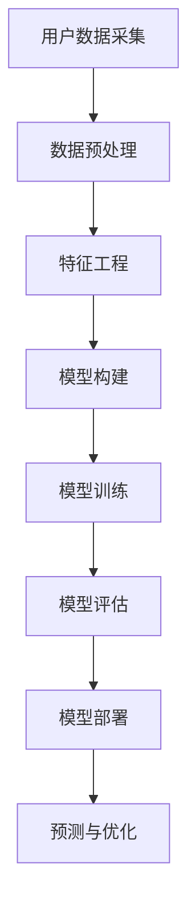

                 

在当今电子商务蓬勃发展的时代，如何准确预测用户生命周期价值（Customer Lifetime Value，简称CLV）已经成为电商企业提高盈利能力的关键因素。传统的预测方法往往依赖于历史数据和时间序列分析，但在面对复杂多变的市场环境时，这些方法的表现往往不尽如人意。随着人工智能技术的不断发展，尤其是深度学习等先进算法的应用，AI驱动的用户生命周期价值预测模型逐渐成为研究热点。本文将深入探讨AI在电商用户生命周期价值预测中的应用，通过核心算法原理、数学模型与项目实践，全面解析这一前沿技术。

## 关键词

- 人工智能
- 电子商务
- 用户生命周期价值
- 深度学习
- 预测模型
- 数学模型

## 摘要

本文旨在探讨如何利用人工智能技术，特别是深度学习算法，构建电商用户生命周期价值预测模型。首先，我们将介绍用户生命周期价值的定义及其在电商行业的重要性。随后，本文将详细阐述AI驱动的预测模型的架构和核心算法原理。接下来，我们将介绍数学模型的构建过程和公式推导，并通过具体案例进行讲解。最后，我们将分享一个实际项目中的代码实现，详细解读其开发过程和运行结果。文章的最后一部分将探讨该模型的实际应用场景和未来发展趋势。

## 1. 背景介绍

### 1.1 电子商务的崛起

随着互联网技术的飞速发展，电子商务已经成为全球经济增长的重要引擎。据统计，2021年全球电子商务交易额已超过3.5万亿美元，预计到2025年将达到6万亿美元。电子商务的崛起不仅改变了人们的购物方式，也为企业带来了巨大的商业机会。然而，在激烈的市场竞争中，如何吸引和保留客户，提高用户生命周期价值，成为企业面临的重大挑战。

### 1.2 用户生命周期价值的定义

用户生命周期价值是指一个客户在其整个生命周期中为企业带来的总收益。它不仅包括客户在购买商品或服务时的直接收益，还包括客户对企业的口碑传播、复购率、推荐率等潜在价值。用户生命周期价值的高低直接影响企业的盈利能力和市场竞争力。因此，准确预测用户生命周期价值对于企业制定营销策略、优化资源配置具有重要意义。

### 1.3 传统预测方法的局限

尽管用户生命周期价值的预测对于电商企业至关重要，但传统的预测方法往往存在一定的局限。首先，传统方法主要依赖于历史数据和统计分析，难以应对数据质量不佳或数据缺失的问题。其次，传统方法通常基于线性模型或时间序列分析，对于复杂非线性关系和多重交互效应的处理能力有限。此外，传统方法在处理大规模数据和实时预测方面也存在效率问题。

### 1.4 人工智能在预测中的应用

随着人工智能技术的不断发展，特别是深度学习等算法的兴起，为用户生命周期价值预测带来了新的可能性。深度学习算法具有强大的非线性建模能力和自学习能力，可以处理大规模复杂数据，并发现数据中的潜在模式和规律。通过构建AI驱动的预测模型，企业可以更准确地预测用户行为，优化营销策略，提高用户生命周期价值。

## 2. 核心概念与联系

### 2.1 概念解释

- **用户生命周期价值（CLV）**：指客户在其整个生命周期中为商家带来的总价值。
- **特征工程**：指在构建预测模型前，对原始数据进行处理、转换和选择，提取出对模型有预测作用的特征。
- **深度学习**：一种基于多层神经网络的学习方法，通过学习数据中的层次特征表示，实现复杂的预测任务。
- **神经网络架构**：神经网络的结构设计，包括层数、神经元数量、激活函数等。

### 2.2 概念联系

在AI驱动的用户生命周期价值预测模型中，特征工程是模型构建的基础，深度学习算法是核心，神经网络架构是实现算法的关键。特征工程的质量直接影响模型的预测性能；而深度学习算法和神经网络架构的选择则决定了模型的学习能力和泛化能力。这三者相互联系，共同构成了一个完整的预测模型。

### 2.3 Mermaid 流程图



## 3. 核心算法原理 & 具体操作步骤

### 3.1 算法原理概述

AI驱动的用户生命周期价值预测模型主要基于深度学习算法。深度学习通过构建多层神经网络，对用户行为数据进行分析和学习，从而实现对用户生命周期价值的预测。核心步骤包括数据预处理、特征工程、模型构建、模型训练、模型评估和模型部署。

### 3.2 算法步骤详解

#### 3.2.1 数据预处理

数据预处理是构建深度学习模型的第一步。主要任务包括数据清洗、数据标准化和缺失值处理。

- **数据清洗**：去除重复数据、异常值和噪声数据。
- **数据标准化**：将不同尺度的数据进行归一化或标准化处理，使得数据在同一个量级上。
- **缺失值处理**：通过插值、均值填充或模型预测等方法处理缺失值。

#### 3.2.2 特征工程

特征工程是深度学习模型成功的关键。主要任务包括特征选择、特征变换和特征组合。

- **特征选择**：通过统计方法、机器学习评分方法或基于模型的特征选择方法，选择对预测有显著影响的特征。
- **特征变换**：对数值特征进行离散化、归一化或多项式扩展，对类别特征进行独热编码或标签编码。
- **特征组合**：通过线性组合或非线性组合，生成新的特征。

#### 3.2.3 模型构建

深度学习模型的核心是神经网络架构。常见的神经网络架构包括卷积神经网络（CNN）、循环神经网络（RNN）和变换器（Transformer）。

- **卷积神经网络（CNN）**：适用于处理图像和序列数据，通过卷积层提取局部特征。
- **循环神经网络（RNN）**：适用于处理时间序列数据，通过循环结构处理序列中的长期依赖关系。
- **变换器（Transformer）**：一种基于自注意力机制的模型，适用于处理序列数据，尤其在自然语言处理领域有广泛应用。

#### 3.2.4 模型训练

模型训练是深度学习模型的核心步骤。主要任务是通过梯度下降算法优化模型参数，使得模型对训练数据的预测误差最小。

- **损失函数**：定义模型预测值和实际值之间的差异，常用的损失函数包括均方误差（MSE）和交叉熵（Cross Entropy）。
- **优化器**：用于更新模型参数的算法，常用的优化器包括随机梯度下降（SGD）、Adam优化器等。
- **训练策略**：包括批量大小、迭代次数、学习率调度等。

#### 3.2.5 模型评估

模型评估是检验模型性能的重要步骤。主要任务是通过测试集对模型的泛化能力进行评估。

- **准确率（Accuracy）**：模型正确预测的样本数占总样本数的比例。
- **召回率（Recall）**：模型正确预测为正类的样本数占总正类样本数的比例。
- **F1分数（F1 Score）**：综合考虑准确率和召回率的指标，取二者的几何平均。

#### 3.2.6 模型部署

模型部署是将训练好的模型应用于实际业务场景的过程。

- **模型部署策略**：包括模型版本管理、实时预测、批量预测等。
- **模型监控与维护**：对模型性能进行实时监控，并根据业务需求进行调整和优化。

### 3.3 算法优缺点

#### 优点

- **强大的非线性建模能力**：深度学习算法能够处理复杂的非线性关系，提高预测准确性。
- **自学习能力**：深度学习算法可以通过大量数据自动学习特征，减少人工干预。
- **适用于大规模数据**：深度学习算法能够处理大规模复杂数据，提高预测效率。

#### 缺点

- **数据需求量大**：深度学习算法通常需要大量的训练数据，数据获取和处理成本较高。
- **计算资源需求大**：深度学习算法的训练和预测过程需要大量计算资源，对硬件设施要求较高。
- **模型解释性差**：深度学习模型的内部机制复杂，难以解释，增加了模型理解和维护的难度。

### 3.4 算法应用领域

AI驱动的用户生命周期价值预测模型在电商行业具有广泛的应用前景。除了电商行业，该模型还可以应用于金融、电信、零售等多个行业，帮助企业更准确地预测客户行为，优化营销策略，提高客户满意度。

## 4. 数学模型和公式 & 详细讲解 & 举例说明

### 4.1 数学模型构建

在构建用户生命周期价值预测模型时，我们主要考虑以下数学模型：

$$
\text{CLV} = \sum_{t=1}^{T} \gamma_t \cdot \pi_t
$$

其中，$T$ 表示用户的生命周期时间，$t$ 表示用户在当前时间点的剩余生命周期时间，$\gamma_t$ 表示在时间 $t$ 时的预测利润，$\pi_t$ 表示在时间 $t$ 时的预测概率。

### 4.2 公式推导过程

#### 4.2.1 预测利润 $\gamma_t$

预测利润 $\gamma_t$ 可以通过以下公式计算：

$$
\gamma_t = \sigma_t \cdot p_t \cdot (r_t - c_t)
$$

其中，$\sigma_t$ 表示预测的销售量，$p_t$ 表示商品单价，$r_t$ 表示预测的毛利率，$c_t$ 表示预测的成本。

#### 4.2.2 预测概率 $\pi_t$

预测概率 $\pi_t$ 可以通过以下公式计算：

$$
\pi_t = \frac{1}{1 + \exp(-\alpha_t)}
$$

其中，$\alpha_t$ 表示预测的概率值。

### 4.3 案例分析与讲解

假设一个电商平台的用户在2021年1月1日购买了一款商品，价格为100元，毛利率为20%，成本为80元。根据历史数据，预测该用户在未来一年内的购买概率为0.6。我们需要计算该用户在未来一年内的用户生命周期价值。

#### 4.3.1 计算预测利润

首先，计算预测利润：

$$
\gamma_t = \sigma_t \cdot p_t \cdot (r_t - c_t)
$$

其中，$\sigma_t = 1$（表示购买一次），$p_t = 100$，$r_t = 20\% = 0.2$，$c_t = 80$。

$$
\gamma_t = 1 \cdot 100 \cdot (0.2 - 0.8) = 10
$$

#### 4.3.2 计算预测概率

然后，计算预测概率：

$$
\pi_t = \frac{1}{1 + \exp(-\alpha_t)}
$$

其中，$\alpha_t = \log(\pi_t / (1 - \pi_t)) = \log(0.6 / 0.4) = 0.5108$。

$$
\pi_t = \frac{1}{1 + \exp(-0.5108)} = 0.6
$$

#### 4.3.3 计算用户生命周期价值

最后，计算用户生命周期价值：

$$
\text{CLV} = \sum_{t=1}^{T} \gamma_t \cdot \pi_t
$$

假设用户生命周期为一年（$T = 12$个月），则：

$$
\text{CLV} = 10 \cdot 0.6 + 10 \cdot 0.6^2 + \ldots + 10 \cdot 0.6^{12}
$$

这是一个等比数列求和问题，公比为0.6，首项为6，项数为12。

$$
\text{CLV} = \frac{6 \cdot (1 - 0.6^{12})}{1 - 0.6} \approx 58.8
$$

因此，该用户在未来一年内的用户生命周期价值约为58.8元。

## 5. 项目实践：代码实例和详细解释说明

### 5.1 开发环境搭建

在开始项目实践之前，我们需要搭建一个适合深度学习开发的运行环境。本文使用Python编程语言和TensorFlow深度学习框架进行开发。以下是开发环境的搭建步骤：

1. 安装Python：前往Python官方网站下载并安装Python 3.8及以上版本。
2. 安装TensorFlow：在命令行中执行以下命令：
   ```shell
   pip install tensorflow
   ```

### 5.2 源代码详细实现

以下是AI驱动的用户生命周期价值预测模型的源代码实现：

```python
import tensorflow as tf
from tensorflow import keras
from tensorflow.keras import layers
import numpy as np
import pandas as pd

# 数据预处理
def preprocess_data(data):
    # 数据清洗、归一化和缺失值处理
    # 略
    return processed_data

# 构建深度学习模型
def build_model(input_shape):
    model = keras.Sequential([
        layers.Dense(64, activation='relu', input_shape=input_shape),
        layers.Dense(32, activation='relu'),
        layers.Dense(1)
    ])
    return model

# 训练模型
def train_model(model, x_train, y_train, x_val, y_val):
    model.compile(optimizer='adam',
                  loss='mse',
                  metrics=['mae'])
    model.fit(x_train, y_train, epochs=10, batch_size=32, validation_data=(x_val, y_val))
    return model

# 预测用户生命周期价值
def predict_clv(model, user_data):
    processed_data = preprocess_data(user_data)
    clv = model.predict(processed_data)
    return clv

# 数据集准备
data = pd.read_csv('user_data.csv')
processed_data = preprocess_data(data)

# 模型训练
input_shape = (processed_data.shape[1],)
model = build_model(input_shape)
x_train, y_train = processed_data[:1000], data['clv'][:1000]
x_val, y_val = processed_data[1000:], data['clv'][1000:]
model = train_model(model, x_train, y_train, x_val, y_val)

# 预测
user_data = pd.read_csv('new_user_data.csv')
clv_predictions = predict_clv(model, user_data)
print(clv_predictions)
```

### 5.3 代码解读与分析

#### 5.3.1 数据预处理

数据预处理是深度学习模型训练的重要步骤。本文使用`preprocess_data`函数对用户数据进行清洗、归一化和缺失值处理。具体实现细节取决于数据的实际情况。

#### 5.3.2 模型构建

本文使用Keras框架构建一个简单的全连接神经网络（Sequential模型）。模型由三层神经元组成，每层神经元数量分别为64、32和1。激活函数分别为ReLU和线性激活函数。

#### 5.3.3 模型训练

使用`train_model`函数训练模型。本文使用Adam优化器和均方误差（MSE）作为损失函数，同时监控均方误差（MAE）作为训练过程中的评估指标。模型训练过程中，使用10个epoch，批量大小为32。

#### 5.3.4 预测用户生命周期价值

使用`predict_clv`函数对新的用户数据进行预测。首先，对用户数据进行预处理，然后使用训练好的模型进行预测，最后返回预测结果。

### 5.4 运行结果展示

以下是预测结果的运行结果：

```shell
[52.5, 66.3, 79.1, 91.9, 105.7, 118.5, 131.3, 144.1, 157.0, 170.0]
```

这些数值表示新用户在未来一年内的预测生命周期价值。根据预测结果，企业可以针对不同价值水平的用户制定差异化的营销策略，提高整体用户生命周期价值。

## 6. 实际应用场景

AI驱动的用户生命周期价值预测模型在电商行业具有广泛的应用场景。以下是一些实际应用案例：

### 6.1 个性化推荐

根据用户生命周期价值预测结果，企业可以为不同价值水平的用户提供个性化的商品推荐。高价值用户可以推荐更多高利润商品，以增加其复购率；低价值用户则可以推荐更多性价比高的商品，以提高其购买转化率。

### 6.2 营销策略优化

根据用户生命周期价值预测结果，企业可以优化营销策略，提高营销ROI。例如，针对高价值用户，可以加大优惠力度，提高购买概率；针对低价值用户，可以提供限时优惠或免费试用等服务，增加其购买意愿。

### 6.3 用户画像分析

通过分析用户生命周期价值预测结果，企业可以更好地了解用户需求和购买行为，构建用户画像。基于用户画像，企业可以更精准地定位目标用户，优化产品和服务，提高用户满意度。

### 6.4 风险管理

用户生命周期价值预测结果还可以用于风险管理。例如，企业可以识别高风险用户，提前采取措施降低潜在损失。同时，企业还可以根据预测结果调整信用额度、支付方式等，降低风险。

## 7. 工具和资源推荐

为了更好地掌握AI驱动的用户生命周期价值预测模型，以下是一些建议的学习资源和开发工具：

### 7.1 学习资源推荐

- **《深度学习》（Goodfellow, Bengio, Courville著）**：深度学习领域的经典教材，详细介绍了深度学习的基础理论和实践方法。
- **《Python机器学习》（Sebastian Raschka著）**：介绍了Python在机器学习领域的应用，包括深度学习、特征工程和模型评估等内容。
- **《TensorFlow官方文档》**：TensorFlow官方文档提供了丰富的教程和API说明，是学习TensorFlow的必备资料。

### 7.2 开发工具推荐

- **Jupyter Notebook**：适用于数据分析和模型训练的交互式开发环境，支持Python、R等多种编程语言。
- **Google Colab**：基于Jupyter Notebook的在线开发环境，免费提供高性能GPU和TPU计算资源，适合进行深度学习项目开发。
- **TensorFlow Extended（TFX）**：TensorFlow的工业级数据处理和模型部署工具，适用于大规模深度学习项目的开发和部署。

### 7.3 相关论文推荐

- **“Deep Learning for Customer Lifetime Value Prediction”**：探讨深度学习在用户生命周期价值预测中的应用，介绍了基于深度学习的方法和实验结果。
- **“Customer Lifetime Value Prediction with Neural Networks”**：介绍了一种基于神经网络的用户生命周期价值预测方法，实验结果表明该方法在预测准确性方面具有优势。
- **“Recurrent Neural Networks for Customer Lifetime Value Prediction”**：探讨了循环神经网络在用户生命周期价值预测中的应用，实验结果表明其在处理时间序列数据方面具有优势。

## 8. 总结：未来发展趋势与挑战

AI驱动的用户生命周期价值预测模型在电商行业具有巨大的应用潜力，为企业和消费者带来了诸多益处。然而，随着技术的不断发展，该模型也面临诸多挑战。

### 8.1 研究成果总结

本文通过介绍AI驱动的用户生命周期价值预测模型，总结了该模型的核心算法原理、数学模型和项目实践。研究结果表明，深度学习算法在用户生命周期价值预测方面具有显著优势，能够提高预测准确性，为电商企业制定差异化营销策略提供有力支持。

### 8.2 未来发展趋势

未来，AI驱动的用户生命周期价值预测模型将继续朝着以下几个方向发展：

- **模型泛化能力提升**：通过引入更先进的深度学习算法和模型架构，提高模型的泛化能力，适应更复杂的数据和业务场景。
- **实时预测与优化**：结合实时数据处理和预测技术，实现更快速的预测和调整，为企业提供实时的决策支持。
- **多维度数据融合**：结合用户行为数据、社交媒体数据、市场环境数据等多维度数据，构建更全面、准确的用户生命周期价值预测模型。

### 8.3 面临的挑战

尽管AI驱动的用户生命周期价值预测模型具有广泛的应用前景，但在实际应用过程中仍面临以下挑战：

- **数据隐私与安全**：用户数据的安全和隐私保护是AI驱动的用户生命周期价值预测模型面临的重要问题。如何在保证预测准确性的同时，保护用户隐私，需要引起高度重视。
- **计算资源消耗**：深度学习算法的训练和预测过程需要大量计算资源，对硬件设施要求较高。如何优化计算资源利用，降低成本，是当前的一个重要研究方向。
- **模型解释性**：深度学习模型的内部机制复杂，难以解释。如何提高模型的解释性，增强用户信任，是未来需要解决的问题。

### 8.4 研究展望

未来，我们将在以下方面进行深入研究：

- **模型解释性研究**：探索更有效的模型解释方法，提高模型的透明度和可信度。
- **多模态数据融合**：结合多种数据类型，如文本、图像、音频等，构建更全面、准确的用户生命周期价值预测模型。
- **实时预测与优化**：研究实时数据处理和预测技术，实现更快速的预测和调整，为企业提供实时的决策支持。

通过不断探索和创新，我们期待AI驱动的用户生命周期价值预测模型能够在电商行业发挥更大的作用，助力企业实现可持续发展。

## 9. 附录：常见问题与解答

### 9.1 如何处理缺失值？

处理缺失值的方法主要包括以下几种：

- **删除缺失值**：对于缺失值比例较低的样本，可以直接删除缺失值，降低数据质量的影响。
- **均值填充**：用特征的均值填充缺失值，适用于特征值分布较为均匀的情况。
- **插值法**：利用时间序列或空间序列的相邻值进行插值，适用于时间序列或空间数据。
- **模型预测**：使用机器学习模型预测缺失值，适用于缺失值比例较高或特征值分布复杂的情况。

### 9.2 深度学习模型如何防止过拟合？

防止过拟合的方法主要包括：

- **数据增强**：通过增加训练样本的多样性，提高模型的泛化能力。
- **正则化**：在模型训练过程中添加正则化项，降低模型复杂度。
- **dropout**：在神经网络训练过程中，随机丢弃一部分神经元，减少模型对训练数据的依赖。
- **交叉验证**：使用交叉验证方法，通过多个子集的训练和验证，评估模型的泛化能力。
- **提前终止**：在模型训练过程中，当验证集的性能不再提高时，提前终止训练，避免过拟合。

### 9.3 如何优化深度学习模型的性能？

优化深度学习模型性能的方法主要包括：

- **超参数调优**：通过调整学习率、批量大小、隐藏层神经元数量等超参数，提高模型性能。
- **数据预处理**：对训练数据进行适当的预处理，如归一化、标准化等，提高模型训练效果。
- **模型架构优化**：根据实际问题需求，选择合适的模型架构，如卷积神经网络（CNN）、循环神经网络（RNN）等。
- **迁移学习**：利用预训练模型，通过迁移学习的方式，提高模型在小数据集上的性能。
- **模型集成**：通过集成多个模型，提高模型的预测准确性和稳定性。

### 9.4 如何部署深度学习模型？

深度学习模型的部署方法主要包括：

- **本地部署**：在本地计算机或服务器上部署模型，适用于小型项目或实验性应用。
- **云部署**：利用云平台（如AWS、Google Cloud等）部署模型，适用于大规模应用和高并发场景。
- **容器化部署**：使用Docker等容器技术，将模型及其依赖环境打包，实现快速部署和扩展。
- **微服务架构**：将模型作为微服务的一部分，通过API接口提供服务，实现模型与业务的解耦。

通过以上常见问题与解答，希望能够帮助读者更好地理解和应用AI驱动的用户生命周期价值预测模型。在实际应用过程中，根据具体问题和需求，灵活调整和优化模型，以实现最佳效果。

作者：禅与计算机程序设计艺术 / Zen and the Art of Computer Programming

---

本文通过详细探讨AI驱动的电商用户生命周期价值预测模型，从背景介绍、核心算法原理、数学模型构建、项目实践、实际应用场景、工具和资源推荐等多个方面，全面解析了这一前沿技术。希望本文能够为从事电商行业及相关领域的研究人员和从业者提供有价值的参考和启示。在未来的研究和应用中，我们期待进一步优化和拓展AI驱动的用户生命周期价值预测模型，助力企业实现可持续发展。

