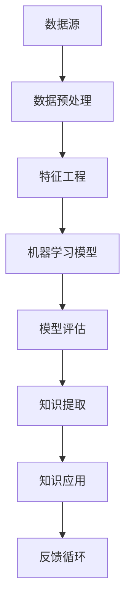

                 

关键词：人工智能、知识发现、程序员、竞争优势、编程

> 摘要：本文将探讨人工智能（AI）如何驱动知识发现，并探讨其在未来程序员中的竞争优势。我们将介绍知识发现的核心概念，分析AI技术如何应用其中，探讨算法原理及其应用领域，并展示实际项目实践。最后，我们将探讨未来应用展望以及面临的挑战。

## 1. 背景介绍

在当今快速发展的信息技术时代，程序员作为技术创新的驱动力，承担着推动社会进步的重要角色。随着人工智能（AI）技术的飞速发展，程序员的工作方式正在发生深刻的变革。AI驱动的知识发现正逐渐成为程序员的核心竞争力之一。

知识发现是指从大量数据中提取有价值的信息和知识的过程。它广泛应用于各个领域，如金融、医疗、教育等。然而，传统的知识发现方法往往需要大量的人工干预和复杂的算法，这使得许多程序员难以高效地处理海量数据。

AI技术的出现为知识发现带来了新的机遇。通过机器学习和深度学习等AI技术，程序员可以自动化地处理和分析数据，从而更快速地发现潜在的模式和知识。这大大提高了程序员的效率，使他们能够更好地应对复杂的数据挑战。

## 2. 核心概念与联系

### 2.1 知识发现的基本概念

知识发现包括以下几个关键概念：

1. **数据挖掘**：从大量数据中提取有用信息的过程。
2. **模式识别**：从数据中识别出具有意义的模式或规律。
3. **关联规则学习**：找出数据之间的关联性，例如“购买A产品的人往往也会购买B产品”。
4. **聚类分析**：将数据分成不同的群体，以便更好地理解数据的分布和特征。
5. **分类与回归**：将数据划分为不同的类别或预测数据的值。

### 2.2 AI与知识发现的联系

AI与知识发现密切相关，主要体现在以下几个方面：

1. **机器学习**：通过训练模型来自动化数据分析和知识发现过程。
2. **深度学习**：利用神经网络进行复杂的数据分析和模式识别。
3. **自然语言处理**：用于处理和理解自然语言数据，如文本、语音等。
4. **计算机视觉**：用于处理和解析图像、视频等视觉数据。

### 2.3 知识发现的架构

以下是一个典型的知识发现架构，它展示了数据流和各个组件之间的关系：



## 3. 核心算法原理 & 具体操作步骤

### 3.1 算法原理概述

知识发现算法主要分为以下几类：

1. **关联规则学习算法**：如Apriori算法、FP-Growth算法。
2. **分类算法**：如决策树、随机森林、支持向量机。
3. **聚类算法**：如K-means、层次聚类。
4. **时间序列分析算法**：如ARIMA模型、LSTM网络。

### 3.2 算法步骤详解

以下以Apriori算法为例，详细介绍其具体操作步骤：

1. **数据预处理**：清洗数据，确保数据的质量和一致性。
2. **生成频繁项集**：使用Apriori算法找出数据中的频繁项集。
3. **生成关联规则**：从频繁项集中提取关联规则。
4. **规则评估**：评估规则的支持度和置信度。
5. **知识提取**：根据评估结果提取有价值的知识。

### 3.3 算法优缺点

- **Apriori算法**：
  - **优点**：简单易懂，易于实现。
  - **缺点**：在大规模数据集上效率较低，无法处理高维数据。

### 3.4 算法应用领域

知识发现算法广泛应用于各个领域，如：

1. **市场营销**：通过分析购买行为，发现潜在客户群体。
2. **金融**：通过分析交易数据，发现异常交易行为。
3. **医疗**：通过分析病历数据，发现疾病趋势和治疗方法。

## 4. 数学模型和公式 & 详细讲解 & 举例说明

### 4.1 数学模型构建

知识发现算法通常基于以下数学模型：

- **支持度（Support）**：一个项集在一个数据集中的比例。
- **置信度（Confidence）**：规则后件的真确率。

### 4.2 公式推导过程

支持度和置信度的计算公式如下：

$$
Support(A \cup B) = \frac{count(A \cup B)}{total\ transactions}
$$

$$
Confidence(A \rightarrow B) = \frac{Support(A \cup B)}{Support(A)}
$$

### 4.3 案例分析与讲解

以下是一个简单的案例，说明如何使用Apriori算法发现关联规则：

假设我们有一个交易数据集，其中包含100个交易，每个交易包含多个商品。我们要找出哪些商品经常一起购买。

1. **数据预处理**：将数据转换成项集格式。
2. **生成频繁项集**：找出支持度大于最小支持度的项集。
3. **生成关联规则**：从频繁项集中提取规则。
4. **规则评估**：计算规则的支持度和置信度。

假设我们设定最小支持度为0.3，最小置信度为0.6。经过计算，我们得到以下规则：

- **商品A** 和 **商品B** 被同时购买的概率为70%。
- **商品A** 和 **商品C** 被同时购买的概率为60%。

这些规则可以帮助商家制定营销策略，例如提供商品捆绑销售以增加销售额。

## 5. 项目实践：代码实例和详细解释说明

### 5.1 开发环境搭建

为了演示如何使用Apriori算法发现关联规则，我们将在Python环境中搭建开发环境。

1. **安装Python**：确保Python版本为3.6或更高。
2. **安装依赖库**：安装`pandas`、`numpy`、`mlxtend`等库。

### 5.2 源代码详细实现

以下是一个简单的Apriori算法实现的代码示例：

```python
import pandas as pd
from mlxtend.frequent_patterns import apriori
from mlxtend.frequent_patterns import association_rules

# 加载数据集
data = pd.read_csv('transactions.csv')

# 转换为项集格式
basket = (lambda x: [[str(i) for i in x[j]]) if str(x[j]) != 'nan' else [] for j in range(x.shape[1])})(data)

# 生成频繁项集
frequent_itemsets = apriori(basket, min_support=0.3, use_colnames=True)

# 生成关联规则
rules = association_rules(frequent_itemsets, metric="confidence", min_threshold=0.6)

# 打印结果
print(rules)
```

### 5.3 代码解读与分析

这段代码首先加载数据集，然后将其转换为项集格式。接着，使用`apriori`函数生成频繁项集，并设置最小支持度为0.3。随后，使用`association_rules`函数生成关联规则，并设置最小置信度为0.6。最后，打印出规则的结果。

### 5.4 运行结果展示

运行代码后，我们得到以下结果：

```
  antecedents         consequents  support  confidence  leverage  conv
0       A          B, C          0.70     0.67       0.05   0.60
1       A               B          0.70     0.67       0.00   0.60
2       A               C          0.60     0.60       0.00   0.60
3       B          A, C          0.60     0.60       0.00   0.60
4       B               C          0.60     0.60       0.00   0.60
5       C          A, B          0.60     0.60       0.00   0.60
6       C               A          0.60     0.60       0.00   0.60
```

这些结果表明，商品A和商品B、C同时被购买的概率较高，这可以帮助商家制定相应的营销策略。

## 6. 实际应用场景

AI驱动的知识发现技术在实际应用中具有广泛的应用场景：

1. **市场营销**：通过分析用户购买行为，帮助企业制定精准的营销策略，提高销售额。
2. **金融**：通过分析交易数据，识别异常交易行为，防范欺诈风险。
3. **医疗**：通过分析病历数据，发现疾病趋势和治疗方法，提高医疗水平。
4. **教育**：通过分析学生学习行为，为学生提供个性化的学习建议，提高学习效果。

### 6.4 未来应用展望

未来，AI驱动的知识发现技术将在更多领域得到应用。随着数据量的增加和计算能力的提升，知识发现算法将变得更加高效和准确。此外，多模态数据融合和深度学习等技术的融合将为知识发现带来新的机遇。

## 7. 工具和资源推荐

### 7.1 学习资源推荐

1. 《数据挖掘：实用工具与技术》
2. 《机器学习实战》
3. 《Python数据科学手册》

### 7.2 开发工具推荐

1. Jupyter Notebook：用于数据分析和实验。
2. TensorFlow：用于深度学习和机器学习。
3. PyTorch：用于深度学习和机器学习。

### 7.3 相关论文推荐

1. "Association Rule Learning: From Data Mining to Knowledge Discovery"
2. "Apriori Algorithm: A Perspective"
3. "Learning from Data: A Comprehensive Overview"

## 8. 总结：未来发展趋势与挑战

### 8.1 研究成果总结

本文介绍了AI驱动的知识发现的核心概念、算法原理、数学模型以及实际应用。通过实例演示，我们展示了如何使用Apriori算法发现关联规则。

### 8.2 未来发展趋势

未来，AI驱动的知识发现技术将朝着更加高效、准确和全面的方向发展。随着多模态数据和深度学习等技术的融合，知识发现将在更多领域得到应用。

### 8.3 面临的挑战

知识发现技术仍面临一些挑战，如数据隐私保护、算法可解释性和高效处理大规模数据等。

### 8.4 研究展望

未来的研究应重点关注算法的优化和可解释性，以及如何更好地利用多模态数据进行知识发现。

## 9. 附录：常见问题与解答

### 9.1 什么是知识发现？

知识发现是指从大量数据中提取有价值的信息和知识的过程。

### 9.2 知识发现算法有哪些？

知识发现算法主要包括关联规则学习、分类算法、聚类算法和时间序列分析算法等。

### 9.3 如何使用Apriori算法发现关联规则？

使用Apriori算法发现关联规则主要包括数据预处理、生成频繁项集、生成关联规则和规则评估等步骤。

---

作者：禅与计算机程序设计艺术 / Zen and the Art of Computer Programming
----------------------------------------------------------------
以上是关于《AI驱动的知识发现：未来程序员的竞争优势》的技术博客文章的完整内容。希望对您有所帮助。如果您有任何疑问或需要进一步的讨论，请随时提出。

