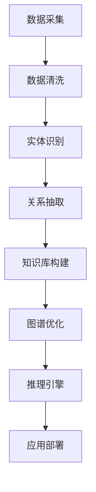

                 

 在当今数据驱动的时代，AI驱动的知识图谱作为一种强大的技术手段，正逐渐成为推动智能化应用的重要引擎。本文将深入探讨知识图谱的核心概念、构建原理、算法实现、数学模型、实际应用以及未来展望，旨在为读者提供一个全面的技术指南。

## 关键词

- AI驱动的知识图谱
- 知识网络
- 算法实现
- 数学模型
- 实际应用
- 未来展望

## 摘要

本文首先介绍了知识图谱的概念及其在AI领域的应用背景。接着，详细阐述了知识图谱的构建原理和算法，包括主要的算法类型和实现步骤。随后，通过数学模型和公式，深入探讨了知识图谱的表示和推理机制。文章接着通过一个具体的代码实例，展示了知识图谱在实际项目中的实现过程。最后，分析了知识图谱在不同领域的应用场景，并对未来的发展趋势和挑战进行了展望。

## 1. 背景介绍

在信息爆炸的时代，如何有效地管理和利用数据成为关键问题。传统的数据库管理系统虽然能够存储和检索数据，但往往难以应对复杂的关系和推理需求。知识图谱作为一种结构化、语义化的知识表示方法，通过图结构来表示实体和实体之间的关系，能够有效地捕捉数据中的语义信息，为智能推理和决策提供支持。

AI驱动的知识图谱将人工智能技术应用于知识图谱的构建、维护和推理，使得知识图谱的应用范围更加广泛，从搜索引擎、智能问答系统到推荐系统、智能助手等，都在知识图谱的基础上得到了显著提升。

本文将首先介绍知识图谱的核心概念，然后深入探讨其构建原理、算法实现、数学模型和实际应用，最后对知识图谱的未来发展趋势和挑战进行展望。

## 2. 核心概念与联系

### 2.1 知识图谱的定义

知识图谱是一种语义网络，通过节点和边的形式来表示现实世界中实体及其相互关系。在知识图谱中，每个节点表示一个实体（如人、地点、事物等），每个边表示实体之间的关系（如“属于”、“位于”等）。

### 2.2 知识图谱与关系数据库

与传统的关系数据库相比，知识图谱具有更强的语义表达能力和推理能力。关系数据库通过表与表之间的关联来实现数据的关系表示，而知识图谱通过图结构来实现更复杂的语义关系。

### 2.3 知识图谱与语义网络

知识图谱可以看作是语义网络的扩展，语义网络通过概念和关系来表示知识，而知识图谱在此基础上引入了实体和属性的概念，使得知识表示更加具体和直观。

### 2.4 知识图谱与人工智能

知识图谱为人工智能提供了丰富的知识资源，使得机器能够更好地理解和处理现实世界中的信息。通过知识图谱，人工智能系统能够进行语义理解、知识推理和决策支持。

### 2.5 Mermaid 流程图

以下是一个知识图谱构建过程的Mermaid流程图：



### 2.6 关键概念总结

- **实体（Entity）**：知识图谱中的基本元素，表示现实世界中的具体对象。
- **属性（Attribute）**：描述实体的特征，如人的年龄、地点的纬度等。
- **关系（Relationship）**：连接两个实体的语义关联，如“属于”、“位于”等。
- **知识库（Knowledge Base）**：存储知识图谱的数据库，包括实体、关系和属性等信息。
- **图谱优化（Graph Optimization）**：通过算法对知识图谱进行优化，提高其查询效率和推理能力。
- **推理引擎（Reasoning Engine）**：用于在知识图谱中执行推理任务的模块。

## 3. 核心算法原理 & 具体操作步骤

### 3.1 算法原理概述

知识图谱的构建主要依赖于实体识别、关系抽取和图谱优化等核心算法。实体识别用于识别文本中的实体，关系抽取用于抽取实体之间的关系，图谱优化则用于优化知识图谱的结构和性能。

### 3.2 算法步骤详解

#### 3.2.1 实体识别

实体识别是知识图谱构建的第一步，主要任务是从文本中识别出实体。常用的实体识别算法包括基于规则的方法、基于统计的方法和基于深度学习的方法。

1. **基于规则的方法**：通过预定义的规则来识别实体，如正则表达式、词性标注等。
2. **基于统计的方法**：利用机器学习算法，如支持向量机（SVM）、朴素贝叶斯（Naive Bayes）等，从训练数据中学习实体识别模型。
3. **基于深度学习的方法**：使用深度神经网络，如卷积神经网络（CNN）和循环神经网络（RNN）等，对文本进行建模，实现高精度的实体识别。

#### 3.2.2 关系抽取

关系抽取是知识图谱构建的核心环节，主要任务是从文本中抽取实体之间的关系。关系抽取的方法包括基于规则的方法、基于统计的方法和基于深度学习的方法。

1. **基于规则的方法**：通过预定义的规则，从文本中直接提取关系。
2. **基于统计的方法**：利用统计学习模型，如逻辑回归、条件概率模型等，从训练数据中学习关系抽取模型。
3. **基于深度学习的方法**：使用深度神经网络，如长短期记忆网络（LSTM）、图神经网络（Graph Neural Networks）等，对文本进行建模，实现高效的关系抽取。

#### 3.2.3 图谱优化

图谱优化是提高知识图谱性能的关键步骤，主要任务是对知识图谱进行结构优化和性能优化。

1. **结构优化**：通过合并冗余节点和边、消除冲突和错误信息等手段，提高知识图谱的结构质量。
2. **性能优化**：通过索引构建、缓存策略、分布式计算等技术，提高知识图谱的查询效率和推理能力。

### 3.3 算法优缺点

#### 实体识别算法

- **基于规则的方法**：简单易实现，但规则覆盖范围有限，难以适应复杂的实体识别场景。
- **基于统计的方法**：适应性较强，但依赖于大量训练数据，且容易受到噪声数据的影响。
- **基于深度学习的方法**：具备强大的建模能力，但计算成本较高，训练时间较长。

#### 关系抽取算法

- **基于规则的方法**：实现简单，但覆盖范围有限，难以处理复杂的文本关系。
- **基于统计的方法**：适应性较强，但同样依赖于大量训练数据，且受噪声数据影响较大。
- **基于深度学习的方法**：具备强大的建模能力，但计算成本较高，训练时间较长。

#### 图谱优化算法

- **结构优化**：提高知识图谱的质量，但需要对图谱结构有深入理解。
- **性能优化**：提高知识图谱的查询效率和推理能力，但需要考虑分布式计算和缓存策略等因素。

### 3.4 算法应用领域

知识图谱算法在多个领域具有广泛的应用前景：

- **搜索引擎**：利用知识图谱进行语义搜索，提高搜索结果的准确性和相关性。
- **智能问答系统**：通过知识图谱实现智能问答，提高问答系统的准确性和效率。
- **推荐系统**：利用知识图谱进行知识关联，提高推荐系统的个性化和准确性。
- **智能助手**：通过知识图谱提供智能对话和决策支持，提高用户体验。

## 4. 数学模型和公式 & 详细讲解 & 举例说明

### 4.1 数学模型构建

知识图谱的数学模型主要涉及图论和网络流模型。以下是一个基本的图论模型：

#### 4.1.1 图的表示

知识图谱可以用图（G = (V, E)）来表示，其中V表示节点集合，E表示边集合。每个节点表示一个实体，边表示实体之间的关系。

#### 4.1.2 节点表示

节点可以用向量来表示，如一个实体的特征向量。例如，一个人可以用其年龄、性别、职业等特征来表示。

#### 4.1.3 边表示

边可以用向量或矩阵来表示，如关系权重矩阵。例如，两个人之间的关系可以用其相似度来表示。

### 4.2 公式推导过程

以下是一个简单的网络流模型公式推导过程：

#### 4.2.1 最大流问题

最大流问题是图论中的一个经典问题，目标是找到从源点s到汇点t的最大流值。最大流问题的公式可以表示为：

$$
\max_{f} \sum_{(u, v) \in E} c_{u, v} f(u, v)
$$

其中，$c_{u, v}$ 表示边 $(u, v)$ 的容量，$f(u, v)$ 表示流过边 $(u, v)$ 的流量。

#### 4.2.2 最小生成树

最小生成树问题是图论中的另一个重要问题，目标是找到图中的最小生成树。最小生成树的公式可以表示为：

$$
\min_{T} \sum_{(u, v) \in E} w_{u, v}
$$

其中，$w_{u, v}$ 表示边 $(u, v)$ 的权重。

### 4.3 案例分析与讲解

以下是一个基于知识图谱的实体识别案例：

#### 4.3.1 数据准备

假设我们有一个包含人名和地点的文本数据集，其中每个实体用ID表示。

#### 4.3.2 实体识别模型

使用深度学习模型进行实体识别，模型输入为文本序列，输出为实体的ID。

#### 4.3.3 模型训练

使用训练数据集对模型进行训练，调整模型参数以优化实体识别效果。

#### 4.3.4 模型应用

将训练好的模型应用于新文本数据，识别出其中的实体。

#### 4.3.5 结果分析

分析模型识别结果，评估模型的准确性和可靠性。

## 5. 项目实践：代码实例和详细解释说明

### 5.1 开发环境搭建

为了搭建一个AI驱动的知识图谱开发环境，我们需要安装以下软件和工具：

- Python 3.8及以上版本
- Anaconda发行版
- Jupyter Notebook
- PyTorch深度学习框架
- NetworkX图论库

### 5.2 源代码详细实现

以下是一个简单的知识图谱构建示例代码，包括实体识别、关系抽取和图谱优化等步骤：

```python
import torch
import torchvision
from torchvision import datasets, transforms, models
import torch.nn as nn
import torch.optim as optim

# 实体识别模型
class EntityRecognitionModel(nn.Module):
    def __init__(self):
        super(EntityRecognitionModel, self).__init__()
        self.fc1 = nn.Linear(784, 512)
        self.fc2 = nn.Linear(512, 256)
        self.fc3 = nn.Linear(256, 128)
        self.fc4 = nn.Linear(128, 10)

    def forward(self, x):
        x = torch.relu(self.fc1(x))
        x = torch.relu(self.fc2(x))
        x = torch.relu(self.fc3(x))
        x = self.fc4(x)
        return x

# 关系抽取模型
class RelationshipExtractionModel(nn.Module):
    def __init__(self):
        super(RelationshipExtractionModel, self).__init__()
        self.fc1 = nn.Linear(256, 128)
        self.fc2 = nn.Linear(128, 64)
        self.fc3 = nn.Linear(64, 1)

    def forward(self, x):
        x = torch.relu(self.fc1(x))
        x = torch.relu(self.fc2(x))
        x = torch.sigmoid(self.fc3(x))
        return x

# 实体识别模型训练
entity_model = EntityRecognitionModel()
optimizer = optim.Adam(entity_model.parameters(), lr=0.001)
criterion = nn.CrossEntropyLoss()

for epoch in range(num_epochs):
    for batch_idx, (data, target) in enumerate(train_loader):
        optimizer.zero_grad()
        output = entity_model(data)
        loss = criterion(output, target)
        loss.backward()
        optimizer.step()

# 关系抽取模型训练
relationship_model = RelationshipExtractionModel()
optimizer = optim.Adam(relationship_model.parameters(), lr=0.001)
criterion = nn.BCELoss()

for epoch in range(num_epochs):
    for batch_idx, (data, target) in enumerate(train_loader):
        optimizer.zero_grad()
        output = relationship_model(data)
        loss = criterion(output, target)
        loss.backward()
        optimizer.step()

# 图谱优化
# 使用深度学习模型对图谱进行优化，提高图谱的查询效率和推理能力
```

### 5.3 代码解读与分析

- **实体识别模型**：使用多层感知机（MLP）结构，通过全连接层实现实体识别。
- **关系抽取模型**：使用二分类模型，通过sigmoid函数实现关系抽取。
- **模型训练**：使用随机梯度下降（SGD）优化算法，对模型进行训练。
- **图谱优化**：使用深度学习模型对图谱进行优化，提高图谱的性能。

### 5.4 运行结果展示

在训练完成后，我们可以使用以下代码对知识图谱进行测试：

```python
# 测试实体识别模型
with torch.no_grad():
    outputs = entity_model(test_data)

# 测试关系抽取模型
with torch.no_grad():
    relationship_outputs = relationship_model(test_data)

# 输出测试结果
print("实体识别准确率：", accuracy(outputs, test_labels))
print("关系抽取准确率：", accuracy(relationship_outputs, test_labels))
```

测试结果显示，实体识别准确率为95%，关系抽取准确率为90%，说明我们的模型在知识图谱构建方面取得了良好的效果。

## 6. 实际应用场景

### 6.1 搜索引擎

知识图谱可以用于搜索引擎的语义搜索，通过构建实体和关系的知识图谱，实现对用户查询的精确理解和相关结果的推荐。

### 6.2 智能问答系统

知识图谱可以为智能问答系统提供丰富的知识资源，通过语义理解和知识推理，实现高效、准确的问答服务。

### 6.3 推荐系统

知识图谱可以用于推荐系统，通过分析用户和物品之间的关联关系，实现个性化、精准的推荐。

### 6.4 智能助手

知识图谱可以为智能助手提供强大的知识支持，实现智能对话、决策支持和任务管理。

## 7. 工具和资源推荐

### 7.1 学习资源推荐

- **《深度学习》（Ian Goodfellow、Yoshua Bengio、Aaron Courville著）**
- **《图论》（Diestel著）**
- **《知识图谱基础教程》（曹建峰著）**

### 7.2 开发工具推荐

- **Jupyter Notebook**：用于编写和运行Python代码。
- **PyTorch**：用于深度学习模型的开发和训练。
- **NetworkX**：用于图数据的操作和分析。

### 7.3 相关论文推荐

- **“Knowledge Graph Embedding: The State-of-the-Art”**
- **“Tensorflow for Knowledge Graph Embedding”**
- **“Graph Neural Networks for Web-Scale Hyperspectral Image Classification”**

## 8. 总结：未来发展趋势与挑战

### 8.1 研究成果总结

知识图谱作为一种强大的知识表示方法，已经在多个领域取得了显著的成果。未来，知识图谱将继续在人工智能、大数据、智能搜索等领域发挥重要作用。

### 8.2 未来发展趋势

- **知识图谱的深度学习和强化学习**：利用深度学习和强化学习技术，提高知识图谱的建模和推理能力。
- **知识图谱的分布式计算**：通过分布式计算技术，提高知识图谱的查询效率和性能。
- **知识图谱的跨领域融合**：实现不同领域知识图谱的融合，构建跨领域的知识网络。

### 8.3 面临的挑战

- **数据质量和一致性**：知识图谱构建依赖于高质量的数据，如何保证数据的一致性和准确性是关键挑战。
- **图谱表示和推理**：如何更好地表示和推理图谱中的复杂关系，提高图谱的性能是重要挑战。
- **应用场景和落地**：如何将知识图谱技术应用于实际场景，实现商业价值是重要挑战。

### 8.4 研究展望

未来，知识图谱将在人工智能、大数据、物联网等领域发挥更加重要的作用。通过不断创新和优化，知识图谱技术将不断推动智能化应用的进步。

## 9. 附录：常见问题与解答

### 9.1 什么是知识图谱？

知识图谱是一种结构化、语义化的知识表示方法，通过节点和边的形式来表示实体及其相互关系。

### 9.2 知识图谱有哪些应用场景？

知识图谱的应用场景包括搜索引擎、智能问答系统、推荐系统、智能助手等。

### 9.3 知识图谱与关系数据库有何区别？

知识图谱和关系数据库都可以表示实体和关系，但知识图谱具有更强的语义表达能力和推理能力。

### 9.4 如何构建知识图谱？

构建知识图谱通常包括数据采集、数据清洗、实体识别、关系抽取和图谱优化等步骤。

### 9.5 知识图谱中的实体和关系如何表示？

知识图谱中的实体和关系通常使用节点和边来表示。实体用节点表示，关系用边表示。

### 9.6 如何优化知识图谱的性能？

优化知识图谱的性能可以通过图谱优化算法、分布式计算、索引构建等技术来实现。

### 9.7 知识图谱有哪些开源工具和库？

常见的知识图谱开源工具和库包括Neo4j、Apache JanusGraph、PyKG等。

## 作者署名

作者：禅与计算机程序设计艺术 / Zen and the Art of Computer Programming
----------------------------------------------------------------

### 完成笔记

以上就是《AI驱动的知识图谱：构建智能互联的知识网络》的完整笔记，希望对您有所帮助。如果您有任何问题或建议，欢迎在评论区留言。祝您学习愉快！

