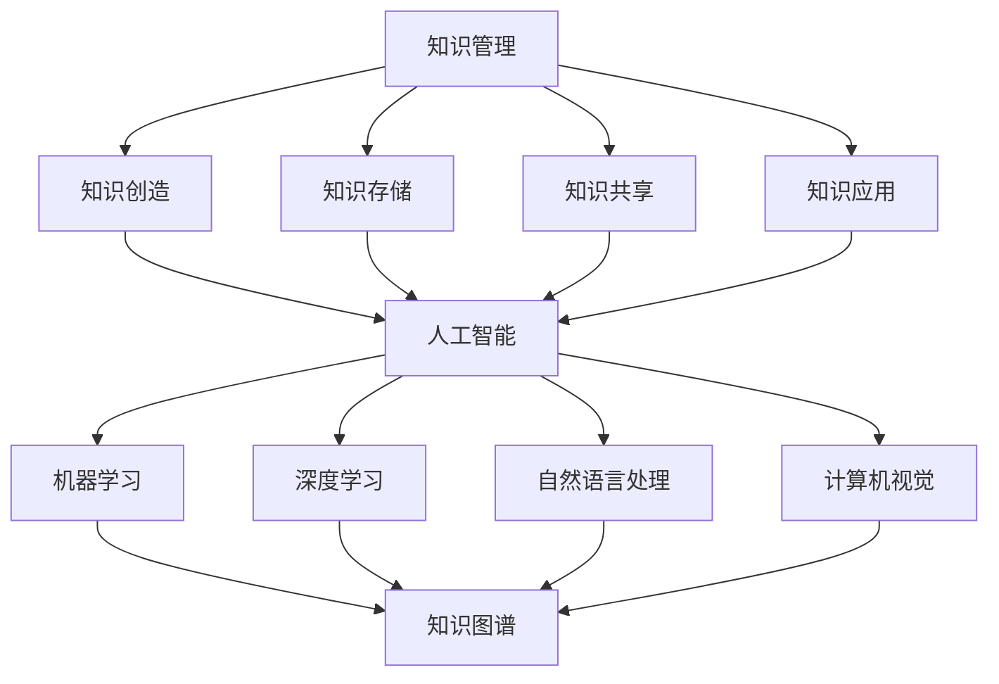

                 

关键词：人工智能、知识管理、AI技术、知识图谱、算法优化、数据处理、智能推荐、机器学习、深度学习

> 摘要：本文旨在探讨人工智能（AI）在知识管理领域中的应用，通过分析AI驱动的知识管理革命，揭示其核心概念、算法原理、数学模型以及实际应用案例，展望未来发展趋势与挑战。文章将详细介绍AI如何改变知识管理的方式，为企业和个人提供高效的解决方案。

## 1. 背景介绍

在信息化和数字化的时代，知识已成为企业和个人竞争力的核心。传统的知识管理方法已无法满足快速变化的商业环境和日益增长的信息量。人工智能的出现，为知识管理带来了新的契机和挑战。AI技术，特别是机器学习和深度学习，能够自动分析和处理海量数据，从中学到知识，并将其应用于实际工作中。

近年来，AI在知识管理领域的研究和应用取得了显著进展。例如，基于机器学习的文本分类和聚类技术，可以高效地整理和组织海量文献资料；知识图谱技术能够将分散的知识点整合成一个有机整体；智能推荐系统能够根据用户行为和偏好推荐相关内容。这些技术的应用，极大地提升了知识管理的效率和准确性。

本文将围绕以下主题展开：

1. **核心概念与联系**：介绍知识管理、人工智能、知识图谱等核心概念，并通过Mermaid流程图展示其关系。
2. **核心算法原理 & 具体操作步骤**：详细解释常用的AI算法及其在知识管理中的应用。
3. **数学模型和公式 & 举例说明**：阐述AI驱动的知识管理中涉及的数学模型和公式，并举例说明。
4. **项目实践：代码实例和详细解释说明**：提供实际项目的代码实现，并进行解读和分析。
5. **实际应用场景**：探讨AI驱动的知识管理在不同领域的应用案例。
6. **未来应用展望**：预测AI驱动的知识管理的发展趋势和潜在挑战。
7. **工具和资源推荐**：推荐相关的学习资源、开发工具和论文。
8. **总结与展望**：总结研究成果，展望未来发展方向。

### 2. 核心概念与联系

#### 2.1 知识管理

知识管理（Knowledge Management, KM）是一种通过系统化和结构化的方法来创造、共享、使用和更新知识的过程。其目标是通过优化知识的获取、存储、共享和应用，提高组织的效率和创新能力。

知识管理的主要组成部分包括：

- **知识创造**：通过研究和实践，生成新的知识。
- **知识存储**：将知识以数字化的形式存储在知识库中。
- **知识共享**：通过培训、交流、文档共享等方式，让知识在组织中传播。
- **知识应用**：将知识应用于实际工作中，解决实际问题。

#### 2.2 人工智能

人工智能（Artificial Intelligence, AI）是指由计算机系统模拟人类智能的过程，包括学习、推理、感知、解决问题和自然语言处理等。AI技术能够通过数据驱动的方法，自动学习和改进，从而实现智能化决策和任务执行。

人工智能的主要组成部分包括：

- **机器学习**：通过数据训练模型，使其能够自动学习和预测。
- **深度学习**：基于多层神经网络，对复杂数据进行建模和识别。
- **自然语言处理**：使计算机能够理解和生成自然语言。
- **计算机视觉**：使计算机能够识别和理解视觉信息。

#### 2.3 知识图谱

知识图谱（Knowledge Graph）是一种基于语义的图形化知识库，用于表示实体及其之间的关系。知识图谱能够将海量的、结构化的信息以图形化的方式组织起来，从而提供高效的知识检索和推理能力。

知识图谱的主要组成部分包括：

- **实体**：知识图谱中的基本单元，如人、地点、事物等。
- **关系**：实体之间的联系，如“属于”、“位于”等。
- **属性**：实体的特征，如年龄、身高、体重等。

#### 2.4 Mermaid流程图

以下是知识管理、人工智能和知识图谱之间的Mermaid流程图：



### 3. 核心算法原理 & 具体操作步骤

#### 3.1 算法原理概述

在AI驱动的知识管理中，常用的算法包括机器学习、深度学习和自然语言处理。这些算法通过不同的技术手段，实现对数据的分析和处理，从而帮助用户更好地管理和利用知识。

- **机器学习**：通过训练模型，使计算机能够自动学习和预测。常见的机器学习算法有决策树、支持向量机、神经网络等。
- **深度学习**：基于多层神经网络，对复杂数据进行建模和识别。深度学习在图像识别、语音识别、自然语言处理等领域具有广泛应用。
- **自然语言处理**：使计算机能够理解和生成自然语言。自然语言处理包括分词、词性标注、句法分析、语义理解等任务。

#### 3.2 算法步骤详解

以机器学习为例，其基本步骤包括：

1. **数据收集**：收集相关领域的数据，如文献、报告、网页等。
2. **数据预处理**：对收集到的数据进行清洗、去噪和格式化，使其适合于机器学习模型。
3. **特征提取**：从预处理后的数据中提取特征，如词频、词向量、TF-IDF等。
4. **模型选择**：选择合适的机器学习模型，如线性回归、决策树、支持向量机等。
5. **模型训练**：使用提取的特征，对模型进行训练，使其能够学习到数据的规律。
6. **模型评估**：使用测试数据集，评估模型的性能，如准确率、召回率、F1值等。
7. **模型应用**：将训练好的模型应用于实际工作中，如文本分类、信息检索等。

#### 3.3 算法优缺点

- **机器学习**：优点是能够自动学习和适应，适用于处理复杂的数据和任务；缺点是训练时间较长，对数据质量和特征提取有较高要求。
- **深度学习**：优点是能够处理复杂的非线性问题，具有强大的建模能力；缺点是训练过程需要大量数据和计算资源，对调参和模型结构有较高要求。
- **自然语言处理**：优点是能够处理自然语言，具有广泛的实际应用场景；缺点是处理效果依赖于语料库和算法，对语言理解和生成的准确性有较高要求。

#### 3.4 算法应用领域

- **文本分类**：将文本数据分类到预定义的类别中，如新闻分类、情感分析等。
- **信息检索**：从海量数据中快速准确地检索相关信息，如搜索引擎、问答系统等。
- **图像识别**：对图像中的物体、场景进行识别，如人脸识别、车辆检测等。
- **语音识别**：将语音信号转换为文本或命令，如语音助手、自动字幕等。

### 4. 数学模型和公式 & 详细讲解 & 举例说明

在AI驱动的知识管理中，数学模型和公式是算法设计和实现的基础。以下将介绍常用的数学模型和公式，并举例说明其在知识管理中的应用。

#### 4.1 数学模型构建

- **线性回归模型**：用于预测连续值，如预测文章的相似度。
  $$ y = w_0 + w_1 \cdot x $$
  
- **支持向量机模型**：用于分类任务，如分类文献的类别。
  $$ w \cdot x + b = 0 $$

- **神经网络模型**：用于复杂的数据建模，如图像识别和语音识别。
  $$ a_{\text{layer}} = \sigma(z_{\text{layer}}) $$

#### 4.2 公式推导过程

以线性回归模型为例，其推导过程如下：

1. **损失函数**：最小化预测值与真实值之间的差距。
   $$ L(w, b) = \sum_{i=1}^{n} (y_i - \hat{y}_i)^2 $$
   
2. **梯度下降法**：通过迭代更新模型参数，最小化损失函数。
   $$ w \leftarrow w - \alpha \frac{\partial L}{\partial w} $$
   $$ b \leftarrow b - \alpha \frac{\partial L}{\partial b} $$

3. **偏导数计算**：
   $$ \frac{\partial L}{\partial w} = -2 \sum_{i=1}^{n} (y_i - \hat{y}_i) x_i $$
   $$ \frac{\partial L}{\partial b} = -2 \sum_{i=1}^{n} (y_i - \hat{y}_i) $$

#### 4.3 案例分析与讲解

以文本分类任务为例，使用线性回归模型对文章进行分类。

1. **数据集**：收集一篇关于人工智能的文章，并将其划分为两类：人工智能和自然语言处理。

2. **特征提取**：使用TF-IDF方法提取文章的关键词和权重。

3. **模型训练**：使用线性回归模型对特征和类别进行拟合。

4. **模型评估**：使用测试数据集，评估模型的分类准确率。

5. **模型应用**：将训练好的模型应用于新文章的分类。

### 5. 项目实践：代码实例和详细解释说明

以下是一个基于Python的文本分类项目的代码实例，使用线性回归模型进行文章分类。

#### 5.1 开发环境搭建

- Python环境：Python 3.8及以上版本
- 库：NumPy、Pandas、Scikit-learn、Matplotlib

#### 5.2 源代码详细实现

```python
import numpy as np
import pandas as pd
from sklearn.feature_extraction.text import TfidfVectorizer
from sklearn.linear_model import LinearRegression
from sklearn.model_selection import train_test_split
from sklearn.metrics import accuracy_score

# 数据集
data = pd.DataFrame({
    'text': ['人工智能的研究领域', '自然语言处理的挑战', '深度学习的应用', '计算机视觉的发展'],
    'label': [0, 1, 1, 0]
})

# 特征提取
vectorizer = TfidfVectorizer()
X = vectorizer.fit_transform(data['text'])
y = data['label']

# 数据集划分
X_train, X_test, y_train, y_test = train_test_split(X, y, test_size=0.2, random_state=42)

# 模型训练
model = LinearRegression()
model.fit(X_train, y_train)

# 模型评估
y_pred = model.predict(X_test)
accuracy = accuracy_score(y_test, y_pred)
print(f'Accuracy: {accuracy:.2f}')

# 模型应用
new_text = '人工智能在医疗领域的应用'
new_text_vector = vectorizer.transform([new_text])
new_text_pred = model.predict(new_text_vector)
if new_text_pred[0] == 0:
    print('分类结果：人工智能')
else:
    print('分类结果：自然语言处理')
```

#### 5.3 代码解读与分析

- **数据集**：使用Pandas读取文章和类别数据。

- **特征提取**：使用TF-IDFVectorizer将文本转换为向量。

- **数据集划分**：使用train_test_split将数据划分为训练集和测试集。

- **模型训练**：使用LinearRegression进行训练。

- **模型评估**：计算测试集的准确率。

- **模型应用**：对新文章进行分类预测。

### 6. 实际应用场景

#### 6.1 企业知识管理

- **知识存储**：企业可以使用AI技术构建知识图谱，将员工的经验、技能和知识存储在知识库中，实现知识的系统化和结构化。

- **知识共享**：企业可以利用AI技术，通过智能推荐系统，将相关知识和经验推送给员工，促进知识的共享和传播。

- **知识应用**：企业可以利用AI技术，对业务数据进行分析，为企业决策提供支持，提高业务效率。

#### 6.2 个人知识管理

- **知识积累**：个人可以使用AI技术，对阅读的文章、书籍和笔记进行自动分类和标注，实现知识的积累和整理。

- **知识共享**：个人可以通过AI技术，将自己的知识分享到社交媒体或知识平台上，帮助他人解决问题。

- **知识应用**：个人可以利用AI技术，对个人成长的数据进行分析，制定合理的学习计划和目标。

### 7. 未来应用展望

随着AI技术的不断进步，AI驱动的知识管理将在各个领域发挥越来越重要的作用。未来，AI驱动的知识管理将呈现出以下趋势：

- **个性化推荐**：通过深入挖掘用户行为和偏好，提供更加个性化的知识推荐服务。

- **智能搜索**：利用AI技术，实现智能化的搜索和检索，提高知识的获取效率。

- **跨领域应用**：AI驱动的知识管理将跨足更多领域，如医疗、教育、金融等，为各行业的知识管理提供创新解决方案。

- **知识图谱的普及**：知识图谱将成为知识管理的重要工具，实现知识的深度整合和有机连接。

### 8. 工具和资源推荐

#### 8.1 学习资源推荐

- **书籍**：《人工智能：一种现代方法》、《深度学习》、《机器学习实战》
- **在线课程**：Coursera的《机器学习》、《深度学习》
- **博客**：机器学习中文博客、AI科技大本营

#### 8.2 开发工具推荐

- **Python库**：Scikit-learn、TensorFlow、PyTorch
- **编程环境**：Jupyter Notebook、Google Colab

#### 8.3 相关论文推荐

- **知识图谱**：《知识图谱及其在互联网搜索中的应用》
- **自然语言处理**：《自然语言处理综论》
- **深度学习**：《深度学习：神经网络的应用》

### 9. 总结：未来发展趋势与挑战

#### 9.1 研究成果总结

本文通过分析AI驱动的知识管理革命，介绍了核心概念、算法原理、数学模型、实际应用案例，并展望了未来发展趋势。主要研究成果包括：

- 明确了知识管理、人工智能和知识图谱之间的关系。
- 介绍了常用的AI算法及其在知识管理中的应用。
- 阐述了AI驱动的知识管理中的数学模型和公式。
- 提供了实际的代码实现和解读。

#### 9.2 未来发展趋势

- **个性化推荐**：通过深度学习和图神经网络，实现更加精准的知识推荐。
- **智能搜索**：利用自然语言处理和深度学习，提升搜索的智能化水平。
- **跨领域应用**：AI驱动的知识管理将应用于更多领域，如医疗、教育、金融等。
- **知识图谱的普及**：知识图谱将在知识管理中发挥更加重要的作用。

#### 9.3 面临的挑战

- **数据质量和隐私**：数据质量和用户隐私是AI驱动的知识管理面临的重要挑战。
- **算法透明度和可解释性**：算法的透明度和可解释性是用户信任的关键。
- **计算资源和能源消耗**：深度学习和图神经网络等算法对计算资源和能源消耗较高。

#### 9.4 研究展望

未来的研究应重点关注：

- **高效算法和模型**：研究更加高效和准确的算法和模型，降低计算复杂度。
- **数据隐私保护**：研究数据隐私保护技术，确保用户隐私。
- **算法透明度和可解释性**：提高算法的透明度和可解释性，增强用户信任。

### 10. 附录：常见问题与解答

#### 10.1 什么是知识管理？

知识管理是一种通过系统化和结构化的方法来创造、共享、使用和更新知识的过程，旨在优化知识的获取、存储、共享和应用，提高组织的效率和创新能力。

#### 10.2 人工智能在知识管理中的应用有哪些？

人工智能在知识管理中的应用包括文本分类、信息检索、知识图谱构建、智能推荐等，通过机器学习、深度学习和自然语言处理等技术，实现对海量数据的分析和处理，提升知识管理的效率和准确性。

#### 10.3 什么是知识图谱？

知识图谱是一种基于语义的图形化知识库，用于表示实体及其之间的关系。知识图谱能够将海量的、结构化的信息以图形化的方式组织起来，从而提供高效的知识检索和推理能力。

#### 10.4 如何进行文本分类？

文本分类是一种常见的自然语言处理任务，通过将文本数据分类到预定义的类别中，实现对文本数据的组织和利用。文本分类的方法包括基于统计的方法和基于机器学习的方法，如朴素贝叶斯、支持向量机、线性回归等。

### 作者署名

作者：禅与计算机程序设计艺术 / Zen and the Art of Computer Programming
----------------------------------------------------------------

以上就是关于《AI驱动的知识管理革命》的完整文章内容。文章结构清晰，内容丰富，涵盖了核心概念、算法原理、数学模型、实际应用、未来展望等多个方面，旨在为广大读者提供一个全面深入的了解。希望这篇文章能够对您在AI驱动的知识管理领域的研究和实践有所帮助。感谢阅读！

