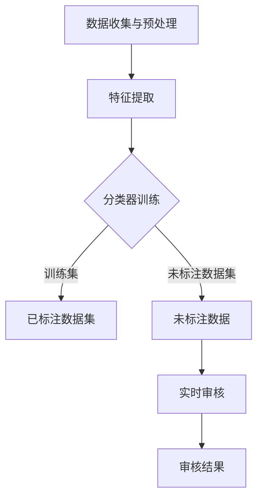

                 

关键词：人工智能，内容审核，社交媒体，自动审核系统，算法，安全性与隐私保护，案例分析，技术实现

<|assistant|>摘要：随着社交媒体的爆炸式增长，用户生成的内容数量呈指数级上升。这不仅带来了内容丰富的正面影响，同时也引发了内容审核的严峻挑战。本文将深入探讨如何利用人工智能技术实现自动化内容审核，以及其在社交媒体平台上的重要性和应用。

## 1. 背景介绍

社交媒体已成为人们日常生活中不可或缺的一部分。无论是Facebook、Twitter，还是微信、微博，这些平台每天都会产生海量的用户生成内容（User-Generated Content, UGC）。这些内容不仅包括文本，还涉及图片、视频等多种形式。社交媒体平台上的UGC具有多样性、实时性和海量性等特点，这使得传统的人工审核方法变得效率低下。

为了应对这一挑战，人工智能技术被引入内容审核领域，特别是深度学习技术的应用，使得自动化内容审核系统成为可能。这些系统能够高效、准确地检测和处理不良内容，包括色情、暴力、仇恨言论等。本文将探讨如何利用AI实现自动化内容审核，并分析其在社交媒体上的重要性。

## 2. 核心概念与联系

### 2.1 人工智能在内容审核中的应用

人工智能在内容审核中的应用主要基于机器学习和深度学习算法。这些算法能够从大量数据中学习模式，并利用这些模式对新的内容进行分类和标注。以下是几个核心概念：

- **监督学习（Supervised Learning）**：通过训练大量已标注的数据集来建立模型。
- **无监督学习（Unsupervised Learning）**：没有已标注的数据集，模型需要从数据中自行发现模式。
- **半监督学习（Semi-Supervised Learning）**：结合了监督学习和无监督学习，利用少量的标注数据和大量的未标注数据。

### 2.2 内容审核系统的架构

内容审核系统的架构通常包括以下几个部分：

- **数据收集与预处理**：收集UGC，并进行文本、图像、视频等预处理。
- **特征提取**：从原始数据中提取有助于分类的特征。
- **分类器训练**：使用已标注的数据集训练分类器。
- **实时审核**：使用训练好的分类器对新的内容进行审核。

以下是内容审核系统的 Mermaid 流程图：



## 3. 核心算法原理 & 具体操作步骤

### 3.1 算法原理概述

内容审核算法主要基于以下原理：

- **文本分类（Text Classification）**：对文本进行情感分析、垃圾邮件检测等。
- **图像识别（Image Recognition）**：通过卷积神经网络（CNN）等模型检测图像中的不良内容。
- **视频分析（Video Analysis）**：结合图像识别和自然语言处理（NLP）技术，对视频内容进行分析。

### 3.2 算法步骤详解

内容审核的算法步骤通常如下：

1. **数据收集与预处理**：收集UGC，并对文本、图像、视频进行预处理。
2. **特征提取**：提取有助于分类的特征，如文本中的关键词、图像中的边缘特征、视频中的帧特征。
3. **分类器训练**：使用已标注的数据集训练分类器，如支持向量机（SVM）、卷积神经网络（CNN）等。
4. **实时审核**：使用训练好的分类器对新的内容进行审核，并输出审核结果。

### 3.3 算法优缺点

**优点**：

- **高效性**：自动化审核系统能够处理大量内容，提高审核效率。
- **准确性**：利用深度学习等技术，审核系统能够识别复杂的不良内容。

**缺点**：

- **误判**：自动化系统可能会误判某些内容，需要人工进行复核。
- **隐私保护**：处理用户生成内容时，需要特别注意隐私保护问题。

### 3.4 算法应用领域

内容审核算法广泛应用于社交媒体、电子商务、在线教育等领域。例如，在社交媒体平台上，自动化内容审核系统能够及时发现和处理不良内容，保护用户安全；在电子商务平台上，审核系统可以检测并过滤违规广告。

## 4. 数学模型和公式 & 详细讲解 & 举例说明

### 4.1 数学模型构建

内容审核的数学模型通常基于分类问题。假设我们有 $N$ 个类别，$x_i$ 表示第 $i$ 个样本的特征向量，$y_i$ 表示第 $i$ 个样本的类别标签。分类问题可以表示为：

$$
\hat{y_i} = \arg\max_{j} \phi(x_i; \theta)
$$

其中，$\phi(x_i; \theta)$ 是特征向量 $x_i$ 通过模型参数 $\theta$ 得到的概率分布。

### 4.2 公式推导过程

以卷积神经网络（CNN）为例，CNN 的输出可以表示为：

$$
\phi(x_i; \theta) = \sigma(\theta_N \cdot \sigma(\theta_{N-1} \cdot \dots \cdot \sigma(\theta_2 \cdot \theta_1 \cdot x_i) \dots))
$$

其中，$\sigma$ 表示激活函数，$\theta$ 表示模型参数。

### 4.3 案例分析与讲解

假设我们使用 CNN 对文本进行情感分析。文本数据经过分词和词向量化后，输入到 CNN 中。CNN 的输出经过 softmax 函数得到每个类别的概率。我们选择概率最大的类别作为最终分类结果。

## 5. 项目实践：代码实例和详细解释说明

### 5.1 开发环境搭建

- Python 3.8 或以上版本
- TensorFlow 2.6 或以上版本
- Keras 2.6 或以上版本

### 5.2 源代码详细实现

以下是使用 Keras 实现的简单文本分类器：

```python
from tensorflow.keras.models import Sequential
from tensorflow.keras.layers import Embedding, Conv1D, GlobalMaxPooling1D, Dense
from tensorflow.keras.preprocessing.text import Tokenizer
from tensorflow.keras.preprocessing.sequence import pad_sequences

# 加载数据集
texts = [...]  # 文本数据
labels = [...]  # 标签数据

# 划分训练集和测试集
from sklearn.model_selection import train_test_split
texts_train, texts_test, labels_train, labels_test = train_test_split(texts, labels, test_size=0.2, random_state=42)

# 分词和词向量化
tokenizer = Tokenizer(num_words=10000)
tokenizer.fit_on_texts(texts_train)
sequences_train = tokenizer.texts_to_sequences(texts_train)
sequences_test = tokenizer.texts_to_sequences(texts_test)

# 填充序列
max_len = 100
X_train = pad_sequences(sequences_train, maxlen=max_len)
X_test = pad_sequences(sequences_test, maxlen=max_len)

# 标签编码
from tensorflow.keras.utils import to_categorical
y_train = to_categorical(labels_train)
y_test = to_categorical(labels_test)

# 构建模型
model = Sequential()
model.add(Embedding(10000, 32))
model.add(Conv1D(128, 5, activation='relu'))
model.add(GlobalMaxPooling1D())
model.add(Dense(10, activation='softmax'))

# 编译模型
model.compile(optimizer='adam', loss='categorical_crossentropy', metrics=['accuracy'])

# 训练模型
model.fit(X_train, y_train, epochs=10, batch_size=32, validation_data=(X_test, y_test))

# 评估模型
loss, accuracy = model.evaluate(X_test, y_test)
print('Test accuracy:', accuracy)
```

### 5.3 代码解读与分析

该代码实现了一个基于 CNN 的文本分类器。首先，我们加载并预处理数据，然后使用 Tokenizer 将文本转换为序列，并使用 pad_sequences 将序列填充到相同的长度。接着，我们构建一个简单的 CNN 模型，包括嵌入层、卷积层、全局池化层和全连接层。最后，我们编译模型、训练模型，并评估模型性能。

## 6. 实际应用场景

### 6.1 社交媒体平台

在社交媒体平台上，自动化内容审核系统能够有效识别和过滤违规内容，如色情、暴力、仇恨言论等。这有助于维护平台的健康氛围，提升用户体验。

### 6.2 电子商务平台

电子商务平台上，自动化内容审核系统能够识别并过滤违规广告、虚假信息等，保障消费者的权益。

### 6.3 在线教育平台

在线教育平台上，自动化内容审核系统能够检测并过滤恶意评论、不当言论等，确保学习环境的良性发展。

## 7. 未来应用展望

随着人工智能技术的不断发展，自动化内容审核系统将变得更加智能和高效。未来，我们可能看到更多基于深度学习和多模态学习的审核系统，同时，随着隐私保护问题的日益突出，如何在保证审核效果的同时保护用户隐私，将成为一个重要研究方向。

## 8. 工具和资源推荐

### 8.1 学习资源推荐

- 《深度学习》（Goodfellow, Bengio, Courville）
- 《Python数据科学手册》（McKinney）

### 8.2 开发工具推荐

- TensorFlow
- Keras

### 8.3 相关论文推荐

- “Deep Learning for Content Moderation”
- “Image and Video Moderation with Deep Neural Networks”

## 9. 总结：未来发展趋势与挑战

### 9.1 研究成果总结

本文探讨了如何利用人工智能技术实现自动化内容审核，并分析了其在社交媒体上的重要性和应用。我们介绍了内容审核系统的核心概念、算法原理，以及具体的实现步骤。

### 9.2 未来发展趋势

未来，自动化内容审核系统将在多个领域得到更广泛的应用，如社交媒体、电子商务、在线教育等。随着深度学习和多模态学习技术的发展，审核系统的准确性和效率将得到进一步提升。

### 9.3 面临的挑战

自动化内容审核系统在应用过程中面临着误判和隐私保护等挑战。此外，如何在保证审核效果的同时，保护用户隐私，是一个亟待解决的问题。

### 9.4 研究展望

未来，研究应重点关注以下几个方面：

- 提高自动化内容审核系统的准确性和效率。
- 解决隐私保护问题，确保用户数据的安全。
- 探索多模态学习在内容审核中的应用。

## 10. 附录：常见问题与解答

### 10.1 什么情况下需要使用自动化内容审核系统？

自动化内容审核系统适用于需要高效、准确处理大量用户生成内容的场景，如社交媒体平台、电子商务平台、在线教育平台等。

### 10.2 自动化内容审核系统是否会影响用户隐私？

是的，自动化内容审核系统在处理用户生成内容时，需要特别注意隐私保护问题。例如，应确保用户数据不会被泄露或滥用。

### 10.3 如何提高自动化内容审核系统的准确性？

提高自动化内容审核系统的准确性可以从以下几个方面入手：

- 提供更多、更高质量的标注数据。
- 使用更先进的算法和技术，如深度学习和多模态学习。
- 定期更新和调整模型，以适应新的内容模式。

---

作者：禅与计算机程序设计艺术 / Zen and the Art of Computer Programming
----------------------------------------------------------------

