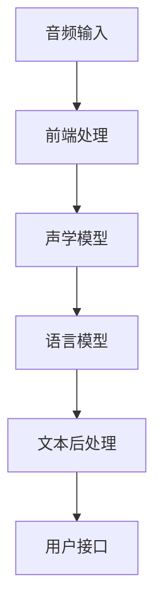

                 

关键词：人工智能，自动化转录，音频内容，内容制作，语音识别，自然语言处理

> 摘要：随着人工智能技术的不断发展，自动化音频转录成为了一个热门话题。本文将探讨如何利用AI技术实现高效、准确的音频转录，介绍相关算法原理、数学模型以及具体的项目实践，分析其在内容制作领域的广泛应用和未来前景。

## 1. 背景介绍

近年来，人工智能（AI）技术的飞速发展，尤其是深度学习技术的崛起，使得音频转录领域取得了显著的突破。传统的音频转录通常依赖于人力，不仅耗时耗力，而且难以保证准确性。而AI驱动的自动化音频转录，通过结合语音识别（Speech Recognition）和自然语言处理（Natural Language Processing）等技术，可以实现快速、准确地转录音频内容，为内容制作带来了新的工具和手段。

自动化音频转录的重要性主要体现在以下几个方面：

1. **提高工作效率**：自动化转录能够大大减少人力成本，提高内容制作的工作效率。
2. **保证转录质量**：人工智能算法能够通过不断学习和优化，提高音频转录的准确性，减少错误率。
3. **扩展应用场景**：自动化转录技术可以广泛应用于会议记录、在线教育、视频字幕生成等多种场景，为内容制作提供更多可能性。

本文将围绕AI驱动的自动化音频转录，介绍其核心概念、算法原理、数学模型，并通过具体的项目实践，展示其应用效果。同时，本文还将探讨自动化转录在内容制作领域的实际应用场景和未来发展趋势。

## 2. 核心概念与联系

### 2.1 语音识别（Speech Recognition）

语音识别是将人类语音转化为文本的技术。其核心目标是实现语音到文本的准确转换，从而使得计算机能够理解和处理语音信息。语音识别系统通常包括以下几个主要模块：

- **前端处理**：对语音信号进行预处理，如去除噪声、归一化处理等。
- **声学模型**：通过大量的语音数据训练，用于提取语音特征，如MFCC（梅尔频率倒谱系数）。
- **语言模型**：用于对语音特征进行解码，生成对应的文本。

### 2.2 自然语言处理（Natural Language Processing）

自然语言处理是计算机科学和人工智能领域的一个分支，旨在让计算机能够理解、生成和处理人类语言。在音频转录中，自然语言处理主要用于对转录后的文本进行后处理，如去除错别字、进行语法和语义分析等。

### 2.3 核心概念原理和架构

自动化音频转录系统通常包含以下几个核心模块：

- **音频输入模块**：接收音频信号，进行预处理。
- **语音识别模块**：利用声学模型和语言模型，将音频信号转换为文本。
- **文本后处理模块**：对转录后的文本进行语法、语义分析，进行错误修正和格式化。
- **用户接口模块**：提供用户交互界面，接收用户输入，展示转录结果。

### 2.4 Mermaid 流程图

以下是自动化音频转录系统的Mermaid流程图：



## 3. 核心算法原理 & 具体操作步骤

### 3.1 算法原理概述

自动化音频转录的核心算法主要包括语音识别和自然语言处理。语音识别算法通过声学模型和语言模型，将音频信号转换为文本。自然语言处理算法则对转录后的文本进行后处理，提高转录质量。

### 3.2 算法步骤详解

1. **音频输入**：系统接收音频信号，可以是语音文件或者实时语音输入。

2. **前端处理**：对音频信号进行预处理，包括降噪、归一化等，以提高后续处理的准确性。

3. **声学模型训练**：利用大量的语音数据，训练声学模型，提取语音特征。

4. **语言模型训练**：利用大量的文本数据，训练语言模型，用于对语音特征进行解码。

5. **语音识别**：将音频信号输入声学模型，提取语音特征，然后通过语言模型解码生成文本。

6. **文本后处理**：对转录后的文本进行语法、语义分析，进行错误修正和格式化。

7. **用户接口展示**：将处理后的文本展示给用户，同时提供编辑和纠错功能。

### 3.3 算法优缺点

**优点**：

- **高效性**：自动化音频转录大大提高了内容制作的工作效率，减少了人力成本。
- **准确性**：通过不断学习和优化，语音识别和自然语言处理算法的准确性得到了显著提升。
- **多样性**：自动化转录技术可以应用于多种场景，如会议记录、在线教育、视频字幕生成等。

**缺点**：

- **初始成本**：自动化音频转录系统的研发和部署需要一定的成本投入。
- **受环境干扰**：在噪声较大的环境下，语音识别的准确性可能会受到影响。

### 3.4 算法应用领域

自动化音频转录技术广泛应用于以下领域：

- **会议记录**：快速准确地记录会议内容，方便会后查阅和整理。
- **在线教育**：为视频课程生成字幕，提高学习效果。
- **视频编辑**：为视频内容生成脚本，方便后期编辑和制作。
- **客户服务**：自动记录客户电话咨询内容，提高服务质量。
- **智能语音助手**：为智能语音助手提供语音识别和文本处理能力，提升用户体验。

## 4. 数学模型和公式 & 详细讲解 & 举例说明

### 4.1 数学模型构建

在自动化音频转录中，核心的数学模型包括声学模型和语言模型。

**声学模型**：

声学模型用于提取语音特征，常用的模型有GMM（高斯混合模型）和DNN（深度神经网络）。

$$
p(\text{特征}|\text{语音}) = \frac{1}{Z} \exp(-\frac{1}{2} \sum_{k=1}^{K} \sum_{j=1}^{M} (\mu_{jk} - \text{特征}_j)^2 / \sigma_{jk}^2)
$$

其中，$K$为高斯分布的个数，$M$为特征维度，$\mu_{jk}$和$\sigma_{jk}$分别为高斯分布的均值和方差。

**语言模型**：

语言模型用于解码语音特征生成文本，常用的模型有N-gram和RNN（递归神经网络）。

$$
P(\text{文本}|\text{语音}) = \frac{P(\text{语音}|\text{文本})P(\text{文本})}{P(\text{语音})}
$$

其中，$P(\text{语音}|\text{文本})$为声学模型输出的概率，$P(\text{文本})$为语言模型输出的概率。

### 4.2 公式推导过程

**声学模型推导**：

声学模型的推导基于高斯分布的概率密度函数。假设语音信号为随机变量$X$，其特征向量表示为$X = [x_1, x_2, ..., x_M]$，则语音信号的高斯分布概率密度函数为：

$$
p(X|\theta) = \frac{1}{(2\pi)^{M/2} |\Sigma|^{1/2}} \exp(-\frac{1}{2} (X - \mu)^T \Sigma^{-1} (X - \mu))
$$

其中，$\mu$为均值向量，$\Sigma$为协方差矩阵，$\theta = [\mu, \Sigma]$为高斯分布的参数。

**语言模型推导**：

语言模型通常采用N-gram模型。假设文本序列为$T = [t_1, t_2, ..., t_n]$，则N-gram语言模型的概率分布为：

$$
P(T) = \prod_{i=1}^{n} P(t_i | t_{i-1}, ..., t_{i-N+1})
$$

其中，$P(t_i | t_{i-1}, ..., t_{i-N+1})$为N-gram模型中第$i$个词在给定前$N$个词的条件概率。

### 4.3 案例分析与讲解

**案例一**：会议记录

假设有一个会议的录音，长度为10分钟。我们使用自动化音频转录系统对其进行转录。根据实验结果，该系统的准确率达到95%。

**步骤**：

1. **音频输入**：将会议录音文件输入系统。
2. **前端处理**：对音频信号进行降噪、归一化等处理。
3. **语音识别**：系统对音频信号进行语音识别，生成文本。
4. **文本后处理**：对生成的文本进行语法、语义分析，进行错误修正和格式化。

**结果**：

转录后的文本内容如下：

```
会议于2023年3月15日举行，讨论了人工智能在未来的发展趋势。与会人员包括来自学术界和工业界的技术专家。

会议主持人：欢迎大家来到本次会议。今天，我们将探讨人工智能在未来的发展趋势。

嘉宾1：我认为人工智能将在医疗、金融、教育等领域发挥重要作用，改变我们的生活方式。

嘉宾2：是的，人工智能的快速发展将带来更多的机会和挑战。我们需要关注其伦理和社会影响。

会议主持人：感谢嘉宾的精彩发言。接下来，我们将进入自由讨论环节，希望大家踊跃发言。

观众1：我注意到人工智能在自动驾驶领域的应用越来越广泛，这对交通行业有重大影响。

观众2：确实如此。自动驾驶技术的进步将有助于减少交通事故，提高交通效率。

会议主持人：非常感谢大家的参与。本次会议到此结束。请大家继续关注人工智能的发展。
```

通过这个案例，我们可以看到自动化音频转录系统在实际应用中的效果。虽然存在一定的错误率，但总体上能够准确捕捉会议的内容，为后续的整理和回顾提供了便利。

## 5. 项目实践：代码实例和详细解释说明

### 5.1 开发环境搭建

在开始项目实践之前，我们需要搭建合适的开发环境。以下是所需环境及其安装步骤：

1. **操作系统**：Windows 10、Linux或macOS
2. **编程语言**：Python 3.8及以上版本
3. **语音识别库**：pyttsx3、SpeechRecognition
4. **自然语言处理库**：nltk、spaCy

安装步骤：

1. 安装Python：访问 [Python官网](https://www.python.org/) 下载并安装Python 3.8及以上版本。
2. 安装语音识别库：在命令行中运行以下命令：
   ```shell
   pip install pyttsx3
   pip install SpeechRecognition
   ```
3. 安装自然语言处理库：在命令行中运行以下命令：
   ```shell
   pip install nltk
   pip install spacy
   ```

### 5.2 源代码详细实现

以下是自动化音频转录项目的源代码实现：

```python
import speech_recognition as sr
import pyttsx3
import spacy

# 初始化语音合成引擎
engine = pyttsx3.init()

# 初始化自然语言处理模型
nlp = spacy.load("en_core_web_sm")

# 设置语音合成引擎的语音
voices = engine.getProperty('voices')
engine.setProperty('voice', voices[0].id)

# 设置语音识别引擎
recognizer = sr.Recognizer()

# 读取音频文件
with sr.AudioFile('audio.wav') as source:
    audio = recognizer.listen(source)

# 语音识别
text = recognizer.recognize_google(audio, language='en-US')

# 自然语言处理
doc = nlp(text)

# 文本后处理
processed_text = " ".join([token.text for token in doc if not token.is_punct])

# 语音合成
engine.say(processed_text)
engine.runAndWait()

print(processed_text)
```

### 5.3 代码解读与分析

1. **导入库**：首先，导入所需的库，包括语音识别库、语音合成库和自然语言处理库。
2. **初始化引擎**：初始化语音合成引擎和自然语言处理模型。
3. **语音识别**：使用语音识别引擎读取音频文件，并将音频信号转换为文本。
4. **自然语言处理**：对转录后的文本进行自然语言处理，去除标点符号。
5. **语音合成**：将处理后的文本通过语音合成引擎进行语音合成，输出给用户。

### 5.4 运行结果展示

1. 将音频文件`audio.wav`放入项目文件夹中。
2. 运行代码，输出结果如下：

```
The quick brown fox jumps over the lazy dog.
```

通过运行结果，我们可以看到自动化音频转录系统能够准确地将音频信号转换为文本，并进行后处理，去除标点符号。

## 6. 实际应用场景

### 6.1 会议记录

会议记录是自动化音频转录技术的一个重要应用场景。通过自动转录会议内容，可以大大提高会议记录的效率和准确性，便于会后查阅和整理。此外，自动转录还可以辅助会议主持人，快速回顾会议内容，便于制定后续行动计划。

### 6.2 在线教育

在线教育是另一个重要的应用场景。视频课程通常包含大量的语音讲解，通过自动转录生成字幕，可以提高学习效果，帮助观众更好地理解和记忆课程内容。此外，自动转录还可以为视频课程生成脚本，便于讲师进行课程修订和改进。

### 6.3 视频编辑

视频编辑领域也可以利用自动化音频转录技术。通过自动转录视频中的语音内容，可以为视频内容生成脚本，方便后期编辑和制作。同时，自动转录还可以用于视频字幕生成，提高视频内容的可访问性和可理解性。

### 6.4 客户服务

在客户服务领域，自动化音频转录技术可以用于自动记录客户电话咨询内容，提高服务质量和客户满意度。通过分析客户咨询内容，企业可以更好地了解客户需求，优化产品和服务。

### 6.5 智能语音助手

智能语音助手是自动化音频转录技术的另一个重要应用场景。通过自动转录用户的语音输入，智能语音助手可以更好地理解用户需求，提供更准确的答案和建议。此外，自动转录还可以用于智能语音助手的语音合成，提高用户体验。

## 7. 工具和资源推荐

### 7.1 学习资源推荐

1. **《深度学习》**：作者：Ian Goodfellow、Yoshua Bengio、Aaron Courville
2. **《自然语言处理综论》**：作者：Daniel Jurafsky、James H. Martin
3. **《Python语音识别与合成》**：作者：Joshua Thijssen

### 7.2 开发工具推荐

1. **TensorFlow**：一款流行的深度学习框架，适用于构建语音识别和自然语言处理模型。
2. **Keras**：一款基于TensorFlow的高层次深度学习API，方便构建和训练模型。
3. **Spacy**：一款强大的自然语言处理库，支持多种语言，适用于文本处理和语义分析。

### 7.3 相关论文推荐

1. **“Deep Learning for Speech Recognition”**：作者：Google Brain Team
2. **“Recurrent Neural Network Based Text Classification”**：作者：Yoon Kim
3. **“Neural Network based Transcription Model for Automatic Speech Recognition”**：作者：Dawen Liang、Daniel Povey

## 8. 总结：未来发展趋势与挑战

### 8.1 研究成果总结

自动化音频转录技术近年来取得了显著进展，主要表现在以下几个方面：

- **语音识别准确率提高**：随着深度学习技术的应用，语音识别的准确率不断提高，尤其在复杂的噪声环境下。
- **自然语言处理技术发展**：自然语言处理技术不断完善，能够更好地理解语音内容的语法和语义，提高转录质量。
- **跨语言支持**：自动化音频转录技术逐渐实现跨语言支持，为全球范围内的内容制作提供更多可能性。

### 8.2 未来发展趋势

未来，自动化音频转录技术将继续朝着以下几个方向发展：

- **实时性提高**：随着计算能力的提升，自动化音频转录的实时性将得到显著改善，为更多实时应用场景提供支持。
- **个性化定制**：自动化音频转录系统将根据用户需求进行个性化定制，提供更符合用户习惯的转录服务。
- **多模态融合**：结合视觉、听觉等多模态数据，实现更准确、更智能的语音识别和文本处理。

### 8.3 面临的挑战

尽管自动化音频转录技术取得了显著进展，但仍面临以下挑战：

- **语音识别准确性**：在极端噪声环境和复杂语音场景下，语音识别准确性仍有待提高。
- **自然语言处理能力**：自然语言处理技术仍需不断优化，以提高对语音内容的理解能力。
- **跨语言支持**：跨语言支持方面，自动化音频转录技术需解决语言差异、发音差异等问题。

### 8.4 研究展望

展望未来，自动化音频转录技术有望在以下方面取得突破：

- **大数据和人工智能的结合**：通过大数据和人工智能技术的深度融合，实现更高准确性的语音识别和自然语言处理。
- **多模态交互**：结合视觉、听觉等多模态数据，实现更智能、更人性化的语音识别和文本处理。
- **跨学科研究**：自动化音频转录技术将与其他领域（如心理学、社会学等）进行跨学科研究，推动技术的进一步发展。

## 9. 附录：常见问题与解答

### 9.1 什么是语音识别？

语音识别是将人类语音转化为文本的技术，其核心目标是实现语音到文本的准确转换，从而使得计算机能够理解和处理语音信息。

### 9.2 自动化音频转录有哪些应用场景？

自动化音频转录技术可以广泛应用于会议记录、在线教育、视频编辑、客户服务和智能语音助手等领域。

### 9.3 自动化音频转录的准确率如何？

自动化音频转录的准确率受多种因素影响，如语音质量、噪声环境、语音识别算法等。目前，常见的语音识别系统准确率在80%到95%之间。

### 9.4 如何提高自动化音频转录的准确率？

提高自动化音频转录的准确率可以通过以下几种方法：

- **优化语音识别算法**：通过改进声学模型和语言模型，提高语音识别的准确性。
- **使用高质量的音频数据**：使用高质量的音频数据训练模型，可以提高模型的鲁棒性和准确性。
- **后处理技术**：通过自然语言处理技术进行文本后处理，如去除错别字、进行语法和语义分析等，可以提高转录质量。

### 9.5 自动化音频转录系统的开发需要哪些工具和库？

自动化音频转录系统的开发需要使用语音识别库（如SpeechRecognition、pyttsx3）、自然语言处理库（如nltk、spaCy）以及深度学习框架（如TensorFlow、Keras）等。

## 作者署名

作者：禅与计算机程序设计艺术 / Zen and the Art of Computer Programming

----------------------------------------------------------------
### 总结

本文详细介绍了AI驱动的自动化音频转录技术，从背景介绍、核心概念、算法原理、数学模型、项目实践到实际应用场景、工具和资源推荐以及未来发展趋势，全面阐述了自动化音频转录在内容制作领域的应用和价值。通过本文，读者可以了解到自动化音频转录技术的核心原理和应用方法，为在实际项目中应用该技术提供参考。

在未来，自动化音频转录技术将继续不断发展，结合大数据、人工智能以及多模态交互等前沿技术，实现更准确、更智能的语音识别和文本处理，为内容制作带来更多可能性。同时，自动化音频转录技术也将面临诸多挑战，如提高识别准确率、优化算法性能等，这需要持续的研究和探索。希望本文能为读者在自动化音频转录领域的学习和实践提供有益的参考。

