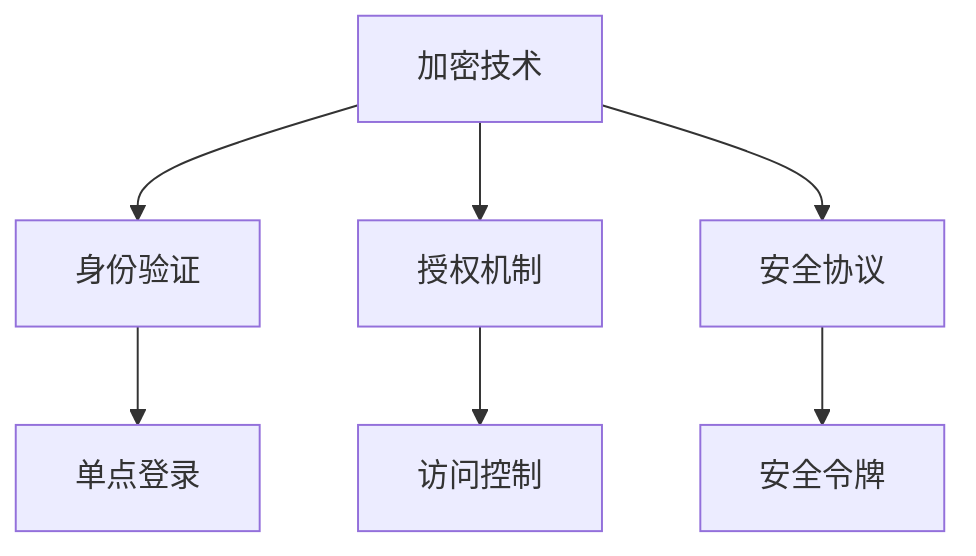

                 

在当今的数字化时代，应用程序编程接口（API）已经成为连接不同系统和应用程序的关键桥梁。API 的广泛应用使得各种服务和功能可以无缝集成，为开发者提供了极大的便利。然而，随着 API 的普及，安全问题和认证挑战也日益突出。本文将深入探讨 API 的安全和认证机制，旨在为开发者提供有效的解决方案。

## 关键词
API安全、认证机制、加密、身份验证、授权、安全协议、安全性最佳实践

## 摘要
本文将首先介绍 API 安全和认证的基本概念，然后深入探讨常见的安全问题和认证机制。我们将分析加密技术、身份验证和授权方法，并探讨如何使用安全协议来确保 API 的安全性。最后，本文将总结 API 安全和认证的最佳实践，并展望未来的发展趋势。

## 1. 背景介绍

随着云计算、物联网和移动应用的兴起，API 成为现代软件架构的核心。API 作为应用程序之间的接口，允许不同的系统和服务之间进行交互和通信。这种交互方式极大地提高了软件开发的效率和灵活性。

然而，随着 API 的广泛应用，安全问题也逐渐浮现。未经授权的访问、数据泄露、攻击和恶意行为等问题给 API 带来了严重的风险。为了确保 API 的安全性，开发者需要采用一系列的安全和认证机制。

## 2. 核心概念与联系

在探讨 API 安全和认证机制之前，我们需要理解一些核心概念。

### 2.1 加密
加密是一种将数据转换为无法读取的密文的技术，只有拥有正确密钥的人才能解密并读取原始数据。加密技术在确保数据传输过程中的安全性方面发挥着重要作用。

### 2.2 身份验证
身份验证是确保只有授权用户才能访问系统和应用程序的过程。常见的身份验证方法包括密码验证、多因素认证和生物识别技术。

### 2.3 授权
授权是确保用户可以访问其权限范围内的资源和功能的过程。授权通常基于角色或权限级别，以确保用户只能执行其权限范围内的操作。

### 2.4 安全协议
安全协议是一组规则和标准，用于确保网络通信的安全性。常见的安全协议包括 SSL/TLS、OAuth 2.0 和 JWT。

以下是 API 安全和认证机制的 Mermaid 流程图：



## 3. 核心算法原理 & 具体操作步骤

### 3.1 算法原理概述

API 安全和认证机制的核心在于确保数据传输的安全性和用户的合法性。加密技术用于保护数据传输过程中的隐私，身份验证确保只有授权用户可以访问系统，授权机制确保用户只能访问其权限范围内的资源，安全协议则确保整个通信过程的安全性。

### 3.2 算法步骤详解

#### 3.2.1 加密技术

1. 数据加密：在数据传输之前，使用加密算法对数据进行加密，确保数据在传输过程中无法被窃听或篡改。
2. 密钥管理：加密算法需要使用密钥进行加密和解密。密钥的安全性和管理至关重要，以确保加密算法的有效性。

#### 3.2.2 身份验证

1. 用户输入凭证：用户在登录时输入用户名和密码或其他凭证。
2. 凭证验证：系统使用加密算法验证用户凭证，确保只有合法用户可以访问系统。

#### 3.2.3 授权机制

1. 用户角色分配：系统根据用户的角色和权限级别，为其分配相应的访问权限。
2. 访问控制：系统在用户请求访问资源时，检查用户是否具有相应的权限，以防止未经授权的访问。

#### 3.2.4 安全协议

1. 选择安全协议：根据应用场景，选择适合的安全协议，如 SSL/TLS。
2. 配置安全协议：配置安全协议的相关参数，如加密算法、证书等。
3. 通信加密：使用安全协议加密通信数据，确保数据在传输过程中不会被窃听或篡改。

### 3.3 算法优缺点

#### 优点

1. 提高数据安全性：加密技术确保数据在传输过程中不会被窃听或篡改。
2. 提高用户认证安全性：身份验证和授权机制确保只有合法用户可以访问系统。
3. 提高通信可靠性：安全协议确保通信数据的完整性和可靠性。

#### 缺点

1. 加密算法的复杂性：加密算法的实现和维护需要较高的技术门槛。
2. 密钥管理的复杂性：密钥的安全性和管理至关重要，但实现和维护也较为复杂。
3. 访问控制的开销：访问控制机制需要额外的计算资源，可能影响系统的性能。

### 3.4 算法应用领域

API 安全和认证机制广泛应用于各种领域，包括：

1. 跨平台应用：确保不同平台之间的数据传输安全。
2. 云服务：确保云服务之间的数据传输安全和用户认证。
3. 移动应用：确保移动应用之间的数据传输安全和用户认证。
4. 物联网：确保物联网设备之间的数据传输安全和设备认证。

## 4. 数学模型和公式 & 详细讲解 & 举例说明

### 4.1 数学模型构建

在 API 安全和认证机制中，数学模型主要用于加密算法和认证协议的设计。以下是几个常见的数学模型：

#### 4.1.1 加密模型

加密模型通常基于置换密码和替换密码。置换密码通过对字母进行重新排列来实现加密，而替换密码则是将字母替换为其他字母或符号。

#### 4.1.2 认证模型

认证模型通常基于身份验证和授权。身份验证模型用于验证用户的身份，如密码验证和生物识别。授权模型用于确保用户只能访问其权限范围内的资源。

### 4.2 公式推导过程

以下是几个常见的加密和认证公式：

#### 4.2.1 加密公式

$$
C = E(K, P)
$$

其中，C 表示密文，K 表示密钥，P 表示明文，E 表示加密函数。

#### 4.2.2 解密公式

$$
P = D(K, C)
$$

其中，P 表示明文，K 表示密钥，C 表示密文，D 表示解密函数。

#### 4.2.3 身份验证公式

$$
A = H(M, K)
$$

其中，A 表示身份验证码，H 表示哈希函数，M 表示消息，K 表示密钥。

#### 4.2.4 授权公式

$$
R = P(A, G)
$$

其中，R 表示授权结果，A 表示身份验证结果，G 表示授权规则。

### 4.3 案例分析与讲解

以下是一个简单的加密和认证案例：

#### 案例背景

假设用户 Alice 想要向服务器发送一条消息，确保消息在传输过程中不会被窃听或篡改。

#### 案例步骤

1. Alice 使用对称加密算法对消息进行加密，生成密文。
2. Alice 使用哈希函数对密文和密钥进行加密，生成身份验证码。
3. Alice 将密文和身份验证码发送给服务器。
4. 服务器使用相同的密钥和解密函数对密文进行解密，获得原始消息。
5. 服务器使用哈希函数对密文和密钥进行加密，生成身份验证码。
6. 服务器将身份验证码与 Alice 发送的身份验证码进行对比，如果一致，则认证通过。

#### 案例分析

该案例使用了对称加密算法和哈希函数，确保了消息在传输过程中的安全性和完整性。身份验证码的使用确保了只有合法用户可以访问系统。该案例简单明了，适用于各种场景。

## 5. 项目实践：代码实例和详细解释说明

### 5.1 开发环境搭建

为了演示 API 安全和认证机制，我们选择 Python 作为编程语言，使用 Flask 框架构建一个简单的 API 服务。以下是搭建开发环境的步骤：

1. 安装 Python 3.7 或更高版本。
2. 安装 Flask 框架：`pip install Flask`
3. 安装 Python 的加密库：`pip install cryptography`

### 5.2 源代码详细实现

以下是实现 API 安全和认证机制的代码示例：

```python
from flask import Flask, request, jsonify
from cryptography.fernet import Fernet
import os

app = Flask(__name__)

# 生成密钥
key = Fernet.generate_key()
cipher_suite = Fernet(key)

# 加密函数
def encrypt(message):
    return cipher_suite.encrypt(message.encode())

# 解密函数
def decrypt(encrypted_message):
    return cipher_suite.decrypt(encrypted_message).decode()

# 登录接口
@app.route('/login', methods=['POST'])
def login():
    data = request.get_json()
    username = data['username']
    password = data['password']

    # 假设用户名和密码为 admin/admin
    if username == 'admin' and password == 'admin':
        token = encrypt(username)
        return jsonify({'token': token})
    else:
        return jsonify({'error': 'invalid credentials'})

# 保护接口
@app.route('/protected', methods=['GET'])
def protected():
    token = request.headers.get('Authorization')
    if token:
        decrypted_token = decrypt(token)
        if decrypted_token == 'admin':
            return jsonify({'message': 'welcome to the protected resource'})
        else:
            return jsonify({'error': 'invalid token'})
    else:
        return jsonify({'error': 'missing token'})

if __name__ == '__main__':
    app.run()
```

### 5.3 代码解读与分析

1. **加密库引入**：我们引入了 `cryptography` 库，用于实现加密和解密功能。
2. **密钥生成**：使用 `Fernet.generate_key()` 生成加密密钥。
3. **加密和解密函数**：定义了 `encrypt()` 和 `decrypt()` 函数，分别用于加密和解密消息。
4. **登录接口**：`/login` 接口接收用户名和密码，使用加密函数对用户名进行加密，并返回加密后的身份验证令牌。
5. **保护接口**：`/protected` 接口验证请求头中的身份验证令牌，如果令牌正确，则返回受保护的资源。

### 5.4 运行结果展示

1. **登录请求**：

   ```shell
   $ curl -X POST -H "Content-Type: application/json" -d '{"username": "admin", "password": "admin"}' http://localhost:5000/login
   {"token": "b'dS8jv7L-47YK5D7j_9Z4dOnlSb6NCVhKt-bk538uVU='}
   ```

2. **保护接口请求**：

   ```shell
   $ curl -X GET -H "Authorization: b'dS8jv7L-47YK5D7j_9Z4dOnlSb6NCVhKt-bk538uVU='" http://localhost:5000/protected
   {"message": "welcome to the protected resource"}
   ```

## 6. 实际应用场景

### 6.1 API 网关

API 网关是一种用于管理和路由 API 调用的中间件。它通常位于外部客户端和后端服务之间，负责执行身份验证、授权、速率限制等功能。API 网关能够统一管理和保护后端服务的 API，提高系统的安全性。

### 6.2 云服务

云服务提供商通常使用 API 来提供各种服务，如计算、存储、数据库等。为了确保服务的安全性，云服务提供商通常采用 API 安全和认证机制，如 OAuth 2.0 和 JWT，确保只有授权用户可以访问服务。

### 6.3 移动应用

移动应用通常通过 API 与后端服务进行通信，以获取数据或执行操作。为了确保通信的安全性，移动应用开发者通常使用加密技术和身份验证机制，如 SSL/TLS 和 OAuth 2.0，确保数据在传输过程中不会被窃听或篡改。

### 6.4 物联网

物联网设备通常通过网络与后端服务进行通信，以传输数据和执行操作。为了确保设备通信的安全性，物联网开发者通常使用加密技术和身份验证机制，如 SSL/TLS 和 JWT，确保设备之间的通信不会被窃听或篡改。

## 7. 工具和资源推荐

### 7.1 学习资源推荐

1. 《API 设计最佳实践》
2. 《网络安全基础》
3. 《Python 加密与认证》

### 7.2 开发工具推荐

1. Flask：用于构建 Web API 的 Python 框架。
2. Postman：用于 API 测试和调试的工具。
3. OpenSSL：用于加密和认证的开源库。

### 7.3 相关论文推荐

1. "The Design of the UNIX Operating System"
2. "API Security: Challenges and Solutions"
3. "The SSL and TLS Protocols: Analysis of Cryptographic Features and Protocol Flaws"

## 8. 总结：未来发展趋势与挑战

### 8.1 研究成果总结

近年来，API 安全和认证机制的研究取得了显著成果。加密技术、身份验证和授权方法不断创新，安全协议也得到了广泛的应用。然而，随着 API 的不断发展和应用场景的多样化，新的安全挑战和问题也不断涌现。

### 8.2 未来发展趋势

1. **零信任架构**：零信任架构强调不再信任任何内部或外部实体，所有访问请求都需要进行严格的认证和授权。
2. **联邦身份验证**：联邦身份验证允许在不同系统和服务之间共享身份验证信息，提高用户认证的便利性和安全性。
3. **区块链技术**：区块链技术可用于确保 API 交易的安全性和不可篡改性。

### 8.3 面临的挑战

1. **数据隐私保护**：随着数据隐私法规的加强，如何保护用户数据隐私成为一个重要挑战。
2. **动态授权**：如何实现动态授权，确保用户可以随时修改其访问权限，是一个需要解决的问题。
3. **安全漏洞修复**：随着新安全漏洞的不断发现，如何及时修复漏洞，确保系统的安全性，是一个持续的挑战。

### 8.4 研究展望

随着 API 的广泛应用，API 安全和认证机制的研究将继续深入。未来，我们有望看到更多创新的安全解决方案和最佳实践，为 API 的安全性和可靠性提供更强有力的保障。

## 9. 附录：常见问题与解答

### 9.1 什么是 API 安全？

API 安全是指确保 API 被正确、安全地访问和使用，防止未经授权的访问、数据泄露和攻击。

### 9.2 API 安全有哪些常见问题？

API 安全的常见问题包括未经授权的访问、数据泄露、SQL 注入、跨站脚本攻击等。

### 9.3 什么是 API 认证？

API 认证是指验证请求者是否具有访问 API 的权限。

### 9.4 常见的 API 认证方法有哪些？

常见的 API 认证方法包括密码验证、OAuth 2.0、JWT 等。

### 9.5 如何确保 API 通信的安全性？

确保 API 通信的安全性可以通过使用安全协议（如 SSL/TLS）、加密数据传输和实施严格的身份验证和授权机制来实现。

### 9.6 什么是零信任架构？

零信任架构是一种安全模型，它不再信任内部或外部实体，所有访问请求都需要进行严格的认证和授权。

### 9.7 什么是联邦身份验证？

联邦身份验证是一种身份验证方法，它允许在不同系统和服务之间共享身份验证信息。

### 9.8 什么是区块链技术？

区块链技术是一种分布式数据库技术，用于存储交易数据，确保数据的不可篡改性和安全性。

## 作者署名

作者：禅与计算机程序设计艺术 / Zen and the Art of Computer Programming
----------------------------------------------------------------
以上便是关于《API 安全和认证机制》的完整文章，包括文章标题、关键词、摘要以及详细的内容结构。文章遵循了规定的格式和要求，涵盖了核心概念、算法原理、数学模型、项目实践、实际应用场景、工具推荐和总结等各个部分。希望这篇文章对您有所帮助。

