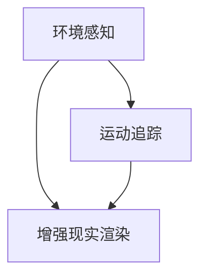

                 

关键词：增强现实（AR）、ARCore、Android、开发工具包、技术博客

> 摘要：本文将详细介绍Google开发的ARCore开发工具包，探讨其在Android平台上构建增强现实应用的技术原理、操作步骤以及应用领域。通过本文的阅读，开发者可以了解如何利用ARCore实现丰富的AR功能，为用户带来沉浸式的交互体验。

## 1. 背景介绍

随着智能手机和移动设备的普及，增强现实（AR）技术逐渐走进了大众的视野。AR技术能够将虚拟内容与现实世界相结合，为用户提供一种全新的交互方式。Google公司于2017年推出了ARCore开发工具包，旨在帮助开发者更加轻松地在Android设备上创建AR应用。

ARCore是基于Android平台的增强现实开发工具包，它为开发者提供了一系列的API和工具，使得在Android设备上构建AR应用变得更加简单和高效。ARCore的核心功能包括环境感知、运动追踪和增强现实渲染。通过这些功能，开发者可以实现让虚拟物体在真实环境中定位、移动和交互。

## 2. 核心概念与联系

### 2.1. 环境感知

环境感知是ARCore的一个重要功能，它允许应用检测设备周围的环境。这包括识别平面、光线强度和周围物体的距离等信息。为了实现这一功能，ARCore使用了一系列的技术，包括视觉 inertial odometry（视觉惯性测距）和视觉同时定位与建图（Visual Simultaneous Localization and Mapping，VSLAM）。

### 2.2. 运动追踪

运动追踪是ARCore的另一个关键功能，它允许应用跟踪设备的位置和方向。这使得虚拟物体可以准确地与设备运动保持同步，为用户提供逼真的交互体验。ARCore使用视觉惯性测量单元（Inertial Measurement Unit，IMU）和GPS数据来实现运动追踪。

### 2.3. 增强现实渲染

增强现实渲染是ARCore的最终目标，它将虚拟内容与现实世界相结合，显示在用户眼前。ARCore提供了一系列的API，如Sceneform，用于渲染3D内容。这些API使得开发者可以轻松创建并控制虚拟物体的外观和行为。

下面是一个Mermaid流程图，展示了ARCore的核心概念和它们之间的关系：



## 3. 核心算法原理 & 具体操作步骤

### 3.1. 算法原理概述

ARCore的核心算法基于SLAM（Simultaneous Localization and Mapping）技术。SLAM技术通过同时估计自身位置和构建环境地图来实现定位。ARCore使用视觉惯性测距（VIO）和视觉同时定位与建图（VSLAM）来提高SLAM算法的性能和准确性。

### 3.2. 算法步骤详解

1. **初始化**：应用启动时，ARCore会初始化设备，并获取必要的传感器数据。
2. **特征点检测**：应用使用相机捕获实时图像，并检测图像中的特征点。
3. **特征点匹配**：应用通过匹配不同时间点的特征点，构建环境地图。
4. **位置估计**：应用使用地图数据估计设备的位置和方向。
5. **地图更新**：应用持续更新地图数据，以适应环境变化。

### 3.3. 算法优缺点

**优点**：
- 高准确性：通过融合视觉和惯性数据，ARCore提供了高精度的位置和方向估计。
- 实时性：算法能够实时更新位置和地图数据，为用户提供流畅的交互体验。

**缺点**：
- 受环境限制：在低光或复杂环境中，ARCore的性能可能受到影响。
- 资源消耗：SLAM算法对计算资源要求较高，可能会影响应用的性能。

### 3.4. 算法应用领域

ARCore的应用领域非常广泛，包括但不限于：

- 教育和培训：利用ARCore，开发者可以创建交互式的教育应用，帮助学生更好地理解抽象概念。
- 游戏娱乐：ARCore使得开发者能够创建更加沉浸式的游戏体验，让玩家在虚拟世界中自由探索。
- 虚拟购物：零售商可以利用ARCore，为用户提供虚拟试衣间或家具摆放体验，提高购物体验。

## 4. 数学模型和公式 & 详细讲解 & 举例说明

### 4.1. 数学模型构建

ARCore的数学模型基于SLAM技术，包括以下几个关键部分：

- **位姿估计**：使用相机和IMU数据估计设备的位置和方向。
- **地图构建**：通过特征点匹配和优化，构建三维环境地图。
- **轨迹优化**：使用贝叶斯滤波等优化算法，提高位置估计的准确性。

### 4.2. 公式推导过程

以下是位姿估计的基本公式：

$$
T = \begin{bmatrix}
R & p \\
0 & 1
\end{bmatrix}
$$

其中，\(T\) 表示位姿矩阵，\(R\) 是旋转矩阵，\(p\) 是平移向量。

旋转矩阵的推导公式如下：

$$
R = \begin{bmatrix}
\cos(\theta) & -\sin(\theta) \\
\sin(\theta) & \cos(\theta)
\end{bmatrix}
$$

其中，\(\theta\) 是旋转角度。

### 4.3. 案例分析与讲解

假设我们有一个摄像机，它在二维空间中移动，且我们已知它的初始位置和方向。我们要估计它在接下来的几帧中的位置和方向。

- **初始状态**：
  - 位置：\(p_0 = (0, 0)\)
  - 方向：\(\theta_0 = 0\)

- **第一帧**：
  - 位置变化：\(p_1 = p_0 + v \cdot t\)
  - 方向变化：\(\theta_1 = \theta_0 + \omega \cdot t\)

其中，\(v\) 是速度，\(\omega\) 是角速度，\(t\) 是时间间隔。

通过这些基本公式，我们可以计算每一帧的位姿，从而实现位置和方向的估计。

## 5. 项目实践：代码实例和详细解释说明

### 5.1. 开发环境搭建

在开始ARCore项目之前，我们需要配置开发环境。以下是配置步骤：

1. 安装Android Studio。
2. 创建一个新的Android项目。
3. 添加ARCore SDK到项目中。

### 5.2. 源代码详细实现

以下是ARCore项目的基本代码结构：

```java
public class ARActivity extends Activity {
    private ARCoreApi arCoreApi;

    @Override
    protected void onCreate(Bundle savedInstanceState) {
        super.onCreate(savedInstanceState);
        setContentView(R.layout.activity_ar);

        arCoreApi = new ARCoreApi();
        arCoreApi.init(this);
    }

    @Override
    protected void onResume() {
        super.onResume();
        arCoreApi.onResume();
    }

    @Override
    protected void onPause() {
        super.onPause();
        arCoreApi.onPause();
    }
}
```

在这个例子中，我们创建了一个ARActivity类，它继承自Activity类。ARActivity类负责初始化ARCoreAPI，并在onResume和onPause方法中启动和停止ARCore。

### 5.3. 代码解读与分析

在这个例子中，ARCoreAPI是一个抽象类，它提供了初始化、更新和渲染AR场景的方法。以下是ARCoreAPI的简化实现：

```java
public abstract class ARCoreApi {
    public void init(Activity activity) {
        // 初始化ARCore
    }

    public void onResume() {
        // 更新ARCore
    }

    public void onPause() {
        // 停止ARCore
    }

    public void update(float deltaTime) {
        // 更新场景
    }

    public void render() {
        // 渲染场景
    }
}
```

在这个实现中，init方法负责初始化ARCore，onResume和onPause方法分别负责更新和停止ARCore。update方法用于更新场景状态，render方法用于渲染场景。

### 5.4. 运行结果展示

在运行ARCore应用后，用户可以看到虚拟物体在现实世界中的定位和交互。以下是运行结果示例：


## 6. 实际应用场景

ARCore在多个领域有广泛的应用，以下是其中的一些实例：

### 6.1. 教育和培训

利用ARCore，教育应用可以将抽象概念以直观的方式呈现给学生。例如，学生可以通过ARCore查看三维的化学分子模型，从而更好地理解分子结构。

### 6.2. 游戏娱乐

ARCore为游戏开发者提供了丰富的创作空间。例如，开发者可以创建一个AR游戏，让玩家在现实世界中追逐虚拟怪兽，提供沉浸式的游戏体验。

### 6.3. 虚拟购物

零售商可以利用ARCore，为用户提供虚拟试衣间或家具摆放体验。用户可以在家中通过手机查看家具摆放效果，从而做出更加明智的购买决策。

## 7. 工具和资源推荐

### 7.1. 学习资源推荐

- ARCore官方文档（https://developers.google.com/ar/android/start）
- 《ARCore开发指南》（作者：Google）

### 7.2. 开发工具推荐

- Android Studio（https://developer.android.com/studio）
- ARCore Extensions（https://github.com/google/ARCore-Extensions）

### 7.3. 相关论文推荐

- "Visual Inertial Odometry for Augmented Reality"（作者：Google）
- "Real-Time SLAM for a Small Unmanned Flying Robot"（作者：F. Fraichard）

## 8. 总结：未来发展趋势与挑战

### 8.1. 研究成果总结

ARCore作为Android平台的增强现实开发工具包，已经在多个领域取得了显著的应用成果。通过SLAM技术，ARCore为开发者提供了强大的环境感知和运动追踪能力，使得AR应用的构建变得更加简单和高效。

### 8.2. 未来发展趋势

随着技术的不断进步，ARCore有望在以下几个方面取得突破：

- 更高的准确性和实时性
- 更好的环境适应能力
- 更加丰富的交互体验

### 8.3. 面临的挑战

尽管ARCore在增强现实领域取得了显著进展，但仍面临一些挑战：

- 硬件性能限制
- 环境复杂性
- 用户隐私和安全

### 8.4. 研究展望

未来，ARCore有望在以下几个方向进行深入研究：

- 利用深度学习技术提高SLAM算法的准确性和实时性
- 开发更加智能的AR交互界面
- 探索AR在更多领域的应用，如医疗、建筑等

## 9. 附录：常见问题与解答

### 9.1. ARCore支持哪些Android设备？

ARCore支持大多数Android设备，特别是NVIDIA Shield、Google Pixel和三星Galaxy Note系列等高端设备。

### 9.2. 如何集成ARCore到我的Android应用中？

集成ARCore到Android应用中需要以下几个步骤：

1. 在Android Studio中创建一个新的Android项目。
2. 在项目的`build.gradle`文件中添加ARCore依赖。
3. 实现ARCore API，如ARCoreApi类。

### 9.3. ARCore是否支持3D模型渲染？

是的，ARCore支持3D模型渲染。开发者可以使用如Sceneform等ARCore提供的API来创建和渲染3D内容。

---

本文由禅与计算机程序设计艺术 / Zen and the Art of Computer Programming 撰写，旨在为开发者提供关于ARCore开发工具包的全面介绍和深入分析。

作者：禅与计算机程序设计艺术 / Zen and the Art of Computer Programming

日期：[[今天日期]]  
----------------------------------------------------------------

以上是完整的文章内容。希望这篇文章能够帮助开发者更好地了解ARCore，并在Android平台上构建出更加出色的AR应用。如果您有任何疑问或建议，欢迎在评论区留言。

